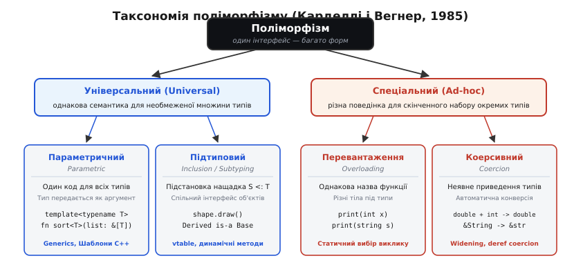
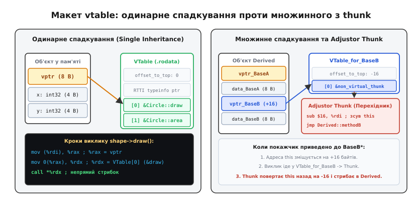
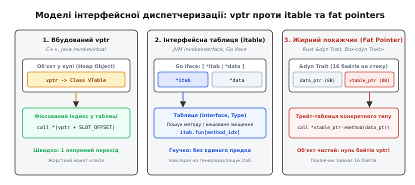
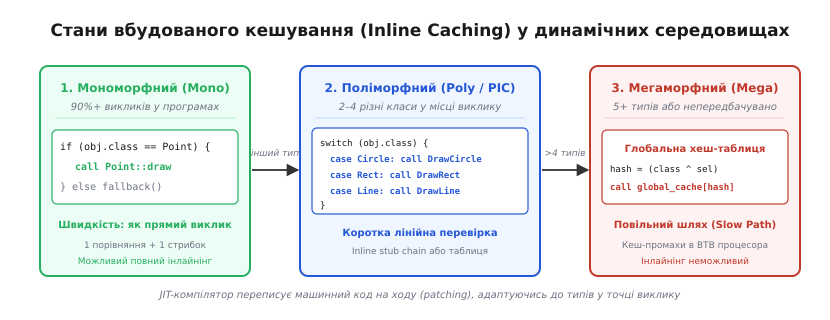

# Поліморфізм і динамічне зв'язування

<preknowlist>
- [Компіляція](root:sf-lang/compilation) — трансляція вихідного тексту в машинний двійковий файл і розв'язання адрес.
- [ABI та угоди про виклик](root:sf-lang/abi-calling-convention) — регістри, стек, покажчик кадру та передача аргументів.
- [Абстракції без витрат](root:sf-lang/zero-cost-abstractions) — шаблони, мономорфізація та вбудовування функцій.
- [Оптимізації компілятора](root:sf-lang/compiler-optimizations) — інлайнінг, аналіз потоку керування та усунення мертвого коду.
</preknowlist>

Коли програма викликає звичайну функцію `calculate_sum(a, b)`, компілятор точно знає адресу цільового коду ще на етапі збирання. Він генерує інструкцію прямого переходу `CALL rel32`, де зміщення точки входу зашите в саму машинну команду. Але коли графічний редактор обробляє масив фігур `shapes[i]->draw()`, конкретний тип кожного об'єкта стає відомим лише під час виконання: користувач міг створити коло, прямокутник або завантажити новий плагін із довільною фігурою через мережу. Прямого переходу за фіксованою адресою тут бути не може, бо для кола потрібно стрибнути в один блок коду, а для прямокутника — в інший.

Щоб один і той самий рядок коду міг взаємодіяти з даними різної форми, у мови програмування вбудовують **поліморфізм** (гр. *polýmorphos* — багатоформний, від *polýs* — численний + *morphḗ* — форма, вигляд). За цією високорівневою концепцією стоїть конкретний низькорівневий механізм — **динамічне зв'язування** (англ. *dynamic dispatch* або *late binding*), яке підміняє прямий стрибок на читання адреси з пам'яті під час роботи програми. Розуміння того, як цей механізм влаштований на рівні байтів, регістрів та кеш-ліній процесора, пояснює фундаментальні компроміси між швидкістю виконання, споживанням оперативної пам'яті та гнучкістю архітектури.

## Анатомія багатоформності: таксономія Карделлі-Вегнера

Термін «поліморфізм» у програмуванні тривалий час вживався без чіткого визначення: розробники функційних мов мали на увазі узагальнені типи, прихильники об'єктно-орієнтованого підходу — віртуальні методи, а системні програмісти — перевантаження операторів. Навести математичний лад у цих поняттях вдалося у 1985 році, коли Лука Карделлі та Пітер Вегнер опублікували фундаментальну класифікацію, деталі створення якої розглядає [історичний огляд класифікації Карделлі-Вегнера](root:sf-lang/polymorphism/hist-cardelli-wegner.md).

Карделлі та Вегнер розділили всі прояви поліморфізму на дві великі гілки: **універсальний** та **спеціальний (ad-hoc)**.


*Таксономія поліморфізму Карделлі-Вегнера: універсальний поліморфізм реалізує однакову логіку над необмеженим набором типів, тоді як спеціальний (ad-hoc) спирається на окремі реалізації для кожного конкретного типу.*

### 1. Спеціальний поліморфізм (Ad-hoc)

Слово *ad-hoc* (лат. «до цього випадку», «спеціально для цієї мети») вказує на те, що поліморфна поведінка не має єдиного фундаментального правила для всіх типів, а конструюється індивідуально для кожного випадку. До цієї категорії належать два механізми:

- **Перевантаження функцій та операторів (Overloading).** Кілька цілком незалежних функцій мають однакове ім'я в тексті програми, але приймають різні типи аргументів. Компілятор аналізує типи параметрів у місці виклику і статично підставляє виклик конкретної функції. У машинному коді це абсолютно різні підпрограми з різними адресами; компілятор просто дописує інформацію про типи до імені функції (процес декорування імен, англ. *name mangling*). Жодної спільної семантики мова не вимагає: функція `print(int)` може друкувати число на консоль, а `print(Document)` — надсилати завдання на мережевий принтер.
- **Коерсивний поліморфізм (Coercion / Type Coercion).** Операція визначена лише для одного конкретного типу, але мова дозволяє передавати значення інших типів, автоматично вставляючи машинний код перетворення даних. Коли ви пишете `3.14 + 2`, оператор додавання з плаваючою комою отримує `int`, але компілятор неявно перетворює двійкове представлення `2` на представлення IEEE 754 `2.0`. Сама операція залишається суто мономорфною: поліморфізм тут є ілюзією, створеною автоматичною конверсією аргументів.

### 2. Універсальний поліморфізм (Universal)

Універсальний поліморфізм виконує однаковий алгоритм над потенційно необмеженою множиною типів, зберігаючи спільну логічну структуру:

- **Параметричний поліморфізм (Parametric Polymorphism).** Функція або структура даних описується узагальнено, де тип виступає як параметр (дженерики в Java/C#/Rust, шаблони в C++, параметричні модулі в ML). Один і той самий код працює для будь-якого типу без модифікації логіки. Наприклад, алгоритм розвороту зв'язного списку переставляє покажчики на вузли однаково, незалежно від того, чи зберігаються у вузлах цілі числа, рядки чи масиви.
- **Підтиповий поліморфізм / поліморфізм включення (Subtyping / Inclusion Polymorphism).** Значення належить багатьм типам одночасно завдяки відношенню підтипу `S <: T` (читається «S є підтипом T»). Якщо функція очікує аргумент типу `T`, їй можна безпечно передати будь-який екземпляр підтипу `S`. Це пряме втілення принципу підстановки Лісков (англ. *Liskov Substitution Principle*, LSP): об'єкт-нащадок повністю задовольняє контракт базового типу.

> 🔧 **Навіщо це.** Розрізнення чотирьох видів поліморфізму позбавляє архітектурних помилок при проєктуванні інтерфейсів. Якщо вам потрібен однаковий алгоритм без накладних витрат у пам'яті — обирають параметричний поліморфізм (шаблони). Якщо потрібно обробляти змішані колекції об'єктів, створених у динаміці, — застосовують підтиповий поліморфізм через динамічне зв'язування.

## Статичне проти динамічного зв'язування

Зв'язування (англ. *dispatch* або *binding*) — це процес вибору конкретної ділянки машинного коду, яка має виконатися у відповідь на виклик функції чи методу. Головна різниця між статичним і динамічним зв'язуванням полягає в **моменті ухвалення рішення**:

```
Статичне зв'язування:  Вихідний код  ──[Компілятор/Лінкер]──>  Фіксована адреса CALL 0x401020
Динамічне зв'язування:  Вихідний код  ──[Час виконання]────────>  Читання покажчика CALL *%rax
```

### Статичне зв'язування (раннє зв'язування)

При статичному зв'язуванні адреса цільової функції фіксується під час компіляції або лінкування. Сюди належать виклики звичайних глобальних функцій, невіртуальних методів класів, перевантажених операторів та інстанційованих шаблонів C++.

Переваги статичного зв'язування:
1. **Прямий виклик:** процесор виконує інструкцію `call target_address`, де адреса відома наперед. Блок передбачення переходів (Branch Target Buffer, BTB) миттєво підкачує інструкції цільової функції в конвеєр.
2. **Можливість вбудовування (Inlining):** оптимізатор компілятора може повністю розчинити виклик функції, вставивши її тіло прямо в місце використання. Це відкриває двері для міжпроцедурного згортання констант, векторизації (SIMD) та видалення мертвого коду.

### Динамічне зв'язування (пізнє зв'язування)

При динамічному зв'язуванні адреса функції не може бути зашита в бінарний код. Замість цього генерується інструкція непрямого виклику `call *%rax` (на x86-64) або `BLR X0` (на ARM64), де цільова адреса зчитується з регістра або комірки пам'яті під час роботи.

Мікроархітектурна ціна динамічного зв'язування на апаратному рівні:
1. **Додаткові звернення до пам'яті:** процесор мусить спершу прочитати покажчик на таблицю методів з об'єкта, потім витягти адресу функції з таблиці, і лише після цього здійснити перехід (2–3 послідовні операції читання з RAM або кешу L1/L2/L3).
2. **Промахи передбачення переходів:** непрямий стрибок за адресою з регістра навантажує блок непрямого передбачення (Indirect Branch Predictor). Сучасні суперскалярні процесори використовують таблиці історії переходів (Branch Target Buffer, BTB), щоб вгадати, куди стрибне `call *%rax`. Якщо в циклі викликаються методи різних підтипів (наприклад, по черзі `Circle`, `Rectangle`, `Triangle`), передбачувач систематично помиляється. Це спричиняє скидання конвеєра (pipeline flush), що коштує від 15 до 20 тактів затримки на кожному такому переході.
3. **Блокування інлайнінгу:** компілятор AOT (Ahead-of-Time) не може вбудувати невідоме тіло функції, тому оптимізації навколо точки виклику зупиняються на межі функції.

:::tabs
```c
#include <stdio.h>

/* Статичне зв'язування: звичайна C-функція */
void static_render_circle(double radius) {
    (void)radius;
}

/* Динамічне зв'язування: виклик через покажчик на функцію */
typedef void (*draw_fn)(void *data);

void invoke_dynamic(draw_fn fn, void *data) {
    /* Непрямий виклик: процесор бере адресу з аргументу fn */
    fn(data);
}
```
```cpp
#include <iostream>
#include <memory>
#include <vector>

struct Shape {
    virtual ~Shape() = default;
    virtual void draw() const = 0; // Динамічне зв'язування
};

struct Circle final : Shape {
    void draw() const override {
        // Конкретне коло
    }
};

// Статичне зв'язування: шаблонна функція інстанціюється для конкретного типу
template <typename T>
void render_static(const T& shape) {
    shape.draw(); // Прямий виклик з можливістю повного інлайнінгу
}

// Динамічне зв'язування: виклик через абстрактний інтерфейс
void render_dynamic(const Shape& shape) {
    shape.draw(); // Непрямий виклик через vtable
}
```
:::

## Механіка віртуальних таблиць (vtable)

Найпоширенішою моделлю реалізації динамічного зв'язування в мовах зі статичною типізацією (C++, Java, C#, Swift) є **таблиця віртуальних методів** (англ. *virtual method table*, скорочено *vtable*).

### Анатомія макета об'єкта та vtable

Для кожного класу, що містить хоча б один віртуальний метод, компілятор створює рівно одну глобальну статичну таблицю покажчиків на функції у секції пам'яті `.rodata` (read-only data). 

У кожен екземпляр такого класу компілятор неявно додає приховане поле — **покажчик на віртуальну таблицю** (`vptr`). Зазвичай `vptr` розташовується за нульовим зміщенням (найперші 8 байтів об'єкта на 64-бітних архітектурах).


*Макет vtable у пам'яті: при одинарному спадкуванні об'єкт містить один vptr на фіксовані слоти; при множинному спадкуванні з'являються додаткові vptr та перехідники (thunks) для підгонки покажчика this.*

Структура типової vtable у сучасних компіляторах (згідно з стандартом Itanium C++ ABI):
1. **Offset-to-top:** зміщення від поточної позиції `vptr` до початку всього складеного об'єкта в пам'яті (потрібне для коректної роботи `dynamic_cast`).
2. **RTTI pointer:** адреса структури опису типу (`std::type_info`), що використовується для перевірки типів у рантаймі та оператора `typeid`.
3. **Слоти методів `[0..N-1]`:** масив покажчиків на машинний код кожного віртуального методу. Порядок методів фіксується компілятором раз і назавжди: якщо в базовому класі метод `draw()` займає слот `0`, то в усіх його нащадках адреса перевизначеного `draw()` завжди стоятиме саме в слоті `0`.
4. **Віртуальний деструктор:** якщо клас має віртуальний деструктор, у таблиці виділяються два слоти деструкторів — повний деструктор (Complete Object Destructor) та видаляючий деструктор (Deleting Destructor, який після очищення полів викликає `operator delete`).

У двійковому файлі формату ELF таблиця vtable експортується як глобальний символ із префіксом `_ZTV` (наприклад, `_ZTV6Circle` для класу `Circle` згідно з правилами декорування імен Itanium ABI).

### Покрокова траса асемблерного виклику

Коли програма виконує виклик `shape->draw()`, компілятор x86-64 генерує наступну послідовність інструкцій:

```
mov (%rdi), %rax       ; 1. Завантажуємо vptr: читаємо перші 8 байтів об'єкта (%rdi = адреса shape)
mov 16(%rax), %rdx     ; 2. Зчитуємо адресу методу з vtable: беремо слот за зміщенням +16
call *%rdx            ; 3. Здійснюємо непрямий перехід (при цьому %rdi містить покажчик this)
```

Увесь процес займає три такти конвеєра за умови попадання в кеш L1. Однак якщо об'єкт або сама таблиця vtable витіснені в оперативну пам'ять, процесор блокується на час очікування шини пам'яті.

### Множинне спадкування та проблема зсуву this: Adjustor Thunks

У разі одинарного спадкування базовий клас і похідний клас починаються з однієї адреси, тому покажчик `this` має однакове значення для обох. Але якщо клас `Derived` успадковує два незалежні класи `BaseA` та `BaseB`, об'єкт у пам'яті компонується послідовно:

```
[ vptr_BaseA | поля BaseA ][ vptr_BaseB | поля BaseB ][ власні поля Derived ]
^                         ^
| адреса BaseA*           | адреса BaseB* (зміщення +16 байтів)
| адреса Derived*
```

Якщо ми приводимо `Derived*` до `BaseB*`, компілятор змушений додати до числового значення покажчика зміщення 16 байтів. Тепер клієнт, що тримає покажчик `BaseB*`, викликає метод `methodB()`.

Виникає колізія:
- Клієнт передає в регістр `%rdi` адресу підвиду `BaseB*` (зсунуту на +16).
- Але функція `Derived::methodB()`, згенерована компілятором, очікує в `%rdi` покажчик на *початок усього об'єкта* `Derived*`!

Щоб розв'язати цю проблему без уповільнення викликів, компілятор створює **Adjustor Thunk** (перехідник). У таблицю `vtable_for_BaseB` замість прямої адреси `Derived::methodB` записується адреса маленького фрагмента коду:

```
thunk_Derived_methodB:
    sub $16, %rdi           ; Віднімаємо зміщення: повертаємо this на початок Derived
    jmp Derived::methodB    ; Прямий хвостовий стрибок на реальний метод класу
```

Виклик через вторинну базу проходить через перехідник за 1 додаткову інструкцію `sub` без виділення нового стекового кадру.

## Інтерфейсна диспетчеризація та жирні покажчики

Класична модель vtable ідеально працює в монолітно скомпільованих ієрархіях, де кожен слот відомий наперед. Але коли мова підтримує множинні незалежні інтерфейси або структурну типізацію, фіксовані слоти vtable зазнають краху.

### Проблема конфлікту слотів (Slot Conflict)

Уявіть, що клас `File` реалізує інтерфейси `Readable` (метод `read()` у слоті 0) та `Writable` (метод `write()` у слоті 0). Якщо розмістити обидва методи в одній таблиці vtable, вони зажадають один і той самий слот `0`. Якщо в системі є 1000 інтерфейсів, ми не можемо виділити кожному інтерфейсу власний глобальний індекс у vtable — таблиці роздулися б до гігабайтів порожніх пропусків.

Різні рантайми розв'язують цю проблему трьома шляхами:


*Порівняння моделей диспетчеризації: вбудований vptr C++ прив'язаний до об'єкта; Java itable шукає метод за хешем інтерфейсу; Rust Fat Pointer виносить vptr у посилання на стеку.*

### 1. JVM: itables та інструкція invokeinterface

У віртуальній машині Java (JVM) звичайні віртуальні виклики класів транслюються в інструкцію `invokevirtual` (яка використовує класичну vtable за фіксованим індексом). Проте виклики методів інтерфейсів транслюються в інструкцію `invokeinterface`.

Кожен завантажений клас містить масив **itable** (інтерфейсних таблиць). Коли виконується `invokeinterface Readable.read`:
1. Рантайм читає заголовок об'єкта і знаходить його структуру `Klass`.
2. У списку `itable` шукається запис для інтерфейсу `Readable`.
3. Знайдена `itable` містить локальну vtable для цього конкретного інтерфейсу, звідки дістається потрібний метод.

Пошук у масиві `itable` був би занадто повільним, тому JVM застосовує спеціальні згенеровані підпрограми `itableStub` та вбудоване кешування (Inline Caching), зберігаючи останній успішно знайдений інтерфейс прямо в точці виклику байткоду.

### 2. Інтерфейси в Go (iface)

У мові Go типи не декларують реалізацію інтерфейсів явно (структурна типізація / Duck Typing під час компіляції). Будь-яка змінна інтерфейсного типу представлена структурою `iface` розміром у два машинні слова (16 байтів на 64-бітній архітектурі):

```
struct iface {
    itab *tab;    // Покажчик на структуру опису (інтерфейс + конкретний тип)
    void *data;   // Покажчик на корисні дані об'єкта в пам'яті
};
```

Структура `itab` генерується рантаймом Go динамічно під час першого приведення конкретного типу до інтерфейсного типу і кешується у глобальній хеш-таблиці. Вона містить адреси методів, які задовольняють вимоги інтерфейсу. Завдяки цьому об'єкти в Go взагалі не містять заголовків чи `vptr`: накладні витрати виникають лише тоді, коли об'єкт упаковується в інтерфейс. Якщо об'єкт не поміщається в одне машинне слово, компілятор Go виділяє для нього пам'ять у купі (escape analysis), записуючи адресу в поле `data`.

### 3. Жирні покажчики в Rust (&dyn Trait)

Мова Rust доводить ідею відокремлення інтерфейсу від даних до логічного абсолюту за допомогою концепції **жирних покажчиків** (англ. *fat pointers* або *trait objects*).

У Rust об'єкт типу `struct Circle { radius: f64 }` займає в пам'яті рівно 8 байтів — стільки ж, скільки одне число `f64`. У ньому немає жодних `vptr`, заголовків чи системних метаданих.

Коли створюється посилання на трейт `&dyn Shape`, компілятор розміщує на стеку структуру з двох покажчиків:
1. `data_ptr` (8 байтів) — пряма адреса структури `Circle`.
2. `vtable_ptr` (8 байтів) — адреса статичної таблиці `ShapeVTable_for_Circle`, згенерованої компілятором під час збирання.

```
&dyn Shape (16 байтів на стеку):
[ data_ptr: 0x7ffd10 ] ──> [ Circle { radius: 5.0 } ] (чисті дані без vptr)
[ vtable_ptr: 0x4080 ] ──> [ size, align, drop_fn, &Circle::draw, &Circle::area ]
```

Переваги моделі Rust:
- **Нульові витрати для мономорфного коду:** якщо структура використовується без `dyn`, вона не платить жодного байта за підтримку поліморфізму.
- **Ретроактивна реалізація інтерфейсів:** ви можете реалізувати трейт `Display` для стандартного типу `i32` або для структури зі сторонньої бібліотеки. У C++ це неможливо без створення класу-обгортки, оскільки не можна змінити макет чужого типу, щоб додати `vptr`.

Недоліки моделі Rust:
- Жирний покажчик удвічі більший за звичайний (16 байтів замість 8), що збільшує навантаження на регістри під час передачі параметрів.

Повна практична реалізація всіх трьох моделей представлена у практичному проекті: [ручна реалізація vtable, itable та fat pointers](root:sf-lang/polymorphism/proj-virtual-dispatch.md).

## Динамічний пошук та надсилання повідомлень

У динамічних об'єктно-орієнтованих мовах (Smalltalk, Objective-C, Ruby, Python, JavaScript) концепція виклику методу замінюється концепцією **надсилання повідомлення** (англ. *message passing*).

### Селектори та динамічний диспетчер

У такій моделі викликаючий код не знає не лише адреси функції, але й навіть того, чи існує такий метод взагалі. Замість стрибка за індексом таблиці генерується виклик диспетчера повідомлень, якому передається об'єкт-одержувач та **селектор** (унікальний числовий або рядковий ідентифікатор імені методу).

Класичним прикладом є рантайм Objective-C та його центральна функція `objc_msgSend`:

```objc
// Високорівневий виклик: [shape drawWithColor: red]
// Компільований код:
objc_msgSend(shape, @selector(drawWithColor:), red);
```

Функція `objc_msgSend` написана вручну на чистому асемблері з найвищим ступенем оптимізації, щоб мінімізувати накладні витрати:
1. Отримати покажчик на клас об'єкта `shape->isa`.
2. Виконати швидкий хеш-пошук у **кеші методів** класу (`cache_t`). Селектор хешується за бітовою маскою ємності кошиків. Якщо селектор знайдено в кеші — миттєвий перехід за знайденою адресою реалізації (`IMP`) без створення кадру виклику.
3. Якщо сталася колізія або промах у кеші — викликати повільний шлях `lookUpImpOrForward`:
   - Просканувати бінарним пошуком список методів `method_list_t` поточного класу.
   - Якщо метод не знайдено — піднятися по ланцюжку спадкування до `super_class` і повторити пошук.
   - Знайдений метод зберегти в кеш для наступних викликів.

### Обробка невдач (Message Forwarding / Duck Typing)

Якщо пошук дійшов до вершини ієрархії (`NSObject` чи `BasicObject`), а метод не знайдено, динамічні мови не падають із критичною помилкою пам'яті. Замість цього вони активують механізм перехоплення:
- У Smalltalk викликається метод `doesNotUnderstand:`.
- У Ruby викликається `method_missing`.
- В Objective-C викликається `forwardInvocation:`.

Об'єкт може на ходу згенерувати відповідь, перенаправити повідомлення через мережевий сокет на інший сервер (Remote Procedure Call / Проксі) або динамічно скомпілювати потрібний метод у рантаймі. 

Ця гнучкість уможливлює справжній **Duck Typing** («якщо щось ходить як качка і крякає як качка — це качка»): функції байдуже, від якого класу успадковано об'єкт, якщо він відповідає на надіслане повідомлення.

## Оптимізація та прискорення: девіртуалізація та inline caching

Оскільки непрямий виклик через vtable або пошук у хеш-таблицях є головним бар'єром для продуктивності, сучасні компілятори AOT та JIT розробили потужні техніки оптимізації динамічного зв'язування.

### 1. Статична девіртуалізація (Static Devirtualization)

Компілятор AOT (наприклад, GCC або LLVM Clang на рівнях `-O2`/`-O3`) намагається перетворити непрямий віртуальний виклик на прямий статичний виклик.

- **Аналіз ієрархії класів (Class Hierarchy Analysis, CHA):** якщо компілятор аналізує всю програму (Link-Time Optimization, LTO) і бачить, що інтерфейс `Shape` має лише одного-єдиного нащадка `Circle` у всьому проєкті, він робить висновок: виклик `shape->draw()` гарантовано завжди потрапляє в `Circle::draw()`. Компілятор замінює `call *%rax` на прямий `call Circle::draw` і вбудовує його тіло.
- **Аналіз досяжності типів (Rapid Type Analysis, RTA):** відстежує, які саме класи реально інстанціюються в коді через оператор створення об'єкта. Якщо клас декларований, але жодного разу не створений, його методи виключаються з розгляду при девіртуалізації.
- **Ключові слова `final` та `sealed`:** явно підказують компілятору, що клас або метод не можуть бути перевизначені в інших одиницях трансляції, дозволяючи миттєву локальну девіртуалізацію.

### 2. Спекулятивна девіртуалізація (Guarded Devirtualization)

Якщо клас має кілька нащадків, але згідно з профілюванням виконання (Profile-Guided Optimization, PGO) 99% викликів припадають на `Circle`, компілятор генерує захисну перевірку:

```
if (shape->vptr == &Circle_VTable) {
    Circle_draw(shape); // Прямий вбудований виклик!
} else {
    shape->vptr->draw(shape); // Повільний динамічний шлях
}
```

Якщо спекуляція справджується, процесор виконує вбудований код на повній швидкості конвеєра; якщо ні — коректно відпрацьовує повільна гілка.

### 3. Вбудоване кешування в JIT (Inline Caching)

У JIT-компіляторах динамічних мов (V8 для JavaScript, HotSpot для Java, YJIT для Ruby, PyPy) головним рушієм оптимізації є **вбудоване кешування** (англ. *Inline Caching*, IC).


*Життєвий цикл Inline Cache: у мономорфному стані точка виклику переписується під прямий перехід; при появі кількох типів перетворюється на поліморфну таблицю (PIC); при деградації скидається у мегаморфний пошук.*

Стани точки виклику в пам'яті процесора:

1. **Неініціалізований стан (Uninitialized):** перший виклик ініціює повний пошук методу в рантаймі.
2. **Мономорфний стан (Monomorphic IC):** понад 90% точок виклику в реальних програмах завжди обробляють об'єкти лише одного конкретного типу. JIT-компілятор буквально **переписує інструкції в пам'яті коду** прямо під час роботи програми (самомодифікований код / patching). Місце виклику замінюється на пряме порівняння класу і прямий стрибок. Продуктивність стає ідентичною статичному коду C++.
3. **Поліморфний стан (Polymorphic Inline Cache, PIC):** якщо в точку виклику потрапляє 2–4 різних типи, JIT генерує короткий каскад перевірок (ланцюжок переходів або таблицю зі стрибками).
4. **Мегаморфний стан (Megamorphic):** якщо кількість різних типів у точці виклику перевищує поріг (зазвичай >4–8 типів), спроби прямого кешування визнаються неефективними. Точка виклику скидається в мегаморфний режим — постійний непрямий виклик глобального хеш-диспетчера.

Якщо після оптимізації мономорфного виклику динамічний завантажувач класів (Class Loader) завантажує новий підтип, який інвалідує припущення JIT-компілятора, рантайм виконує **деоптимізацію** (англ. *deoptimization / on-stack replacement*): стек виконання перетворюється на стан інтерпретатора, а скомпільований машинний код скидається.

> 🔧 **Навіщо це.** Знання про мегаморфізм критично важливе для високопродуктивного коду на Java, JavaScript або Ruby. Якщо ви передаєте в один гарячий метод масив із 10 різних реалізацій інтерфейсу, ви переводите точку виклику в мегаморфний стан, знищуючи інлайнінг JIT-компілятора і сповільнюючи виконання в 5–10 разів. Зведення гарячих точок коду до мономорфного стану — найдієвіша оптимізація в динамічних середовищах.

## Архітектурне зіставлення моделей зв'язування

Вибір між видами поліморфізму та способами зв'язування — це завжди компроміс між продуктивністю, витратою пам'яті та гнучкістю кодової бази:

| Модель | Момент зв'язування | Накладні витрати пам'яті | Швидкість виклику | Можливість інлайнінгу | Типові мови |
| :--- | :--- | :--- | :--- | :--- | :--- |
| **Шаблони / Мономорфізація** | Компіляція (Static) | 0 байтів в об'єкті (роздування коду `.text`) | Максимальна (0 тактів) | Повна | C++, Rust |
| **Стирання типів (Type Erasure)** | Компіляція (Static) | 0 байтів в об'єкті, але можливий боксинг | Висока (звичайна функція) | Обмежена | Java, TypeScript |
| **Класичний vtable** | Виконання (Dynamic) | +8 байтів `vptr` на об'єкт + таблиця vtable | 1–3 такти (кеш L1) | Лише через девіртуалізацію | C++, Java, C# |
| **Жирні покажчики (Fat Pointers)** | Виконання (Dynamic) | 0 байтів в об'єкті, 16 байтів покажчик | 1–2 такти (без читання `vptr`) | Лише через спекуляцію | Rust, Go |
| **Надсилання повідомлень** | Виконання (Dynamic) | Метадані класів, хеш-таблиці селекторів | 5–25 тактів (зі швидким IC) | Майже неможлива (без JIT) | Smalltalk, Objective-C, Ruby |

## Підсумок

Поліморфізм у сучасному програмуванні — це не єдиний механізм, а спектр інженерних рішень:
1. **Параметричний поліморфізм** через шаблони вирішує проблему узагальненого коду на етапі компіляції з нульовими накладними витратами часу виконання, але платить за це роздуванням бінарного файлу та часом збирання.
2. **Підтиповий поліморфізм через vtable** фіксує порядок методів у компактних таблицях, забезпечуючи швидкий непрямий перехід для закритих ієрархій класів ціною жорсткої прив'язки до макета об'єкта.
3. **Жирні покажчики** розривають зв'язок між даними та поведінкою, переносячи таблицю методів у покажчик і звільняючи структури даних від обов'язкових системних заголовків.
4. **Вбудоване кешування та девіртуалізація** слугують мостом між динамічною гнучкістю та апаратною ефективністю, перетворюючи навіть динамічне надсилання повідомлень на прямі машинні інструкції там, де потік типів залишається передбачуваним.
