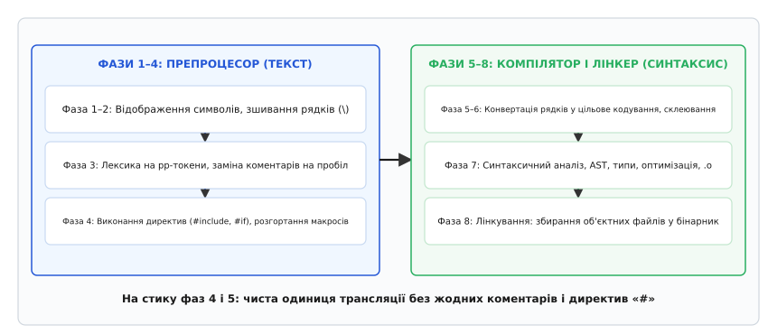
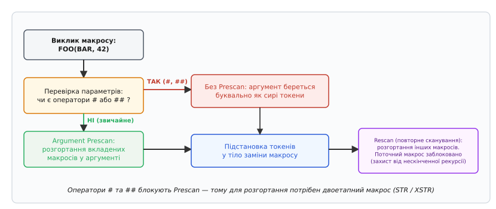
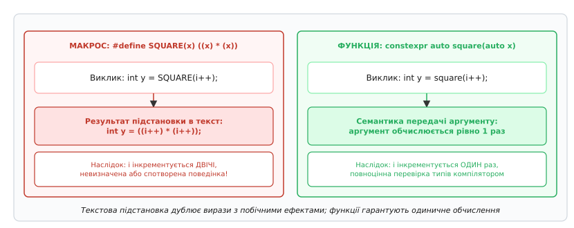
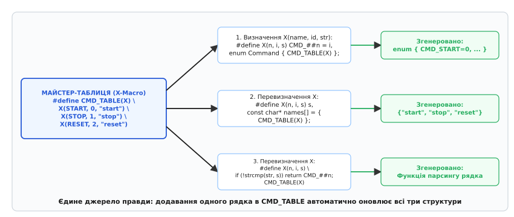

# Препроцесор і макроси

<preknowlist>
- [Компіляція](root:sf-lang/compilation) — загальний конвеєр перетворення тексту програми у виконуваний машинний код.
- [Стадії компілятора](root:sf-lang/compiler-stages) — поділ трансляції на лексичний, синтаксичний аналіз та кодогенерацію.
- [Одиниця трансляції](root:sf-lang/translation-unit) — ізольований потік коду, що компілюється в окремий об'єктний файл.
</preknowlist>

Коли компілятор мови C або C++ відкриває файл із вихідним кодом, він не починає одразу розбирати синтаксис функцій, перевіряти типи змінних чи будувати дерево виразів. Першим до файлу доторкається інструмент, який взагалі нічого не знає про типи даних, області видимості, класи чи керуючі конструкції. Цей інструмент — **препроцесор** (*preprocessor*, від латинського *prae* — «попередньо» та *processus* — «рух уперед»). Його єдине завдання — механічно підготувати, розрізати, склеїти та перетворити текст програми до того, як його побачить синтаксичний аналізатор компілятора.

Розуміння препроцесора розмежовує два світи: світ текстових маніпуляцій над потоком токенів і світ типізованого синтаксичного аналізу. Будь-яка помилка на цьому кордоні створює найпідступніші баги в системному програмуванні, оскільки компілятор намагається надати сенс тексту, який уже був спотворений текстовою підстановкою.

### Текстовий шар перед синтаксисом: фази трансляції

Стандарти мов C (ISO/IEC 9899) та C++ (ISO/IEC 14882) визначають процес перетворення вихідного коду на бінарний файл як послідовність із **восьми суворих фаз трансляції** (*translation phases*). Перші чотири фази повністю належать препроцесору:

1. **Фаза 1 (Відображення символів):** Фізичні байти вихідного файлу декодуються в базовий набір символів вихідного коду. Обробляються триграфи (застарілі послідовності на кшталт `??=` для `#`, вилучені в C++17 та C23) та універсальні імена символів `\uXXXX`.
2. **Фаза 2 (Зшивання рядків):** Усі рядки, що завершуються символом зворотного слеша `\` безпосередньо перед символом нового рядка, зшиваються з наступним рядком в один логічний рядок.
3. **Фаза 3 (Лексичний розбір на токени препроцесора):** Потік символів розбивається на коментарі, пробільні символи та **токени препроцесора** (*preprocessing tokens*: ідентифікатори, числа, рядкові літерали, оператори). Кожен блок коментаря (як `/* ... */`, так і `// ...`) замінюється рівно на один символ пробілу.
4. **Фаза 4 (Виконання директив та розгортання макросів):** Виконуються всі рядки, що починаються з символу `#` (`#include`, `#define`, `#if`, `#pragma`). Рекурсивно підставляються заголовні файли, розгортаються макроси, обробляються оператори `#` та `##`.

Лише після завершення фази 4, коли з тексту програми повністю зникли всі директиви із символом `#` та всі коментарі, утворюється так звана **одиниця трансляції** (*translation unit*). Вона передається на фази 5–8, де компілятор перевіряє типи даних, будує абстрактне синтаксичне дерево (AST), генерує машинний код і передає об'єктні файли лінкеру.


*Фази трансляції C/C++. Препроцесор повністю виконує перші 4 фази: зшиває рядки, видаляє коментарі, підставляє вміст файлів через `#include` та розгортає макроси. Компілятор починає синтаксичний розбір і аналіз типів лише на фазі 7 із готової одиниці трансляції.*

Препроцесор оперує суто **токенами препроцесора**, а не граматикою C. Наприклад, вираз `123.45.67` для препроцесора є цілком валідним числоподібним токеном (*pp-number*). Препроцесор пропустить його далі, і лише фаза 7 компілятора повідомить про синтаксичну помилку некоректного числового літерала.

> 🔧 **Навіщо це.** Відокремлення препроцесора дає змогу керувати конфігурацією програми до компіляції: вмикати чи вимикати модулі під конкретну операційну систему, обирати платформові драйвери та оптимізувати розмір бінарного файлу без жодних накладних витрат у рантаймі.

Історично препроцесор виник як зовнішня утиліта, що давала змогу вмістити компілятор у крихітну пам'ять перших комп'ютерів; детальніше цей шлях розкрито в нарисі про [історію розвитку препроцесора від Unix V7 до сучасних стандартів](root:sf-lang/preprocessor-macros/hist-preprocessor-evolution.md).

---

### Директиви включення та умовна компіляція

Усі команди, якими програміст керує препроцесором, називаються **директивами** (*directives*). Вони завжди починаються з символу `#` як першого значущого символу рядка.

#### Включення заголовків: `#include`

Директива `#include` буквально замінює рядок виклику повним текстовим вмістом зазначеного файлу. Існує дві форми запису:

- `#include <header.h>` — пошук ведеться у стандартних системних каталогах компілятора та шляхах, переданих через прапорець `-I` системи збирання. Застосовується для стандартної бібліотеки та зовнішніх залежностей.
- `#include "header.h"` — пошук починається з каталогу поточного файлу, де записана сама директива. Якщо файл не знайдено, компілятор переходить до системних шляхів. Застосовується для власних файлів проєкту.

Головна небезпека `#include` — **проблема повторного включення** (*multiple inclusion*). Якщо файл `a.h` включає `types.h`, і файл `b.h` також включає `types.h`, то у файлі `main.c`, який підключає обидва заголовки, вміст `types.h` буде вклеєно двічі. Це спричинить помилку компілятора про повторне оголошення структур або типів (`redefinition of 'struct Node'`).

Для захисту використовують класичний ідіоматичний механізм — **header guards** (вартові заголовків):

:::tabs
```c
/* Файл: sensor_types.h */
#ifndef SENSOR_TYPES_H
#define SENSOR_TYPES_H

typedef struct {
    float temperature;
    float humidity;
} SensorData;

#endif /* SENSOR_TYPES_H */
```
```cpp
// Файл: sensor_types.hpp
#ifndef SENSOR_TYPES_HPP
#define SENSOR_TYPES_HPP

struct SensorData {
    float temperature;
    float humidity;
};

#endif // SENSOR_TYPES_HPP
```
:::

Коли препроцесор зустрічає файл уперше, макрос `SENSOR_TYPES_H` ще не визначений, тому препроцесор заходить усередину, визначає макрос через `#define` і опрацьовує структури. При другому включенні того самого файлу перевірка `#ifndef` повертає хибність, і препроцесор миттєво пропускає весь вміст файлу до кінцевого `#endif`.

Більшість сучасних компіляторів підтримують директиву `#pragma once`. Вона вказує компілятору відкрити файл рівно один раз на одиницю трансляції:

:::tabs
```c
#pragma once

typedef struct {
    int id;
    int value;
} DeviceRecord;
```
```cpp
#pragma once

struct DeviceRecord {
    int id;
    int value;
};
```
:::

`#pragma once` зменшує навантаження на диск і час збирання, оскільки компілятор запам'ятовує ідентифікатор файлу (*inode*) і навіть не читає його повторно. Проте в складних системах збирання із символічними посиланнями (*symlinks*) або монтуванням мережевих дисків різні шляхи до одного файлу можуть сприйнятися як різні файли, тому класичні `header guards` залишаються найбільш переносним стандартом.

#### Умовна компіляція: `#if`, `#ifdef`, `#ifndef`, `#elif`, `#else`, `#endif`

Умовна компіляція дозволяє вилучати або залишати фрагменти тексту коду залежно від константних умов:

:::tabs
```c
#define PROTOCOL_VERSION 2

#if PROTOCOL_VERSION == 1
    void send_packet_v1(void);
#elif PROTOCOL_VERSION == 2
    void send_packet_v2(void);
#else
    #error "Непідтримувана версія протоколу!"
#endif
```
```cpp
#define PROTOCOL_VERSION 2

#if PROTOCOL_VERSION == 1
    void send_packet_v1();
#elif PROTOCOL_VERSION == 2
    void send_packet_v2();
#else
    #error "Непідтримувана версія протоколу!"
#endif
```
:::

Всередині виразів `#if` діють жорсткі обмеження:
1. Дозволені лише **цілочисельні константні вирази**. Константи з плаваючою комою (`3.14`) чи рядки заборонені.
2. Препроцесор не знає типів даних і не підтримує оператор `sizeof()`. Вираз `#if sizeof(int) == 4` є синтаксичною помилкою.
3. Будь-який невідомий препроцесору ідентифікатор, що не є макросом, автоматично замінюється на число `0`. Якщо ви напишете `#if ENABLE_DEBUG` (а макрос забули оголосити), умова тихо перетвориться на `#if 0`, не видавши жодного попередження.
4. Оператор `defined(NAME)` перевіряє факт наявності макросу і повертає `1` або `0`. Це дозволяє будувати складні логічні умови:

:::tabs
```c
#if defined(DEBUG) && !defined(SILENT_MODE)
    #define LOG(msg) printf("LOG: %s\n", msg)
#else
    #define LOG(msg) ((void)0)
#endif
```
```cpp
#if defined(DEBUG) && !defined(SILENT_MODE)
    #define LOG(msg) std::cout << "LOG: " << (msg) << "\n"
#else
    #define LOG(msg) ((void)0)
#endif
```
:::

Повний структурований опис синтаксису всіх директив, операторів перевірки та зупинки компілятора наведено у файлі [довідника директив та вбудованих макросів](root:sf-lang/preprocessor-macros/api-preprocessor.md).

---

### Механізм макропідстановки: об'єктні, функціональні та оператори `#`, `##`

Директива `#define` реєструє в таблиці препроцесора правило заміни. Макроси поділяються на два принципові види:

1. **Об'єктні макроси** (*object-like macros*): простий ідентифікатор, що замінюється на список токенів:
:::tabs
```c
#define BUFFER_CAPACITY 512
```
```cpp
#define BUFFER_CAPACITY 512
```
:::
2. **Функціональні макроси** (*function-like macros*): макроси з круглими дужками та списком формальних параметрів:
:::tabs
```c
#define CLAMP(x, low, high) (((x) < (low)) ? (low) : (((x) > (high)) ? (high) : (x)))
```
```cpp
#define CLAMP(x, low, high) (((x) < (low)) ? (low) : (((x) > (high)) ? (high) : (x)))
```
:::

Між ім'ям функціонального макросу та відкриваючою дужкою `(` **заборонено ставити пробіл** у визначенні. Запис `#define FOO (x)` створить об'єктний макрос `FOO`, який замінюється на текст `(x)`, замість створення функції з аргументом `x`.

#### Алгоритм розгортання та Argument Prescan

Розгортання функціонального макросу підпорядковується чіткому чотириетапному алгоритму:

1. **Ідентифікація виклику та виділення аргументів:** Препроцесор знаходить ім'я макросу, за яким слідує відкриваюча дужка `(`, та розбиває потік символів між дужками на окремі аргументи за комами (якщо коми не сховані у вкладених дужках).
2. **Попереднє розгортання аргументів (*Argument Prescan*):** Кожен переданий аргумент сканується та повністю розгортається як незалежний макрос **до** того, як його буде вставлено в тіло основного макросу.
3. **Виняток для `#` та `##`:** Якщо формальний параметр у тілі макросу є операндом оператора стрінгіфікації `#` або оператора конкатенації `##`, етап **Argument Prescan для цього параметра блокується** — аргумент підставляється буквально в сирому вигляді!
4. **Підстановка та фінальне повторне сканування (*Rescan*):** Згенерований потік токенів сканується повторно для розгортання інших макросів. При цьому сам розгорнутий макрос тимчасово вимикається (правило *blue paint*), щоб унеможливити нескінченну рекурсію.


*Алгоритм розгортання макросів. Звичайні аргументи спершу розгортаються на етапі Prescan. Якщо ж параметр використовується з `#` або `##`, він підставляється буквально без Prescan. Фінальне сканування розгортає результат знову, блокуючи рекурсивний виклик самого себе.*

#### Оператор стрінгіфікації: `#`

Оператор `#` перетворює передані токени аргументу на валідний рядковий літерал мови C, додаючи подвійні лапки та екрануючи внутрішні лапки і зворотні слеші:

:::tabs
```c
#include <stdio.h>

#define PRINT_EXPR(expr) printf(#expr " = %d\n", expr)

int main(void) {
    int a = 5, b = 10;
    PRINT_EXPR(a + b); // Розгортається у: printf("a + b" " = %d\n", a + b);
    return 0;
}
```
```cpp
#include <iostream>

#define PRINT_EXPR(expr) std::cout << #expr " = " << (expr) << "\n"

int main() {
    int a = 5, b = 10;
    PRINT_EXPR(a + b); // std::cout << "a + b" " = " << (a + b) << "\n";
    return 0;
}
```
:::

Оскільки `#` блокує Argument Prescan, спроба перетворити значення іншого макросу на рядок напряму зазнає невдачі:
:::tabs
```c
#define VERSION 42
#define STR(x) #x

/* Виклик STR(VERSION) розгорнеться у рядок "VERSION", а не "42"! */
```
```cpp
#define VERSION 42
#define STR(x) #x

// Виклик STR(VERSION) у C++ також дасть рядок "VERSION" замість "42"
```
:::
Для правильного розгортання застосовують класичний **двоетапний макрос** (*two-level macro*):
:::tabs
```c
#define STR_IMPL(x) #x
#define STR(x) STR_IMPL(x)

/* STR(VERSION) -> 1. STR(42) на Prescan -> 2. STR_IMPL(42) -> "42" */
```
```cpp
#define STR_IMPL(x) #x
#define STR(x) STR_IMPL(x)

// Двоетапне розгортання забезпечує Prescan макросу VERSION перед стрінгіфікацією
```
:::

#### Оператор склеювання токенів: `##`

Оператор `##` (*token pasting*) з'єднує два сусідні токени в один новий токен. Результат має бути лексично коректним:

:::tabs
```c
#include <stdio.h>

#define REGISTER_HANDLE(name) int handle_##name = 0

REGISTER_HANDLE(uart); // Розгортається у: int handle_uart = 0;
REGISTER_HANDLE(spi);  // Розгортається у: int handle_spi = 0;

int main(void) {
    printf("UART handle: %d, SPI handle: %d\n", handle_uart, handle_spi);
    return 0;
}
```
```cpp
#include <iostream>

#define REGISTER_HANDLE(name) int handle_##name = 0

REGISTER_HANDLE(uart); // int handle_uart = 0;
REGISTER_HANDLE(spi);  // int handle_spi = 0;

int main() {
    std::cout << "UART handle: " << handle_uart
              << ", SPI handle: " << handle_spi << "\n";
    return 0;
}
```
:::

#### Варіативні макроси та оператор `__VA_OPT__`

Починаючи зі стандарту C99 та C++11, макроси можуть приймати змінну кількість аргументів через трикрапку `...`, доступну через спеціальний ідентифікатор `__VA_ARGS__`:

:::tabs
```c
#define DBG_LOG(fmt, ...) printf("[DEBUG] " fmt "\n", __VA_ARGS__)
```
```cpp
#define DBG_LOG(fmt, ...) std::printf("[DEBUG] " fmt "\n", __VA_ARGS__)
```
:::

Проте виклик `DBG_LOG("Init done")` без додаткових аргументів розгортається у `printf("[DEBUG] " "Init done" "\n", );`, залишаючи висячу кому перед закриваючою дужкою.

У сучасних стандартах C++20 та C23 цю проблему остаточно розв'язано оператором `__VA_OPT__(...)`:

:::tabs
```c
#include <stdio.h>

#define LOG_MSG(fmt, ...) printf(fmt __VA_OPT__(,) __VA_ARGS__)

int main(void) {
    LOG_MSG("Повідомлення без аргументів\n");
    LOG_MSG("Координати: x=%d, y=%d\n", 10, 20);
    return 0;
}
```
```cpp
#include <iostream>
#include <cstdio>

#define LOG_MSG(fmt, ...) std::printf(fmt __VA_OPT__(,) __VA_ARGS__)

int main() {
    LOG_MSG("Повідомлення без аргументів\n");
    LOG_MSG("Координати: x=%d, y=%d\n", 10, 20);
    return 0;
}
```
:::

Якщо варіативні аргументи передано, `__VA_OPT__(,)` вставляє кому; якщо список порожній — вираз зникає повністю.

---

### Анатомія пасток: чому наївні макроси ламають програми

Оскільки препроцесор не розуміє синтаксису C/C++, наївне використання макросів породжує приховані дефекти, які неможливо виявити під час звичайного читання коду.

#### 1. Плутанина пріоритетів операторів

Розгляньмо простий макрос множення:
:::tabs
```c
#define MULTIPLY(a, b) a * b
```
```cpp
#define MULTIPLY(a, b) a * b
```
:::
Якщо викликати його з виразом додавання:
:::tabs
```c
int res = MULTIPLY(2 + 3, 4 + 5);
/* Препроцесор підставить: 2 + 3 * 4 + 5 = 19 замість 45! */
```
```cpp
int res = MULTIPLY(2 + 3, 4 + 5);
// Результат: 2 + 3 * 4 + 5 = 19 замість очікуваних 45
```
:::
Оператор множення має вищий пріоритет за додавання. **Залізне правило препроцесора:** кожен аргумент у тілі макросу і весь вираз макросу цілком зобов'язані бути загорнуті в круглі дужки:
:::tabs
```c
#define MULTIPLY(a, b) ((a) * (b))
```
```cpp
#define MULTIPLY(a, b) ((a) * (b))
```
:::

#### 2. Побічні ефекти при багаторазовому обчисленні аргументів

Якщо функціональний макрос використовує аргумент більше одного разу, будь-який вираз із побічним ефектом (інкремент, виклик функції, читання з черги) виконається багаторазово:

:::tabs
```c
#include <stdio.h>

#define MIN_MACRO(a, b) (((a) < (b)) ? (a) : (b))

static int get_next_val(int* ptr) {
    return (*ptr)++;
}

int main(void) {
    int counter = 0;
    int limit = 5;

    /* get_next_val() викличеться двічі через дублювання аргументу в тілі макросу! */
    int m = MIN_MACRO(get_next_val(&counter), limit);

    printf("m = %d, counter = %d (очікували counter=1)\n", m, counter);
    return 0;
}
```
```cpp
#include <iostream>
#include <algorithm>

template <typename T>
constexpr T min_func(T a, T b) noexcept {
    return (a < b) ? a : b;
}

int main() {
    int counter = 0;
    int limit = 5;

    auto get_next = [&counter]() { return counter++; };

    // Функція гарантує одиничне обчислення аргументу під час виклику
    int m = min_func(get_next(), limit);

    std::cout << "m = " << m << ", counter = " << counter << " (counter=1)\n";
    return 0;
}
```
:::


*Порівняння побічних ефектів. Макрос дублює параметр `x` у тексті виразу, спричиняючи подвійний інкремент змінної `i++`. Звичайна або `constexpr` функція обчислює аргумент рівно один раз при передачі значення на стек або в регістр.*

#### 3. Пастка "Dangling Else" та ідіома `do { ... } while (0)`

Якщо макрос повинен виконати кілька дій поспіль, наївне групування у фігурні дужки ламає конструкцію `if-else`:

:::tabs
```c
#define CLEANUP_AND_LOG(ptr) { free(ptr); printf("Freed\n"); }
/* При виклику if (cond) CLEANUP_AND_LOG(p); else handle_err(); крапка з комою розіб'є if */
```
```cpp
#define CLEANUP_AND_LOG(ptr) { delete ptr; std::cout << "Freed\n"; }
// Крапка з комою після тіла макросу розриває синтаксис if-else
```
:::

Єдиним стандартним та переносним рішенням у C/C++ є огортання тіла макросу в конструкцію `do { ... } while (0)`:

:::tabs
```c
#include <stdio.h>
#include <stdlib.h>

#define SAFE_CLEANUP(ptr) \
    do { \
        free(ptr); \
        printf("Ресурс звільнено\n"); \
    } while (0)

int main(void) {
    int* data = (int*)malloc(sizeof(int));
    int ok = 1;

    if (ok)
        SAFE_CLEANUP(data);
    else
        printf("Помилка\n");

    return 0;
}
```
```cpp
#include <iostream>
#include <memory>

// У C++ подібні макроси замінюють на RAII-обгортки або звичайні лямбда-виклики
inline void safe_cleanup(std::unique_ptr<int>& ptr) noexcept {
    ptr.reset();
    std::cout << "Ресурс звільнено через RAII\n";
}

int main() {
    auto data = std::make_unique<int>(42);
    bool ok = true;

    if (ok)
        safe_cleanup(data);
    else
        std::cout << "Помилка\n";

    return 0;
}
```
:::

Синтаксично конструкція `do { ... } while (0)` вимагає завершальної крапки з комою `;`, що ідеально інтегрує макрос у будь-який умовний блок `if-else`.

#### 4. Засмічення глобального простору імен

Макроси повністю ігнорують простори імен (*namespaces*) C++. Якщо всередині простору імен бібліотеки визначити макрос:
:::tabs
```c
/* У C макрос завжди глобальний */
#define STATUS_OK 0
```
```cpp
namespace Graphics {
    #define STATUS_OK 0
}
// Макрос STATUS_OK ігнорує namespace і витікає у глобальний простір
```
:::
Макрос `STATUS_OK` стане видимим у **всіх** файлах, що підключать цей заголовок, перезаписуючи будь-які локальні змінні, назви методів чи константи з таким самим ім'ям у всій програмі.

Класичний приклад катастрофи — системний заголовок `<windows.h>`, який оголошує макроси `min` і `max`. Підключення цього заголовка ламає стандартні функції `std::min`, `std::max` та виклики `std::numeric_limits<T>::max()` у C++, змушуючи розробників вимикати їх директивою `#define NOMINMAX`.

---

### Сучасні альтернативи C++: від тексту до строгих типів

Майже для кожного класичного сценарію використання макросів сучасний C++ пропонує типобезпечну альтернативу, яка перевіряється компілятором і підтримується засобами налагодження:

| Завдання | Застарілий підхід (C Macro) | Сучасний еквівалент C++ | Перевага C++ |
| :--- | :--- | :--- | :--- |
| **Константи** | `#define PI 3.14159` | `constexpr double Pi = 3.14159;` | Строгий тип, видимість у namespace, відсутність конфліктів |
| **Узагальнені функції** | `#define MAX(a, b) ...` | `template <typename T> constexpr T max(T a, T b)` | Перевірка типів, аргумент обчислюється рівно 1 раз |
| **Коди стану** | `#define ERR_OK 0` | `enum class ErrorCode : uint8_t` | Неможливість випадкового неявного приведення до int |
| **Метадані вихідного коду** | `__FILE__`, `__LINE__` | `std::source_location` (C++20) | Доступ до файлу й рядка без макросів у сигнатурі |
| **Ізоляція коду** | `#include <header.h>` | `import std;` (C++20 Modules) | Макроси не «витікають» назовні з модулів |

Розгляньмо практичний приклад заміни макросів логування метаданих на сучасний `std::source_location`:

:::tabs
```c
#include <stdio.h>

/* Класичний C-підхід: вимагає макросу для фіксації __FILE__ та __LINE__ */
#define LOG_EVENT(msg) log_internal(msg, __FILE__, __LINE__, __func__)

static void log_internal(const char* msg, const char* file, int line, const char* func) {
    printf("[%s:%d in %s()] %s\n", file, line, func, msg);
}

int main(void) {
    LOG_EVENT("Ініціалізація підсистеми C");
    return 0;
}
```
```cpp
#include <iostream>
#include <string_view>
#include <source_location>

// У C++20 функція фіксує місце виклику за замовчуванням через std::source_location
void log_event(std::string_view msg,
               const std::source_location location = std::source_location::current()) {
    std::cout << "[" << location.file_name() << ":"
              << location.line() << " in "
              << location.function_name() << "()] "
              << msg << "\n";
}

int main() {
    log_event("Ініціалізація підсистеми C++20 без жодного макросу");
    return 0;
}
```
:::

---

### Де макроси лишаються незамінними: системні патерни

Попри розвиток системи типів, існує низка низькорівневих задач, де текстовий препроцесор лишається безальтернативним інструментом системного інженера.

#### 1. X-Macros: єдине джерело правди для генерації таблиць

Коли в проєкті потрібно підтримувати узгодженість між `enum`, масивом назв команд, функціями серіалізації та парсингу, патерн **X-Macros** дозволяє описати всі дані рівно один раз і автоматично розгорнути їх у різні конструкції мови.


*Конвеєр X-Macros. Майстер-таблиця визначає структуру сутностей. Багаторазове переозначення макросу `X` генерує типізований `enum`, масив рядків та функції обробки з одного джерела правди без ризику розсинхронізації.*

Детальну покрокову реалізацію цього патерна, варіант із файлом `.def` та порівняння з сучасними C++ `constexpr`-масивами наведено у вставці [детальний розбір X-Macros та ідіоматичного C++ еквівалента](root:sf-lang/preprocessor-macros/proj-xmacros.md).

#### 2. Захоплення рядка виразу в Assert

Функція перевірки інваріантів `assert()` зобов'язана не лише зупинити програму при збої, а й надрукувати точний текст виразу, який виявився хибним. Це принципово неможливо зробити засобами мови без оператора стрінгіфікації `#`:

:::tabs
```c
#include <stdio.h>
#include <stdlib.h>

#define CUSTOM_ASSERT(expr) \
    do { \
        if (!(expr)) { \
            fprintf(stderr, "ASSERT FAILED: (%s) at %s:%d in %s()\n", \
                    #expr, __FILE__, __LINE__, __func__); \
            abort(); \
        } \
    } while (0)

int main(void) {
    int valid_handle = 1;
    CUSTOM_ASSERT(valid_handle != 0);
    printf("Перевірку інваріанта пройдено успішно.\n");
    return 0;
}
```
```cpp
#include <iostream>
#include <cstdlib>

#define CUSTOM_ASSERT(expr) \
    do { \
        if (!(expr)) { \
            std::cerr << "ASSERT FAILED: (" #expr ") at " \
                      << __FILE__ << ":" << __LINE__ << " in " \
                      << __func__ << "()\n"; \
            std::abort(); \
        } \
    } while (0)

int main() {
    int valid_handle = 1;
    CUSTOM_ASSERT(valid_handle != 0);
    std::cout << "Перевірку інваріанта C++ пройдено успішно.\n";
    return 0;
}
```
:::

#### 3. Абстракція платформ і компіляторних атрибутів

Системний код повинен компілюватися на різних компіляторах (GCC, Clang, MSVC) та операційних системах (Linux, Windows, macOS, bare-metal). Макроси забезпечують уніфіковану обгортку над специфічними розширеннями:

:::tabs
```c
#if defined(_MSC_VER)
    #define FORCE_INLINE __forceinline
    #define PACKED_STRUCT_START __pragma(pack(push, 1))
    #define PACKED_STRUCT_END   __pragma(pack(pop))
#elif defined(__GNUC__) || defined(__clang__)
    #define FORCE_INLINE inline __attribute__((always_inline))
    #define PACKED_STRUCT_START
    #define PACKED_STRUCT_END   __attribute__((packed))
#else
    #define FORCE_INLINE inline
    #define PACKED_STRUCT_START
    #define PACKED_STRUCT_END
#endif
```
```cpp
#if defined(_MSC_VER)
    #define FORCE_INLINE [[msvc::forceinline]] inline
    #define PACKED_STRUCT_START __pragma(pack(push, 1))
    #define PACKED_STRUCT_END   __pragma(pack(pop))
#elif defined(__GNUC__) || defined(__clang__)
    #define FORCE_INLINE [[gnu::always_inline]] inline
    #define PACKED_STRUCT_START
    #define PACKED_STRUCT_END   __attribute__((packed))
#else
    #define FORCE_INLINE inline
    #define PACKED_STRUCT_START
    #define PACKED_STRUCT_END
#endif
```
:::

---

### Інженерні висновки: баланс між текстом і типами

Препроцесор — це потужний, але «сліпий» текстовий генератор, що працює на початку конвеєра збирання.

Практичне правило архітектури сучасного коду на C і C++ формулюється просто:
1. **Якщо задачу можна вирішити через систему типів** (константи, функції, шаблони, перелічення, простори імен) — **завжди** обирайте мовні засоби. Це забезпечує перевірку типів, точну локалізацію помилок компілятором і зрозуміле налагодження.
2. **Якщо задача потребує дій до синтаксичного аналізу** (умовна компіляція під іншу архітектуру, об'єднання коду з різних файлів, генерація таблиць через X-Macros, перетворення коду у рядкові літерали для логування) — використовуйте препроцесор, суворо дотримуючись правил ізоляції дужками, конструкції `do { ... } while (0)` та очищення макросів через `#undef`.
