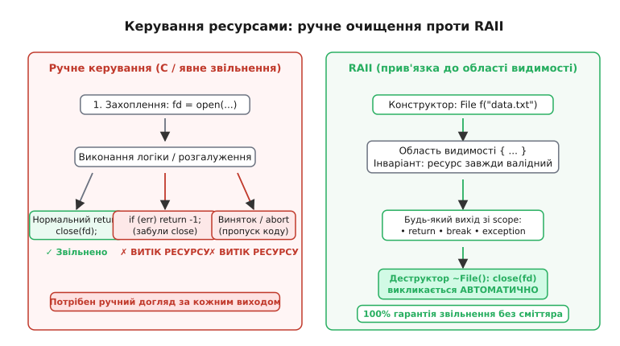
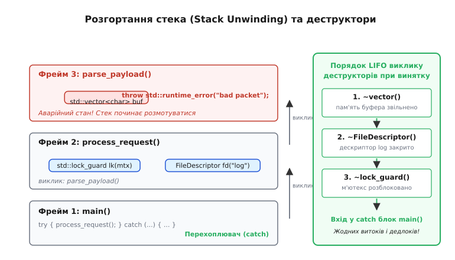
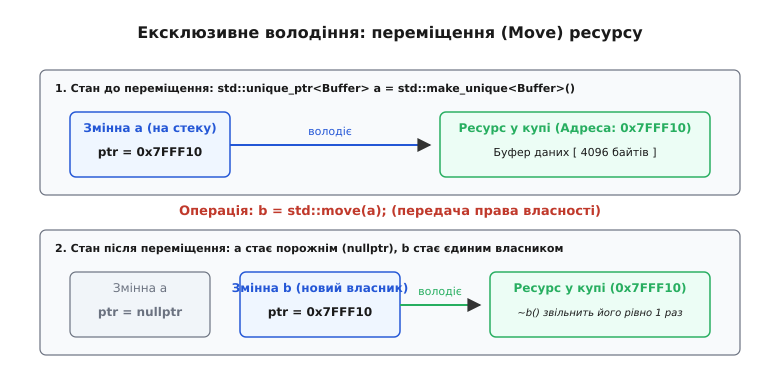
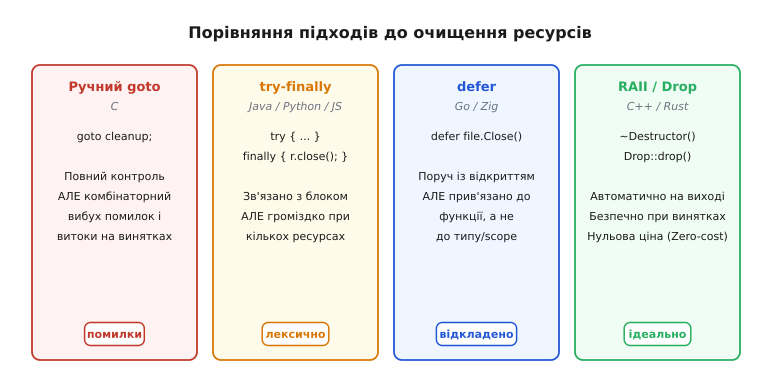

# RAII: ресурс прив'язаний до часу життя

<preknowlist>
- [Стек](root:sf-lang/stack-lifo) — локальні змінні створюються під час входу в блок і знищуються під час виходу з нього.
- [Купа](root:sf-lang/heap-dynamic-memory) — динамічна пам'ять, яку необхідно явно повертати системі.
- [Конструктор і деструктор: народження й смерть об'єкта](root:sf-lang/constructors-destructors) — спеціальні методи, що викликаються автоматично при створенні та знищенні екземпляра.
- [Гарантії цілості при винятках](root:sf-lang/exception-safety) — поведінка коду під час аварійного розгортання стека.
</preknowlist>

Сервер обробки фінансових транзакцій приймає мережевий запит, блокує м'ютекс балансу рахунку, відкриває дескриптор файлу аудиту на диску й виділяє динамічний буфер у купі під розрахунки. Посередині обробки виникає помилка валідації: контрольна сума пакета виявляється некоректною. Код виконує ранній вихід `if (error) return -1;` або викидає виняток. М'ютекс залишається заблокованим назавжди, усі наступні потоки зависають у мертвому блокуванні (англ. *deadlock*), виділена пам'ять витікає, а відкритий файловий дескриптор так і лишається висіти в таблиці ядра операційної системи. Коли кількість таких збоїв досягає системного ліміту (за замовчуванням `1024` дескриптори в Linux), процес більше не здатний відкрити жоден новий файл чи мережевий сокет і аварійно падає з системною помилкою `EMFILE` (*Too many open files*).

У традиційній імперативній моделі програмування кожне захоплення системного ресурсу вимагає обов'язкового парного, строго симетричного виклику функції звільнення: виділення пам'яті `malloc` вимагає `free`, відкриття файлу `open` — виклику `close`, блокування `pthread_mutex_lock` — обов'язкового `pthread_mutex_unlock`. Проте реальний виробничий код ніколи не є прямою лінією: він рясніє десятками умовних розгалужень, перевірок кодів помилок, циклічних операторів `break`, ранніх `return` і неочікуваних винятків. З кожним новим залученим ресурсом кількість можливих комбінацій аварійних шляхів зростає за експонентою `2ⁿ`. Програміст змушений будувати громіздкі піраміди перевірок або заплутані ланцюжки переходів `goto cleanup;`, де будь-яка випадково пропущена гілка призводить до невидимого витоку, а порушення порядку очищення — до подвійного звільнення або фатального псування пам'яті.

Вихід із цього глухого кута полягає в перенесенні обов'язку звільнення ресурсів з пам'яті людини на саму структуру мови: прив'язати життєвий цикл довільного ресурсу до детермінованого часу життя локального об'єкта на стеку. Цю фундаментальну парадигму називають **RAII** (англ. *Resource Acquisition Is Initialization* — «придбання ресурсу є ініціалізацією»), і вона становить головну основу надійності сучасного системного програмного забезпечення.

## Ядро механізму: детермінований час життя на стеку

Щоб зрозуміти, чому RAII дає стовідсоткову математичну гарантію очищення, необхідно звернутися до будови апаратного стека викликів. Коли потік виконання заходить у довільний блок коду `{ ... }`, для нього створюється область видимості (англ. *scope*). Усі локальні змінні, оголошені всередині цього блоку, розміщуються на стеку автоматично.

Головна властивість стека — **детермінованість і строгий порядок LIFO** (англ. *Last In, First Out* — останнім прийшов, першим пішов). Щойно виконання виходить за межі блоку — незалежно від того, сталося це через нормальне завершення, оператор `return`, перехід `break`, `continue` чи аварійний виняток — стек очищається. У цей самий момент компілятор гарантовано викликає деструктори всіх створених локальних об'єктів у порядку, строго зворотному до їхнього створення.

Ідея RAII полягає в тому, щоб зробити звичайний стек мотором керування будь-якими зовнішніми ресурсами:

```
1. Конструктор захоплює ресурс і встановлює інваріант валідності.
2. Об'єкт живе на стеку, доки діє його область видимості.
3. Деструктор автоматично звільняє ресурс у момент виходу зі scope.
```

Цей ланцюг створює непорушний зв'язок: **час володіння ресурсом стає тотожним часу існування об'єкта в пам'яті**. Поки змінна жива — ресурс гарантовано відкритий і доступний. Щойно змінна помирає — ресурс гарантовано повертається системі.


*Зліва: при ручному керуванні будь-який ранній вихід або виняток перескакує функцію звільнення, спричиняючи витік ресурсу. Справа: в ідіомі RAII деструктор викликається компілятором автоматично на кожному можливому шляху виходу з блоку.*

> 🔧 **Навіщо це.** Завдяки RAII поняття «витік пам'яті», «незакритий сокет» або «забутий м'ютекс» перестають залежати від пильності програміста чи дисципліни кодових перевірок. Замість того щоб пам'ятати про очищення на кожному з десяти можливих виходів із складної функції, ви описуєте правило звільнення один-єдиний раз — усередині деструктора типу. Будь-який наступний рефакторинг, додавання нових умовних операторів чи зміна бізнес-логіки не здатні порушити цілісність системи: компілятор сам перерахує точки виходу й вставить потрібні виклики.

Історично назва *Resource Acquisition Is Initialization* була запропонована творцем мови C++ Б'ярне Страуструпом наприкінці 1980-х років, хоча сам автор неодноразово визнавав її не надто вдалою, вважаючи точнішим варіант *Scope-Bound Resource Management* (SBRM). Детальніше про те, як суперечки навколо обробки помилок у Bell Labs сформували цю парадигму, читайте в нарисі про [історію створення RAII](root:sf-lang/raii/hist-raii-origins.md).

## Порівняння в коді: ручне очищення проти RAII

Погляньмо на реальний приклад: функцію, яка відкриває системний файл журналу, захоплює захисний м'ютекс для запобігання паралельному запису й виділяє тимчасовий буфер.

:::tabs
```cpp
#include <mutex>
#include <vector>
#include <fstream>
#include <stdexcept>

std::mutex log_mutex;

void write_log_entry(const std::string& message) {
    // 1. Захоплення блокування через RAII
    std::lock_guard<std::mutex> lock(log_mutex);

    // 2. Захоплення файлового дескриптора через RAII
    std::ofstream file("app.log", std::ios::app);
    if (!file.is_open()) {
        // Ранній вихід: mtx автоматично розблокується деструктором lock
        throw std::runtime_error("Не вдалося відкрити файл журналу");
    }

    // 3. Захоплення динамічної пам'яті через RAII-контейнер
    std::vector<char> buffer(message.begin(), message.end());

    if (buffer.empty()) {
        // Ранній return: file закриється, lock розблокує м'ютекс
        return;
    }

    file.write(buffer.data(), static_cast<std::streamsize>(buffer.size()));
    file.put('\n');

    // Успішний вихід: усе звільняється компілятором у строгому порядку LIFO:
    // 1. ~vector() звільняє купу
    // 2. ~ofstream() закриває файл
    // 3. ~lock_guard() відпускає м'ютекс
}
```
```c
#include <pthread.h>
#include <stdlib.h>
#include <stdio.h>
#include <string.h>

pthread_mutex_t log_mutex = PTHREAD_MUTEX_INITIALIZER;

int write_log_entry_c(const char* message) {
    // Ручне блокування
    if (pthread_mutex_lock(&log_mutex) != 0) {
        return -1;
    }

    // Ручне відкриття файлу
    FILE* file = fopen("app.log", "a");
    if (!file) {
        // Помилка: не забути розблокувати м'ютекс перед виходом!
        pthread_mutex_unlock(&log_mutex);
        return -2;
    }

    // Ручне виділення пам'яті
    size_t len = strlen(message);
    char* buffer = (char*)malloc(len + 1);
    if (!buffer) {
        // Помилка: не забути закрити файл І розблокувати м'ютекс!
        fclose(file);
        pthread_mutex_unlock(&log_mutex);
        return -3;
    }

    memcpy(buffer, message, len);
    buffer[len] = '\0';

    if (len == 0) {
        // Ранній вихід: знову повний ручний ритуал очищення
        free(buffer);
        fclose(file);
        pthread_mutex_unlock(&log_mutex);
        return 0;
    }

    fwrite(buffer, 1, len, file);
    fputc('\n', file);

    // Фінальне ручне звільнення на успішному шляху
    free(buffer);
    fclose(file);
    pthread_mutex_unlock(&log_mutex);
    return 0;
}
```
:::

У варіанті на C один і той самий код очищення продубльовано чотири рази. Якщо розробник додасть ще один проміжний `if` і забуде в ньому рядок `pthread_mutex_unlock(&log_mutex)`, програма безповоротно зависне під час першого ж збою. У варіанті на C++ логіка звільнення записана нуль разів: компілятор гарантує правильний виклик деструкторів на будь-якому шляху виконання.

## Випробування аварією: розгортання стека при винятках

Найжорсткіший іспит для будь-якої системи керування ресурсами настає тоді, коли в програмі виникає [виняток](root:sf-lang/exception-safety). На відміну від звичайного повернення з функції, виняток — це нелокальний стрибок: потік виконання миттєво залишає поточний фрейм і починає шукати відповідний блок `catch` угору по дереву викликів.

Процес аварійного згортання активних функцій називають **розгортанням стека** (англ. *stack unwinding*, лат. *unwind* — розкручувати). У цей момент рантайм мови за спеціальними таблицями метаданих (секція `.eh_frame` у бінарних файлах формату ELF або DWARF-таблиці) визначає, які змінні були повністю створені у кожному з фреймів, що перетинаються винятком.

Компілятор гарантує: **для кожного повністю сконструйованого локального об'єкта буде викликано його деструктор у строгому порядку LIFO перед тим, як керування перейде в блок `catch`**.


*При виникненні винятку у внутрішній функції рантайм послідовно розмотує фрейми стека в зворотному напрямку, виконуючи деструктори об'єктів (буфера, дескриптора файлу, м'ютекса) доти, доки керування не досягне блоку catch.*

### Як працює розгортання на рівні ABI

На платформах x86-64 та ARM64 розгортання стека реалізується за стандартом **Itanium C++ ABI**. Цей механізм працює у дві фази:

1. **Фаза пошуку (Search Phase):** Рантайм інспектує стек викликів від точки генерації винятку вгору, перевіряючи таблиці `.gcc_except_table`. Мета — знайти найближчий фрейм, який містить блок `catch`, здатний обробити тип викинутого винятку. На цьому етапі деструктори **не викликаються**, а стек не змінюється.
2. **Фаза очищення (Cleanup / Unwind Phase):** Якщо обробник знайдено, рантайм проходить той самий стек вдруге. Для кожного пройденого фрейму викликається так звана «посадкова зона» (англ. *landing pad*) — згенерований компілятором блок інструкцій, який послідовно викликає деструктори локальних змінних. Після завершення деструкторів фрейм знімається зі стека, і керування передається в обробник `catch`.

Якщо на першій фазі відповідного блоку `catch` не знайдено взагалі, програма викликає `std::terminate()` **до того, як стек буде розмотано**. Це надзвичайно цінна інженерна властивість: стек залишається недоторканим, завдяки чому згенерований аварійний дамп пам'яті (core dump) зберігає повний стан усіх локальних змінних у точці збою, дозволяючи розробнику локалізувати проблему в зневаджувачі.

### Залізне правило: деструктори ніколи не кидають винятків (`noexcept`)

У механізмі розгортання стека криється одна критична точка відмови, яка вимагає абсолютного правила: **деструктор ніколи не має права випускати виняток назовні**.

Уявіть ситуацію: програма вже перебуває в стані аварії, летить виняток `A`, і рантайм виконує розгортання стека. Під час цього розгортання викликається деструктор об'єкта `~DatabaseConnection()`, усередині якого стається помилка мережі й викидається новий виняток `B`.

У системі одночасно опиняються два незалежні активні винятки. Рантайм не може визначити, яку гілку обробляти, куди передавати керування і які об'єкти вважати знищеними. Єдине, що може зробити середовище виконання в такій невизначеності, — це негайно викликати `std::terminate()` і аварійно вбити весь процес.

Саме тому в сучасному C++ (починаючи з C++11) усі деструктори вважаються неявно позначеними як `noexcept(true)`. Якщо деструктор закриває сокет або файл і системний виклик повертає помилку, деструктор зобов'язаний самостійно поглинути або залогувати цей збій, але в жодному разі не викидати виняток назовні.

## Семантика володіння: копіювання, переміщення та Правило п'яти

Коли ми прив'язуємо ресурс до об'єкта, постає фундаментальне питання: що відбувається, коли об'єкт передають іншій функції або копіюють?

Уявіть клас, що тримає числовий файловий дескриптор:

```cpp
class FileHandle {
    int fd_;
public:
    explicit FileHandle(int fd) : fd_(fd) {}
    ~FileHandle() { if (fd_ >= 0) ::close(fd_); }
};
```

Якщо ми спробуємо скопіювати екземпляр `FileHandle b = a;`, компілятор за замовчуванням виконає побітове копіювання (англ. *shallow copy*). Обидві змінні `a` і `b` міститимуть одне й те саме число `fd_`. Коли перша змінна вийде з області видимості, її деструктор викличе `close(fd_)`. Коли вийде друга — її деструктор спробує закрити той самий дескриптор вдруге. Це класичне **подвійне звільнення** (англ. *double free*), яке призводить до псування таблиць ядра або закриття чужого сокета, який операційна система встигла відкрити за тим самим номером.

Звідси випливає фундаментальний поділ на дві моделі володіння:

### 1. Ексклюзивне володіння (Move-only)
Ресурс належить рівно одному об'єкту. Його копіювання заборонене на рівні компілятора (`= delete`), але дозволена передача прав — **переміщення** (англ. *move semantics*).

При переміщенні право на володіння дескриптором передається новому об'єкту, а старий об'єкт переводиться в нейтральний стан (sentinel value, наприклад `-1` або `nullptr`). Коли старий об'єкт помре, його деструктор побачить `-1` і нічого не робитиме.

Важливо пам'ятати: функція `std::move` сама по собі нічого не переміщує і не генерує жодного машинного коду. Вона є лише явним перетворенням типу до rvalue-посилання (`static_cast<T&&>(val)`), яке повідомляє компілятору: «вміст цієї змінної можна забрати у володіння іншому об'єкту».


*При переміщенні `b = std::move(a)` вказівник на ресурс у купі переходить до `b`, а поле в `a` скидається в `nullptr`. Деструктор `~b()` звільнить пам'ять рівно один раз, а `~a()` не виконає жодної дії.*

### 2. Спільне володіння (Shared ownership)
Ресурс розділяється між кількома власниками. Кожен об'єкт тримає покажчик на ресурс і спільний контрольний блок із лічильником посилань (англ. *reference count*). При копіюванні лічильник атомарно інкрементується; деструктор кожного власника декрементує лічильник. Сам ресурс знищується лише тоді, коли лічильник падає до нуля (останній власник вийшов зі scope).

Головна небезпека спільного володіння — **циклічні посилання** (англ. *cyclic references*): якщо об'єкт `A` тримає `shared_ptr` на `B`, а `B` тримає `shared_ptr` на `A`, лічильники посилань обох ніколи не впадуть до нуля, і виникне безповоротний витік пам'яті. Для розриву таких циклів використовують слабкі посилання `std::weak_ptr`, які не збільшують лічильник живих власників.

### Правило п'яти й Правило нуля

У C++ для правильної роботи RAII-типу необхідно дотримуватися **Правила п'яти** (англ. *Rule of Five*): якщо класу потрібен власний деструктор для звільнення ресурсу, йому обов'язково треба явно визначити всі п'ять спеціальних функцій-членів:

```
1. Деструктор (~T) — звільняє ресурс.
2. Конструктор копіювання (T(const T&)) — заборонити (= delete) або реалізувати глибоку копію.
3. Оператор копіювального присвоєння (operator=(const T&)) — заборонити (= delete).
4. Конструктор переміщення (T(T&&)) — забрати дескриптор, обнулити джерело.
5. Оператор переміщувального присвоєння (operator=(T&&)) — звільнити старий, забрати новий.
```

Сучасна інженерна практика йде ще далі через **Правило нуля** (англ. *Rule of Zero*): у прикладному коді взагалі не слід писати деструктори чи оператори копіювання вручну. Достатньо будувати власні структури виключно зі стандартних RAII-типів (`std::unique_ptr`, `std::string`, `std::vector`), і компілятор сам коректно згенерує всі п'ять операцій.

Як побудувати надійний узагальнений RAII-контейнер для системних дескрипторів із підтримкою властивостей та семантики переміщення, детально розібрано в [проєкті створення універсальної RAII-обгортки](root:sf-lang/raii/proj-custom-handle.md).

## Стандартний арсенал RAII: розумні вказівники та блокування

Сучасні системні мови надають готові високорівневі типи для всіх основних категорій ресурсів:

| Категорія | RAII-тип у C++ | Аналог у Rust | Що інкапсулює (захоплення → звільнення) |
| :--- | :--- | :--- | :--- |
| **Динамічна пам'ять (монопольно)** | `std::unique_ptr<T>` | `Box<T>` | `new` → `delete` |
| **Динамічна пам'ять (спільно)** | `std::shared_ptr<T>` | `Arc<T>` / `Rc<T>` | Виділення + лічильник → `delete` при `refcount == 0` |
| **Синхронізація потоків** | `std::lock_guard`, `std::scoped_lock` | `MutexGuard<'a, T>` | `lock()` → `unlock()` |
| **Гнучке блокування** | `std::unique_lock` | `MutexGuard<'a, T>` | Підтримка відкладеного блокування та condition variables |
| **Керування потоками виконання** | `std::jthread` (C++20) | `std::thread::JoinHandle` | Автоматичний `request_stop()` та `join()` у деструкторі |
| **Файловий ввід-вивід** | `std::ifstream`, `std::ofstream` | `std::fs::File` | `open()` → `close()` |
| **Мережеві сокети** | Власні RAII-обгортки | `std::net::TcpStream` | `socket()`/`connect()` → `close()` |

### Власні делітери (Custom Deleters) та оптимізація нульового розміру

Клас `std::unique_ptr` має другий необов'язковий параметр шаблону — тип делітера: `std::unique_ptr<T, Deleter>`. Це дозволяє використовувати його як готову обгортку не лише для пам'яті, а й для структур бібліотеки C:

```cpp
// Делітер як функціональний об'єкт без стану
struct FileCloser {
    void operator()(FILE* fp) const noexcept {
        if (fp) ::fclose(fp);
    }
};

using UniqueFile = std::unique_ptr<FILE, FileCloser>;
```

Завдяки оптимізації порожнього базового класу (англ. *Empty Base Optimization*, EBO) або атрибуту `[[no_unique_address]]` компілятор не виділяє жодного байта під об'єкт `FileCloser`. Розмір екземпляра `UniqueFile` залишається рівно 8 байтів (розмір одного вказівника `FILE*`).

Якщо ж передати функцію як звичайний покажчик на функцію (`std::unique_ptr<FILE, decltype(&fclose)> f(fp, &fclose);`), розмір `unique_ptr` збільшиться вдвічі (16 байтів), оскільки об'єкт буде змушений зберігати ще й адресу функції `fclose`. Тому безстатусні функціональні класи завжди є кращими.

### Чому `std::make_unique` та `std::make_shared` кращі за сирий `new`

Створення розумних вказівників через фабричні функції `std::make_unique` та `std::make_shared` є стандартом індустрії з двох причин:

1. **Безпека при винятках (Exception Safety):** У виклику функції виду `process(std::unique_ptr<A>(new A), std::unique_ptr<B>(new B))` до стандарту C++17 порядок обчислення аргументів не був зафіксований. Компілятор мав право виконати `new A`, потім `new B`, і лише потім викликати конструктори `unique_ptr`. Якщо `new B` кидав виняток `std::bad_alloc`, об'єкт `A` витікав у пам'яті, бо ще не був обгорнутий у RAII-контейнер. Використання `std::make_unique<A>()` робить виділення й обгортання неподільною атомарною операцією.
2. **Ефективність кешування пам'яті:** `std::make_shared` виділяє один спільний суміжний блок пам'яті як під користувацький об'єкт, так і під контрольний блок лічильників. Це зменшує навантаження на алокатор удвічі (один `malloc` замість двох) і кардинально покращує локальність кешу процесора.

### RAII для потоків: `std::jthread` замість небезпечного `std::thread`

У стандарті C++11 клас `std::thread` мав прикру ваду: якщо об'єкт `std::thread` знищувався, перебуваючи в стані `joinable()` (тобто потік ще виконувався і для нього не викликали явно `join()` або `detach()`), деструктор `~thread()` викликав `std::terminate()`. Це призводило до раптових крахів серверів при пролітанні винятків повз місце створення потоку.

У C++20 введено повноцінний RAII-потік — `std::jthread` (англ. *joining thread*). Його деструктор автоматично надсилає потоку сигнал зупинки через токен скасування (`std::stop_token`) і викликає `join()`, гарантуючи коректне очікування завершення паралельної задачі під час розгортання стека.

## RAII у вбудованих системах і на голому залізі

Існує поширена хибна думка, що RAII потрібен лише на великих операційних системах із динамічною пам'яттю та винятками. У програмуванні мікроконтролерів (bare-metal) без операційної системи RAII є навіть важливішим інструментом забезпечення надійності:

1. **Керування критичними секціями (Interrupt Masks):** Коли програмі потрібно вимкнути апаратні переривання перед записом у регістр периферії, створюється локальний об'єкт `CriticalSection`: його конструктор зберігає маску регістрів `PRIMASK` і виконує `__disable_irq()`, а деструктор відновлює старий стан. Будь-який ранній `return` гарантовано увімкне переривання назад.
2. **Тактування периферії (Clock Gating):** Для збереження енергії акумулятора шинне тактування блоку (наприклад, UART або АЦП) вмикається лише на час операції. RAII-обгортка `PeripheralPowerGuard` вмикає живлення в конструкторі й вимикає в деструкторі.
3. **GPIO та вибір веденого (Chip Select):** В обміні даними через шину SPI лінія `CS` має бути опущена в низький рівень на початку пакета й піднята у високий у кінці. Клас `SpiSelectGuard` знімає сигнал `CS` у момент виходу з блоку функції.

Оскільки на мікроконтролерах усі ці класи містять крихітні інлайнові виклики регістрів і розміщуються на стеку, вони дають нуль накладних витрат: скомпільований бінарний файл містить рівно ті самі асемблерні команди роботи з регістрами, що й ручний код на асемблері.

## Транзакційний RAII та охоронці виходу (Scope Guards)

Ідіома RAII застосовується не лише до фізичних системних дескрипторів, а й до **стану бізнес-логіки**. Часто необхідно тимчасово змінити стан програми (наприклад, встановити прапорець статусу, почати транзакцію бази даних або зарезервувати кошти) і гарантувати, що цей стан буде скасовано, якщо операція завершиться невдачею.

Для цього використовують патерн **Scope Guard** (охоронець області видимості), стандартизований у бібліотеках під іменами `scope_exit`, `scope_fail` та `scope_success`:

```cpp
void transfer_money(Account& from, Account& to, double amount) {
    from.withdraw(amount);

    // Охоронець відкату: якщо функція впаде з винятком, кошти повернуться
    auto rollback = make_scope_fail([&] {
        from.deposit(amount);
    });

    to.deposit(amount); // Якщо тут станеться виняток — rollback спрацює автоматично!
    log_transaction(from, to, amount);

    // Успіх: rollback не виконується, транзакція зафіксована
}
```

Цей підхід дозволяє легко реалізовувати **строгу гарантію безпеки винятків** (англ. *Strong Exception Guarantee* / ідемпотентний Commit-or-Rollback), де операція або завершується повністю успішно, або залишає стан системи абсолютно незмінним у разі будь-якого збою.

## Rust: RAII, зведений у ранг закону типів

У мові C++ концепція RAII є бібліотечною ідіомою: мова надає деструктори, але не забороняє програмісту створювати сирі небезпечні покажчики, забувати про `std::move` чи звертатися до об'єкта після виклику очищення.

Мова Rust зробила революційний крок, поєднавши RAII з **афінною системою типів** (англ. *affine type system*) та [моделлю власності](root:sf-lang/rust-ownership):

1. **Типаж `Drop`:** Замість деструкторів C++ розробник реалізує типаж `Drop` з єдиним методом `fn drop(&mut self)`.
2. **Move за замовчуванням:** Будь-яке присвоєння або передача у функцію типу, що реалізує `Drop`, за замовчуванням є переміщенням власності.
3. **Статична заборона use-after-free:** Після виконання `let b = a;` ім'я `a` стає фізично недійсним на етапі компіляції. Спроба звернутися до `a` викликає помилку компілятора.
4. **Гарантія єдиного власника:** Компілятор під час збирання точно знає, де закінчується життя єдиного дійсного власника, і сам вставляє туди виклик `Drop::drop`.

```rust
use std::fs::File;
use std::io::{self, Read};

fn read_credentials() -> io::Result<String> {
    // 1. Захоплення ресурсу: відкриття файлу
    let mut file = File::open("secret.key")?; // '?' — раннє повернення при помилці

    let mut content = String::new();
    file.read_to_string(&mut content)?;

    // 2. Успішне повернення:
    // Змінна 'file' виходить зі scope, компілятор автоматично викликає File::drop(&mut file),
    // дескриптор файлу закривається без жодного рядка ручного коду.
    Ok(content)
}
```

Якщо в рядку зчитування стається помилка оператора `?`, функція виконує ранній вихід `return Err(...)`. У цей момент локальна змінна `file` покидає область видимості, і її деструктор `File::drop` викликається непохитно.

### Тонкощі Drop у Rust: Non-Lexical Lifetimes і пригнічення очищення

У сучасних версіях Rust компілятор використовує систему **нелексичних часів життя** (англ. *Non-Lexical Lifetimes*, NLL). Якщо змінна більше не використовується в коді нижче, компілятор може звільнити її позичання раніше за кінець фігурної дужки, проте виклик `Drop::drop` завжди відбувається на межі області видимості, якщо значення не було переміщене або явно знищене функцією `drop(x)`.

Якщо ж розробнику необхідно передати ресурс низькорівневому API ядра або FFI-функції C без його автоматичного закриття, Rust надає безпечні механізми пригнічення деструктора:
- `std::mem::forget(val)` — споживає значення й запобігає виклику `Drop`;
- `std::mem::ManuallyDrop::new(val)` — обгортка, яка повністю вимикає автоматичний виклик деструктора для вкладеного поля.

## Порівняння з іншими парадигмами очищення

У мовах програмування склалося кілька альтернативних підходів до звільнення ресурсів. Кожен із них має власну область застосування, але фундаментально відрізняється від RAII.


*Чотири моделі керування ресурсами. RAII та Drop поєднують автоматичне очищення з повною інкапсуляцією логіки всередині типу без накладних витрат під час виконання.*

### 1. Блоки `try-finally` (Java, C#, JavaScript, Python)
Конструкція `try { ... } finally { r.close(); }` гарантує, що код усередині секції `finally` виконається після виходу з блоку `try`, навіть якщо виник виняток.

- **Слабке місце:** очищення відірване від визначення типу й перекладене на місце виклику. Якщо функція використовує три ресурси, код перетворюється на вкладені «сходинки» з трьох блоків `try-finally`. До того ж ресурс неможливо легко повернути з функції або покласти в масив зі збереженням автоматичного очищення.

### 2. Лексичні інструкції: `try-with-resources` (Java) та `using` (C#)
Сучасні керовані мови ввели синтаксичний цукор над `try-finally`: інтерфейс `AutoCloseable` у Java та `IDisposable` у C#.

```java
// Java: try-with-resources
try (FileInputStream fis = new FileInputStream("data.bin")) {
    fis.read();
} // fis.close() генерується компілятором автоматично
```

- **Слабке місце:** ресурс жорстко прив'язаний до **лексичного блоку коду** (між круглими й фігурними дужками). Його не можна інкапсулювати як поле іншого об'єкта, передати в чергу повідомлень іншому потоку чи повернути як результат без втрати автоматичного керування. Усі непам'ятні ресурси в Java та C# вимагають постійної людської уваги щодо того, чи викликано `Dispose()`.

### 3. Відкладені операції: `defer` (Go, Zig, Swift)
Мова Go відмовилася як від деструкторів, так і від блоків `finally`, запропонувавши ключове слово `defer`. Воно реєструє функцію, яка має виконатися в момент виходу з поточної охоплювальної функції.

```go
// Go: defer
f, err := os.Open("config.json")
if err != nil {
    return err
}
defer f.Close() // виконається при виході з функції
```

- **Перевага:** код звільнення пишеться поруч із кодом відкриття.
- **Слабке місце:** у Go виклик `defer` прив'язаний до **кінця всієї функції**, а не до внутрішнього блоку `{ ... }`. Якщо відкривати файли всередині нескінченного циклу обробки повідомлень (`for { f, _ := os.Open(...); defer f.Close() }`), дескриптори вичерпаються за лічені секунди, бо жоден `defer` не спрацює до повного завершення зовнішньої функції. Крім того, `defer` знову вимагає явного написання в кожному місці виклику.

### 4. Збирач сміття (Garbage Collection) проти RAII
Поширена омана серед початківців: *«У мовах із GC (Java, Go, C#, Python) пам'ять звільняється автоматично, отже, RAII там не потрібен»*.

Це глибоко помилкове твердження. Збирач сміття стежить **виключно за байтами оперативної пам'яті в купі**. GC нічого не знає про дескриптори файлів ядра, сокети, дескриптори баз даних, блокування м'ютексів чи апаратні порти. Збирач сміття працює недетерміновано: він може не запускатися годинами, якщо в системі повно вільної RAM, тоді як пул із 50 доступних з'єднань з базою даних буде вичерпано за кілька секунд. 

Спроби використовувати фіналізатори (`finalize()` у старих версіях Java чи деструктори в C#) для закриття файлів визнані антипатерном: вони виконуються в непередбачуваний момент часу у фоновому потоці, погіршують продуктивність і можуть не виконатися взагалі при завершенні програми.

## Зведена таблиця підходів у мовах програмування

| Мова | Головний механізм | Прив'язка очищення | Чи інкапсульовано в тип? | Підтримка переміщення | Ціна в рантаймі |
| :--- | :--- | :--- | :--- | :--- | :--- |
| **C** | `goto cleanup;` | Ручна в кожній точці | Ні (сирі структури) | Ручна | Нуль |
| **C++** | RAII / Деструктори | До часу життя об'єкта (scope) | **Так** | Так (`std::move`) | **Нуль** (Zero-cost) |
| **Rust** | `Drop` + Власність | До часу життя володіння | **Так** | Так (Move за замовчуванням) | **Нуль** (Zero-cost) |
| **Go** | `defer fn()` | До кінця тіла функції | Ні (явний виклик на місці) | Ні | Невеликий оверхед |
| **Java** | `try-with-resources` | До лексичного блоку | Частково (`AutoCloseable`) | Ні | Нуль (генерація `finally`) |
| **Python** | `with` (Контекстний менеджер) | До лексичного блоку | Частково (`__exit__`) | Ні | Динамічний виклик методів |

## Нульові витрати та приховані механізми

Часто постає питання про ціну абстракції: скільки тактів процесора коштує створення об'єкта-обгортки замість прямого виклику функції C?

Відповідь дає [принцип абстракцій без витрат](root:sf-lang/zero-cost-abstractions): **у оптимізованому коді RAII коштує рівно нуль тактів рантайму**.

1. **Інлайнінг і регістри:** Конструктори й деструктори класів на зразок `std::unique_ptr` або власної обгортки дескриптора повністю вбудовуються оптимізатором. У машинному коді не створюється жодного об'єкта в пам'яті — сире значення дескриптора передається прямо в регістрі процесора.
2. **Таблиці винятків з нульовою ціною (Zero-cost exceptions):** На сучасних платформах (x86-64, ARM64) відстеження активних об'єктів для unwinding не виконує жодної зайвої інструкції на «щасливому шляху» (англ. *happy path*). Компілятор заздалегідь записує статичні таблиці адресації в секцію бінарного файлу `.eh_frame`. Доки виняток не кинуто, програма працює з максимальною швидкістю чистого C без будь-яких перевірок.

### Крайовий випадок: виняток усередині конструктора

Один із найтонших крайових випадків системного програмування — виникнення винятку під час виконання самого конструктора складного класу.

Уявіть клас, що володіє двома ресурсами:

```cpp
class DualDevice {
    int fd1_;
    int fd2_;
public:
    DualDevice() {
        fd1_ = ::open("/dev/dev1", O_RDWR); // Успішно відкрито
        fd2_ = ::open("/dev/dev2", O_RDWR); // Помилка! Викидаємо виняток
        if (fd2_ < 0) throw std::runtime_error("Device 2 failed");
    }

    ~DualDevice() {
        if (fd1_ >= 0) ::close(fd1_);
        if (fd2_ >= 0) ::close(fd2_);
    }
};
```

Тут криється смертельна пастка. За стандартом C++, якщо конструктор об'єкта викинув виняток, **об'єкт вважається нествореним, і його деструктор `~DualDevice()` ніколи не буде викликано**. Як наслідок, дескриптор `fd1_` витече назавжди!

Єдиний правильний спосіб розв'язання цієї проблеми — композиція з RAII-полів:

```cpp
class SafeDualDevice {
    UniqueFd fd1_; // Якщо fd2_ впаде, деструктор fd1_
    UniqueFd fd2_; // викличеться автоматично!
public:
    SafeDualDevice() 
        : fd1_(::open("/dev/dev1", O_RDWR)),
          fd2_(::open("/dev/dev2", O_RDWR)) {
        if (!fd1_ || !fd2_) throw std::runtime_error("Device open failed");
    }
};
```

Коли клас складається з окремих RAII-полів, рантайм під час аварії конструктора автоматично викличе деструктори для всіх полів, чиї конструктори вже встигли успішно завершитися.

## Підсумок архітектурного принципу

Ідіома RAII доводить просту, але фундаментальну істину дизайну програмного забезпечення: **найкращий спосіб уникнути помилки — зробити її синтаксично неможливою**.

Перетворюючи управління ресурсами з ручного процедурного обов'язку на природну властивість системи типів, RAII забезпечує:
- Детерміноване, своєчасне звільнення дескрипторів, сокетів і пам'яті;
- Абсолютну безпеку під час виникнення винятків і аварійного розгортання стека;
- Відсутність накладних витрат у згенерованому машинному коді;
- Чисту, виразну архітектуру, де код бізнес-логіки не забруднений нескінченними перевірками та блоками очищення.
