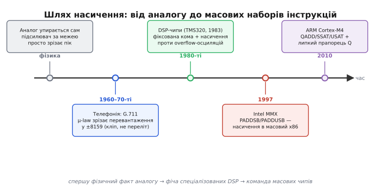

# 📜 Від DSP-чипів до MMX: як «упертися в межу» стало командою процесора

Насичення — це рідкісний випадок, коли гарна ідея в програмуванні народилася не за письмовим столом математика, а **сама собою, з фізики залізяки**. Задовго до того, як хтось написав перший рядок коду з насиченням, воно вже жило в кожному підсилювачі світу: крутнеш гучність надто сильно — і звук не «перекидається» в тишу, а просто впирається в найгучніше, на що здатна схема, і зрізається там. Уся історія насичувальної арифметики — це історія того, як інженери **впіймали цей фізичний факт**, перенесли його спершу в спеціалізовані сигнальні процесори, а тоді, одного січневого дня 1997 року, зробили командою в чипі, що стояв у кожному домашньому комп'ютері. Розберімо цей шлях по ланках — бо кожна ланка пояснює, **чому насичення виглядає саме так, як виглядає**.

*Насичення пройшло три різні світи. Спершу це просто **фізичний факт** аналогу: підсилювач за межею зрізає пік, бо інакше не може. Тоді цифрова телефонія (стандарт G.711) свідомо зрізає перевантаження, щоб не було стрибків. Далі — спеціалізовані сигнальні процесори (TMS320 від 1983-го), де насичення стало апаратною фічею проти особливої біди цифрових фільтрів. І аж наприкінці — стрибок у масові чипи: Intel MMX (1997) і DSP-розширення ARM Cortex-M4 (2010). Ключ до всієї історії: ідея (фізика) старша за реалізацію (команда в наборі інструкцій) на десятиліття.*

## Аналогова техніка вже «вміла» насичення — просто ніхто це так не називав

Почнімо з того світу, де жодних чисел іще немає — лише напруга й струм. Візьмімо звичайний підсилювач (англ. *amplifier* — «той, що збільшує»; від лат. *amplus* — «широкий, великий»). Його робота — узяти слабкий сигнал і зробити його більшим у стільки-то разів. Але підсилювач живиться від джерела з **конкретною напругою** — скажімо, ±12 вольтів. І хоч би яким гучним був вхідний сигнал, вихід фізично **не може** перевищити цю напругу живлення: більше струму нема звідки взяти. Що ж стається, коли підсилювач намагається видати більше, ніж дозволяє живлення?

Він упирається. Верхівка сигналу, що мала б піднятися вище, **зрізається рівно по стелі живлення** — і лишається там, поки вхід не спаде назад у межі. Інженери називають це **кліпінгом** (англ. *clipping* — «обрізання»; від *clip* — «стригти, обрізати»): наче ножицями зрізали верхівку хвилі. І — ось найважливіше — **це не помилка й не поламка**. Це єдине фізично можливе. Підсилювач не має жодного способу «перекинути» надто гучний сигнал у протилежний край, як робить цифрове [перевалювання по колу](root:sf-lang/overflow-wraparound). У нього просто закінчується напруга, і сигнал стоїть на межі.

Оце й є насичення в найчистішому, найпервіснішому вигляді — **до всякої арифметики**. Величина (напруга) має фізичну стелю, і коли обчислення (підсилення) хоче за неї вийти, результат упирається в стелю. Коли за десятиліття інженери будуватимуть цифрові системи, вони не винайдуть насичення — вони **скопіюють цю поведінку**, бо вона правильно описує, як поводяться сигнали в реальному світі. Аналогова схема вже показала єдину чесну відповідь: більше стелі не буває.

> 🔧 **Навіщо це.** Тримайте цей образ у голові щоразу, коли пишете обробку сигналу: насичення — не хитрий математичний трюк, а **імітація фізики**. Ви кажете цифровій машині поводитися так, як поводився б аналоговий підсилювач: упертися, а не перекинутися. Тому й питання при переповненні звучить не «як обійти помилку?», а «**що зробила б тут фізична схема?**». Для звуку, яскравості, керма двигуном відповідь та сама, що дає аналог: зрізати по межі.

## Телефонія перша сказала «зрізати» вголос: стандарт G.711

Перший великий цифровий світ, де насичення довелося **прописати чорним по білому**, — це телефонний зв'язок. Коли голос почали переводити в числа (оцифровувати), постала проблема: людський голос має величезний **динамічний діапазон** — тихий шепіт і гучний крик відрізняються в тисячі разів за силою. А в телефонному каналі на кожен відлік голосу відводили лише **вісім бітів** — 256 можливих значень. Як утиснути тисячократний діапазон у 256 сходинок?

Розв'язок назвали **компандуванням** (англ. *companding* — злиття *compressing* + *expanding*, «стиснути й розтягнути»): перед передаванням гучні частини сигналу стискають, а на приймачі — розтягують назад. Найпоширеніші криві стиснення — логарифмічні; у Північній Америці та Японії це **μ-law** (мю-закон), у Європі — **A-law**, і обидва зведено в рекомендацію **ITU-T G.711**. Деталі стиснення нам тут не потрібні — важлива одна частина стандарту.

Що робити, коли вхідний сигнал усе одно перевищує найбільше значення, яке система здатна закодувати? Стандарт відповідає прямо: **зрізати** (кліпувати) будь-яке значення, що виходить за межу, у саму межу. У μ-law це значення — рівно **±8159**: усе, що більше, стає 8159, усе, що менше — −8159. Не «перекинути в інший край», не «повернути помилку», а спокійно поставити на стелю. Причина та сама, що й в аналоговому підсилювачі, тільки тепер сформульована як інженерне правило: зрізаний пік дає лише легке спотворення на найгучніших місцях, а от перекидання дало б **різкий стрибок** із максимуму в мінімум — а такий стрибок вухо чує як огидний тріск.

Тут варто зупинитися на різниці **ідеї** і **реалізації**, бо вона проходить через усю історію. У G.711 насичення — це ще **не арифметична операція процесора**. Це правило кодування: «якщо число завелике — обрубай його до межі». Його виконував спеціальний вузол-кодек, а не якась команда `додай-з-насиченням` у наборі інструкцій. Ідея насичення вже цілком сформульована й працює в масовому обладнанні — у кожному цифровому телефонному комутаторі 1970-х. Але **команди**, що зробила б це за один такт для будь-якого числа, ще немає. Вона з'явиться пізніше — і саме там, де насичення доведеться робити **мільйони разів на секунду**.

## Цифрові сигнальні процесори: тут насичення стало залізом

Потреба в такій команді народилася в світі **цифрових сигнальних процесорів** (англ. *digital signal processor*, DSP) — чипів, заточених під одне: гнати нескінченний потік чисел-відліків через математику фільтрів і перетворень. Обробка звуку, радіо, зображень — усе це нескінченні цикли з множенням і додаванням над потоком семплів. І саме тут насичення з «правила кодування» перетворилося на **арифметичну операцію в залізі**, бо без нього цифрові фільтри іноді робили щось геть моторошне.

### Біда, якої немає в звичайній арифметиці: переповнення породжує виск

Щоб зрозуміти, чому DSP-інженерам насичення було **життєво потрібне**, а не просто зручне, розберімо особливу пастку цифрових фільтрів. Фільтр (скажімо, той, що прибирає з запису зайві частоти) працює **з оберненим зв'язком**: він бере свої ж попередні виходи, множить їх на коефіцієнти й додає до нових вхідних відліків. Вихід годує сам себе. І поки все в межах — фільтр стабільний, звук чистий.

А тепер уявіть, що на якомусь кроці сума на мить вилізла за межу розрядної сітки — і арифметика **перевалила по колу**: велике додатне число раптом стало великим від'ємним. Це хибне значення тут-таки повертається на вхід фільтра через зворотний зв'язок, множиться, знову дає переповнення, знову перекидається — і фільтр **зривається в самопідтримний коливальний режим**. Він починає генерувати потужний паразитний сигнал **із нічого**, живлячи сам себе через власні переповнення. Це явище назвали **переповнювальними коливаннями** (англ. *overflow oscillations*, або *adder overflow limit cycle* — «граничний цикл переповнення суматора»): у цілком стабільному за задумом фільтрі раптом заводиться потужний виск, який не стихає.

Причина точно та сама, що робить перевалювання нестерпним у звуці, тільки помножена зворотним зв'язком: [загортання](root:sf-lang/overflow-wraparound) дає **стрибок на протилежний край** діапазону, а фільтр цей стрибок підхоплює й розганяє. Крихітна миттєва похибка через петлю оберненого зв'язку виростає в гучний стійкий сигнал.

### Насичення розриває петлю самозбудження

І ось де насичення виявляється не косметикою, а **ліками**. Замінімо перевалювання на насичення: коли сума вилазить за межу, вона не перекидається в протилежний край, а **впирається в межу** й лишається там. Що це міняє для фільтра? Хибне значення тепер не стрибає на протилежний кінець, а стоїть близько до правдивої межі — і петля зворотного зв'язку **не отримує того різкого стрибка**, з якого розганялося самозбудження. Коливання не заводяться. Математики це згодом і довели строго: якщо суматор фільтра насичує результат замість перевалювати, паразитні переповнювальні коливання **зникають** — фільтр лишається стабільним навіть за миттєвих переповнень.

Ось чому в DSP насичення — не зручність, а **умова правильної роботи**. Тут криється тонкість, яку знав кожен інженер сигналу: насичувати треба **лише завершену суму**, а не проміжні часткові результати. У арифметиці за доповняльним кодом (англ. *two's complement*) проміжні переповнення взаємно скорочуються, і кінцева сума виходить правильною, навіть якщо на півдорозі число «перевалило». Тому DSP накопичував увесь ланцюжок множень-додавань у **широкому регістрі-накопичувачі** (англ. *accumulator* — «той, що збирає»; від лат. *cumulus* — «купа») з запасом розрядів, і насичував **один раз** — коли готовий результат виходив назовні. Саме тому насичення в DSP завжди ходить у парі з двома речами: **фіксованою комою** (бо семпли тримають у чіткому діапазоні на кшталт −1.0…+1.0) і **широким накопичувачем** для проміжних сум.

### TMS320: комерційний DSP, що зробив це масовим

Перший комерційно успішний однокристальний DSP випустила компанія **Texas Instruments**: чип **TMS32010** з'явився **8 квітня 1983 року** й на той час був найшвидшим DSP на ринку. Родину TMS320 будували саме навколо потокової математики сигналів — швидке множення-накопичення, фіксована кома, і поступово — апаратне насичення завершених сум. Так насичення остаточно оселилося в **наборі інструкцій**: не як правило кодека, а як **режим арифметики**, який умикаєш — і суматор чипа сам зрізає переповнення в межу.

Тут варто чесно розставити межі доказовості. Що TMS32010 вийшов 8 квітня 1983-го й був першим комерційно успішним однокристальним DSP — **усталений факт**. А от називати якийсь один чип «першим у світі, хто зробив насичення командою» було б **необережно**: ідея зрілa паралельно в кількох місцях (телефонні кодеки, ранні спеціалізовані процесори сигналів, дослідницькі розробки), і приписати першість одному кристалу — це саме той різновид спрощення, якого історія техніки не любить. Правдиве твердження скромніше й важливіше: **у світі спеціалізованих DSP насичення стало стандартною апаратною операцією ще в першій половині 1980-х** — задовго до того, як про нього почули масові процесори. Ідея (фізика аналогу, правило G.711) старша за реалізацію в наборі інструкцій; а реалізація в наборі інструкцій дозріла спершу у **вузькому** світі DSP, і аж потім переїхала в чипи для всіх.

## 8 січня 1997: MMX виносить насичення на кожен домашній стіл

Тепер — головний поворот історії. Насичення чудово жило у спеціалізованих DSP, але звичайний процесор настільного комп'ютера про нього нічого не знав. І ось у середині 1990-х це стало проблемою, вартою уваги найбільшого виробника процесорів у світі.

Причина проста: мультимедіа. Комп'ютери раптом мали програвати відео, зводити звук, малювати графіку — а це та сама потокова математика над семплами, для якої DSP мали свої насичувальні команди, а звичайний процесор — ні. Доводилося робити насичення «руками», через купу перевірок і розгалужень на кожен піксель чи семпл, і це було **повільно**. Постало питання: а чи не додати ті самі прийоми обробки сигналу прямо в звичайний процесор?

Саме це й зробила Intel. Розширення назвали **MMX**; офіційно абревіатуру не розшифровували як торгову марку, але за задумом воно означало *MultiMedia eXtensions* — «мультимедійні розширення». Його **представили 8 січня 1997 року** разом із процесором Pentium із технологією MMX. Розробили MMX в **ізраїльському дизайн-центрі Intel** (Intel Israel Design Center), серед провідних авторів — **Алекс Пелег** (Alex Peleg) та **Урі Вайзер** (Uri Weiser). Це важлива деталь атрибуції: MMX — не безлика «розробка корпорації», а робота конкретної інженерної команди в Хайфі, і саме вони перенесли ідеї цифрової обробки сигналу в масовий x86.

MMX додав до архітектури x86 **57 нових команд**, і збудований він був на принципі **SIMD** (англ. *Single Instruction, Multiple Data* — «одна команда, багато даних»): одна інструкція обробляє одразу кілька чисел, складених пліч-о-пліч в одному широкому регістрі. Замість додавати вісім байтів по черзі — додати всі вісім однією командою. Для потоку семплів це саме те, що треба.

І серед цих 57 команд були ті, заради яких ми тут: **насичувальне додавання**. Команда `PADDSB` (розшифровується як *Packed ADD Signed Bytes with saturation* — «пакетне додавання знакових байтів із насиченням») складає одразу вісім знакових байтів і кожен результат насичує в знакову межу: переповнення вгору дає +127 (0x7F), униз — −128 (0x80). Її беззнакова сестра `PADDUSB` (*Packed ADD Unsigned Bytes with Unsigned Saturation*) робить те саме для беззнакових байтів: усе, що більше за 255, стає 255 (0xFF). Були й 16-бітні відповідники (`PADDSW`, `PADDUSW`), і насичувальне віднімання.

Найпоказовіша деталь дизайну MMX: майже кожна арифметична операція мала **два режими** — звичайний, із **перевалюванням** (англ. *wraparound* — «загортання по колу»), і **насичувальний**. Тобто Intel явно визнала те, про що вся тема: переповнення має **два різні правильні розв'язки** залежно від того, що ти рахуєш. Для індексів і адрес — загортання; для семплів звуку й пікселів — насичення. І дала обидва прямо в наборі команд.

Так одного дня насичення зробило величезний стрибок: зі світу дорогих спеціалізованих DSP-чипів — у процесор, що стояв **у кожному домашньому комп'ютері**. Мільйони машин раптом уміли те, що доти було ремеслом вузьких фахівців із сигналів. Ідея, народжена у фізиці підсилювача й вигострена в DSP-фільтрах, стала буденною командою на робочому столі.

## Мікроконтролери наздоганяють: DSP-розширення ARM Cortex-M

Лишився останній світ, до якого мало дійти насичення, — крихітні **мікроконтролери**, ті самі чипи, що керують пральними машинами, дронами й давачами. Довго вони жили без потокової математики сигналів: їхня справа була вмикати-вимикати та рахувати, а обробку звуку чи вібрації лишали окремим DSP. Але апетити росли — контролер дедалі частіше сам мусив фільтрувати сигнал давача, крутити двигун за складним законом, стискати звук. І тоді насичення прийшло й сюди.

Ключова віха — ядро **ARM Cortex-M4**, яке ARM **представила в лютому 2010 року** саме як процесор для «цифрового керування сигналами» (англ. *digital signal control*): звичайний мікроконтролер, але з **DSP-розширеннями** прямо в ядрі — швидке множення-накопичення, SIMD над 8- і 16-бітними числами і, звісно, **насичувальні команди**. Тепер той самий інструмент, що колись жив лише в дорогих спеціалізованих чипах, помістився в дешевий мікроконтролер.

Набір насичувальних команд тут дещо ширший і показовіший, ніж у ранньому MMX. Є `QADD` і `QSUB` — насичувальні додавання й віднімання (літера **Q** — від *saturating*, історична позначка «насичувальний» в архітектурі ARM). Є пара, якої в базовому MMX не було: `SSAT` і `USAT` — команди, що беруть будь-яке число й **насичують його до заданої розрядності**, знакової (`SSAT`) чи беззнакової (`USAT`). Це дуже зручно: не «додай із насиченням», а просто «затисни оце число в *n*-бітну межу» — рівно те, що треба на виході фільтра чи регулятора, коли готовий результат виводиш у вужчий формат.

Але найцікавіша річ Cortex-M — не самі команди, а **прапорець Q** у регістрі стану процесора (він живе в біті 27 регістра APSR — *Application Program Status Register*). Це окремий біт, що каже: «хоч раз сталося насичення». І особливий він тим, що **липкий** (англ. *sticky* — «липкий, чіпкий»): на відміну від звичайних прапорців, які оновлюються після **кожної** операції й тут-таки затираються наступною, липкий Q, раз піднявшись у 1, **лишається** таким, доки програма не скине його вручну.

Чому це така вдала думка? Згадаймо давню біду [звичайного переповнення](root:sf-lang/overflow-wraparound): прапорець-то є, але перевіряти його після кожної окремої дії — надто дорого, тож на практиці його майже ніхто не дивиться, і переповнення проходить тихо. Липкий Q розв'язує цю проблему елегантно: можна прогнати **цілий блок** обробки — тисячі семплів, увесь буфер звуку — і аж потім **один раз** спитати: «Q піднявся? Хоч десь ми вперлися в межу?». Це перетворює перевірку насичення з дорогої (після кожного семпла) на майже безплатну (раз на весь блок). Так у Cortex-M насичення дісталося не лише **дешевого заліза**, а й **дешевого способу дізнатися, що воно спрацювало** — те, чого так бракувало звичайному переповненню.

## Що з цього винести: ідея, реалізація і чому вони різного віку

Озирнімося на весь шлях — бо він показовий не лише фактами, а й тим, **як узагалі рухаються ідеї в техніці**.

Насичення народилося не в математиці, а у **фізиці аналогової схеми**: підсилювач за межею живлення просто зрізає пік, бо інакше не може. Це поведінка старша за будь-який комп'ютер. Далі її **свідомо сформулювали як правило** — у цифровій телефонії (G.711 зрізає перевантаження в ±8159, щоб не було стрибків-тріску). Тоді її зробили **апаратною операцією** — у спеціалізованих сигнальних процесорах на кшталт TMS320 (від 1983-го), де без насічення цифрові фільтри зривалися в паразитний виск через переповнювальні коливання. І аж потім — двома великими стрибками — насичення переїхало в **масові чипи**: у настільний x86 через Intel MMX (8 січня 1997, `PADDSB`/`PADDUSB`, робота ізраїльської команди Пелега й Вайзера) і в мікроконтролери через DSP-розширення ARM Cortex-M4 (лютий 2010, `QADD`/`SSAT`/`USAT` і липкий прапорець Q).

Головний урок цієї історії — розрізняти **ідею** й **реалізацію**, і бачити, що вони бувають різного віку. Ідея насичення («упертися в межу — чесніша відповідь, ніж перекинутися на інший край») дозріла **на десятиліття раніше**, ніж з'явилася команда процесора, що робить це за один такт. Спершу — фізичний факт. Потім — інженерне правило. Потім — операція у вузькому спеціалізованому залізі. І лише наприкінці — буденна команда в чипі, який стоїть у кожного вдома й у кишені. Це типова траєкторія доброї технічної ідеї: вона майже ніколи не з'являється відразу як команда в наборі інструкцій — вона **дозріває у фізиці й у вузькій ніші**, а масовим залізом стає останньою чергою, коли потреба виростає настільки, що заради неї варто витратити дорогоцінні транзистори.

І остання думка, найпрактичніша. Коли ви пишете `USAT` на Cortex-M чи насичувальну операцію на будь-якому сучасному процесорі, ви не користуєтеся якимось хитрим програмістським трюком. Ви кажете кремнієвому чипу поводитися рівно так, як поводився аналоговий підсилювач півстоліття тому: упертися в межу, а не перекинутися. Уся ця довга дорога — від напруги живлення в підсилювачі до липкого біта Q — вела до одного: щоб машина, зустрівши величину з фізичною стелею, дала найчеснішу можливу відповідь. Більше стелі не буває.
