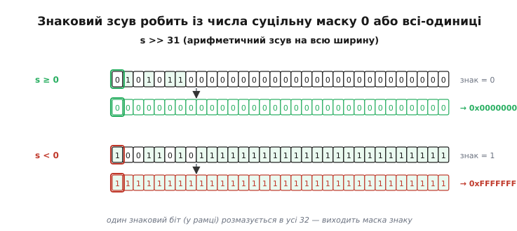
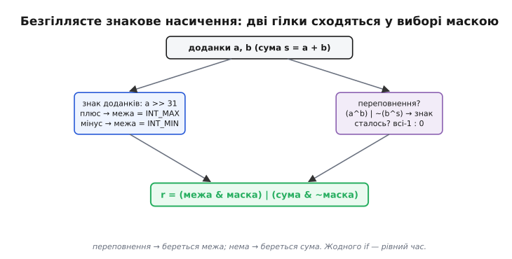

# ⚙️ Безгіллясте насичення й апаратні інтринсики

У циклі обробки звуку насичення трапляється не раз і не тисячу разів — мільйони разів на секунду. І щоразу наївна реалізація ставить `if`: «а чи вилізли ми за стелю?». Кожен такий `if` — це розвилка, яку процесор мусить **вгадати наперед**, ще не знаючи відповіді, бо [конвеєр](topic:hw-arch/pipeline) починає виконувати наступні інструкції задовго до того, як стане відомий результат порівняння. Коли вихідний сигнал спокійний, за межу не вилазить ніхто, вгадування «розвилки не буде» справджується — і все летить. Але щойно сигнал стає гучним, семпли починають клацати за межу нерегулярно: то виліз, то ні. Передбачувач збивається, конвеєр раз по раз спорожнюється, і саме в **найгучнішому** місці — там, де насичення й потрібне найбільше — код раптово гальмує.

Задача цієї вставки — прибрати `if` зовсім. Спершу зберемо переносний затиск, що працює для будь-якої ширини одним шаблоном. Тоді виведемо **безгіллясті** прийоми: результат обчислюють однією формулою через біти знаку, без жодної розвилки, тож час однаковий і на тихому, і на гучному сигналі. А наприкінці — коли насичувати вміє саме залізо: інтринсики ядер Cortex-M, що складають-і-насичують однією командою й ще й лишають «липкий» слід, чи взагалі десь стався кліпінг.

Скрізь код — реальний C для прошивки з `<stdint.h>`, не псевдокод. Компілюється під `-O2`, працює на мікроконтролері.

## Переносний затиск: один шаблон на всі ширини

Почнімо з фундаменту, на якому все стоїть, — з чесного затиску (англ. *clamp* — «затиснути в лещатах»). Ідея гранично проста: перш ніж рахувати, перейти у **ширший тип**, де сума фізично не може вилізти за край, а вже тоді зрізати результат у дозволені межі. Раз сума живе в типі, де для неї завжди досить місця, саме додавання ніколи не переповнюється — а виходить, і брехати нема коли.

**Затиск довільного значення `v` у межі `[lo, hi]` — основа всього далі.**

:::tabs
```c
#include <stdint.h>

static inline int32_t clamp_i32(int32_t v, int32_t lo, int32_t hi) {
    if (v < lo) return lo;
    if (v > hi) return hi;
    return v;
}
```
```python
def clamp_i32(v, lo, hi):
    if v < lo:
        return lo
    if v > hi:
        return hi
    return v
```
:::

Це ще з `if`, зате гранично зрозуміло, і саме таку форму варто мати як еталон — з нею звірятимемо безгіллясті версії. Насичувальне додавання тепер збирається в один рядок: порахувати з запасом, затиснути в межі цільового типу.

**Складаємо два 8-бітні знакові семпли з насиченням — рахуємо в 16 бітах, тоді затискаємо.**

:::tabs
```c
#include <stdint.h>

int8_t add_sat_s8(int8_t a, int8_t b) {
    int16_t sum = (int16_t)a + b;          // ширший тип: вилізти нікуди
    return (int8_t)clamp_i32(sum, -128, 127);
}
```
```python
def add_sat_s8(a, b):
    sum_ = a + b                           # int безмежний: вилізти нікуди
    return clamp_i32(sum_, -128, 127)
```
:::

Той самий шаблон масштабується на будь-яку ширину, аби лишався щабель ширшого типу під суму. Але писати окрему функцію на кожну ширину — марнота: тіло однакове, різняться лише межі й типи. Тому оформимо шаблон **макросом**, що сам підставляє потрібні константи. У прошивці макрос тут доречніший за `_Generic` чи C++-шаблон: він розгортається в те саме тіло без жодних припущень про компілятор, а межі `INTx_MIN/MAX` уже дає `<stdint.h>`.

**Один макрос породжує насичувальне додавання для будь-якої знакової ширини.**

```c
#include <stdint.h>

// NARROW — цільовий тип (int8_t), WIDE — тип із запасом (int16_t),
// LO/HI — межі цільового типу.
#define DEFINE_ADD_SAT(NAME, NARROW, WIDE, LO, HI)          \
    static inline NARROW NAME(NARROW a, NARROW b) {         \
        WIDE sum = (WIDE)a + (WIDE)b;                       \
        if (sum < (LO)) sum = (LO);                         \
        if (sum > (HI)) sum = (HI);                         \
        return (NARROW)sum;                                 \
    }

DEFINE_ADD_SAT(add_sat_s8,  int8_t,  int16_t, INT8_MIN,  INT8_MAX)
DEFINE_ADD_SAT(add_sat_s16, int16_t, int32_t, INT16_MIN, INT16_MAX)
DEFINE_ADD_SAT(add_sat_s32, int32_t, int64_t, INT32_MIN, INT32_MAX)
```

Три рядки — три коректні функції, кожна зі своїм ширшим типом. Компілятор під `-O2` часто сам перетворює ці `if` на умовні пересилки (на Cortex-M — інструкції з умовним виконанням чи `CSEL` на новіших ядрах), тож навіть така «наївна» форма нерідко виходить безгіллястою після оптимізації. Але покладатися на це не можна — на слабшому компіляторі чи нижчому рівні оптимізації `if` залишиться `if`. Коли час у циклі критичний, розвилку прибирають **вручну**, і саме тут починається найцікавіше.

> 🔧 **Навіщо це.** Шаблон «порахувати ширше → затиснути» — це те, що варто тягнути в кожен новий проєкт як готовий макрос. Він читається з першого погляду, не має пасток зі знаком і покриває 8/16/32 біти одним рядком реєстрації. Ручні бітові трюки нижче лишайте для гарячих циклів, де профайлер показав, що затиск справді коштує; для решти коду переносний макрос — правильний вибір за замовчуванням.

## Перевірка на межі типу: чому переставлена нерівність безпечна

Шаблон із ширшим типом упирається в стелю, коли ширшого типу вже **нема** — коли ми на найширшому цілому машини. Порахувати `a + b` наперед і подивитися, чи не переповнилось, тут не можна: саме це додавання й є те, що переповнюється. Для беззнакового переповнення в C — це визначена «загортальна» поведінка, тож у `a + b` просто ляже неправильне число; для [знакового переповнення — узагалі невизначена поведінка](topic:sf-lang/overflow-wraparound), і компілятор має право викинути перевірку, яка йде **після** нього. Тож перевіряти треба **до** операції.

Хитрість — переставити нерівність так, щоб у ній самій нічого не переповнилось. Для беззнакового додавання питання «чи `a + b > MAX`?» рівносильне «чи `a > MAX − b`?»:

```
a + b > MAX        ⇔        a > MAX − b
```

Права форма безпечна, бо `MAX − b` завжди коректне: `b` за побудовою не більше за `MAX`, отже різниця не йде в мінус і сама не переповнюється. Вираз `MAX − b` читається дослівно — «скільки ще місця лишилося над нулем, якщо вже забронювати `b`». Якщо `a` не влазить у цей залишок, суми не буде — віддаємо стелю.

**Насичувальне додавання беззнакового 32-бітного на самій межі типу.**

:::tabs
```c
#include <stdint.h>

uint32_t add_sat_u32(uint32_t a, uint32_t b) {
    if (a > UINT32_MAX - b) return UINT32_MAX;  // місця під a вже нема
    return a + b;                                // тут гарантовано влазить
}
```
```python
UINT32_MAX = 0xFFFFFFFF

def add_sat_u32(a, b):
    if a > UINT32_MAX - b:      # місця під a вже нема
        return UINT32_MAX
    return a + b                # тут гарантовано влазить
```
:::

Зі знаковим на межі типу перестановка теж працює, але хитріша, бо вилізти можна в **обидва** боки, і кожен бік вимагає своєї межі залежно від знаку доданка. Коли `b ≥ 0`, небезпечна лише верхня межа; коли `b < 0` — лише нижня. Це вже природний місток до бітових трюків: знак доданка сам вибирає, яку межу перевіряти, — а «вибрати за знаком без `if`» і є вся суть безгіллястого стилю.

## Головне: безгіллясте насичення через маску знаку

Тепер до серця вставки. Хочемо результат **без жодної розвилки** — щоб час був однаковий незалежно від даних. Уся техніка тримається на одному спостереженні: знаковий зсув **арифметично вправо** на всю ширину типу перетворює число на **маску суцільного знаку**.

Розберімо це до кінця, бо на ньому все стоїть. Візьмемо 32-бітне ціле `s` і зсунемо його вправо на 31 позицію знаковим (арифметичним) зсувом:

```
s ≥ 0   →   s >> 31  =  0x00000000   (усі біти нулі)
s < 0   →   s >> 31  =  0xFFFFFFFF   (усі біти одиниці)
```

Чому саме так: арифметичний зсув вправо **тягне за собою знаковий біт**, копіюючи його в усі старші позиції. Зсунувши на повну ширину мінус один, ми «розмазуємо» єдиний знаковий біт на всі 32 — і дістаємо або суцільні нулі (число було невід'ємне), або суцільні одиниці (було від'ємне). Вийшла маска, що кодує знак: 0 означає «плюс», −1 (усі одиниці) означає «мінус». Ця маска — цеглинка, з якої складають усі безгіллясті вибори: `x & mask` дає `x`, коли маска суцільна, і `0`, коли порожня, тож `(mask & p) | (~mask & q)` вибирає `p` або `q` без жодного `if`.


*Арифметичний зсув вправо копіює знаковий біт у старші позиції. Зсув на ширину−1 копіює його в усі біти: невід'ємне число дає суцільні нулі, від'ємне — суцільні одиниці. Так один знаковий біт стає маскою на весь розряд, з якої будують вибір «те або те» без розгалуження.*

### Беззнаковий випадок: r = s | −(s < a)

Найчистіший приклад — беззнакове додавання. Складаємо у самому цільовому типі й дозволяємо переповненню статися; потім **виявляємо** його й накриваємо маскою. Ключ: якщо беззнакова сума `s = a + b` переповнилась, вона «загорнулась» і стала **меншою** за будь-який зі своїх доданків. Отже `s < a` — рівно тоді, коли треба насичувати.

```
s < a   →   переповнення сталося   →   маска = 0xFFFFFFFF
s ≥ a   →   усе гаразд             →   маска = 0x00000000
```

Порівняння `s < a` дає 0 або 1; оператор мінус перетворює цю 1 на `0xFFFFFFFF` (у беззнаковому −1 — це всі одиниці), а 0 лишає нулем. Тоді `s | mask` або лишає `s` недоторканим (маска нульова), або заливає всі біти в одиниці — а всі одиниці й **є** `UINT32_MAX`, наша стеля.

**Беззнакове насичувальне додавання без жодної розвилки.**

```c
#include <stdint.h>

uint32_t add_sat_u32_bl(uint32_t a, uint32_t b) {
    uint32_t s = a + b;          // хай переповниться — це визначена поведінка
    s |= -(uint32_t)(s < a);     // переповнилось → залити всі біти в 1 = MAX
    return s;
}
```

Один рядок логіки, жодного `if`, час незалежний від даних. Це той самий трюк, що й `r = s | −(s>>N)` з формулювання задачі, лише детектор переповнення тут — порівняння `s < a`, а не старший біт: обидва дають ту саму маску, просто беруть її з різних місць. Форму через зсув старшого біта побачимо в знаковому варіанті, де саме знак результату сигналить про біду.

### Знаковий випадок: маска знаку вибирає стелю або підлогу

Зі знаковим складніше на один крок. Тут переповнення буває двобічне, і кінець, у який треба насичувати, залежить від знаку доданків: два додатні, що переповнились, мусять сісти на `INT_MAX`; два від'ємні — на `INT_MIN`. Тобто спершу треба **обчислити правильну межу** зі знаку, а тоді **виявити**, чи переповнення взагалі сталося.

Межу дає знак доданка (у переповненні знаки доданків однакові, тож байдуже котрого). Класичний прийом із бібліотеки lockless.inc збирає її навдивовижу ощадливо: узяти **беззнаковий** зсув знаку — він дає рівно `0` або `1` — і додати до `INT_MAX`.

```c
uint32_t ua = (uint32_t)a;
int32_t  limit = (int32_t)((ua >> 31) + INT32_MAX);
```

Тут криється тонкість, на якій легко послизнутися, тож розкриймо обидва випадки повільно. Зсув `ua >> 31` — **логічний** (бо `ua` беззнакове), він просто виштовхує всі біти, крім знакового, лишаючи його наймолодшим: виходить `0` для невід'ємного `a` і `1` для від'ємного — не `0xFFFFFFFF`, а саме `1`. Тепер додаємо до `INT_MAX = 0x7FFFFFFF`:

```
a ≥ 0:  (ua>>31) = 0;  0 + 0x7FFFFFFF = 0x7FFFFFFF = INT_MAX
a < 0:  (ua>>31) = 1;  1 + 0x7FFFFFFF = 0x80000000 = INT_MIN  (читаємо як знакове)
```

Ось де вся краса: `0x7FFFFFFF + 1` беззнаково дає `0x80000000`, а це бітовий образ `INT_MIN`. Один додаток `+INT_MAX` перемикає межу з `INT_MAX` на `INT_MIN` рівно тоді, коли знаковий біт піднятий. Важливо саме **логічний** зсув беззнакового (`0`/`1`), а не арифметичний знаковий (`0`/`−1`): з `−1` це додавання дало б `0x7FFFFFFE`, геть не те. Плутанина «який зсув» тут — типова помилка, і саме тому цей рядок треба **виводити**, а не тягнути з пам'яті.

Хто хоче межу без цієї тонкощі, збирає її явним вибором за маскою — та сама безгіллястість, зате очевидно правильна з першого погляду:

```c
int32_t mask  = a >> 31;                  // арифметичний: 0 або −1 (знак доданків)
int32_t limit = (mask & INT32_MIN) | (~mask & INT32_MAX);
// a ≥ 0 → mask=0  → limit = INT_MAX;   a < 0 → mask=−1 → limit = INT_MIN
```

Обидві форми дають те саме; перша коротша, друга прозоріша. Далі беру прозорішу — читати код важливіше, ніж заощадити інструкцію, яку компілятор усе одно згорне.

Тепер лишилося виявити переповнення й підмінити суму межею **лише** тоді, коли воно сталося. Знакове переповнення при додаванні має чітку прикмету: воно буває тільки коли доданки **одного знаку**, а результат виходить **іншого**. Це ловиться двома XOR:

```
однаковий знак a і b   ⇔   (a ^ b) < 0  хибне  ⇔  (a ^ b) ≥ 0
результат «зіпсувався»  ⇔   (a ^ s) < 0
переповнення            ⇔   (a ^ b) ≥ 0   І   (a ^ s) < 0
```

Обидві умови зводять до одного знакового виразу, чий старший біт і є прапорцем переповнення, а `>> 31` розмазує його в маску. Складаємо все докупи.

**Знакове насичувальне додавання без розгалужень.**

```c
#include <stdint.h>

int32_t add_sat_s32_bl(int32_t a, int32_t b) {
    // беззнакова сума — щоб саме додавання не було UB
    uint32_t ua = (uint32_t)a, ub = (uint32_t)b;
    uint32_t us = ua + ub;
    int32_t  s  = (int32_t)us;

    // межа за знаком доданків: a≥0 → INT_MAX, a<0 → INT_MIN
    int32_t m     = a >> 31;
    int32_t limit = (m & INT32_MIN) | (~m & INT32_MAX);

    // переповнення ⇔ доданки одного знаку, а сума — іншого
    // ((a ^ b) — знаки різні?) АБО-НІ з ((a ^ s) — сума зіпсувалась?)
    int32_t overflow = (int32_t)((ua ^ ub) | ~(ub ^ us));
    // overflow < 0  рівно тоді, коли переповнення НЕ сталося
    int32_t of_mask  = ~(overflow >> 31);   // сталось → усі 1; ні → усі 0

    return (int32_t)((limit & of_mask) | (s & ~of_mask));
}
```

Розберемо детектор, бо він найтонший. Вираз `(ua ^ ub)` має від'ємний старший біт, коли знаки доданків **різні** — тоді переповнення неможливе. Вираз `~(ub ^ us)` має від'ємний старший біт, коли знаки `b` і суми **однакові** — тобто сума **не** зіпсувалась. Об'єднані через `|`, вони дають від'ємний результат (старший біт 1), коли переповнення **не сталося** хоча б з однієї причини; невід'ємний — коли сталося. Тому `overflow >> 31` дає −1 при «все гаразд», інверсія `~(...)` перевертає це на «сталося → усі одиниці». Далі звичайний вибір маскою: `limit` там, де переповнення, `s` — де його нема.

Цей код — прямий нащадок класичної реалізації з lockless.inc; я лишень розписав вибір явними масками замість умовної пересилки, щоб логіка читалася, а не ховалася в `cmov`. Компілятор під `-O2` усе одно згорне це в кілька інструкцій без жодного переходу.


*Дві незалежні гілки-обчислення сходяться в кінці. Ліва рахує межу зі знаку доданків (плюс → стеля, мінус → підлога). Права виявляє переповнення двома XOR і робить із нього суцільну маску. Фінальний вибір `(межа & маска) | (сума & ~маска)` бере межу там, де сталося переповнення, і суму — де ні. Жодного переходу: час однаковий на будь-яких даних.*

### Пастки бітових трюків

Ці прийоми елегантні, але крихкі — кожен крок стоїть на припущенні, яке легко порушити недбалістю. Ось граблі, на які наступають найчастіше.

**Арифметичний зсув — не гарантований стандартом.** Уся техніка спирається на те, що `>>` для **знакового** типу тягне знаковий біт (арифметичний зсув). Але стандарт C до C++20 лишав знак результату правого зсуву від'ємного числа **визначеним реалізацією** — теоретично компілятор міг зробити логічний зсув (нулями). На практиці всі реальні компілятори для Cortex-M роблять арифметичний (інструкція `ASR`), і C++20 нарешті це закріпив, зобов'язавши арифметичний зсув для знакових. Та коли пишете строго переносний код — не покладайтеся на це мовчки: або документуйте припущення, або будуйте маску через `0 − (unsigned)(x < 0)`, що визначено скрізь.

**Зсув на всю ширину типу — невизначена поведінка.** Зсунути 32-бітне на 32 (а не 31) — це **UB**: стандарт забороняє зсув на кількість, більшу-рівну ширині типу. Тому в 32-бітних формулах скрізь `>> 31`, а не `>> 32`. Для 8-бітного значення, розширеного до `int`, це взагалі `>> 31`, бо працюємо в 32-бітному `int` після інтегрального піднесення (англ. *integer promotion*) — не `>> 7`. Плутанина «на скільки зсовувати» — джерело найпідступніших багів: код працює на тестах і зривається на граничному вводі.

**Інтегральне піднесення міняє ширину під ногами.** У C будь-який `int8_t`/`int16_t` в арифметиці **автоматично** підноситься до `int` (зазвичай 32-бітного). Тому `s >> 8` для 8-бітної суми, що лежить у `int`, — помилка: знак сидить у біті 31, а не 7. Або приводьте до фіксованого типу явно, або тримайте формули в тому типі, у якому реально лежить число. Це те місце, де беззнаковий трюк `r = s | −(s>>N)` вимагає, щоб `N` відповідало **фактичній** ширині зберігання, а не номінальній ширині вихідних байтів.

**Змішування знакового й беззнакового.** Саме додавання робимо в **беззнаковому** типі (загортання визначене), а порівняння знаку — у **знаковому**. Переплутати легко: додати як `int32_t` — і компілятор має право вважати, що переповнення не буває, та стерти вашу перевірку. Тримайте межу чітко: рахунок — `unsigned`, аналіз знаку — `signed`, приведення — явні.

## Апаратне насичення: інтринсики Cortex-M

Найшвидший шлях — не рахувати насичення взагалі, а попросити **залізо**. Ядра ARM Cortex-M від рядка Cortex-M4 і вище (архітектура Armv7E-M) мають DSP-розширення з командами, що складають-і-насичують **однією інструкцією**: жодного ширшого типу, жодної маски, жодного `if`. Історію того, як це прийшло зі спеціалізованих сигнальних процесорів у масові мікроконтролери, зібрано в темі-власниці окремо; тут — суто практика виклику з C.

Команди подають як **інтринсики** (англ. *intrinsic* — «вбудований») — псевдофункції з `cmsis_gcc.h`, кожна з яких компілюється рівно в одну машинну команду. Головні три:

- **`__QADD`** / **`__QSUB`** — знакове 32-бітне складання/віднімання з насиченням у межі `int32_t`. Сигнатура: `uint32_t __QADD(uint32_t, uint32_t)` (біти передають як `uint32_t`, зміст — знаковий).
- **`__SSAT`** — затиснути знакове значення в діапазон знакового числа заданої **розрядності**. `int32_t __SSAT(int32_t value, uint32_t sat)`, де `sat` — скільки бітів (1..32). `__SSAT(x, 8)` затискає `x` у `[−128, 127]` однією командою.
- **`__USAT`** — те саме в беззнакову межу: `uint32_t __USAT(int32_t value, uint32_t sat)`, `sat` = 0..31. `__USAT(x, 8)` затискає в `[0, 255]`.

`__SSAT`/`__USAT` — точно той затиск у ширшому типі, що ми писали вручну, але за **одну** інструкцію й для довільної розрядності до 32. Це безцінно для нестандартних форматів фіксованої коми: 12-бітний АЦП, 10-бітний ШІМ, будь-яка «дивна» ширина затискається без єдиної маски.

**Насичення 16-бітного семпла після підсилення — одна апаратна команда замість затиску.**

```c
#include <stdint.h>
#include "cmsis_gcc.h"          // __SSAT, __QADD, __get_APSR

int16_t amplify_sat(int16_t x, int32_t gain_q8) {
    int32_t y = ((int32_t)x * gain_q8) >> 8;   // множення у Q8, повертаємо масштаб
    return (int16_t)__SSAT(y, 16);             // затиск у [−32768, 32767] однією дією
}
```

Тут `__SSAT(y, 16)` заступає пару `if`: якщо добуток після підсилення виліз за 16-бітну межу, команда сама садить його на найближчий кінець і **піднімає прапорець насичення Q**. А `__QADD` складає два повні 32-бітні семпли з насиченням, знову ж без жодного `if`:

**Складання двох 32-бітних сигналів із апаратним насиченням.**

```c
#include <stdint.h>
#include "cmsis_gcc.h"

int32_t add_sat_s32_hw(int32_t a, int32_t b) {
    return (int32_t)__QADD((uint32_t)a, (uint32_t)b);   // одна команда QADD
}
```

Порівняйте це з нашим безгіллястим `add_sat_s32_bl` на дюжину рядків — залізо робить те саме однією інструкцією. На Cortex-M0/M0+ (архітектура Armv6-M) цих команд **немає**: `__QADD` там недоступний, а `__SSAT`/`__USAT` CMSIS підмінює програмною емуляцією. Тому бітові трюки з попереднього розділу — не архаїзм: на найменших ядрах вони лишаються єдиним безгіллястим шляхом.

### Липкий прапорець Q: гуртове виявлення кліпінгу

Тут — родзинка апаратного насичення на ARM. Кожна насичувальна команда (`QADD`, `SSAT`, `USAT` і решта) при спрацюванні межі піднімає біт **Q** у регістрі стану APSR (англ. *Application Program Status Register*). І цей біт — **липкий** (англ. *sticky* — «липкий, що не спадає сам»): на відміну від звичайних прапорців N/Z/C/V, що перезаписуються після кожної операції, Q, раз піднятий, **лишається** піднятим, доки програма явно його не скине. Він накопичує факт «хоч раз ми вперлися в межу» на будь-якій довжині обчислень.

Практична цінність — величезна. Замість перевіряти прапорець після **кожного** семпла (що з'їло б увесь виграш від безгіллястості) ми скидаємо Q **один раз** перед циклом, женемо весь буфер на повній швидкості, а тоді **один раз** питаємо: чи Q піднявся? Якщо так — десь у блоці стався кліпінг, сигнал був гучніший за межу. Одна перевірка на тисячі семплів замість тисячі перевірок.

Біт Q сидить у розряді **27** регістра APSR; CMSIS дає для нього готові константи `APSR_Q_Pos` (= 27) і `APSR_Q_Msk`. Прочитати APSR можна інтринсиком `__get_APSR()`. А от **скинути** Q — окрема морока, і саме тут криється пастка: у стандартному CMSIS **немає** `__set_APSR()` (є лише `__get_APSR()`). Записати прапорці назад можна тільки командою `MSR` через вбудований асемблер, причому по спеціальному імені `APSR_nzcvq`, що дозволяє запис саме групи прапорців N,Z,C,V,Q:

**Скинути липкий Q перед блоком і перевірити після — правильний, переносний спосіб.**

```c
#include <stdint.h>
#include "cmsis_gcc.h"          // __QADD, __get_APSR, APSR_Q_Msk

// скинути липкий прапорець Q (обнулити біти прапорців APSR)
static inline void clear_q_flag(void) {
    // у CMSIS немає __set_APSR — пишемо APSR прямо, ім'я APSR_nzcvq
    // дозволяє MSR писати групу N,Z,C,V,Q; 0 гасить усі, зокрема Q
    __asm volatile ("msr APSR_nzcvq, %0" : : "r" (0u) : "cc");
}

// чи Q піднятий (чи хоч раз насичували)
static inline int q_flag_set(void) {
    return (__get_APSR() & APSR_Q_Msk) != 0u;
}

// складаємо два блоки 16-бітних семплів із насиченням; кажемо, чи був кліпінг
int mix_saturating(int16_t *dst, const int16_t *a,
                   const int16_t *b, uint32_t n) {
    clear_q_flag();                                  // Q ← 0 один раз
    for (uint32_t i = 0; i < n; i++) {
        // __QADD насичує у 32-бітну межу; для суми двох int16 запасу з головою,
        // але межу підняв би саме кліпінг — а він тут не станеться на 16-бітних,
        // тож для чесного 16-бітного насичення беремо __SSAT після додавання:
        int32_t s = (int32_t)a[i] + b[i];
        dst[i] = (int16_t)__SSAT(s, 16);             // насичує + піднімає Q
    }
    return q_flag_set();                             // 1 → десь у блоці був кліпінг
}
```

Зверніть увагу на тонкість, через яку я взяв `__SSAT`, а не `__QADD`, для 16-бітного міксу. `__QADD` насичує у **32-бітну** межу — а сума двох `int16_t` ніколи за `int32_t` не вилазить, тож Q від `__QADD` тут **ніколи** не піднявся б, і «виявлення кліпінгу» мовчало б завжди. Щоб Q справді ловив вихід за **16-бітну** шкалу семпла, насичувати треба саме в 16 бітів — це й робить `__SSAT(s, 16)`, підіймаючи Q рівно тоді, коли 16-бітний семпл клацнув за межу. Це типова пастка: узяти команду з ширшою межею, ніж потрібно, і дивуватися, чому прапорець мертвий.

> 🔧 **Навіщо це.** Липкий Q перетворює насичення з тихого спотворення на **діагностований** стан. У реальному пристрої — гітарна педаль, вимірювальний тракт, привід — це те, чим світять світлодіодом «кліп» або пишуть у лог: пройшов буфер, Q піднявся — отже, десь зрізало, і треба зменшити підсилення. Перевіряти кожен семпл — задорого; один запис і одне читання прапорця на весь блок — задарма. Головне не переплутати ширину насичення з шириною величини, інакше прапорець ловитиме не те переповнення, якого ви боїтесь.

### Гуртове насичення пакетом: одна команда на кілька семплів

Ті самі DSP-розширення вміють насичувати **кілька семплів за раз**. Команда `SSAT16` (інтринсик `__SSAT16`) затискає **обидві** 16-бітні половини 32-бітного слова в задану знакову розрядність однією дією — тобто два семпли за такт. У парі з упакованим складанням `__QADD16` (два 16-бітні насичувальні додавання в одному слові) це подвоює темп циклу без жодної додаткової логіки.

**Насичуємо два 16-бітні семпли одразу, спаковані в 32-бітне слово.**

```c
#include <stdint.h>
#include "cmsis_gcc.h"          // __QADD16 — два насичувальні 16-бітні додавання

// a і b містять по два int16 (нижня й верхня половини);
// __QADD16 складає обидві пари з насиченням у 16-бітну межу одразу
uint32_t add2_sat_s16(uint32_t a, uint32_t b) {
    return __QADD16(a, b);      // два насичувальні додавання за одну команду
}
```

`__QADD16` — це вже справжня SIMD-дія (англ. *Single Instruction, Multiple Data* — «одна команда, багато даних»): один опкод обробляє два незалежні семпли, кожен насичуючи у свою 16-бітну межу. Обробляючи звук блоками по два семпли, ви вдвічі скорочуєте кількість інструкцій у гарячому циклі. Комбінуючи `__QADD16` для суми з `__SSAT16` для фінального затиску, будують компактні цикли мікшування, де насичення практично безкоштовне — воно вбудоване в ту саму команду, що й арифметика.

## Складність і остаточні пастки

Складімо докупи, коли який прийом брати й де кожен ламається.

**Переносний затиск у ширшому типі** — час O(1), кілька інструкцій, працює **скрізь** без жодних припущень про залізо. Ціна — потрібен щабель ширшого типу; на найширшому цілому машини вже не вийде. Пастка: писати `uint8_t sum = a + b` замість `uint16_t` — переповнення станеться **до** затиску, і зрізати буде вже нічого.

**Перевірка до операції** (переставлена нерівність) — рятує саме там, де ширшого типу нема. Час O(1), одне порівняння. Пастка: переставити нерівність неправильно й дати перевірці самій переповнитись; безпечна форма — та, де віднімання (`MAX − b`) не може піти за межу.

**Безгіллясте через маску знаку** — рівний час незалежно від даних, ідеальне для гарячих циклів на слабких ядрах без апаратного насичення. Ціна — крихкість: три окремі припущення (арифметичний зсув, коректна ширина зсуву, чистий поділ знакового й беззнакового), кожне з яких мовчки ламає результат на граничному вводі, а не на звичайному. Не пишіть це з пам'яті — **виводьте** щоразу.

**Апаратні інтринсики** — одна команда, найшвидше, ще й з липким Q для гуртового виявлення. Ціна — тільки Cortex-M4 і вище (Armv7E-M); на M0/M0+ `__QADD` немає, а `__SSAT`/`__USAT` емулюються. Пастки: `__QADD` насичує в 32 біти, тож для вужчих семплів Q мовчить — беріть `__SSAT`/`__USAT` під **фактичну** розрядність; і пам'ятайте, що скинути Q треба через `MSR APSR_nzcvq`, бо `__set_APSR` у CMSIS немає.

Спільна нитка всіх чотирьох прийомів одна: насичення — це завжди **«обчисли з запасом або виявь вихід за межу, тоді підмінь результат краєм»**. Наївний варіант робить підміну через `if`; безгіллясті — через маску; залізо — вбудованою командою. Що вужче місце в циклі й що слабше ядро, то далі по цій шкалі доводиться йти — від зрозумілого `if` до бітового трюку, а де є DSP-розширення — до однієї апаратної інструкції, що складає, насичує й лишає слід за один такт.
