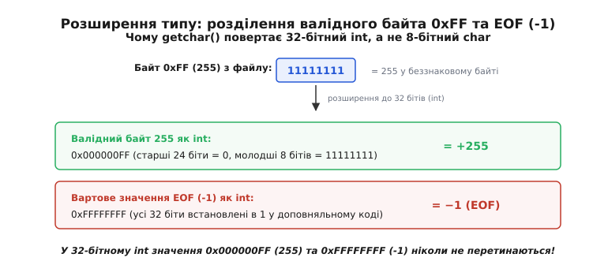
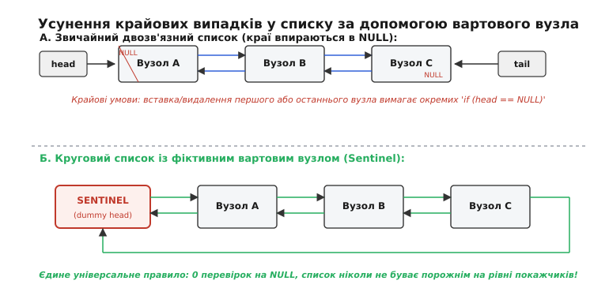

# Вартові значення: як позначити «нічого» всередині типу

<preknowlist>
- [Біти й порядок байтів](topic:sf-algorithms/bits-bytes-endianness) — як дані та покажчики розташовуються в пам'яті, що покажчик — це числова адреса комірки.
- [Цілі типи в C/C++](topic:sf-lang/integer-types-c) — розміри цілих чисел, знаковість, межі діапазонів і правила приведення типів.
- [Плаваюча кома](topic:hw-arch/floating-point) — формат стандарту IEEE 754, структура знаку, експоненти та мантиси.
</preknowlist>

Функція пошуку в масиві з мільйона записів сканує пам'ять у пошуку ідентифікатора користувача. Якщо запис знайдено, функція повертає ціле число від `0` до `999 999`, що вказує на його індекс. Що має повернути ця сама функція, якщо користувача з таким ключем у системі не існує? Промисловий термометр на шині I2C або Modbus RTU щосекунди надсилає виміряне значення температури як знаковий 16-бітний цілий дріб. Що має прочитати мікроконтролер, якщо лінію живлення давача обірвано, лінія підтяжки тримає високий рівень або АЦП зафіксував внутрішній апаратний збій?

Якщо драйвер поверне умовне число `-32768` (`0x8000`) як сигнал обриву лінії, а керуюча програма кліматичної установки без перевірки додасть це значення до масиву для обчислення середньодобової температури, підсумкове значення миттєво впаде до глибокого мінуса. Автоматика увімкне максимальний нагрів теплових гармат на об'єкті, вважаючи, що в приміщенні настав екстремальний мороз.

Будь-яка програма, що взаємодіє з фізичним світом, операційною системою чи динамічними колекціями, неминуче стикається з потребою виразити стан **відсутності значення**, обчислювальної порожнечі чи кінця потоку даних. На фізичному рівні пам'ять комп'ютера не має спеціального тригерного стану «тут нічого немає»: кожен виділений біт і байт завжди містить конкретну комбінацію нулів або одиниць. Те, у який спосіб архітектори мов і системні розробники кодують цей стан порожнечі всередині машинних типів, визначило структуру системних інтерфейсів, правила роботи компіляторних оптимізаторів і природу найнебезпечніших вразливостей в історії програмного забезпечення.

---

### In-band проти Out-of-band: дві філософії сигналізації

Коли один програмний модуль передає результат роботи іншому модулю або периферійному пристрою, існує лише два фундаментальних архітектурних способи повідомити, що дійсного результату обчислення немає.

Перший шлях — **внутрішньосмугова сигналізація** (англ. *in-band signaling*). Ви обираєте одне конкретне значення з того самого типу даних, що й корисний результат, і за домовленістю оголошуєте його спеціальним «вартовим» (англ. *sentinel value*). Якщо функція пошуку повертає 32-бітне ціле число зі знаком, ви призначаєте число `-1` індикатором «не знайдено»; якщо підпрограма виділяє пам'ять і повертає адресу, числова адреса `0x0` оголошується нульовим покажчиком; якщо потік читає байти ASCII-тексту, байт `0x00` маркує фізичний кінець рядка.

Другий шлях — **позасмугова сигналізація** (англ. *out-of-band signaling*). Ви повністю відокремлюєте канал передачі статусу від каналу передачі самих даних. Функція повертає окрему структуру, пару значень або типізований варіант (наприклад, `std::optional<T>` у C++, `Option<T>` у Rust чи кортеж `(bool has_value, T value)`), де прапорець валідності існує фізично поруч із даними, але не змішується з їхнім числовим діапазоном.


*Внутрішньосмугова (in-band) сигналізація розміщує вартове значення просто всередині діапазону типу, заощаджуючи пам'ять ціною втрати одного допустимого стану. Позасмугова (out-of-band) сигналізація виносить статус в окремий канал, забезпечуючи повний діапазон даних і строгий контроль компілятора за рахунок додаткових байтів пам'яті.*

Головна перевага внутрішньосмугового вартового — **абсолютно нульові накладні витрати пам'яті та гранична простота виклику**. Вам не потрібно створювати обгортки, розмір повертаного значення точно дорівнює розміру машинного регістра, а передача результату через регістри процесора (наприклад, `RAX` у x86-64 або `x0` в ARM64) не вимагає виділення кадрів стека чи операцій копіювання складних структур.

Проте за цю нульову ціну в байтах програміст розплачується двома фундаментальними проблемами:

1. **Крадіжка валідного стану (Domain Intrusion)**: призначивши число вартовим, ви безповоротно вилучаєте його з простору коректних даних. Якщо функція зчитування температури повертає `-1` при помилці зв'язку, прилад втрачає здатність зафіксувати реальний мороз у `-1 °C`. Якщо функція пошуку в компактній таблиці на 256 елементів повертає восьмибітне число `0xFF` як вартового, масив може зберігати щонайбільше 255 дійсних комірок.
   У системних викликах POSIX (зокрема `read()` та `write()`) повертане значення має знаковий тип `ssize_t`, де `-1` позначає помилку. Це рішення зменшило максимально допустимий обсяг передачі даних за один виклик рівно вдвічі порівняно з беззнаковим типом `size_t` (наприклад, на 32-бітних системах ліміт впав з 4 ГБ до 2 ГБ).
2. **Повна сліпота системи типів**: компілятор бачить вартове значення як звичайне число відповідного типу. Для компілятора C число `-1`, отримане з функції `get_index()`, є абсолютно валідним індексом. Якщо програміст випадково забуває написати умовну перевірку `if (idx == -1)`, програма продовжить виконання і використає `-1` для адресації масиву, прочитавши сміття перед початком буфера або спричинивши руйнування стека.

Історично внутрішньосмугова сигналізація з'являлася скрізь, де апаратні ресурси були жорстко обмежені. У перших телефонних мережах службовий сигнал розриву з'єднання транслювався на частоті 2600 Гц у тій самій голосовій смузі, де велися розмови. Коли ентузіасти виявили, що іграшковий свисток із коробки пластівців «Captain Crunch» генерує точний звук 2600 Гц, вони отримали змогу безкоштовно керувати телефонними станціями, просто свиснувши в трубку. Подібні інженерні компроміси в комп'ютерних системах описано в [історії виникнення помилки на мільярд доларів](topic:sf-lang/sentinel-values/hist-billion-dollar-mistake.md).

> 🔧 **Навіщо це.** Під час розробки бінарного протоколу чи інтерфейсу драйвера контролера вибір між in-band та out-of-band визначається повнотою фізичного діапазону. Якщо 12-бітний АЦП видає коди від `0` до `4095`, а передача йде в 16-бітному слові, значення `0xFFFF` є ідеальним in-band вартовим, бо воно фізично лежить за межами розрядності перетворювача. Якщо ж давач використовує всі 65 536 значень 16-бітного типу, використання in-band вартового призведе до спотворення даних: єдиним надійним варіантом стає передача окремого байта статусу.

---

### Класичні вартові значення: машинна анатомія

За десятиліття розвитку системного програмування кілька внутрішньосмугових вартових значень стали фундаментальними стандартами обчислювальної техніки.

#### 1. Нульовий символ `\0` (NUL-термінатор у мові C)

У мовах C та C++ масив символів `char` не містить метаданих про свою фактичну довжину. Замість префікса довжини послідовність символів завершується байтом із нульовим числовим значенням `0x00` (символ `\0`, або `ASCII NUL`).

```
Розкладка в пам'яті: [ 'U' | 'n' | 'i' | 'x' | 0x00 ]
Індекси в масиві:      0     1     2     3     4  <- вартовий кінець рядка
```

Цей вибір дозволив на машинах PDP-11 заощаджувати один-два байти на кожному рядковому літералі. Однак це породило системні наслідки для всієї комп'ютерної індустрії:

- **Лінійна складність `strlen`**: обчислення довжини рядка потребує послідовного читання кожного байта пам'яті до моменту знаходження `\0`. Навіть із застосуванням векторних інструкцій SIMD (наприклад, `PCMPEQB` у наборі SSE2 чи `VPCEQB` в AVX2, що шукають нульовий байт паралельно у 16- або 32-байтних блоках через побітове маскування) алгоритмічна складність операції залишається `O(N)`.
- **Проблема конкатенації та алгоритм Шлеміля**: під час послідовного додавання слів до рядка через функцію `strcat` кожен виклик починає сканування спочатку в пошуках `\0`, перетворюючи лінійний процес формування тексту на квадратичний `O(N²)`.
- **Заборона нульових байтів у бінарних даних**: оскільки `0x00` зарезервовано як вартовий кінець, функції стандартної бібліотеки (`strcpy`, `strcmp`) не здатні коректно обробляти довільні байти (наприклад, стиснені пакети чи закодовані числа), сприймаючи перший нульовий байт як кінець буфера.
- **Вразливості руйнування пам'яті**: якщо через помилку в обчисленні розміру буфера завершальний байт `\0` виявляється перезаписаним іншими даними, рядок втрачає межу. Функції копіювання продовжують читати сусідні сегменти пам'яті, призводячи до аварійного завершення програми або витоку конфіденційної інформації через стек.

Особливо підступною є поведінка застарілої функції `strncpy(dst, src, n)`. Якщо довжина вихідного рядка `src` перевищує або точно дорівнює `n`, функція `strncpy` копіює рівно `n` байтів і **не додає нульовий термінатор наприкінці**. Отриманий буфер перестає бути коректним C-рядком, перетворюючись на міну сповільненої дії для наступних викликів `printf("%s", dst)` або `strlen(dst)`.

Сучасні системні мови повністю перейшли на використання **товстих вказівників та зрізів** (англ. *fat pointers / slices*). Типи `std::string_view` у C++, `&str` у Rust та зрізи в мові Go зберігають пару `(покажчик, довжина)`. Це забезпечує визначення довжини за `O(1)`, дозволяє безпечно зберігати нульові байти всередині корисного тексту та унеможливлює вихід за межі масиву.

---

#### 2. Вартовий `EOF` (`-1`) у потоках введення-виведення

Стандартна функція мови C для посимвольного читання потоку має такий вигляд:

:::tabs
```c
#include <stdio.h>

// Сигнатура стандартної функції: повертає int, а не char!
int getchar(void);
```
```cpp
#include <cstdio>

// У просторі імен std функція має аналогічну сигнатуру
int ch = std::getchar();
```
:::

Чому функція, яка читає один байт-символ, повертає 32-бітний `int`?

Байт у файлі може набувати будь-якого з 256 можливих станів (від `0x00` до `0xFF`). Якщо файл містить байт `0xFF` (десяткове число 255 у беззнаковій інтерпретації), а функція повертала б восьмибітний `char`, то прочитаний байт `0xFF` став би невідрізненним від константи `EOF` (яка визначена як число `-1` і в 8-бітному знаковому поданні кодується тими самими бітами `0xFF`).


*Повертаючи 32-бітний int, функція getchar() розширює простір станів: 256 дійсних байтів файлу (0x00..0xFF) читаються як невід'ємні числа 0..255 (0x000000FF), а кінець файлу EOF повертає число -1 (0xFFFFFFFF). Ці значення ніколи не перетинаються в 32 бітах.*

Якщо зберегти результат `getchar()` у змінну типу `char`, виникає класичний баг:

:::tabs
```c
#include <stdio.h>

void process_stream_bad(void) {
    char ch; // ПОМИЛКА: тип char створює неоднозначність між 0xFF та EOF
    while ((ch = getchar()) != EOF) {
        putchar(ch);
    }
}
```
```cpp
#include <iostream>
#include <cstdio>

void process_stream_correct() {
    int ch; // ПРАВИЛЬНО: 32-бітний int надійно розрізняє 0x000000FF і 0xFFFFFFFF
    while ((ch = std::getchar()) != EOF) {
        std::putchar(ch);
    }
}
```
:::

На рівні машинного коду процесора різниця між типами проявляється в інструкціях розширення:
- Під час читання беззнакового байта `0xFF` у 32-бітний регістр виконується нульове розширення (інструкція `MOVZX eax, byte ptr [...]`), утворюючи число `0x000000FF` (+255).
- Значення `EOF` завантажується як знакове розширення `-1` (інструкція `MOVSX` або пряма константа `0xFFFFFFFF`).

На архітектурах x86, де `char` за замовчуванням є знаковим (`signed char`), прочитаний байт `0xFF` інтерпретується як `-1`, і цикл аварійно обірветься посередині валідного бінарного файлу. На архітектурах ARM або PowerPC, де `char` є беззнаковим (`unsigned char`), значення `EOF` (`-1`) під час приведення до `unsigned char` перетвориться на число `255`, яке під час порівняння з `EOF` знову розшириться до `+255` і ніколи не дорівнюватиме `-1`, через що програма увійде в **нескінченний цикл зависання**.

---

#### 3. NULL та `nullptr` в адресній моделі покажчиків

Покажчик у комп'ютерній системі є числовою адресою байта в адресному просторі процесу. Числове значення `0x00000000` (нуль) обрано загальноприйнятим вартовим для позначення неініціалізованого або порожнього покажчика.

Операційні системи з віртуальною пам'яттю (Linux, Windows, BSD) за допомогою таблиць сторінок MMU навмисно маркують першу сторінку пам'яті (діапазон адрес `0x00000000 .. 0x00000FFF`) як **заборонену для читання та запису (guard page)**. У чотирирівневій таблиці сторінок x86-64 запис сторінки (PTE) для нульової адреси має біт присутності `P=0` (Present = 0).

Коли процесор намагається виконати команду розіменування нульового покажчика (наприклад, `mov rax, [0x0]`), апаратний блок MMU фіксує відсутність відображення сторінки і генерує внутрішній CPU Trap #14 (Page Fault). Процесор зберігає адресу збою в спеціальному системному регістрі `CR2` і передає керування обробнику ядра ОС. Ядро аналізує адресу `CR2`, бачить звернення до захищеної нульової зони й негайно надсилає процесу сигнал `SIGSEGV` (зі структурою `siginfo_t.si_addr = 0x0`) або генерує виключення `STATUS_ACCESS_VIOLATION`.

Проте нетипізований макрос `NULL` створював проблеми під час перевантаження функцій у C++:

:::tabs
```c
#include <stdio.h>

void execute_ptr(void* ptr) {
    if (ptr == NULL) {
        printf("Отримано нульовий покажчик\n");
    }
}
```
```cpp
#include <iostream>

void dispatch(int value) {
    std::cout << "Виклик цілочисельної функції: " << value << "\n";
}

void dispatch(double* ptr) {
    std::cout << "Виклик функції для покажчика\n";
}

int main() {
    // dispatch(NULL); // ПОМИЛКА: неоднозначність! NULL у старих стандартах розгортався в 0
    dispatch(nullptr); // ПРАВИЛЬНО: nullptr має власний тип std::nullptr_t
    return 0;
}
```
:::

Ключове слово `nullptr`, стандартизоване в C++11, має тип `std::nullptr_t`. Воно неявно конвертується в будь-який покажчик на тип або покажчик на метод, але захищене від перетворення в цілі числа, усуваючи неоднозначності на рівні компіляції.

---

#### 4. NaN (Not a Number) у числах із рухомою комою

Стандарт IEEE 754 резервує спеціальне сімейство бітових комбінацій для позначення результату невизначених математичних операцій: ділення нуля на нуль `0.0 / 0.0`, віднімання нескінченностей чи обчислення кореня з від'ємного числа.

32-бітний `float` стає NaN, якщо всі 8 бітів експоненти встановлені в одиниці (`0xFF`), а поле мантиси містить хоча б один ненульовий біт. Для 64-бітного `double` поле експоненти займає 11 бітів (`0x7FF`), а мантиса — 52 біти.

Ключова семантична особливість NaN: **NaN не дорівнює жодному значенню, включно із самим собою**:

:::tabs
```c
#include <stdio.h>
#include <math.h>

void check_nan_c(void) {
    float val = 0.0f / 0.0f;
    if (val != val) {
        printf("val є NaN через пряме порівняння\n");
    }
    if (isnan(val)) {
        printf("val є NaN через макрос isnan()\n");
    }
}
```
```cpp
#include <iostream>
#include <cmath>

void check_nan_cpp() {
    double val = 0.0 / 0.0;
    if (std::isnan(val)) {
        std::cout << "Число є недійсним (NaN)\n";
    }
}
```
:::

Операції порівняння `<`, `>`, `<=`, `>=`, `==` за участю NaN завжди повертають `false`. Лише перевірка нерівності `x != x` повертає `true`.

Розрізняють два класи не-чисел:
- **Quiet NaN (qNaN)**: старший біт мантиси встановлено в 1. Тихо проходить крізь наступні обчислення, не викликаючи апаратних переривань. Результатом будь-якої арифметичної операції над qNaN є знову qNaN.
- **Signaling NaN (sNaN)**: старший біт мантиси дорівнює 0 при ненульових інших бітах. Спроба виконати арифметичну операцію над sNaN негайно генерує апаратне виключення блоку FPU (`FE_INVALID`).

51 вільний біт мантиси в 64-бітному Quiet NaN став основою техніки **NaN-boxing** у динамічних мовах (JavaScript у рушіях V8 та SpiderMonkey, Lua в LuaJIT), де вільні біти використовуються для компактного збереження вказівників і цілих чисел без виділення додаткової пам'яті під теги типів.

---

### Вартові вузли в структурах даних

Вартові значення бувають не лише скалярними числами, але й повноцінними об'єктами пам'яті. У динамічних структурах даних застосовується техніка **вартового вузла** (англ. *sentinel node* або *dummy node*).

Класична реалізація зв'язного списку містить покажчики `head` і `tail`, які при порожньому списку дорівнюють `NULL`. Це змушує писати перевірки крайових умов під час кожної вставки чи видалення.

#### Круговий список із вартовим коренем

У круговому списку замість покажчиків `head` і `tail` створюється один виділений вартовий вузол `sentinel`.


*У звичайному списку краї впираються в NULL, що вимагає постійних перевірок крайніх вузлів. У круговому списку з вартовим (Sentinel dummy head) структура замикається в кільце: список ніколи не буває порожнім на рівні вказівників, а вставка чи видалення вузла виконуються за єдиним шаблоном без жодного if.*

Порівняння видалення вузла зі списку демонструє різницю у складності коду:

:::tabs
```c
#include <stdlib.h>

typedef struct Node {
    int data;
    struct Node *prev, *next;
} Node;

// ЗВИЧАЙНИЙ список: 4 розгалуження для обробки країв
void remove_classic(Node** head, Node** tail, Node* node) {
    if (node->prev != NULL) {
        node->prev->next = node->next;
    } else {
        *head = node->next;
    }
    if (node->next != NULL) {
        node->next->prev = node->prev;
    } else {
        *tail = node->prev;
    }
    free(node);
}

// СПИСОК З ВАРТОВИМ: 0 розгалужень, чисті присвоєння покажчиків
void remove_sentinel(Node* node) {
    node->prev->next = node->next;
    node->next->prev = node->prev;
    free(node);
}
```
```cpp
#include <utility>

struct NodeBase {
    NodeBase* prev{nullptr};
    NodeBase* next{nullptr};
};

template <typename T>
struct ListNode : public NodeBase {
    T data;
};

// Видалення вузла в списку з вартовим складається з двох переприв'язок
inline void unlink_sentinel_node(NodeBase* node) noexcept {
    node->prev->next = node->next;
    node->next->prev = node->prev;
}
```
:::

Вартовий вузол забезпечує важливі системні переваги:
- Список ніколи не буває порожнім на рівні пам'яті: для порожнього списку `sentinel.next == &sentinel` та `sentinel.prev == &sentinel`.
- Вставка на початок, у кінець чи в середину списку зводиться до єдиної універсальної функції `insert_before(target, value)`.
- Відсутність умовних операторів усуває промахи передбачення переходів (branch mispredictions) під час маніпуляцій з елементами.
- **Локальність кешу**: оскільки вартовий вузол зазвичай зберігається прямо всередині заголовка структури списку (за значенням, на стеку чи в полі об'єкта), перевірка порожнечі списку чи звернення до початкових зв'язків не спричиняє додаткових промахів кешу L1.

#### Вартові вузли в червоно-чорних деревах (Red-Black Trees)

У збалансованих червоно-чорних деревах (зокрема в канонічній реалізації з підручника CLRS) замість покажчиків на `NULL` для кожного відсутнього нащадка використовується **єдиний спільний вартовий вузол `T.nil`**, колір якого жорстко встановлено як чорний (`BLACK`).

П'ять фундаментальних інваріантів червоно-чорного дерева вимагають, щоб усі листя вважалися чорними вузлами, корінь був чорним, а кількість чорних вузлів на будь-якому шляху від кореня до листка (чорна висота, black-height) була строго однаковою. Використання єдиного статичного вузла `T.nil` дозволяє:
- Усунути перевірки `if (x != NULL)` під час лівих і правих поворотів дерева (`left_rotate`, `right_rotate`).
- Перевіряти колір вузла-дядька або батька напряму: вираз `z->parent->parent->right->color` гарантовано безпечний, оскільки за відсутності правого сина покажчик веде на `T.nil`, колір якого завжди `BLACK`.

Повний розбір практичної реалізації списку та вартового вузла `T.nil` для червоно-чорних дерев наведено у вставці [вартові вузли в структурах даних](topic:sf-lang/sentinel-values/proj-sentinel-nodes.md).

---

### Сучасні альтернативи: типізована відсутність (Tagged Unions та Option)

У сучасних системах програмування небезпечні in-band вартові замінюються алгебраїчними типами-сумами (англ. *tagged unions*): `std::optional<T>` у C++17, `Option<T>` у Rust, `Optional<T>` у Swift та Java.

Тип `Option<T>` інкапсулює два стани:
1. `Some(value)` — містить валідне значення типу `T`.
2. `None` — однозначно позначає відсутність значення на рівні типів.

:::tabs
```c
#include <stdbool.h>
#include <stdint.h>

// Емуляція Option мовою C через структуру з прапорцем
typedef struct {
    bool has_value;
    uint32_t value;
} OptionalU32;

OptionalU32 lookup_id(const char* key) {
    if (key == NULL) {
        return (OptionalU32){ .has_value = false, .value = 0 };
    }
    return (OptionalU32){ .has_value = true, .value = 1001 };
}
```
```cpp
#include <iostream>
#include <optional>
#include <string_view>

std::optional<uint32_t> lookup_id(std::string_view key) {
    if (key.empty()) {
        return std::nullopt; // Явна відсутність
    }
    return 1001; // Неявна ініціалізація валідним значенням
}

int main() {
    auto id = lookup_id("admin");
    if (id.has_value()) {
        std::cout << "Отримано ID: " << id.value() << "\n";
    }
    return 0;
}
```
:::

У цій моделі комбінації даних не викрадаються з числового діапазону: `uint32_t` може набувати будь-якого значення від `0` до `4 294 967 295`, а статус `None` кодується окремим полем дискримінанта.

У стандарті C++23 з'явився тип `std::expected<T, E>`, який розширює концепцію `std::optional`: замість бінарного «є значення або порожньо» він повертає або успішний результат типу `T`, або структурований опис помилки типу `E` (аналог `Result<T, E>` у Rust). Це повністю виводить повідомлення про помилки в окремий строго типізований позасмуговий канал.

#### Апаратні накладні витрати: вирівнювання пам'яті

Однак наївна реалізація `Option` має приховану ціну. Згідно з правилами вирівнювання пам'яті (англ. *data alignment*), поле типу `uint32_t` повинно починатися за адресою, кратною 4 байтам.

```
Структура пам'яті std::optional<uint32_t>:
[ Байт 0: bool has_value ]
[ Байти 1..3: невидимий padding (сміття для вирівнювання) ]
[ Байти 4..7: uint32_t value ]
Загальний розмір sizeof = 8 байтів! (оверхед 100%)
```

Щоб зберегти 4 байти числа з прапорцем наявності, компілятор виділяє 8 байтів. На масивах із мільйонів елементів це подвоює витрати оперативної пам'яті та знижує ефективність кешу L1/L2.

---

### Патерн «Нульовий об'єкт» (Null Object Pattern)

В об'єктно-орієнтованому коді повернення покажчика `nullptr` змушує клієнтські модулі постійно перевіряти вказівник перед викликом методів: `if (sink != nullptr) sink->write(...)`.

Патерн **Нульовий об'єкт** (англ. *Null Object Pattern*) замінює `nullptr` повноцінним екземпляром об'єкта, методи якого реалізують нейтральну поведінку (порожню дію, або no-op):

:::tabs
```c
#include <stdio.h>

typedef struct EventSinkOps {
    void (*on_event)(const char* text);
} EventSinkOps;

typedef struct EventSink {
    const EventSinkOps* ops;
} EventSink;

static void stdout_sink_impl(const char* text) {
    printf("[EVENT]: %s\n", text);
}

static void null_sink_impl(const char* text) {
    (void)text; // Порожня дія
}

static const EventSinkOps STDOUT_OPS = { .on_event = stdout_sink_impl };
static const EventSinkOps NULL_OPS   = { .on_event = null_sink_impl };

int main(void) {
    EventSink active_sink = { .ops = &STDOUT_OPS };
    EventSink silent_sink = { .ops = &NULL_OPS };

    // Виклики безпечні без жодної перевірки на NULL!
    active_sink.ops->on_event("З'єднання встановлено");
    silent_sink.ops->on_event("Ця подія тихо ігнорується");
    return 0;
}
```
```cpp
#include <iostream>
#include <memory>
#include <string_view>

class IEventSink {
public:
    virtual ~IEventSink() = default;
    virtual void on_event(std::string_view text) = 0;
};

class StdoutSink : public IEventSink {
public:
    void on_event(std::string_view text) override {
        std::cout << "[EVENT]: " << text << "\n";
    }
};

class NullEventSink : public IEventSink {
public:
    void on_event(std::string_view /*text*/) noexcept override {
        // Нейтральна поведінка без побічних ефектів
    }
};

class EventManager {
    std::shared_ptr<IEventSink> sink_;
public:
    explicit EventManager(std::shared_ptr<IEventSink> sink)
        : sink_(sink ? std::move(sink) : std::make_shared<NullEventSink>()) {}

    void trigger(std::string_view message) {
        sink_->on_event(message); // Безпечний виклик без if (sink_)
    }
};

int main() {
    EventManager mgr(nullptr); // Передано nullptr — використовується NullEventSink
    mgr.trigger("Системна подія");
    return 0;
}
```
:::

Переваги Null Object:
- Усуває умовні оператори `if (obj != nullptr)` у клієнтському коді.
- Дозволяє безболісно підставляти фіктивні обробники під час тестування.

Недоліки Null Object:
- Маскує збої ініціалізації: якщо об'єкт не було створено через критичну помилку, Null Object мовчки поглине всі команди, перешкоджаючи виявленню проблеми.

---

### Non-Zero Optimization та Niche Filling: найкраще з обох світів

Чи можливо отримати строгість системи типів `Option<T>` без жодного байта накладних витрат пам'яті, як у класичних in-band вартових?

Сучасні компілятори мов програмування реалізували техніку **Non-Zero Optimization** (або ширше — **Niche Filling**, заповнення бітових ніш).

Компілятор аналізує внутрішній діапазон значень типу `T` і виявляє **ніші** (англ. *type niches*) — бітові патерни, які строго заборонені правилами мови й ніколи не можуть виникнути у валідному об'єкті. Цей заборонений патерн використовується для представлення стану `None`, **повністю ліквідуючи окремий байт прапорця-дискримінанта**.


*У неоптимізованому Option<u32> розмір подвоюється до 8 байтів через паддінг тегу. У типі Option<NonZeroU32> або Option<&T> компілятор використовує бітовий патерн 0x0 як вартове значення для None, усуваючи байт тегу та зберігаючи повний 4- або 8-байтний розмір із нульовим оверхедом.*

Приклади ніш у машинних типах:

1. **Посилання та покажчики (`&T`, `NonNull<T>`, `std::unique_ptr`)**: дійсне посилання в мові Rust ніколи не може мати нульову адресу `0x00000000`. Компілятор автоматично використовує числовий нуль для позначення `None`:
   ```
   sizeof(&T)         = 8 байтів
   sizeof(Option<&T>) = 8 байтів! (нуль байтів оверхеду!)
   ```
   Це дозволяє створювати рекурсивні структури (наприклад, однозв'язні списки на базі `Option<Box<Node>>`), де кожен вузол займає рівно один машинний вказівник без жодного байта додаткового оверхеду під статус закінчення списку.
2. **Ненульові цілі типи (`NonZeroU32`, `NonZeroU64`)**: якщо за логікою програми ідентифікатор починається з 1, тип `NonZeroU32` забороняє значення `0`. Компілятор використовує `0` як внутрішній вартовий для `None`:
   ```
   sizeof(u32)                 = 4 байти
   sizeof(Option<u32>)         = 8 байтів (через паддінг)
   sizeof(NonZeroU32)          = 4 байти
   sizeof(Option<NonZeroU32>)  = 4 байти! (0% додаткової пам'яті!)
   ```
3. **Логічний тип `bool`**: змінна `bool` займає 1 байт (8 бітів), але використовує лише два значення: `0x00` (`false`) та `0x01` (`true`). Решта 254 комбінації від `0x02` до `0xFF` є **невикористаними нішами**.
   Компілятор Rust розміщує варіант `None` у значенні `0x02`:
   ```
   sizeof(bool)                 = 1 байт
   sizeof(Option<bool>)         = 1 байт!
   sizeof(Option<Option<bool>>) = 1 байт! (використовує значення 0x03)
   ```
4. **Ніші вирівнювання покажчиків (Pointer Alignment Niches)**: оскільки об'єкти, розміщені в купі з вирівнюванням за 8 або 16 байтів, завжди мають молодші три або чотири біти рівними `0b000`, низькорівневі бібліотеки (наприклад, `PointerIntPair` у LLVM) використовують ці нульові біти для збереження службових прапорців або тегів варіантів без збільшення розміру покажчика.

Це створює ідеальний інженерний баланс: для програміста код залишається строгим типізованим `Option`, де неможливо забути перевірку, а процесор на машинному рівні виконує перевірку однією регістровою командою `test reg, reg` без читання окремого байта тегу з пам'яті.

Детальний аналіз асемблерного коду та реалізації ніш наведено у вставці [Niche filling та Non-Zero оптимізація в дії](topic:sf-lang/sentinel-values/proj-niche-filling.md).

---

### Зведена карта рішень: як обирати спосіб позначення

Вибір архітектурного підходу для передачі відсутності значення визначається вимогами до швидкодії, пам'яті та надійності:

| Підхід | Безпека типів | Витрати пам'яті | Вплив на конвеєр CPU | Рекомендована сфера застосування |
| :--- | :--- | :--- | :--- | :--- |
| **In-band вартовий (`-1`, `0xFF`, `NULL`)** | Низька (ризик забути перевірку) | **0 байтів** | Одне порівняння | Драйвери периферії, сумісність із C ABI, бінарні протоколи з дефіцитом бітів. |
| **Out-of-band структура `(has_val, val)`** | Середня | Високі (+паддінг 100%) | Помірний | Прості утиліти мовою C, де безпека важливіша за компактність структури. |
| **Вартовий вузол (Sentinel node)** | Висока (структурна) | **1 об'єкт на колекцію** | **Мінімальний (усуває розгалуження)** | Зв'язні списки, червоно-чорні дерева, кільцеві черги. |
| **Algebraic Type (`std::optional`, `Option`)** | **Максимальна (контроль компілятора)** | Середні / Низькі | Мінімальний | Високорівневий API, бізнес-логіка, системні бібліотеки на C++ та Rust. |
| **Niche-filling (`Option<NonZeroT>`)** | **Максимальна** | **0 байтів (ідеально)** | **1 регістрова команда** | Високонавантажені структури даних, масиви на мільйони елементів. |
| **Null Object Pattern** | Висока | Розмір екземпляра класу | 0 розгалужень (віртуальний виклик) | Логери, обробники подій, конфігураційні ланцюжки. |

Головний принцип сучасного проектування систем: **робіть помилкові стани невиразними в системі типів** (англ. *make illegal states unrepresentable*). Використовуйте типізовані `Option` та ненульові типи для зовнішніх інтерфейсів, а вартові вузли та оптимізацію ніш — там, де вимоги до апаратури та алгоритмічна регулярність вимагають максимальної швидкості та нульових витрат пам'яті.
