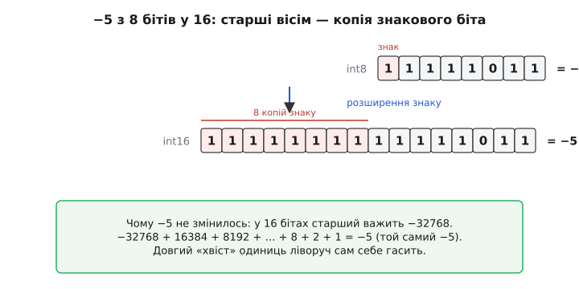
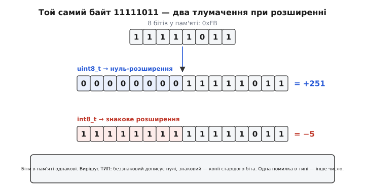
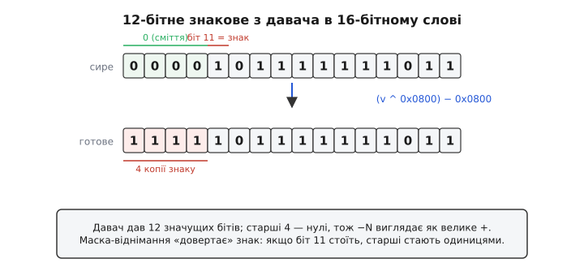

# Знакове розширення

Уявіть просту дію: у вас є число −5, що лежить у восьмибітному байті, і його треба покласти в 32-бітний регістр процесора, щоб порахувати. Здавалося б, дрібниця — скопіюй вісім бітів, а решту двадцять чотири залий нулями. Так роблять для звичайних, беззнакових чисел, і все правильно. Але з від'ємним числом цей «очевидний» хід дає катастрофу: замість −5 у регістрі опиниться +251. Число мовчки змінилося, і подальші обчислення поїхали. Щоб цього не сталося, машина при розширенні від'ємного числа заповнює нові старші розряди не нулями, а **копіями знакового біта**. Оце й називають **знаковим розширенням** (англ. *sign extension* — «розширення зі збереженням знаку»). Розберімо від першопричини, чому інакше не можна, як це робить залізо й де воно боляче кусає в коді на C.

### Чому просте доповнення нулями псує від'ємне число

Корінь усього — у тому, як записані від'ємні числа. Машина зберігає їх у [доповняльному коді](root:math-number-theory/twos-complement-algebra): щоб дістати −N, беруть N, інвертують усі біти й додають 1. Головна тонкість цього коду — **старший біт має від'ємну вагу**. У восьмибітному знаковому числі сім молодших бітів важать звичні 64, 32, 16, 8, 4, 2, 1, а найстарший важить не +128, а **−128**. Саме тому −5 виглядає як 11111011: це −128 + 64 + 32 + 16 + 8 + 2 + 1 = −5.

> 📎 **Що треба знати про доповняльний код.** Від'ємні числа кодують так: інвертуй усі біти числа й додай 1. Найстарший біт має **від'ємну вагу** (−128 у байті, −32768 у 16-бітному), решта — звичайні додатні. Тому старший біт «1» завжди означає від'ємне число. Докладніше — [доповняльний код](root:math-number-theory/twos-complement-algebra).

Тепер видно пастку. Коли ми переносимо цей байт у ширший, 16-бітний тип і просто доливаємо нулі згори, ми дописуємо новий старший біт — уже зі значенням 0. Але вага старшого біта тепер геть інша: у 16-бітному числі він важить −32768. Отож біт, що ніс «мінус», раптом опинився в середині числа зі звичайною додатною вагою 128, а новий старший (нуль) каже «число додатне». Ми не пересунули число — ми **перетлумачили** ту саму комбінацію бітів як зовсім іншу величину:

```
int8  11111011           = −5      (старший біт важить −128)
долили нулі згори:
int16 0000000011111011   = +251    (старший біт тепер нуль → додатне!)
```

Число не «трохи змінилось» — воно стало іншим на цілий оберт. Це не рідкісний казус, а прямий наслідок того, що вага старшого біта залежить від ширини типу. Долити нулі можна лише тоді, коли число **беззнакове**: тоді старший біт і так важив додатне, і дописані нулі нічого не ламають.

### Як лагодить справу знакове розширення

Виправлення просте й красиве: щоб зберегти значення від'ємного числа, нові старші біти треба заповнити **копіями знакового біта** — тобто одиницями, якщо число від'ємне, і нулями, якщо додатне. Тоді −5 у 16 бітах стає 1111111111111011, і величина зберігається точно.


*Восьмибітне −5 (11111011) розширюємо до 16 бітів. Просте доповнення нулями дало б +251; натомість вісім нових старших бітів заповнюють **копіями знакового біта** (тут — одиницями), і виходить 1111111111111011. Це знову рівно −5: у 16 бітах старший важить −32768, і −32768 + 16384 + 8192 + … + 8 + 2 + 1 = −5. Довгий хвіст одиниць ліворуч сам себе гасить.*

Чому саме копіювання знаку зберігає число — це не магія й не домовленість, а точний наслідок ваг. Придивімося до від'ємного числа на колі доповняльного коду. Число −5 — це те саме, що «недобрати 5 до повного оберту». У восьмибітному світі повний оберт — це 256, тож −5 живе на позиції 256 − 5 = 251 = 11111011. У 16-бітному світі повний оберт — уже 65536, і те саме −5 має жити на позиції 65536 − 5 = 65531 = 1111111111111011. Порівняйте два записи: 11111011 і 1111111111111011 — вони відрізняються рівно тим, що спереду доросло ще вісім одиниць. Ось чому копіювання одиничного знаку — це і є перехід від «оберту 256» до «оберту 65536» без зсуву самого числа.

Є й ще коротший спосіб це відчути. У доповняльному коді **будь-яка кількість одиниць поспіль зліва — це те саме від'ємне число**. Один провідний біт-одиниця з вагою −128 у байті, вісім провідних одиниць у 16-бітному — обидва дають одне й те саме «мінус стільки-то», бо надлишкові старші одиниці арифметично гасять одна одну. Формально: додати зверху ще один старший біт-одиницю означає додати −2ᴺ і водночас перетворити колишній старший (що важив −2ᴺ⁻¹) на додатний +2ᴺ⁻¹; сума цих двох змін дорівнює −2ᴺ + 2ᴺ⁻¹ = −2ᴺ⁻¹ — тобто рівно та сама від'ємна вага, що була. Значення не рухається, скільки б одиниць ти не дописав.

> 🔧 **Навіщо це.** Знакове розширення трапляється щоразу, коли вузьке знакове число «переселяється» в ширше — а це відбувається постійно й здебільшого **неявно**. Прочитали з давача 8- чи 12-бітну знакову величину й поклали в `int` для обчислень — сталося знакове розширення. Присвоїли `int8_t` змінній `int32_t` — теж воно. Поки типи знакові й ви їм довіряєте, машина робить усе правильно сама. Небезпека починається там, де ви **самі** дістаєте вузьке знакове число з регістра або зі шини руками: тоді залити нулі — типова й тиха помилка, від'ємне значення обертається великим додатним, і давач «зашкалює» на рівному місці.

### Дві дії з однієї назвою: нуль-розширення й знакове

Отже, при розширенні числа в ширший тип машина обирає між двома діями. **Нуль-розширення** (англ. *zero extension*) доливає згори нулі — це правильно для **беззнакових** чисел. **Знакове розширення** доливає копії старшого біта — це правильно для **знакових**. Ті самі вісім бітів у пам'яті дають два різні числа залежно від того, яку з дій застосувати.


*Той самий байт 0xFB = 11111011, покладений у пам'ять. Якщо тлумачити його як `uint8_t`, при розширенні доливають нулі — виходить +251. Якщо як `int8_t`, доливають копії знакового біта (одиниці) — виходить −5. Біти в пам'яті однакові; вирішує **тип** змінної, а не самі дані. Помилишся типом — дістанеш інше число.*

Найважливіше тут: **самі біти нічого не знають про свій знак**. У байті 11111011 немає позначки «я від'ємний» — є лише вісім нулів і одиниць. Знак — це не властивість даних, а властивість **тлумачення**, яке задає тип змінної в програмі (або команда процесора, що ці дані завантажує). Той самий байт — це і −5, і +251 одночасно; яким числом він стане при переселенні в ширший регістр, вирішує тип. Тому знакове розширення нерозривно пов'язане зі знаковістю типу: компілятор дивиться, знаковий тип чи беззнаковий, і підставляє відповідну дію.

### Як це робить процесор: команди LB і LBU

На рівні заліза розширення — не абстракція, а конкретні команди [набору інструкцій](root:hw-arch/isa). Коли процесор бере з пам'яті байт, щоб покласти його в 32- чи 64-бітний регістр, він **мусить** якось заповнити старші розряди регістра — інакше там лишилося б попереднє сміття. І тут архітектури дають окремі команди під кожну з двох дій.

У RISC-V команда `lb` (load byte) завантажує байт і **розширює його знаково** до повної ширини регістра, а `lbu` (load byte unsigned) той самий байт **розширює нулями**. Тобто буква «u» в мнемоніці означає саме «беззнакове завантаження = нуль-розширення». В ARM Cortex-M логіка та сама, лише названо інакше: `ldrb` (load register byte) робить нуль-розширення, а `ldrsb` (load register signed byte) — знакове; тут знак позначено буквою «s», а її відсутність означає беззнакове. (Обидві пари мнемонік — усталений факт зі специфікацій цих архітектур.)

```
RISC-V:   lb   x5, 0(x10)   // байт → x5, СТАРШІ біти = копія знаку
          lbu  x5, 0(x10)   // байт → x5, старші біти = нулі

ARM:      ldrsb r0, [r1]    // знакове розширення байта
          ldrb  r0, [r1]    // нуль-розширення байта
```

Ось чому знаковість типу в C — не просто підказка компілятору, а **вибір машинної команди**. Коли ви пишете `int8_t x = *ptr;`, компілятор поставить `ldrsb`/`lb`; коли `uint8_t x = *ptr;` — `ldrb`/`lbu`. Одна буква в оголошенні типу перемикає інструкцію, і саме тому байт зі значенням 0xFF стане або −1, або 255. Те саме стосується півслова (16 бітів): є `lh`/`lhu` у RISC-V і `ldrsh`/`ldrh` в ARM. Розширення вбудоване в саму операцію завантаження, тож воно нічого не коштує — процесор робить його «дорогою» з пам'яті в регістр.

### Де воно кусає в C: підступний тип char

Найчастіше знакове розширення псує кров через один прикрий факт мови: **чи знаковий тип `char` — не визначено стандартом**, і залежить від платформи. На багатьох настільних системах (x86) `char` знаковий; на багатьох ARM — беззнаковий. Той самий код читає той самий байт і на одній машині дає −1, а на іншій 255. Класична пастка виглядає так:

**Читаємо байт 0xFF через `char` і намагаємось зрозуміти, чому порівняння з 0xFF ніколи не спрацьовує.**

```c
#include <stdio.h>

int main(void) {
    char c = 0xFF;            // якщо char знаковий — це −1, а не 255

    if (c == 0xFF)           // 0xFF тут — int 255; c розшириться до int −1
        printf("рівні\n");   // на знаковому char НЕ надрукується!
    else
        printf("не рівні: c = %d\n", c);   // виведе: не рівні: c = −1

    return 0;
}
```

Що тут стається крок за кроком. Літерал `0xFF` у порівнянні — це `int` зі значенням 255. Щоб порівняти його зі змінною `c`, компілятор мусить привести `c` до `int` — і застосовує **знакове розширення**, бо `c` знаковий. Байт 11111111 знаково розширюється в 32-бітне 11111111111111111111111111111111 = −1. Порівнюємо −1 із 255 — звісно, не рівні. Програміст очікував «255 == 255», а дістав «−1 == 255». Ліки прості й обов'язкові: для роботи з **сирими байтами** беріть `unsigned char` або `uint8_t`, і ніколи не покладайтеся на знаковість голого `char`.

> 📎 **Що тут спрацювало під капотом.** Дрібні цілі типи (`char`, `int8_t`, `int16_t`) перед майже будь-якою операцією C автоматично перетворює на `int` — це зветься просуванням цілих типів. Для знакового типу перетворення робить **знакове розширення**, для беззнакового — нуль-розширення. Саме тому знаковість вузького типу «стріляє» навіть там, де ви явно нічого не розширювали. Докладніше про правила й пастки — [цілі типи в C/C++](root:sf-lang/integer-types-c).

Той самий механізм пояснює цілий виводок дрібних багів. Функція `getchar()` повертає `int` саме тому, що мусить відрізняти байт 0xFF від ознаки кінця файлу EOF (зазвичай −1); якби ви поспіхом поклали її результат у `char`, справжній байт 0xFF і EOF злилися б в одне. Побітові маски на знакових типах теж підступні: `char mask = ~0;` дає всі одиниці, але при розширенні поводитиметься як −1. Скрізь, де байт трактують як **число-величину**, а не як **знакове число**, беруть беззнаковий тип — і проблема зникає в корені.

### Ручне знакове розширення: коли залізо не допоможе

Є важливий випадок, де компілятор нічим не зарадить, бо ширина числа **не збігається** з жодним типом мови: давачі часто видають 10-, 12- чи 14-бітні знакові величини. Уявіть акселерометр, що дає 12-бітний знаковий відлік. Ви зчитуєте його як `uint16_t` — і дістаєте 12 значущих бітів у молодших розрядах, а чотири старші забиті нулями. Знаковий біт відліку сидить у розряді 11, але з погляду 16-бітного слова він у середині, з додатною вагою. Від'ємне прискорення виглядає як велике додатне: датчик «зашкалює».


*Давач видав 12 значущих бітів; старші чотири в 16-бітному слові — нулі. Тому від'ємний відлік (біт 11 стоїть) читається як велике додатне число. Щоб полагодити, треба заповнити старші чотири біти копією біта 11. Прийом `(v ^ 0x0800) − 0x0800` робить саме це: якщо знаковий біт стоїть, старші розряди стають одиницями, і число дістає правильний знак.*

Полагодити треба руками — і є короткий, надійний прийом. Позначмо `M = 1 << (N−1)` — маску з єдиним бітом на місці знакового (для 12 бітів це `1 << 11 = 0x0800`). Тоді формула `(v ^ M) − M` знаково розширює `v` з N бітів. Працює вона так: якщо знаковий біт **не стоїть** (число додатне), `v ^ M` тимчасово вмикає його, а `− M` вимикає назад — число не змінюється; якщо знаковий біт **стоїть** (число від'ємне), `v ^ M` його гасить, а наступне `− M` «позичає» з вищих розрядів і заповнює їх одиницями — виходить правильне від'ємне.

**Розгортаємо 12-бітний знаковий відлік давача у справжнє знакове число.**

:::tabs
```c
#include <stdint.h>
#include <stdio.h>

// Знакове розширення value з num_bits бітів до повного int32.
int32_t sign_extend(uint32_t value, int num_bits) {
    uint32_t m = (uint32_t)1 << (num_bits - 1);   // біт-знак на місці
    return (int32_t)((value ^ m) - m);            // (v ^ M) − M
}

int main(void) {
    uint16_t raw = 0x0FFF;                 // 12 бітів усі одиниці = −1
    int32_t  a   = sign_extend(raw, 12);
    printf("%d\n", a);                     // −1  (а не 4095!)

    raw = 0x07FF;                          // найбільше додатне 12-бітне
    printf("%d\n", sign_extend(raw, 12));  // 2047

    return 0;
}
```
```python
# Знакове розширення value з num_bits бітів.
def sign_extend(value, num_bits):
    m = 1 << (num_bits - 1)          # біт-знак на місці
    return (value ^ m) - m           # (v ^ M) − M

raw = 0x0FFF                         # 12 бітів усі одиниці = −1
print(sign_extend(raw, 12))         # −1  (а не 4095!)

raw = 0x07FF                         # найбільше додатне 12-бітне
print(sign_extend(raw, 12))         # 2047
```
:::

Значення 0x0FFF — це всі дванадцять бітів-одиниць, тобто −1 у 12-бітному коді; без розширення воно читалося б як 4095. Функція перетворює його на справжнє −1, а найбільше додатне 12-бітне (0x07FF) лишає незмінним, 2047. Той самий прийом обслуговує будь-яку ширину — 10, 14, 24 біти, — треба лише правильно вказати `num_bits`.

Є й альтернативний, «залізний» спосіб — через зсуви: підняти 12-бітне значення так, щоб його знаковий біт ліг у знаковий біт ширшого типу, а тоді **арифметично** зсунути назад:

```c
int16_t x = (int16_t)(raw << 4);   // знак з біта 11 стає в біт 15
x = x >> 4;                        // арифметичний зсув копіює знак униз
```

Він спирається на те, що зсув праворуч для **знакового** типу — арифметичний, тобто заповнює старші розряди копією знаку (для беззнакового зсув логічний, доливає нулі). На всіх реальних процесорах і компіляторах знаковий `>>` арифметичний, і саме тому цей зсув сам по собі є знаковим розширенням у дії. Та варто знати: до C++20 стандарт лишав цю поведінку на розсуд реалізації, тож у переносному коді прийом `(v ^ M) − M` надійніший — він не залежить від виду зсуву й не має країв із невизначеною поведінкою.

> 🔧 **Навіщо це.** Ручне знакове розширення — щоденний хліб роботи з давачами. АЦП, гіроскопи, акселерометри, температурні сенсори раз у раз віддають знакові величини нестандартної ширини: 10, 12, 14, 16, 24 біти, часто ще й склеєні з двох реєстрів по шині I²C чи SPI. Щойно ви зібрали такі біти в змінну руками, компілятор уже не знає, що біт посередині — знаковий, і не розширить його за вас. Тримайте напохваті `(v ^ M) − M` (де `M = 1 << (N−1)`) — це коротка, переносна й безвідмовна формула, що рятує від класичного «давач раптом показує величезне число замість малого від'ємного».

### Одна дія, дві сторони одного коду

Зведімо докупи. Знакове розширення — це не окрема екзотична операція, а зворотний бік того самого [доповняльного коду](root:math-number-theory/twos-complement-algebra), яким машина зберігає від'ємні числа. Оскільки старший біт несе знак через свою від'ємну вагу, при переселенні числа в ширший тип цей знак треба «розтягнути» на всі нові розряди — інакше вага зіб'ється й число мовчки зміниться. Для беззнакових чисел знаку нема, тож там доливають нулі; знаковість типу — це і є вибір між двома діями, аж до конкретної машинної команди (`lb` проти `lbu`, `ldrsb` проти `ldrb`). А там, де ширина числа не лягає в тип мови, розширення роблять руками формулою `(v ^ M) − M`. Спільна нитка всюди одна: **знак — це властивість тлумачення, а не самих бітів**, і при зміні ширини його треба свідомо зберегти.

---

Головне. **Знакове розширення** — заповнення нових старших розрядів **копіями знакового біта** при переселенні знакового числа у ширший тип; для беззнакових натомість роблять **нуль-розширення** (доливають нулі). Причина — [доповняльний код](root:math-number-theory/twos-complement-algebra): старший біт має **від'ємну вагу**, тож просте доповнення нулями перетлумачило б від'ємне число як велике додатне (−5 стало б +251). Копіювання знаку зберігає значення, бо будь-яка кількість провідних одиниць у доповняльному коді — це те саме від'ємне число (надлишкові старші одиниці гасять одна одну). У залізі це окремі команди завантаження: RISC-V `lb` (знакове) проти `lbu` (нульове), ARM `ldrsb` проти `ldrb`; знаковість типу в C буквально обирає команду. Найпідступніша пастка мови — невизначена знаковість `char`: байт 0xFF може стати −1 замість 255, тож для сирих байтів беруть `unsigned char`/`uint8_t`. Коли ширина числа не збігається з типом (12-бітні давачі), знак розширюють руками формулою `(v ^ M) − M`, де `M = 1 << (N−1)`.
