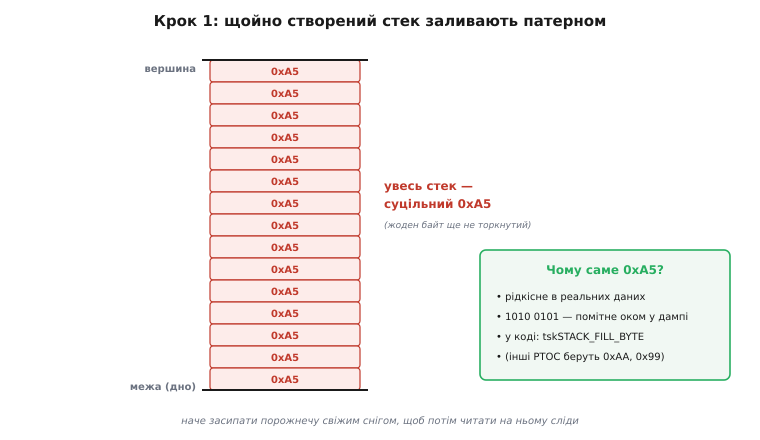
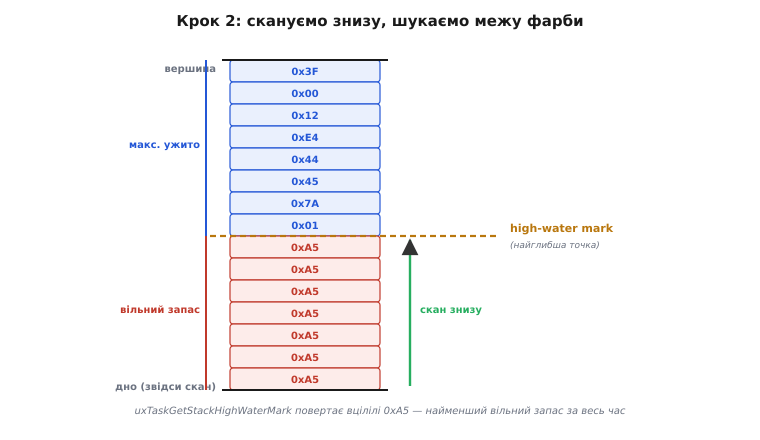
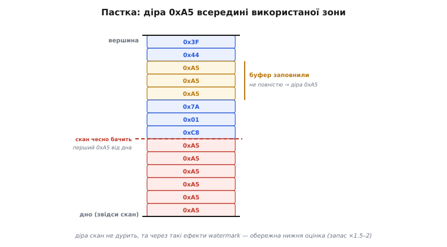

# ⚙️ Скільки стека з'їдено: заповнення патерном і high-water mark

> Алгоритмічна вставка про вимірювання використання [стека — пам'яті, що росте від кожного виклику функції](topic:sf-lang/stack-lifo). Стек **обмежений** і тихо переповнюється (а на МК — без жодного попередження). Звідси практичне питання: скільки стека програма **насправді** з'їла на піку — і скільки лишилось до краю? Стек квитанцій не лишає, тож виміряти це доводиться хитрістю. Розберімо ту саму, що в FreeRTOS.

## Задача: виміряти невидиме

Стек живе самим рухом покажчика SP: виклик опускає SP, повернення піднімає, і використана пам'ять одразу «забувається» — її ніхто не обліковує. Тому глянути на стек **зараз** марно: ви бачите поточну глибину, а небезпечний **пік** трапився раніше — у мить найглибших вкладених викликів (чи рекурсії), якої ви могли й не застати. А знати треба саме пік: якщо він колись дотягнувся майже до краю відведеної під стек [ділянки пам'яті](topic:hw-arch/memory-map), наступного разу дотягнеться **за** край — і це [переповнення стека](topic:sf-lang/stack-overflow). Питання, отже, таке: як виміряти **максимальну глибину за весь час**, коли стек її ніде не записує?

## Ідея: залити «фарбою», прочитати слід

Хитрість елегантна. Перш ніж задача почне працювати, **всю** її стекову пам'ять заливають наперед відомим байтом-«фарбою». FreeRTOS бере **0xA5** (у коді ядра — `tskSTACK_FILL_BYTE`): значення рідкісне в реальних даних і помітне оком у дампі (1010 0101).


*При створенні задачі весь її стек — суцільний 0xA5: жодного байта програма ще не торкнулась. Це наче засипати порожнечу свіжим снігом, щоб потім читати на ньому сліди. Заливку роблять один раз, тож вона майже безкоштовна.*

Далі програма працює — і кожен виклик **пише** на стек свій кадр: адресу повернення, регістри, локальні. Запис **затирає** 0xA5 справжніми даними. Що глибше колись сягнув стек, то нижче стерлась «фарба». Тож, аби дізнатися пік, лишається **просканувати** стек від дна (від межі) вгору й знайти **перший уцілілий 0xA5**: до нього — недоторкана земля, від нього — те, чого вода колись сягала.


*Після роботи частина 0xA5 стерта. Скан від дна знаходить перший уцілілий 0xA5 — це **high-water mark** («позначка високої води»): найглибша точка, якої стек сягав за весь час. Уцілілі 0xA5 нижче неї — найменший вільний запас, що його й повертає `uxTaskGetStackHighWaterMark()`.*

Термін **high-water mark** («позначка високої води», *stack watermark*) — пряма метафора: повінь спадає, а смуга намулу на стіні лишається й показує, **наскільки високо** дохлюпувало. Скан рахує **скільки байтів** від межі досі тримають 0xA5 — і це найменший вільний запас, який стек мав за весь час життя задачі. Близько до нуля — стек ледь не переповнився, час його збільшити; навпаки, гора цілих 0xA5 — стек завеликий, і дефіцитну [RAM](topic:hw-arch/flash-vs-ram) можна повернути.

> 🔧 **Навіщо це.** Це ваш головний прилад проти [переповнення стека](topic:sf-lang/stack-overflow) на МК, де захисту пам'яті немає. Виміряли запас → знаєте, чи безпечний розмір стека задачі й де він на межі — **до** того, як пристрій тихо «здуріє» в полі.

## Псевдокод

```
ПРИ СТВОРЕННІ задачі (один раз):
    для кожного байта стека:
        stack[i] = 0xA5            // залити «фарбою» (tskSTACK_FILL_BYTE)

НА ВИМОГУ — порахувати найменший вільний запас:
    free = 0
    p = межа_стека                 // дно: куди росте стек
    поки stack[p] == 0xA5:         // йдемо від дна, доки тримається фарба
        free = free + 1
        p = наступний_байт_до_вершини
    повернути free                 // ← high-water mark: мінімум вільного за весь час
```

Усе ядро — це один прохід-лічильник уцілілих байтів від межі. Той самий лічильник у справжньому C виглядає майже так само просто, як псевдокод:

```c
// Скан від межі стека вгору: рахує, скільки байтів досі тримають «фарбу».
// limit — найнижча адреса стека (куди він росте); top — його вершина.
size_t bytes_unused(const uint8_t *limit, const uint8_t *top) {
    const uint8_t FILL = 0xA5;          // tskSTACK_FILL_BYTE
    size_t free = 0;
    for (const uint8_t *p = limit; p < top && *p == FILL; ++p)
        ++free;                         // йдемо, доки тримається фарба
    return free;                        // ← найменший вільний запас за весь час
}
```

Саме це й робить `uxTaskGetStackHighWaterMark()` усередині — лише оперує межами стека конкретної задачі, які знає ядро. У реальному коді ви її майже ніколи не пишете самі, а просто питаєте ядро й порівнюєте з порогом:

```c
// Періодична перевірка запасу стека задачі (викликати ЗРІДКА, не в гарячому циклі).
void check_stack_health(TaskHandle_t task) {
    // повертає запас у СЛОВАХ (4 байти на ESP32); HighWaterMark2 — у байтах
    UBaseType_t words_left = uxTaskGetStackHighWaterMark(task);
    size_t bytes_left = (size_t)words_left * sizeof(StackType_t);

    if (bytes_left < 256) {             // поріг із поправкою, не «нуль у нуль»
        ESP_LOGW("stack", "задачі лишилось лише %u Б стека!", (unsigned)bytes_left);
        // тут: підняти розмір стека задачі, або спростити найглибший виклик
    }
}
```

Зверніть увагу на два підводні камені, помітні вже в коді. Перший — **одиниці**: базовий варіант повертає запас у **словах** (на ESP32 слово — 4 байти), а `…HighWaterMark2` — у **байтах**; сплутати їх — означає помилитися вчетверо. Другий — **поріг**: ми порівнюємо не з нулем, а з невеликим запасом (тут 256 байтів), бо watermark, як побачимо нижче, — оцінка обережна, а не точна.

Споріднений механізм — `configCHECK_FOR_STACK_OVERFLOW == 2` — на кожному перемиканні задач лише **перевіряє кілька байтів** біля межі: якщо там уже не 0xA5, отже, стек переповнювався, і ядро викликає ваш обробник `vApplicationStackOverflowHook()`, де пристрій уже може безпечно перезавантажитись, а не мовчки «здуріти».

## Складність і пастки на МК

- **Ціна — лінійна, але не нульова.** Заливка — O(розмір стека) **один раз** при старті задачі. Скан — теж O(розмір), але вже **на вимогу**. Тому high-water mark знімають **зрідка** (у журнал, у налагодженні), а не в гарячому циклі: щотактове сканування кілобайтів з'їдало б ті самі такти, що ви бережете.
- **Watermark — нижня оцінка, не точна межа.** Метод бачить лише **стерті** байти. Якщо на стек поклали [буфер](topic:sf-lang/addresses-pointers), але **не весь** його заповнили, неторкані байти всередині лишаться 0xA5 — і метод їх не врахує. Гірше: якщо пік стався **раз і коротко**, а ви зняли вимір невдало, оцінка може **недооцінити** справжній максимум. Висновок практичний: знятому запасу не вірять «впритул» — лишають **поправку ×1.5–2**.


*Виділений на стеку буфер заповнили не повністю — і всередині вже використаної зони лишилась «діра» 0xA5. Скан від дна чесно знаходить перший 0xA5 від межі (справжній край торкання), тож ця діра його не дурить; та через такі ефекти watermark — це **обережна нижня оцінка**, і запас лишають із поправкою, а не «нуль у нуль».*

- **Працює, лише поки ввімкнено облік.** Заливку роблять не завжди: FreeRTOS фарбує стек, тільки якщо ввімкнено `INCLUDE_uxTaskGetStackHighWaterMark` (чи трасування / перевірку переповнення). Без цього стек **не залитий** — і вимір збреше. Тримайте облік увімкненим на час налагодження.
- **Числа в патерні не випадкові.** «Фарба» мусить бути рідкісною в даних, інакше реальний байт сплутають із недоторканим. 0xA5 саме такий; деякі системи беруть 0xAA чи 0x99 — суть та сама.

## Як цим користуються на практиці

Звідси випливає простий робочий цикл налаштування стека задачі. Спершу дають їй стек **із запасом** — свідомо більший, ніж, на ваш погляд, треба. Тоді **ганяють пристрій під реальним навантаженням**, та ще й найважчим: найглибші гілки коду, найдовші рядки, найбільші пакети, рідкісні обробники помилок — усе, що жене стек глибше. Після цього знімають `uxTaskGetStackHighWaterMark()` і дивляться на найменший зафіксований запас. Якщо він підозріло малий — стек збільшують; якщо лишилася гора недоторканих 0xA5 — стек сміливо вкорочують і повертають дефіцитну [RAM](topic:hw-arch/flash-vs-ram) іншим задачам. Кінцевий розмір беруть як **пік плюс поправка ×1.5–2**, бо реальне навантаження в полі майже завжди знаходить гілку, якої не було на столі. Саме ця поправка відрізняє пристрій, що тихо переживе рідкісний сплеск глибини, від того, що [переповнить стек](topic:sf-lang/stack-overflow) на сотому годиннику роботи в недоступному місці.

## Підсумок

Стек не веде обліку, тож пік його глибини міряють хитрістю: **залити всю пам'ять відомим патерном (0xA5)**, дати програмі попрацювати, а тоді **порахувати від межі вцілілі байти** — це і є high-water mark, найменший вільний запас за весь час. Один прохід-лічильник, дешево й без прив'язки до конкретного заліза — саме так працює `uxTaskGetStackHighWaterMark()`. Та пам'ятайте: це **нижня оцінка**, тож лишайте запас (×1.5–2) і не сприймайте «майже нуль» інакше як сигнал терміново збільшити стек, поки не сталося [переповнення](topic:sf-lang/stack-overflow).
