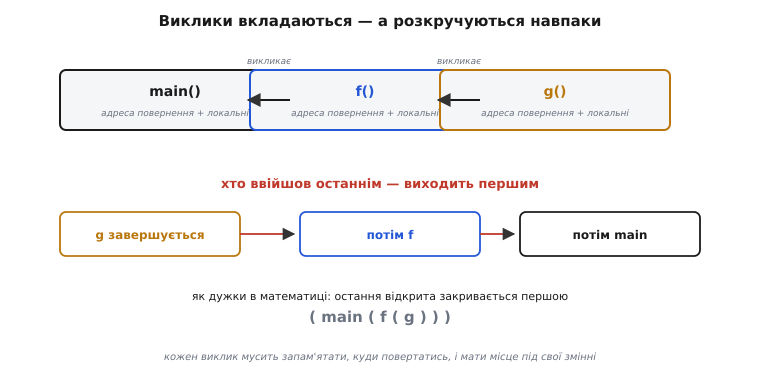
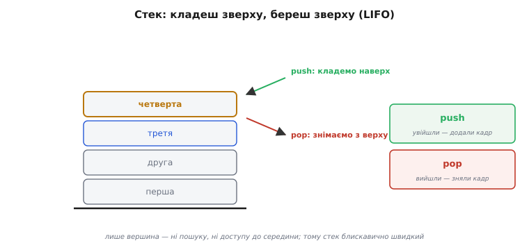
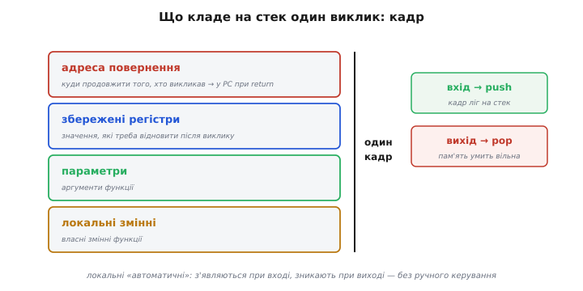
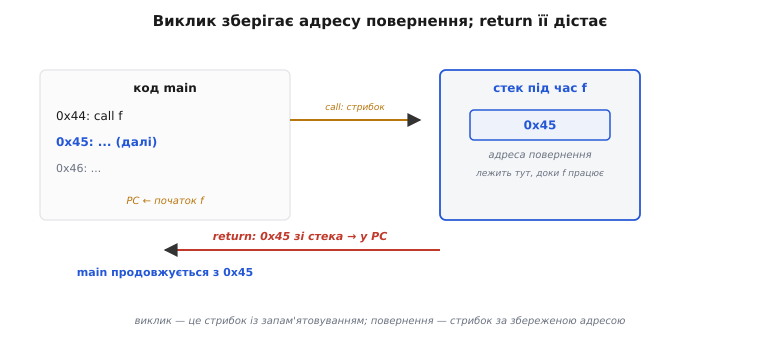
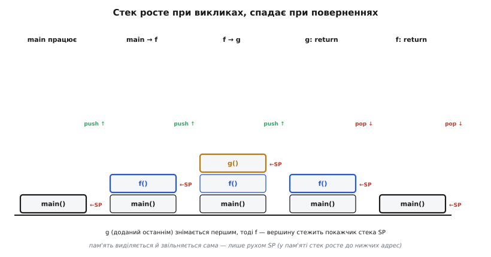
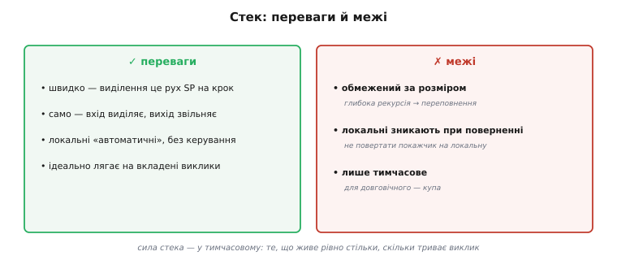

# Стек: як працює виклик функції (LIFO)

Кожна програма постійно **викликає функції**. Коли `main` викликає `f`, а та — `g`, процесор мусить розв'язати дві задачі водночас: запам'ятати, **куди повертатися** (бо після `g` треба продовжити `f`, а після `f` — `main`), і дати кожній функції **місце** під її параметри й локальні змінні — причому на будь-яку глибину вкладеності. Розв'язує це **стек** (англ. *stack* — «стос, купа»; той самий стос, що й купа тарілок) — одна з найпростіших і найважливіших структур у всій інженерії. Зрозумівши стек, ви побачите наскрізь і виклики функцій, і рекурсію, і локальні змінні, і — що особливо цінно — звідки беруться цілі класи багів: переповнення стека, висячі покажчики на локальні. Розберімо механізм від проблеми до тонкощів.

### Проблема: виклики вкладаються


*Вкладені виклики розкручуються навпаки: остання викликана функція завершується перша — `g` раніше за `f`, `f` раніше за `main`. Це не випадковість, а сама природа вкладеності, як дужки в математиці: остання відкрита закривається першою.*

Придивімося до цієї впорядкованості, бо вона і є ключ. Виклик `g` не може завершитися пізніше за `f`: `g` живе **всередині** `f`, тож і закінчиться раніше. Та сама логіка діє на будь-якій глибині — порядок завершень завжди строго зворотний до порядку викликів. І така впорядкованість «останній увійшов — перший вийшов» точно відповідає одній навмисно простій структурі даних.

### Стек — це LIFO


*Стек — структура «останній прийшов, перший пішов» (англ. *LIFO, Last In First Out*), як стос тарілок: кладеш зверху (*push* — «штовхнути, всунути») і береш зверху (*pop* — «виштовхнути, вискочити»). Дві дії, і все: push при вході у функцію додає її кадр, pop при виході знімає.*

Стек тримається на одному обмеженні: обидві операції працюють **лише з вершиною**. Push кладе щось наверх; pop знімає з верху. Жодного доступу до середини, жодного пошуку — тільки вершина. Саме це обмеження робить стек блискавично швидким, і саме воно ідеально лягає на вкладені виклики: щойно функція починається — push її «кадру»; щойно завершується — pop. Порядок виходить сам собою правильний, бо LIFO стека збігається з порядком розкручування викликів. Постає питання, **що** саме кладеться на стек при виклику.

### Стековий кадр


*Кожен виклик додає на стек **кадр** (англ. *stack frame* — «рамка, оправа» виклику): пакет усього потрібного — адресу повернення (піде в PC при `return`), збережені регістри, параметри, локальні змінні. Вхід у функцію кладе кадр на стек (push); вихід знімає його (pop), і вся його пам'ять умить звільняється.*

Ось чому локальні змінні ще звуть **«автоматичними»** (англ. *automatic storage*): вони з'являються самі при вході у функцію (як частина її кадру) і зникають самі при виході (коли кадр знімається) — без жодного ручного керування. Це велика зручність: ви оголошуєте локальну змінну, користуєтеся нею, а коли функція завершується, її пам'ять автоматично повертається в загальний запас. Кадр — це немов робочий стіл, який функції видають на час роботи й забирають, щойно вона закінчила. Точний склад кадру залежить від процесора й «домовленості викликів» (англ. *calling convention*), але суть усюди та сама. Найважливіша частина кадру — адреса повернення, бо саме вона відповідає на питання, як процесор знає, куди вертатися.

### Серце механізму: адреса повернення


*Коли `main` (на адресі 0x44) викликає `f`, процесор кладе на стек адресу наступної команди main (0x45) і стрибає в `f` (PC ← початок f). Коли `f` робить `return`, процесор знімає 0x45 зі стека назад у PC — і `main` продовжується рівно там, де перервався.*

Ось вона, серцевина всього. Тут у парі працюють [лічильник команд PC](topic:hw-arch/processor-parts) і [стрибки в коді](topic:hw-arch/what-is-processor). Виклик функції — це **стрибок із запам'ятовуванням**: перш ніж стрибнути в `f`, процесор зберігає на стеку адресу, куди потім повернутися. А `return` — це стрибок **за збереженою адресою**: дістати її зі стека назад у PC. Тому процесор завжди «знає дорогу назад» — вона лежить на стеку, доки функція працює. І завдяки LIFO-природі стека адреси повернення вкладених викликів складаються в ідеальному порядку: остання покладена знімається першою. Тут же причаїлася найгрізніша біда мікроконтролерів: якщо зіпсувати цю адресу на стеку — наприклад, [переповнивши локальний масив](topic:sf-lang/stack-overflow) поруч, — повернення піде «не туди», і програма стрибне в безодню.

### Наскрізний приклад: виклик функції на стеку

Простежмо все разом на справжньому C. Візьмемо три прості функції — `g` рахує суму, `f` додає до неї константу, `main` усе запускає:

:::tabs
```c
int g(int a, int b) {
    int sum = a + b;        // 'sum' — локальна: живе в кадрі g
    return sum;             // повернення: pop кадру g, адреса → PC
}

int f(int x) {
    int bias = 100;         // 'bias' — локальна: живе в кадрі f
    return g(x, bias);      // виклик g: push кадру g поверх кадру f
}

int main(void) {
    int r = f(7);           // виклик f: push кадру f поверх кадру main
    return r;               // r == 107
}
```
```python
def g(a, b):
    total = a + b           # 'total' — локальна: живе в кадрі g
    return total            # повернення: pop кадру g, адреса → PC

def f(x):
    bias = 100              # 'bias' — локальна: живе в кадрі f
    return g(x, bias)       # виклик g: push кадру g поверх кадру f

def main():
    r = f(7)                # виклик f: push кадру f поверх кадру main
    return r                # r == 107

if __name__ == "__main__":
    main()
```
```go
func g(a, b int) int {
    sum := a + b            // 'sum' — локальна: живе в кадрі g
    return sum              // повернення: pop кадру g, адреса → PC
}

func f(x int) int {
    bias := 100             // 'bias' — локальна: живе в кадрі f
    return g(x, bias)       // виклик g: push кадру g поверх кадру f
}

func main() {
    r := f(7)               // виклик f: push кадру f поверх кадру main
    _ = r                   // r == 107
}
```
:::

Що відбувається в пам'яті, поки це виконується? Кожен виклик кладе на стек новий кадр, кожне повернення його знімає — а **покажчик стека** (англ. *stack pointer*, SP) увесь час показує на вершину:


*Стек росте при викликах (push кадрів `f`, тоді `g`) і спадає при поверненнях — кадри знімаються у зворотному порядку (LIFO): `g` знімається першим, тоді `f`. Вершину стежить [покажчик стека SP](topic:hw-arch/processor-parts): push рухає його, pop вертає; пам'ять виділяється й звільняється сама — просто рухом SP.*

```
main працює        стек: [main]                            SP → вершина main
main викликає f    push кадр f  → [main][f]                 SP опустився
  у f: bias = 100  (живе в кадрі f)
f викликає g       push кадр g  → [main][f][g]              SP ще нижче
  у g: sum = 107   (живе в кадрі g)
g робить return    pop кадр g   → [main][f]    sum=107→f    адреса повернення → PC
f робить return    pop кадр f   → [main]       r=107→main   адреса повернення → PC
main продовжується  r == 107
```

Помітьмо дві речі. По-перше, локальні `bias` і `sum` живуть **рівно** стільки, скільки триває свій виклик: `sum` зникає тієї ж миті, коли `g` повертає значення, бо її кадр знято з вершини. По-друге — і це чудово — пам'ять під кадри виділяється й звільняється **сама собою**, лише рухом SP: жодного ручного «виділи/звільни». Тому локальні змінні такі дешеві й безтурботні. У [пам'яті процесора](topic:hw-arch/memory-map) стек насправді росте до **нижчих** адрес (на вході у функцію SP **зменшується**, звільняючи місце під кадр); «вершину» малюють угорі лише для наочності.

> 🔧 **Навіщо це.** Тримаючи цю картину в голові, ви прочитаєте дизасемблер будь-якої функції: пролог (`push`/віднімання від SP) — це і є виділення кадру, епілог (відновлення SP, `ret`) — його зняття. А коли в [налагоджувачі](topic:sys-ide/why-debugger) дивитесь «стек викликів» (*call stack*) — ви буквально читаєте оці кадри від вершини до `main`.

### Властивості стека


*Переваги: швидко (виділення — рух SP на крок), само (вхід виділяє, вихід звільняє), локальні «автоматичні», ідеально лягає на вкладені виклики. Межі: стек обмежений за розміром (окремий регіон пам'яті) — надто глибока вкладеність [переповнить його](topic:sf-lang/stack-overflow); і локальні зникають при поверненні — тому не можна повертати покажчик на локальну змінну.*

Стек — інструмент для **тимчасового**: для того, що живе рівно стільки, скільки триває виклик. У цьому і його сила (швидко, безтурботно), і його межа. Дві застороги варто закарбувати. Перша: стек **скінченний** — це лише [один регіон пам'яті](topic:hw-arch/memory-map), тож надто глибока вкладеність, а надто **нескінченна рекурсія**, швидко [його переповнює](topic:sf-lang/stack-overflow). Друга, дуже підступна: локальна змінна живе **тільки** поки функція працює; повернути покажчик на неї — означає дати папірець з адресою знесеного будинку ([висячий покажчик](topic:sf-lang/addresses-pointers)), бо кадр уже знято. Для даних, що мусять **пережити** функцію (чи розмір яких заздалегідь невідомий), стек не годиться — для них є інша область пам'яті, [купа](topic:sf-lang/heap-dynamic-memory). Той самий механізм рятує і [переривання](topic:hw-arch/interrupts): на час обробника процесор теж кладе контекст на стек.

> 🔧 **Навіщо це.** Стек працює «за лаштунками» кожного вашого виклику функції, тож розуміння його рятує від цілого класу багів. **Локальні змінні живуть на стеку** й зникають при виході з функції — тому ніколи не повертайте адресу (покажчик) на локальну змінну; коли «дані псуються після повернення з функції», підозрюйте насамперед це. **Стек обмежений** (на мікроконтролері — лічені кілобайти), тож стережіться глибокої рекурсії й великих локальних масивів — вони можуть [переповнити стек](topic:sf-lang/stack-overflow), а на МК це тихий і руйнівний збій. **Виклик зберігає адресу повернення на стеку** — це пояснює і як працює `return`, і чому зіпсований стек веде до «стрибків у нікуди». Нарешті, локальні **дешеві** (виділення — рух SP), тож для тимчасових даних вони ідеальні; бережіть [купу](topic:sf-lang/heap-dynamic-memory) для того, що мусить жити довше.
