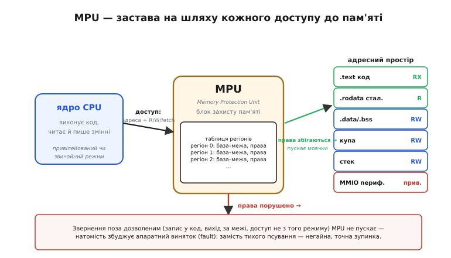
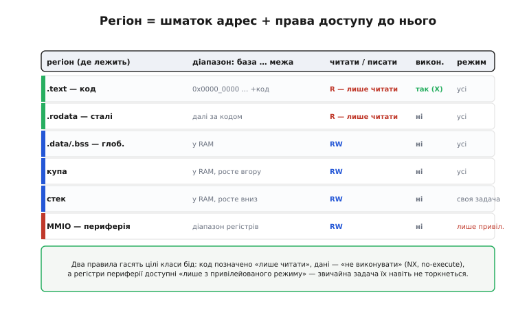
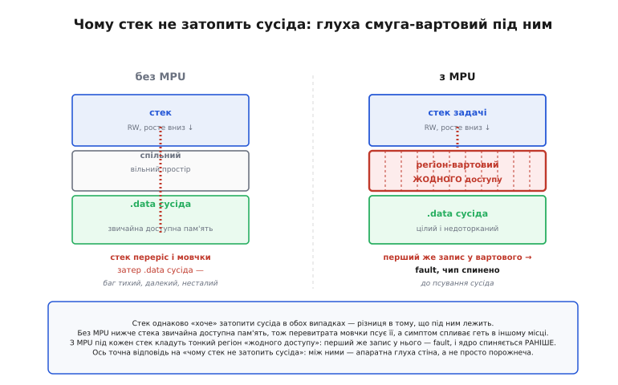

# 🔌 MPU: апаратні стіни між задачами

> На голому мікроконтролері часто кажуть, що **захисту пам'яті немає**, тож баг пам'яті виходить тихий, далекий і несталий — [дикий покажчик](topic:sf-lang/addresses-pointers) чи [переповнення стека](topic:sf-lang/stack-overflow) мовчки псує сусіда, а симптом спливає геть в іншому місці. Слова «немає захисту пам'яті» лишають відчуття, ніби так і має бути завжди. Це не зовсім так: багато мікроконтролерів **мають** маленький апаратний вартовий, що ставить між частинами пам'яті справжні стіни. Звуть його **MPU**, і ця вставка показує, що він робить, як його «вмикають» і чому з ним стек уже не може тихо затопити сусіда.

## Що це за пристрій

На відміну від інших 🔌-вставок розділу, MPU — не окрема мікросхема, яку приставляють до плати, а **вузол усередині самого процесорного ядра**. **MPU** (*Memory Protection Unit*, блок захисту пам'яті) — це апаратний вартовий, що стоїть на шляху **кожного** звернення процесора до пам'яті й звіряє його з наперед заданими правилами: чи дозволено за цією адресою те, що ядро хоче зробити, — читати, писати чи вибрати як інструкцію. Якщо так — доступ проходить непомітно; якщо ні — MPU не пускає його й натомість збуджує апаратний **виняток** (*fault*), миттєву й точну зупинку.

Це прямий наслідок того, що [пам'ять — ряд комірок](topic:hw-arch/memory-as-array): ядро дотягується до будь-якої з них вільно. MPU вставляє між ядром і пам'яттю заставу, повз яку не проходить жоден доступ.

*Ядро більше не дотягується до пам'яті напряму — між ними сидить MPU. На кожен доступ (адреса + намір: читати, писати чи вибрати команду) він дивиться в свою **таблицю регіонів**: збігається з дозволеним — пускає мовчки (зелена стрілка); порушує — не пускає й збуджує виняток (червона). Замість тихого псування пам'яті — негайна, адресна зупинка.*

## Блок-схема: таблиця регіонів

«Розпіновки» в MPU немає — він усередині чипа, без власних ніжок. Натомість його «обв'язка» — це жменя **регістрів керування**, у які програма записує **таблицю регіонів** (саме той запис у регістри за адресами, тобто [memory-mapped I/O](topic:hw-arch/memory-mapped-io)). Кожен **регіон** (*region*) — це шматок адресного простору, заданий парою «**база … межа**», плюс **права доступу** до нього. MPU стереже не кожну комірку окремо, а лише кілька таких грубих діапазонів — зазвичай від кількох до півтора десятка.

*Кожному регіону приписано, що з ним вільно робити. **Код** (.text) — лише читати й виконувати (RX); **сталі** (.rodata) — лише читати; **дані, купа, стек** — читати й писати, але **не виконувати** (NX, no-execute); **регістри периферії** — лише з привілейованого режиму. Два правила — «код не писати» і «дані не виконувати» — гасять цілі класи бід пам'яті.*

Зверніть увагу на дві наскрізні думки, що тут оживають. Перша — **права на виконання**: позначка «не виконувати» (NX) на даних і стеку прямо закриває класичну діру, коли через переповнення буфера в дані підсовують код і змушують процесор його виконати. Друга — **режими доступу**: MPU розрізняє звернення з **привілейованого** коду (ядро системи) і зі **звичайного** (прикладна задача), тож регістри периферії можна сховати так, що рядова задача їх навіть не торкнеться.

## Підключення: як «розвести» регіони

Якщо в інших чипів підключення — це дроти, то «підключити» MPU означає **налаштувати його регіони** і ввімкнути. Порядок дій незмінний для всього класу: для кожної зони пам'яті задають базу й розмір, виставляють права (RW, дозвіл/заборону виконання, потрібний режим), а тоді одним бітом **вмикають** MPU цілком. Від цієї миті будь-який доступ повз дозволене обертається винятком. Найцінніший прийом — і пряма відповідь на питання «**чому стек не затопить сусіда**» — це **регіон-вартовий** (*guard region*): тонку смугу одразу під стеком позначають «**жодного доступу**».

*Стек однаково «хоче» вирости вниз у сусіда — різниця в тому, що під ним лежить. **Без MPU** нижче стека звичайна доступна пам'ять, тож перевитрата мовчки псує її. **З MPU** під стек кладуть тонкий регіон «жодного доступу»: перший же запис у нього — порушення прав, MPU збуджує виняток і спиняє ядро **раніше**, ніж воно зачепить чужі дані. Між стеком і сусідом стоїть апаратна глуха стіна, а не просто порожнеча.*

## Перший байт: як «заговорити» з MPU

«Перший байт» тут — не команда по шині, а найменший корисний дослід: задати **один** регіон-вартовий під стеком, увімкнути MPU й навмисно загнати програму в надто глибоку [рекурсію](topic:sf-lang/stack-lifo). Якщо все під'єднано правильно, замість загадкового «зависання десь потім» ви дістанете **негайний виняток саме в точці** переповнення — обробник помилки спрацює рівно тоді, коли стек переступив межу. Це і є та сама заміна «тихого, далекого, несталого» багу на гучний, ближній і повторюваний: найкоротший спосіб переконатися, що стіна справді стоїть.

> 🔧 **Навіщо це.** MPU перетворює найгірший клас [багів пам'яті](topic:sf-lang/stack-overflow) на найлегший. По-перше, **переповнення стека**: регіон-вартовий під стеком ловить його миттєво й точно — на системах з операційною системою реального часу так стережуть стек кожної задачі окремо, тож збоїть лише винна задача, а не весь пристрій. По-друге, **захист коду й периферії**: позначивши код «лише читати», а периферію «лише привілейованим», ви унеможливлюєте цілі сценарії, коли [дикий покажчик](topic:sf-lang/addresses-pointers) дряпає інструкції чи випадково смикає [залізо периферії](topic:hw-arch/memory-mapped-io). По-третє, **діагностика**: навіть якщо в робочому виробі MPU не лишають увімкненим, під час налагодження він безцінний — перетворює «таємниче падіння» на точну адресу порушення. І головне застереження: MPU не виправляє баг, а лише **ловить** його на межі регіону — він робить помилку видимою, а не зникає її.

## Типові граблі

- **Сплутати MPU з MMU.** MPU лише **стереже права** на кілька діапазонів; він **не** перекладає адрес і не дає віртуальної пам'яті (це робить важчий MMU старших процесорів). Меншу машинерію взяли в мікроконтролери саме тому, що вона дешева.
- **Думати, що MPU є на кожному чипі.** Це вузол ядра, і дешеві ядра його часто не несуть зовсім — наявність MPU треба перевіряти за конкретним чипом, а не припускати.
- **Грубість регіонів.** MPU стереже діапазони, а не окремі байти, і число регіонів обмежене — він спіймає, що ви вийшли за **регіон**, але не дрібний промах усередині дозволеної зони. Це стіни між кімнатами, а не замок на кожній шухляді.
- **Забути про режими.** Захист «лише привілейованим» працює, тільки якщо прикладний код реально біжить у **звичайному** режимі; якщо все крутиться привілейовано, стіни проти периферії стоять, та хвіртка в них відчинена.

## Варіації класу

Під одним іменем «MPU» ховається ціла родина споріднених механізмів, тож у різних чипів він зветься й виглядає по-різному. Канонічний приклад на мікроконтролерах — блок MPU у ядрах **ARM Cortex-M** (його правила описує архітектура **PMSA**); у світі **RISC-V** ту саму роль грає **PMP** (*Physical Memory Protection*) — частина самої архітектури; а на ядрах **Xtensa**, що в класичному **ESP32**, поділ привілеїв і пам'яті влаштований власним чином (контролер **PID** та супутні засоби). Деталі — число регіонів, спосіб задати межі, набір прав — різняться, але задум скрізь один: кілька діапазонів пам'яті, права до кожного, і виняток на порушенні. Звідки взялася сама ідея ставити такі стіни — від «спільної кімнати» перших машин до сьогоднішнього MPU — розказує історична вставка.

> 📜 **Історія цієї вставки:** [«Звідки взялися апаратні стіни в пам'яті»](topic:sf-lang/stack-overflow/comp-history-mpu.md) — як думка «програмі не можна довіряти лишитися в межах» визрівала від мультипрограмування 1950-х і захисних ключів IBM через розвилку «MMU проти MPU» до блоків MPU/PMP/PID у сьогоднішніх чипах. Багато імен, бо стіни в пам'яті будувало багато рук.
