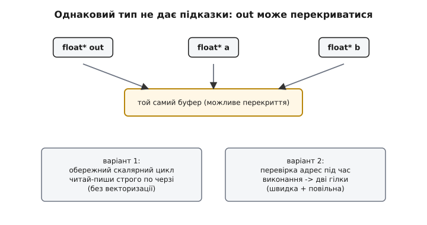
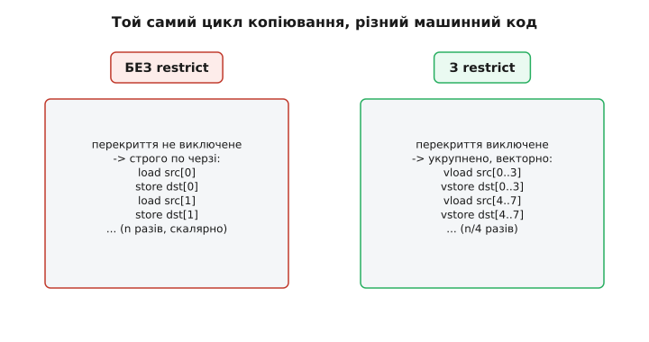
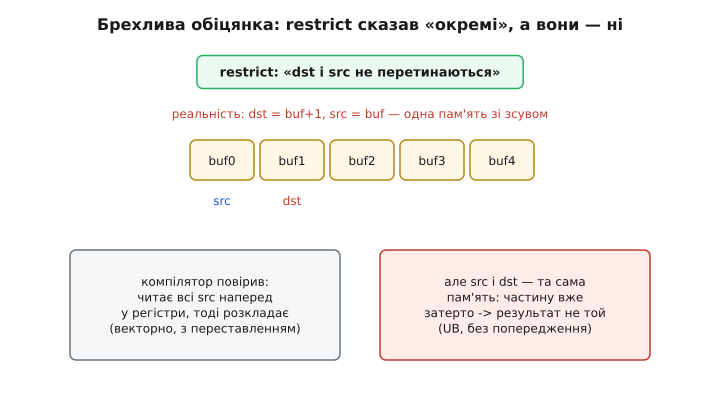

# ⚙️ `restrict`: обіцянка «цей покажчик — єдиний шлях до пам'яті»

Є два різні способи, якими компілятор дізнається, що два покажчики не заважають один одному. Перший — за **типами**: якщо типи різні, компілятор має право вважати, що вони на одну комірку не дивляться. Але цей спосіб мовчить у найчастішому випадку прошивки — коли типи **однакові**. `float* a` і `float* b`, `int16_t* dst` і `int16_t* src`: два покажчики того самого типу цілком законно можуть вести на одну й ту саму пам'ять (перекриватися), і компілятор **зобов'язаний** припускати найгірше. Ось тут і з'являється ключове слово `restrict` — другий спосіб, ручний: ви самі кажете компіляторові «повір мені, до цієї пам'яті ведеш тільки ти», і цим знімаєте з нього обов'язок перестраховуватися.

Це зворотний бік тієї самої монети. Типове правило — те, що компілятор вважає розділеним **за замовчуванням**. `restrict` — те, що ви **обіцяєте** розділеним вручну, коли за типами він цього вивести не може. Обидва механізми служать одному: дати оптимізаторові впевненість, що запис через один покажчик не псує читання через інший. І обидва однаково нещадні, коли ви їх обманете, — брехливий `restrict` веде рівно в ту саму [невизначену поведінку](root:sf-lang/undefined-behavior), що й нелегальний каламбур типів.

Розберімо його від самої задачі, побачимо, що саме він міняє в машинному коді, і де на ньому зривається шию навіть досвідчений розробник.

## Задача: чому однаковий тип зв'язує компіляторові руки

Візьмімо найпростішу операцію, яку прошивка робить мільйони разів на секунду, — додати два вектори поелементно. Обробка звуку, фільтр, накопичення сенсорних вибірок — усюди той самий шаблон:

```c
void vec_add(float* out, const float* a, const float* b, int n) {
    for (int i = 0; i < n; i++) {
        out[i] = a[i] + b[i];
    }
}
```

Виглядає, ніби тут нічого оптимізувати — цикл і цикл. Але подумаймо, що бачить компілятор. Він хотів би обробляти кілька елементів за раз (векторизація SIMD), або хоча б завантажити наперед `a[i+1]`, `b[i+1]`, поки лічить `a[i]+b[i]`, — щоб приховати затримку читання з пам'яті. Для цього йому треба переставляти читання й записи місцями, робити їх «пачками». А переставляти можна лише те, що **незалежне**.

І ось питання, яке компілятор мусить собі поставити: а раптом `out` частково перекривається з `a` чи `b`? Виклик `vec_add(buf+1, buf, buf, n)` — цілком легальний C: усі три покажчики того самого типу `float*`, ніщо не забороняє їм вести в один буфер зі зсувом. А якщо так, то запис `out[0]` **міняє** `a[1]` (це та сама комірка `buf[1]`), і тоді `a[i]` вже не можна читати наперед — треба читати рівно в тому порядку, як написано, після кожного попереднього запису.

> 🔧 **Навіщо це.** Компілятор не знає, звідки й з якими аргументами покличуть вашу функцію. `vec_add` могли викликати з неперетинними буферами (99% випадків) — але могли й з перетинними. Раз він **зобов'язаний** лишатися коректним для будь-якого виклику, він змушений генерувати обережний код під найгірший, найрідший випадок перекриття — і всі, хто передає нормальні окремі буфери, платять за цю обережність швидкістю. `restrict` — спосіб зняти цей податок.

Різницю добре видно, якщо уявити, що компілятор мусить вставити перед циклом. Без жодних обіцянок він або генерує повільний скалярний цикл «читай-пиши строго по черзі», або — розумніший компілятор — вставляє **перевірку перекриття під час виконання**: порівнює адреси `out`, `a`, `b`, і якщо вони не перетинаються, стрибає у швидку векторну гілку, а якщо перетинаються — у повільну безпечну. Це працює, але коштує: зайві порівняння на вході, роздутий код (дві версії циклу), і для коротких `n` перевірка з'їдає весь виграш.


*Однаковий тип не дає жодної підказки: `out`, `a`, `b` — усі `float*`, і компілятор мусить бути готовий до того, що вони ведуть в один буфер зі зсувом. Звідси або обережний послідовний цикл, або перевірка перекриття адрес під час виконання з розгалуженням на швидку й повільну версії — обидва варіанти коштують.*

## Ідея: перекласти гарантію з компілятора на програміста

`restrict` перевертає логіку. Замість того щоб компілятор **доводив** незалежність (а він не може — інформації немає), програміст її **обіцяє**. Ключове слово — це прапорець на покажчику, що означає буквально: «протягом життя цього покажчика до пам'яті, на яку він указує, звертаються **тільки** через нього (чи через похідні від нього)». Компілятор бере цю обіцянку на віру й будує на ній оптимізації — так само сміливо, як він будує їх на різниці типів.

Ключове слово прийшло зі стандарту **C99** (розділ 6.7.3), де його й запровадили саме для цього — щоб повернути C конкурентність із Fortran на числових задачах. У Fortran параметри функції за замовчуванням вважаються неперетинними, і його компілятори через це десятиліттями обганяли C на матричних обчисленнях; `restrict` дав C-програмістові той самий інструмент, але явно й під контролем. *(Доказовий статус: усталено — це записано в тексті ISO/IEC 9899:1999, §6.7.3 «Type qualifiers», семантика no-alias — у §6.7.3.1.)*

Ось та сама функція з обіцянкою:

```c
void vec_add(float* restrict out,
             const float* restrict a,
             const float* restrict b, int n) {
    for (int i = 0; i < n; i++) {
        out[i] = a[i] + b[i];
    }
}
```

Три слова `restrict` — і компілятор тепер знає: `out` не перекривається ні з `a`, ні з `b` (а `a` і `b` між собою можуть — обіцянка стосується лише того, що через **цей** покажчик пам'ять більше ніхто не чіпає; для читання-тільки `a` і `b` це й не важливо). Перевірка перекриття зникає. Векторизація вмикається. Читання наперед — вільне. Ви не змінили жодного рядка тіла циклу, лише додали присягу — і код прискорився.

Тонкість, яку варто зрозуміти одразу: `restrict` **нічого не робить** сам собою під час виконання. Це не перевірка, не захист, не діагностика. Це суто **обіцянка компіляторові**, на підставі якої той будує припущення. Якщо обіцянка правдива — все чудово. Якщо брехлива — компілятор все одно їй повірить і згенерує код, що працює неправильно, і жодного попередження ви, найімовірніше, не побачите. `restrict` не перевіряють — його **дотримуються**.

## Робочий приклад: копіювання й що міняється в коді

Найпоказовіша ілюстрація — memcpy-подібне копіювання, бо саме на ньому видно, звідки береться різниця. Напишімо своє копіювання блока `uint32_t` (типова річ у прошивці — перекласти слова з одного DMA-буфера в інший) у двох версіях і подивімося, що з ними робить оптимізатор.

**Версія без обіцянки — компілятор мусить перестраховуватися:**

```c
#include <stdint.h>

void copy32(uint32_t* dst, const uint32_t* src, int n) {
    for (int i = 0; i < n; i++) {
        dst[i] = src[i];
    }
}
```

Що тут заважає? Знову перекриття. Уявіть `copy32(buf+1, buf, n)` — це фактично зсув масиву вправо на один елемент. Тоді `dst[0]=src[0]` пише в `buf[1]`, а наступна ітерація читає `src[1]` — тобто **те саме `buf[1]`**, уже затерте. Правильний результат вимагає читати `src[i]` **до** того, як його зіпсує запис `dst[i-1]`, — отже, строго по черзі, без завантаження наперед і без укрупнення. Компілятор це знає й генерує саме такий обережний цикл: одне читання, один запис, і так `n` разів, кожне звертання в пам'ять окремо.

**Версія з обіцянкою — руки розв'язані:**

```c
#include <stdint.h>

void copy32(uint32_t* restrict dst,
            const uint32_t* restrict src, int n) {
    for (int i = 0; i < n; i++) {
        dst[i] = src[i];
    }
}
```

Тепер `dst` і `src` за обіцянкою не перетинаються. Компілятор бачить, що всі читання `src` незалежні від усіх записів `dst`, і робить те, що робить із будь-яким незалежним потоком даних: завантажує пачками, укрупнює до ширших регістрів, векторизує. На типовій архітектурі з SIMD цикл згортається в кілька векторних завантажень-записів замість `n` скалярних. Для ARM Cortex-M із розширенням SIMD, для x86 з SSE/AVX різниця в пропускній здатності — кратна.

Що конкретно змінюється в згенерованому асемблері, легко перевірити самому, не вгадуючи: укладіть обидві версії поряд в онлайн-переглядачі асемблера (Compiler Explorer), увімкніть `-O2 -S`, і побачите на власні очі — версія без `restrict` розгортається в довгий скалярний цикл (або в дві гілки з перевіркою адрес), версія з `restrict` — у компактний векторний. Це найкращий спосіб відчути ключове слово: не читати про нього, а подивитися на різницю в машинному коді для свого компілятора й свого процесора.


*Ліворуч — код без обіцянки: кожне слово читається й пишеться окремо, строго по черзі, бо перекриття `dst` і `src` не виключене. Праворуч — з `restrict`: перекриття виключене присягою програміста, тож компілятор укрупнює доступ і векторизує. Тіло циклу в джерелі однакове — різницю робить лише обіцянка.*

### Виміряти, а не повірити на слово

Читати асемблер повчально, але в реальній роботі цінніше **число**. Ось скелет мікробенчмарку, який чесно показує різницю на вашому залізі. Дві однакові функції, різниця лише в `restrict`; ганяємо кожну багато разів на достатньо великому буфері й дивимося такти. Важлива дрібниця — обидві функції винесені в **окремі одиниці трансляції** (окремі `.c`-файли) або хоча б позначені так, щоб компілятор не «побачив» виклик і не заінлайнив його зі знанням фактичних аргументів; інакше він може сам довести неперетинність із місця виклику, і різниця зникне (що саме собою повчально — це показує, що `restrict` потрібен там, де компілятор контексту виклику **не бачить**).

```c
#include <stdint.h>
#include <stddef.h>

// у файлі add_plain.c
void vec_add_plain(float* out, const float* a, const float* b, size_t n) {
    for (size_t i = 0; i < n; i++) out[i] = a[i] + b[i];
}

// у файлі add_restrict.c
void vec_add_restrict(float* restrict out,
                      const float* restrict a,
                      const float* restrict b, size_t n) {
    for (size_t i = 0; i < n; i++) out[i] = a[i] + b[i];
}
```

```c
// bench.c — вимір у тактах (приклад для Cortex-M з DWT->CYCCNT)
#include <stdint.h>
#include <stddef.h>

void vec_add_plain(float*, const float*, const float*, size_t);
void vec_add_restrict(float*, const float*, const float*, size_t);

// на Cortex-M лічильник тактів вмикається так:
//   CoreDebug->DEMCR |= CoreDebug_DEMCR_TRCENA_Msk;
//   DWT->CYCCNT = 0; DWT->CTRL |= DWT_CTRL_CYCCNTENA_Msk;
extern volatile uint32_t* const CYCCNT;   // = &DWT->CYCCNT

#define N 4096
static float out[N], a[N], b[N];

uint32_t bench_plain(void) {
    uint32_t t0 = *CYCCNT;
    vec_add_plain(out, a, b, N);
    return *CYCCNT - t0;
}

uint32_t bench_restrict(void) {
    uint32_t t0 = *CYCCNT;
    vec_add_restrict(out, a, b, N);
    return *CYCCNT - t0;
}
```

На процесорі з SIMD і при `-O2 -ffast-math` (останнє потрібне, щоб компілятор мав право переставляти дії з рухомою комою — інакше векторизація складання блокується вже не аліасуванням, а порядком округлення) версія з `restrict` для великого `N` виходить у рази швидшою. Точна цифра залежить від архітектури, ширини SIMD і того, чи впирається задача в пам'ять; сенс вправи не в конкретному числі, а в тому, щоб побачити відрив на власному залізі й переконатися, що обіцянка не безкоштовна метафора, а реальні викинуті інструкції.

> 🔧 **Навіщо це.** У DSP-циклах прошивки — фільтри, згортки, змішування каналів — `restrict` часто дає найбільший приріст із усіх ручних оптимізацій, і при цьому не міняє логіки ні на йоту. Один прапорець на параметрі перетворює скалярний цикл на векторний. Тому в бібліотеках числової обробки (CMSIS-DSP і подібні) параметри-буфери майже завжди `restrict`-кваліфіковані — це стандартний прийом, а не екзотика.

## Пастка перша: брехлива обіцянка — це UB, тихе й підступне

Тепер найнебезпечніше. `restrict` — обіцянка, і за брехню платить не компілятор, а ваша програма. Якщо ви позначили покажчик `restrict`, а потім передали функції буфери, які **насправді перекриваються**, — ви порушили контракт, і поведінка стає невизначеною. Компілятор повірив вам, згенерував код, що читає наперед і переставляє доступи, — і цей код тепер видає сміття, бо припущення, на якому він побудований, — брехня.

Подивімося на конкретний злам. Візьмімо наше `copy32` з `restrict` і зумисне покличмо його з перекриттям:

```c
uint32_t buf[8] = {1, 2, 3, 4, 5, 6, 7, 8};

// зсув масиву вправо: dst = buf+1, src = buf — вони перекриваються!
copy32(buf + 1, buf, 7);          // ОБІЦЯНКА restrict ПОРУШЕНА → UB
```

Що ми **хотіли**: посунути `{1..7}` на позицію вправо, дістати `{1,1,2,3,4,5,6,7}` — так поводиться коректне копіювання «згори вниз». Що ми **отримаємо** з `restrict`-версією: компілятор, повіривши в неперетинність, міг векторизувати цикл — прочитати всі `src[i]` наперед у регістри й лише потім розкласти в `dst`. Тоді результат буде інший — можливо, `{1,1,2,3,4,5,6,7}`, а можливо, зовсім не той, залежно від того, скільки елементів улізло в один векторний регістр і в якому порядку компілятор їх розклав. Найгидкіше — що під `-O0` цей самий код дасть «правильний» результат (там векторизації нема, цикл послідовний), а під `-O2` — інший. Класична сигнатура UB від аліасування: **працює в debug, ламається в release** — те саме лихо, що й від [нелегального каламбуру типів через приведення покажчика](root:sf-lang/pointer-aliasing), тільки причина інша.

І — вкотре — компілятор **не зобов'язаний** попередити. Він вам повірив; перевіряти вашу присягу не його робота. `restrict` не має жодної діагностики під час компіляції, яка ловила б перекриття: адреси відомі лише під час виконання, а санітайзери його теж здебільшого не бачать. Тому єдиний захист — **дисципліна**: ставити `restrict` лише туди, де ви на 100% контролюєте, що буфери окремі, і ніколи — «про всяк випадок» чи «для швидкості» на покажчик, походження якого не тримаєте в голові.


*Коли `restrict`-покажчики насправді перекриваються, контракт порушено. Компілятор, повіривши обіцянці, прочитав `src` наперед у регістри й розклав у `dst` — але `src` і `dst` та сама пам'ять, тож частину значень уже затерто. Результат — не той, що очікувано; попередження немає; під `-O0` код навіть «працює», що маскує баг до релізу.*

### Особливо підступний різновид: `restrict` на `this` та на членах

Пастка загострюється, коли `restrict` ставлять не на параметр, а глибше — на покажчик усередині структури чи на `this` методу (це вже розширення, про них нижче). Тоді обіцянка означає, що **весь час життя об'єкта** до відповідної пам'яті ведуть тільки через нього. Порушити таку широку обіцянку набагато легше — досить одного місця в коді, де до тієї ж пам'яті дотягнулися іншим шляхом, і весь об'єкт стає джерелом UB. Тому широкі `restrict` (на полях, на `this`) ставлять рідко й тільки з дуже ясним розумінням усіх шляхів доступу.

## Пастка друга: у стандартному C++ ключового слова `restrict` немає

Тепер друга велика несподіванка, на якій спотикаються ті, хто переносить C-код у C++. `restrict` — слово стандарту **C**, і в стандарт **C++** його так і **не** внесли. Спроба скомпілювати `float* restrict p;` компілятором C++ у строгому режимі — це помилка: такого ключового слова в мові немає.

Чому C++ його відкинув, попри те, що взяв майже все інше з C? Причина в тім, що `restrict` погано лягає на систему типів C++ — посилання, шаблони, перевантаження, `this`, спадкування додають стільки шляхів дотягнутися до тієї самої пам'яті, що дати ключовому слову несуперечливе значення в усіх куточках мови виявилося складно. Комітет кілька разів підступався й щоразу відкладав. *(Доказовий статус: усталено — `restrict` відсутній у всіх редакціях стандарту C++; це підтверджують і довідники мови, і те, що жоден режим `-std=c++NN` його не приймає як ключове слово.)*

Але потреба нікуди не поділася — числовий C++-код так само страждає від перестраховки на однакових типах. Тому кожен великий компілятор дає **своє розширення**, і вони, на щастя, майже збігаються синтаксисом:

```cpp
// GCC та Clang: __restrict__ (канонічне) або __restrict
void vec_add(float* __restrict__ out,
             const float* __restrict__ a,
             const float* __restrict__ b, int n);

// MSVC: __restrict
void vec_add(float* __restrict out,
             const float* __restrict a,
             const float* __restrict b, int n);
```

`__restrict` (з двома підкресленнями спереду) розуміють **усі три** — GCC, Clang і MSVC, — тож у переносному C++-коді беруть саме його. GCC і Clang додають ще й `__restrict__`, і — на відміну від C — дозволяють ставити його на **посилання** та на `this` методу (`void foo() __restrict__;`), чого в C бути не може, бо там немає ні посилань, ні методів. *(Доказовий статус: усталено — задокументовано в довідках GCC «Restricted Pointers» і Microsoft Learn «`__restrict`».)*

### Тонкість MSVC, що ловить необережних: `__restrict` там не поширюється

Одна відмінність MSVC варта окремого рядка, бо мовчки псує очікування. У C99 властивість `restrict` **поширюється**: якщо ви присвоїли `restrict`-покажчик іншому покажчику, той теж успадковує обіцянку неперетинності. MSVC-шний `__restrict` цього **не** робить — присвоїли `__restrict`-змінну звичайній, і компілятор уже дозволяє тій звичайній аліаситися. Крім того, MSVC розрізняє два різні інструменти: `__restrict` — на **змінну** (як C-шне слово), а `__declspec(restrict)` — на **функцію**, і означає воно зовсім інше: «покажчик, який ця функція **повертає**, ні на що не аліасений» (типово для власних `malloc`-подібних алокаторів). Плутати їх легко, а наслідки різні. *(Доказовий статус: усталено — Microsoft Learn прямо перелічує ці відмінності `__restrict` від `__declspec(restrict)` і від C99 `restrict`.)*

Практичний висновок для переносного коду простий: заведіть один макрос і сховайте всі три діалекти за ним.

```c
// portable_restrict.h — один макрос RESTRICT на всі компілятори й обидві мови
#if defined(__cplusplus)
    #if defined(_MSC_VER)
        #define RESTRICT __restrict
    #elif defined(__GNUC__) || defined(__clang__)
        #define RESTRICT __restrict__
    #else
        #define RESTRICT            /* невідомий компілятор — просто прибрати */
    #endif
#else                                /* чистий C */
    #if __STDC_VERSION__ >= 199901L  /* C99 і новіші — є справжнє restrict */
        #define RESTRICT restrict
    #elif defined(_MSC_VER)
        #define RESTRICT __restrict
    #else
        #define RESTRICT
    #endif
#endif
```

```c
// тепер функція пишеться один раз і компілюється всюди:
void vec_add(float* RESTRICT out,
             const float* RESTRICT a,
             const float* RESTRICT b, int n) {
    for (int i = 0; i < n; i++) out[i] = a[i] + b[i];
}
```

Головна цінність такого макроса — не лише переносність, а й **безпечний відступ**: на невідомому компіляторі `RESTRICT` розкривається в порожнечу, і код лишається коректним (просто повільнішим). Це правильна поведінка саме тому, що `restrict` — оптимізаційна підказка: її **відсутність** ніколи не робить правильну програму неправильною. Зворотне — не так: зайвий, помилковий `restrict` неправильну програму зробить, а правильну може зламати. Тому за замовчуванням у сумніві його **не** ставлять.

## Пастка третя: `restrict` не рятує від каламбуру типів (і навпаки)

Останнє непорозуміння, яке варто вбити на місці: `restrict` і типове правило вирішують **різні** задачі, і одне не заміняє інше.

Типове правило — про покажчики **різних** типів; воно каже, коли компілятор має право вважати їх неперетинними **сам**, без вашої участі. `restrict` — про покажчики (найчастіше **однакового** типу), де компілятор сам вивести нічого не може, тож ви обіцяєте неперетинність вручну. Не можна `restrict`-ом «дозволити» собі нелегальний каламбур типів: якщо ви дивитеся на `float` через `int*`, `restrict` тут ні до чого — це порушення типового правила, і лікується воно `memcpy` чи `std::bit_cast`, а не присягами про неперетинність. І навпаки — законний `memcpy` між типами не потребує `restrict`, він і так коректний.

Просте розмежування, яке варто тримати в голові:

```
різні типи   →  типове правило працює само   →  ваша дія: не обманювати типами
однакові типи → компілятор сам не знає нічого → ваша дія: restrict, якщо буфери окремі
дивитися на ту саму пам'ять іншим типом → тільки memcpy / bit_cast (не restrict!)
```

Ці три рядки покривають майже всі практичні ситуації. Плутанина між ними — джерело як зайвих `restrict` там, де питання насправді в типах, так і марних спроб «полагодити» каламбур типів обіцянкою про неперетинність.

## Складність і межі: коли `restrict` не спрацює й коли нашкодить

Кілька тверезих обмежень, щоб не чекати від ключового слова чудес.

**Це підказка, і компілятор може її проігнорувати.** `restrict` не **зобов'язує** оптимізувати — він лише **дозволяє**. Якщо цикл і без того не векторизується з інших причин (складна залежність між ітераціями, порядок округлення рухомої коми без `-ffast-math`, надто малий `n`, архітектура без SIMD), `restrict` не додасть швидкості. Спершу переконайтеся, що вузьке місце справді в перестраховці на аліасуванні, — інакше ви ставите присягу, яка нічого не дає, зате додає ризик UB.

**Виграш є там, де компілятор не бачить контексту виклику.** Якщо функцію заінлайнено й компілятор бачить фактичні аргументи, він часто сам доведе неперетинність — і `restrict` виявиться зайвим. Реальну користь слово дає на **межах, які оптимізатор не перетинає**: експортовані функції бібліотеки, виклики через окремі одиниці трансляції, точки, де аргументи приходять ззовні. Саме тому в публічних API числових бібліотек `restrict` доречний, а на дрібній локальній статичній функції — часто ні.

**Ризик росте з часом життя обіцянки.** `restrict` на параметрі функції — обіцянка на час одного виклику, її легко контролювати. `restrict` на полі структури чи на `this` — обіцянка на весь час життя об'єкта, і будь-який другий шлях до тієї ж пам'яті десь в іншому файлі мовчки робить її брехнею. Що ширша обіцянка, то важче гарантувати її правдивість і то підступніший буде баг.

**Найкраща стратегія — консервативна.** Не ставте `restrict` за замовчуванням. Ставте його свідомо там, де: (1) профіль показав, що цикл упирається саме в перестраховку на аліасуванні; (2) ви на 100% контролюєте, що буфери окремі; (3) функція на межі, яку оптимізатор не бачить наскрізь. У цих трьох умовах `restrict` — потужний, майже безкоштовний виграш. Поза ними — зайвий ризик заради непевної вигоди.

Підсумок в одному реченні: `restrict` — це ваша присяга компіляторові, що до цієї пам'яті ведеш тільки ти; поки присяга правдива, вона перетворює обережні скалярні цикли на швидкі векторні, а щойно збрешете — веде в те саме тихе UB, що й нелегальний каламбур типів, тільки на однакових типах і без жодного попередження.
