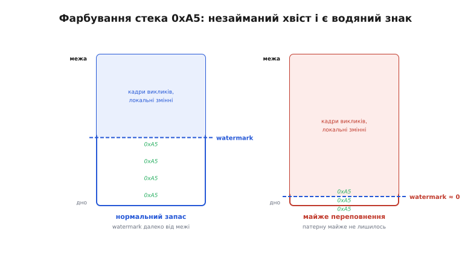
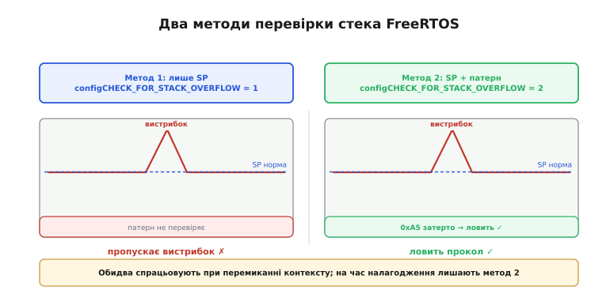

# ⚙️ Ловимо переповнення стека: канарки, водяний знак, заповнення патерном

Як інструменти діагностики ловлять переповнення [стека задачі в RTOS](root:sf-lang/task-stacks) зсередини: фарбування патерном, механізм двох методів FreeRTOS, ручна канарка для областей поза RTOS — і як побудувати їх власноруч, коли готового хука нема.

## Задача

Переповнення [стека задачі](root:sf-lang/task-stacks) (англ. *stack overflow* — «переливання стека через край») тихе й несинхронне: симптом з'являється в чужій задачі або в сусідніх даних, далеко від справжнього винуватця. Перший крок до розслідування — зрозуміти, що сталося взагалі, тобто ВИЯВИТИ факт переповнення.

Проблема в тому, що на ESP32 з архітектурою Xtensa (і на ARM Cortex-M без MPU) процесор **не генерує жодного апаратного винятку**, коли задача перетинає межу свого стека: це просто запис у сусідню адресу пам'яті, яка може належати іншій задачі, купі або глобальним змінним. То як це взагалі ВИЯВИТИ постфактум?

Дві базові ідеї покривають увесь простір: (а) лишити «вартового» на межі й перевіряти, чи він цілий — **канарка** (англ. *canary* — «канарка»); (б) заздалегідь зафарбувати стек відомим візерунком і дивитися, як глибоко його затерли — **водяний знак** (англ. *high-water mark* — «позначка найвищого рівня води»). На них побудовані всі вбудовані перевірки FreeRTOS.

## Ідея 1 — фарбуємо стек патерном (звідки watermark знає глибину)

FreeRTOS дає інструмент `uxTaskGetStackHighWaterMark`, що вимірює глибину використання стека. Розберемо, **як саме** він це робить і чому він узагалі здатний знати.

Перед запуском задачі FreeRTOS заливає весь її стек відомим байтом-візерунком — `tskSTACK_FILL_BYTE`, що дорівнює `0xA5`. Поки задача працює, вона затирає цей візерунок «згори вниз» (на Xtensa й ARM стек росте у бік зменшення адрес): кожен виклик функції, кожна локальна змінна стирають частину наперед залитих байтів. Скільки поспіль байтів `0xA5` лишилося від «дна» (найвищої адреси стека, де лежить перший push) — стільки стека **ніколи не чіпали**; це і є водяний знак.



*Уцілілий хвіст візерунка 0xA5 від дна — це стек, якого ніколи не торкалися; його й рахує `uxTaskGetStackHighWaterMark`. Праворуч — стан «на межі»: патерн майже затерто, запасу майже нема.*

`uxTaskGetStackHighWaterMark` просто **сканує** цей незайманий хвіст патерну від дна догори і повертає кількість слів, де `0xA5` ще на місці. Саме тому водяний знак фіксує **найглибший прихід** за весь час існування задачі, а не лише поточний стан: усе, чого хоч раз торкнулись, стерло наперед залитий візерунок — і він уже ніколи не відновиться.

Важливий нюанс-пастка: якщо незаймана зона = 0 байтів, watermark повертає 0 — це означає «дійшли до краю», але **наскільки саме вийшли за нього** — невідомо. Тобто watermark фіксує наближення до межі, а не сам факт виходу за неї.

Механізм нескладний — ось його суть у восьми рядках C, які можна застосувати до **будь-якої** довільної ділянки пам'яті:

**Ручне сканування патерну:**

```c
// заповнюємо область відомим візерунком на старті
static const uint8_t CANARY = 0xA5;
void paint(uint8_t *base, size_t n) {
    for (size_t i = 0; i < n; i++) base[i] = CANARY;
}

// глибина використання = скільки патерну затерто з «дна» вгору
size_t used_from_pattern(const uint8_t *base, size_t n) {
    size_t free_bytes = 0;
    while (free_bytes < n && base[free_bytes] == CANARY) free_bytes++;
    return n - free_bytes;   // байтів, яких торкалися
}
```

Саме це FreeRTOS робить для кожної задачі автоматично; нам лишається лише зчитати результат через `uxTaskGetStackHighWaterMark`.

## Ідея 2 — вбудована перевірка FreeRTOS: метод 1 і метод 2

Перевірку вмикає макрос `configCHECK_FOR_STACK_OVERFLOW` — розберемо, **чим відрізняються два значення** цього макросу й чому на час налагодження залишають саме другий.

FreeRTOS перевіряє стек не безперервно (це обходилося б дорого на кожному такті), а **в момент перемикання контексту**: щойно [планувальник](root:sf-os/scheduler) знімає [задачу](root:sf-os/tasks) з ядра, він перевіряє її стек і, якщо межу пробито, викликає хук `vApplicationStackOverflowHook(TaskHandle_t, char*)`.



*Обидва методи спрацьовують при перемиканні контексту: метод 1 звіряє лише покажчик стека (пропускає миттєвий «вистрибок» між перемиканнями), метод 2 додатково перевіряє смугу патерну біля межі й ловить навіть короткочасний прокол. На час налагодження лишають метод 2.*

**Метод 1** (`configCHECK_FOR_STACK_OVERFLOW = 1`) — дешевший: при перемиканні просто порівнює покажчик стека SP із нижньою межею стека задачі. Ловить грубі повільні переповнення, але **пропускає** короткий «вистрибок» углиб і назад між двома перемиканнями: задача могла на мить вийти за межу й повернутися — SP знову в нормі, і перевірка нічого не побачить.

**Метод 2** (`configCHECK_FOR_STACK_OVERFLOW = 2`) — на додачу перевіряє, що останні N байтів біля межі **досі містять патерн** `0xA5`; якщо їх хоч раз затерли — слід лишиться назавжди, і метод 2 впіймає навіть короткочасний прокол, якого метод 1 не побачив. Він дорожчий на кілька тактів за перемикання, зате надійніший — саме тому його залишають увімкненим на час налагодження.

На ESP32 з ESP-IDF це налаштовується в `menuconfig` через `CONFIG_FREERTOS_CHECK_STACKOVERFLOW`; Arduino-ESP32 типово вже має перевірку увімкненою.

Хук отримує дескриптор задачі й рядок із її іменем. Важлива деталь: на момент виклику хука **стек уже пошкоджено** — тому всередині заборонені будь-які дії, що самі потребують стека (printf через купу, Serial, запис у Flash). Правильна реакція — лишити слід через ROM-функцію й впасти керовано, щоб дістати посмертний знімок (core dump), а не блукати по чужій пам'яті:

**Хук переповнення стека:**

```c
// викликається ядром FreeRTOS, коли виявлено переповнення стека задачі
void vApplicationStackOverflowHook(TaskHandle_t task, char *name) {
    // НЕ робимо нічого важкого: стек уже зіпсовано, друк у файл/Flash небезпечний
    esp_rom_printf("STACK OVERFLOW in task: %s\n", name);  // ROM-друк, без heap
    abort();   // кероване падіння → core dump, а не тихий збій
}
```

`esp_rom_printf` живе в ROM і не потребує додаткового стека; `abort()` дає кероване падіння замість тихого руйнування пам'яті інших задач — за принципом «розслідуй, а не замовчуй».

## Ідея 3 — РУЧНА канарка, коли готового хука нема

Не все, що живе на ESP32, є FreeRTOS-задачею: буває окрема область (буфер ISR-обробника, статичний робочий регіон, стек переривання), де `vApplicationStackOverflowHook` просто не викликатиметься. У таких випадках канарку — слово-вартового (англ. *guard word*) — ставлять **власноруч**: відоме значення на самій межі ділянки, яке перевіряють у діагностичному циклі.

Назва «канарка» — від шахтарської практики: птаха несли в шахту першою; вона реагувала на отруйний газ раніше за людину й слугувала раннім попередженням. Вартовий на межі стека виконує ту саму роль. Значення обирають «неприродне» — наприклад, `0xDEADBEEF` або `0xA5A5A5A5` — яке навряд чи з'явиться в буфері випадково під час нормальної роботи.

**Ручна канарка для довільного буфера:**

```c
#define GUARD 0xDEADBEEFu
static uint8_t  work[2048];
static volatile uint32_t guard = GUARD;   // вартовий ОДРАЗУ за межею ділянки

static inline bool guard_ok(void) { return guard == GUARD; }

// у діагностичному циклі (наприклад, watchdog-задача):
if (!guard_ok()) {
    esp_rom_printf("guard corrupted: overflow near 'work'\n");
    abort();
}
```

Розташовуйте `guard` відразу за масивом `work` у пам'яті (або перед ним, залежно від того, в який бік росте загроза). Є важливе обмеження: канарка ловить **лише перехід через її конкретну адресу** — якщо переповнення «перестрибнуло» вартового й сягнуло ще далі, канарка промовчить. Саме тому метод 2 FreeRTOS, що перевіряє цілу смугу патерну, надійніший за одного вартового.

## Складність і пастки на МК

- **Перевірка не безперервна.** І хук FreeRTOS, і ручна канарка спрацьовують лише в момент перевірки (перемикання контексту або діагностичний цикл). Між перевірками переповнення може статися й «загоїтися» (вистрибок углиб і назад) непоміченим — метод 2 (фарбування цілої зони) ловить такі сліди; метод 1 і одинарна канарка — ні.

- **Хук — на пошкодженій пам'яті.** Усередині `vApplicationStackOverflowHook` стек задачі вже пошкоджено. Жодного `printf` через купу, `Serial`, операцій з Flash, `malloc`. Лише ROM-друк імені й кероване `abort()` — щоб дістати core dump і розслідувати, а не блукати по чужій задачі.

- **Це інструмент НАЛАГОДЖЕННЯ, не захист.** Виявлення переповнення не запобігає йому — лише фіксує факт постфактум і витрачає трохи часу на кожному перемиканні. Тримайте увімкненим у розробці; у релізі залишають дешевший метод 1 або вимикають заради швидкості — справжню надійність дають правильно ВИМІРЯНІ стеки із запасом.

- **Watermark = 0 — це «вже майже пізно».** `uxTaskGetStackHighWaterMark == 0` означає, що задача дійшла до краю; наскільки вийшла за нього — невідомо. Тривожний поріг ставте із запасом (чверть-третина від розміру стека), а не на самому дні.

- **Без MPU — жодного апаратного сигналу.** На ESP32 (Xtensa) типово немає апаратної межі стека, тож вихід за межу — це тихий запис у сусідню адресу без жодного винятку. Саме тому й потрібні програмні канарки й патерн.

- **Не плутайте з купою.** Канарка й watermark тут — про **стек** задачі. Пошкодження [купи](root:sf-lang/heap-dynamic-memory) (heap corruption) ловлять іншими засобами (heap poisoning, talloc), і це окрема тема.

## Підсумок

Дві ідеї покривають увесь простір: **зафарбувати** стек і дивитися, як глибоко його затерто (watermark, метод 2 FreeRTOS), або поставити **вартового** на межі й перевіряти його цілісність (канарка, метод 1 або власноруч). FreeRTOS на ESP32 дає обидва механізми з коробки — лишається ввімкнути виявлення переповнення і написати хук, що лишає слід, а не тихо перезавантажується. Немає готового хука (буфер ISR, стек переривання) — ставимо канарку власноруч. Усе це — діагностика постфактум; справжню надійність дають виміряні стеки із запасом і правильний бюджет RAM.
