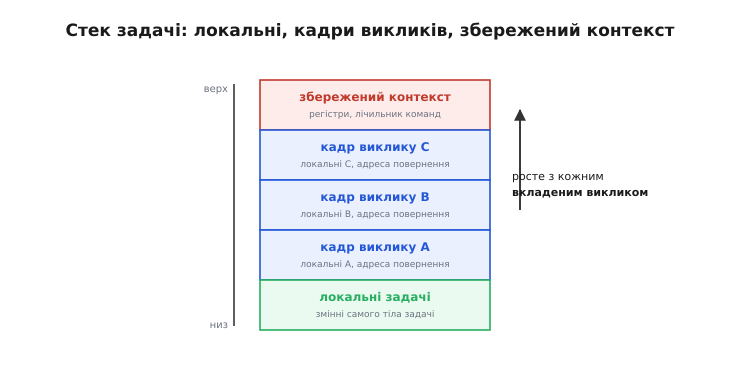
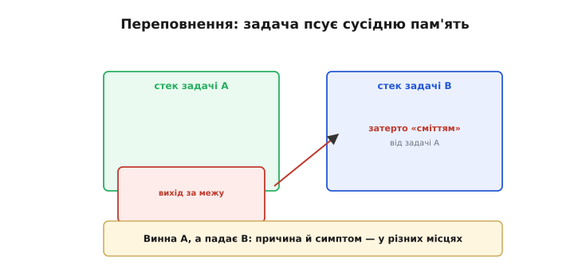
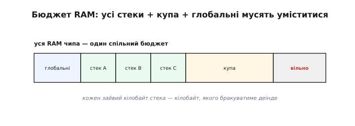
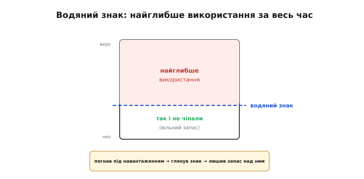
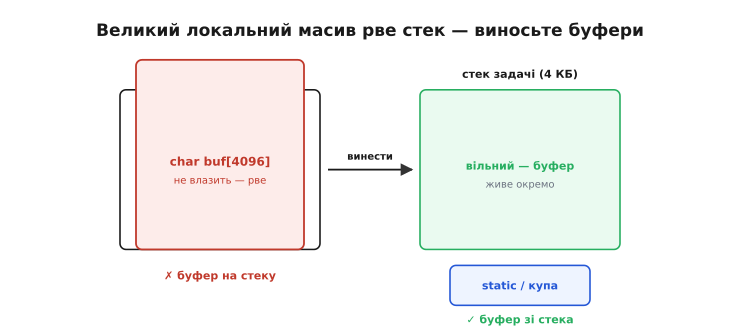
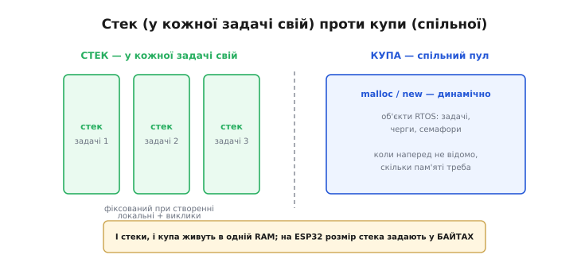

# Стеки задач

У кожної [задачі](topic:sf-os/tasks) — власний **стек** (англ. *stack* — «стос»; задачний стек, *task stack*). І тут постає найпрактичніше питання багатозадачності: **якого розміру** його робити? Питання лише на вигляд дрібне, а насправді — одне з найважливіших і найпідступніших. Замалий стек — і задача його **переповнить**, спричинивши загадковий збій; завеликий — і марнується дорога пам'ять чипа. Підібрати розмір стека правильно — справжнє ремесло, і ця тема навчить його основ.

### Що лежить у стеку задачі

Спершу розберімо, що взагалі тримає [стек](topic:sf-lang/stack-lifo). По-перше, **локальні змінні** функцій. По-друге, **ланцюг викликів**: щоразу, коли одна функція кличе іншу, на стек лягає новий «кадр» з її локальними змінними й адресою повернення. По-третє (це додає RTOS) — **збережений контекст** задачі: коли її перемикають, стан регістрів і лічильник команд теж осідають у її стеку.


*Стек задачі тримає: локальні змінні тіла задачі, кадр на кожен вкладений виклик функції (з її локальними й адресою повернення) і збережений контекст (регістри, лічильник команд) на час перемикання. Що глибша вкладеність викликів, то вище росте стек.*

Звідси видно головне: скільки стека витратить задача, залежить від того, **як глибоко** вона вкладає виклики й **скільки локальних даних** тримає на кожному рівні. Проста задача з кількома змінними обійдеться крихтою; задача, що заходить у десяток вкладених функцій та ще й тримає буфери, з'їсть значно більше. А оскільки розмір стека задається **наперед**, при [створенні задачі](topic:sf-os/tasks), цей апетит треба якось угадати — і не помилитися ні в той, ні в інший бік.

Важливо, що стек **дихає**: він росте, коли задача заходить глибше у виклики, і спадає, коли з них повертається. Тож витрата стека не стала — вона коливається, як приплив і відплив, і важливий саме **найвищий приплив**: той найглибший момент, коли задача витратила стека найбільше. Саме його стек і мусить покрити з запасом — бо досить одного-єдиного разу перейти межу, щоб усе зламалося.

### Замало стека — переповнення

Небезпечніша з двох помилок — замалий стек. Якщо задача спробує використати більше стека, ніж їй відвели, станеться **переповнення стека** (англ. *stack overflow* — «переливання стека через край»): задача «вилізе» за межу свого блоку й почне писати в **сусідню** пам'ять — у стек іншої задачі чи в чужі дані.


*Переповнення: задача A використала більше, ніж їй відвели, перейшла свою межу й уписала «сміття» в сусідню пам'ять — наприклад, у стек задачі B. Найгірше, що збій тоді спливе в задачі B, хоч винна A: причина й симптом — у різних місцях.*

Це одна з найпідступніших помилок у всій багатозадачності — саме тому, що **симптом далеко від причини**. Переповнивши свій стек, задача A псує дані задачі B, і програма падає (чи поводиться дивно) в задачі B — там, де помилку шукатимуть годинами, хоч її там немає. На щастя, RTOS уміють **ловити** переповнення: FreeRTOS має вбудовану перевірку стека, що б'є на сполох, коли задача підійшла до межі. Її варто вмикати під час налагодження — вона перетворює загадковий невловимий збій на чітке повідомлення «задача така-то переповнила стек». Як саме влаштована ця перевірка й чому методів два — у [вставці про ловлю переповнень](topic:sf-lang/task-stacks/proj-stack-overflow.md).

Підступність переповнення ще й у тому, що воно часто **не детерміноване**: задача рве стек лише на певному, рідкісному шляху виконання — скажімо, коли заходить у глибшу гілку або спрацьовує якийсь обробник, — тож пристрій падає «раз на день» чи «лише під навантаженням». Такі невловимі збої впіймати найважче, і саме за ними найчастіше й ховається тихе переповнення стека, яке за звичайної роботи нічим себе не видає.

> 🔧 **Навіщо це.** Коли багатозадачна програма падає чи поводиться **незрозуміло** — особливо «не там, де мала б», — найперша підозра — **переповнення стека** в якійсь задачі. Увімкніть вбудовану перевірку стека FreeRTOS: замість ганятися за привидом у чужій задачі, ви одразу побачите винуватця. Це чи не найкорисніша звичка діагностики в RTOS, що економить дні марних пошуків.

### Забагато стека — змарнована пам'ять

Може здатися, що ліки прості: відвести всім задачам **величезні** стеки — і переповнення не буде. Та це інша крайність, теж погана. Уся пам'ять чипа — спільний, обмежений ресурс: у ньому мусять уміститися **всі** стеки задач, плюс купа, плюс глобальні змінні. Завеликі стеки просто **марнують** цю пам'ять, а коли задач багато — її може й забракнути.


*Уся RAM чипа — один бюджет: глобальні змінні, стек кожної задачі й купа мусять уміститися в нього разом. Кожен зайвий кілобайт стека — це кілобайт, якого бракуватиме деінде. Тому стеки роблять достатніми із запасом, але не марнотратними.*

Виходить, що розмір стека — це **компроміс** між двома бідами: замалий загрожує переповненням, завеликий марнує пам'ять. Кидатися в будь-який бік погано: «про всяк випадок по 16 кілобайтів кожній» швидко з'їсть усю RAM на десятку задач, а «аби менше» обернеться переповненнями. Тому розмір не вгадують навмання й не беруть «з величезним запасом» — його **вимірюють**.

Щоб числа були відчутні: ESP32 має сотні кілобайтів RAM, та значну її частину з'їдають система, стек радіо й буфери Wi-Fi/Bluetooth, тож на задачі лишається менше, ніж здається. Типовій простій задачі вистачає кількох кілобайтів стека, а тій, що працює з мережею чи рядками, — помітно більше. Десяток задач по кілька кілобайтів — і бюджет уже відчутно «вкушено»; тому стеки й рахують, а не роздають наосліп.

### Як підібрати розмір: водяний знак

Точний практичний інструмент для цього — **«водяний знак»** (англ. *high-water mark* — «позначка найвищого рівня води», від річкових і морських міток найбільшого припливу). RTOS веде облік, наскільки **глибоко** кожна задача колись заходила у свій стек, і вміє сказати, скільки стека лишалося **незайманим** у найгіршу мить. У FreeRTOS це робить виклик `uxTaskGetStackHighWaterMark`.


*«Водяний знак» показує найглибше використання стека за весь час роботи — тобто скільки його лишалося вільним у найгірший момент. Знаючи це, розмір добирають просто: погнав задачу під навантаженням, глянув водяний знак — і лишив над ним розумний запас.*

Звідси й надійний рецепт добору стека, без угадування. Спершу дайте задачі щедрий стек «на старт». Потім **поганяйте** її під реальним (а краще — найважчим) навантаженням якийсь час. Тоді перевірте водяний знак: він покаже, скільки стека так і не чіпали. Якщо вільного залишалося багато — розмір можна сміливо зменшити; якщо мало (водяний знак близько до нуля) — терміново збільшуйте, бо ви на волосину від переповнення. Урешті залишають розмір, що покриває найглибше використання плюс **розумний запас** на непередбачене. Це емпіричний, але надійний шлях — куди кращий за гадання. Як водяний знак узагалі здатний знати глибину й чому фіксує саме найгірший момент за весь час — у [вставці про фарбування стека патерном](topic:sf-lang/task-stacks/proj-stack-overflow.md).

На практиці водяний знак зручно час від часу **виводити** — наприклад, друкувати в журнал разом з іншою діагностикою, — щоб бачити запас кожної задачі в живій системі, а не лише під час налагодження. Щодо «розумного запасу»: лишати впритул небезпечно (раптовий глибший шлях — і переповнення), а вдесятеро більше — марнотратно; здоровий орієнтир — запас у чверть-третину понад найглибше використання. Точну цифру диктує ризик: для критичної задачі запас беруть більший, для буденної — менший.

> 🔧 **Навіщо це.** Не вгадуйте розмір стека «зі стелі» й не лишайте «про всяк випадок побільше» — **виміряйте** його водяним знаком. Один раз погнавши задачу під навантаженням і глянувши `uxTaskGetStackHighWaterMark`, ви точно знатимете, скільки їй насправді треба, і відведете рівно стільки плюс запас. Ця проста звичка одразу прибирає і ризик переповнення, і марнування пам'яті — два болі однією дією.

### Що з'їдає стек: великі локальні масиви

Щоб не доводити до переповнення, корисно знати, **що** найбільше їсть стек. Винуватець номер один — **великий локальний масив** (буфер), оголошений усередині функції чи задачі. Адже всі локальні змінні лягають на стек, тож `char buf[4096]` усередині задачі миттю забирає чотири кілобайти стека — і легко його рве.


*Найшвидший спосіб переповнити стек — оголосити в задачі великий масив: він лягає просто на стек. Вихід — винести великий буфер зі стека: зробити його `static` (статичним) або взяти з купи. Стек також їдять глибока вкладеність викликів, рекурсія та важкі бібліотечні виклики (`printf`, операції з `float`).*

Звідси кілька простих правил гігієни. **Великі буфери не тримайте на стеку**: оголошуйте їх `static` (тоді вони живуть окремо від стека) або беріть із купи. **Уникайте глибокої рекурсії** на мікроконтролері — кожен рівень додає кадр, і глибока рекурсія легко вичерпує стек (а часом неможливо й передбачити її глибину). Пам'ятайте, що деякі звичні виклики — форматований вивід (`printf`), операції з числами з плаваючою комою, важкі бібліотеки — теж потребують **відчутно більше** стека, тож задачам, які ними користуються, треба давати стек щедріший. Знаючи цих «ненажерів», ви заздалегідь убережетеся від більшості переповнень.

Виносячи буфер зі стека, варто знати про дрібні тонкощі обох шляхів. **`static`** означає **єдину** копію на всі виклики — це добре економить стек, та небезпечно, якщо ту саму функцію виконують **кілька** задач водночас: вони ділитимуть один буфер, а це знову [гонка](topic:sf-tasks/task-ipc). **Купа** ж гнучкіша, але вимагає не забути **звільнити** виділене й остерігатися фрагментації. Для простих сталих буферів `static` зазвичай найзручніший; для буферів змінного розміру — купа. Головне правило лишається тим самим: великим даним не місце на стеку.

### Стек і купа: два види пам'яті

Стек і купу легко сплутати, тож варто чітко їх розвести. Стек у кожної задачі **свій**, фіксованого розміру, і служить для локальних змінних та викликів. **Купа** (англ. *heap* — «купа, насип») — це, навпаки, **спільний** пул, з якого беруть пам'ять **динамічно** (через `malloc`/`new`), коли наперед не відомо, скільки її знадобиться.


*Два види пам'яті. Стек — у кожної задачі власний, фіксований при створенні, для локальних і викликів; його переповнення — крах. Купа — спільний пул для динамічного виділення (`malloc`, а також самі об'єкти RTOS: задачі, черги, семафори). На ESP32 розмір стека задають у байтах.*

Цей поділ корисно тримати в голові з двох причин. Перша: самі об'єкти RTOS — задачі, черги, семафори — зазвичай створюються **в купі**: коли ви викликаєте `xTaskCreate` чи `xQueueCreate`, потрібна пам'ять береться саме звідти. Тому й купа має бути досить велика. Друга: і стеки, і купа живуть в **одній і тій самій** RAM чипа (це видно на [карті пам'яті](topic:hw-arch/memory-map)) і разом складають той єдиний бюджет. І ще одна практична дрібниця: на ESP32 розмір стека в `xTaskCreate` задають у **байтах** (тоді як у «ванільному» [FreeRTOS](topic:sf-devices/freertos) — у словах), тож «4096» на ESP32 означає рівно чотири кілобайти.

Окреме застереження — про купу на мікроконтролері. Часте динамічне виділення й звільнення з часом **фрагментує** купу: вільна пам'ять начебто є, та розкидана дрібними шматками, і великий запит не вміщається в жоден із них. На пристрої, що працює тижнями без перезавантаження, це реальна проблема. Тому у вбудованих системах надають перевагу **статичному** виділенню: створити все потрібне один раз на старті й більше не чіпати купу — так надійніше, ніж постійно її перекроювати. Як зберегти динаміку об'єктів без купи — через [пул фіксованих блоків](topic:sf-lang/task-stacks/proj-no-free.md).

**Підібрати стек водяним знаком і винести масив зі стека.**

```c
// створюємо задачу з 4 КБ стека (на ESP32 — у БАЙТАХ):
xTaskCreate(taskWork, "work", 4096, NULL, 1, NULL);

// під навантаженням перевіряємо водяний знак (з самої задачі):
UBaseType_t leftFree = uxTaskGetStackHighWaterMark(NULL);
//  leftFree велике  → стека з запасом, можна зменшити
//  leftFree ~ 0     → на межі переповнення, ТЕРМІНОВО збільшити

// небезпечний буфер на стеку → виносимо:
void task(void*) { char buf[4096];        /* ... */ }   // ✗ рве 4-КБ стек
void task(void*) { static char buf[4096]; /* ... */ }   // ✓ не на стеку
```

Дві прості дії — і ні переповнення, ні марнування: реальний апетит задачі виміряли водяним знаком і відвели стільки, скільки треба, плюс запас; а великий буфер прибрали зі стека в `static`.

Ще одна порада — не кидатися **оптимізувати** стеки передчасно. Розумна стратегія така: спершу дати задачам **щедрі** стеки, щоб усе впевнено працювало, і лише коли пам'яті почне бракувати, виміряти водяні знаки й акуратно підрізати. Доки RAM вистачає, гнатися за кожним кілобайтом стека — марна морока; а от коли бюджет тисне, ця вміла обрізка стає рятівною. Як і скрізь у багатозадачності, тут важить почуття міри.

Стеки — це неминуча ціна задач, і поводитися з ними треба свідомо: розмір **вимірювати** водяним знаком, а не вгадувати; великі буфери тримати **подалі** від стека; пам'ятати, що всі стеки разом із купою живуть в одному обмеженому бюджеті RAM. Свідоме поводження зі стеками — одна з опор надійної багатозадачної системи; інша, не менш важлива для багатьох пристроїв, — зробити, щоб така система працювала не просто «загалом добре», а гарантовано вчасно, із твердими строками, тобто [в реальному часі](topic:sf-tasks/realtime-determinism).
