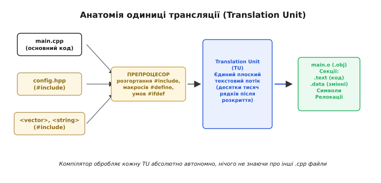
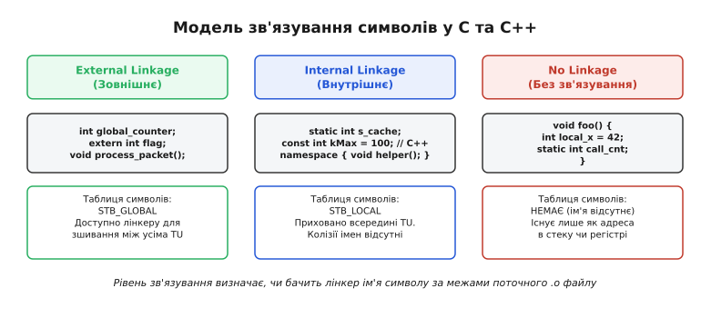
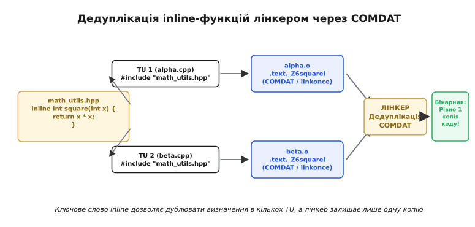
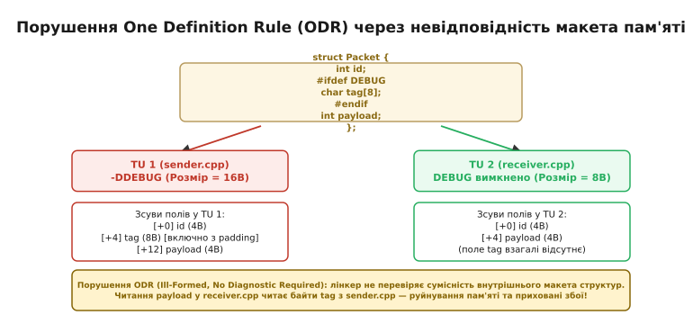
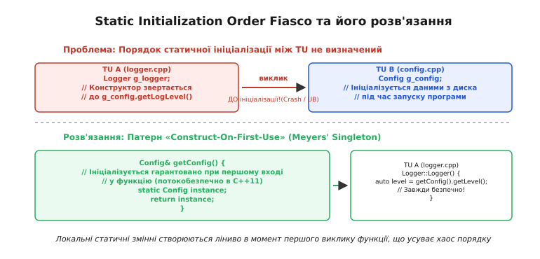
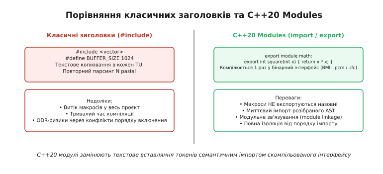

# Одиниця трансляції та зв'язування: static, extern, inline

<preknowlist>
- [Компіляція](root:sf-lang/compilation) — перетворення вихідного тексту на машинний код.
- [Стадії компілятора](root:sf-lang/compiler-stages) — етапи препроцесингу, синтаксичного розбору та оптимізації.
- [Лінкування](root:sf-lang/linking) — таблиця символів, релокації та збирання об'єктних файлів у бінарник.
- [Слабкі символи](root:sf-lang/weak-symbols) — дедуплікація однакових імен лінкером.
</preknowlist>

Коли компілятор мови C або C++ отримує команду зібрати файл `main.cpp`, він не читає сусідні файли `network.cpp` чи `database.cpp` і навіть не знає про їхнє існування на диску. Уся програма з погляду компілятора — це один ізольований текстовий потік, у який препроцесор вклеїв вміст усіх підключених заголовків, розкрив макроси та відкинув неактивні гілки умовної компіляції. Цей самодостатній потік тексту називають **одиницею трансляції** (*translation unit*, від лат. *translatio* — «перенесення, переклад» та *unitas* — «єдність»).

Саме ізольованість одиниць трансляції визначає, як влаштована архітектура програм: чому компілятор дозволяє оголошувати функції без тіла, як лінкер знаходить спільні змінні, чому дублювання коду в заголовках призводить до помилок множинного визначення і як сучасні механізми `inline` та модулі C++20 долають півстолітній спадок роздільної збірки.


*Формування одиниці трансляції. Препроцесор збирає сирцевий файл і всі включені заголовки в єдиний плоский потік тексту (Translation Unit). Компілятор транслює цю одиницю в об'єктний файл (.o) в абсолютній ізоляції від решти проєкту.*

### Що насправді бачить компілятор

У повсякденній розробці програміст бачить дерево вихідних файлів: десятки директорій, окремі файли класів `.cpp`, сотні невеликих заголовків `.hpp`. Проте транслятор бачить зовсім іншу картину.

Перша фаза збірки — робота **препроцесора** (*preprocessor*, від лат. *prae* — «попереду» та *processus* — «рух уперед»). Препроцесор виконує суто текстові операції:
1. Замінює кожну директиву `#include <header.h>` повним текстовим вмістом зазначеного файлу (рекурсивно підтягуючи всі заголовки, які той своєю чергою включає).
2. Замінює всі ідентифікатори макросів `#define` на їхній підставлений текст.
3. Аналізує директиви `#if`, `#ifdef`, `#ifndef` та видаляє рядки коду, умови для яких виявилися хибними.
4. Видаляє коментарі та перетворює послідовності пробільних символів.

Результатом цієї фази є **одиниця трансляції (TU)**. Якщо сирцевий файл `main.cpp` складався з 20 рядків, але підключав `<iostream>` та `<vector>`, то на вхід лексичного й синтаксичного аналізатора надходить єдиний плоский документ обсягом у 30 000–50 000 рядків коду.

Оскільки компілятор парсить кожну одиницю трансляції «з чистого аркуша», йому потрібні гарантії, що типи та функції, оголошені в інших файлах, існують і мають сумісні сигнатури. Компілятор вірить на слово заголовкам: він генерує машинний код для поточного файлу, а замість адрес зовнішніх функцій залишає порожні поля в таблиці релокацій. 

Результатом трансляції однієї TU є один **об'єктний файл** (`.o` в UNIX-подібних системах або `.obj` у Windows). Об'єктний файл розбитий на секції:
- `.text` — скомпільовані фундаментальні інструкції функцій;
- `.data` — глобальні та статичні змінні з ненульовим початковим значенням;
- `.bss` (*Block Started by Symbol*) — глобальні та статичні змінні, ініціалізовані нулем;
- `.rodata` — константи та строкові літерали;
- Таблиця символів (*symbol table*) — перелік імен функцій і змінних, які цей файл визначає або потребує ззовні.

> 🔧 **Навіщо це.** Знання того, що одиниця трансляції — це єдиний файл після препроцесингу, дозволяє миттєво зрозуміти причини повільної збірки великих проєктів на C++. Якщо 100 файлів `.cpp` включають важкий заголовок `<boost/asio.hpp>`, компілятор парсить цей заголовок 100 разів поспіль, генеруючи гігабайти проміжних структур AST.

---

### Модель зв'язування: як імена перетинають межі файлів

Оскільки кожна одиниця трансляції компілюється окремо, мова повинна мати правила, які визначають: чи є оголошене ім'я суто локальним секретом цього файлу, чи воно повинно бути доступним для інших частин програми під час збирання лінкером. Ця властивість називається **зв'язуванням** (*linkage*, від англ. *link* — «з'єднувати, ланка»).

Стандарти C та C++ визначають три рівні зв'язування для ідентифікаторів:
1. **Зовнішнє зв'язування** (*External Linkage*).
2. **Внутрішнє зв'язування** (*Internal Linkage*).
3. **Відсутність зв'язування** (*No Linkage*).


*Рівні зв'язування символів. External linkage записує глобальні імена (STB_GLOBAL), відкриті для лінкера. Internal linkage обмежує видимість файлом (STB_LOCAL). No linkage означає відсутність символу в таблиці імен.*

#### Зовнішнє зв'язування (External Linkage)

Символ із зовнішнім зв'язуванням експортується в таблицю символів об'єктного файлу як глобальний (`STB_GLOBAL` у форматі ELF). Це означає, що лінкер може використовувати це ім'я для розв'язання посилань (*symbol resolution*) з будь-яких інших одиниць трансляції.

За замовчуванням зовнішнє зв'язування мають:
- Усі звичайні функції, визначені на глобальному рівні або в просторах імен.
- Глобальні нестатичні змінні (у C).
- Класи, структури та перелічення.

Ключове слово `extern` (*external* — «зовнішній») слугує для оголошення символу без його визначення, повідомляючи компілятору: «цей символ існує, його тип такий, а точну адресу знайде лінкер в іншому файлі».

:::tabs
```c
// math_module.c
// Визначення глобальної змінної та функції (External Linkage)
int g_operation_count = 0;

int calculate_checksum(const unsigned char* data, int len) {
    g_operation_count++;
    int sum = 0;
    for (int i = 0; i < len; ++i) {
        sum += data[i];
    }
    return sum;
}
```
```cpp
// math_module.cpp
#include <span>
#include <cstdint>

// Визначення глобальної змінної та функції (External Linkage)
int g_operation_count = 0;

int calculate_checksum(std::span<const uint8_t> data) noexcept {
    g_operation_count++;
    int sum = 0;
    for (uint8_t byte : data) {
        sum += byte;
    }
    return sum;
}
```
:::

Щоб використати цю змінну та функцію в іншій одиниці трансляції `main.cpp`, їх оголошують через `extern`:

:::tabs
```c
// main.c
#include <stdio.h>

extern int g_operation_count;
extern int calculate_checksum(const unsigned char* data, int len);

int main(void) {
    unsigned char buffer[] = {1, 2, 3, 4};
    int cs = calculate_checksum(buffer, 4);
    printf("Checksum: %d, Ops: %d\n", cs, g_operation_count);
    return 0;
}
```
```cpp
// main.cpp
#include <iostream>
#include <span>
#include <vector>
#include <cstdint>

extern int g_operation_count;
extern int calculate_checksum(std::span<const uint8_t> data) noexcept;

int main() {
    std::vector<uint8_t> buffer = {1, 2, 3, 4};
    int cs = calculate_checksum(buffer);
    std::cout << "Checksum: " << cs << ", Ops: " << g_operation_count << "\n";
    return 0;
}
```
:::

#### Внутрішнє зв'язування (Internal Linkage)

Символ із внутрішнім зв'язуванням існує і є видимим **лише в межах поточної одиниці трансляції**. У таблиці символів об'єктного файлу він позначається прапорцем `STB_LOCAL`. Лінкер ігнорує локальні символи під час міжфайлового розв'язання імен. Це означає, що дві різні TU можуть мати функції або змінні з однаковими іменами з внутрішнім зв'язуванням — і лінкер не повідомить про колізію.

Внутрішнє зв'язування надають:
1. Ключове слово `static` на рівні файлу або простору імен.
2. Анонімні простори імен `namespace { ... }` у C++.
3. Глобальні змінні з модифікатором `const` або `constexpr` у C++ (за замовчуванням у C++ глобальний `const` має внутрішнє зв'язування, на відміну від мови C, де `const` залишається external!).

:::tabs
```c
// crypto.c
// static обмежує видимість цим файлом:
static int s_private_seed = 42;

static int internal_hash(int val) {
    return val ^ s_private_seed;
}

int public_encrypt(int raw) {
    return internal_hash(raw);
}
```
```cpp
// crypto.cpp
namespace {
// У C++ анонімні простори імен є сучаснішою заміною static на рівні файлу.
// Вони надають внутрішнє зв'язування не лише функціям, а й класам та типам.
int g_private_seed = 42;

int internal_hash(int val) noexcept {
    return val ^ g_private_seed;
}
} // namespace

int public_encrypt(int raw) noexcept {
    return internal_hash(raw);
}
```
:::

Чому в C++ анонімні простори імен `namespace { }` переважають над словом `static`? Модифікатор `static` у C та C++ можна застосувати лише до імен функцій та змінних, але неможливо застосувати до визначення типів: `static class SecretHelper { ... };` є синтаксичною помилкою. Анонімний простір імен огортає будь-які оголошення (класи, структури, псевдоніми типів `using`, шаблони), гарантуючи, що вони дістають унікальне ім'я трансляції та не створюють прихованих колізій ODR між файлами.

#### Відсутність зв'язування (No Linkage)

Якщо сутність не має зв'язування, її ім'я діє виключно в межах блоку коду (між фігурними дужками `{ ... }`), у якому вона оголошена. Лінкер взагалі не знає про існування цього імені.

Відсутність зв'язування мають:
- Локальні автоматичні змінні у функціях (`int x = 10;`).
- Параметри функцій.
- Локальні класи та типи, оголошені всередині тіла функції.

Важливо розрізняти **час життя** (*storage duration*) та **зв'язування** (*linkage*). Локальна змінна з модифікатором `static` всередині функції:

```cpp
void track_calls() {
    static int s_counter = 0; // static storage duration, але NO LINKAGE!
    s_counter++;
}
```

має статичний час життя (існує впродовж усієї роботи програми в сегменті `.data`/`.bss`), але має **відсутність зв'язування**: звернутися до `s_counter` з іншої функції або іншого файлу за цим іменем синтаксично неможливо.

---

### Ключове слово inline: від інструкції вбудовування до дедуплікації ODR

Історично слово `inline` (від англ. *in line* — «в один рядок») з'явилося як підказка оптимізатору компілятора: вставити машинний код функції безпосередньо в місце її виклику замість генерації інструкцій переходу `call/ret`. Докладно цей шлях від мікрооптимізацій PDP-11 до сучасних стандартів розбирає [історичний огляд еволюції inline та зв'язування](root:sf-lang/translation-unit/hist-inline-evolution.md).

Проте в сучасному C++ призначення `inline` докорінно змінилося. Оптимізатори компіляторів самостійно ухвалюють рішення про вбудовування функцій на основі етапів IR та профілювання (ігноруючи ключове слово `inline`, якщо функція занадто велика, і навпаки — агресивно вбудовуючи крихітні не-inline функції). 

Сьогодні головне завдання `inline` — бути **дозволом для лінкера на дублювання визначення сутності в декількох одиницях трансляції**.


*Механізм COMDAT-дедуплікації. Коли однаковий inline-заголовок включається в кілька TU, компілятор генерує тіла в секціях .text._Z6squarei (COMDAT). Лінкер залишає лише одну копію коду у фінальному файлі, відкидаючи дублікати без помилки multiple definition.*

#### Як працює дедуплікація через секції COMDAT

Якщо визначити звичайну функцію в заголовку `math.hpp` без ключового слова `inline`:

:::tabs
```c
// math_bad.h
int add(int a, int b) {
    return a + b;
}
```
```cpp
// math_bad.hpp
int add(int a, int b) {
    return a + b;
}
```
:::

і підключити `math_bad.hpp` у два файли `alpha.cpp` та `beta.cpp`, кожен об'єктний файл `alpha.o` та `beta.o` отримає глобальний символ `add` у своїй таблиці. Під час спроби компонування лінкер видасть фатальну помилку:

```
ld: error: multiple definition of 'add(int, int)'
```

Якщо ж додати специфікатор `inline`:

:::tabs
```c
// math_good.h (у стилі C99/C11)
static inline int add(int a, int b) {
    return a + b;
}
```
```cpp
// math_good.hpp (у C++)
inline int add(int a, int b) noexcept {
    return a + b;
}
```
:::

Компілятор застосовує спеціальний механізм двійкового формату — **секції COMDAT** (*Common Data*) в ELF та PE/COFF:
1. Замість загальної монолітної секції коду `.text`, компілятор розміщує машинний код функції `add` в окремій секції з спеціальним прапорцем дедуплікації (наприклад, `.text._Z3addii`).
2. Коли лінкер об'єднує об'єктні файли, він бачить кілька секцій COMDAT з однаковим ідентифікатором.
3. Лінкер зберігає **рівно одну** копію секції у результуючому файлі, а всі інші копії безшумно видаляє. Усі виклики функції з усіх TU перенаправляються на цю єдину збережену адресу.

#### Inline-змінні у C++17

До стандарту C++17 специфікатор `inline` можна було застосовувати лише до функцій та методів. Спроба створити глобальну константу або об'єкт у форматі header-only бібліотеки вимагала винесення визначення в окремий `.cpp` файл, або призводила до генерації окремих копій пам'яті через `static`.

Починаючи з C++17, ключове слово `inline` дозволено для змінних:

```cpp
// global_context.hpp (C++17)
#pragma once
#include <string>

struct AppConfig {
    std::string app_name = "CoreEngine";
    int worker_threads = 8;
};

// inline-змінна: дозволено визначення в заголовку,
// лінкер гарантує існування рівно одного екземпляра в пам'яті програми!
inline AppConfig g_app_config;
```

Компілятор поміщає `g_app_config` у секцію даних COMDAT, і вся програма ділить єдиний глобальний стан без необхідності заводити допоміжний `global_context.cpp`.

---

### Правило одного визначення (ODR) у C++

Фундаментом коректності програм на C++ є **Правило одного визначення** (*One Definition Rule*, ODR). Воно формулює суворий контракт між програмістом, компілятором та лінкером.

ODR складається з трьох ключових положень:
1. **У межах будь-якої однієї одиниці трансляції** кожна змінна, функція, клас, перелічення або шаблон можуть мати **не більше одного визначення** (оголошень може бути багато, але тіло/визначення — лише одне).
2. **У межах усієї програми** кожна не-inline функція та не-inline змінна з зовнішнім зв'язуванням повинна мати **рівно одне визначення**. Порушення цього правила призводить до помилки лінкера `multiple definition`.
3. **Для inline-функцій, inline-змінних, класів та шаблонів** визначення можуть існувати в кількох одиницях трансляції, **якщо і тільки якщо всі ці визначення є тотожними**: складаються з однакової послідовності токенів, у них однаково розв'язуються всі імена та вони мають ідентичну семантику.

#### Що таке ODR-used

Символ вважається **використаним за ODR** (*ODR-used*), коли компілятор зобов'язаний згенерувати для нього фізичну адресу в пам'яті або машинний виклик. 

Наприклад:
- Змінна є ODR-used, якщо її адресу отримують через оператор `&x`, якщо вона передається за посиланням `const int& ref = x`, або якщо вона читається у виразі, що не є константним під час компіляції.
- Функція є ODR-used, якщо вона реально викликається або на неї береться покажчик.

Якщо змінна використовується суто як вираз під час компіляції (`constexpr int N = 100; int arr[N];`), вона **не є ODR-used**, і компілятор має право взагалі не виділяти під неї байти в секції `.rodata`.

#### Катастрофа порушення ODR (IFNDR)

Найнебезпечніша ситуація в C++ виникає тоді, коли порушується третя частина правила ODR: коли визначення класу чи inline-функції в різних одиницях трансляції мають однакове ім'я, але різну структуру.

Стандарт класифікує таку помилку як **Ill-formed, no diagnostic required (IFNDR)** — програма є некоректною, але ані компілятор, ані лінкер не зобов'язані видавати попередження чи помилку.


*Руйнування пам'яті через порушення ODR. Якщо в одній TU структура компілюється з -DDEBUG, а в іншій без нього, зсуви полів розходяться. Запис у поле в одному файлі перезаписує чужі байти в іншому.*

Розглянемо практичний приклад прихованого краху:

```cpp
// packet.hpp
#pragma once
#include <cstdint>

struct NetworkPacket {
    uint32_t id;
#ifdef ENABLE_DIAGNOSTICS
    uint64_t timestamp;
#endif
    uint32_t payload_size;
};

void send_packet(const NetworkPacket& pkt);
```

Якщо файл `sender.cpp` був скомпільований із прапорцем компілятора `-DENABLE_DIAGNOSTICS`, то для нього розмір `sizeof(NetworkPacket)` становить 24 байти, а поле `payload_size` лежить за зміщенням `+16`.

Якщо ж файл `receiver.cpp` компілювався без цього прапорця, компілятор розраховує розмір структури у 8 байтів, а поле `payload_size` очікує за зміщенням `+4`.

Коли функція з `sender.cpp` передає об'єкт у функцію з `receiver.cpp`:
1. Лінкер успішно збирає бінарник (імена типів збіглися).
2. Під час виконання читання `pkt.payload_size` у `receiver.cpp` читає молодші 4 байти поля `timestamp`, підставленого `sender.cpp`.
3. Виникає приховане пошкодження пам'яті (*silent memory corruption*), яке вкрай важко виявити традиційними налагоджувачами.

---

### Порядок статичної ініціалізації та його катастрофа (SIOF)

Особливе місце у взаємодії одиниць трансляції посідає життєвий цикл глобальних об'єктів. 

Стандарт мови C++ встановлює такі правила ініціалізації змінних зі статичною тривалістю зберігання (*static storage duration*):
1. **У межах однієї одиниці трансляції** об'єкти ініціалізуються строго послідовно — у тому порядку, в якому вони оголошені в тексті файлу.
2. **Між різними одиницями трансляції порядок ініціалізації НЕ визначений**.

Якщо глобальний об'єкт `Logger g_logger` у файлі `logger.cpp` під час роботи свого конструктора звертається до глобального об'єкта `Database g_db` у файлі `db.cpp`, результат запуску програми є непередбачуваним.


*Static Initialization Order Fiasco та патерн Construct-On-First-Use. Недетермінований порядок запуску конструкторів між TU призводить до звернення до «сирої» пам'яті. Загортання в локальну статичну змінну гарантує ініціалізацію під час першого звернення.*

Якщо лінкер розмістив код ініціалізації `db.o` перед `logger.o`, програма виконається успішно. Якщо навпаки — конструктор логера спробує надіслати запит через `g_db`, поля якого ще містять неініціалізовані нулі. Програма впаде з помилкою `SIGSEGV` ще до того, як потік керування дійде до першого рядка функції `main()`.

Це явище зветься **Static Initialization Order Fiasco (SIOF)**. Глибокий розбір коду відтворення SIOF, діагностику через AddressSanitizer (`ASAN_OPTIONS=check_initialization_order=1`) та варіанти виправлення демонструє [практикум діагностики й розв'язання SIOF](root:sf-lang/translation-unit/proj-init-order-fiasco.md).

#### Патерн Construct-On-First-Use (Meyers' Singleton)

Найпростіший та найнадійніший спосіб гарантувати безпечну ініціалізацію — відмовитися від нелокальних глобальних змінних на користь функцій із локальними статичними змінними:

:::tabs
```c
// database_safe.h
#ifndef DATABASE_SAFE_H
#define DATABASE_SAFE_H

typedef struct {
    int connection_id;
    int is_ready;
} Database;

Database* get_database(void);

#endif // DATABASE_SAFE_H

// database_safe.c
#include "database_safe.h"

Database* get_database(void) {
    static Database db = { .connection_id = 101, .is_ready = 1 };
    return &db;
}
```
```cpp
// database_safe.hpp
#pragma once
#include <string>

class Database {
public:
    Database() : conn_str_("postgres://localhost:5432") {}
    [[nodiscard]] const std::string& connection() const noexcept { return conn_str_; }
private:
    std::string conn_str_;
};

// Construct-On-First-Use:
inline Database& get_database() {
    // Гарантія C++11: ініціалізація локального static є строго потокобезпечною
    // та відбувається рівно один раз під час першого проходження через цей рядок.
    static Database instance;
    return instance;
}
```
:::

#### C++20 constinit: розв'язання на рівні компілятора

Починаючи зі стандарту C++20, мова отримала ключове слово `constinit`. Воно змушує компілятор виконати ініціалізацію змінної виключно у фазі **статичної ініціалізації** під час компіляції:

```cpp
// system_clock.hpp (C++20)
#pragma once

struct ClockConfig {
    unsigned long default_frequency_hz;
    constexpr ClockConfig(unsigned long freq) : default_frequency_hz(freq) {}
};

// constinit гарантує: змінна ініціалізується до запуску будь-якого динамічного коду!
// Якщо конструктор не є constexpr — компілятор видасть помилку збірки.
constinit inline ClockConfig g_clock_config{16'000'000};
```

Оскільки об'єкти з `constinit` записуються безпосередньо у бінарний образ програми (`.data` або `.rodata`), вони фізично не можуть страждати від проблеми порядку міжфайлової ініціалізації.

---

### C++20 Modules: нова модель трансляції

Упродовж сорока років модель одиниць трансляції на базі препроцесора `#include` залишалася незмінною. Її головні вади очевидні:
- **Квадратична складність парсингу:** заголовок, підключений у 1000 `.cpp` файлів, розбирається синтаксичним аналізатором 1000 разів.
- **Витік макросів:** макрос `#define min(a, b)`, визначений у сторонній бібліотеці, протікає в усі наступні рядки та ламає методи `std::min()`.
- **Залежність від порядку підключення:** якщо поміняти місцями `#include <windows.h>` та `#include <winsock2.h>`, програма може перестати збиратися.

Стандарт C++20 запропонував фундаментальну альтернативу — **модулі** (*C++20 Modules*).


*Класичні заголовки проти модулів C++20. Замість багаторазового текстового копіювання токенів модулі компілюються один раз у двійковий формат інтерфейсу (BMI). Макроси не протікають, час компіляції скорочується.*

#### Анатомія модуля

Модуль C++20 — це окрема одиниця трансляції, яка явно оголошує свій експорт:

```cpp
// math_engine.ixx (або math_engine.cppm)
export module math_engine; // Оголошення модуля

// Ця функція експортується та доступна тим, хто робить import:
export int calculate_factorial(int n) noexcept {
    int res = 1;
    for (int i = 2; i <= n; ++i) res *= i;
    return res;
}

// Ця функція має module linkage: вона видима всередині модуля math_engine,
// але недоступна ззовні, навіть якщо знаходиться в іншій частині цього ж модуля!
int internal_helper(int x) noexcept {
    return x * 2;
}
```

Використання модуля в іншій одиниці трансляції:

```cpp
// main.cpp
import math_engine; // Семантичний імпорт замість текстового #include
#include <iostream>

int main() {
    std::cout << "Factorial: " << calculate_factorial(5) << "\n";
    // calculate_factorial доступний, internal_helper — надійно прихований.
    return 0;
}
```

#### Принципові відмінності модулів від TU з `#include`

1. **Двійковий інтерфейс (BMI — Binary Module Interface):** Компілятор обробляє `math_engine.cppm` рівно один раз і зберігає розібране синтаксичне дерево (AST) у проміжний двійковий файл (`.pcm` у Clang, `.ifc` у MSVC). Під час виконання `import math_engine;` компілятор за частки мілісекунди завантажує готові типи без повторного парсингу тексту.
2. **Герметична ізоляція макросів:** Макроси, визначені всередині модуля, **ніколи не експортуються назовні**. Макроси з файлу, який робить `import`, не можуть спотворити внутрішній код модуля.
3. **Модульне зв'язування (Module Linkage):** Новий рівень зв'язування. Імена, оголошені без ключового слова `export`, доступні в усіх модульних розділах (*module partitions*) даного модуля, але лінкер робить їх повністю недосяжними для зовнішнього коду без потреби використовувати застарілий `static` чи анонімні простори імен.

Модулі C++20 не скасовують базові поняття об'єктних файлів, секцій та лінкування, але звільняють розробників від багаторазового розбору коду та крихких компромісів препроцесора, перетворюючи одиницю трансляції на дійсно автономний, семантично захищений блок програми.
