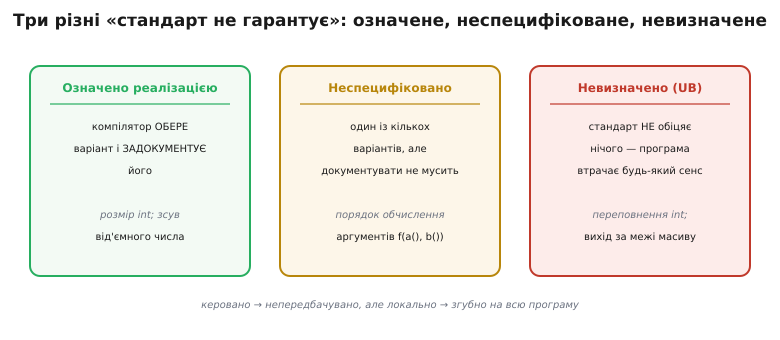
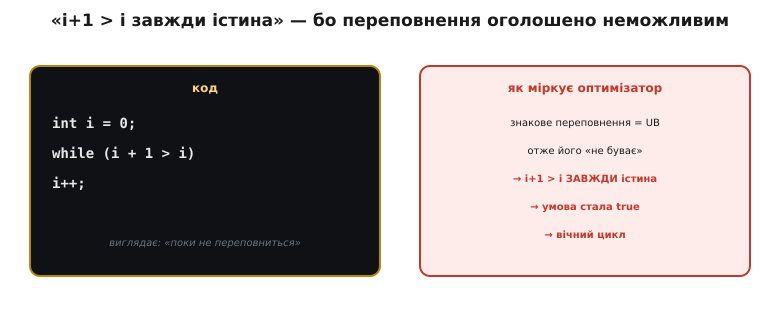
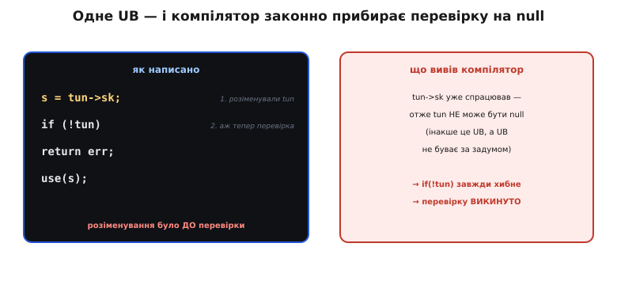
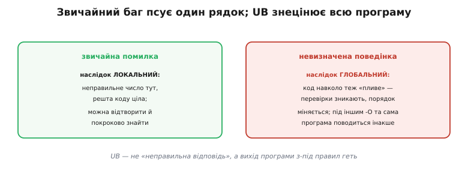

# Невизначена поведінка (UB): коли стандарт не обіцяє нічого

Є клас багів, у якому програма не просто дає неправильну відповідь — вона перестає підкорятися власним правилам. Код виглядає бездоганно, під `-O0` (без оптимізацій) працює, а під `-O2` тихо викидає цілу перевірку безпеки й відчиняє дірку. Той самий вихідний текст на двох компіляторах поводиться по-різному, і жоден із них не «помиляється». За цим стоїть поняття, яке треба зрозуміти кожному, хто пише на C чи C++: **невизначена поведінка** (англ. *undefined behavior*, скорочено **UB**).

Розберемось, що це насправді таке, чому мова взагалі містить таку пастку, як звичайна на вигляд помилка перетворюється на зникнення коду під оптимізацією — і як не наступати на неї в реальній прошивці.

## Що означає «невизначено»

Почнімо з точного означення, бо саме недооцінка його сили породжує біду. Стандарт C ділить усе, чого він не прописує однозначно, на три різні відтінки — і плутати їх смертельно.


*Три види «стандарт не диктує». Означене реалізацією — компілятор обирає варіант і зобов'язаний його задокументувати (розмір `int`). Неспецифіковане — теж один із кількох варіантів, але документувати не мусить (порядок обчислення аргументів). Невизначене — стандарт не обіцяє нічого взагалі: програма з таким кодом втрачає будь-який гарантований сенс.*

Різниця величезна. **Означене реалізацією** (implementation-defined) — це чесний вибір: розмір `int` — 2, 4 чи 8 байтів, але компілятор мусить сказати який, і поводитися послідовно. **Неспецифіковане** (unspecified) — теж вибір із кількох дозволених, тільки без обіцянки документувати: у якому порядку обчисляться `a()` і `b()` у виклику `f(a(), b())` — на розсуд компілятора, але щось розумне таки станеться.

А **невизначена поведінка** — це зовсім інша річ. Тут стандарт **знімає з себе всі зобов'язання цілком**. Дослівно: щойно програма виконує UB-конструкцію, її поведінка від цієї миті не визначена нічим — ані стандартом, ані здоровим глуздом. Не «дасть якесь число», не «впаде», а буквально **будь-що**: може працювати, може впасти, може мовчки зіпсувати сусідні дані, може вести себе по-різному від запуску до запуску. З погляду стандарту програма, що містить UB, взагалі **не є коректною програмою мови C** — і жодних гарантій на неї не поширюється.

> 🔧 **Навіщо це.** Практичний висновок жорсткий: UB — це не «дрібна неточність, яку колись поправлю». Це діра, крізь яку провалюється вся передбачуваність коду. У прошивці, що керує залізом, така діра — не абстракція: вона обертається зависанням, яке відтворюється раз на тиждень, або перевіркою безпеки, яку компілятор «оптимізував» геть. Тому UB треба не «мінімізувати», а **прибирати повністю**.

Звідки взялося таке дике за наслідками поняття й хто пустив у обіг знамениту метафору про «демонів із носа» — окрема цікава історія, [як народилося поняття UB](root:sf-lang/undefined-behavior/hist-nasal-demons.md).

## Чому мова взагалі це дозволяє

Виникає природне обурення: навіщо розробники мови залишили таку пастку? Чому не сказати «переповнення — то помилка, зупини програму»? Відповідь — у тому, заради чого C створювали: **швидкість, близька до асемблера, на будь-якому залізі**.

Уявіть, що стандарт **зобов'язав би** перевіряти кожен доступ до масиву на вихід за межі, кожне ділення — на нуль, кожне додавання — на переповнення. Тоді простий цикл по масиву обріс би перевіркою на кожній ітерації, і C втратив би саме те, чим цінний. Тому мова обрала інший договір: **«за коректність відповідає програміст»**. Компілятор має право припускати, що UB **ніколи не станеться**, — і будувати на цьому припущенні швидкий код, без страхувальних перевірок.

Друга причина — розмаїття заліза. У 1970-х різні процесори по-різному поводилися при переповненні, по-різному зсували від'ємні числа, мали різну довжину слова. Прописати єдину поведінку означало б або сповільнити всіх до найповільнішого, або зламати сумісність. Оголосивши ці випадки невизначеними, стандарт дозволив кожній платформі робити те, що для неї природно й дешево.

Тобто UB — не недогляд, а **свідома ціна за швидкість і переносність**. Проблема лише в тому, що ця ціна прихована: код із UB часто «випадково працює» роками, аж поки новіший, розумніший компілятор не скористається своїм законним правом припускати — і не зробить дещо несподіване.

## Ключовий поворот: компілятор ПРИПУСКАЄ, що UB немає

Ось серце теми, і саме тут ламається інтуїція новачка. Природно думати так: «якщо я випадково зроблю UB, програма просто зробить щось не те **в цьому місці** — ну, поверне сміття або впаде». Насправді все набагато підступніше.

Компілятор ставиться до UB не як до можливого результату, а як до **факту, якого не може бути**. Логіка [оптимізатора](root:sf-lang/compiler-optimizations) така: «розробник обіцяв, що UB не буде; отже я маю право вважати, що будь-який шлях виконання, який привів би до UB, **недосяжний** — і будувати код так, ніби такого шляху взагалі не існує». А з хибної передумови формально виводиться будь-що. Це не зловмисність компілятора — це холодна логіка, застосована до вашої обіцянки.

Найяскравіше це видно на знаковому переповненні. Переповнення `int` — це UB. Тепер погляньте на цикл, який намагається зловити момент переповнення:


*Оптимізатор міркує так: знакове переповнення — це UB, а UB «не буває»; отже `i+1` завжди строго більше за `i`; отже умова `i+1 > i` — тотожна істина; отже її можна замінити на `true` — і цикл стає вічним. Спроба «зловити переповнення» самим переповненням безнадійна: компілятор викреслює саму можливість.*

**Спроба виявити переповнення, що обертається зависанням.**

```c
int i = 0;
while (i + 1 > i)      // «поки не переповниться»
    i++;
```

Здається, цикл крутитиметься, доки `i` не дійде до максимуму `int` і `i + 1` не «перекотиться» у від'ємне — тоді `i + 1 > i` стане хибним і цикл вийде. Але компілятор міркує інакше: `i + 1 > i` можна спростити до `1 > 0`, тобто `true`, **бо переповнення (яке єдине могло б це зламати) — це UB, а UB не буває**. Умова стає тотожною істиною, і цикл **вічний**. Той самий код під `-O0` дійде до переповнення й вийде (а поведінка при самому переповненні лишиться непередбачуваною), а під `-O2` зависне назавжди. Один і той самий текст, дві протилежні поведінки — і жодна не «помилка компілятора».

> 🔧 **Навіщо це.** Звідси головне правило поводження з UB: **не намагайтеся «обробити» його постфактум**. Перевірка `if (i + 1 < i)` для лову знакового переповнення — марна, бо компілятор викине її з тієї ж причини. Переповнення треба **не допускати заздалегідь**: перевіряти межі *перед* операцією (`if (i > INT_MAX - 1)`) або брати беззнаковий тип, де [переповнення визначене й безпечне](root:sf-lang/unsigned-overflow) — воно чесно «перекочується» за модулем.

## Найдорожчий приклад: зникла перевірка на null

Абстракція стає відчутною, коли UB коштує реальної діри в безпеці. Канонічний випадок — вразливість ядра Linux **CVE-2009-1897** (2009 рік, драйвер `tun`), де невинний на вигляд порядок дій дав локальне підвищення привілеїв. Механізм рівно той самий, що з переповненням, тільки наслідок страшніший.


*Порядок фатальний: покажчик `tun` спершу розіменували (`tun->sk`), і лише потім перевірили на `null`. Компілятор міркує: якби `tun` був `null`, розіменування було б UB; UB не буває; отже `tun` гарантовано не `null` — і перевірку `if (!tun)` можна викинути як завжди-хибну. Перевірка безпеки зникає з бінарника.*

**Спрощений фрагмент драйвера й фатальний висновок компілятора.**

```c
struct sock *sk = tun->sk;   // 1. розіменували tun ДО перевірки
if (!tun)                    // 2. аж тепер перевіряємо на null
    return POLLERR;
// ... користуємось sk ...
```

Розробник написав перевірку `if (!tun)` — він **хотів** захиститися від нульового покажчика. Але рядком вище він уже написав `tun->sk`, тобто **розіменував `tun`**. І тут компілятор робить свій законний висновок: розіменування `null` — це UB; UB не буває; отже до цього рядка `tun` **точно не `null`**; отже наступна перевірка `if (!tun)` завжди хибна — і її можна **прибрати повністю**. У зібраному ядрі перевірки просто немає.

Далі — справа техніки нападника: відобразити пам'ять за нульовою адресою, підсунути туди свої дані, змусити ядро розіменувати `null`, який тепер указує на підконтрольну зловмиснику пам'ять, — і перехопити керування. Виправлення виявилось із одного рядка: **пересунути `tun->sk` після перевірки**, щоб розіменування не передувало їй. А ядро відтоді збирають із прапорцем `-fno-delete-null-pointer-checks`, який забороняє компілятору саме цю оптимізацію.

Покроковий розбір цього механізму — з тим, як він виглядає в асемблері й чому саме `-O2` вмикає видалення перевірки, — винесено в окремий приклад: [як UB зжерло перевірку безпеки](root:sf-lang/undefined-behavior/proj-null-check-removal.md).

Мораль випадку двояка. По-перше, **порядок «розіменувати, потім перевірити» — сам собою пастка**: перевірка на `null` мусить іти *перед* першим доступом, інакше вона безсила. По-друге — це наочний доказ, що UB не «локальне»: одна помилка з покажчиком прибрала перевірку, до якої, здавалося б, не мала стосунку.

## UB отруює код навколо себе

Саме ця нелокальність робить UB особливо підступним і відрізняє його від звичайного бага. Помилка в логіці дає неправильний результат **у конкретному місці**, а решта програми лишається цілою — і баг можна відтворити та покроково знайти. UB натомість дозволяє компілятору робити висновки, що розповзаються по коду навколо: прибирати перевірки, міняти порядок дій, вважати цілі гілки недосяжними.


*Звичайна помилка псує один результат, а код навколо цілий — її можна відтворити й знайти покроково. UB натомість дозволяє компілятору «переграти» код навколо: перевірки зникають, порядок дій змінюється, а під різними рівнями оптимізації та сама програма поводиться по-різному. Тому UB — не «неправильна відповідь», а вихід програми з-під правил геть.*

Звідси й сумнозвісний симптом — «**працює в debug, ламається в release**». Під `-O0` компілятор майже не користується своїм правом припускати відсутність UB, тож прихована помилка не проявляється. Під `-O2` він вичавлює з цього припущення все — і код, що спирався на «випадково правильну» поведінку UB, розсипається. Це той самий клас підступності, що й [пастка з `volatile`](root:sf-lang/volatile), де рівень оптимізації теж вирішує, вилізе баг чи ні: обидва — про те, що покладатися на «у мене ж працює» не можна.

Тому UB не можна «трохи допустити». Немає безпечної дози: якщо десь на шляху виконання ховається UB, під наступним компілятором чи з іншими прапорцями воно може проявитися будь-як. З UB — лише повне прибирання; терпимого рівня немає.

## Найчастіші джерела UB — і як їх уникати

Добра новина: UB не хаотичне — це **скінченний і добре відомий перелік** конструкцій. Знаючи їх в обличчя, більшість пасток обходиш рефлекторно. Ось ті, на які найчастіше наступають у C і C++:

- **Знакове переповнення** (`int`): додавання/множення, що виходить за межі типу. Ліки — перевіряти межі *до* операції або брати [беззнаковий тип із визначеним переповненням](root:sf-lang/unsigned-overflow).
- **Вихід за межі масиву**: `a[i]` при `i` поза `[0, N)`. Ліки — завжди звіряти індекс із розміром; не покладатися на «нульовий байт колись трапиться».
- **Розіменування нульового чи «висячого» покажчика**: доступ за `NULL` або за пам'яттю, яку вже звільнили. Ліки — перевіряти на `null` *перед* першим доступом; після `free` обнуляти покажчик.
- **Читання неініціалізованої змінної**: локальна `int x;` без присвоєння містить сміття, і його використання — UB. Ліки — ініціалізувати при оголошенні.
- **Ділення на нуль**: `a / 0` — UB (не «нескінченність»). Ліки — перевіряти дільник.
- **Порушення суворого аліасування**: читати ту саму пам'ять через покажчики несумісних типів. Це окремий підступний клас — [чому не можна дивитися на ті самі байти «різними очима»](root:sf-lang/strict-aliasing) і споріднений [аліасинг покажчиків](root:sf-lang/pointer-aliasing).

Помітьте спільну нитку: **майже кожне UB — це порушення обіцянки, яку компілятор має право вважати непорушною**. Не переповнюй знакове, не виходь за масив, не чіпай `null`, не читай сміття. Дотримуй обіцянок — і компіляторове право «припускати найкраще» працює на тебе, а не проти.

## Як ловити UB, поки воно не зловило вас

Оскільки компілятор мовчки припускає відсутність UB, звичайна компіляція його не викриє — потрібні спеціальні інструменти, і в сучасній розробці їх достатньо.

Найпростіше й майже безкоштовне — **увімкнути попередження**: `-Wall -Wextra` для GCC і Clang ловлять чималу частину типових помилок ще на етапі компіляції. Це перша лінія, і нехтувати нею гріх.

Потужніший засіб — **санітайзери** (sanitizers), що вбудовують перевірки просто в код і ловлять UB **під час виконання**, у момент, коли воно стається. `-fsanitize=undefined` (UBSan) відстежує знакове переповнення, вихід за межі, розіменування `null` і супутнє; `-fsanitize=address` (ASan) — доступ за межами буфера та звернення до звільненої пам'яті. Їх вмикають у тестових збірках і ганяють тести — тоді UB виявляє себе гучним звітом із точним рядком, а не тихою дірою в релізі.

> 🔧 **Навіщо це.** Робоча звичка: тримати **дві** збірки. Бойова — з `-O2` для швидкості. Тестова — з санітайзерами (`-fsanitize=undefined,address -O1`), на якій ганяються всі тести. Санітайзери сповільнюють код у рази й у прошивку не йдуть — зате на етапі тестів вони перетворюють «раз на тиждень зависає» на «ось файл, ось рядок, ось UB». Це найдешевший спосіб не зустрітися з UB уже в полі, де ціна знахідки вимірюється не хвилинами, а відкликаними пристроями.

Отже, невизначена поведінка — це не «дрібний баг у рядку», а **договір**: мова дала C швидкість і переносність в обмін на обіцянку програміста ніколи не робити певних речей. Компілятор цю обіцянку сприймає буквально — припускає, що UB не буває, і будує на цьому весь код, аж до викидання перевірок, які здаються зайвими. Тому UB не терпить «трохи»: його прибирають повністю. А щоб не воювати з ним наосліп, тримають напоготові попередження й санітайзери — і привчаються обходити знайомий перелік пасток рефлекторно.
