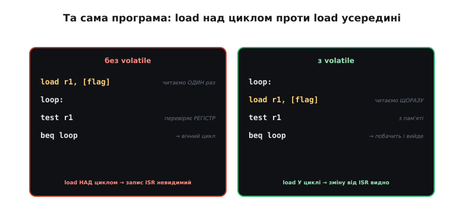

# ⚙️ Дивимось асемблер: цикл очікування з volatile і без

## Задача

Маємо канонічний цикл очікування події від ISR:

```c
while (!flag) { }     // чекаємо, доки обробник не поставить flag = true
```

Без `volatile` він **зависає назавжди**, навіть коли ISR справді ставить `flag`. Пояснюють це словами «компілятор кешує змінну в регістрі». Подивімося, що це означає в інструкціях.

## Ідея: де стоїть `load`

Уся різниця — в **одному**: чи стоїть інструкція читання змінної (`load`) **над** циклом (один раз) чи **всередині** (щоразу). Це й вирішує долю циклу.


*Та сама програма, дві компіляції. Без volatile `load` стоїть над циклом — `flag` читається раз, далі крутиться регістр, і запис ISR у пам'ять циклу не видно (вічний цикл). З volatile `load` стоїть усередині циклу — `flag` перечитується з пам'яті щоразу, тож зміну від ISR видно.*

**Без `volatile`** оптимізатор міркує цілком слушно (для звичайного коду): «`flag` у циклі ніхто не змінює, тож нащо читати її з пам'яті щоразу? Прочитаю **один раз** у регістр і крутитиму регістр». Виходить приблизно таке:

```asm
    load r1, [flag]     ; читаємо flag з пам'яті ОДИН раз
loop:
    test r1             ; перевіряємо РЕГІСТР (він не міняється!)
    beq  loop           ; → вічний цикл
```

ISR справді пише `flag` у **пам'ять** — але цикл крутить **регістр** і пам'яті більше не торкається. Зміни він не побачить **ніколи**.

**З `volatile`** компілятор зобов'язаний читати змінну з **пам'яті** при кожному оберті:

```asm
loop:
    load r1, [flag]     ; читаємо З ПАМ'ЯТІ щоразу
    test r1
    beq  loop           ; ISR записав пам'ять → цикл це побачить і вийде
```

Та сама програма мовою C, а в асемблері — `load` переїхав усередину циклу. Оце й уся «магія» `volatile`.

## Чого це НЕ робить

Тут чигає найпоширеніша хибна думка. `volatile` змушує **перечитувати** змінну — і тільки. Він **не** робить доступ **атомарним**: якщо значення ширше за машинне слово (скажімо, 32-бітне на 8-бітному МК), ISR може втрутитись **посеред** його читання, і основний код спіймає напіврозірване число. І `volatile` **не** ставить **бар'єр пам'яті** між ядрами ESP32. Для цих задач — [атомарні операції чи критичні секції](topic:sf-tasks/atomicity-races), а не `volatile`.


*volatile робить: перечитувати з пам'яті щоразу, не кешувати, не переставляти volatile-доступи. Чого не робить: не дає атомарності (рване значення) і не ставить бар'єр між ядрами. volatile = «перечитуй», а не «зроби неподільним».*

## Складність і пастки на МК

- **`volatile` — на спільну змінну.** Прапорці, індекси кільцевого буфера, будь-що, що міняє ISR. Саме на оголошення змінної, не «деінде».
- **Не сипте `volatile` всюди.** Для звичайних, не спільних змінних він лише **відбирає** корисні оптимізації — код стане більшим і повільнішим задарма.
- **`volatile` ≠ атомарність ≠ бар'єр.** Найважливіше затямити: він рятує від **кешування**, а не від **гонок** і не від **переставлень між ядрами**.
- **Апаратні регістри теж `volatile`.** Регістр периферії змінює саме залізо «поза кодом» — тому доступ до нього теж мусить бути `volatile`, інакше та сама біда.

## Підсумок

`volatile` — це наказ «**читай з пам'яті щоразу**», і в асемблері він буквально пересуває `load` усередину циклу. Це лікує зависання, де ISR пише, а цикл «не бачить». Але це **лише** про свіжість читання — не про атомарність і не про порядок між ядрами; ті — окрема зброя ([атомарність і гонки](topic:sf-tasks/atomicity-races)).
