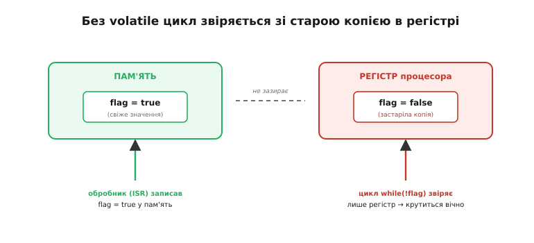
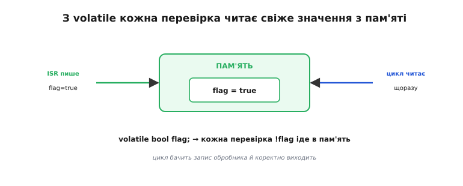
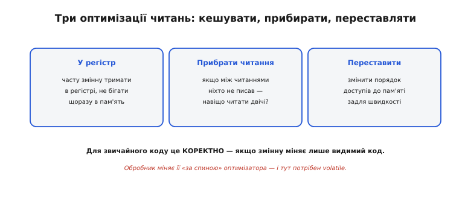
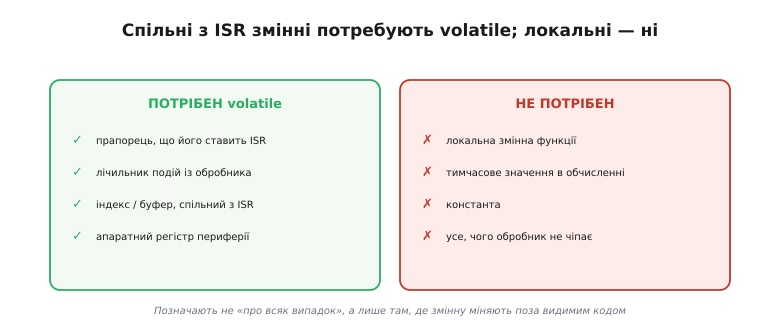
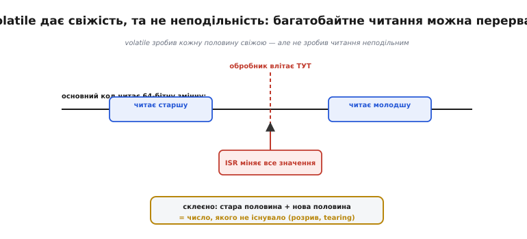
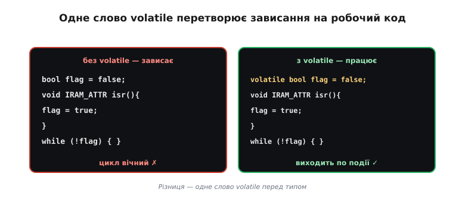

# `volatile`: чому компілятор не має «оптимізувати»

Слово **`volatile`** (лат. *volare* — летіти; *volatilis* — летке, мінливе) дослівно означає «те, що випаровується, живе власним життям». У C і C++ воно ставиться перед оголошенням змінної й попереджає компілятор: значення цієї комірки може змінитися **поза** видимим кодом, тож поводитися з нею як зі звичайною не можна. Це маленьке слово знімає один із найпідступніших багів вбудованого програмування — коли код виглядає бездоганно, а програма «зависає» або поводиться безглуздо саме тому, що компілятор **надто розумний**. Тут розібрано, як виникає ця пастка, як `volatile` її знімає, яким змінним воно потрібне, а яким ні, і — найважливіше — чого `volatile` **не** робить.

Корінь біди — [спільні змінні між обробником переривання і основним кодом](topic:hw-arch/interrupt-priorities): обробник і `loop()` чіпають ту саму комірку, але компілятор бачить лише один із цих потоків.

### Підступний баг: цикл, що зависає назавжди

Канонічна пастка, на якій спіткнувся кожен новачок із перериваннями, виглядає так. Є прапорець `flag`, який обробник ставить у `true`, коли сталася подія, а основний код чекає на цю подію простим циклом `while (!flag) { }`. Виглядає очевидно правильно: щойно ISR підніме прапорець, цикл побачить це й вийде. Та насправді програма **зависає назавжди**, хоча обробник чесно спрацьовує й записує `flag = true`.


*Компілятор задля швидкості «закешував» `flag` у регістрі процесора, тож цикл перевіряє регістр, а не пам'ять. Обробник тим часом записав `flag = true` у пам'ять — але цикл туди вже не зазирає й крутиться вічно, звіряючись із застарілою копією.*

Причина не в обробнику й не в логіці — вона у **відірваності** того, що бачить цикл, від того, що записав ISR. Цикл читає застарілу копію змінної в регістрі, а свіже значення лежить у пам'яті, куди він уже не зазирає. Поки ми не накажемо коду перечитувати змінну з пам'яті щоразу, баг невиліковний.

Найгидкіше в цьому багу — що він **примхливий**. Чи проявиться він, залежить від того, наскільки агресивно оптимізує компілятор: під одним рівнем оптимізації той самий код працює, під іншим — зависає, хоча в логіці не змінено ані рядка (конкретний механізм цього розібрано нижче, у прикладі з кнопкою). Така мінливість збиває з пантелику, тож покладатися на «у мене ж працює» тут не можна — спільну змінну треба позначати `volatile` **завжди**, незалежно від того, чи виліз баг сьогодні.

### volatile: «читай заново щоразу»

Лікує цю пастку `volatile`. Слово ставлять перед оголошенням змінної (`volatile bool flag;`), і воно каже компіляторові буквально таке: «**ця змінна може змінитися поза твоїм видимим кодом — тому не кешуй її в регістрі, а читай і пиши прямо в пам'ять, щоразу, без жодних скорочень**». Для нашого циклу це означає, що кожна перевірка `!flag` тепер іде безпосередньо в пам'ять — і миттю бачить запис, який зробив обробник.


*Оголосивши `flag` як `volatile`, забороняємо кешування: тепер цикл щоразу читає змінну з пам'яті, бачить `true`, який поставив обробник, і коректно виходить. Одне слово відновлює розірваний зв'язок між обробником і основним кодом.*

По суті `volatile` — це позначка «обережно, мінливе»: вона вимикає для конкретної змінної всі оптимізації, що припускають її незмінність «за спиною». Ціна — ця змінна стає трохи повільнішою (кожен доступ іде в пам'ять, а не в швидкий регістр), та для прапорця чи лічильника це абсолютно несуттєво порівняно з тим, що код нарешті **працює**.

Той самий `volatile` працює в коді постійно, часто непомітно для автора. Апаратні [регістри периферії](topic:hw-arch/memory-mapped-io) у бібліотеках завжди описані як `volatile` — і не випадково: значення регістра `GPIO_IN` змінює саме залізо, «за спиною» компілятора, точнісінько як обробник міняє наш прапорець. Якби читання регістра дозволили кешувати, код бачив би старий стан ніжки замість реального. Тобто `volatile` — це загальний механізм «ця комірка живе власним життям»: він однаково потрібен і для змінних, спільних з ISR, і для будь-чого, що міняє апаратура.

Симетрія тут повна: `volatile` діє в **обидва** боки. Він змушує не лише **читати** свіже, а й **записувати** одразу в пам'ять, не відкладаючи. Це важливо, коли напрям обміну зворотний — основний код виставляє якийсь керівний прапорець, а обробник його читає: без `volatile` запис із `loop()` міг би «застрягти» в регістрі й не дійти до ISR вчасно. Тож правило «спільне з обробником — `volatile`» однакове, хоч хто кому пише: і коли обробник сповіщає `loop()`, і коли `loop()` керує обробником.

### Чому так стається: компілятор «надто розумний»

Щоб користуватися `volatile` свідомо, варто зрозуміти, **що** саме робить компілятор і чому. Сучасний оптимізатор постійно прискорює код десятками способів. Серед них — тримати часто вживану змінну в **регістрі**, не бігаючи щоразу в повільну пам'ять; **прибирати** читання, які здаються зайвими (якщо між двома читаннями змінну ніхто не записував — навіщо читати двічі?); **переставляти** доступи до пам'яті задля швидкості.


*Три типові оптимізації: тримати змінну в регістрі, прибирати «зайві» перечитування, переставляти доступи. Для звичайного коду це коректно й корисно — якщо змінну міняє лише видимий код. Але обробник міняє її «за спиною» оптимізатора, тож той працює зі старою копією — і саме тут потрібен `volatile`.*

Головне розуміти: ці оптимізації **не помилкові**. Вони спираються на цілком слушне для звичайного коду припущення — що змінну міняє **лише той код, який компілятор бачить**. У однопотоковій програмі без переривань так і є, і всі скорочення абсолютно безпечні. Але переривання порушує це припущення: обробник може втрутитися будь-коли й змінити змінну **поза** видимим потоком виконання. Тоді чесна оптимізація обертається багом — і `volatile` саме й каже компіляторові «для цієї змінної те припущення не діє».

> ⚙️ **Побачити на власні очі.** Усе це чудово видно в **асемблері**: без volatile інструкція читання «виноситься» з циклу й він крутить старий регістр; із volatile читання лишається всередині. Порівняння двох компіляцій того самого циклу — у вставці [Дивимось асемблер](topic:sf-lang/volatile/proj-volatile-asm.md).

За цим стоїть фундаментальне правило мов C і C++ — так зване «**правило ніби**» (англ. *as-if rule*): компілятор має право перетворювати код як завгодно, **аби лиш** зберігалася його видима поведінка для однопотокового спостерігача. А доступи до `volatile`-змінних якраз і оголошено **видимою** (спостережуваною) поведінкою, що її чіпати **не можна**: їх не вільно ані прибирати, ані переставляти між собою. Тобто `volatile` не «просить» компілятор бути обережним — він формально виводить ці доступи з-під дії оптимізацій. Ось чому це надійно працює на всіх компіляторах і не залежить від їхньої доброї волі.

**Той самий прапорець із ISR: чому release кешує, а debug — ні.** Візьмімо реальний фрагмент прошивки ESP32 — кнопку на перериванні, що має розбудити цикл очікування:

```cpp
volatile bool pressed = false;        // спільна з ISR → volatile

void IRAM_ATTR onButton() {           // обробник переривання GPIO
    pressed = true;                   // запис у пам'ять
}

void waitForPress() {
    pressed = false;
    while (!pressed) {                // чекаємо натискання
        // компілятор бачить: усередині циклу pressed ніхто не пише
    }
}
```

Без `volatile` оптимізатор міркує цілком слушно для звичайного коду: усередині `while` змінну `pressed` ніхто не записує, отже читати її з пам'яті щоразу — марнування. У режимі `-O2` (release) він читає `pressed` **один раз** у регістр і далі звіряє регістр — цикл стає вічним. У режимі `-O0` (debug) оптимізація вимкнена: кожна перевірка чесно йде в пам'ять, тож той самий код **працює**. Звідси сумнозвісне «працює в debug, ламається в release». Слово `volatile` прибирає цю залежність від рівня оптимізації: воно зобов'язує читати `pressed` з пам'яті при кожному оберті — і в release, і в debug однаково.

### Яким змінним потрібен volatile

Звідси чітке правило, кому потрібна позначка, а кому ні. `volatile` потрібен **кожній** змінній, яку міняє один контекст, а читає інший: прапорець, що його ставить ISR; лічильник подій із обробника; індекс чи буфер, спільний між обробником і `loop()`. Коротко — усе, що пише обробник, а читає основний код (чи навпаки).


*Ліворуч — потребують `volatile`: прапорці, лічильники, буфери, спільні з обробником. Праворуч — не потребують: локальні змінні функцій, тимчасові в обчисленнях, константи, усе, чого обробник не чіпає. `volatile` ставлять не «про всяк випадок», а лише там, де змінну справді міняють поза видимим кодом.*

А от пхати `volatile` всюди «про всяк випадок» — погана ідея: для звичайних, не спільних змінних воно лише **відбирає** в компілятора законні оптимізації й сповільнює код, нічого не даючи натомість. Локальна змінна в функції, тимчасове значення в обчисленні, константа — їм `volatile` ні до чого. Точність тут важлива: позначайте рівно ті змінні, що живуть на стику обробника й основного коду.

> 🔧 **Навіщо це.** Візьміть за непорушну звичку: **оголосив змінну, яку чіпає обробник, — одразу пиши `volatile`**. Це найдешевша страховка від цілого класу «містичних» багів, де код виглядає правильним, але зависає, реагує через раз чи бачить старі значення. І навпаки — якщо переривання «не доходить» до `loop()`, перша підозра саме сюди: чи спільна змінна оголошена `volatile`? Дев'ять із десяти таких загадок — це забутий `volatile`.

Дрібна, але корисна тонкість: `volatile` стосується **всієї** змінної, тож складені дані (структуру, масив) оголошують `volatile` цілком, а не одне поле. З вказівниками ж буває плутанина: `volatile T*` і `T* volatile` — різні речі (мінливе те, **на що** вказують, чи **сам** вказівник). Для перших кроків це зайве, та варто знати, що позначка прив'язана до конкретної комірки, і помилитися, на яку саме, цілком реально. Якщо сумніваєтесь — оголошуйте `volatile` саме ту змінну, яку реально чіпає обробник.

### Чого volatile НЕ робить: це не атомарність

А тепер найважливіше застереження теми, яке рятує від хибної певності. `volatile` гарантує **свіжість** — що ви завжди прочитаєте/запишете актуальне значення з пам'яті. Але він **не** гарантує **атомарності** — тобто не робить операцію неподільною. Це різні речі, і плутати їх небезпечно.


*`volatile` забезпечує читання/запис прямо в пам'ять — але не захищає від переривання посеред дії. Якщо значення багатобайтне (наприклад, 64-бітне), обробник може втрутитися між читанням старшої й молодшої половини — і вийде розрив (англ. *tearing*): половина стара, половина нова, тобто сміття. Для таких даних потрібен ще й захист — [критична секція](topic:sf-tasks/atomicity-races).*

Тут варто додати точне уточнення, щоб не лякатися без потреби. На 32-бітному ESP32 читання чи запис **одного** вирівняного 32-бітного слова — це **одна** машинна операція, тож вона неподільна сама собою: простий `volatile bool` чи `volatile uint32_t`, який обробник лише **записує**, а `loop()` лише **читає**, у захисті не потребує — `volatile` тут достатньо. Розрив загрожує більшим за слово величинам (64-бітним `uint64_t`, `double`, структурам) або діям «прочитати-змінити-записати» (як `count++`), що складаються з кількох кроків. Тобто межа проста: одне слово, один доступ — безпечно; усе складніше — під захист.

Механізм такий: щоб прочитати 64-бітну змінну на 32-бітному процесорі, потрібні **дві** машинні операції (старша половина, потім молодша). Якщо обробник втрутиться **між** ними й змінить усе значення, основний код складе докупи стару половину й нову — отримавши число, якого ніколи не існувало. `volatile` тут не рятує: він зробив кожну з половин свіжою, але не зробив їхнє читання **неподільним**. Тому для багатобайтних чи складених даних (структур, буферів) `volatile` — лише половина справи; другу половину — захист від переривання посеред дії — дає [критична секція](topic:sf-tasks/atomicity-races).

Симптом розриву легко впізнати: значення, що зрідка «стрибає» в безглузду величину — величезну чи від'ємну там, де такого бути не може. Якщо багатобайтний лічильник раз на тисячу зчитувань видає сміття, а `volatile` уже стоїть, — це майже напевно розрив, і час брати [захист критичною секцією](topic:sf-tasks/atomicity-races). Підступність у тому, що трапляється воно **рідко** (лише при точному збігу читання з перериванням), тож відтворити його важко, а пояснити — легко, коли знаєш про неподільність.

### Приклад: одне слово, що все вирішує

Найпростіший приклад зводить усе докупи — мінімальний прапорець у двох версіях, без `volatile` і з ним:


*Той самий код у двох версіях. Ліворуч (без `volatile`) цикл `while(!flag){}` зависає назавжди, бо компілятор кешує прапорець. Праворуч — одне слово `volatile` перед типом, і код працює: цикл виходить, щойно обробник підніме прапорець. Різниця — справді в одному слові.*

**Зависання без volatile проти робочого коду з ним.**

```cpp
// --- БЕЗ volatile: зависає назавжди ---
bool flag = false;
void IRAM_ATTR isr() { flag = true; }
…
while (!flag) { }          // компілятор кешує flag → цикл вічний ✗

// --- З volatile: працює ---
volatile bool flag = false;
void IRAM_ATTR isr() { flag = true; }
…
while (!flag) { }          // щоразу читає пам'ять → виходить по події ✓
```

Уся різниця — одне слово `volatile` перед типом. Без нього бездоганний на вигляд код зависає; з ним — працює. Те саме стосується й [лічильника імпульсів, який нарощує обробник](topic:hw-arch/isr) (`volatile uint32_t pulses`): без `volatile` `loop()` бачив би застигле значення, скільки б обробник не рахував. Запам'ятайте це як рефлекс: будь-яка змінна, що перетинає межу «обробник ↔ основний код», має бути `volatile`.

Варто назвати й сучасну альтернативу. У новому C++ є тип `std::atomic`, що розв'язує обидві проблеми заразом — і свіжість, і неподільність, — тож формально він «правильніший» за `volatile` для обміну між контекстами. Та у світі Arduino й вбудованих систем донині панує простіша й передбачуваніша класична зв'язка: **`volatile` для свіжості плюс [критична секція](topic:sf-tasks/atomicity-races) для неподільності**. Саме її ви бачитимете в переважній більшості прикладів і бібліотек, тож опанувати варто насамперед її; а `std::atomic` нехай лишається знанням про те, що є й елегантніший шлях, коли доростете до нього.

Отже, `volatile` — це наказ компіляторові не «оптимізувати» доступ до змінної: не кешувати її в регістрі, не прибирати перечитувань, а щоразу йти в пам'ять. Він потрібен **кожній** змінній, спільній між обробником і основним кодом, і лише їм. Та пам'ятайте про його межу: `volatile` дає **свіжість, але не атомарність**, тож від «розриву» багатобайтних значень він не боронить. Цю другу частину захисту — як зробити дію зі спільними даними **неподільною** — дає [критична секція](topic:sf-tasks/atomicity-races).
