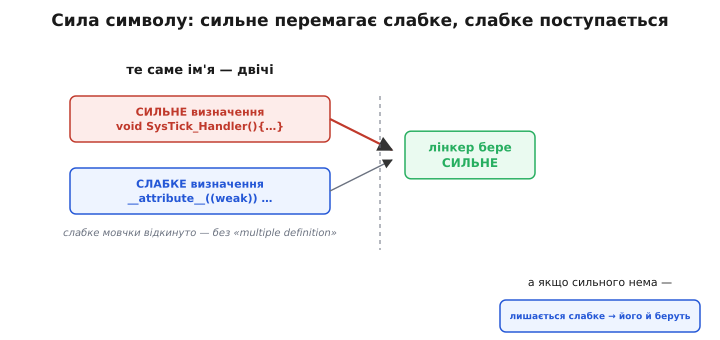
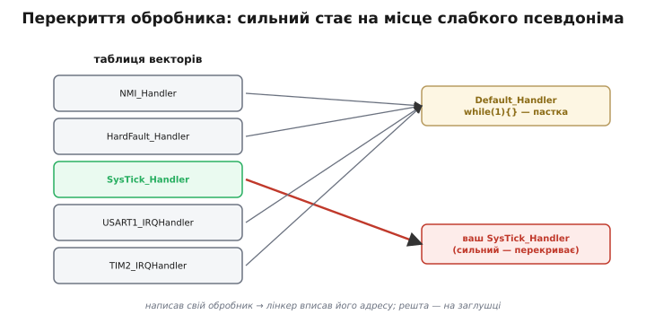
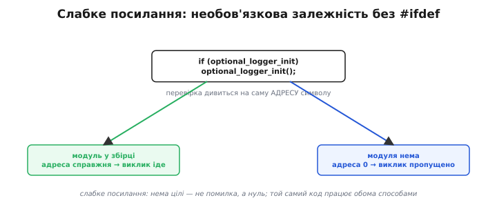

# Слабкі символи: визначення, яке поступається, коли є краще

Уявіть звичну ситуацію на мікроконтролері. Виробник чипа дав вам готовий стартовий файл, і в ньому вже є функція `SysTick_Handler` — обробник системного таймера. Ви ж хочете свій, власний: додаєте у свій `.c` функцію з **точно таким самим іменем** — і все працює, кличеться саме ваша. Але ж [лінкер](topic:sf-lang/linking) мав би скиглити «**multiple definition**» — те саме ім'я визначене двічі! Чому ж цього разу він мовчить і спокійно бере вашу версію, тихо викинувши чужу?

Уся магія — в одному слові, яким виробник позначив свою функцію: **weak** («слабка»). Слабкий символ — це визначення, що саме собою погоджується поступитися: «я тут на випадок, якщо кращого нема; з'явиться справжнє — забудьте про мене». Розберімося, як ця скромна позначка працює й чому без неї не обходиться жодна серйозна прошивка.

## Спершу — що таке «сила» символу

Щоб зрозуміти слабкість, треба згадати, чим взагалі оперує лінкер. Кожне ім'я функції чи глобальної змінної для нього — це [символ](topic:sf-lang/linking) (*symbol*, від грец. *sýmbolon* — «знак»): запис у таблиці, що прив'язує ім'я до місця в пам'яті. І в кожного визначеного символу є **сила зв'язування** (*binding*) — властивість, що каже лінкерові, наскільки серйозно ставитися до цього визначення.

За замовчуванням будь-яка звичайна функція чи не-`static` змінна — це **сильний** (*strong*, «міцний») символ. Сильний означає безкомпромісний: «це справжнє, єдине й остаточне визначення». Саме тому правило лінкера непохитне: кожне ім'я має бути визначене **сильним рівно один раз**. Знайшов два сильні `SysTick_Handler` — і лінкер не знає, котрий брати, тож зупиняється зі скаргою «multiple definition».

> 🔧 **Навіщо це.** Сила зв'язування — не абстракція зі стандарту, а те, що щодня вирішує, збереться ваша прошивка чи ні. Коли дві бібліотеки випадково визначають функцію з однаковим іменем і обидві сильні — ви дістаєте «multiple definition» на порожньому місці. А коли одна з них слабка — конфлікт зникає сам собою, бо слабке добровільно відходить. Тож розуміти силу символу — значить розуміти, чому одні зіткнення імен фатальні, а інші рушій розрулює тихо.

## Слабкий символ: визначення «за замовчуванням»

Слабкий символ (*weak symbol*, англ. *weak* — «слабкий, поступливий») — це те саме визначення, але з іншим статусом: «я даю це ім'я, **проте лише як запасний варіант**; якщо десь є сильне визначення того самого імені — бери його, а мене відкинь без жодної помилки».

Звідси й головне правило, на якому тримається все:

```
Розв'язання імені за силою:
  є сильне визначення           → беремо його, слабкі мовчки відкидаємо
  є лише слабкі (жодного сильного) → беремо перше слабке
  немає жодного визначення        → залежить: сильне посилання — помилка;
                                    слабке посилання — адреса 0 (не помилка)
```

Перший рядок — це і є розгадка нашої загадки з `SysTick_Handler`. Виробникова функція **слабка**, ваша — звичайна, тобто **сильна**. Лінкер, знайшовши сильне визначення, бере його й тихо викидає слабке. Жодного «multiple definition» — бо для слабкого це не конфлікт, а сáме те, для чого його зробили: поступитися.

Другий рядок пояснює, що буде, якщо ви свою функцію **не** напишете: сильного нема, лишається саме слабке виробникове — його й візьмуть. Тобто слабкий символ працює як **значення за замовчуванням**: є ваша заміна — діє вона; нема — тихо працює типова.


*Правило розв'язання за силою. Коли те саме ім'я дають і сильне визначення, і слабке, лінкер бере сильне, а слабке мовчки відкидає — без «multiple definition». Якщо ж сильного нема, лишається слабке — його й беруть. Слабке — це визначення, яке добровільно поступається кращому.*

## Як позначити символ слабким у C

У чистому C поняття слабкості нема — це не мовна конструкція, а властивість символу на рівні [об'єктного файлу](topic:sf-lang/compiler-stages) й лінкера. Тому позначку дають **розширенням компілятора**. У GCC і Clang це атрибут `weak`:

**Слабка функція-заглушка, яку користувач може перекрити своєю:**
```c
// у бібліотеці виробника: типова, «нічого не роблю» реалізація
__attribute__((weak)) void on_sensor_ready(void)
{
    // порожньо: якщо застосунок не перекриє — просто нічого не станеться
}
```

Тепер якщо у вашому коді з'явиться звичайна `void on_sensor_ready(void) { ... }` — сильна переможе, і кластиметься ваша. А якщо ні — лишиться ця порожня заглушка, і виклик `on_sensor_ready()` десь у бібліотеці просто нічого не зробить, замість того щоб зламати збірку невизначеним посиланням. Багато виробничих бібліотек саме так роздають **зачіпки** (*hooks*): купа слабких порожніх функцій-подій, кожну з яких ви можете перехопити, просто оголосивши свою з тим самим іменем — не чіпаючи й не перекомпільовуючи їхній код.

Часто трапляється й трохи хитріший різновид — слабкий символ, що є **псевдонімом** іншої функції. Пишуть так: `__attribute__((weak, alias("Default_Handler")))`. Це означає «зроби це ім'я слабким **і** нехай воно веде на `Default_Handler`». Одним махом — і поступливість, і спільна типова поведінка для десятків імен. Саме цей прийом стоїть за таблицею векторів переривань, до якої ми зараз і дійдемо.

## Класичний випадок: обробники переривань

Ось де слабкі символи в прошивці незамінні. У [таблиці векторів](topic:hw-arch/vector-table) чипа записано адреси всіх [обробників переривань](topic:hw-arch/isr) — по одному запису на кожне джерело події: таймер, UART, зовнішній пін тощо. Апаратура сама стрибає за цією адресою, коли настає подія. Але біда: цих переривань — десятки, а вам у конкретному проєкті потрібні три-чотири. Що вписати в решту записів?

Відповідь виробника елегантна. У стартовому файлі **кожен** обробник оголошено слабким псевдонімом на одну спільну функцію-заглушку — зазвичай її звуть `Default_Handler`, і всередині вона робить найпростіше: вічний цикл `while (1) {}`, тобто «сталося щось, чого я не чекав, — зависаю тут». Виглядає це приблизно так:

```c
// у стартовому файлі виробника — усі обробники слабкі й ведуть на заглушку
void Default_Handler(void) { while (1) { } }   // необроблене переривання — зависнути тут

__attribute__((weak, alias("Default_Handler"))) void SysTick_Handler(void);
__attribute__((weak, alias("Default_Handler"))) void USART1_IRQHandler(void);
__attribute__((weak, alias("Default_Handler"))) void TIM2_IRQHandler(void);
// …і так для кожного переривання чипа
```

Тепер логіка збірки складається сама собою. Напишете ви у своєму коді `void SysTick_Handler(void) { ... }` — це сильне визначення, воно переможе слабке, і в таблицю векторів лінкер впише **вашу** адресу. Не напишете — лишиться слабкий псевдонім, і той запис вестиме на `Default_Handler`. Тобто **кожне** переривання за замовчуванням безпечно веде в «зависання-пастку», а щойно ви беретеся обробляти якесь конкретне — ваша функція автоматично стає на його місце. І все це **без єдиного `#ifdef`**, без списку «які обробники ввімкнено», без правок у виробниковому файлі: сам факт наявності вашої однойменної функції — і є перемикач.


*Чому переривання «просто працюють». Виробник зробив усі обробники слабкими псевдонімами `Default_Handler` (вічний цикл-пастка). Ви написали свій `SysTick_Handler` — сильний, тож лінкер вписав у таблицю векторів саме його адресу. Решта записів лишилися на заглушці. Перемикач — сам факт наявності вашої однойменної функції.*

> 🔧 **Навіщо це.** Звідси — практичне вміння читати збої. Якщо ваш обробник переривання «не кличеться», перша підозра: ім'я не збіглося **до літери** з тим, що чекає таблиця векторів (`SysTick_Handler`, а не `Systick_Handler` чи `SysTickHandler`). Не збіглося — ваша функція стала звичайним нікому не потрібним сильним символом, а слабкий псевдонім лишився на місці, тож апаратура й далі стрибає в `Default_Handler`. І класичний симптом «прошивка зависла в нескінченному циклі невідомо де» — часто саме це: спрацювало переривання, обробника на яке ви не написали, тож керування пішло у `Default_Handler` з його `while(1)`.

## Друге обличчя слабкості: слабкі посилання

Досі йшлося про слабкі **визначення** — коли ім'я хтось *дає*. Але слабким може бути й **посилання** — коли ім'я хтось *потребує*. І це вмикає геть інший, дуже корисний сценарій.

Згадаймо звичайне правило: якщо код кличе функцію, якої ніде нема, лінкер зупиняється з «undefined reference». Це для **сильного** посилання. А от **слабке** посилання поводиться інакше: не знайшов визначення — **не помилка**; лінкер просто підставляє адресу **нуль** (тобто нікуди) і йде далі. Виходить символ, який *може* існувати, а *може* й ні, — і програма це переживе.

Навіщо таке? Щоб код умів працювати з **необов'язковою** частиною системи — тією, якої в конкретній збірці може не бути. Класичний зразок:

**Виклик додаткового модуля, лише якщо його ввімкнули у збірку:**
```c
// оголошуємо чужу функцію слабким посиланням: її може й не бути в цій збірці
__attribute__((weak)) void optional_logger_init(void);

void system_boot(void)
{
    // ... базове піднімання системи ...

    if (optional_logger_init) {          // символ ненульовий ⇔ модуль присутній
        optional_logger_init();          // є — гукаємо
    }
    // нема — просто пропускаємо, без жодної помилки лінкування
}
```

Прочитаймо, що тут відбувається. Оголосивши `optional_logger_init` слабким, ми сказали лінкерові: «якщо цей модуль долучили до збірки — з'єднай виклик із ним; якщо ні — не сварися, підстав нуль». А `if (optional_logger_init)` перевіряє **саму адресу**: модуль на місці — адреса справжня, ненульова, умова істинна; модуля нема — адреса нуль, умова хибна, виклик тихо пропускається. Один і той самий вихідний код збирається і з логером, і без — без жодного `#ifdef` навколо виклику. Наявність модуля вирішується тим, чи додали ви його файл до збірки, а код підлаштовується сам.


*Слабке посилання як «необов'язкова залежність». Функцію оголошено слабким посиланням, тож її відсутність — не помилка, а адреса нуль. Перевірка `if (fn)` дивиться саме на адресу: модуль долучено до збірки — адреса справжня, виклик виконується; не долучено — нуль, виклик тихо пропущено. Той самий код працює обома способами.*

> 🔧 **Навіщо це.** Тут ховається й найпідступніша пастка слабких символів. Оту перевірку `if (optional_logger_init)` **не можна забувати**: якщо викликати слабку функцію напряму, не переконавшись, що вона є, то за її відсутності ви стрибнете **за адресою нуль** — а це майже завжди миттєвий крах (HardFault на Cortex-M чи скид). Тобто слабке посилання знімає помилку **лінкування** ціною можливого краху **під час виконання**, і зобов'язує вас цю можливість явно передбачити. Забули перевірку — проміняли гучну, зрозумілу помилку збірки на тихий збій у полі.

## Де слабке справді доречне, а де ні

Слабкі символи спокусливі, і саме тому варто окреслити, де вони на своєму місці. Їхня природна роль — **точки розширення**, задумані наперед: типові обробники переривань, порожні заглушки-події, необов'язкові модулі. Скрізь тут слабкість — це чесний, задокументований контракт: «ось типова поведінка; хочеш — заміни своєю».

Чого слабкими символами робити **не** варто — це латати випадкові зіткнення імен, аби «якось зібралося». Якщо дві бібліотеки визначають однакове ім'я, а ви робите одне слабким лише щоб прибрати «multiple definition», ви не розв'язуєте проблему, а ховаєте її: лінкер тепер **мовчки** обере одне з двох, і котре саме — залежатиме від дрібниць на кшталт порядку файлів у збірці. Замість гучної помилки ви дістаєте тихий вибір, що одного дня зміниться під ногами. Слабкість — інструмент для **навмисної** поступливості, не для приховування безладу.

Отже, слабкий символ — це визначення (чи посилання), що погоджується поступитися: слабке визначення відходить, щойно з'являється сильне однойменне, а слабке посилання перетворюється на нуль, коли цілі нема, замість того щоб зупинити збірку. З цих двох простих правил і виростає вся щоденна користь: типові обробники переривань, які ви перекриваєте, просто написавши свою однойменну функцію; зачіпки-події, які підхоплюєте без правок чужого коду; необов'язкові модулі, що вмикаються самим фактом долучення до збірки. Скромна позначка `weak` — це спосіб сказати лінкерові «я тут за замовчуванням», і саме на ній тихо тримається гнучкість майже кожної реальної прошивки.

---
