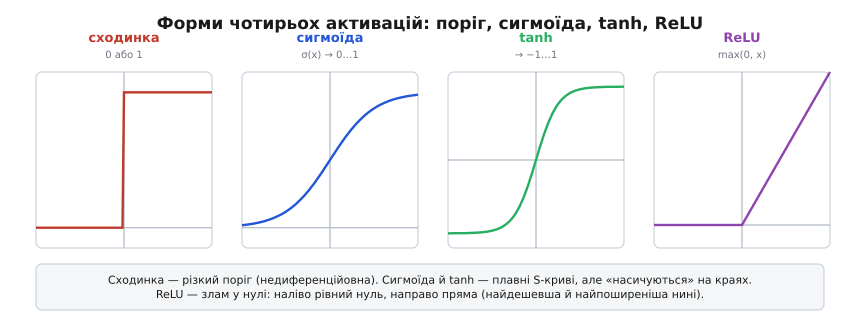
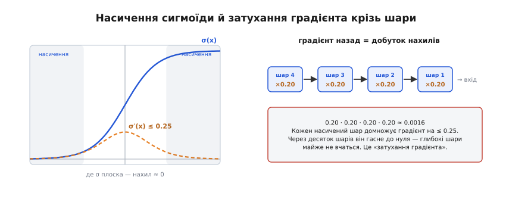
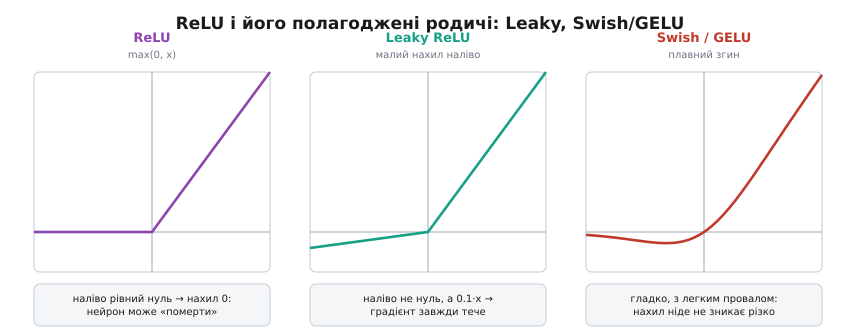

# Функції активації: згин, що оживляє мережу

Усередині [штучного нейрона](topic:sf-ml/neuron-layer) є одна дія, повз яку легко проскочити як повз дрібницю, — **активація** (від лат. *activus* — дієвий): функція, крізь яку пропускають зважену суму, перш ніж передати її далі. Вона мала, часто в один рядок коду. І все ж без неї вся багатоповерхова споруда з мільйонів ваг **безсила** — не здатна навчитися нічого складнішого за пряму лінію. Розберімо, **чому** так, чим одна активація краща за іншу, і чому саме вибір цієї функції свого часу вирішив, злетить глибоке навчання чи ні.

### Чому без згину мережа — це одна пряма

Почнімо з болючого факту, який робить активацію не прикрасою, а необхідністю. Зважена сума — `w₁·x₁ + w₂·x₂ + … + b` — це **лінійна** операція: множення на числа й додавання. А тепер ключове спостереження: **склади дві лінійні операції — дістанеш знову лінійну**. Пропусти вхід крізь один шар без активації, тоді крізь другий, третій — і хоч скільки шарів наклади, весь стос згортається в **одну** зважену суму. Десять шарів, сто шарів — математично це те саме, що **один** нейрон.

```text
шар 2( шар 1(x) ) = A₂·(A₁·x + b₁) + b₂
                  = (A₂·A₁)·x + (A₂·b₁ + b₂)
                  =    A·x    +      b          ← знову проста пряма
```

Тобто вся «глибина» без активації **безслідно зникає**: множення матриць складаються в одну матрицю. А прямою не розділиш навіть найпростішого нелінійного візерунка. Класичний приклад — **XOR** (виключне «або»): чотири точки, де правильні відповіді лежать «по діагоналі» (0,0 і 1,1 — один клас; 0,1 і 1,0 — інший). Жодна одна пряма не розітне площину так, щоб два «свої» кути опинилися по один бік, а два чужі — по інший. Спробуй провести будь-яку лінію — завжди помилишся хоча б в одній точці.

**Активація ламає цю приреченість.** Варто вставити між шарами бодай найпростіший **згин** — і добуток перестає бути лінійним, шари вже не складаються в один, а мережа дістає змогу вигнути межу як завгодно: обійти діагональ, окреслити острівець, накреслити хвилю. Ось із чого росте вся міць глибоких мереж — не з арифметики самих сум (вона лінійна й слабка), а саме з **нелінійного згину** між ними. Активація — те місце, де в мережу входить сила.

> 🔧 **Навіщо це.** Коли чиясь (чи твоя) мережа «нічого не вчиться» попри купу шарів — перше, що варто перевірити: чи є між ними активація. Забув її поставити (або поставив лінійну на прихованих шарах) — і вся глибина марна, модель поводиться як одненький нейрон, скільки її не тренуй. Це найтихіша й найпідступніша помилка: код працює, мережа велика, а межа виходить лише пряма.

### Сходинка: чесна, але сліпа для навчання

Найприродніша перша ідея — зробити активацію схожою на **живий нейрон**: він або мовчить, або «спалахує». Це **сходинка** (порогова функція): якщо сума менша за нуль — видай 0, інакше — 1. Різкий вимикач.

Логічно й красиво — саме такий нейрон-вмикач і був у першому [перцептроні](topic:sf-ml/neuron-layer). Але тут ховається пастка, через яку сходинка сьогодні майже не вживається у навчанні. [Навчання мережі](topic:sf-ml/gradient-descent) — це скочування з гори похибки: у кожній точці ми міряємо **нахил** (наскільки зміниться похибка, якщо трохи посунути вагу) і робимо крок туди, де нижче. А який нахил у сходинки? Ліворуч від порога вона рівна (нахил 0), праворуч рівна (нахил 0), а рівно на порозі — стрибок, де нахилу взагалі немає (нескінченний).

```text
нахил сходинки:
   x < 0 :  0     ← крок нічого не змінює
   x > 0 :  0     ← крок нічого не змінює
   x = 0 :  ∞     ← стрибок, похідної немає
```

Виходить глухий кут: **градієнт скрізь нульовий**, тож спуск не знає, куди ступати. Трохи посунеш вагу — вихід нейрона **не ворухнеться** (він так само 0 або так само 1), похибка не зміниться, сигналу «стало краще/гірше» немає. Навчання глухне. Сходинка чесно копіює «спалах» біологічного нейрона, але саме своєю різкістю **осліплює** градієнтний спуск. Звідси висновок, що визначив усі подальші активації: нам потрібен **плавний** згин — такий, у якого нахил не нуль, щоб було за що «вхопитися» й котитися вниз.

### Сигмоїда й tanh: плавні пороги — і їхня вада

Плавною заміною сходинки стала **сигмоїда** (гр. *sigmoeidḗs* — подібна до літери «сигма» Σ, за формою кривої), її ще звуть **логістичною** функцією. Вона робить те саме, що сходинка, — тисне вхід у діапазон від 0 до 1, — але **м'яко**: дуже від'ємне дає майже 0, дуже додатне — майже 1, а посередині плавно переходить.

```text
σ(x) = 1 / (1 + e⁻ˣ)

σ(−4) ≈ 0.02      майже «вимкнено»
σ( 0) =  0.5      посередині
σ(+4) ≈ 0.98      майже «ввімкнено»
```

Тепер нахил є всюди, і спуск має за що взятися. Близька родичка — **гіперболічний тангенс** (tanh): та сама S-подібна крива, але тисне у діапазон від −1 до 1, симетрично навколо нуля. Ця симетрія — перевага для прихованих шарів: середнє значення виходів тримається біля нуля, і наступному шару легше вчитися, ніж коли всі входи додатні (як у сигмоїди).


*Форми чотирьох активацій. **Сходинка** — різкий поріг: чесний «спалах», але нахил скрізь нуль, тож для навчання сліпа. **Сигмоїда** — плавно тисне у 0…1; **tanh** — плавно у −1…1 (симетрична навколо нуля). **ReLU** — злам у нулі: наліво рівний нуль, направо пряма. Плавні криві дають нахил, за який чіпляється градієнтний спуск; ReLU дає його майже дурно-дешево.*

Довгі роки сигмоїда й tanh були стандартом. Та коли мережі стали **глибокими** (багато шарів), виявилася їхня прихована вада, через яку глибоке навчання буксувало. Придивися до країв S-кривої: там вона майже **плоска** — «насичена». А плоско означає **нахил ≈ 0**. У сигмоїди нахил не перевищує 0.25 навіть у найкрутішому місці, а по краях спадає до крихт.


*Насичення й затухання. Ліворуч — сигмоїда (суцільна) та її **нахил** (пунктир): дзвін із максимумом лише 0.25, що по краях тисне до нуля. Праворуч — чому це біда для глибини: [навчання](topic:sf-ml/gradient-descent) пускає градієнт **назад** крізь шари, домножуючи його на нахил кожного. Кілька насичених шарів — і добуток дрібних чисел (0.2·0.2·0.2·0.2 ≈ 0.0016) гасне майже до нуля: перші шари майже не дістають сигналу й не вчаться.*

Ось у чому суть біди. [Навчання](topic:sf-ml/gradient-descent) несе градієнт **назад** крізь усі шари, і на кожному домножує його на місцевий нахил активації. Якщо нахили дрібні (0.2, 0.1, …), то добуток десятка таких множників — це число, близьке до нуля. Градієнт, що дійшов до **перших** шарів, гасне до крихти — і вони фактично **перестають учитися**. Це і є славнозвісний [**затухаючий градієнт**](topic:sf-ml/vanishing-gradient) — головна причина, чому глибокі мережі на сигмоїдах роками не піддавалися. Плавність, яку ми так хотіли, обернулася новою хворобою: на краях крива **надто** плавна.

### ReLU: злам, що оживив глибину

Розв'язок виявився майже зухвало простим — і саме він розчистив дорогу сучасному глибокому навчанню. **ReLU** (англ. *rectified linear unit* — випрямлений лінійний вузол) — це просто:

```text
ReLU(x) = max(0, x)

  x < 0 :  0     ← відсікаємо
  x ≥ 0 :  x     ← пускаємо як є
```

Від'ємне — в нуль, додатне — наскрізь без змін. І все. Жодних експонент, жодного ділення. У коді прошивки це буквально один рядок:

:::tabs
```c
// ReLU: від'ємне обнуляємо, решту лишаємо
static inline float relu(float x) {
    return x > 0.0f ? x : 0.0f;
}
```
```python
# ReLU: від'ємне обнуляємо, решту лишаємо
def relu(x):
    return max(0.0, x)
```
:::

Чим ця дрібничка перемогла елегантні S-криві? Двома речами, і обидві важать. **Перша — нахил.** Для всіх додатних входів нахил ReLU дорівнює рівно **1** — не 0.25, не крихта, а одиниця. Тож коли градієнт іде назад крізь активні нейрони, він домножується на 1 і **не гасне**: множник 1·1·1·… лишається одиницею скільки завгодно шарів. Хвороба затухання, що душила сигмоїдні мережі, майже зникає — і аж тоді глибокі мережі почали справді навчатися. **Друга — дешевина.** Порівняння з нулем — це чи не найшвидша операція процесора; сигмоїда ж потребує обчислити `e⁻ˣ`, що в десятки разів дорожче. На мільярдах активацій за прохід це різниця між «тренується день» і «тренується тиждень» — а на [маломічному апараті](topic:sf-ml/tinyml), де кожен такт на рахунку, ще й вирішує, чи влізе мережа в бюджет узагалі.

Є в ReLU і зворотний бік, про який варто знати. Гляньмо на її ліву половину: там вихід **рівно нуль**, і нахил теж **нуль**. Якщо нейрон через невдалі ваги весь час дістає від'ємну суму, він завжди видає 0, градієнт крізь нього нульовий — і він **не може виправитися**. Такий нейрон «помер»: назавжди мовчить і не вчиться. Це явище так і звуть — **мертвий (умираючий) ReLU** (*dying ReLU*). Зазвичай воно не критичне (мертвих нейронів лишається меншість), та якщо їх стає забагато — частина мережі просто вимикається з роботи.

### Родина ReLU: як лагодять мертві нейрони

Мертвий нейрон народжується з плоского нуля наліво. Природний ремонт — **не робити** ту половину зовсім плоскою. Так з'явилася **Leaky ReLU** (англ. *leaky* — з протіканням): наліво не рівний нуль, а маленький нахил (скажімо, 0.01·x). Провалу «в нуль назавжди» більше немає — крізь нейрон завжди тече хоч тонкий струмок градієнта, тож він **завжди може ожити**.

:::tabs
```c
// Leaky ReLU: наліво не нуль, а слабкий нахил — нейрон не «вмирає»
static inline float leaky_relu(float x) {
    return x > 0.0f ? x : 0.01f * x;
}
```
```python
# Leaky ReLU: наліво не нуль, а слабкий нахил — нейрон не «вмирає»
def leaky_relu(x):
    return x if x > 0.0 else 0.01 * x
```
:::

Пішли й далі — до **плавних** родичів, у яких злам згладжений у м'яку криву. Найвідоміші — **GELU** (англ. *Gaussian error linear unit*) і **Swish** (він же **SiLU**, від *sigmoid linear unit*): `x·σ(x)` — вхід, помножений на власну сигмоїду. Вони поводяться майже як ReLU для великих значень, але біля нуля мають гладкий вигин із легким «провалом» у від'ємне: нахил ніде не зникає різко, і навчання йде трохи стабільніше. Саме тому в багатьох сучасних великих мережах стоїть не гола ReLU, а GELU чи Swish.


*ReLU і полагоджені родичі. **ReLU** — наліво рівний нуль (нахил 0): нейрон, що весь час від'ємний, «вмирає». **Leaky ReLU** — наліво не нуль, а слабкий нахил (0.1·x тут для наочності): градієнт тече завжди, нейрон не гине. **Swish/GELU** — гладкий згин із легким провалом: жодного різкого зникання нахилу, тому в глибоких мережах вони часто дають дещо кращий і стабільніший результат.*

Правда життя: попри всі ці покращення, **звичайна ReLU** й досі — типовий вибір за замовчуванням для прихованих шарів. Вона проста, швидка, майже завжди «просто працює», а виграш плавних варіантів помітний переважно на дуже великих мережах. Тож на маленьку модель для апарата бери ReLU без вагань; про Leaky чи Swish згадуй, коли вперся в мертві нейрони або ганяєшся за останніми частками точності.

### Softmax: інша робота — на самому виході

Досі йшлося про активації **прихованих** шарів — там задача одна: внести згин. Але на **виході** мережі, коли вона обирає **один клас із кількох** (кіт / собака / птах), потрібне зовсім інше: перетворити сирі числа-оцінки на **ймовірності**, що додаються в одиницю. Цю роботу робить **softmax** (англ. *soft max* — «м'який максимум»): він піднімає кожну оцінку в експоненту (тим підкреслюючи більшу) і ділить на суму всіх, щоб на виході вийшов чесний розподіл — набір додатних чисел, що в сумі дають 1. Це не «згин заради нелінійності», а **зчитувач відповіді**: три числа на кшталт `(2.0, 1.0, 0.1)` він перетворює на щось як `(0.66, 0.24, 0.10)` — «модель на 66% упевнена, що це перший клас». Механіку самого перетворення — експоненти, нормування й зв'язок із правильною [функцією втрат](topic:sf-ml/gradient-descent) — розбирає [окрема вставка](topic:sf-ml/activation-functions/math-softmax.md).

> 🔧 **Навіщо це.** Проста пам'ятка, яку варто тримати під рукою. **Приховані шари** — став **ReLU** (майже завжди правильно, швидко, дешево); уперся в мертві нейрони чи хочеш ще трохи точності — **Leaky ReLU** або **Swish/GELU**. **Сигмоїду** тримай лише для виходу, коли відповідь одна й бінарна («так/ні», ймовірність однієї події), — але **не** на прихованих шарах глибокої мережі, бо [затухаючий градієнт](topic:sf-ml/vanishing-gradient) її задушить. **Вибір одного класу з багатьох** на виході — **softmax**. І золоте правило зневадження: якщо глибока мережа не вчиться, підозрюй активацію — чи стоїть вона взагалі, чи не сигмоїда на всіх шарах, чи не повмирали нейрони.

### Підсумок теми

Активація — це **згин**, що пропускає крізь себе зважену суму нейрона, і саме він вносить у мережу **нелінійність**. Без нього будь-яка глибина марна: лінійні шари складаються в одну пряму, а прямою не взяти навіть XOR. **Сходинка** чесно копіює «спалах» живого нейрона, та її нульовий скрізь нахил **осліплює** [градієнтний спуск](topic:sf-ml/gradient-descent), тож для навчання вона непридатна. **Сигмоїда** й **tanh** дали плавний нахил, але на краях **насичуються** (нахил → 0), і в глибоких мережах їхній добуток дрібних множників спричиняє [**затухаючий градієнт**](topic:sf-ml/vanishing-gradient) — перші шари перестають учитися. **ReLU** (`max(0, x)`) розв'язала це майже зухвало просто: нахил 1 для додатних (градієнт не гасне) плюс копійчана дешевина обчислення — саме вона зробила глибоке навчання практичним. Її вада — **мертві нейрони** (плоский нуль наліво), яку лікують **Leaky ReLU** (слабкий нахил наліво) і плавні **GELU/Swish**. А на самому виході окрему роль грає **softmax** — він обертає оцінки на ймовірності класів. У підсумку правило коротке: у приховані шари — ReLU; на бінарний вихід — сигмоїда; на вибір класу — softmax. І [цей маленький вибір функції](topic:sf-ml/activation-functions/hist-relu-triumph.md) свого часу вирішив долю всього глибокого навчання.
