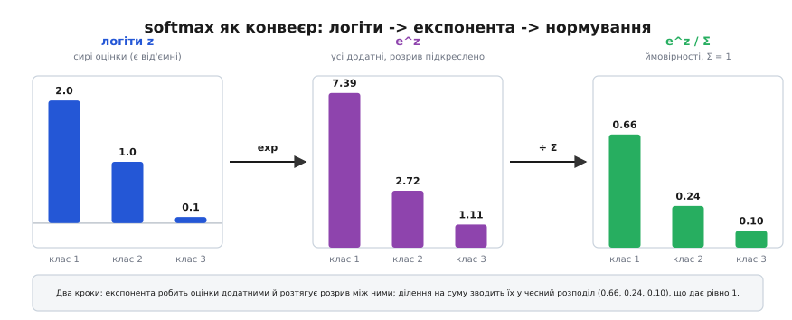
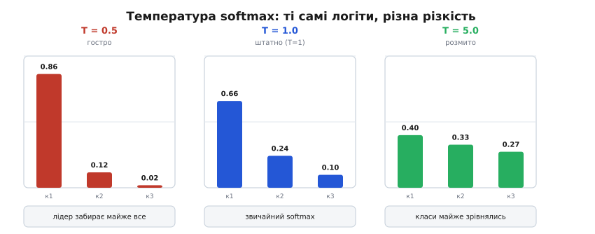

# 🧮 Математика softmax: як мережа зчитує ймовірності класів

Наприкінці мережа-класифікатор має **вирішити**: кіт, собака чи птах? Але сирі числа, що виходять з останнього шару, — не ймовірності. Це просто **логіти** (англ. *logits*) — довільні дійсні оцінки на кшталт `(2.0, 1.0, 0.1)` або навіть `(−3.7, 8.2, 0.4)`: додатні й від'ємні, ні до чого не прив'язані, у сумі дають казна-що. Щоб сказати «модель на 66% упевнена, що це перший клас», ці оцінки треба чесно перетворити на **розподіл імовірностей** — набір чисел, кожне в проміжку [0, 1], усі разом рівно 1. Саме цю роботу робить **softmax**. Розберімо не «яка формула», а **чому саме така**: чому експонента, чому ділення на суму, звідки береться «м'якість», як softmax дружить із функцією втрат так, що градієнт виходить майже чарівно простим, і чому наївна реалізація «в лоб» переповнює число з рухомою комою — а правильна ні.

Одразу відмежуймо роль. Активації **прихованих** шарів (ReLU, сигмоїда, tanh) роблять одне — вносять **згин**, нелінійність, без якої глибина мережі марна. softmax на **виході** робить зовсім інше: він **нічого не згинає заради нелінійності** — він **зчитує відповідь**, перекладаючи оцінки з мови «більше-менше» на мову «наскільки ймовірно». Це не проміжна ланка обчислення, а фінальний **інтерпретатор**. Тому й вимоги до нього інші: не «щоб градієнт не гаснув», а «щоб на виході був чесний розподіл».

## Що саме має вийти — і чому наївні спроби провалюються

Сформулюймо задачу як список вимог до перетворення `f`, що бере вектор логітів `z = (z₁, …, z_K)` і повертає вектор `p = (p₁, …, p_K)`:

1. **Усі pᵢ ≥ 0** — від'ємної ймовірності не буває.
2. **Σ pᵢ = 1** — це має бути повний розподіл: щось із класів мережа таки вибере.
3. **Порядок збережено** — більший логіт → більша ймовірність (найбільша оцінка лишається найімовірнішим класом).
4. **Гладкість** — `f` диференційовна, щоб крізь неї міг пройти [градієнт навчання](topic:sf-ml/gradient-descent).

Спробуймо очевидні відповіді й подивімося, де кожна ламається — так стане ясно, чому потрібна саме експонента.

**Спроба перша — просто поділити на суму.** `pᵢ = zᵢ / Σzⱼ`. Здавалося б, нормування як нормування. Але логіти бувають **від'ємні**: якщо `z = (2, −5, 3)`, сума дорівнює 0 — ділення на нуль. А якби сума була додатна, від'ємний логіт дав би **від'ємну** «ймовірність». Вимога 1 розбита вщент. Ділення на суму працює лише для невід'ємних чисел, а логіти такими не є.

**Спроба друга — зсунути все у плюс, тоді поділити.** Додамо до кожного логіта якесь велике число, щоб усі стали додатні, і поділимо на суму. Тепер вимоги 1 і 2 виконані. Та є прихована біда: результат **залежить від того, наскільки саме ми зсунули**. Зсув на +10 і зсув на +1000 дадуть **різні** розподіли з тих самих логітів — а це безглуздя: відповідь мережі не має залежати від довільної добавки, яку ми самі й придумали. Крихка, свавільна конструкція.

**Спроба третя — піднести в квадрат, тоді поділити.** `pᵢ = zᵢ² / Σzⱼ²`. Квадрат прибирає знак (вимога 1 ✓), нормування дає суму 1 (✓). Але квадрат **губить порядок**: `(−5)² = 25 > 2² = 4`, тож логіт −5 дістав би **більшу** ймовірність, ніж логіт +2. Вимога 3 розбита: клас, який мережа оцінила найнижче, раптом став найімовірнішим. Нікуди не годиться.

Що ж нам справді потрібно? Функція, яка (а) будь-яке дійсне число — і від'ємне, і додатне — переводить у **строго додатне**, і (б) при цьому **не перевертає порядок**: більший вхід → більший вихід, завжди. Це портрет **зростаючої додатної функції**. Найприродніша, найгладкіша така функція в усій математиці — **експонента** `e^z`.

## Чому саме експонента — три причини, а не одна

Експонента `e^z` — не випадковий вибір і не «бо так вийшло історично». Вона задовольняє наші вимоги не абияк, а майже ідеально, і має три властивості, кожна з яких по-своєму важлива.

**Причина перша: e^z завжди строго додатна.** Хоч який z — величезний від'ємний, нуль, величезний додатний — результат `e^z` більший за нуль. `e⁻⁵ ≈ 0.0067` (крихітне, але додатне), `e⁰ = 1`, `e³ ≈ 20`. Проблема від'ємних логітів, на якій розбилися перші дві спроби, зникає сама собою: після експоненти від'ємних чисел уже немає, ділити на суму **безпечно завжди**. Вимоги 1 і 2 виконуються одним махом.

**Причина друга: e^z строго зростає.** Більший вхід → більший вихід, без винятків. Тож найбільший логіт неминуче дає найбільший `e^z`, а отже й найбільшу ймовірність. Порядок збережено ідеально — вимога 3, на якій розбився квадрат, тут виконана автоматично.

**Причина третя — найтонша: експонента перетворює додавання на множення, і саме тому зсув логітів нічого не змінює.** Згадай спробу два — там результат залежав від довільного зсуву. З експонентою цієї біди немає, і ось чому. Ключова властивість: `e^(a+b) = e^a · e^b`. Додай до **всіх** логітів одне й те саме число `c`:

```text
softmax(zᵢ + c) = e^(zᵢ+c) / Σⱼ e^(zⱼ+c)
                = (e^zᵢ · e^c) / (Σⱼ e^zⱼ · e^c)
                = e^c · e^zᵢ / ( e^c · Σⱼ e^zⱼ )
                = e^zᵢ / Σⱼ e^zⱼ          ← множник e^c скоротився!
```

Спільний множник `e^c` вискакує з чисельника й знаменника й **скорочується без сліду**. Тобто softmax **байдужий до спільного зсуву логітів**: `softmax(z) = softmax(z + c)` для будь-якого `c`. Ця властивість зветься **інваріантністю до зсуву** (англ. *shift invariance*), і вона не дрібниця з двох боків. По-перше, вона **правильна змістовно**: імовірності класів мають залежати лише від **різниць** логітів (наскільки одна оцінка більша за іншу), а не від їхнього спільного рівня — додав до всіх однаково, розстановка сил не змінилася. По-друге, саме ця інваріантність за мить подарує нам безкоштовний трюк чисельної стабільності. Жодна з наших наївних спроб цього не вміла.

Зібравши три причини разом, дістаємо softmax:

```text
              e^zᵢ
softmax(zᵢ) = ─────────        i = 1 … K
              Σⱼ e^zⱼ
```

У чисельнику — експонента цього логіта; у знаменнику — **сума** експонент усіх логітів (та сама для всіх виходів, вона й нормує). Ділення на суму гарантує `Σ pᵢ = 1`; додатність експоненти гарантує `pᵢ > 0`; зростання експоненти зберігає порядок. Усі чотири вимоги виконані — і не натягнуто, а природно.

🧮 **Worked-приклад: логіти (2.0, 1.0, 0.1) → ймовірності.**

```text
Крок 1 — експонента кожного логіта:
  e^2.0 ≈ 7.389
  e^1.0 ≈ 2.718
  e^0.1 ≈ 1.105

Крок 2 — сума (це й буде знаменник):
  Σ = 7.389 + 2.718 + 1.105 = 11.212

Крок 3 — поділити кожну експоненту на суму:
  p₁ = 7.389 / 11.212 ≈ 0.659
  p₂ = 2.718 / 11.212 ≈ 0.242
  p₃ = 1.105 / 11.212 ≈ 0.099

Перевірка: 0.659 + 0.242 + 0.099 = 1.000  ✓
```

Три сирі оцінки `(2.0, 1.0, 0.1)` стали чесним розподілом `(0.66, 0.24, 0.10)`: «модель на ~66% упевнена в першому класі, на ~24% у другому, решта — третьому». Зверни увагу на дрібницю з великими наслідками: різниця логітів між першим і другим була всього **1.0**, а різниця ймовірностей вийшла солідна — 0.66 проти 0.24, майже втричі. Це не випадковість, а прямий наслідок експоненти: вона **розтягує** розриви. Про це — далі.


*Два кроки softmax наочно. Ліворуч — сирі **логіти**: різнознакові, ні до чого не прив'язані. Посередині — після **експоненти**: усі стали додатні, а розрив між найбільшим і рештою підкреслився. Праворуч — після **нормування** (ділення на суму): три стовпчики-ймовірності, що разом дають рівно 1. softmax — це не «згин», а перекладач з мови оцінок на мову ймовірностей.*

## «М'який максимум»: звідки м'якість і що таке температура

Назва *soft max* — «м'який максимум» — натякає на зв'язок зі звичайним максимумом, і цей натяк варто розібрати точно, бо в ньому й криється суть поведінки softmax. Уяви **жорсткий** вибір — argmax: він дивиться на логіти й віддає **всю** ймовірність (1.0) тому класу, що має найбільшу оцінку, а решті — рівно 0. Різкий, безжальний переможець забирає все. Але argmax має дві біди для навчання: він **розривний** (крихітна зміна логітів може миттю перекинути всю одиницю з одного класу на інший) і його **похідна майже скрізь нуль** — точнісінько та сама сліпота, через яку різка порогова сходинка (де нахил або нуль, або нескінченний) непридатна для навчання. Крізь argmax градієнт не пройде.

softmax — **згладжена** версія цього вибору. Замість віддати всі 1.0 переможцеві, він **розподіляє** ймовірність: левову частку — найбільшому логіту, але й іншим лишається дещиця, тим більша, чим ближчі їхні оцінки до максимуму. Що сильніше відірвався лідер — то ближчий softmax до жорсткого argmax; що тісніше збилися логіти — то рівномірніше він ділить. Ця «м'якість» і робить його диференційовним: невелика зміна логіта **плавно** переливає трохи ймовірності між класами, а не перекидає її стрибком. Є за що вхопитися градієнту.

> 🔧 **Навіщо це.** Точність задля чесності: технічно softmax — гладке наближення не так максимуму (тобто **значення** найбільшого логіта), як **argmax** — того, **де** максимум, у вигляді розподілу «наскільки кожен клас схожий на переможця». Гладким наближенням самого значення максимуму `max(z₁, …, z_K)` є інша, споріднена функція — **log-sum-exp** `ln Σ e^zⱼ` (та сама сума, що стоїть у знаменнику softmax, тільки під логарифмом). Плутати їх не варто, і ця ж log-sum-exp за мить дасть нам стабільність. У щоденній мові ML «softmax = м'який максимум» усе одно кажуть — просто пам'ятай, що строго це «м'який argmax».

Наскільки різким чи розмитим буде вибір, можна **регулювати** — параметром **температури** `T` (термін прийшов зі статистичної фізики, де точно така формула описує заселеність станів — про це нижче). Логіти перед експонентою ділять на `T`:

```
              e^(zᵢ / T)
softmax(zᵢ) = ────────────
              Σⱼ e^(zⱼ / T)
```

Температура крутить «різкість» розподілу, і механізм тут прозорий — річ у тім, що ділення на `T` стискає або розтягує **різниці** логітів, а саме різниці й вирішують усе:

- **Низька `T`** (наприклад 0.5) — логіти діляться на мале число, тобто їхні різниці **множаться**, розриви ростуть. Розподіл стає **гострішим**, майже як argmax: переможець забирає майже все. У границі `T → 0` — це чистий жорсткий argmax.
- **`T = 1`** — звичайний softmax, як у формулі вище.
- **Висока `T`** (наприклад 5) — різниці логітів **тиснуться** до нуля, класи зрівнюються. Розподіл стає **пласкішим**, ближчим до рівномірного «нічого не знаю, всі однакові». У границі `T → ∞` — рівний розподіл 1/K на кожен клас.

🧮 **Worked-приклад: ті самі логіти (2.0, 1.0, 0.1) за трьох температур.**

```text
T = 0.5 (гостро):  ділимо логіти на 0.5 → (4.0, 2.0, 0.2)
  експоненти: 54.60, 7.389, 1.221 ;  Σ = 63.21
  p ≈ (0.864, 0.117, 0.019)     ← лідер забрав ~86%

T = 1.0 (звичайно):
  p ≈ (0.659, 0.242, 0.099)     ← знайомий розподіл

T = 5.0 (розмито):  ділимо логіти на 5 → (0.4, 0.2, 0.02)
  експоненти: 1.492, 1.221, 1.020 ;  Σ = 3.733
  p ≈ (0.400, 0.327, 0.273)     ← майже зрівнялися
```

Ті самі логіти, а «впевненість» — від майже категоричної (86%) до майже байдужої (40/33/27). Ось **навіщо** температуру крутять на практиці. При `T = 1` (навчання) усе штатно. Високу `T` беруть, коли хочуть м'якших, обережніших імовірностей — наприклад, у [дистиляції знань](topic:sf-ml/knowledge-distillation), де маленька мережа вчиться не на жорстких «правильний клас — 1, решта — 0», а на **м'яких** ймовірностях великої мережі-вчителя: підняли `T`, і вчитель видає не «це точно кіт», а «здебільшого кіт, трохи схоже на рись, геть не схоже на літак» — і ця тонка структура схожостей несе учневі куди більше, ніж голе гостре рішення. Низьку `T` (аж до argmax) беруть на **виводі**, коли треба вже категоричну відповідь без вагань.


*Температура крутить різкість. Ті самі три логіти дають різні розподіли: **низька T** загострює до майже-argmax (переможець забирає майже все), **T=1** — штатний softmax, **висока T** розмиває до майже рівномірного. Температура стискає або розтягує різниці логітів, а від різниць і залежить уся впевненість.*

## Пара softmax + крос-ентропія: чому градієнт виходить майже чарівним

Найглибша причина, чому softmax став **стандартним** виходом класифікатора, — не сама формула, а те, як бездоганно вона поєднується зі **своєю** функцією втрат. Мережу треба навчати, а навчання — це [градієнтний спуск](topic:sf-ml/gradient-descent): порахувати, наскільки похибка зміниться від зсуву кожного числа, і ступити туди, де похибка менша. Тож усе залежить від того, який градієнт дає зв'язка «активація виходу + [функція втрат](topic:sf-ml/loss-functions)». І тут softmax у парі з правильною втратою творить майже диво: увесь громіздкий вивід згортається в одну коротку різницю.

Правильна втрата для softmax — **крос-ентропія** (англ. *cross-entropy*), і вона теж не з повітря взята. Правильну відповідь для одного прикладу кодують вектором `t` у форматі **one-hot**: одиниця стоїть на правильному класі, нулі — на решті (для «це кіт» із трьох класів — `t = (1, 0, 0)`). Крос-ентропійна втрата така:

```
L = − Σᵢ tᵢ · ln(pᵢ)
```

Розшифруймо її змістовно, бо формула коротка, а сенс глибокий. Оскільки `t` — one-hot, у сумі виживає **лише один** доданок — той, де `tᵢ = 1`, тобто правильний клас `c`. Уся втрата зводиться до `L = −ln(p_c)` — **мінус логарифм імовірності, яку модель дала правильному класу**. Подивись, як це карає: якщо модель упевнена й має рацію (`p_c` близьке до 1), то `ln(1) = 0` — втрата майже нульова, докоряти нема за що. Якщо ж модель дала правильному класу мізерну ймовірність (`p_c → 0`), то `−ln(p_c) → +∞` — втрата **вибухає**. Крос-ентропія люто карає **впевнену помилку** й ласкава до впевненої правоти. Саме така форма покарання нам і потрібна.

А тепер — головне диво. Порахуймо градієнт цієї втрати по **логітах** `zᵢ` (це те, що зрештою треба [зворотному поширенню](topic:sf-ml/backpropagation): як штовхати самі логіти). Формально треба продертися крізь два шари — похідну `L` по `pᵢ`, тоді похідну softmax `pᵢ` по `zⱼ` (а вона розпадається на два випадки, `i = j` та `i ≠ j`, бо знаменник softmax залежить від **усіх** логітів одразу). Викладку опускаю — вона є в будь-якому підручнику; важливий **результат**, і він приголомшливо простий:

```text
∂L
──── = pᵢ − tᵢ
∂zᵢ
```

**Градієнт по логіту — це просто «передбачена ймовірність мінус правильна відповідь».** Уся крос-ентропія, увесь softmax із його експонентами, сумами й двовипадковою похідною — усе скоротилося, лишивши голу різницю `pᵢ − tᵢ`. Ось чому це дивовижа й ось що вона означає:

- Для **правильного** класу (`tᵢ = 1`) градієнт = `pᵢ − 1`. Якщо модель дала йому `p = 0.66`, градієнт `−0.34` — «підніми цей логіт». Що менша впевненість, то дужчий поштовх угору.
- Для **хибних** класів (`tᵢ = 0`) градієнт = `pᵢ`. Тобто «опусти цей логіт рівно на стільки, скільки ймовірності на нього помилково пішло». Дав хибному класу 0.24 — маєш штовхнути його вниз із силою 0.24.
- Якщо модель уже ідеальна (`p = t`), градієнт **нуль** — нічого не міняємо. Рівно те, що треба.

Це не збіг і не подарунок долі. softmax і крос-ентропію **добирали одне до одного** саме так, щоб їхня зв'язка дала цю чисту різницю. Причина глибша, ніж «зручно рахувати»: експонента в softmax і логарифм у крос-ентропії — **навзаєм обернені**, `ln` розкриває `e`, і громіздка машинерія взаємно гаситься. Практичний виграш величезний: замість дертися крізь повну похідну softmax на кожному кроці навчання (а це мільярди кроків), [зворотне поширення](topic:sf-ml/backpropagation) на виході робить буквально одне віднімання `p − t`. Швидко, стійко, без зайвих чисельних викрутасів — і це одна з опор, на яких тримається практичність усього глибокого навчання.

> 🔧 **Навіщо це.** Тому в бібліотеках softmax і крос-ентропію майже завжди **склеюють в одну операцію** (у різних фреймворках вона зветься `softmax_cross_entropy_with_logits`, `CrossEntropyLoss` тощо), яка бере **сирі логіти**, а не готові ймовірності. Причин дві. По-перше, склеєна операція одразу видає простий градієнт `p − t`, не рахуючи повну похідну softmax окремо. По-друге — і це критично на борту — усередині вона застосовує стабільний **log-sum-exp** (нижче) і ніде не обчислює голий `ln(pᵢ)`, а отже уникає `ln(0) = −∞`, коли якась ймовірність через округлення стала точним нулем. Практичне правило: на **навчанні** віддавай у функцію втрат **логіти**, а не пропущені крізь softmax числа; окремий softmax клич лише на **виводі**, коли справді потрібні самі ймовірності напоказ.

## Чисельна стабільність: чому «в лоб» переповнює float — і як лагодить log-sum-exp

Формула softmax чиста на папері, але буквальний код `exp(z) / sum(exp(z))` на реальному [числі з рухомою комою](topic:math-numeric/float-formats) підриває себе на великих логітах. Причина — в експоненті, яка росте **шалено** швидко. Тип `float` (32 біти, IEEE 754) тримає числа приблизно до `3.4 · 10³⁸`. А `e^z` пробиває цю стелю вже коло `z ≈ 88.7`:

```
e^88  ≈ 1.65 · 10³⁸    ще влазить у float
e^89  ≈ 4.49 · 10³⁸    вже НЕ влазить → +inf (переповнення)
```

Логіти в реальних мережах цілком дотягуються до таких значень (особливо в глибоких моделях чи на впевнених прикладах). Щойно бодай один `e^z` перетворюється на `inf`, усе валиться: `inf / inf` дає **NaN** (не-число), і воно тут же розповзається по всій мережі, отруюючи навчання — раптові `NaN` у втраті посеред тренування дуже часто ростуть саме звідси. Це не теоретичний страх, а буденна пастка.

Рятує та сама **інваріантність до зсуву**, яку ми довели вище: `softmax(z) = softmax(z − c)` для будь-якого `c`. Ми **вільні** відняти від усіх логітів що завгодно — розподіл не зміниться. То віднімемо найрозумніше: **максимум** `m = max(z₁, …, z_K)`. Після цього найбільший зсунутий логіт стає рівно 0, а всі інші — від'ємні:

```
              e^(zᵢ − m)
softmax(zᵢ) = ────────────          де m = max(z₁, …, z_K)
              Σⱼ e^(zⱼ − m)
```

Тепер жоден показник експоненти не додатний, тож **кожен `e^(zⱼ − m)` лежить у (0, 1]**: найбільший дорівнює рівно `e⁰ = 1`, решта менші. Переповнення стало **неможливим** — ми ніколи не підносимо `e` до великого додатного степеня. А що з протилежним боком, недоповненням (*underflow*), коли дуже від'ємний показник дає `e^(...) ≈ 0`? Воно теж не шкодить: знаменник **гарантовано** містить хоча б одну одиницю (від максимуму), тож ділення на нуль виключене, а окремі доданки, що округлились у нуль, лише означають «цей клас нехтовно ймовірний» — саме те, що й мало вийти. Цей прийом — відняти максимум перед експонентою — зветься **log-sum-exp** (за стабільним способом рахувати `ln Σ e^zⱼ`) і є в кожній серйозній бібліотеці. Коштує він один зайвий прохід по вектору (знайти max) — копійки проти надійності.

🧮 **Worked-приклад: чому зсув рятує на великих логітах.**

```text
Логіти z = (1000, 1001, 1002) — цілком реальні у глибокій мережі.

Наївно, «в лоб»:
  e^1000, e^1001, e^1002  — усі ТРИ дають +inf у float
  inf / (inf + inf + inf) = inf / inf = NaN     ← мережа отруєна

Стабільно, віднявши m = 1002:
  зсунуті логіти: (1000−1002, 1001−1002, 1002−1002) = (−2, −1, 0)
  e^(−2) ≈ 0.135 ,  e^(−1) ≈ 0.368 ,  e^0 = 1.000
  Σ = 0.135 + 0.368 + 1.000 = 1.503
  p ≈ (0.090, 0.245, 0.665)     ← коректно, жодного inf чи NaN
```

Гляньмо на відповідь: `(0.09, 0.245, 0.665)` — точнісінько той самий розподіл, що дали б логіти `(−2, −1, 0)` чи `(0, 1, 2)`. Так і має бути: важать лише **різниці** логітів, а вони при зсуві на 1002 не змінилися ні на йоту. Наївний код видав отруйний NaN там, де стабільний спокійно повернув правильні ймовірності — і коштувала ця стійкість одного віднімання максимуму.

## Реалізація на C: коректний і стабільний softmax

Зберімо все в короткий робочий код прошивки. Обчислення йде у **три проходи** по вектору логітів, і кожен потрібен саме там, де стоїть: перший знаходить максимум (заради стабільності), другий підносить зсунуті логіти в експоненту й одразу набирає їх суму, третій ділить кожну експоненту на цю суму. Жодних викрутасів — лише те, що ми щойно вивели.

:::tabs
```c
#include <math.h>

// Стабільний softmax по вектору логітів z[0..n-1]; результат у p[0..n-1].
// Гарантії: p[i] > 0, сума p == 1, жодного переповнення float.
void softmax(const float *z, float *p, int n) {
    // Прохід 1 — знайти максимум (для чисельної стабільності: віднімемо його).
    float m = z[0];
    for (int i = 1; i < n; i++) {
        if (z[i] > m) m = z[i];
    }

    // Прохід 2 — експонента ЗСУНУТИХ логітів (z[i] − m ≤ 0, тож e^(...) ≤ 1,
    // переповнення неможливе) і водночас набираємо суму-знаменник.
    float sum = 0.0f;
    for (int i = 0; i < n; i++) {
        p[i] = expf(z[i] - m);   // у (0, 1], найбільший = e^0 = 1
        sum += p[i];             // sum ≥ 1 завжди (є хоча б одна одиниця)
    }

    // Прохід 3 — нормування: ділимо на суму, щоб Σ p == 1.
    float inv = 1.0f / sum;      // одне ділення, далі множення (дешевше)
    for (int i = 0; i < n; i++) {
        p[i] *= inv;
    }
}
```
```python
import numpy as np

def softmax(z):
    """Стабільний softmax по вектору логітів z; повертає розподіл p.
    Гарантії: p[i] > 0, сума p == 1, жодного переповнення float."""
    m = np.max(z)                # максимум (для чисельної стабільності: віднімемо його)
    e = np.exp(z - m)            # експонента ЗСУНУТИХ логітів: z − m ≤ 0, тож e ∈ (0, 1]
    return e / e.sum()           # нормування: ділимо на суму, щоб Σ p == 1
```
:::

Кілька пасток, що варті уваги на борту. **По-перше**, віднімання `m` — не «оптимізація для краси», а умова коректності: приберемо його — і на логітах під сотню код почне видавати `inf`/`NaN`, як показано вище. **По-друге**, знаменник рахуємо **того ж проходу**, що й експоненти, а не окремим циклом — це економить один прохід пам'яттю (важливо, коли класів багато, а кеш малий). **По-третє**, ділення замінили на одне обчислення `1/sum` і далі множення: ділення на багатьох мікроконтролерах помітно дорожче за множення, а результат той самий. **По-четверте**, якщо тобі потрібен лише **клас-переможець**, а не самі ймовірності (типовий випадок на виводі), то весь softmax зайвий — argmax логітів дає ту саму відповідь дешевше: softmax зростає монотонно, тож найбільший логіт і так відповідає найбільшій імовірності. Рахуй повний softmax лише тоді, коли ймовірності справді потрібні — для порогів упевненості, калібрування чи показу користувачеві.

## Коротко про фізичне коріння й назву

Формула softmax **старша за машинне навчання** на понад століття, і корисно знати, звідки вона. Це — **розподіл Больцмана** (нім. фізик Людвіг Больцман, 1868; узагальнив і популяризував у підручнику Джозая Ґіббс, 1902): у статистичній фізиці ймовірність системи опинитися в стані з енергією `Eᵢ` пропорційна `e^(−Eᵢ / kT)`, де `T` — справжня фізична температура, `k` — стала Больцмана. Це рівно softmax від'ємних енергій — і **звідти** в машинне навчання прийшов сам термін «температура» `T` разом із поведінкою (гаряче — стани зрівнюються, холодне — система падає в найнижчий; точнісінько як розмите проти гострого в нас). Другим коренем стала **теорія вибору**: Р. Дункан Люс (1959) вивів ту саму формулу з аксіоми раціонального вибору — «відносні шанси одного варіанта проти іншого не залежать від наявності сторонніх варіантів» (незалежність від несуттєвих альтернатив), і це рівно те, що робить softmax через свою інваріантність до зсуву. (*Статус: усталено* — обидва корені задокументовані.)

Саме слово «softmax» у контекст нейромереж увів британський дослідник **Джон С. Брайдл**: він описав «нормовану експоненційну (softmax) функцію» як багатовходове узагальнення логістичної нелінійності у двох працях, представлених 1989 року (у збірниках — 1990). (*Статус: усталено.*) Тож коли пишеш `softmax` у коді класифікатора, за цим рядком стоять і термодинаміка XIX століття, і теорія раціонального вибору, і нейромережі кінця 1980-х — три різні дороги, що збіглися в одній маленькій, напрочуд елегантній формулі.
