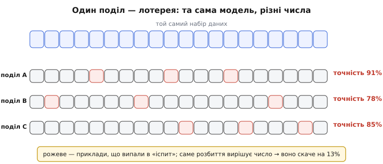
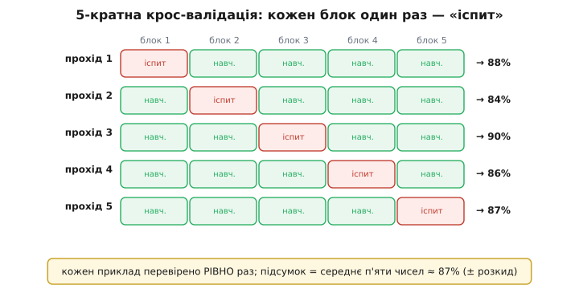
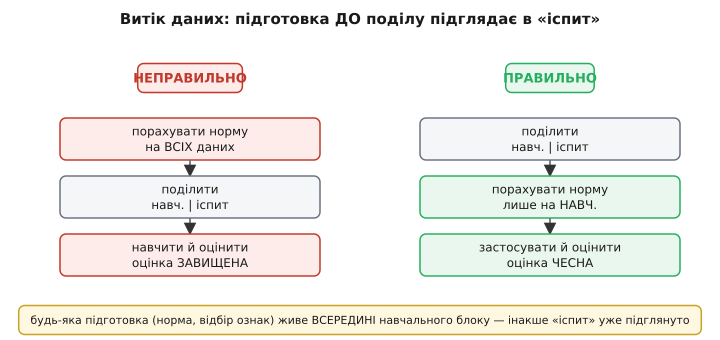

# Крос-валідація

Ти навчив модель і хочеш одне чесне число: наскільки добре вона працюватиме на **нових**, ще небачених даних. Найпростіший спосіб — відкласти частину прикладів убік, навчити на решті, а на відкладених перевірити. Але тут криється прикра пастка: **це число — лотерея**. Відклади інші приклади — і воно стрибне. Крос-валідація (лат. *cross* — навхрест + *validus* — надійний) — це прийом, що вибиває випадковість із такої оцінки: замість одного розбиття роблять **кілька**, по черзі, так щоб кожен приклад один раз побував у ролі «іспиту».

### Чому одного поділу мало

Уяви, що в тебе всього 200 розмічених прикладів — типова ситуація, коли розмітка коштує дорого (лікар підписує знімки, інженер вручну класифікує сигнали давача). Ти відкладаєш 40 із них на перевірку, вчиш модель на 160 і дістаєш точність, скажімо, 88%. Питання: скільки в цьому числі **правди**, а скільки — **везіння** з тим, які саме 40 прикладів випали?

Відповідь неприємна: везіння багато. Ті 40 — крихітна жменя. Якби серед них випадково опинилися три-чотири **особливо каверзні** приклади, точність просіла б до 80%; якби, навпаки, самі легкі — піднялася б до 93%. Модель та сама, дані ті самі — а число гуляє на десяток відсотків лише через **жереб розбиття**.


*Одна вибірка — лотерея. Той самий набір і та сама модель, але три різні випадкові вибори «іспитових» прикладів (рожеві) дають три різні числа — від 78% до 91%. Ти не знаєш, яке з них ближче до правди: жереб розбиття зсунув оцінку на 13 відсотків. Одне число з одного поділу — крихка опора.*

Ця хиткість — не дрібниця. На її основі ти **вибираєш**: чи брати цю модель, чи он ту; скільки шарів; наскільки сильно [глушити складність](root:sf-ml/regularization). Якщо твоя оцінка сама гуляє на 10%, ти легко вибереш гіршу модель лише тому, що їй **пощастило** з поділом. Потрібне число **стійкіше** — таке, що менше залежить від того, кому дістався який приклад.

### Ідея: пустити «іспит» по колу

Розв'язок напрочуд простий. Раз одне розбиття — це один кидок монети, зробимо **багато кидків і усереднимо**. Але не навмання: поділимо дані на **k рівних блоків** (звідси назва — *k*-кратна, або *k-fold*, крос-валідація) і проженемо **k проходів**. У кожному проході один блок стає «іспитом», а решта **k−1** блоків — навчанням. Наступного проходу «іспитом» стає **інший** блок. І так, доки кожен блок рівно **один раз** не побуде перевіркою.


*П'ятикратна крос-валідація. Дані ділять на 5 блоків і роблять 5 проходів. Щоразу «іспитом» (рожевий) служить наступний блок, а чотири інші — навчанням (зелені). Кожен приклад перевірено **рівно раз**, кожен раз попрацював і в навчанні, і в тесті. Підсумкова оцінка — **середнє** п'яти чисел, а їх **розкид** показує, наскільки їй можна вірити.*

Що це дає? Два виграші відразу. Перший: підсумкова точність — **середнє** k чисел, а не одне випадкове; усереднення гасить везіння, і оцінка стає **стійкішою**. Другий, і не менш важливий: тепер **кожен** приклад побував у перевірці рівно раз, тобто в оцінку вклалися **всі** дані, а не випадкові 40. Для маленького набору це рятівно — жоден дорогий приклад не пропав намарно.

Є й третій, тихий бонус: **розкид** цих k чисел сам по собі — цінна інформація. Якщо точності проходів 88, 84, 90, 86, 87 — вони тісні, моделі можна вірити. Якщо ж 95, 70, 88, 74, 91 — щось хитке: модель дуже чутлива до того, які приклади бачить, і одне «гарне» число з одного поділу тебе б обдурило.

### Порахуймо своїми руками

Механіку видно найкраще в коді. Ось кістяк *k*-кратної крос-валідації на C: перемішати індекси, порізати на k блоків, у циклі навчити на всіх блоках, крім одного, і оцінити на ньому.

**Умова: 200 прикладів, k = 5. Треба середню точність по п'яти проходах.**

:::tabs
```c
#include <stdio.h>

#define N 200      /* усього прикладів */
#define K 5        /* число блоків     */

/* Твої функції моделі (заглушки під конкретний алгоритм):
   train  — навчити на вибраних індексах;
   accuracy — частка правильних на вибраних індексах. */
void  train(const int *idx, int n);
float accuracy(const int *idx, int n);

int order[N];      /* перемішаний порядок прикладів 0..N-1 */

float cross_validate(void)
{
    int fold_size = N / K;          /* 200 / 5 = 40 у блоці */
    float sum = 0.0f;

    for (int f = 0; f < K; f++) {
        int test[N], train_idx[N];
        int nt = 0, ntr = 0;

        int lo = f * fold_size;             /* межі f-го блоку */
        int hi = lo + fold_size;

        for (int i = 0; i < N; i++) {
            if (i >= lo && i < hi)          /* цей блок — «іспит» */
                test[nt++] = order[i];
            else                            /* решта — навчання   */
                train_idx[ntr++] = order[i];
        }

        train(train_idx, ntr);              /* навчаємо з нуля     */
        float a = accuracy(test, nt);       /* міряємо на іспиті   */
        sum += a;
        printf("прохід %d: %.1f%%\n", f + 1, a * 100.0f);
    }
    return sum / K;                         /* середнє п'яти чисел */
}
```
```python
import random

N = 200   # усього прикладів
K = 5     # число блоків

# Твої функції моделі (заглушки під конкретний алгоритм):
#   train    — навчити на вибраних індексах;
#   accuracy — частка правильних на вибраних індексах.

order = list(range(N))   # порядок прикладів 0..N-1
random.shuffle(order)    # перемішали РАЗ наперед

def cross_validate():
    fold_size = N // K            # 200 // 5 = 40 у блоці
    total = 0.0

    for f in range(K):
        lo = f * fold_size        # межі f-го блоку
        hi = lo + fold_size

        test      = order[lo:hi]                    # цей блок — «іспит»
        train_idx = order[:lo] + order[hi:]         # решта — навчання

        train(train_idx)                            # навчаємо з нуля
        a = accuracy(test)                          # міряємо на іспиті
        total += a
        print(f"прохід {f + 1}: {a * 100:.1f}%")

    return total / K              # середнє п'яти чисел
```
:::

Три деталі, що вирішують усе. Перше — `train` щоразу вчить **із нуля**: у кожному проході це, по суті, окрема модель на своїй порції даних; накопичувати ваги між проходами не можна, інакше блоки перемішаються. Друге — індекси **перемішують один раз наперед** (заповнюючи `order`), бо якщо дані лежать упорядковано (спершу всі коти, тоді всі собаки), блоки вийдуть однобокими й оцінка спотвориться. Третє — усереднюємо саме **точності проходів**, кожна з яких порахована на своєму блоці; поряд корисно рахувати й розкид цих чисел.

Висновок простий: п'ять чисел злилися в одне, сперте на **весь** набір, і ти отримав оцінку, якій можна довіряти більше, ніж будь-якому одному поділу. Готовий до вживання каркас зі стратифікацією й перемішуванням винесено окремо — [робочий C-модуль крос-валідації](root:sf-ml/cross-validation/proj-kfold-c.md).

### Два корисні різновиди

Коли даних зовсім мало, k доводять до краю: беруть **k = N**, тобто кожен блок — це **один** приклад. Це **валідація з викиданням одного** (*leave-one-out*, LOOCV): навчаєш на всіх, крім одного, перевіряєш на ньому, і так N разів. Плюс — вичавлюєш максимум із крихітного набору й майже не втрачаєш даних на кожному навчанні. Мінус — треба навчити модель **N разів**; для 200 прикладів терпимо, для 50 000 — божевілля. Тому на практиці частіше беруть **k = 5** чи **k = 10**: це компроміс між стійкістю оцінки й вартістю обчислень, і саме ці значення стали стандартом після великого порівняльного дослідження, [коли крос-валідацію змірювали проти інших методів](root:sf-ml/cross-validation/hist-cross-validation.md).

Другий різновид рятує, коли класи **незбалансовані** — скажімо, «браку» серед деталей лише 5%. Якщо різати наосліп, у якийсь блок може не потрапити **жодного** бракованого приклада, і оцінка на ньому стане беззмістовною. Ліки — **стратифікована** (лат. *stratum* — шар) крос-валідація: блоки складають так, щоб у **кожному** частка класів була така сама, як у всьому наборі (5% браку — то по 5% у кожен блок). Дрібна зміна в розбитті, а оцінка стає куди чеснішою.

### Головна пастка: витік крізь підготовку

Тут ховається помилка, на якій спотикаються навіть досвідчені. Дані майже завжди **готують** перед навчанням: масштабують ознаки (щоб «температура 300» і «струм 0.2» були в одному масштабі), відбирають найкорисніші стовпці, заповнюють пропуски. Спокуса — зробити цю підготовку **один раз на всьому наборі**, а вже тоді пустити крос-валідацію. І це **тихо руйнує** всю чесність оцінки.


*Витік даних. Ліворуч — типова помилка: норму (середнє, розмах) рахують на **всьому** наборі, і в неї вже вкладено «іспитові» приклади — оцінка виходить завищена, бо модель непомітно **підглянула** відповіді. Праворуч — правильно: спершу поділ, тоді підготовку рахують **лише** на навчальному блоці й тими самими числами перетворюють іспитовий. Так «іспит» лишається справді небаченим.*

Чому руйнує? Бо коли ти рахуєш, наприклад, середнє й розмах ознаки на **всьому** наборі, у ці числа **вже вкладено** інформацію з тих прикладів, що потім опиняться в «іспиті». Модель через масштабування непомітно «підгледіла» майбутню перевірку — і покаже **завищену**, брехливу точність, а на реальних нових даних провалиться. Це **витік даних** (*data leakage*): відповідь протекла в навчання обхідним шляхом. Правило залізне: **вся підготовка живе всередині проходу** — норму, відбір ознак, заповнення рахуй **лише на навчальних** блоках, а до іспитового прикладай **уже готовими** числами.

Та сама пастка чигає, коли крос-валідацією **підбирають налаштування** (скільки шарів, яка сила [глушіння складності](root:sf-ml/regularization)). Якщо перебрати десятки варіантів і оголосити переможцем той, що дав найкраще середнє по CV, — саме це число вже **не чесне**: ти підігнав вибір під ці самі блоки. Чесна відповідь — **вкладена** крос-валідація (*nested CV*): зовнішнє коло чесно міряє якість, а всередині кожного його проходу окреме внутрішнє коло підбирає налаштування, ніколи не заглядаючи в зовнішній «іспит».

> 🔧 **Навіщо це.** Крос-валідація — робочий інструмент вибору моделі, а не теоретична забаганка. Коли даних мало (а на краю — у вбудованих задачах, де кожен розмічений сигнал давача коштує зусиль, їх завжди мало), одне число з одного поділу бреше, і на ньому легко вибрати **гіршу** модель. Бери **k = 5** чи **10** (стратифіковано, якщо класи перекошені), дивись не лише на **середнє**, а й на **розкид** проходів — тісний розкид означає, що моделі можна вірити. І пильнуй **витік**: тримай усю підготовку та підбір налаштувань **усередині** проходів, інакше твоя гарна оцінка розсиплеться на реальних даних — це різновид того самого [перенавчання](root:sf-ml/overfitting), тільки перенавчається не модель, а твоя **процедура оцінювання**.

### Коли варто, а коли ні

Крос-валідація не безкоштовна: *k*-кратна означає навчити модель **k разів**. Для швидких моделей і малих наборів це дрібниця. Для велетенської нейромережі, яку вчать тижнями, п'ятикратне навчання — розкіш; там частіше лишають один великий відкладений набір і покладаються на те, що даних і так мільйони, тож жереб поділу вже майже не хитає оцінку. Тобто головна користь крос-валідації — саме там, де даних **обмаль**, а ціна помилкового вибору висока.

Ще одна межа: якщо приклади **не незалежні** — часовий ряд, де сусідні точки зчеплені, або кілька знімків одного пацієнта — наївне перемішування знову дає витік (навчання й іспит містять «родичів»). Тоді ріжуть **з умом**: за часом (навчання лише на минулому, іспит на майбутньому) або **за групами** (усі знімки одного пацієнта — в один блок). Принцип той самий — «іспит» має бути справді небаченим, — просто «небачене» тут означає **інший час** чи **іншу групу**, а не просто інший рядок таблиці.

### Підсумок

Одне число з одного поділу даних — **лотерея**: воно гуляє на десяток відсотків лише через те, які приклади випали в перевірку, і на ньому легко вибрати гіршу модель. Крос-валідація вибиває цю випадковість: дані ділять на **k блоків**, роблять **k проходів**, де кожен блок по черзі стає «іспитом», а підсумок — **середнє** k чисел, сперте на **весь** набір; їхній **розкид** підказує, наскільки оцінці можна вірити. Мало даних — доводять до **викидання одного** (LOOCV); перекошені класи — беруть **стратифіковану** версію; на практиці **k = 5** чи **10** — золота середина між стійкістю й вартістю. Головна пастка — **витік**: підготовку даних і підбір налаштувань тримай **усередині** проходів (аж до вкладеної CV), інакше чесна на вигляд оцінка розсиплеться на реальних даних. А там, де приклади зчеплені часом чи групою, ріж по часу або по групах — щоб «іспит» лишався справді небаченим.
