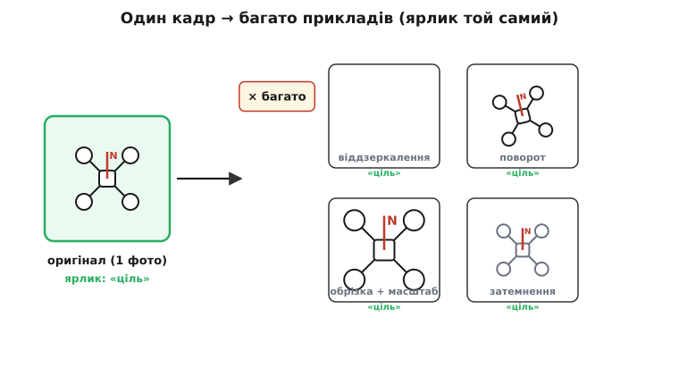
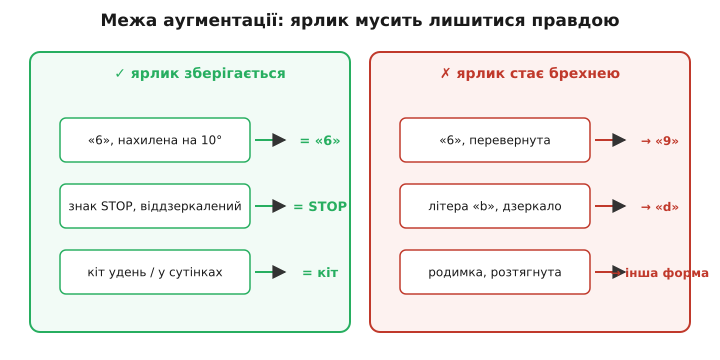
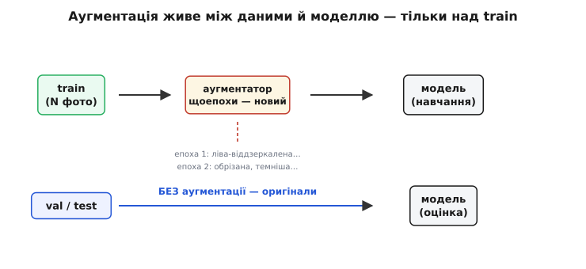

# Аугментація даних

Модель машинного навчання настільки розумна, наскільки різноманітні дані, які вона бачила. Але зібрати й розмітити дані — найдорожче й найповільніше в усьому проєкті: сфотографувати ціль з тисячі ракурсів, при різному світлі, у різну погоду — і кожен кадр підписати вручну. Аугментація (лат. *augmentum* — приріст, збільшення) — це хитрий спосіб обійти цю дорожнечу: з **одного** розміченого прикладу дешево, просто в пам'яті, наробити **багато** нових — таких, що модель сприймає їх як окремі спостереження, хоча ярлик у всіх один. Ми не збираємо більше даних — ми **вичавлюємо більше** з тих, що вже маємо.

### Ідея: змінюй картинку, не чіпай правду

Уяви, що вчиш бортову модель дрона впізнавати посадковий майданчик. Ти маєш одну фотографію майданчика зверху. Але дрон побачить його інакше: підлетить з іншого боку, нахилиться, сонце буде яскравіше чи тіні довші, камера трохи здригнеться. Для **тебе** це очевидно той самий майданчик. А для наївної моделі кожен такий вигляд — цілком **нова** картинка, якої вона не вчила.

Ось у чому суть аугментації. Візьми свій єдиний кадр і зроби з нього те, що зробить сама реальність: віддзеркаль його, поверни на кілька градусів, обріж і наблизь, притемни чи висвітли, додай трохи зернистого шуму. Кожне таке перетворення дає **інший** масив пікселів — і кожен ти подаєш моделі з **тим самим** ярликом «майданчик». Модель бачить десятки варіантів там, де ти зняв один кадр, і змушена шукати те **спільне**, що робить майданчик майданчиком за будь-яких умов, — а не запам'ятовувати конкретне розташування пікселів.


*З одного розміченого кадру (зелена рамка) дешево, просто в пам'яті, робимо багато прикладів: віддзеркалення, поворот, обрізка з наближенням, зміна яскравості. Пікселі щоразу інші — а ярлик той самий, «ціль». Модель бачить купу спостережень там, де насправді один кадр, і мусить учити суть, а не конкретне розташування пікселів.*

> 🔧 **Навіщо це.** Для бортової моделі дрона аугментація — це найдешевший спосіб не осоромитися в польоті. Літати ти будеш і в південь, і надвечір, і з різних заходів; зняти й розмітити стільки реальних кадрів — тижні роботи. А десяток перетворень над кожним наявним кадром коштує кілька рядків коду й крихти процесорного часу — і одразу закриває розкид умов, під який інакше довелося б виїжджати в поле знову й знову.

### Чому це справді допомагає, а не просто «більше файлів»

Легко подумати, що ми себе дуримо: адже нової **інформації** в перевернутому кадрі немає — це та сама картинка. Але користь тут не в новій інформації, а в тому, **яку невидиму підказку ми даємо моделі**.

Коли ти показуєш модель і оригінал, і його дзеркало з однаковим ярликом, ти без слів кажеш їй: «Ліво-право тут **не важить**». Модель не мусить сама здогадуватися про це з мільйона кадрів — ти вбудовуєш цю **байдужість** (інваріантність) прямо в навчання. Так само поворот навчає її: «точний кут не важить»; зміна яскравості — «освітлення не важить». Ти передаєш моделі своє людське знання про те, **що в задачі несуттєве**, — і вона перестає чіплятися за ці несуттєві дрібниці.

А саме чіпляння за несуттєве і є коренем [перенавчання](root:sf-ml/overfitting) — коли модель зазубрює випадкові особливості тренувальних кадрів (це тло, цю яскравість, цей ракурс) замість справжньої закономірності. Аугментація б'є точно в це: щоразу трохи інша картинка не дає **за що зазубрити**. Немає постійного тла — нема що завчити. Тому аугментацію справедливо ставлять поряд із такими ліками, як [регуляризація](root:sf-ml/regularization): і те, і те стримує модель від зубріння, тільки регуляризація тисне на самі ваги, а аугментація — на вхідні дані.

### Залізна межа: ярлик мусить лишитися правдою

Тут ховається єдина по-справжньому небезпечна пастка, і вона проста, як двері. Перетворення дозволене **лише доти, доки ярлик після нього — усе ще правда**. Аугментація має **зберігати ярлик** (label-preserving) — інакше ти вчиш модель відвертій брехні.

Класичний приклад — рукописна цифра. Нахили «6» на десять градусів — це й досі «6», чудова аугментація. Але **переверни** «6» вниз головою — і на екрані вже «9». Ярлик каже «6», піксели показують «9»: ти щойно наказав моделі, що дев'ятка — це шістка. Так само дзеркало перетворює літеру «b» на «d». Родимку на шкірі не можна довільно розтягувати — її форма і є діагноз, а ти б її спотворив.


*Ліворуч — перетворення, що зберігають правду ярлика: їх можна. Праворуч — ті, що роблять ярлик брехнею: їх не можна. Межа завжди одна: чи лишається підпис істинним після зміни. Відповідь залежить від задачі — знак STOP віддзеркалити безпечно, а цифру «6» перевертати не можна.*

Головне: **межа залежить від задачі**, універсального списку немає. Для впізнавання котів вертикальний переворот теж зазвичай зайвий — коти догори ногами в кадр не потрапляють, тож такий приклад лише збиває модель нереальним виглядом. Для знімків з орбіти, навпаки, будь-який поворот законний — там немає «верху». Тому вибір аугментацій — це завжди відповідь на питання: **що в моїй задачі реально буває, а що ні, і що змінює зміст, а що ні**.

### Найуживаніші перетворення для зображень

На практиці для картинок майже завжди беруть кілька простих, дешевих операцій. Ось базовий набір, з якого починають.

- **Віддзеркалення** по горизонталі — найдешевша й найбезпечніша операція для більшості сцен.
- **Поворот** на невеликий кут (наприклад, ±15°) і невеликий **зсув** (модель не має покладатися на те, що об'єкт точно в центрі).
- **Обрізка з масштабом** — вирізати випадковий шматок і розтягнути до потрібного розміру; учить бачити об'єкт зблизька й частково.
- **Яскравість, контраст, відтінок** — імітують різне освітлення й баланс білого камери.
- **Шум** — додати трохи випадкового зернистого шуму; так модель звикає до реального «брудного» сенсора й не боїться його.

Ці перетворення легко скласти в конвеєр: наприклад, спершу випадково віддзеркалити, тоді трохи повернути, тоді змінити яскравість — і за один прохід дістати приклад, якого ще не бачив ніхто. Ідея переноситься й на інші дані, не лише картинки: звук зсувають у часі, міняють гучність, додають фоновий гомін; текст перефразовують, міняючи слова синонімами. Скрізь принцип один: **зміни поверхню, збережи суть**.

### Аугментація на льоту, і тільки над тренуванням

Є два способи. Можна раз згенерувати роздутий набір і зберегти на диск — просто, але з'їдає пам'ять і все одно дає **скінченний**, застиглий список варіантів. Тому майже завжди роблять інакше: аугментують **на льоту** (*on-the-fly*), під час навчання. Щоразу, беручи кадр для чергового кроку, застосовують до нього **свіжий випадковий** набір перетворень — тож на кожній [епосі](root:sf-ml/gradient-descent) той самий кадр приходить трохи інакшим. Модель практично ніколи не бачить двох однакових картинок, і диск не роздувається ні на байт.

І тут — друге залізне правило, поряд зі збереженням ярлика. Аугментацію застосовують **тільки** до тренувальних даних. Валідаційний і тестовий набори лишаються **чистими, оригінальними**. Причина проста: ці набори існують, щоб чесно виміряти, як модель поведеться на **справжніх** майбутніх даних. Якщо їх теж покрутити-повіддзеркалювати, оцінка перестане відповідати реальності. Тестуй завжди на тому, що модель побачить насправді, — на неторканих кадрах.


*Аугментатор стоїть між даними й моделлю. Над train він працює на льоту й щоепохи видає новий випадковий варіант кадру — модель майже не бачить повторів. Над val / test аугментації немає взагалі: оцінюємо на оригіналах, бо міряти якість треба на тому, що станеться насправді.*

### Worked-приклад: аугментація кадру в прошивці

Покажу суть на реальному C-коді для сірого зображення (одна яскравість на піксель, 0–255). Три дешеві операції — горизонтальне дзеркало, зсув яскравості, крапковий шум — саме те, що ганяють на бортовому процесорі перед подачею кадру в модель.

**Умова.** Кадр `w×h` пікселів у масиві `img` (рядок за рядком). Треба з ймовірністю 50% віддзеркалити його по горизонталі, тоді підняти чи опустити яскравість на випадкову величину, тоді вкинути трохи шуму — і не вилізти за межі 0…255.

:::tabs
```cpp
#include <stdint.h>
#include <stdlib.h>   // rand()

// Обрізати значення до діапазону 0…255 (щоб яскравість не «перелилась»)
static uint8_t clamp8(int v) {
    if (v < 0)   return 0;
    if (v > 255) return 255;
    return (uint8_t)v;
}

// Аугментувати кадр НА МІСЦІ: дзеркало + зсув яскравості + шум.
// img — масив w*h байтів, рядок за рядком.
void augment(uint8_t *img, int w, int h) {
    // 1) з імовірністю 50% — горизонтальне дзеркало (ярлик збережеться)
    if (rand() & 1) {
        for (int y = 0; y < h; ++y) {
            uint8_t *row = img + (size_t)y * w;
            for (int x = 0; x < w / 2; ++x) {
                uint8_t t = row[x];
                row[x] = row[w - 1 - x];   // ліве ↔ праве
                row[w - 1 - x] = t;
            }
        }
    }

    // 2) зсув яскравості на випадкове −40…+40 (імітує різне світло)
    int bright = (rand() % 81) - 40;

    // 3) кожен піксель: зсув яскравості + невеликий шум −10…+10
    for (size_t i = 0; i < (size_t)w * h; ++i) {
        int noise = (rand() % 21) - 10;
        img[i] = clamp8((int)img[i] + bright + noise);
    }
}
```
```python
import random

# Обрізати значення до діапазону 0…255 (щоб яскравість не «перелилась»)
def clamp8(v):
    if v < 0:
        return 0
    if v > 255:
        return 255
    return v

# Аугментувати кадр НА МІСЦІ: дзеркало + зсув яскравості + шум.
# img — плаский список w*h байтів, рядок за рядком.
def augment(img, w, h):
    # 1) з імовірністю 50% — горизонтальне дзеркало (ярлик збережеться)
    if random.getrandbits(1):
        for y in range(h):
            base = y * w
            for x in range(w // 2):
                # ліве ↔ праве
                img[base + x], img[base + w - 1 - x] = \
                    img[base + w - 1 - x], img[base + x]

    # 2) зсув яскравості на випадкове −40…+40 (імітує різне світло)
    bright = random.randint(-40, 40)

    # 3) кожен піксель: зсув яскравості + невеликий шум −10…+10
    for i in range(w * h):
        noise = random.randint(-10, 10)
        img[i] = clamp8(img[i] + bright + noise)
```
:::

**Розбір.** Дзеркало — це просто обмін лівого пікселя з правим у кожному рядку (тому цикл іде лише до `w/2`); змісту кадру воно не міняє, тож ярлик у безпеці. Зсув яскравості `bright` вибирають **один** на весь кадр — так само, як справжнє світло однакове для всієї сцени. Шум, навпаки, свій **у кожному** пікселі — бо сенсорний шум незалежний від точки до точки. А `clamp8` стереже головну технічну пастку: без неї `250 + 40` у типі `uint8_t` не стане `290`, а **переповниться** й обернеться на темне значення — і яскраве небо раптом почорніє. Виклич `augment` перед кожною подачею кадру в модель під час навчання — і той самий кадр щоразу приходитиме новим.

> 🔧 **Навіщо це.** На бортовому процесорі така дешевизна вирішальна: аугментація має встигати між кадрами й не з'їдати пам'ять, тож її роблять простими цілочисловими операціями на місці, без зайвих копій. І та сама `clamp8` — не дрібниця: мовчазне переповнення `uint8_t` замість обрізання зіпсує кожен яскравий кадр, а модель, навчена на таких артефактах, дивно поведеться в польоті. У прошивці межі типів стережуть завжди.

### Скільки — і коли не варто

Аугментація не безмежна. Занадто дике перетворення дає кадр, якого в реальності **не буває** (перекошений до невпізнання, чорний від крайнього затемнення), — і модель марнує сили, вчачись на тому, чого ніколи не побачить. Орієнтир простий: аугментований кадр має лишатися **правдоподібним** — таким, що дійсно міг би потрапити в об'єктив. Крутиш параметри доти, доки очима бачиш нормальну сцену.

І аугментація не замінює справжніх даних. Якщо в наборі **зовсім** немає майданчиків уночі, жодне притемнення денного кадру не навчить модель тому, як усе виглядає в темряві насправді, — тіні, шум і відблиски там інші. Аугментація **розтягує** й **згладжує** те, що вже є, але не творить **нового змісту** з нічого. Тому головним правилом лишається «[дані — цар](root:sf-ml/what-is-ml)»: збери представницькі приклади з усього діапазону реальних умов — а вже тоді аугментація вичавить із них максимум.

Найпотужніше історичне свідчення сили цього прийому — [мережа AlexNet 2012 року](root:sf-ml/data-augmentation/hist-alexnet-2012.md): саме випадкові обрізки й віддзеркалення роздули їхній набір у 2048 разів і, за словами самих авторів, урятували велику мережу від нищівного перенавчання — без цього кроку вона просто зазубрила б ImageNet. А сучасні прийоми пішли ще далі: [мішання двох зображень і їхніх ярликів](root:sf-ml/data-augmentation/math-mixup.md) створює приклади, яких у природі взагалі не існує, і все одно робить модель стійкішою.

### Підсумок

Аугментація даних — це дешеве розширення навчального набору перетвореннями, що **зберігають ярлик**: з одного розміченого прикладу роблять багато, змінюючи поверхню (дзеркало, поворот, обрізка, яскравість, шум) і лишаючи суть. Помагає вона не новою інформацією, а тим, що вбудовує в модель знання про **несуттєве** — і тим стримує [перенавчання](root:sf-ml/overfitting) поряд із [регуляризацією](root:sf-ml/regularization). Дві межі непорушні: перетворення законне, лише доки ярлик після нього — правда (переворот «6» на «9» заборонений), і застосовують його **тільки** до тренувальних даних, ніколи до валідаційних чи тестових. На практиці аугментують **на льоту**, свіжим випадковим набором щоепохи, дешевими цілочисловими операціями — стережучи межі типів у прошивці. Але заміною справжніх різноманітних даних вона не є: розтягує наявне, а нового змісту не творить.
