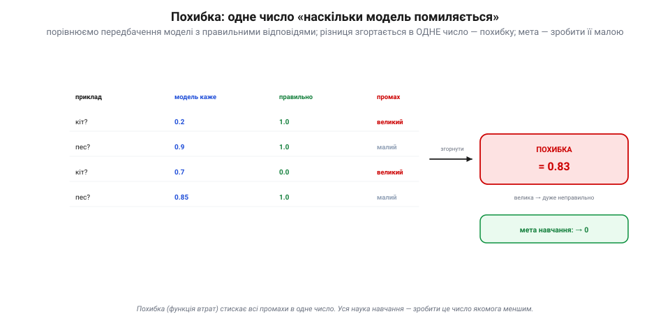
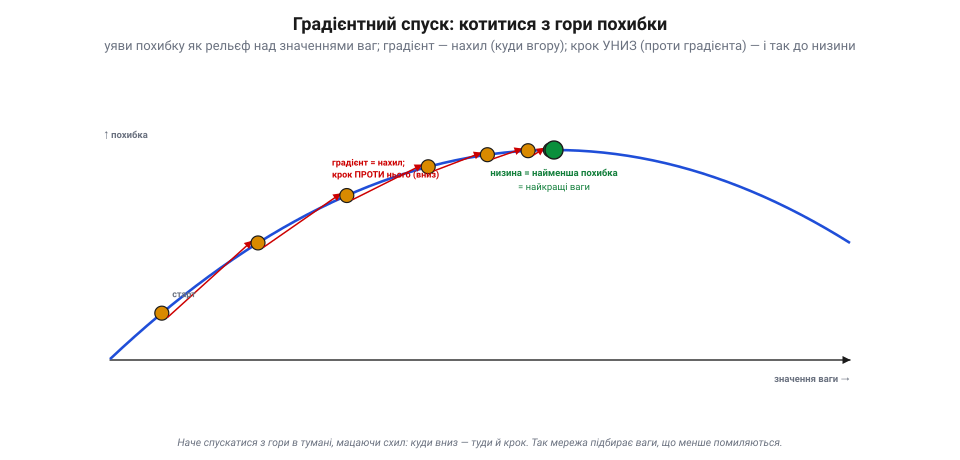
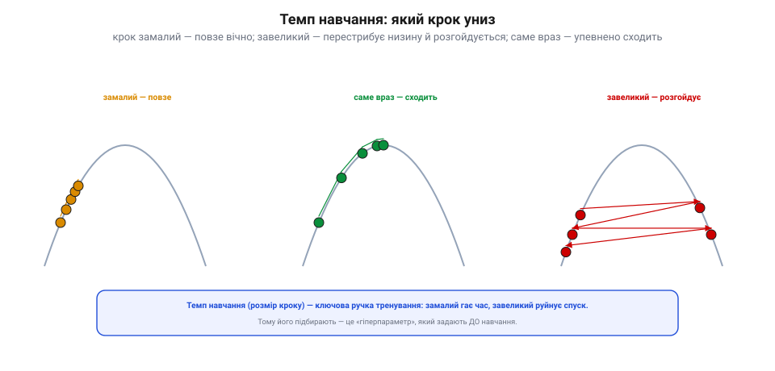
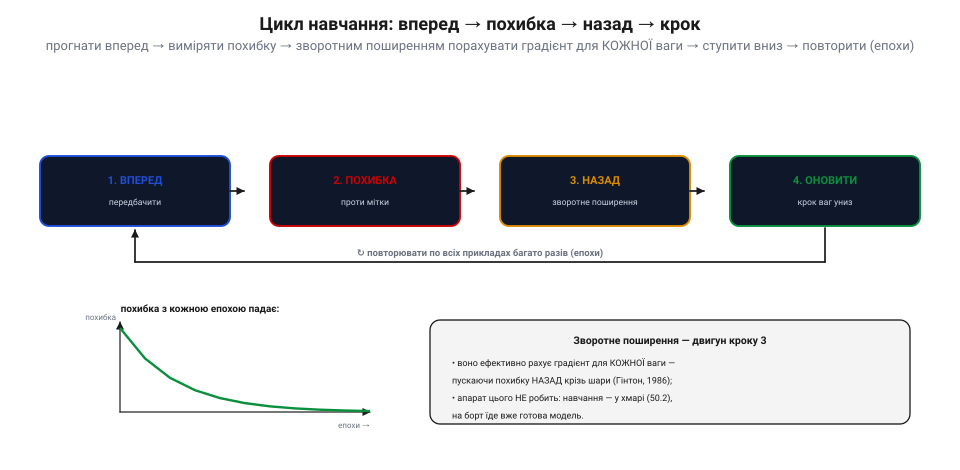

# Градієнтний спуск: як мережа вчиться, скочуючись із гори похибки

<preknowlist>
- [Нейрон і шар](root:sf-ml/neuron-layer) — модель це набір ваг (звичайних чисел), і саме ці числа навчання підбирає.
- [Навчання vs вивід](root:sf-ml/train-vs-inference) — підбір ваг відбувається окремо й заздалегідь, а не під час роботи готової моделі.
- [Похідна](root:math-analysis/derivative) — нахил функції, миттєва швидкість зміни величини; знак похідної каже, у який бік функція росте.
</preknowlist>

Модель — це мільйони [ваг](root:sf-ml/neuron-layer), звичайних чисел. Спершу вони випадкові, і мережа верзе дурниці. Питання, від якого паморочиться в голові: як сліпе підкручування мільйонів чисел перетворює цей хаос на щось, що впізнає кота чи перекладає речення? Ніхто не сідає й не виставляє ці числа руками — їх забагато, і наперед невідомо, яким має бути кожне. Відповідь напрочуд механічна, і вся вона зводиться до одного руху: **виміряти, наскільки модель помиляється, і скотити ваги з гори цієї похибки вниз**. Оце скочування — і є все «навчання», без залишку. Розберімо його до самого дна: що міряємо, куди саме котимося, яким кроком і чому це взагалі спрацьовує.

## Щоб щось покращувати, спершу це міряють

Покращити наосліп неможливо — потрібне число, яке скаже, стало краще чи гірше. Тож беруть приклади з відомими правильними відповідями, проганяють крізь модель і дивляться, **наскільки її передбачення розходяться** з правильними. Кожне окреме розходження — то один промах; усі промахи згортають в **одне-єдине число**. Це число й називають **похибкою** (або **функцією втрат**): скільки саме важить брати той чи інший спосіб міряти промах — окрема тема про [функції втрат](root:sf-ml/loss-functions), тут же нам досить того, що на виході маємо одну величину.


*Для кожного прикладу порівнюють, що сказала модель, із тим, що правильно, і бачать промах. Усі промахи згортають в одне число — похибку. Велика похибка — модель дуже помиляється; нуль — відповідає ідеально.*

Ця згортка робить мету навчання кришталево чіткою. Похибка залежить від ваг: зміни ваги — зміниться і число. Отже, шукаємо такий набір ваг, за якого похибка **найменша**. Усе решта — лише техніка, як цей набір знайти, не перебираючи неможливу кількість комбінацій. І техніка ця тримається на одному спостереженні: щоб рухатися до найменшого значення, не треба бачити всю картину — досить у кожній точці знати, **куди схил донизу**.

## Куди «донизу»: нахил і градієнт

Почнімо з найпростішого — коли вага лише одна. Тоді похибка `L` — це звичайна крива над віссю цієї ваги `w`: кожному `w` відповідає своя висота `L`. У будь-якій точці кривої є [нахил](root:math-analysis/derivative) — похідна `∂L/∂w`. Її знак і є вся потрібна нам підказка:

- нахил **додатний** — рухаючись праворуч (більший `w`), похибка **росте**; отже, `w` треба **зменшити**;
- нахил **від'ємний** — праворуч похибка **спадає**; отже, `w` треба **збільшити**.

В обох випадках правило те саме: **ступити проти знаку нахилу**. Запишімо це одним рядком — це серце всього методу:

```
w  ←  w − η·(∂L/∂w)
```

Множник `η` (розмір кроку) поки що просто якесь мале додатне число; до нього ще повернемося. Головне — мінус: він і розвертає нас **проти** нахилу, тобто донизу. Якщо нахил −6, крок додає до ваги, якщо +6 — віднімає; хай куди дивиться схил, формула веде в низину.

Тепер — стрибок, від якого й з'являється слово «градієнт». Ваг не одна, а мільйони. Похибка залежить одразу від усіх: `L(w₁, w₂, …, wₙ)`. Для кожної окремої ваги можна спитати те саме — «як зміниться `L`, якщо посунути **тільки цю** вагу, а решту тримати нерухомо?». Відповідь — **частинна похідна** `∂L/∂wᵢ`, той самий нахил, але вздовж однієї осі. Складімо всі ці нахили в один вектор:

```
∇L = ( ∂L/∂w₁ , ∂L/∂w₂ , … , ∂L/∂wₙ )
```

Оцей вектор нахилів і звуть **градієнтом** (лат. *gradus* — крок, ступінь). Він має чудову властивість: як стрілка, він показує напрям, у якому похибка росте **найкрутіше** — найшвидший підйом угору. Строгий доказ цього — з багатовимірного аналізу, і ми беремо його як даність (для однієї змінної корінь тієї ж ідеї — у [похідній](root:math-analysis/derivative)). Нам вистачить наслідку: якщо `∇L` — найкрутіше вгору, то `−∇L` — найкрутіше **вниз**. Тож правило для однієї ваги дослівно повторюється для всіх заразом:

```
wᵢ  ←  wᵢ − η·(∂L/∂wᵢ)      для кожної ваги
```

Кожна вага робить крок проти власного нахилу. Мільйон ваг — мільйон одночасних маленьких кроків донизу. Уяви похибку як **рельєф** над простором усіх ваг: горбкуватий ландшафт, де висота — це `L`, а нам треба знайти найглибшу низину. Не бачачи карти, ми в кожній точці мацаємо схил (рахуємо градієнт) і робимо крок туди, де донизу. Знову мацаємо, знову крокуємо — і так скочуємося в долину. Це і є **градієнтний спуск**.


*Похибка — це рельєф над значеннями ваг. У кожній точці градієнт показує напрям найкрутішого підйому; крок проти нього веде вниз. Крок за кроком — скочуємося в низину, де похибка найменша. Наче спускаєшся з гори в тумані, мацаючи схил ногою.*

## Погляньмо на живих числах

Візьмімо найдрібніший приклад, де все видно до останньої цифри: одна вага, а похибка — проста парабола з дном у точці `w = 3`.

**Спускаємо `w` від нуля до дна параболи `L(w) = (w − 3)²` кроком `η = 0.1`:**

```
L(w)    = (w − 3)²        похибка як функція однієї ваги
∂L/∂w   = 2·(w − 3)       її нахил

старт:  w = 0,  η = 0.1
крок 1:  нахил = 2·(0     − 3) = −6.000   w ← 0     − 0.1·(−6.000) = 0.600
крок 2:  нахил = 2·(0.600 − 3) = −4.800   w ← 0.600 − 0.1·(−4.800) = 1.080
крок 3:  нахил = 2·(1.080 − 3) = −3.840   w ← 1.080 − 0.1·(−3.840) = 1.464
крок 4:  нахил = 2·(1.464 − 3) = −3.072   w ← 1.464 − 0.1·(−3.072) = 1.771
```

Вага повзе до трійки, і видно навіть точний ритм цього повзання. Віддаль до дна щокроку множиться на один і той самий множник: підставивши `∂L/∂w = 2(w−3)` у правило, дістаємо `(w − 3) ← (w − 3)·(1 − 2η)`. За `η = 0.1` множник дорівнює `0.8`, тож розрив `3, 2.4, 1.92, 1.536, …` тане на 20 % за крок — спуск збігається, повільно, але певно. У коді той самий цикл — кілька рядків:

```c
double w = 0.0;        // початкова вага
double eta = 0.1;      // темп навчання
for (int step = 0; step < 50; step++) {
    double grad = 2.0 * (w - 3.0);   // нахил похибки L = (w - 3)²
    w -= eta * grad;                 // крок проти градієнта
}
// w → 3.000 — дно похибки
```

Це і є весь двигун навчання, лише зменшений до однієї ваги. У справжній мережі `grad` рахують не за формулою параболи, а для мільйонів ваг заразом — але рядок `w -= eta * grad` не змінюється жодною літерою.

## Темп навчання: увесь спуск вирішує розмір кроку

Той самий приклад показує, чому множник `η` — **темп навчання** — не дрібниця, а половина всієї справи. Множник збіжності `(1 − 2η)` повністю залежить від `η`, і його поведінка різко змінюється на кількох порогах:

```
η = 0.10 → множник  0.80    повільно повземо до дна
η = 0.50 → множник  0.00    стрибок точно на дно за ОДИН крок
η = 0.80 → множник −0.60    перестрибуємо дно, але щоразу ближче — осцилюючи, сходимося
η = 1.10 → множник −1.20    щокроку відлітаємо ДАЛІ від дна — спуск розвалюється
```

Картина загальна, не лише для параболи. Крок **замалий** — мережа повзе до низини нескінченно довго, навчання тягнеться без кінця й марно палить обчислення. Крок **завеликий** — вага перестрибує дно, відлітає на протилежний схил, і якщо перельоти більшають, похибка не спадає, а росте: спуск утікає геть у нескінченність. Десь поміж цими крайнощами лежить крок **саме враз** — рівний, упевнений рух донизу.


*Замалий крок — мережа повзе до низини нескінченно довго. Завеликий — перестрибує дно, відскакує на інший схил, розгойдується й може втекти геть. Саме враз — упевнено сходить униз.*

Головна засада: темп навчання **не вивчається сам** — його задають наперед, до навчання, і потім за потреби плавно зменшують по ходу (великий крок спочатку, щоб швидко наблизитися; дрібний під кінець, щоб точно осісти на дні). Такі наперед-задані ручки звуть **гіперпараметрами** (гр. *hypér* — над, понад: параметри «над» самим навчанням), і вдалий вибір темпу — справжнє мистецтво тренування.

> 🔧 **Навіщо це.** Коли чужа (чи твоя) модель «не вчиться», підозрюй насамперед **темп навчання**, а не «поганий код»: завеликий руйнує спуск (похибка стрибає чи росте), замалий — гає час (похибка ледь повзе). Це перше, що крутять на практиці. І тримай у голові, що навчання — **не магія, а спуск**: виміряти похибку → порахувати нахил → ступити вагами вниз → повторити. Тому для нього й потрібні гори **даних** (є на чому міряти похибку) та **обчислень** (багато кроків, кожен рахує градієнт по мільйонах ваг).

## Скільки даних на один крок: пакет, один приклад і золота середина

Щоб порахувати градієнт, потрібні дані — на них і міряють похибку. Але скільки прикладів брати на **кожен** крок? Тут три відповіді, і вибір між ними — не дрібна деталь, а те, як спуск виглядає насправді.

Можна взяти **всі** приклади зразу, порахувати похибку по цілому наборі й зробити один точний крок. Напрям тоді ідеально правильний — але один крок коштує проходу по всьому датасету, а таких кроків треба тисячі; для мільйонів прикладів це нестерпно повільно. Друга крайність — брати на крок **лише один** приклад: крок стає блискавичним, зате напрям хиткий, бо один приклад тягне спуск у свій бік. Такий спуск на випадкових поодиноких прикладах звуть **стохастичним** (гр. *stokhastikós* — той, що вміє вгадувати; від *stókhos* — ціль, здогад): він смикається, мов п'яний, але в середньому все одно сходить донизу, і кожен крок майже дармовий.

Практика живе посередині: беруть **невеликий пакет** прикладів (кілька десятків чи сотень) — досить, щоб напрям був пристойний, і досить мало, щоб крок був швидкий. Ця золота середина й стала стандартом навчання. Понад це базове «скільки даних на крок» надбудовують **розумніші правила самого кроку** — накопичувати розгін, щоб не буксувати, чи давати кожній вазі власний темп; це вже сімейство [оптимізаторів](root:sf-ml/sgd-optimizers) на кшталт моментуму й Adam, окрема тема, що виростає рівно з цього кореня.

## Чи знайде спуск найкращі ваги взагалі

Тепер найчесніше питання. Рельєф похибки — **не** гладенька миска з єдиним дном. Це порізаний ландшафт із безліччю ярів, і градієнтний спуск за побудовою котиться в **найближчу** низину, а не в найглибшу на всій карті. То чи не застрягне він у випадковій ямі?

Застрягне — але це рідко така біда, як здається, і причина криється в **розмірності**. Коли ваг мільйони, «яма», щоб бути справжньою пасткою, мусить іти вгору по **всіх** мільйонах напрямків одночасно; варто хоч одному лишитися відкритим — і спуск вислизне туди далі вниз. Тому справжніх глухих ям у високій розмірності мало, а ті локальні низини, у які спуск таки осідає, здебільшого майже так само добрі, як найглибша. Куди частіший клопіт — не ями, а **сідлові точки** й **плато**: широкі пласкі ділянки, де нахил майже нульовий, градієнт кволий і спуск ледь повзе, хоч дно ще далеко. Саме проти цього буксування й придумали розгінні та адаптивні [оптимізатори](root:sf-ml/sgd-optimizers) — вони проштовхують спуск крізь пласке.

Є й окрема пастка, властива саме **глибоким** мережам: коли нахил проштовхують назад крізь багато шарів, він може згасати з кожним шаром і дійти до перших шарів майже нулем — тоді ті шари стоять і не вчаться. Цю ваду звуть [затухаючим градієнтом](root:sf-ml/vanishing-gradient), і вона — не про сам спуск, а про те, як для нього добувають нахили. Звідси й важливий висновок для практика: коли модель виходить недосконалою, винен часто не баг у коді, а сам **ландшафт** задачі — форма гір, які доводиться сходити.

## Цикл навчання і двигун, що рахує градієнт

Складімо тепер усе в одне коло, яке й крутиться весь час навчання. Кроки такі: **вперед** — прогнати приклад крізь мережу й дістати передбачення; **похибка** — порівняти передбачення з правильною міткою; **назад** — порахувати градієнт для кожної ваги; **оновити** — ступити кожною вагою трохи вниз. А тоді знову, по всіх пакетах прикладів, багато разів поспіль. Один повний прохід по всьому набору даних звуть **епохою** (гр. *epokhḗ* — зупинка, точка відліку), і епох роблять багато: з кожною крива похибки повзе донизу, і модель кращає.


*Вперед: прогнати приклад крізь мережу, дістати передбачення. Похибка: порівняти з правильною міткою. Назад: порахувати градієнт для кожної ваги. Оновити: ступити кожною вагою вниз. І так по всіх прикладах багато епох — похибка з кожною епохою падає.*

Найдорожчий крок тут — **назад**: чесно рахувати `∂L/∂wᵢ` окремо для кожної з мільйонів ваг було б безнадійно повільно. Рятує ефективна машинерія, що добуває всі ці нахили за один прохід від виходу до входу, багаторазово використовуючи вже пораховане; звуть її [зворотним поширенням](root:sf-ml/backpropagation), і це окрема тема — двигун, який зробив навчання глибоких мереж узагалі можливим. Градієнтний спуск лише вирішує, **куди** ступити; зворотне поширення дешево каже йому, **який саме нахил** під кожною вагою. Усе це коло крутиться під час навчання [в хмарі](root:sf-ml/train-vs-inference), на потужних машинах; готовий пристрій потім лише возить заморожені ваги й рахує вперед, спуску там уже немає.

> 📜 **Спуск із гори придумали не для мереж — для рівнянь (Коші, 1847).** Метод, яким сьогодні навчають кожну нейромережу планети, з'явився на півтора століття раніше й зовсім для іншого. 1847 року французький математик **Оґюстен-Луї Коші** бився над велетенськими системами рівнянь, які тоді доводилося розв'язувати в астрономії — він і сам багато рахував рух небесних тіл, а робити це напряму, виключаючи невідомі одне за одним, було пекельно довго. Коші запропонував хитрий обхід: перетворити систему на одну функцію, яку треба звести до мінімуму, і **спускатися нею за нахилом** — крок за кроком туди, куди функція спадає найкрутіше. Він виклав це загальним прийомом у короткій записці «Méthode générale pour la résolution des systèmes d'équations simultanées» для Паризької академії. Це вже був градієнтний спуск — рівно та сама ідея скочування з гори, лише націлена на корені рівнянь, а не на ваги (незалежно подібне запропонував і Адамар 1907-го). Півтора століття вона тихо служила інженерам та фізикам, аж доки нейромережі не зробили її головним двигуном усього машинного навчання.

## Дно похибки — ще не мета

Отже, «навчитися» — це звести похибку до мінімуму, скочуючись рельєфом ваг проти градієнта, дрібним і виваженим кроком, доти доки крива втрат не осяде на дні. Але тут ховається пастка, важливіша за будь-яку сідлову точку. Похибку ми міряли на прикладах, які модель **уже бачила**. Скотитися на самісіньке дно цієї похибки означає ідеально підігнатися саме під них — і зовсім не гарантує, що модель упорається з новими, небаченими даними. Часто найглибша низина на тренуванні — це якраз завчена напам'ять вибірка, безпорадна деінде; це і є [перенавчання](root:sf-ml/overfitting), і саме тому спуск свідомо не завжди женуть до самого дна.

Ось де відкривається справжня широчінь теми. Сам рух — виміряти похибку, порахувати нахил, ступити вагами вниз — незмінний і для крихітної навчальної задачі, і для найбільшої моделі на світі. Змінюється решта: форма ландшафту, спосіб дешево здобути градієнт, хитрощі, як скотитися швидше й не застрягти, і те, як не з'їхати в яму завченого. Конкретна архітектура на кшталт [згорткових мереж](root:sf-ml/cnn) лише по-своєму ліпить цей рельєф — а котиться ним усе те саме скромне правило `w ← w − η·∇L`.
