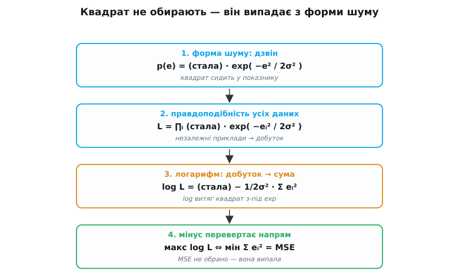

# 🧮 Звідки береться квадрат: MSE як наслідок ґаусового шуму

Квадрат помилки виглядає як довільний вибір. Чому саме друга степінь, а не четверта, не модуль, не `|e|^1.5`? Стандартна відповідь — «квадрат зручний: гладкий, прибирає знак, легко диференціюється». Усе правда, але це відповідь інженера, який уже тримає формулу в руках і виправдовує її заднім числом. Є інша відповідь, глибша: квадрат **не обирають** — він **випливає**. Варто зробити одне-єдине припущення про те, як влаштований шум у даних, і сума квадратів з'являється сама, як єдина правильна річ, яку можна мінімізувати. А якщо припущення про шум інше — з тієї самої машинерії випадає вже не квадрат, а модуль. Тобто вибір функції втрат — це насправді **прихована гіпотеза про природу помилок у ваших даних**. Розберімо, звідки це береться, з самого низу.

## Помилка — це не збій, а випадкова величина

Почнемо з того, що часто проковтують мовчки. Коли модель передбачає температуру `8.0`, а насправді було `8.3`, звідки взялися ці `0.3` розбіжності? Часто — не з того, що модель «неправильна». Навіть ідеальна модель світу промахувалася б: термометр має скінченну точність, повітря коливається, момент виміру не збігається з моментом передбачення на частку секунди. Реальність = закономірність + **шум**. Модель силкується вловити закономірність; шум вона вловити не може **в принципі**, бо той не несе закономірності — він на те й шум.

Тож запишемо чесно, як влаштований один вимір:

```
істинаᵢ = f(входиᵢ) + шумᵢ
```

Тут `f` — та справжня закономірність, яку ми апроксимуємо моделлю, а `шумᵢ` — випадковий доданок, свій для кожного прикладу, який ми **не контролюємо**. Наша модель дає оцінку `передбаченняᵢ ≈ f(входиᵢ)`, тож помилка, яку ми бачимо, — це, по суті, і є той шум:

```
помилкаᵢ = істинаᵢ − передбаченняᵢ ≈ шумᵢ
```

Ось ключовий поворот думки. Помилка перестає бути «мірою поганості моделі» й стає **вибіркою з випадкової величини**. А в випадкової величини є розподіл — крива, що каже, які значення шуму часті, а які рідкісні. І щойно ми назвемо цей розподіл, уся невизначеність зникне: форма функції втрат буде вже не питанням смаку, а наслідком форми цієї кривої.

## Найприродніше припущення: шум ґаусів

Яку криву взяти для шуму? Найчастіше — **ґаусову** (нормальну) — ту саму дзвоноподібну. І не тому, що так «прийнято», а тому, що для неї є глибока причина. Коли похибка складається з багатьох дрібних незалежних причин — тремтіння повітря, шум електроніки, округлення, вібрація, — їхня сума прагне до нормального розподілу незалежно від того, як розподілена кожна причина окремо. Це **центральна гранична теорема**, і саме вона робить дзвін не одним із варіантів, а **типовим** обличчям шуму в природі. Тому припущення «шум ґаусів» — не лінощі, а часто найчесніше, що можна сказати, коли джерел похибки багато й вони незалежні.

> 🔧 **Навіщо це.** Це припущення — не абстракція, а **перевірна гіпотеза про ваші дані**. Побудуйте гістограму залишків (помилок навченої моделі) — якщо вона дзвоноподібна й симетрична, MSE тут доречна, бо ви й справді мінімізуєте те, що треба. Якщо гістограма має важкі хвости чи стирчать поодинокі дикі значення — шум **не** ґаусів, і мовчазне припущення MSE хибне; модель під нею тягтиметься до викидів. Отже, «яку втрату взяти» — це насправді «якої форми мій шум», і на друге питання можна відповісти, просто **подивившись** на залишки.

Запишемо цю криву. Щільність нормального розподілу з центром `μ` і шириною `σ` (стандартним відхиленням):

```
p(x) = 1/(σ·√(2π)) · exp( −(x − μ)² / (2σ²) )
```

Дивитися на всю формулу зараз не обов'язково — важлива її **серцевина**: `exp(−(відхилення)²)`. Що далі значення від центру, то в **квадраті** швидше падає ймовірність. Ось де вперше з'являється квадрат — він захований у самій формі дзвона. Уся подальша розповідь — це, по суті, історія про те, як цей квадрат із показника експоненти виповзає назовні й стає функцією втрат. Множник `1/(σ·√(2π))` попереду лише нормує площу під кривою до одиниці; на форму — на те, де крива вища, а де нижча, — він не впливає, бо однаковий для всіх `x`. Запам'ятаймо це: **сталі множники форму не міняють**. Далі це двічі стане в пригоді.

Для нашого шуму центр `μ = 0` (систематичного зсуву немає — модель не мусить постійно завищувати чи занижувати), а роль `x` грає помилка. Тоді ймовірність побачити конкретну помилку `e`:

```
p(e) = 1/(σ·√(2π)) · exp( −e² / (2σ²) )
```

Читаймо це по-людськи: **крихітна помилка — дуже ймовірна** (експонента близька до 1), **велика помилка — дуже малоймовірна** (експонента стрімко тане). Саме так поводиться шум із багатьох дрібних причин: трохи схибити легко, сильно — рідко.

## Правдоподібність: наскільки дані «пасують» до моделі

Тепер — центральне поняття всієї побудови. Ми маємо набір реальних вимірів і модель із якимись вагами. Запитаймо навпаки, ніж звикли: не «наскільки модель помиляється», а **«наскільки ймовірно було б побачити саме ці дані, якби модель була правдою?»**. Ця ймовірність — функція від ваг моделі — і зветься **правдоподібністю** (англ. *likelihood* — правдоподібність).

Різниця тонка, але вирішальна. Імовірність рахують для даних за фіксованої моделі; правдоподібність — навпаки, для фіксованих (уже спостережених) даних як функцію від того, якою могла б бути модель. Дані вже сталися й не міняються; ми крутимо ваги й дивимося, за яких налаштувань ці конкретні дані виглядають **найприроднішими**, найменш дивними. Ваги, за яких спостережене найімовірніше, і оголошуємо найкращими — це **принцип максимальної правдоподібності**.

Аналогія. Детектив має набір слідів (дані — вони незмінні) і кілька версій того, що сталося (моделі). Він питає про кожну версію: якби все було саме так, наскільки природно лягли б ці сліди? Версія, за якої сліди перестають бути дивними й складаються в очевидну картину, — найправдоподібніша. Аналогія точна майже всюди; ламається вона лише в одному місці — детектив зважує ще й **апріорну** правдоподібність версій («так узагалі рідко буває»), а чиста максимальна правдоподібність цього не робить: вона дивиться тільки на те, як пасують сліди, і мовчить про те, наскільки версія правдоподібна сама собою. Це окрема тонкість (те, що додає баєсів підхід), і тут вона нам не завадить.

Тепер зберемо правдоподібність усього набору. Вважаємо шуми в різних прикладах **незалежними** (похибка одного виміру не пов'язана з похибкою іншого — розумне припущення для чесно зібраних даних). А ймовірність незалежних подій разом — це **добуток** їхніх імовірностей (як два кидки монети: обидва «орли» — це `½ · ½`). Тож правдоподібність усіх даних — добуток по всіх прикладах:

```
L = ∏ᵢ  1/(σ·√(2π)) · exp( −eᵢ² / (2σ²) )
```

де `eᵢ = істинаᵢ − передбаченняᵢ`, а передбачення залежить від ваг моделі. Максимізувати `L` за вагами — і означає знайти найкращу модель за принципом максимальної правдоподібності. Лишилося тільки продертися крізь цей добуток. І тут стається невеличке диво.

## Логарифм: добуток стає сумою, а квадрат виходить назовні

Добуток багатьох маленьких чисел незручний удвічі. По-перше, він **обчислювально небезпечний**: перемножте тисячу ймовірностей, кожна менша за одиницю, — і результат провалиться під найменше число, яке вміщає `float`, ставши машинним нулем (це зветься *underflow* — зникнення порядку). По-друге, добуток важко диференціювати — похідна добутку розростається в жах. Обидві біди лікує той самий прийом: беремо **логарифм**.

Чому логарифм саме тут доречний, а не притягнутий за вуха? Бо в нього є рівно та властивість, якої нам бракує: **він перетворює добуток на суму**.

```
log(a · b) = log a + log b
```

І ще одне — логарифм **монотонний**: більший аргумент — більший логарифм, завжди. А отже, `L` і `log L` досягають максимуму **в тій самій точці**, за тих самих ваг. Тобто максимізувати `log L` — це те саме, що максимізувати `L`, тільки тепер зручно. Ми нічого не втрачаємо, лише міняємо оправу.

> 🔧 **Навіщо це.** У реальній прошивці ніхто не перемножує ймовірності — усе рахують у логарифмах саме через underflow. Тисяча множень `float`-ймовірностей дає рівний нуль і мертвий градієнт; тисяча **додавань** їхніх логарифмів — стабільне число. Тому «log-правдоподібність» — не математична поза, а те, що дослівно живе в коді як сума, яку накопичує цикл.

Прологарифмуймо `L`. Логарифм добутку — сума логарифмів по прикладах:

```
log L = Σᵢ  log[ 1/(σ·√(2π)) · exp( −eᵢ² / (2σ²) ) ]
```

Логарифм добутку всередині — знову сума двох доданків; а `log(exp(...))` — це просто сам показник, бо логарифм і експонента взаємно знищуються (`log eˣ = x`):

```
log L = Σᵢ [ −log(σ·√(2π))  −  eᵢ² / (2σ²) ]
```

Розчепимо суму на дві частини:

```
log L = −N·log(σ·√(2π))  −  1/(2σ²) · Σᵢ eᵢ²
```

де `N` — кількість прикладів. Тепер придивімося, що з цього залежить від ваг моделі, а що ні. Перший доданок `−N·log(σ·√(2π))` — це та сама нормувальна стала, тільки прологарифмована: у ній немає передбачень, лише `σ`, `N` і числа. Крутячи ваги, ми його **не змінюємо** — він просто підіймає чи опускає всю криву цілком, як стеля кімнати не впливає на те, де в ній найнижча точка підлоги. А для пошуку максимуму стеля байдужа. Ось де вдруге спрацювало «сталі множники форму не міняють».

Лишається єдиний доданок, що реагує на ваги:

```
log L = (стала)  −  1/(2σ²) · Σᵢ eᵢ²
```

## Максимум правдоподібності = мінімум суми квадратів

Ось воно. Подивімося на цю формулу як на рельєф, яким ми ходимо, крутячи ваги. Стала — незмінна. Множник `1/(2σ²)` — додатний (це ж число, поділене на подвоєний квадрат), тому теж лише масштабує, знаку не міняє. Уся залежність від ваг — у `−Σ eᵢ²`. І перед нею стоїть **мінус**.

Зробити `log L` **якнайбільшим** — це зробити доданок `−Σ eᵢ²` якнайбільшим, тобто якнайближчим до нуля згори. А `−Σ eᵢ²` тим ближчий до нуля, чим **менша** сама сума `Σ eᵢ²` (вона невід'ємна, бо квадрати). Мінус розвертає напрям: **максимізувати log-правдоподібність — буквально те саме, що мінімізувати суму квадратів помилок.**

```
максимум  log L   ⇔   мінімум  Σᵢ eᵢ²   ⇔   мінімум  MSE
```

(Поділити суму на `N` — дістати MSE — знову лише сталий множник; точку мінімуму він не зрушить.) Коло замкнулося. Ми ніде не вирішували «а візьмімо квадрат». Ми сказали одне: **шум ґаусів**. Квадрат стирчав у показнику дзвона `exp(−e²/…)`; логарифм його звідти витяг; мінус перевернув максимум на мінімум — і на світ вийшла рівно сума квадратів. **MSE — це максимальна правдоподібність за ґаусового шуму, і нічого більше.** Зручність квадрата — приємний наслідок, а не причина.


*Як квадрат виходить назовні. Дзвін ґаусового шуму містить `e²` у показнику експоненти. Правдоподібність усіх даних — добуток таких дзвонів. Логарифм перетворює добуток на суму й витягує квадрат з-під експоненти. Нормувальні сталі («стеля») на положення максимуму не впливають. Лишається `−Σe²`; мінус перед нею означає: максимум правдоподібності = мінімум суми квадратів. MSE не обрано — вона випала з припущення про форму шуму.*

Тут доречно згадати, хто це побачив. Сам метод найменших квадратів першим **опублікував** француз Адрієн-Марі Лежандр 1805 року в додатку «Sur la méthode des moindres carrés» — і дав методові його назву. Карл Фрідріх Ґаус 1809-го в «Theoria Motus» заявив, що користувався ним ще з 1795-го; спалахнула суперечка про першість, у якій за Лежандром лишилося першодрукування, а Ґаусову давнішу практику згодом визнали правдоподібною Лаплас і пізніші історики статистики (усталений факт зі спірним питанням дати відкриття). Але Ґаусів внесок був глибший за дату. Він міркував **навспак** нашому викладу: припустив, що середнє арифметичне вимірів має бути найправдоподібнішою оцінкою істини (як усі й роблять інтуїтивно), і вивів, що тоді шум **зобов'язаний** бути нормальним — жоден інший розподіл цього не дає. Тобто зв'язок «дзвін ↔ найменші квадрати» він проклав в **обидва** боки: не лише «ґаус → квадрати», а й «наполягання на середньому → ґаус». Сам термін «максимальна правдоподібність» під цю ідею підвів значно пізніше, у 1912–1922 роках, британець Роналд Фішер, надавши їй сучасної форми й назви (усталений факт).

## Той самий місток для MAE: лапласів шум → модуль

Найпереконливіший доказ, що це не гра слів, а справжня машинерія, — прокрутити її з **іншим** припущенням і побачити, як випаде інша втрата. Замінімо форму шуму. Замість дзвона, що падає як `exp(−e²)`, візьмімо розподіл, який падає як `exp(−|e|)` — не з квадратом у показнику, а з **модулем**. Це **розподіл Лапласа** (двобічний експоненційний): гострий шпиль по центру й важчі, повільніші хвости, ніж у дзвона.

```
p(e) = 1/(2b) · exp( −|e| / b )
```

`b` тут — параметр ширини, аналог `σ`. Форма каже те саме, що й раніше — мала помилка ймовірна, велика ні, — але спадає вона **повільніше** за дзвін: далеко від центру `exp(−|e|)` більший за `exp(−e²)`. А отже, велика помилка під Лапласом **не така вже й дивна**. Запам'ятаймо це — саме звідси виросте стійкість до викидів.

П'єр-Симон Лаплас запропонував цей закон ще 1774 року — на десятиліття раніше за виклад найменших квадратів, — назвавши його своїм **першим законом похибок** (усталений факт). Проженімо його крізь ту саму трубу. Правдоподібність усіх даних — добуток:

```
L = ∏ᵢ  1/(2b) · exp( −|eᵢ| / b )
```

Логарифмуємо — добуток стає сумою, `log(exp(...))` знищується, стала `1/(2b)` вилазить окремим доданком, що від ваг не залежить:

```
log L = −N·log(2b)  −  1/b · Σᵢ |eᵢ|
```

Знову перший доданок — «стеля» (лише `b`, `N`, числа), максимуму не рухає. Множник `1/b` додатний — тільки масштабує. Уся залежність від ваг — у `−Σ|eᵢ|`, і перед нею мінус. Тож максимум правдоподібності — це мінімум `Σ|eᵢ|`:

```
максимум  log L   ⇔   мінімум  Σᵢ |eᵢ|   ⇔   мінімум  MAE
```

Це середня абсолютна похибка (MAE) — точнісінько модуль. **Ту саму** трубу — щільність, добуток, логарифм, відкидання сталих, розворот знаку — ми годуємо іншим шумом і на виході дістаємо іншу втрату. Квадрат ↔ ґаус; модуль ↔ Лаплас. Функція втрат — це віддзеркалення форми показника в щільності шуму, і нічого таємничого в цьому виборі немає.

І тепер стає прозорою **сама причина**, чому MAE стійкіша до викидів, — не як окремий факт, а як наслідок форми. Під ґаусом велика помилка страшенно малоймовірна (`exp(−e²)` тане блискавично), тож коли вона все-таки трапляється, модель під MSE «вірить», що це важливий сигнал, і кидається його гасити ціною решти. Під Лапласом хвіст важчий — велика помилка не сприймається як шокуюча рідкість, тож поодинокий викид не змушує модель перекроюватися під нього. Ось звідки береться відома різниця: **MSE тягне модель до середнього** даних, **MAE — до медіани** (значення, повз яке промахів порівну з обох боків), а медіану кілька диких точок не зсувають. Це не два не пов'язані правила з підручника — це одна теорема, прокручена для двох форм шуму.

**Умова: MSE→середнє, MAE→медіана на п'яти точках.** Нехай для однакових входів істинні значення — `{4, 5, 6, 7, 100}` (остання — викид, скажімо, зіпсований запис), а модель дає одне число `c`.

```
Мінімум Σ(c − yᵢ)²  досягається в СЕРЕДНЬОМУ:
  c* = (4 + 5 + 6 + 7 + 100) / 5 = 122 / 5 = 24.4
  → викид 100 сам-один затягнув оцінку аж на 24.4, геть від решти

Мінімум Σ|c − yᵢ|  досягається в МЕДІАНІ (середнє за порядком):
  впорядковано: 4, 5, [6], 7, 100 → c* = 6
  → викид не зрушив оцінку: 6 стоїть серед основної маси даних
```

Одна дика точка перетягнула MSE-оцінку з-під `6` аж на `24.4`, а MAE-оцінка встояла на `6`. Це та сама теорема в дії: квадрат у показнику ґауса робить далекі значення «неймовірними», тож модель під MSE ставиться до викиду як до важливого факту й посувається до нього; модуль у показнику Лапласа лишає далеким значенням право на існування, і оцінка тримається медіани. Тому вибір між MSE й MAE — це, дослівно, **заява про те, чи вірите ви, що великі помилки у ваших даних майже неможливі (ґаус), чи цілком можливі (Лаплас)**.

## Де це працює в темі

Ланцюжок «форма шуму → форма втрати» — не історична цікавинка, а робочий інструмент, який міняє те, як ви обираєте втрату й читаєте поведінку моделі.

По-перше, він перетворює вибір втрати з питання смаку на **питання про дані**. «Брати MSE чи MAE?» — насправді «якої форми мій шум: дзвін чи гострий шпиль із важкими хвостами?». І на це можна відповісти не суперечкою, а гістограмою залишків навченої моделі. Симетричний дзвін — MSE чесна. Важкі хвости чи поодинокі викиди — шум не ґаусів, і MSE мовчки тягтиме модель до тих викидів; беріть MAE (або компроміс на кшталт Губера, що квадратичний біля нуля й лінійний на хвостах). Ви більше не вгадуєте — ви **дивитесь**.

По-друге, він пояснює загадкове родинне слово, що спливає біля класифікації. Перехресна ентропія `−log p` — не окремий винахід «для класів», а **той самий** принцип максимальної правдоподібності, тільки прокладений крізь інший шум: замість ґаусового навколо числа — розподіл по дискретних класах. Мінус-логарифм там з'являється з тієї самої причини, що й тут: логарифм добутку ймовірностей по прикладах, узятий зі знаком мінус, щоб перевернути «максимум правдоподібності» на «мінімум втрати». Тому наскрізний зв'язок [−log p з бітами інформації](root:math-information/entropy) і принцип максимальної правдоподібності — це не три різні історії про MSE, MAE й ентропію, а **одна** машинерія, застосована до трьох різних припущень про шум. Побачивши її раз, ви впізнаватимете її всюди.

По-третє, він задає здорову межу довіри. Уся побудова спиралася на два припущення — шум **незалежний** між прикладами й **однакової форми** для всіх. Порушите їх (похибки корельовані в часі; розкид шуму росте з величиною сигналу) — і чиста сума квадратів уже не буде максимальною правдоподібністю вашої задачі; правильна втрата матиме **ваги** на прикладах або враховуватиме кореляцію. Тому коли модель під MSE поводиться дивно попри чистий код, перше питання — не до коду мережі, а до цих припущень: **чи справді мій шум такий, як мовчки стверджує моя функція втрат?** Найдорожчі помилки в навчанні ховаються саме в цьому мовчазному «мовчки».
