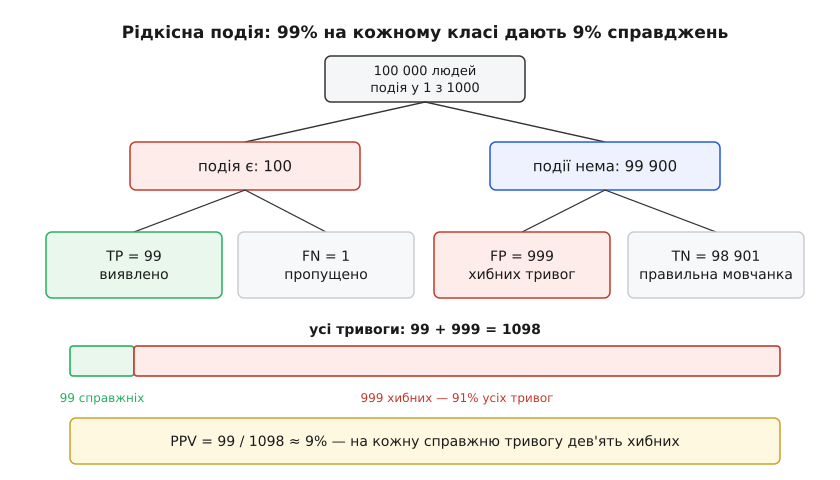
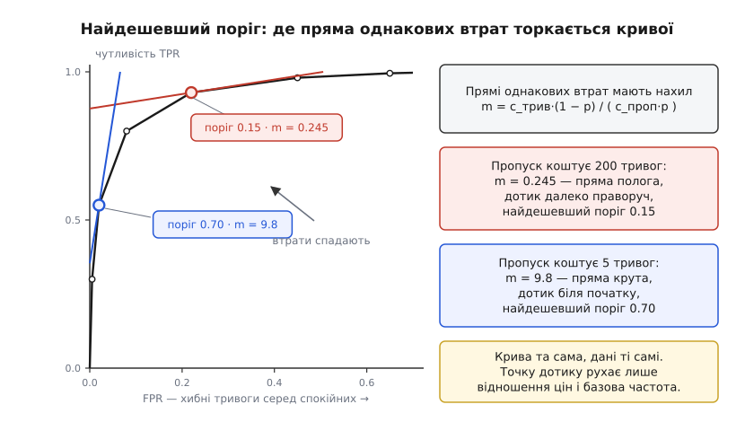
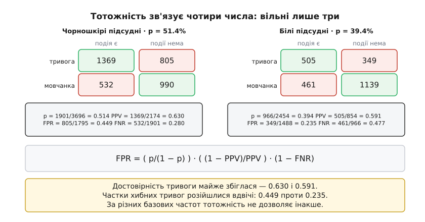

# 🧮 Базова частота, поріг і ціна помилки: арифметика чотирьох клітинок

Три викладки на одній матриці помилок: чому за рідкісної події більшість тривог хибна навіть у бездоганної на вигляд моделі, де саме лежить поріг із найменшими втратами і чому вимога «однаково справедливо до двох груп» буває арифметично нездійсненна. Усе далі — дії з чотирма числами; про модель тут не припускається нічого, тому й висновки жодна архітектура не обходить.

## Чотири клітинки і два напрями ділення

Візьмімо N випадків. Правда ділить їх на два стовпчики — подія є чи немає; рішення ділить на два рядки — тривога чи мовчанка. Перетин дає чотири числа, і більше в матриці немає нічого:

```
                  подія є      події нема      разом
  тривога           TP             FP          TP + FP
  мовчанка          FN             TN          FN + TN
  разом          TP + FN        FP + TN            N
```

Усі показники якості — прості дроби з цих чотирьох чисел. Уся плутанина навколо них — від того, що дроби беруться в **різних напрямках**:

```
p    = (TP + FN) / N       базова частота події

TPR  = TP / (TP + FN)      чутливість: частка виявлених   ← по СТОВПЧИКУ «подія є»
FNR  = FN / (TP + FN)      частка пропусків = 1 − TPR     ← по тому самому стовпчику
FPR  = FP / (FP + TN)      = 1 − специфічність            ← по СТОВПЧИКУ «події нема»

PPV  = TP / (TP + FP)      достовірність тривоги          ← по РЯДКУ «тривога»
```

Ось де захована пастка. Словами «хибна тривога» називають два різні дроби: `FPR` — частку хибних тривог серед тих, у кого події немає, і `1 − PPV` — частку хибних серед самих тривог. Знаменники різні, і числа розходяться як завгодно далеко: нижче побачимо модель, у якої `FPR = 1%` і водночас `1 − PPV = 91%`. Той, хто платить за перевірку кожної тривоги, живе з другим числом, а в описі моделі йому дають перше.

Різниця не косметична: `TPR` і `FPR` рахуються всередині стовпчиків, тому не залежать від того, скільки в наборі подій, а `PPV` рахується поперек стовпчиків — і від базової частоти залежить прямо. Тому [метрики, які наводить розробник](topic:sf-visual/detection-metrics), переїжджають з лабораторії в лікарню разом із моделлю, а достовірність тривоги — ні: її треба перерахувати на місці. Це той самий поділ, що й в [умовній імовірності](topic:math-probability/conditional-probability): змінюється умова — змінюється число, хоча подія та сама.

## Тривога на рідкісну подію

Виразимо клітинки через `p`, `TPR` і `FPR` — просто розкривши означення:

```
TP = N · p · TPR              FP = N · (1 − p) · FPR

PPV = TP / (TP + FP) = p·TPR / ( p·TPR + (1 − p)·FPR )
```

Це [теорема Баєса](topic:math-probability/bayes-theorem), записана літерами матриці: апріорна ймовірність `p`, правдоподібності `TPR` і `FPR`, апостеріорна ймовірність `PPV`. Ще прозоріше вона в шансах — поділімо `PPV` на `1 − PPV`, і спільний знаменник скоротиться:

```
PPV / (1 − PPV)  =  [ p / (1 − p) ]  ·  [ TPR / FPR ]

   шанси після тривоги  =  шанси до неї  ×  відношення правдоподібностей
```

Другий множник `LR⁺ = TPR / FPR` — усе, що тривога додає до знання. Він множить шанси, а не додає до ймовірності; звідси й уся арифметика рідкісних подій.

**Подія трапляється в одного з тисячі. Чутливість 99%, специфічність 99%. Яка частка тривог справджується?**

```
N = 100 000 людей
подія є:     100 000 · 0.001 = 100
події нема:  100 000 · 0.999 = 99 900

TP = 100    · 0.99 = 99        виявлено
FN = 100    · 0.01 = 1         пропущено
FP = 99 900 · 0.01 = 999       хибних тривог
TN = 99 900 · 0.99 = 98 901

тривог усього = 99 + 999 = 1098
PPV = 99 / 1098 = 0.0902 ≈ 9%
```

Дев'ять відсотків. Модель хибить на одному відсотку кожного класу — і все ж дев'яносто одна тривога зі ста хибна. Причина видна прямо в стовпчиках: група «події нема» в 999 разів більша, тож її один відсоток (999 осіб) легко перекриває дев'яносто дев'ять відсотків від сотні. У шансах те саме одним рядком: `1/999 · 99 = 99/999`, тобто приблизно один справжній на десять хибних.


*Один відсоток великого стовпчика більший за дев'яносто дев'ять відсотків малого. Тому частка справджень серед тривог — 9%, хоча на кожному класі окремо модель хибить лише на одному відсотку.*

Скільки треба, щоб справджувалася бодай половина тривог? Прирівняймо шанси після тривоги до одиниці:

```
1 = (1/999) · (0.99 / FPR)   ⟹   FPR = 0.99 / 999 = 0.000991
специфічність = 1 − FPR = 99.901%
```

Хибні тривоги доводиться зменшити вдесятеро — з 1% до 0.099%. І зверніть увагу, з якого боку тут важіль. Шанси після тривоги пропорційні відношенню `TPR/FPR`, а чутливість уперта в стелю: підняти її з 99% можна щонайбільше на один відсоток, і `PPV` виросте з 9.0% лише до 9.1%. Знизу ж стелі немає — кожне зменшення `FPR` удесятеро підіймає шанси теж удесятеро. За рідкісної події вся вага рішення лежить на другому стовпчику.

Числа з практики поводяться так само. Модель передбачення сепсису, перевірена на 38 455 госпіталізаціях (Wong та ін., *JAMA Internal Medicine*, 2021), показала чутливість 33% і специфічність 83% при частці сепсису 7%:

```
FPR = 1 − 0.83 = 0.17

частка тривог = 0.07·0.33 + 0.93·0.17 = 0.0231 + 0.1581 = 0.1812  ≈ 18% госпіталізацій
PPV           = 0.0231 / 0.1812 = 0.127                            ≈ 12%
```

Обидва числа відтворюють опубліковані — тривога на 18% усіх госпіталізацій і достовірність 12%; розбіжність в останній цифрі йде від округлення чутливості та специфічності до цілих відсотків. Сім тривог із восьми хибні — не тому, що модель надзвичайно погана, а тому, що `0.93 · 0.17` майже всемеро більше за `0.07 · 0.33`.

І остання арифметична деталь, через яку моделі ламаються при переїзді. Базова частота входить у формулу шансів множником `p/(1 − p)`, а за малого `p` цей множник майже дорівнює самому `p` — тобто шанси після тривоги майже пропорційні базовій частоті:

```
шанси після тривоги = ( p/(1 − p) ) · ( TPR/FPR ),   TPR/FPR = 0.33/0.17 = 1.941

p = 0.070  →  0.0753 · 1.941 = 0.146  →  PPV = 0.146/1.146 = 0.127
p = 0.035  →  0.0363 · 1.941 = 0.070  →  PPV = 0.070/1.070 = 0.066
```

Перевезіть ту саму модель — з тими самими `TPR` і `FPR` — у лікарню, де сепсис трапляється вдвічі рідше, і достовірність тривоги теж упаде приблизно вдвічі, до 6.6%. У моделі не змінилося нічого; змінився стовпчик, на який вона ділить.

> 🔧 **Навіщо це.** Перед упровадженням порахуйте `PPV` для тієї частоти події, яка є **на місці роботи**, а не в наборі, на якому міряли якість. Обернене число `1/PPV` — скільки тривог доводиться розібрати на одну справжню: за `PPV = 12%` це вісім перевірок на одну знахідку, і саме цим числом вимірюється навантаження на людей, які з тривогами працюють.

## Поріг, що коштує найменше

Поріг перетворює число на рішення й обмінює один рід помилок на другий. Щоб вибрати між ними, потрібні ціни: `c_проп` — чого коштує пропуск, `c_трив` — чого коштує хибна тривога. Одиниці байдужі (гроші, години, шкода) — важить лише відношення.

Втрати на один випадок — це [середнє, зважене ймовірностями](topic:math-probability/mean-variance): кожен рід помилки береться з вагою, що дорівнює його частці в усій вибірці.

```
L(t) = c_проп · p · FNR(t)  +  c_трив · (1 − p) · FPR(t)
```

Звідки саме такі ваги, видно з напрямів ділення: `FNR` — частка **всередині** стовпчика подій, тож у частку всієї вибірки її переводить множник `p`; `FPR` живе в стовпчику не-подій, тож множник `(1 − p)`. Пропустити їх — типова помилка, після якої за рідкісної події пропуски й тривоги виглядають однаково вагомими, хоча пропусків фізично мало.

Мінімум цієї суми шукають двома способами — поштучно й на кривій.

### Поштучно: поріг на ймовірність

Хай для конкретного входу ймовірність події дорівнює `q`. Порівняймо два рішення:

```
тривога:   очікувані втрати = c_трив · (1 − q)      платимо, якщо події немає
мовчанка:  очікувані втрати = c_проп · q            платимо, якщо подія є
```

Тривога дешевша, коли `c_трив·(1 − q) < c_проп·q`, тобто

```
q > c_трив / ( c_трив + c_проп ) = q*
```

У цьому виразі немає жодної характеристики моделі — самі ціни. Якщо пропуск коштує як двісті хибних тривог, `q* = 1/201 = 0.5%`: варто здіймати тривогу вже за піввідсотка ймовірності. Застереження одне, зате важке: `q` мусить бути **справжньою ймовірністю**. Сире число на виході моделі нею не є, доки [шкалу впевненості не звірили з частотою справджень](topic:sf-ml/confidence-calibration); порівнювати некалібрований бал 0.5 із `q*` немає сенсу.

### На кривій: нахил дорівнює відношенню цін

Для некаліброваного бала працюють із парами `(FPR, TPR)`, які поріг пробігає. Підставимо `FNR = 1 − TPR`:

```
L = c_проп·p·(1 − TPR) + c_трив·(1 − p)·FPR
  = c_проп·p  −  [ c_проп·p·TPR  −  c_трив·(1 − p)·FPR ]
```

Перший доданок від порога не залежить, тож мінімізувати `L` — те саме, що максимізувати квадратну дужку. Лінії, на яких дужка стала, у координатах `(FPR, TPR)` — прямі з нахилом

```
m = dTPR/dFPR = c_трив·(1 − p) / ( c_проп·p )
```

Далі працює геометрія: беремо пряму нахилу `m` і посуваємо її вгору-ліворуч, доки вона ще торкається кривої. Точка дотику й задає поріг. Круте `m` (пропуск дешевий) торкається кривої біля початку — тривог мало; пологе `m` (пропуск дорогий) торкається далеко праворуч.

**Скринінг: подія у 2% випадків, пропуск коштує як 200 хибних тривог.**

```
m = 1 · 0.98 / (200 · 0.02) = 0.98 / 4 = 0.245

втрати на 1000 випадків:  L = 200·(1000·0.02)·FNR + 1·(1000·0.98)·FPR
                            = 4000·FNR + 980·FPR

поріг    TPR     FPR      FNR       L на 1000
 0.90   0.300   0.005    0.700    4000·0.700 + 980·0.005 = 2804.9
 0.70   0.550   0.020    0.450    4000·0.450 + 980·0.020 = 1819.6
 0.40   0.800   0.080    0.200    4000·0.200 + 980·0.080 =  878.4
 0.15   0.930   0.220    0.070    4000·0.070 + 980·0.220 =  495.6   ← мінімум
 0.05   0.980   0.450    0.020    4000·0.020 + 980·0.450 =  521.0
 0.02   0.995   0.650    0.005    4000·0.005 + 980·0.650 =  657.0
```

Мінімум усередині діапазону, а не з краю. Той самий висновок без таблиці — через нахил:

```
0.40 → 0.15:  ΔTPR/ΔFPR = (0.930 − 0.800)/(0.220 − 0.080) = 0.13/0.14 = 0.93 > 0.245   крок вигідний
0.15 → 0.05:  ΔTPR/ΔFPR = (0.980 − 0.930)/(0.450 − 0.220) = 0.05/0.23 = 0.22 < 0.245   крок збитковий
```

Оптимум там, де нахил кривої перетинає `m`: доки крива підіймається крутіше за пряму втрат, кожен новий пропущений випадок ловиться дешевше, ніж коштують додані тривоги; щойно нахил упав нижче — навпаки.

Тепер змінімо тільки ціну. Хай пропуск коштує як п'ять тривог, а не двісті:

```
m = 1 · 0.98 / (5 · 0.02) = 9.8
L = 5·20·FNR + 980·FPR = 100·FNR + 980·FPR

 0.90:  100·0.700 + 980·0.005 =  74.9
 0.70:  100·0.450 + 980·0.020 =  64.6   ← мінімум
 0.40:  100·0.200 + 980·0.080 =  98.4
 0.15:  100·0.070 + 980·0.220 = 222.6
```

Модель та сама, дані ті самі, крива та сама — а найдешевший поріг переїхав з 0.15 на 0.70. У формулі для `m` сидить і базова частота: за тих самих цін, але `p = 0.2` замість 0.02, `m = 0.8/(200·0.2) = 0.02` — пряма стає в дванадцять разів пологіша, і точка дотику знову зсувається.


*Прямі однакових втрат мають нахил `m = c_трив·(1 − p)/(c_проп·p)`. Оптимальний поріг — точка, де така пряма востаннє торкається кривої; змінилися ціни — змінився нахил — переїхала точка.*

Обидва способи — одне правило в різних координатах. Поріг `q > q*` на калібрований бал означає, що шанси після тривоги перевищили `c_трив/c_проп`, а це, за формулою шансів, те саме, що `LR⁺ > (c_трив/c_проп)·((1 − p)/p) = m`. Нахил кривої в точці й дорівнює відношенню правдоподібностей у ній — тож дотик і поріг на ймовірність указують на ту саму точку.

## Тотожність, що не дає бути справедливим двічі

Повернімося до формули шансів і виразимо з неї `FPR`:

```
PPV / (1 − PPV) = [ p/(1 − p) ] · [ TPR/FPR ]

⟹   FPR = ( p / (1 − p) ) · ( (1 − PPV) / PPV ) · ( 1 − FNR )
```

Це тотожність, яку Chouldechova поклала в основу доведення несумісності критеріїв справедливості (*Big Data*, 2017, рівняння 2.6). Читається вона так: із чотирьох чисел — базова частота, достовірність тривоги, частка хибних тривог, частка пропусків — вільні лише **три**. Задали будь-які три — четверте пораховане, і сперечатися з ним нема як.

Перевірмо на справжніх числах. Розслідування ProPublica (2016) оприлюднило матриці помилок системи оцінки ризику рецидиву для підсудних округу Бровард, горизонт два роки. Групу з вищою базовою частотою (чорношкірі підсудні) називатимемо A, з нижчою (білі) — B:

```
група A:   TP = 1369   FP = 805    FN = 532   TN = 990
  p   = 1901/3696 = 0.514        PPV = 1369/2174 = 0.630
  FNR =  532/1901 = 0.280        FPR =  805/1795 = 0.4485

перевірка тотожності:
  (1901/1795) · (805/1369) · (1369/1901)  =  805/1795  =  0.4485   ✓
```

Дроби скорочуються начисто — і мусять, бо це алгебра, а не властивість даних. У другій групі те саме:

```
група B:   TP = 505   FP = 349   FN = 461   TN = 1139
  p   = 966/2454 = 0.394         PPV = 505/854  = 0.591
  FNR = 461/966  = 0.477         FPR = 349/1488 = 0.235
```

Достовірність тривоги в групах майже однакова — 0.630 і 0.591. Частка хибних тривог різниться майже вдвічі — 0.449 і 0.235, а частка пропусків різниться в зворотний бік — 0.280 і 0.477. Ось тепер видно, що це не збіг.


*Достовірність тривоги в двох групах майже збіглася, а частки хибних тривог і пропусків розійшлися вдвічі. За різних базових частот тотожність не дозволяє інакше.*

Запишімо вимогу справедливості формально. Дві групи A і B з базовими частотами `p_A ≠ p_B`; позначмо `odds(p) = p/(1 − p)`. Вимагаємо одразу два:

- **однакова достовірність тривоги**: `PPV_A = PPV_B = v` — тривога означає те саме в обох групах;
- **однакова частка хибних тривог**: `FPR_A = FPR_B`.

Підставляємо в тотожність (`1 − FNR = TPR`):

```
FPR_A = odds(p_A) · ((1 − v)/v) · TPR_A
FPR_B = odds(p_B) · ((1 − v)/v) · TPR_B

FPR_A = FPR_B   ⟹   odds(p_A)·TPR_A = odds(p_B)·TPR_B

TPR_A / TPR_B = odds(p_B) / odds(p_A)
```

Відношення чутливостей зафіксовано **самими лише базовими частотами**. Ані вибір архітектури, ані обсяг даних, ані спосіб навчання туди не входять. На числах вище:

```
odds(0.514) = 0.514/0.486 = 1.058
odds(0.394) = 0.394/0.606 = 0.650

TPR_A / TPR_B = 0.650 / 1.058 = 0.614
```

Групу з вищою базовою частотою довелося б виявляти в 1.63 раза менш чутливо — тобто пропускати в ній помітно більшу частку подій. Додайте третю вимогу, однакову частку пропусків (`TPR_A = TPR_B`), і рівність `TPR_A/TPR_B = 0.614` перетворюється на `1 = 0.614`. Хибно.

Двері з іншого боку зачинені так само. Вимога однакових часток помилок обох родів — `TPR` і `FPR` однакові в групах — фіксує `LR⁺ = TPR/FPR` спільним. Тоді формула шансів

```
PPV / (1 − PPV) = odds(p) · LR⁺
```

робить `PPV` строго зростаючою функцією від `odds(p)` і більше ні від чого. Різні базові частоти — обов'язково різні достовірності: той самий бал у двох групах означатиме різне.

Наостанок — скільки взагалі є простору для маневру. Тримаючи `PPV = v` і спільне `FPR`, випишімо чутливості й їх різницю:

```
TPR = FPR · ( (1 − p)/p ) · ( v/(1 − v) )

TPR_A − TPR_B = FPR · ( v/(1 − v) ) · [ (1 − p_A)/p_A  −  (1 − p_B)/p_B ]
```

Розрив прямо пропорційний до `FPR`. Отже, зблизити чутливості, не відпускаючи двох вимог, можна єдиним способом — тиснути `FPR` до нуля, а разом із ним падають і обидві чутливості: інструмент, який ніколи не спрацьовує, справді рівний до всіх.

Є й жорсткіша межа. Групі з нижчою базовою частотою тотожність вимагає більшої чутливості, а `TPR ⩽ 1` — тож саме вона кладе стелю на спільне `FPR`:

```
FPR ⩽ odds(p_B) · (1 − v)/v = 0.650 · (0.37/0.63) = 0.382      за v = 0.63
```

Вище цієї стелі пару вимог «однакова достовірність плюс однакові хибні тривоги» не задовольняє взагалі жоден інструмент, хоч би яким досконалим він був. Отже, крім виродженої мовчанки, змістовних виходів лишається два: однакові базові частоти або безпомилкове передбачення (`FPR = 0`, `FNR = 0` — тоді `PPV = 1` в обох групах незалежно від `p`). Саме ці два випадки Kleinberg, Mullainathan і Raghavan (arXiv:1609.05807, вересень 2016; ITCS 2017) довели єдиними й для каліброваних балів, не лише для двійкових рішень.

Тотожність не каже, яку з рівностей обрати. Вона каже лише, що обрати можна одну: щойно її названо, решта чисел уже пораховані, а не обговорювані. Який саме [критерій рівності](topic:sf-ml/fairness-criteria) беруть за вимогу — питання поза арифметикою, і з даних воно не випливає.
