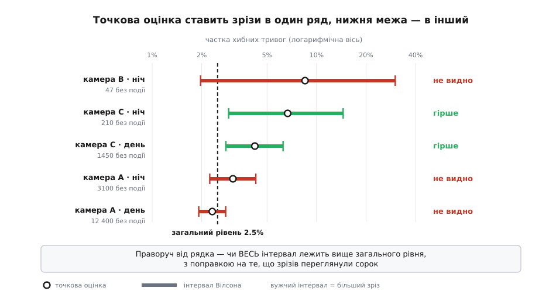
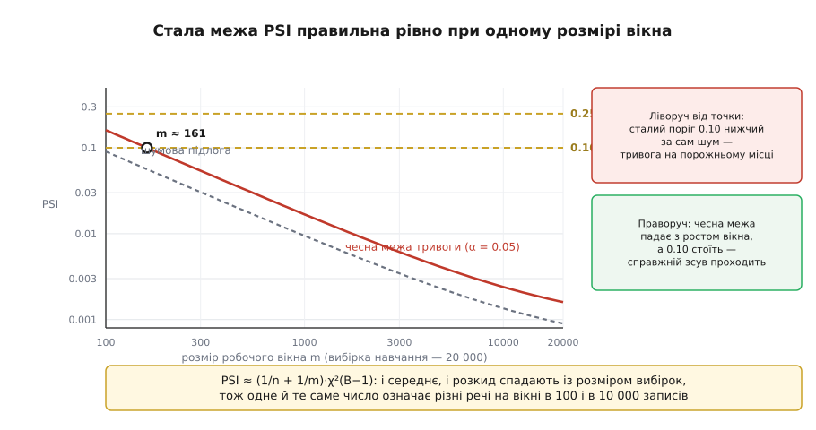

# ⚙️ Аудит меж моделі: похибка по зрізах і зсув входів

Це два робочі прилади, що перетворюють фразу «модель має межі» на числа, які можна щоранку прочитати з панелі: наскільки модель гірша на кожному окремому зрізі даних і наскільки сьогоднішній потік входів відійшов від того, на чому її навчали.

Чому одного зведеного числа для цього не досить, видно з арифметики. Зведена похибка — це середнє по зрізах, зважене їхніми розмірами. Нехай зріз займає 2% потоку, і модель хибить на ньому вдесятеро частіше, ніж деінде:

```
похибка деінде          2.5%
похибка на зрізі       25.0%   (вдесятеро гірше)
частка зрізу в потоці   2%

зведена = 0.98·0.025 + 0.02·0.250 = 0.0245 + 0.0050 = 0.0295 = 2.95%
```

Зріз, де кожен четвертий випадок розібрано неправильно, підняв зведене число з 2.5% до 2.95%. Менш ніж пів відсоткового пункту — рівно стільки, скільки воно гуляє від тижня до тижня саме собою. Число не бреше; воно просто відповідає не на те запитання, яке нас цікавить.

## Приладів два, бо мітки приходять пізно

Розклад похибки по зрізах вимагає знати, як було насправді. Правда про конкретний випадок приходить із затримкою — коли пацієнта виписали, коли оператор переглянув кадр, коли позов дійшов до суду. Часом вона не приходить узагалі. Тож цей прилад дає вирок, але із запізненням на дні або тижні.

Другий прилад міряє те, що доступне негайно: самі входи. Він не знає жодної правильної відповіді й тому не може сказати «модель погіршала» — він каже «те, що приходить на вхід, більше не схоже на навчальні дані». Це слабше твердження, але воно приходить сьогодні, а не за два тижні. І воно не випадкове: [зсув розподілу входів](topic:sf-ml/distribution-shift) — це саме та подія, після якої виміряна на тесті похибка перестає бути обіцянкою. Зсув без падіння якості трапляється часто; падіння якості без зсуву входів теж буває (змінилася не картинка, а те, що вважають правильною відповіддю). Але зі зсувом варто йти й дивитися, а не чекати міток.

## Зріз, чотири лічильники — і чому знаменники різні

Зріз — це група записів, відібраних за значеннями кількох описових полів: камера, час доби, регіон, версія прошивки. Поля не обов'язково є ознаками моделі; важливо лише, щоб вони були в журналі й щоб різниця за ними мала сенс для людини, яка потім розбиратиме тривогу.

На кожен зріз тримаємо чотири лічильники — по одному на кожне поєднання «модель підняла тривогу / не підняла» з «подія була / не була». З них дві частки, які нас цікавлять:

```
частка хибних тривог = FP / (FP + TN)   ← серед випадків, де події НЕ БУЛО
частка пропусків     = FN / (FN + TP)   ← серед випадків, де подія БУЛА
```

Знаменники тут різні, і це не формальність. Спокуса поділити те й те на загальний розмір зрізу велика, а результат виходить непридатний: зрізи відрізняються не лише якістю моделі, а й тим, як часто в них узагалі стається подія. Візьміть зріз, де подія трапляється раз на тисячу записів. Навіть якщо модель пропускає геть усе, «частка пропусків від розміру зрізу» вийде 0.1% — на вигляд чудово. Ділення на кількість випадків із подією прибирає базову частоту з числа й лишає в ньому саму лише поведінку моделі; те саме роблять [метрики детектора](topic:sf-visual/detection-metrics) взагалі.

## Найгірший зріз майже завжди найменший

Тепер найважливіше, і воно не про модель. Розбийте потік на сорок зрізів — і в кожному лишиться в середньому в сорок разів менше записів, а в найдрібніших — на два порядки менше. Спостережена частка гуляє навколо справжньої тим ширше, чим менше записів у знаменнику: кількість хибних тривог у зрізі — це [біноміальна](topic:math-probability/binomial-distribution) величина, її стандартне відхилення росте як √n, а частка, тобто відношення до n, розмивається як 1/√n. Коли ви впорядковуєте сорок зрізів за спостереженою часткою й дивитеся на верхній, ви з високою ймовірністю дивитеся на найменший зріз, якому просто не пощастило.

Тому впорядковувати треба не за часткою. Потрібне число, яке саме враховує розмір: [довірчий інтервал](topic:math-probability/confidence-interval) — діапазон значень справжньої частки, сумісних із побаченим. Найпростіша його форма, `p̂ ± z·√(p̂(1−p̂)/n)`, тут не годиться саме там, де вона найпотрібніша: при `p̂ = 0` вона дає нульову ширину («частка хибних тривог рівно нуль»), а при частках біля краю вилазить за межі від нуля до одиниці. Едвін Вілсон 1927 року побудував інтервал з іншого боку — не навколо спостереженої частки, а як множину тих справжніх часток, для яких спостережена не є неправдоподібною. Такий інтервал ніколи не виходить за нуль і одиницю й не схлопується на нулі:

```
          p̂ + z²/(2n)  ±  z·√( p̂·(1−p̂)/n + z²/(4n²) )
lo, hi = ────────────────────────────────────────────────
                        1 + z²/n
```

Лишилося вибрати `z`. І тут є друга пастка, окрема від першої. Ми не перевіряємо один наперед названий зріз — ми переглядаємо сорок і беремо найгірший. Найбільше з сорока випадкових відхилень майже завжди більше за окремо взяте — а ми дивимося саме на нього; про цю різницю й говорить [поправка на множинні порівняння](topic:math-probability/multiple-comparisons). Найгрубіша й найнадійніша її форма: поділити рівень на кількість переглянутих зрізів. Метод носить ім'я італійського математика Карло Емільйо Бонферроні, чиї нерівності під ним лежать, але для довірчих інтервалів його виклала Олів Джин Данн 1961 року (*Journal of the American Statistical Association*, 56, 52–64). Для сорока зрізів і рівня 0.05 замість звичного `z = 1.96` виходить `z = 3.23`.

**Приклад: зріз «камера B · ніч» — 4 хибні тривоги на 47 випадків без події, загальний рівень 2.5%**

```
p̂ = 4/47 = 0.0851  — у 3.4 раза більше за загальний рівень

без поправки на перебір зрізів, z = 1.960
  знаменник  1 + 3.8416/47                                    = 1.0817
  середина   (0.0851 + 3.8416/94) / 1.0817                     = 0.1165
  півширина  1.960·√(0.0851·0.9149/47 + 3.8416/8836) / 1.0817  = 0.0829
  інтервал   [0.034, 0.199]

з поправкою на 40 переглянутих зрізів, z = 3.227
  інтервал   [0.020, 0.301]
```

Нижня межа — 2.0%, тобто нижча за загальні 2.5%. Зріз, що очолював список за спостереженою часткою, від решти потоку не відрізняється: у ньому просто немає стільки записів, щоб відділити «в кілька разів гірше» від «як усюди».

А ось зріз «камера C · день», який у списку за часткою стояв аж третім (4.21%): 61 хибна тривога на 1450 випадків без події дає з тією самою поправкою інтервал [0.028, 0.063]. Він увесь лежить вище за 2.5%. Цей зріз гірший доведено — а той, що був першим, ні.


*Порядок за точковою оцінкою (згори вниз) і порядок за нижньою межею — різні списки. Зверху стоїть зріз із сорока семи записів, чий інтервал розтягнувся на цілий порядок; доведено гіршими виявилися два зрізи однієї камери, серед яких і денний. Гіпотеза «модель ламається вночі» вмирає, гіпотеза «ламається камера C» лишається.*

> 🔧 **Навіщо це.** Нижня межа — це і є те число, яке можна нести на нараду. Точкова оцінка «8.5% проти 2.5%» розсипається від першого ж запитання «а скільки там записів?», і розмова перетворюється на суперечку про довіру до цифри. Нижня межа відповідає на це запитання наперед: у ній уже враховано і розмір зрізу, і те, що зрізів переглядали сорок. За нею ж і вибудовують чергу на розбір — інакше інженери місяцями ганяються за зрізами з десятка записів, а справжня поламана камера чекає.

## Контур зрізів у коді

Обидва проходи — і накопичення, і звіт — лінійні за журналом, а в пам'яті лишаються не записи, а самі лише лічильники.

:::tabs
```cpp
#include <algorithm>
#include <cmath>
#include <cstdint>
#include <string>
#include <unordered_map>
#include <vector>

// Один запис робочого журналу. Мітка truth дописується пізніше за рішення —
// коли випадок нарешті перевірили.
struct Event {
    std::string slice;   // ключ зрізу: "cam=C|hour=night"
    bool        alarm;   // модель підняла тривогу (оцінка ≥ поріг)
    bool        truth;   // подія справді була
};

// Уся пам'ять, яку коштує зріз: чотири лічильники.
struct Cell {
    std::uint64_t tp = 0, fp = 0, fn = 0, tn = 0;
    std::uint64_t with_event()    const { return tp + fn; }  // випадків, де подія БУЛА
    std::uint64_t without_event() const { return fp + tn; }  // де її НЕ було
};

// Прохід перший: розкласти журнал по зрізах. O(n) часу, O(k) пам'яті.
void accumulate(const std::vector<Event>& log,
                std::unordered_map<std::string, Cell>& by_slice) {
    for (const Event& e : log) {
        Cell& c = by_slice[e.slice];
        if (e.truth) { if (e.alarm) ++c.tp; else ++c.fn; }
        else         { if (e.alarm) ++c.fp; else ++c.tn; }
    }
}

struct Interval { double lo, hi; };

// Квантиль нормалі: таке z, що P(Z > z) = tail. Бісекція по erfc, яка спадає
// монотонно, тож шістдесяти кроків вистачає з великим запасом.
double z_for_tail(double tail) {
    double lo = 0.0, hi = 12.0;
    for (int i = 0; i < 64; ++i) {
        const double mid = 0.5 * (lo + hi);
        if (0.5 * std::erfc(mid / std::sqrt(2.0)) > tail) lo = mid;
        else                                              hi = mid;
    }
    return 0.5 * (lo + hi);
}

// Інтервал Вілсона для частки k/n: не вилазить за [0,1] і не схлопується,
// коли k = 0. Саме він робить малий зріз чесно широким.
Interval wilson(std::uint64_t k, std::uint64_t n, double z) {
    if (n == 0) return { 0.0, 1.0 };
    const double nn   = static_cast<double>(n);
    const double p    = static_cast<double>(k) / nn;
    const double z2   = z * z;
    const double den  = 1.0 + z2 / nn;
    const double mid  = (p + z2 / (2.0 * nn)) / den;
    const double half = z * std::sqrt(p * (1.0 - p) / nn + z2 / (4.0 * nn * nn)) / den;
    return { std::max(0.0, mid - half), std::min(1.0, mid + half) };
}

struct Row {
    std::string   slice;
    std::uint64_t n_without, n_with;
    double        far, far_lo, far_hi;   // хибні тривоги серед випадків без події
    double        mis, mis_lo, mis_hi;   // пропуски серед випадків із подією
};

// Прохід другий: лічильники у звіт. O(k log k) — уся вартість у впорядкуванні.
std::vector<Row> report(const std::unordered_map<std::string, Cell>& by_slice,
                        std::uint64_t min_n, double alpha) {
    // Скільки зрізів переглядаємо — стільки разів і маємо шанс випадково
    // «знайти» найгірший. Рівень ділимо саме на це число.
    std::size_t k = 0;
    for (const auto& kv : by_slice)
        if (kv.second.without_event() >= min_n || kv.second.with_event() >= min_n) ++k;
    if (k == 0) return {};
    const double z = z_for_tail(alpha / (2.0 * static_cast<double>(k)));

    std::vector<Row> out;
    out.reserve(k);
    for (const auto& kv : by_slice) {
        const Cell& c = kv.second;
        const std::uint64_t nw = c.without_event(), np = c.with_event();
        if (nw < min_n && np < min_n) continue;          // замалий — не звітуємо взагалі

        const Interval fi = wilson(c.fp, nw, z);
        const Interval mi = wilson(c.fn, np, z);
        out.push_back(Row{ kv.first, nw, np,
                           nw ? static_cast<double>(c.fp) / nw : 0.0, fi.lo, fi.hi,
                           np ? static_cast<double>(c.fn) / np : 0.0, mi.lo, mi.hi });
    }
    // Упорядковуємо за НИЖНЬОЮ межею, а не за самою часткою: угорі має бути
    // зріз, гірший доведено, а не той, що гірший на вигляд.
    std::sort(out.begin(), out.end(),
              [](const Row& a, const Row& b) { return a.far_lo > b.far_lo; });
    return out;
}
```
```py
import math
from collections import defaultdict
from dataclasses import dataclass
from statistics import NormalDist


@dataclass
class Cell:
    """Уся пам'ять, яку коштує зріз: чотири лічильники."""
    tp: int = 0
    fp: int = 0
    fn: int = 0
    tn: int = 0

    @property
    def with_event(self) -> int:      # випадків, де подія БУЛА
        return self.tp + self.fn

    @property
    def without_event(self) -> int:   # де її НЕ було
        return self.fp + self.tn


def accumulate(log) -> dict[str, Cell]:
    """Прохід перший: журнал (зріз, тривога, правда) → лічильники. O(n) часу, O(k) пам'яті."""
    by_slice = defaultdict(Cell)
    for name, alarm, truth in log:
        c = by_slice[name]
        if truth:
            if alarm: c.tp += 1
            else:     c.fn += 1
        else:
            if alarm: c.fp += 1
            else:     c.tn += 1
    return dict(by_slice)


def wilson(k: int, n: int, z: float) -> tuple[float, float]:
    """Інтервал Вілсона: лишається в [0,1] і не схлопується, коли k = 0."""
    if n == 0:
        return 0.0, 1.0
    p, z2 = k / n, z * z
    den = 1.0 + z2 / n
    mid = (p + z2 / (2 * n)) / den
    half = z * math.sqrt(p * (1 - p) / n + z2 / (4 * n * n)) / den
    return max(0.0, mid - half), min(1.0, mid + half)


@dataclass
class Row:
    name: str
    n_without: int
    n_with: int
    far: float                        # частка хибних тривог
    far_ci: tuple[float, float]
    mis: float                        # частка пропусків
    mis_ci: tuple[float, float]


def report(by_slice: dict[str, Cell], min_n: int = 30, alpha: float = 0.05) -> list[Row]:
    """Прохід другий: лічильники → звіт, упорядкований за НИЖНЬОЮ межею."""
    kept = {s: c for s, c in by_slice.items()
            if c.without_event >= min_n or c.with_event >= min_n}
    if not kept:
        return []
    # скільки зрізів переглядаємо — стільки разів маємо шанс «знайти» найгірший
    z = NormalDist().inv_cdf(1 - alpha / (2 * len(kept)))

    rows = [Row(name, c.without_event, c.with_event,
                c.fp / c.without_event if c.without_event else 0.0,
                wilson(c.fp, c.without_event, z),
                c.fn / c.with_event if c.with_event else 0.0,
                wilson(c.fn, c.with_event, z))
            for name, c in kept.items()]
    # угорі — зріз, гірший доведено, а не той, що гірший на вигляд
    return sorted(rows, key=lambda r: -r.far_ci[0])
```
:::

Ключ зрізу тут — рядок, і це навмисне: він читається в журналі очима, лягає в хеш-таблицю без окремого типу й дозволяє дописати нове поле, не міняючи структур. Ціною за це є хешування рядка на кожен запис; коли прохід стає гарячим, ключ згортають у ціле число з фіксованих полів, а таблицю замінюють на масив.

## Другий прилад: наскільки зсунувся вхід

Тепер до входів, де міток не треба зовсім. Хочемо одне число на ознаку: наскільки її сьогоднішній розподіл відрізняється від навчального. Обидва розподіли ми знаємо не як формули, а як [гістограми](topic:sf-visual/histogram) — частки `pᵢ` та `qᵢ`, що потрапили в кожен бін.

Природна міра різниці двох розподілів уже є: [розбіжність Кульбака–Лейблера](topic:math-information/kl-divergence), `D(p‖q) = Σ pᵢ·ln(pᵢ/qᵢ)`. Заковика в тому, що вона несиметрична: `D(p‖q) ≠ D(q‖p)`, бо в її означенні один розподіл вважається справжнім, а другий — наближенням. У нашій задачі такого поділу немає: ні навчальні дані, ні робоче вікно не є «істиною» щодо другого — це просто дві вибірки, і питання лише в тому, чи вони з одного джерела. Тож беремо суму обох напрямів, і вона згортається в напрочуд просту форму:

```
D(p‖q) + D(q‖p) = Σᵢ pᵢ·ln(pᵢ/qᵢ) + Σᵢ qᵢ·ln(qᵢ/pᵢ)
                = Σᵢ pᵢ·ln(pᵢ/qᵢ) − Σᵢ qᵢ·ln(pᵢ/qᵢ)
                = Σᵢ (pᵢ − qᵢ)·ln(pᵢ/qᵢ)
```

Праворуч — рівно те, що в банках понад тридцять років рахують під назвою **індекс стабільності популяції** (англ. *population stability index*, PSI). Найраніша знайдена згадка терміна — підручник Е. М. Льюїса «An Introduction to Credit Scoring» (1994), звідти ж пішли й пороги 0.10 та 0.25. Симетризована розбіжність Кульбака–Лейблера має в статистиці власне ім'я — розбіжність Джеффріса; те, що PSI буквально нею і є, показують три рядки вище, і той самий виклад є в літературі (Юрдакул і Наранхо, *Journal of Risk Model Validation*, 2020). Галузева практика й теорія інформації прийшли сюди з різних боків і зустрілися на одній формулі.

Кожен доданок читається сам по собі: `(pᵢ − qᵢ)` — на скільки бін «схуд» або «погладшав», `ln(pᵢ/qᵢ)` — у скільки разів. Добуток обертається на нуль, коли бін не змінився, і росте швидше за лінійне, коли змінився сильно. Хвостовий бін, який був малий і зник, дає великий внесок саме тому, що логарифм відношення великий.

Границі бінів беруть із **навчальної** вибірки — як її [квантилі](topic:math-probability/percentiles-quantiles), тобто так, щоб у кожен бін потрапила однакова частка навчальних даних. Це дає дві речі одразу. По-перше, жоден навчальний бін не порожній за побудовою, тож `ln pᵢ` завжди скінченний. По-друге, кожен бін важить однаково, і зсув у розрідженому хвості не тоне поруч із серединою розподілу. Границі рахують один раз, кладуть в артефакт моделі поруч із вагами й далі не чіпають ніколи.

:::tabs
```cpp
#include <algorithm>
#include <cmath>
#include <cstdint>
#include <vector>

// Границі бінів — рівночастотні квантилі НАВЧАЛЬНОЇ вибірки.
// Порахували раз під час навчання, поклали в артефакт моделі й заморозили.
struct Binning {
    std::vector<double> edges;                       // внутрішні межі, зростаючі
    std::size_t bins() const { return edges.size() + 1; }
    std::size_t index(double x) const {              // O(log B) на значення
        return static_cast<std::size_t>(
            std::upper_bound(edges.begin(), edges.end(), x) - edges.begin());
    }
};

Binning fit_binning(std::vector<double> train, std::size_t B) {
    Binning b;
    if (train.empty() || B < 2) return b;
    std::sort(train.begin(), train.end());
    for (std::size_t i = 1; i < B; ++i)
        b.edges.push_back(train[train.size() * i / B]);
    // однакові межі означають порожній бін уже на навчанні — такий бін не потрібен
    b.edges.erase(std::unique(b.edges.begin(), b.edges.end()), b.edges.end());
    return b;
}

std::vector<std::uint64_t> histogram(const Binning& b, const std::vector<double>& xs) {
    std::vector<std::uint64_t> h(b.bins(), 0);
    for (double x : xs) ++h[b.index(x)];             // O(n log B) на весь потік
    return h;
}

// Частки з півдодаванням Джеффріса: (xᵢ + ½)/(N + B/2). Порожній бін перестає
// давати ln(0), а внесене зміщення спадає як 1/N.
std::vector<double> shares(const std::vector<std::uint64_t>& h) {
    const std::size_t B = h.size();
    double total = 0.0;
    for (std::uint64_t c : h) total += static_cast<double>(c);
    std::vector<double> p(B);
    for (std::size_t i = 0; i < B; ++i)
        p[i] = (static_cast<double>(h[i]) + 0.5)
             / (total + 0.5 * static_cast<double>(B));
    return p;
}

// PSI = Σ (pᵢ − qᵢ)·(ln pᵢ − ln qᵢ). O(B): уся робота вже зроблена в гістограмах.
double psi(const std::vector<double>& p, const std::vector<double>& q) {
    double s = 0.0;
    for (std::size_t i = 0; i < p.size(); ++i)
        s += (p[i] - q[i]) * (std::log(p[i]) - std::log(q[i]));
    return s;
}

// Межа тривоги замість сталих 0.10 і 0.25: (1/n + 1/m)·(B−1 + z_α·√(2(B−1))).
double psi_alarm(std::uint64_t n, std::uint64_t m, std::size_t B, double alpha) {
    const double df = static_cast<double>(B) - 1.0;
    return (1.0 / static_cast<double>(n) + 1.0 / static_cast<double>(m))
         * (df + z_for_tail(alpha) * std::sqrt(2.0 * df));
}
```
```py
import bisect
import math
from dataclasses import dataclass, field
from statistics import NormalDist


@dataclass
class Binning:
    """Границі бінів — рівночастотні квантилі НАВЧАЛЬНОЇ вибірки. Заморожені назавжди."""
    edges: list[float] = field(default_factory=list)

    @classmethod
    def fit(cls, train: list[float], bins: int) -> "Binning":
        s = sorted(train)
        raw = [s[len(s) * i // bins] for i in range(1, bins)]
        return cls(sorted(set(raw)))   # однакові межі = порожній бін уже на навчанні

    @property
    def bins(self) -> int:
        return len(self.edges) + 1

    def histogram(self, xs) -> list[int]:
        h = [0] * self.bins
        for x in xs:                   # O(n log B) на весь потік
            h[bisect.bisect_right(self.edges, x)] += 1
        return h


def shares(h: list[int]) -> list[float]:
    """Півдодавання Джеффріса: (xᵢ + ½)/(N + B/2) — нуль перестає давати ln(0)."""
    total, B = sum(h), len(h)
    return [(c + 0.5) / (total + 0.5 * B) for c in h]


def psi(p: list[float], q: list[float]) -> float:
    """PSI = Σ (pᵢ − qᵢ)·(ln pᵢ − ln qᵢ)."""
    return sum((pi - qi) * (math.log(pi) - math.log(qi)) for pi, qi in zip(p, q))


def psi_alarm(n: int, m: int, bins: int, alpha: float = 0.05) -> float:
    """Межа тривоги замість сталих 0.10 і 0.25."""
    df = bins - 1
    return (1 / n + 1 / m) * (df + NormalDist().inv_cdf(1 - alpha) * math.sqrt(2 * df))
```
:::

## Порогів 0.10 і 0.25 не існує

Ті два числа з підручника 1994 року розійшлися по всій галузі й досі стоять у безлічі панелей. Вони не виведені ні з чого — це домовленість, і легко показати, що жодна стала домовленість тут працювати не може.

Візьміть дві вибірки з **того самого** розподілу — зсуву немає взагалі. PSI на них не дорівнює нулю: частки в бінах гуляють через саме лише випадкове потрапляння записів у біни, а формула на цьому гулянні дає додатне число. Скільки саме — вивели Білал Юрдакул і Джошуа Наранхо (*Journal of Risk Model Validation*, 14(4), 2020, с. 89–100), розклавши логарифми в ряд Тейлора біля рівних часток. Виявилося, що PSI, поділений на `(1/n + 1/m)`, наближено має [розподіл χ²](topic:math-probability/chi-squared-test) з `B−1` степенями вільності. Звідси три числа, які й треба тримати перед очима:

```
PSI ≈ (1/n + 1/m) · χ²(B−1)

шумова підлога   E[PSI] = (1/n + 1/m)·(B−1)
розкид           sd     = (1/n + 1/m)·√(2(B−1))
межа тривоги     PSI > (1/n + 1/m)·(B−1 + z_α·√(2(B−1)))
```

Обидва — і середнє, і розкид — обернено пропорційні розмірам вибірок. Це й ховає сталий поріг: одне й те саме число означає геть різні речі на вікні в сто записів і на вікні в десять тисяч.

**Приклад: навчальна вибірка 20 000 записів, 10 бінів, рівень тривоги α = 0.05**

```
вікно m = 1000
  1/n + 1/m = 1/20000 + 1/1000            = 0.00105
  шумова підлога   0.00105·9              = 0.0095
  розкид           0.00105·√18            = 0.0045
  межа тривоги     0.00105·(9 + 1.645·√18) = 0.0168

вікно m = 100
  1/n + 1/m = 1/20000 + 1/100             = 0.01005
  шумова підлога   0.01005·9              = 0.0905
  межа тривоги     0.01005·15.98          = 0.161
```

На тисячному вікні чесна межа — 0.017, а не 0.10: зсув, від якого PSI підскочив до 0.06, уже реальний, але усталений поріг про нього мовчить. На сотенному вікні чесна межа — 0.16, і сам лише шум дає в середньому 0.09, тож поріг 0.10 спрацьовує на порожньому місці. Юрдакул і Наранхо це й перевірили імітацією: за `n = m = 100` і десяти бінів правило «PSI > 0.10» здіймало тривогу у 84.9% прогонів, де жодного зсуву не було. Формула вище відтворює опубліковані ними таблиці критичних значень із точністю до другого знака.


*Чесна межа спадає разом із розміром вікна, а стала лінія стоїть. Точка перетину — єдиний розмір вибірки, при якому усталений поріг правильний; ліворуч від неї він б'є тривогу на самому шумі, праворуч пропускає справжній зсув. Обидві похилі лінії прямі, бо і підлога, і межа обернено пропорційні розміру вікна.*

## Ціна згладженого нуля

Бін, у який за все вікно не потрапив жоден запис, дає `ln 0` і обертає PSI на нескінченність. Формально це навіть чесно: розподіли розійшлися так, що один приписує події нульову ймовірність. Але нескінченність не покласти на графік і не порівняти з учорашнім значенням, тож нуль треба чимось замінити.

Стандартний спосіб — додати до кожного лічильника пів запису й відповідно поправити знаменник: `(xᵢ + ½)/(N + B/2)`. Половина тут не з повітря: це оцінка часток за апріорним розподілом Джеффріса, який симетричний до перестановки бінів і не тягне жодного з них на себе. Але ціна є, і її треба назвати. Ось порожній бін, що на навчанні тримав 10% даних, у вікні на 1000 записів і десять бінів:

```
додаємо +0.5:  q = 0.5/1005  = 0.000498 → внесок біна = 0.528
додаємо +1.0:  q = 1.0/1010  = 0.000990 → внесок біна = 0.457
додаємо +0.1:  q = 0.1/1001  = 0.000100 → внесок біна = 0.690
```

Тривога спрацює в усіх трьох випадках, і це головне. Але саме число залежить від сталої, яку ніхто не бачить у формулі, — а отже, PSI від двох команд із різними сталими не можна порівнювати й не можна класти в спільну панель. Стала має бути записана в специфікації поруч із кількістю бінів, інакше через рік ніхто не пояснить, чому в сусідів «те саме» число інше.

Кращий вихід — зробити так, щоб порожніх бінів не було: рівночастотні границі гарантують це на навчанні, а для вікна діє просте правило — у середньому в бін має падати щонайменше кілька десятків записів, тобто `m ≳ 30·B`. Якщо вікно менше, PSI на ньому все одно нічого не міряє (див. шумову підлогу вище), тож правильна дія — не згладжувати сильніше, а зачекати, доки вікно набереться.

## Складність і пастки

Обидва контури лінійні за потоком і не тримають його в пам'яті. Розкладання по зрізах — `O(n)` часу й `O(k)` пам'яті: чотири 64-бітні лічильники на зріз, тобто 32 байти плюс сам ключ, і навіть десять тисяч зрізів — це менше за мегабайт. Звіт додає `O(k log k)` на впорядкування. Гістограми — `O(n log B)` через двійковий пошук по границях (для рівноширих бінів пошук замінюється на одне ділення й стає `O(n)`), пам'ять — `O(F·B)` на `F` ознак. Сам PSI — `O(B)`. Усе це рахується інкрементно, тож обидва прилади живуть у тому самому потоці, що й модель.

Далі — місця, де ці числа тихо перестають означати те, що на них написано.

**Зріз, замалий для запитання, яке до нього ставлять.** Півширина інтервалу поводиться як `z·√(p/n)`; щоб побачити відносну різницю `r` на рівні часток `p`, потрібно приблизно `n ≈ z²/(r²·p)` записів. Для `p = 2.5%`, `r = 0.5` (тобто «у півтора раза гірше») і `z = 3.23` це 1670 випадків без події **на зріз**. Число варто порахувати наперед: воно каже, скільки зрізів ви взагалі можете собі дозволити, і майже завжди виходить, що менше, ніж хотілося.

**Кількість зрізів входить у поправку.** Додати ще один вимір розбиття — не безкоштовно: кожен новий зріз піднімає `z` для **всіх** інших і робить кожен окремий висновок слабшим. Тому перелік зрізів обирають наперед і свідомо, як частину специфікації, а не отримують із «згрупувати за всіма полями».

**Мітки бачать не всі випадки.** Якщо людина переглядає лише ті записи, де модель підняла тривогу, `FN` не спостерігається в принципі: пропуск ніхто не відкриває. Частка хибних тривог тоді міряється чесно, а частка пропусків виходить нульовою — не тому, що пропусків немає, а тому, що на них ніхто не дивився. Лікується це лише вибірковою перевіркою записів **без** тривоги: перевіряють випадкову частку `f`, знайдені пропуски ділять на `f`, а до інтервалу додають ще й невизначеність цієї частки.

**Границі, перераховані наново.** Найпоширеніша поламка PSI: границі бінів перераховують щодня з тих самих робочих даних, які ними ж і міряють. Тоді частки в бінах за побудовою виходять рівними, PSI сідає біля своєї шумової підлоги й ніколи не спрацьовує. Границі належать артефакту моделі, а не завданню моніторингу.

**Відсутнє значення падає в останній бін.** І `std::upper_bound`, і `bisect_right` на `NaN` повертають кінець масиву, бо всі порівняння з `NaN` хибні. Ознака, яка почала приходити порожньою, тихо переллється у верхній бін і виглядатиме як зсув угору. Порожнє значення заводять окремим біном, і його частка сама стає окремим спостережуваним числом — часто найранішим сигналом із усіх.

**PSI по ознаках нарізно не бачить зсуву в парі.** Хай день і ніч ділять потік навпіл, а камери A і B — теж навпіл, і так було на навчанні. Тепер уявіть, що A і B помінялися змінами: кожен окремий розподіл лишився той самий, PSI по кожній ознаці дорівнює нулю, а поєднання ознак у потоці стало геть іншим. Проти цього допомагає дешевий прийом: рахувати PSI ще й на **виході** самої моделі — оцінка є функцією всіх ознак одразу, тож спільний зсув зазвичай зрушує її розподіл, навіть коли жодна крайова гістограма не поворухнулася.
