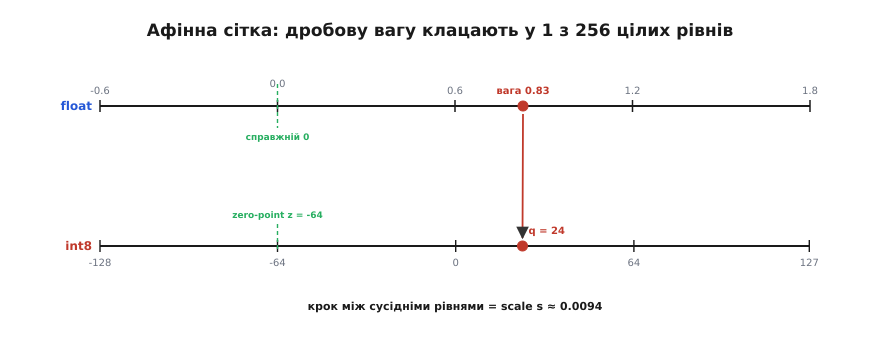
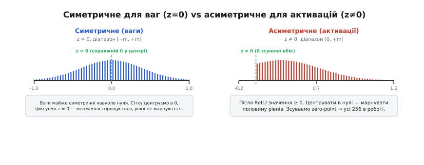
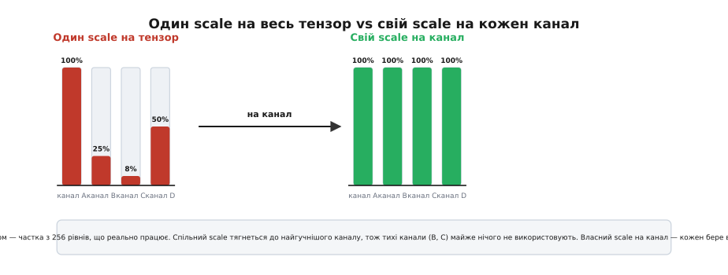
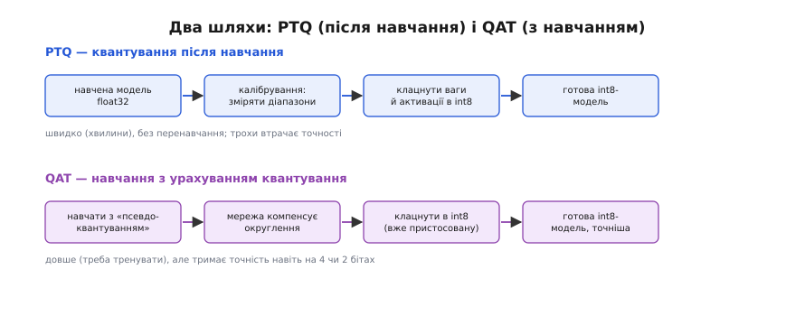

# Квантування нейромереж

Нейромережа зберігає свої знання в **вагах** — числах, на які вона множить входи. За звичкою кожну вагу тримають як 32-бітне дробове число (float32, 4 байти): майже безмежна точність, десяткові розряди до сьомого знаку. Питання, з якого все починається: **а чи потрібна така точність?** Виявляється — ні. Вагу `0.7134201` можна округлити до `0.71` — і мережа впізнає ту саму кицьку. Квантування (від лат. *quantum* — скільки, порція) саме про це: замінити багаті дробові числа **лічені цілі рівні** й зберігати кожне число одним байтом замість чотирьох. Розмір падає вчетверо, арифметика стає цілочисельною (а отже, дешевою), а точність — ледь-ледь.

Це не дрібна оптимізація наприкінці. Без квантування важка модель просто **не поїде** на телефоні чи [бортовому мікроконтролері](root:sf-ml/tinyml): не влізе в пам'ять, з'їсть батарею, не встигне за кадром. Тому варто розібрати не гасло «int8 менший за float32», а **механіку**: як саме дробове число перекласти в ціле й назад так, щоб мережа цього майже не відчула, і чому потім усе множення можна вести **самими цілими**.

### Головна ідея: сітка рівнів замість неперервної осі

Дробове число живе на **неперервній** осі — між будь-якими двома значеннями завжди є ще одне. Ціле 8-бітне число має рівно **256** значень (від −128 до 127). Квантувати — означає накинути на потрібний шматок неперервної осі **рівномірну сітку з 256 поділок** і кожне дробове число «клацнути» до найближчого вузла.

Щоб таку сітку задати, треба всього два числа. Перше — **крок** сітки, наскільки далеко один рівень від сусіднього; його звуть **scale** (масштаб), позначимо `s`. Друге — де на осі стоїть **справжній нуль**: яке ціле відповідає дробовому `0.0`. Це **zero-point** (нульова точка), ціле число `z`. Маючи `s` і `z`, переклад в обидва боки — це два рядки арифметики:

```
квантувати (float → int):   q = round(r / s) + z
відновити  (int → float):   r ≈ s · (q − z)
```

Тут `r` — реальне (дробове) значення, `q` — його цілий код. Читається просто: щоб закодувати число, ділимо його на крок (скільки кроків від нуля), округлюємо й додаємо зсув `z`; щоб відновити — прибираємо зсув і множимо на крок. Відновлене `r` **не точно** дорівнює вихідному — округлення внесло крихітну похибку, не більшу за пів кроку `s/2`. Оце «майже, з похибкою до пів поділки» і є вся ціна квантування.


*Зверху — неперервна вісь дробових ваг зі справжнім нулем; знизу — 256 цілих рівнів int8. Крок між сусідніми рівнями дорівнює scale s, а ціле, що лягає рівно на дробовий нуль, — це zero-point z. Вага 0.83 «клацає» вниз до найближчого рівня (код 24) — саме так одне дробове число стає одним байтом.*

Звідки беруться самі `s` і `z`? З **діапазону** значень. Скажімо, ваги якогось шару лежать між −0.6 і 1.8. Ми розтягуємо ці 256 рівнів рівно на цей відрізок: крок `s = (1.8 − (−0.6)) / 255 ≈ 0.0094`, а `z` добираємо так, щоб код нуля влучив у сітку без похибки. Уся хитрість — **чесно знайти діапазон**: візьмеш замалий — гучні ваги обріжуться (зашкалять), візьмеш завеликий — рівні розтягнуться намарно й дрібні відмінності зіллються. Це називають **калібруванням**, і до нього ми повернемось.

> 🔧 **Навіщо це.** Два числа на тензор — `s` і `z` — це вся «карта переходу» між дробовим світом навчання і цілочисельним світом пристрою. Зберігаєш ваги як int8 (×4 менше), а поруч тримаєш крихітну пару `(s, z)`, щоб будь-коли відновити приблизне дробове. На цій парі тримається все: помилишся з діапазоном на калібруванні — і точна модель почне «галюцинувати» не через архітектуру, а через обрізані або розмазані ваги.

### Симетрична й асиметрична сітка: коли нуль у центрі

Zero-point `z` дає сітці свободу **зсуватися** вбік. Але потрібна ця свобода не завжди, і тут з'являються два різновиди квантування.

Погляньмо на ваги навченого шару: майже завжди вони розкидані **симетрично** навколо нуля — стільки ж додатних, скільки від'ємних, гаусоподібна хмара з центром у `0`. Для такої хмари природно взяти сітку теж симетричну: діапазон `[−m, +m]`, а нуль — рівно посередині. Тоді `z = 0`, і формула спрощується до `q = round(r / s)`. Це **симетричне** квантування. Воно любе апаратурі: коли `z = 0`, при множенні не треба щоразу віднімати зсув — про це трохи згодом.

А тепер погляньмо на **активації** — числа, що біжать між шарами. Після [ReLU](root:sf-ml/activation-functions) (яка обнуляє все від'ємне) вони **невід'ємні**: лежать, скажімо, в `[0, 1.6]`. Якби ми накинули симетричну сітку `[−1.6, 1.6]`, то **половина** рівнів (усі від'ємні) простоювала б — жодна активація туди не потрапить. Марнувати 128 з 256 рівнів — розкіш, коли їх і так мало. Тому для активацій сітку **зсувають**: `z ≠ 0` посуває нуль до краю, і всі 256 рівнів лягають на реально зайнятий відрізок `[0, 1.6]`. Це **асиметричне** (афінне) квантування.


*Ліворуч ваги — симетрична хмара навколо нуля: сітку центруємо, z=0, множення спрощується. Праворуч активації після ReLU невід'ємні: центрувати сітку в нулі означало б віддати половину рівнів простоювати, тож zero-point зсувають убік і всі 256 рівнів працюють. Звідси типовий поділ: ваги квантують симетрично, активації — асиметрично.*

Звідси усталений розподіл ролей: **ваги — симетрично** (їхня хмара й так центрована, а `z=0` пришвидшує множення), **активації — асиметрично** (їхній діапазон зсунений, шкода рівнів). Це не догма — трапляється й навпаки, — але як за замовчуванням працює в більшості інструментів.

### Один scale на всіх чи кожному свій: per-tensor і per-channel

Досі ми мовчки припускали, що на весь тензор ваг — **одна** сітка, одна пара `(s, z)`. Це зветься **per-tensor** (на тензор). Просто, але з пасткою.

У [згортковому шарі](root:sf-ml/cnn) тензор ваг — це стос **фільтрів** (вихідних каналів), і розмах ваг у різних фільтрах буває **дуже різний**: один канал крутить ваги в межах ±1.0, сусідній — ледь ±0.08. Якщо накинути на них **спільну** сітку, її крок `s` муситиме дотягтися до найгучнішого каналу (±1.0). Але тоді для тихого каналу (±0.08) ця сітка **завелика**: усі його ваги збіжаться в кілька центральних рівнів біля нуля, а решта поділок простоюватиме. Тихий канал фактично **втопили** — його тонкі відмінності зникли в округленні, і мережа на ньому подурнішала.

Ліки — дати **кожному вихідному каналу свій scale**. Це **per-channel** (на канал): замість однієї `s` — масив, по одній на фільтр. Тепер гучний канал міряють великим кроком, тихий — дрібним, і **кожен** використовує всі 256 рівнів на повну. Точність відчутно вища, а платня — лише масив із кількох сотень чисел `s` замість одного (копійки поряд із мегабайтами ваг).


*Кольором показано, яку частку з 256 рівнів канал реально задіює. Ліворуч спільний scale підганяється під найгучніший канал A, тож тихі B і C використовують лічені відсотки рівнів — їхні деталі гинуть. Праворуч кожен канал дістає власний scale й бере всі рівні. Тому ваги майже завжди квантують per-channel.*

Тому ваги квантують **per-channel** — це майже безплатний виграш у точності. А от активації зазвичай лишають **per-tensor**: їхні канали не так розходяться, а головне — активація обчислюється **на льоту** для кожного входу, і мати сотні окремих scale на неї було б і зайвим, і дорогим у ланцюзі множень. Тонше виведення того, чому саме на активаціях per-channel не окупається, а також повний вивід формул сітки — у [математичній вставці про афінну сітку](root:sf-ml/model-quantization/math-affine-quant.md).

### Заради чого все: множення самими цілими

Найглибша причина квантувати — **не** економія пам'яті (хоч і вона важлива), а **швидкість самого обчислення**. І тут криється неочевидне: якщо ваги й активації закодовані цілими, то серце нейромережі — [множення й додавання](root:sf-ml/neuron-layer) — можна вести **не розпаковуючи їх назад у float**. Уся важка робота йде **в цілих числах**, а дробова арифметика торкається діла лише раз наприкінці.

Розберемо на одному нейроні. Він рахує зважену суму: `y = Σ wᵢ · xᵢ`. Підставмо квантовані значення `wᵢ ≈ sᵥ(qᵥᵢ − zᵥ)` і `xᵢ ≈ sₓ(qₓᵢ − zₓ)`. Перемножимо й винесемо scale за дужки:

```
y = Σ [ sᵥ(qᵥᵢ − zᵥ) ] · [ sₓ(qₓᵢ − zₓ) ]
  = sᵥ · sₓ · Σ (qᵥᵢ − zᵥ)(qₓᵢ − zₓ)
```

Придивись до правого боку. Множники `sᵥ` і `sₓ` — **дробові**, але вони **однакові для всієї суми**, тож їх виносять **за** цикл і чіпають один-єдиний раз. А всередині суми — **сама лиш цілочисельна робота**: перемножуємо int8-код ваги на int8-код входу, додаємо. Тисячі таких множень-додавань біжать **тільки на цілих**, а це саме те, що процесор (особливо дешевий мікроконтролер без блоку дробових чисел) робить **швидко й задарма по енергії**.

Одна тонкість — **розмір скарбнички**. Кожен доданок `qᵥ · qₓ` — це добуток двох 8-бітних чисел, а таких доданків тисячі. Сума легко переросте 8 біт, тож накопичують її в **ширшому** цілому — **32-бітному акумуляторі** (int32). У ньому вистачить місця, щоб тисячі int8-добутків не переповнили лічильник. А коли сума зібрана, її наприкінці одним махом переводять назад у 8-бітний масштаб наступного шару — множенням на заздалегідь порахований коефіцієнт `sᵥ · sₓ / s_вих`. Цей фінальний перерахунок звуть **реквантуванням**, і в реальних рушіях його роблять не дробовим множенням, а хитрим цілочисельним (зсув + множення на ціле) — щоб **увесь** шлях лишався в цілих. Робочий C-код такого цілочисельного нейрона — від int8-множення в int32-акумулятор до реквантування — розібрано у [вставці-проєкті про int8-вивід](root:sf-ml/model-quantization/proj-int8-inference.md).

> 🔧 **Навіщо це.** Ось чому квантування пришвидшує, а не лише зменшує: множення `wᵢ·xᵢ` виконується **цілими** (int8×int8 в int32-акумулятор), а єдине дробове множення винесене за весь цикл. На простому мікроконтролері **без апаратних float** різниця не у відсотках, а в рази: цілочисельний [вивід](root:sf-ml/train-vs-inference) там просто **можливий**, а дробовий тягнеться болісно через емуляцію. Симетричні ваги (`z=0`) прибирають зайві доданки із зсувами — тому їх і люблять для швидкодії.

### Два шляхи стиснути: після навчання і з навчанням

Лишилося головне питання практики: **коли** квантувати. Тут два шляхи, і вибір між ними — це вибір між «швидко» і «точно».

**Перший шлях — квантування після навчання (post-training quantization, PTQ).** Береш **уже навчену** float32-модель, проганяєш крізь неї невеликий набір типових даних (**калібрувальний** набір — кількасот прикладів), дивишся, у яких межах гуляють ваги й активації, з цих меж рахуєш `s` і `z` для кожного тензора — і клацаєш усе в int8. Перенавчати не треба, весь процес — **хвилини**. Для int8 цього зазвичай **досить**: точність просідає на частки відсотка, майже непомітно. PTQ — те, з чого починають завжди.

**Другий шлях — навчання з урахуванням квантування (quantization-aware training, QAT).** Іноді int8 замало — хочеться int4 чи ще агресивніше, і тоді груба сітка починає **помітно** псувати відповіді. Ліки — сказати мережі про майбутнє округлення **ще під час навчання**. У прямий прохід вставляють **псевдо-квантування** (fake quantization): значення округляють до сітки, як на пристрої, але лишають дробовими — щоб мережа **бачила** ту саму похибку, яку матиме в бою. Навчання підганяє ваги так, щоб після округлення відповідь усе одно була правильна: мережа **сама компенсує** втрату точності.

Тут ховається гарний трюк. Округлення — **сходинка**: його похідна майже скрізь нуль, а [градієнту](root:sf-ml/gradient-descent) для навчання нема за що зачепитися. Обходять це **прямим оцінювачем градієнта** (straight-through estimator): у прямий прохід округлення діє чесно, а у зворотний його **вдають гладеньким** — пропускають градієнт крізь нього, наче його й немає (похідна = 1). Мережа навчається так, ніби округлення прозоре, — і завдяки цьому вчиться жити з ним.


*Верхня стрічка — PTQ: навчену модель калібрують на кількох сотнях прикладів і клацають в int8 за хвилини, без перенавчання; трохи втрачають точності. Нижня — QAT: у навчання вставляють псевдо-квантування, мережа компенсує округлення й тримає точність навіть на дуже низькій розрядності, але коштує це повного циклу тренування.*

Правило вибору просте. **int8 → PTQ**: дешево, швидко, майже без втрат — так роблять у переважній більшості випадків. **Дуже низька розрядність (int4 і нижче) або чутлива модель, де PTQ помітно псує точність → QAT**: дорожче (треба тренувати), зате тримає якість там, де груба сітка інакше все зіпсувала б. Історію того, як int8-квантування з наукової ідеї стало галузевим стандартом (робота команди Google 2017 року й бібліотека gemmlowp), зібрано в [окремій вставці](root:sf-ml/model-quantization/hist-int8-jacob.md).

### Скільки бітів і скільки коштує похибка

Вісім бітів — не межа, а золота середина. Розрядність можна крутити, і кожен крок униз — це вдвічі менше пам'яті, але грубша сітка:

```
float32 → 32 біти, ~4·10⁹ рівнів   еталон точності, важкий
  int8  →  8 бітів,       256 рівнів   ×4 менше, майже без втрат (типовий вибір)
  int4  →  4 біти,         16 рівнів   ×8 менше, помітно грубше — зазвичай треба QAT
  int2  →  2 біти,          4 рівні    ×16, лише для стійких моделей і з QAT
```

Чому взагалі виходить так дешево обійтися? Бо навчена мережа **надлишкова**: тонкі десяткові розряди ваг несуть майже нуль корисного — мережа впізнає образ і по грубших числах. Округлення до 256 рівнів — це наче стерти шум за третім знаком: змісту не чіпає. А от коли рівнів стає **зовсім** мало (16, 4), груба сітка починає з'їдати вже й змістовну частину — тоді й потрібне QAT, щоб мережа встигла пристосуватися.

І остання, найважливіша порада практики: **міряй просідання точності на самому пристрої, а не вгадуй**. Квантування завжди трохи псує відповідь — питання лише, чи це «трохи» тобі по кишені. Тому робочий цикл такий: квантуй → проганяй на реальних тестових даних → дивись, **наскільки** впала якість → якщо забагато, бери вищу розрядність або переходь на QAT. Ніяких «int8 завжди безпечний» — для однієї задачі безпечний, для іншої з'їсть критичний відсоток.

### Підсумок

Квантування замінює дробові ваги мережі **цілими рівнями**: замість неперервної осі — рівномірна сітка (для int8 — 256 поділок), задана двома числами — кроком **scale** `s` і зсувом **zero-point** `z`; переклад в обидва боки — це `q = round(r/s) + z` і назад `r ≈ s·(q − z)`, з похибкою не більшою за пів кроку. Ваги квантують **симетрично** (`z=0`, хмара й так центрована) і **per-channel** (кожному каналу свій scale, щоб тихі не втопити), активації — **асиметрично** (зсунений діапазон після ReLU) і **per-tensor**. Найбільший виграш — не пам'ять, а те, що множення `wᵢ·xᵢ` іде **самими цілими** (int8×int8 у int32-акумулятор), а єдине дробове множення винесене за весь цикл і зроблене раз при **реквантуванні** — тому на мікроконтролері без float це різниця в рази. Квантувати можна **після навчання** (PTQ — швидко, для int8 майже без втрат) або **з урахуванням квантування** (QAT — вставити псевдо-квантування в навчання, обійти недиференційовне округлення прямим оцінювачем градієнта; дорожче, зате тримає точність на int4 і нижче). Розрядність — від 8 бітів униз, кожен крок дешевший і грубший; а на скільки саме впаде точність — **міряють на пристрої**, не вгадують.
