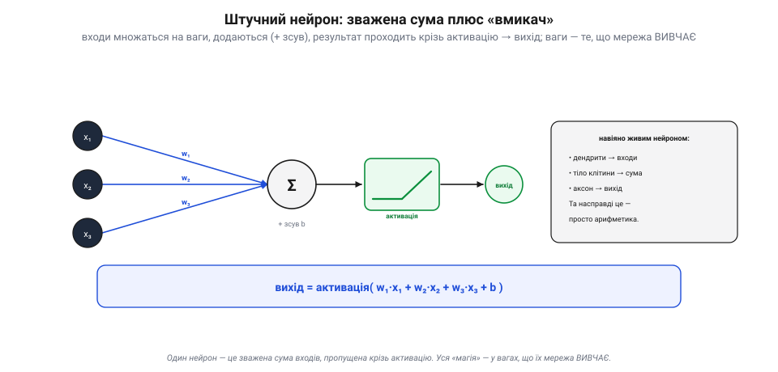
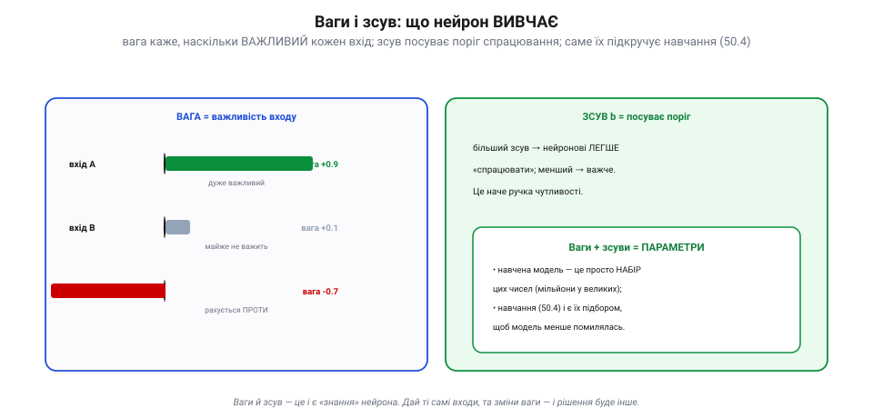
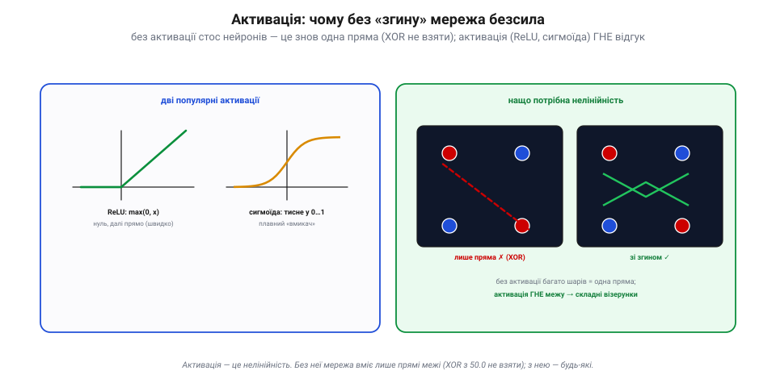
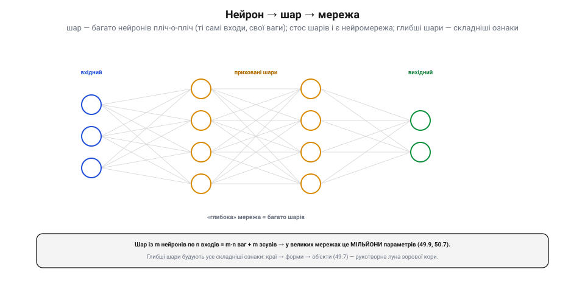

# Нейрон і шар: будівельні цеглинки (ваги, активація)

Нейромережа звучить загадково, та всередині вона складена з украй простих цеглинок. Розберімо їх: атом — **нейрон**, тканина — **шар**, а «знання» — це **ваги** й **активація**. Коли побачиш, із чого збудована модель, «чорна скриня» [нейромережевого детектора](root:sf-visual/nn-detectors) перестане бути такою чорною: це просто **стос зважених сум**.

### Штучний нейрон: зважена сума плюс «вмикач»

**Штучний нейрон** робить три прості дії. Бере кілька **входів** (чисел), множить кожен на свою **вагу**, **додає** все докупи (плюс окреме число — **зсув**), а тоді пропускає суму крізь **активацію** — і видає один вихід.

*Штучний нейрон. Входи (x₁, x₂, x₃) множаться на ваги (w₁, w₂, w₃), додаються разом із **зсувом** b, і ця сума проходить крізь **активацію** → вихід. Формула: **вихід = активація(w₁·x₁ + w₂·x₂ + w₃·x₃ + b)**. Ідею навіяв живий нейрон (дендрити → входи, тіло → сума, аксон → вихід), та насправді це проста арифметика.*

Уся формула — `вихід = активація(w₁·x₁ + w₂·x₂ + w₃·x₃ + b)`. Назва «нейрон» (гр. *neûron* — нерв, жила) — данина біології (вхід нагадує дендрити, сума — тіло клітини, вихід — аксон), але плутати не варто: це **арифметика**, а не жива клітина. І головне: **ваги — це те, що мережа вивчає**; сам нейрон лишається тією самою формулою, а [навчання](root:sf-ml/gradient-descent) просто підбирає числа в ній.

### Ваги і зсув: що нейрон вивчає

Зупинімося на цих числах, бо вони — серце всього. **Вага** каже, наскільки **важливий** кожен вхід для рішення. **Зсув** посуває **поріг** спрацювання.

*Ваги і зсув. **Вага** = важливість входу: велика (наприклад +0.9) — вхід дуже важить; близька до нуля — майже ігнорується; **від'ємна** — рахується **проти**. **Зсув** b — як ручка чутливості: посуває поріг, роблячи нейронові легше чи важче «спрацювати». Разом ваги й зсуви — це **параметри** моделі: навчена мережа — просто набір цих чисел, а навчання і є їх підбором.*

Велика вага — вхід дуже впливає; близька до нуля — майже не зважає; **від'ємна** — вхід рахується **проти** спрацювання. Зсув — ніби ручка чутливості: посунув — і нейронові легше чи важче «загорітися». Усі ці числа разом (ваги + зсуви всіх нейронів) і звуть **параметрами**. Тут — важливе осяяння: **навчена модель — це просто набір чисел** (часто мільйони). [Файл моделі, який ти возиш на дроні](root:sf-ml/train-vs-inference), — це і є ці ваги. А «навчити модель» означає **підібрати** їх так, щоб вона менше помилялася (це й робить [градієнтний спуск](root:sf-ml/gradient-descent)).

### Активація: чому без «згину» мережа безсила

Лишилася остання, та критична деталь — **активація** (від лат. *activus* — дієвий: вона вирішує, наскільки сильно нейрон «оживає»). Це функція, крізь яку пропускають суму. Здавалося б, дрібниця — але без неї нейромережа **безсила**.

*Активація й нелінійність. Дві популярні: **ReLU** — max(0, x): нуль для від'ємних, далі прямо (проста й швидка, типова нині); **сигмоїда** — плавно тисне у 0…1. Навіщо? Без активації хоч скільки шарів дають **усе одно пряму** межу — а нею XOR (точки «по діагоналі») не розітнеш (✗). Активація **гне** відгук, тож мережа вчиться будь-яких, складних меж (✓).*

Чому без неї ніяк? Бо зважена сума — це **лінійна** операція, і скільки лінійних дій не складай, вийде знову **пряма**. А прямою не розділиш навіть простого XOR — задачі, де потрібні класи лежать «по діагоналі» й жодна одна пряма їх не розрізає. **Активація вносить нелінійність** — «згинає» відгук, — і аж тоді стос шарів здатен вигнути межу як завгодно й вивчити складні візерунки. Найпопулярніша сьогодні — **ReLU** (`max(0, x)`: відсікає від'ємне, далі пускає прямо): проста, швидка, і саме вона свого часу допомогла «розгойдати» глибокі мережі. Класична **сигмоїда** плавно тисне результат у діапазон 0…1. Активація — маленька, та без неї вся міць багатошаровості зникає.

### Нейрон → шар → мережа

Один нейрон — слабкий. Сила — в **кількості** й **глибині**. Постав багато нейронів **пліч-о-пліч**, усі дивляться на ті самі входи, але кожен зі **своїми** вагами — це **шар**. Постав шари **один за одним** — це **нейромережа**.

*Нейрон → шар → мережа. **Шар** — багато нейронів поряд (ті самі входи, свої ваги). Стос шарів — **вхідний → приховані → вихідний** — і є нейромережа (її звуть багатошаровим перцептроном). «**Глибока**» = багато шарів. Шар із m нейронів по n входів = m·n ваг + m зсувів, тож у великих мережах — **мільйони** параметрів. Глибші шари будують усе складніші ознаки: краї → форми → об'єкти — рукотворна луна зорової кори.*

Кадр (чи будь-які дані) тече крізь шари: **вхідний → приховані → вихідний**, і кожен шар — це купа зважених сум плюс активація. Що **глибша** мережа (більше шарів), то складніші **ознаки** вона будує: перші шари ловлять прості речі (краї), глибші складають із них форми, а ще глибші — цілі об'єкти (точно як прості→складні клітини зорової кори в [нейромережевих детекторах](root:sf-visual/nn-detectors), і як [шари згорток](root:sf-visual/convolution-filters)). Плата за міць — **кількість параметрів**: шар із m нейронів по n входів має m·n ваг плюс m зсувів, тож велика мережа легко набирає **мільйони** чисел — а це прямо впирається в [пам'ять і обчислення апарата](root:hw-arch/compute-cost). Ось і вся «чорна скриня»: стос шарів зі зважених сум і активацій, повний вивчених чисел.

> 📜 **Нейрон як логіка: Мак-Каллок, Піттс і думка, що мозок рахує (1943).** Перший «штучний нейрон» з'явився на папері ще 1943 року — задовго до перцептрона й комп'ютерів. Нейрофізіолог **Воррен Мак-Каллок** і логік **Волтер Піттс** у статті «A Logical Calculus of the Ideas Immanent in Nervous Activity» запропонували вважати нейрон **пороговим логічним вмикачем**: він додає зважені входи й **спрацьовує**, якщо сума перевищить поріг (саме та схема зі зваженою сумою, лише з різким порогом замість плавної активації). І довели разюче: посполучавши такі вмикачі, можна скласти **будь-яку логічну функцію** — тобто мережа простих нейронів здатна, в принципі, обчислити що завгодно. Це і є зерно всіх нейромереж. А постать Піттса — окрема легенда: син бідняків, **самоук**, він підлітком утік із дому, сам опанував грецьку, латину й логіку, у **дванадцять** років три дні читав у бібліотеці «Principia Mathematica» Бертрана Рассела — і написав авторові листа з переліком помилок; вражений Рассел запросив його до Кембриджа. До університету Піттс так і не вступив, та осів у Чикаґо, слухаючи лекції незаписаним студентом, — і змінив науку. Його з Мак-Каллоком ідея, що **мислення — це обчислення над простими вмикачами**, лягла в основу того, чим сьогодні бачить твій дрон.

> 🔧 **Навіщо це.** Тримай у голові, що нейромережа — **не магія, а стос зважених сум**: входи × ваги + зсув → активація, і так шар за шаром. «Навчена модель» = **набір чисел** (ваг), тож і файл моделі на борту — це вони. Більше нейронів і шарів — більша **міць**, але й більше **параметрів** ([пам'ять, обчислення](root:hw-arch/compute-cost)), тож на апарат бери [**компактні** мережі](root:sf-ml/tinyml). Пам'ятай про **активацію**: без нелінійності мережа вміє лише прямі межі; ReLU нині майже всюди. І не дивуйся, чому глибші шари «бачать» складніше — вони буквально складають прості ознаки в складні, [як зорова кора](root:sf-visual/nn-detectors).

### Підсумок теми

Нейромережа складена з простих цеглинок. **Нейрон** = зважена сума входів плюс зсув, пропущена крізь **активацію**: `вихід = активація(Σ wᵢ·xᵢ + b)`. **Ваги** (важливість входів) і **зсуви** (поріг) — це **параметри**, тобто саме «знання» моделі; навчена модель — просто набір цих чисел, а [навчання їх підбирає](root:sf-ml/gradient-descent). **Активація** вносить нелінійність — без неї хоч скільки шарів дають лише пряму (XOR не взяти), з нею — будь-яку межу. **Шар** — багато нейронів поряд; стос шарів (вхідний → приховані → вихідний) і є мережа, причому глибші шари будують усе складніші ознаки, ціною мільйонів параметрів. А перший такий нейрон-вмикач описали Мак-Каллок і Піттс ще 1943-го: ваги й поріг сягають корінням до самого зародження ідеї, що мозок можна звести до обчислення. Те, **як** мережа підбирає ці ваги, — окрема велика тема: [похибка й градієнтний спуск](root:sf-ml/gradient-descent).
