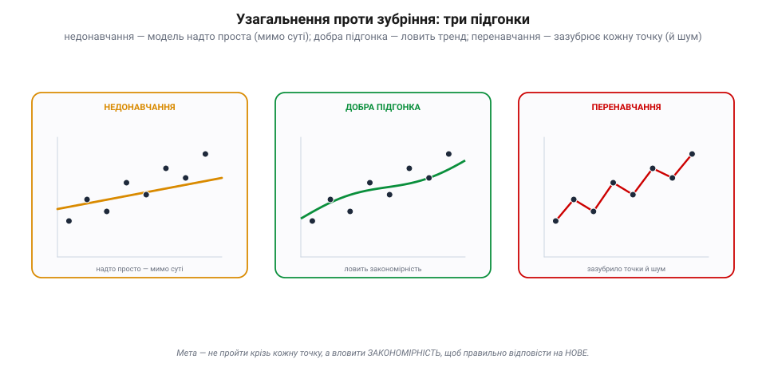
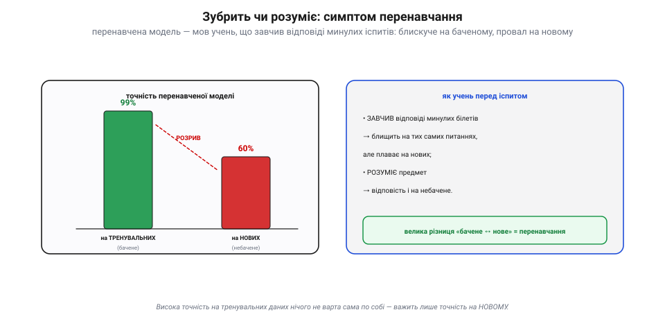
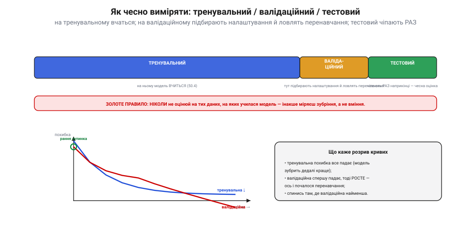
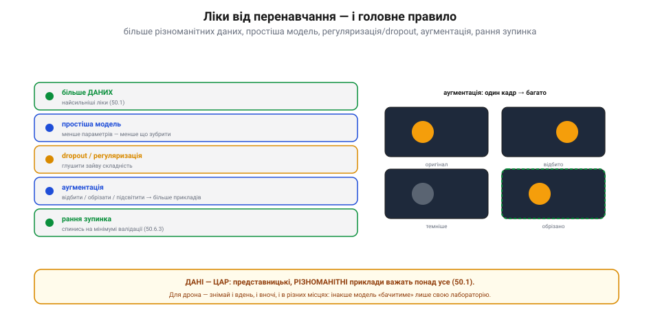

# Дані, перенавчання, узагальнення (train/val/test)

[Навчити модель](root:sf-ml/gradient-descent) — це півсправи. Справжня мета не в тому, щоб вона добре відповідала на **бачені** приклади, а щоб працювала на **нових**, яких ніколи не бачила. Це й зветься **узагальнення**. І тут чигає головна пастка всього машинного навчання — **перенавчання**: коли модель замість того, щоб **зрозуміти** закономірність, просто **зазубрює** приклади. Ця тема — про те, як цього уникнути й чесно перевірити, чи модель справді чогось навчилась.

### Узагальнення проти зубріння

Уяви, що модель припасовують до точок-прикладів. Зробити це можна по-різному — і не всяк добре.

*Три підгонки. **Недонавчання**: модель надто проста (пряма крізь криві дані) — проходить мимо суті. **Добра підгонка**: плавна крива ловить **закономірність**. **Перенавчання**: звивиста крива продирається крізь **кожну** точку, повторюючи навіть випадковий шум, — на тренувальних даних ідеально, а на нових схибить. Мета — не пройти крізь кожну точку, а вловити закономірність, щоб відповісти на **нове**.*

Між двох бід — золота середина. **Недонавчання** (*underfitting*): модель **надто проста** чи недовчена, не схопила навіть основного тренду — погана і на бачених, і на нових даних. **Перенавчання** (*overfitting*): модель **надто гнучка** й вивчила приклади **напам'ять**, разом із їхнім випадковим шумом, — блискуча на тренувальних даних, та безпорадна на нових. А посередині — **добра підгонка**, що вловила саму **закономірність** і тому правильно відповідає й на небачене. Саме її ми й шукаємо.

### Зубрить чи розуміє: симптом перенавчання

Як розпізнати перенавчання? За характерним **симптомом**. Уяви учня, що перед іспитом **завчив** відповіді на питання минулих років.

*Зубрити чи розуміти. Перенавчена модель показує **99%** на тренувальних (бачених) прикладах — і провалюється до **60%** на нових. Цей **розрив** і є симптом. Достоту як учень: хто **завчив** білети — блищить на тих самих питаннях, але плаває на нових; хто **зрозумів** предмет — відповість і на небачене. Висока точність на бачених даних сама по собі нічого не варта — важить лише точність на НОВОМУ.*

Такий учень **блищить** на знайомих питаннях, але плаває на нових — він **завчив**, а не **зрозумів**. Так само й перенавчена модель: **99%** на тренувальних даних і жалюгідні **60%** на нових. Цей **розрив** між «баченим» і «небаченим» — головний сигнал перенавчання. Звідси найважливіша думка теми: **висока точність на тренувальних даних нічого не варта сама по собі**; важить лише точність на тому, чого модель не бачила. А щоб її виміряти, треба правильно поділити дані.

### Як чесно виміряти: тренувальний / валідаційний / тестовий

Щоб чесно оцінити узагальнення, дані ділять на **три** частини, кожна зі своєю роллю.

*Три набори. **Тренувальний** (більшість): на ньому модель **вчиться**. **Валідаційний**: на ньому **підбирають налаштування** (архітектуру, темп навчання) і **ловлять перенавчання** під час розробки. **Тестовий**: його чіпають **раз** наприкінці — для чесної оцінки. **Золоте правило**: ніколи не оцінюй на тих даних, на яких училася модель. Унизу — криві похибки: тренувальна все падає, а валідаційна спершу падає, тоді **росте** (почалося перенавчання) — спинись на її мінімумі (рання зупинка).*

**Тренувальний** набір — на ньому модель **вчиться** ([підбирає ваги](root:sf-ml/gradient-descent)). **Валідаційний** — на ньому **під час розробки** перевіряють, як модель тримається на небаченому, **підбирають налаштування** ([гіперпараметри](root:sf-ml/gradient-descent)) і **ловлять** початок перенавчання. **Тестовий** — недоторканний резерв, який чіпають **один-єдиний раз** наприкінці, щоб дістати **чесну** оцінку справжньої якості. І **золоте правило**, яке порушувати не можна: **ніколи** не оцінюй модель на даних, на яких вона вчилася, — бо так ти виміряєш **зубріння**, а не вміння. Якщо стежити за похибкою: тренувальна весь час падає (модель усе краще «зубрить»), а **валідаційна** спершу падає, а тоді **починає рости** — ось і момент перенавчання; розумно **спинити** навчання саме на її мінімумі (це й зветься **рання зупинка**).

### Ліки й головне правило: дані — цар

Якщо перенавчання таки настало, є перевірені **ліки** — і одне правило, важливіше за всі.

*Ліки й головне правило. Проти перенавчання: **більше даних** (найсильніші ліки), **простіша модель** (менше що зубрити), **dropout/регуляризація** (глушити зайву складність), **аугментація** (з одного кадру роблять багато — відбити, обрізати, підсвітити), **рання зупинка**. А над усім — **дані-цар**: представницькі, **різноманітні** приклади важать понад усе. Для дрона — знімай і вдень, і вночі, і в різних місцях.*

Найсильніші ліки — **більше даних**: що більше різних прикладів, то важче їх зазубрити й то більше мережа змушена **узагальнювати**. Далі — **простіша модель** (менше параметрів — менше що запам'ятовувати напам'ять), **регуляризація** й **dropout** (під час навчання випадково «вимикають» частину нейронів, змушуючи мережу не покладатися на зубріння), **[аугментація](root:sf-visual/histogram)** (лат. *augmentum* — приріст: з одного знімка штучно роблять багато — віддзеркалюють, обрізають, міняють яскравість — і так дешево розширюють набір), і **рання зупинка**. Та над усіма ліками — **головне правило: [дані — цар](root:sf-ml/what-is-ml)**. Представницькі, **різноманітні** приклади важать більше за будь-яку хитру архітектуру. Для дрона це означає: збирай дані **в усіх** умовах, де модель працюватиме, — і вдень, і вночі, і в різних місцях, — інакше вона «знатиме» лише твою лабораторію.

> 📜 **Розумний Ганс: кінь, що «вмів рахувати», а насправді читав підказки (1907).** Найкращу пересторогу про перенавчання дав не комп'ютер, а **кінь**. На початку XX століття вся Німеччина дивувалася жеребцеві на прізвисько **Розумний Ганс** (*Kluger Hans*): його господар, учитель **Вільгельм фон Остен**, ставив коневі задачі — додати числа, назвати дату, — і Ганс **вистукував** копитом правильну відповідь. Здавалося, тварина опанувала арифметику. Та психолог **Оскар Пфунгст** 1907 року розкрив фокус: Ганс **не рахував** — він читав **мимовільні** рухи тіла того, хто питав. Коли копито наближалося до правильного числа, людина несвідомо ледь напружувалась, нахилялася чи затримувала подих — і кінь, помітивши це, спинявся. Варто було поставити запитання так, щоб **сам питач не знав** відповіді (або щоб Ганс його не бачив), — і «геній» розсипався: кінь угадував навмання. Ганс блискуче «склав іспит», не вміючи рахувати, — бо вхопився за **підказку**, а не за суть. Це і є **перенавчання** в чистому вигляді, і в машинному навчанні цей «**ефект Розумного Ганса**» згадують щодня: модель «впізнає вовка», бо на всіх навчальних фото з вовками був **сніг**; «бачить танк», бо ті знімки були **темніші**; працює в лабораторії, бо вивчила **твоє тло**, а не ціль. Щойно зміниться обстановка — і, як той кінь без підказки, вона осоромиться.

> 🔧 **Навіщо це.** Завжди пам'ятай: мета — **узагальнення**, а не точність на тренуванні. **Тримай окремо** валідаційний і тестовий набори й **ніколи** не оцінюй модель на тому, на чому вона вчилася (інакше міряєш зубріння). Стеж за **розривом** тренувальної й валідаційної похибок — росте розрив, отже, перенавчання; застосуй ранню зупинку. І бійся **Розумного Ганса**: твій детектор, що «працює» в лабораторії, може чіплятися за **спадкову підказку** (тло, водяний знак, освітлення), а не за ціль, — тож **перевіряй його в реальних, різних умовах**, а не лише там, де знімав дані. Найдешевші й найдієвіші ліки — **[більше різноманітних даних](root:sf-ml/what-is-ml)** та **аугментація**; за ними — простіша модель і dropout.

Навчену й чесно перевірену на узагальнення модель лишається вмістити в крихітний бортовий чип, де мало пам'яті й обчислень, — це вже робота [TinyML і квантування](root:sf-ml/tinyml).
