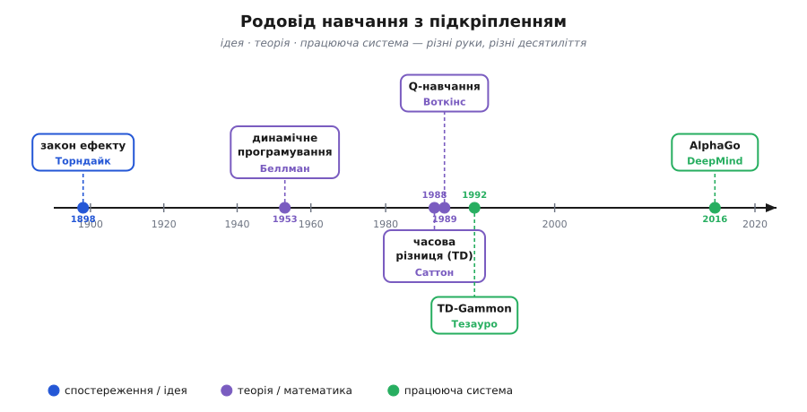

# 📜 Родовід ідеї: від кота в скриньці до AlphaGo

Коли машина 2016 року обіграла найкращого у світі гравця в го, легко було подумати, що сталося щось раптове — ніби ідея «навчати дією й винагородою» народилася разом із потужними відеокартами. Насправді ця думка визрівала понад століття, і прийшла вона не з однієї голови й не за один рік. Психолог рахував секунди, поки кіт вибирався зі скриньки. Математик у воєнному аналітичному центрі шукав спосіб розбити велике рішення на маленькі. Двоє молодих дослідників, незалежно один від одного, дали алгоритмам, що вчаться з відкладеної винагороди, точну форму. Інженер навчив програму грати в нарди самою з собою мільйони разів. І лише тоді, коли всі ці шматки склалися й наросла обчислювальна сила, вийшло те, що приголомшило світ.

Ця вставка простежує родовід — не як список дат, а як ланцюг, де кожна ланка розв'язувала те, об що спіткнулася попередня. І одразу застережу від головної пастки, у яку тут легко впасти: спокуси сказати «навчання з підкріпленням винайшов той-то в такому-то році». Не винайшов ніхто конкретний. **Ідея**, **теорія** і **працююча система** — три різні речі, вони прийшли з різних рук і з різницею в десятиліття. Розрізняти їх — не педантизм, а єдиний чесний спосіб розповісти цю історію.


*Родовід. Синім — спостереження й ідея (Торндайк побачив навчання дією); фіолетовим — теорія й математика (Беллман дав рекурсію цінності, Саттон і Воткінс — правила оновлення); зеленим — працюючі системи (TD-Gammon і AlphaGo, що звели теорію докупи й показали її в дії). Між першим спостереженням і першим тріумфом — понад століття, і жодну ланку не зробила одна особа.*

## Кіт, скринька й секундомір: Торндайк бачить навчання

Наприкінці ХІХ століття про тварин розповідали байки. Хтось клявся, що його пес «майже все розуміє», хтось — що кіт «здогадався» відчинити двері. Це були історії, а не наука: спостерігач бачив розумний вчинок і приписував тварині людський хід думки. Молодий американець **Едвард Лі Торндайк** (Edward Lee Thorndike, 1874–1949) вирішив, що досить розповідей — треба **виміряти**.

Його докторська дисертація 1898 року називалася «Animal Intelligence» — «Тваринний розум» — і зробила річ, якої доти не робив ніхто: замінила людину-піддослідного твариною в контрольованому досліді. Торндайк збив із дощок десятки невеликих скриньок-головоломок (англ. *puzzle box*) — приблизно 50 на 38 на 30 сантиметрів. Усередину саджав голодного кота, зовні клав рибу. Двері відчинялися, лише коли кіт натисне важіль чи смикне за петлю всередині. Торндайк сідав збоку із секундоміром і записував **одне число**: скільки секунд минуло, доки кіт вибрався.

Спершу кіт борсався навмання — дряпав стінки, тицявся мордою в щілини, нявчав. Рано чи пізно лапа випадково зачіпала важіль, двері відскакували, кіт діставався риби. Торндайк саджав його назад — і знову. І ось тут криється те заради чого весь дослід затівався. Час на втечу **падав** — не стрибком, ніби кіт «зрозумів» механізм, а **поступово**, спроба за спробою. Крива часу спускалася плавно. Це доводило: кіт не осягав, як влаштована скринька. Він просто дедалі частіше повторював рух, що вивів на волю, і дедалі рідше — ті, що ні до чого не вели.

Із цих кривих Торндайк вивів те, що назвав **законом ефекту** (англ. *law of effect*): дія, за якою йде приємний наслідок, стає **ймовірнішою** в тій самій ситуації; дія, за якою йде неприємне, — рідшою. Коротко: наслідок керує поведінкою назад у часі. Не намір, не розуміння механізму — самий лише **зв'язок «дія → приємне»**, що зміцнюється від повторення.

> 🔧 **Навіщо це.** Придивися до закону ефекту — і побачиш точний кістяк усього навчання з підкріпленням, тільки без жодної формули. Кіт — це агент. Скринька — середовище. Смикнути важіль — дія. Свобода й риба — винагорода. «Дія, за якою йде приємне, стає ймовірнішою» — це буквально те, що робить алгоритм, піднімаючи цінність вдалого ходу. Торндайк не вивів рівнянь і не написав програм; він **побачив і виміряв** сам принцип — що навчання зі спроб і винагород існує, підкоряється правилу й піддається лічбі. Це рівень **ідеї**, і в цьому вся його заслуга: не інструмент, а перше тверде свідчення, що таке навчання взагалі є.

Статус цих тверджень міцний: дисертація 1898 року й термін «закон ефекту» задокументовані, а самого Торндайка історія психології одностайно вважає засновником експериментального вивчення научання тварин — тієї лінії, яку згодом підхопив Берес Фредерик Скіннер (B. F. Skinner) зі своїм оперантним обумовленням. Варто лише не переграти: Торндайк дав **психологію** навчання, а не алгоритм. Місток від його кривих до коду ще належало перекинути, і на це пішло півстоліття.

## Беллман: як розбити велике рішення на маленькі

Місток почав будуватися несподівано далеко від котів — у математиці планування. Після Другої світової в американському аналітичному центрі RAND працював **Річард Ернест Беллман** (Richard Ernest Bellman, 1920–1984), американський математик. Його мучила задача, що виринала всюди — від керування ракетою до розподілу запасів: **як ухвалювати послідовність рішень у часі, коли кожне рішення змінює ситуацію для наступного**.

Приклад робить біль відчутним. Хай треба провести корабель через десять етапів шляху, на кожному вибираючи курс, і сумарна вартість залежить від усіх виборів разом. Спокуса — перебрати всі можливі послідовності курсів і взяти найдешевшу. Але якщо на кожному етапі десять варіантів курсу, то на десять етапів це 10¹⁰ послідовностей — десять мільярдів. Жодна машина 1950-х (і, чесно кажучи, жодна сьогоднішня для довшого шляху) такого не перебере. Беллман назвав це «прокляттям розмірності» (англ. *curse of dimensionality*) — кількість варіантів вибухає з довжиною задачі.

Його вихід, який він відточив до сучасного змісту близько 1953 року й назвав **динамічним програмуванням** (англ. *dynamic programming*; «programming» тут — не код, а планування, складання розкладу, як у «linear programming»), — це один простий, майже нахабний зсув погляду. Не перебирай усі послідовності. Спитай натомість: **скільки коштує опинитися в даній ситуації, якщо далі я діятиму найкраще?** Назви це число «цінністю» ситуації. Тоді велике рішення розпадається на крихітне: у кожній точці порівняй лише **найближчі** ходи — «вартість цього кроку плюс цінність тієї ситуації, куди він приведе» — і вибери найдешевший. Цінність наступних ситуацій уже вбирає в себе все, що буде далі, тож у майбутнє щоразу зазираєш рівно на один крок.

Записане формулою, це **принцип оптимальності** Беллмана: цінність ситуації дорівнює найкращому з варіантів «негайна вартість + цінність того, що настане». У винагородах, а не вартостях, і в позначеннях навчання з підкріпленням та сама думка виглядає так:

```
V(s) = max [ r(s,a) + γ · V(s') ]
        a
```

цінність стану `s` — це найкращий по діях `a` варіант «винагорода за крок плюс знецінена цінність наступного стану `s'`». Це і є **рівняння Беллмана**, серце, на якому досі тримається половина теорії RL. Своє повне втілення для задач із випадковістю воно дістало трохи пізніше: у 1957 році Беллман формалізував **марковський процес рішень** (англ. *Markov decision process*) — стани, дії, ймовірності переходів і винагороди, — а близько 1957–58 років опублікував рекурентні рівняння для стохастичного керування. Розбіжність джерел на рік-два (1957 чи 1958) для першої публікації рівняння — деталь, не варта суперечки; суть у тому, що математичний кістяк RL склався саме тут, наприкінці 1950-х.

> 🔧 **Навіщо це.** Ось де народилося рівняння, яке ти зустрічаєш у кожному алгоритмі навчання з підкріпленням, — і народилося воно **без жодного стосунку до навчання**. Беллман не вчив агентів на пробах; він розв'язував задачі планування, де правила світу відомі наперед. Його дар — не «як учитися», а **як рекурсивно розкласти майбутнє**: цінність тепер = крок зараз + цінність потім. Уся хитрість пізнішого RL у тім, що те саме рівняння почали розв'язувати **не знаючи правил світу** — оцінюючи цінності зі спроб, а не обчислюючи їх із відомої моделі. Але сама рекурсія, той хребет, по якому винагорода тече назад по часу, — це Беллман, кінець 1950-х. Це рівень **теорії**: математика є, агента, що вчиться сам, — ще нема.

Тут доречно спинити одну спокусу. Легко змалювати Беллмана «батьком навчання з підкріпленням» — та це було б натяжкою. Він дав інструмент планування за **відомої** моделі світу; перетворення цього інструмента на **навчання** з невідомої моделі зробили інші й пізніше. Заслуга Беллмана величезна й точна: він дав RL його математичну мову. Але мову — не сам метод навчання.

## Порожнеча між теорією і навчанням

Тридцять років — від кінця 1950-х до кінця 1980-х — між математикою Беллмана й практичним навчанням лежала прірва, і варто зрозуміти, чому її було так важко перейти. Рівняння Беллмана каже, **чому** дорівнює цінність, якщо світ повністю відомий: знаєш усі ймовірності переходів і всі винагороди — розв'яжи систему й дістань точні цінності. Але агент у справжньому світі **не знає** ні того, ні того. Він не має карти. Він лише діє, дивиться, що вийшло, і має якось із цих окремих спроб зіткати оцінку.

Постає питання, від якого залежить усе: **як оновлювати оцінку цінності після кожного кроку, не знаючи правил і не чекаючи кінця?** Найпряміша відповідь — дограти епізод до кінця, порахувати справжню сумарну винагороду й підправити оцінки під неї. Але в довгій грі це означає щоразу чекати самого фіналу, а в задачах, що тривають нескінченно (керування без кінця), фіналу немає взагалі, і такий підхід просто не працює. Теорія Беллмана мовчить про те, як бути тут: вона про **обчислення** цінностей із відомої моделі, а не про **навчання** їх зі скупого потоку досвіду. Саме цю порожнечу й треба було заповнити, і заповнили її двоє — майже одночасно й з різних боків.

## Саттон: учитися з різниці між двома прогнозами

Перший бік — **Річард Саттон** (Richard S. Sutton, нар. 1957/1958), американський дослідник, який згодом став громадянином Канади. 1988 року в журналі *Machine Learning* він опублікував статтю «Learning to Predict by the Methods of Temporal Differences» — «Навчатися передбачати методами часових різниць», — що дала порожнечі точну й напрочуд ощадливу відповідь.

Ідея Саттона тримається на одному спостереженні, простому до зухвалості. Уяви, що ти в понеділок передбачив: до кінця тижня випаде дощ, скажімо, з певною оцінкою ймовірності. Настав вівторок, небо захмарилося — і твій **вівторковий** прогноз на той самий кінець тижня став вищим. Помітив? Тобі не треба дощати до неділі, щоб зрозуміти: понеділковий прогноз був занизький. **Уже те, що наступний прогноз розійшовся з попереднім, — сигнал**, що попередній треба підправити. Не чекай справжнього наслідку; звіряй прогноз із трохи свіжішим прогнозом.

Це і є **навчання за часовою різницею** (англ. *temporal difference*, TD). Агент був у стані `s` з оцінкою V(s). Зробив крок, дістав винагороду `r`, опинився в `s'` з оцінкою V(s'). Тепер вираз `r + γ·V(s')` — **точніша** оцінка того самого V(s), бо в ньому один реальний крок замість чистого вгадування. Різниця між новою й старою оцінкою — часова різниця, «несподіванка»:

```
δ = r + γ · V(s') − V(s)
```

а оновлення роблять маленьким кроком у бік цієї несподіванки, з коефіцієнтом навчання α — тим самим прийомом крихітного кроку, що й у [градієнтному спуску](topic:sf-ml/gradient-descent):

```
V(s) ← V(s) + α · δ
```

Геніальність тут — у сполученні. Саттон узяв **рекурсію Беллмана** (`r + γ·V(s')` — це права частина рівняння Беллмана) і замість того, щоб розв'язувати її точно за відомою моделлю, зробив із неї **ціль для навчання зі спроб**. Агент не обчислює цінність — він **підтягує** свою оцінку до беллманівської цілі потроху, з кожним кроком, ніколи не чекаючи кінця. Так математика планування 1950-х нарешті обернулася на алгоритм навчання, що працює наосліп, без карти світу.

> 🔧 **Навіщо це.** Саме TD зробило навчання з підкріпленням придатним для довгих і нескінченних задач — тих, де кінця нема й «дочекатися наслідку» неможливо. Керування, що триває годинами; гра на тисячі ходів; робот, що живе в середовищі без «фінального свистка». Саттон не додав нової математики понад Беллмана — він додав **спосіб її вживати без моделі**: вчитися з розбіжності двох сусідніх прогнозів. Це рівень **теорії/методу**: правило оновлення є, доведено, що воно збігається у важливих випадках, — але це ще формула, а не система, що чогось досягла.

Статус міцний: стаття 1988 року в *Machine Learning* (том 3, с. 9–44) задокументована, як і те, що споріднені прийоми до Саттона вже зринали — у програмі-шашкісті Артура Семюеля (Arthur Samuel, 1950-ті) та в «bucket brigade» Джона Голланда (John Holland). Саттонова заслуга — не «перша в історії ідея звіряти сусідні прогнози», а **чітке формулювання, аналіз і доведення** класу TD-методів. За цей внесок — разом зі своїм науковим керівником Ендрю Барто (Andrew Barto) — Саттон отримав премію Тюрінга за 2024 рік. Знову бачимо: не «одна особа винайшла», а внесок, що спирається на попередників і поділений із співавтором.

## Воткінс: цінність не стану, а дії — і Q-навчання

Другий бік порожнечі закрив — майже водночас і незалежно — **Кріс Воткінс** (Christopher J. C. H. Watkins). У травні 1989 року в Кінґс-коледжі Кембриджського університету він захистив докторську дисертацію «Learning from Delayed Rewards» — «Навчання з відкладених винагород», — і в ній описав алгоритм, що став, мабуть, найвідомішим у всьому навчанні з підкріпленням.

Воткінс помітив тонку, але вирішальну незручність у підході через цінність стану V(s). Знати, «наскільки хороша ця клітинка», агентові мало: щоб **діяти**, йому треба знати, «наскільки хороша ось **ця дія** з цієї клітинки». А щоб із V(s) вибрати найкращу дію, доводиться заглядати вперед — прикидати, куди кожна дія приведе й яка там цінність, — а для цього знову-таки треба **модель** світу. Те саме прокляття невідомої моделі, тільки з іншого боку.

Розв'язок Воткінса — зсунути облік із станів на **пари «стан-дія»**. Він увів **Q-значення** (від англ. *quality* — якість): Q(s, a) — очікувана сумарна винагорода, якщо в стані `s` зробити саме дію `a`, а далі діяти найкраще. Маючи таблицю Q, агент чинить тривіально: у кожному стані бере дію з найбільшим Q — і жодної моделі для цього не треба, вибір найкращої дії читається прямо з таблиці. А правило оновлення — та сама TD-ідея Саттона, лише замість V(s') беруть **найкраще** Q з наступного стану:

```
Q(s,a) ← Q(s,a) + α · [ r + γ · max Q(s',a') − Q(s,a) ]
                                  a'
```

У квадратних дужках — беллманівська несподіванка, тільки в термінах Q; `max Q(s',a')` — цінність найкращого продовження далі. І тут криється властивість, яку Воткінс не лише описав, а й супроводив начерком доведення збіжності: Q-навчання сходиться до **найкращої** стратегії, **навіть якщо агент дорогою робив дурні, випадкові ходи**. Бо в оновленні стоїть `max` — агент завжди рівняється на найкращий можливий хід далі, а не на той, який щойно зробив сам. Тому Q-навчання й зветься методом *off-policy*: воно вчить одну (найкращу) стратегію, поводячись за іншою (дослідницькою). Це те, що робить його таким живучим на практиці — агент може вільно досліджувати, не псуючи того, чого вчиться.

> 🔧 **Навіщо це.** Q-навчання — це, по суті, рецепт розв'язати рівняння Беллмана **зовсім без моделі світу**: не знаючи ні ймовірностей переходів, ні винагород наперед, лише пробуючи й оновлюючи таблицю чисел. Ось чому воно стало робочим конем RL: його легко зрозуміти, легко запрограмувати (буквально двовимірний масив у пам'яті), і воно доводимо збігається. Дисертація Воткінса поєднала три доти окремі речі — рекурсію Беллмана, TD-оновлення Саттона й облік за парами «стан-дія» — в один алгоритм, що вчиться діяти наосліп. Це рівень **теорії/методу**, найзріліший його вияв: тепер є повний, доведений алгоритм. Лишалося показати, що на чомусь по-справжньому важкому він **спрацює**.

Статус міцний: дисертація 1989 року й авторство Q-навчання задокументовані, а строгіше доведення збіжності Воткінс дав 1992 року в спільній із Пітером Даяном (Peter Dayan) статті в *Machine Learning*. Тут теж не «геній-одинак у вакуумі»: Воткінс явно будував на Беллмані й Саттоні, а доведення доводив до строгості вже вдвох. Він **поєднав і замкнув** — і саме за це його ім'я стоїть на Q-навчанні.

## TD-Gammon: перша система, що зіграла сама з собою

До цього моменту вся історія — про **ідею** (Торндайк) і **теорію** (Беллман, Саттон, Воткінс). Формули були, доведення були. Але жила глибока підозра: годяться вони хіба для іграшкових лабіринтів на кілька клітинок, а на чомусь по-справжньому складному розсиплються. Розвіяв цю підозру **Джеральд Тезауро** (Gerald Tesauro), дослідник дослідницького центру IBM імені Томаса Дж. Вотсона, своєю програмою **TD-Gammon** — і зробив це так, що не повірити було годі.

Тезауро взяв нарди (backgammon). Гра не проста: гравець кидає кості й рухає фішки, простір позицій величезний, а через випадковість костей дерево варіантів росте нестримно — «перебрати всі ходи наперед», як у простих іграх, тут безнадійно. Тезауро зробив дві речі разом. По-перше, замість таблиці Q він узяв **нейромережу**: вона не зберігала кожну позицію окремо (їх непорахувати), а вчилася **передбачати** цінність позиції за її ознаками. По-друге — і це головне — він навчав її **методом часових різниць Саттона**, TD(λ), на партіях, які програма грала **сама проти себе**.

Ось де вся сіль, і в неї варто вдивитися. Програмі **не показували партій майстрів**. Їй не казали, який хід добрий, а який поганий. Вона починала, знаючи лише правила й мету, ходила спершу безглуздо — і вчилася **виключно** з результатів власних партій самої з собою, підправляючи оцінки за часовою різницею. Тобто буквально закон ефекту Торндайка — «роби частіше те, за чим іде добрий наслідок» — але вже у вигляді нейромережі, що ганяє мільйони партій сама з собою. Коло, що почалося з кота в скриньці, тут замкнулося.

І воно **спрацювало**. TD-Gammon уперше показали публічно наприкінці 1991 року, а академічним дебютом стала стаття Тезауро 1992 року в журналі *Machine Learning* — «Practical Issues in Temporal Difference Learning», — де він розповів, як TD(λ) навчився грати в нарди із самого лише самонавчання. Пізніша версія **2.1** — з 80 прихованими нейронами, натренована приблизно на **1.5 мільйона** партій самогри, — 1993 року грала **майже на рівні найкращих людей світу**, поступаючись їм лише трохи. Програма без жодної людської підказки, з самого самонавчання, піднялася до майстерного рівня в серйозній грі. Мало того: її нешаблонні оцінки деяких позицій змусили сильних гравців-людей **переглянути дебютну теорію** нард.

> 🔧 **Навіщо це.** TD-Gammon — це момент, коли теорія стала **системою**: перша гучна демонстрація, що навчання з підкріпленням масштабується на справжню, складну задачу, а не лише на клітинки лабіринту. І тут з'явився рецепт, за яким через двадцять років збудують AlphaGo: **нейромережа** замість таблиці цінностей плюс **самогра** як невичерпне джерело досвіду плюс **TD-навчання** без людських прикладів. Тезауро не винайшов ні нейромереж, ні TD — він **звів чуже докупи** й показав, що разом воно дає майстра. Це рівень **реалізації**: не нова ідея й не нова теорема, а перше велике «дивіться, воно працює».

Тут потрібна акуратність із датами, бо їх легко сплутати, — і саме таку неточність варто виправляти, а не тиражувати. **Публічно** TD-Gammon показали 1991-го; **академічним дебютом** і причиною слави стала стаття 1992 року. А от версія 2.1 з півтора мільйона партій, що дісталася майже-людського рівня, — це вже **1993** рік. Плутати «дебют» і «версію 2.1» не варто: 1992-й — рік, коли світ дізнався про TD-Gammon; 1993-й — рік, коли конкретна натренована версія піднялася до вершини. Статус усіх цих фактів (авторство Тезауро, IBM, самогра, ~1.5 млн партій, майже-топовий рівень) міцний і добре задокументований.

## AlphaGo: той самий рецепт, помножений на глибину

Двадцять з гаком років потому той самий рецепт — самогра плюс нейромережі плюс навчання з підкріпленням — повернувся в куди грізнішому вигляді й узяв фортецю, яку десятиліттями вважали неприступною для машин: **го** (ґо).

Чому саме го було «останнім рубежем»? Через страхітливу широчінь. У шахах з позиції зазвичай близько 35 розумних ходів; у го — близько 250, а партія триває сотні ходів. Дерево варіантів роздувається так, що груба сила «прорахуй усе наперед», яка колись здолала шахи, у го безнадійна — цифри перевищують кількість атомів у видимому Всесвіті. Довгий час найкраще, на що спромоглися програми, — рівень пристойного любителя. Панувала думка, що до найкращих людей машинам у го ще десятиліття.

Її зламала лондонська DeepMind своєю **AlphaGo**. У березні 2016 року в Сеулі AlphaGo зіграла матч із п'яти партій проти **Лі Седоля** (이세돌, Lee Sedol) — одного з найсильніших гравців планети, володаря вісімнадцяти світових титулів — і виграла **4:1**. За матчем стежили понад двісті мільйонів людей. У другій партії AlphaGo зробила хід (знаменитий «хід 37»), який людина заледве зіграла б — настільки він суперечив вікам напрацьованої мудрості, — і саме він переламав партію. Го, яке вважали недосяжним іще десятиліття, впало того березневого тижня.

Як влаштована AlphaGo — це впізнаваний нащадок TD-Gammon, лише в кожному вимірі глибший. Замість однієї мілкої мережі — **глибокі нейромережі**: «мережа стратегії» (англ. *policy network*) підказувала, які ходи варті уваги, а «мережа цінності» (англ. *value network*) оцінювала, хто виграє з даної позиції. Ці мережі спершу вчилися на партіях людей, а тоді, як і TD-Gammon, **грали сама з собою** мільйони партій, підправляючись навчанням з підкріпленням. А зверху додали **пошук по дереву методом Монте-Карло** (англ. *Monte Carlo tree search*, MCTS): замість перебирати всі ходи наперед, програма **вибірково** розгортала найперспективніші лінії, які підказувала мережа стратегії, і так зазирала вперед розумно, не потонувши в неосяжному дереві.

> 🔧 **Навіщо це.** AlphaGo — це не новий рід ідеї, а той самий родовід у зеніті: **самогра** як джерело досвіду (Тезауро), **навчання з підкріпленням** у серці (Беллман, Саттон, Воткінс), тільки замість мілкої мережі — глибокі, а замість голого перебору — розумний пошук по дереву. Уся конструкція — сплав ланок, що визрівали десятиліттями, помножений на обчислювальну силу, якої 1992-го й близько не було. Тому й хибно казати «AlphaGo винайшла новий вид штучного інтелекту»: вона **звела воєдино й довела до тріумфу** давню лінію, а не почала її. Наступниця, AlphaGo Zero, за рік пішла ще далі — навчилася го **взагалі без людських партій**, з чистої самогри від випадкових ходів, і перевершила версію, що побила Лі Седоля. Це вже майже дослівний Торндайків кіт, тільки в масштабі датацентру.

Статус фактів міцний: матч у Сеулі в березні 2016-го, рахунок 4:1, авторство DeepMind, поєднання глибокого RL, самогри й MCTS — усе добре задокументоване й широко висвітлене.

## Чому «одна особа винайшла» — завжди міф

Пройдімо родовід ще раз, коротко, — бо саме в цьому стисненні видно головний урок. **Торндайк** (1898) виміряв секундоміром, що навчання дією й винагородою існує й підкоряється правилу, — дав **ідею**. **Беллман** (кінець 1950-х) дав рекурсію цінності й марковські задачі рішення — **теорію**, математичну мову, але для відомого світу й без навчання. **Саттон** (1988) обернув беллманівську рекурсію на навчання зі спроб через часову різницю; **Воткінс** (1989) переклав це на цінність дій і замкнув у Q-навчання з доведенням збіжності — двоє дали **метод**, і майже одночасно. **Тезауро** (дебют 1992, версія 2.1 — 1993) уперше показав, що метод масштабується на справжню гру, поєднавши нейромережу, самогру й TD, — дав першу **систему**. **DeepMind** (2016) звів той самий рецепт із глибокими мережами й пошуком по дереву й узяв го — дав **тріумф**.

Жодну ланку не зробила одна голова, і жодна не звалилася з неба готовою. Кожна спиралася на попередню й розв'язувала рівно те, об що та спіткнулася: Беллман дав рекурсію, якій бракувало навчання без моделі; Саттон дав навчання без моделі, якому бракувало обліку дій; Воткінс дав облік дій, якому бракувало доказу, що це масштабується; Тезауро дав доказ на нардах, якому бракувало глибини для го; DeepMind дало глибину. І майже на кожному кроці внесок був **поділений** — Саттон із Барто, Воткінс із Даяном, ціла команда за AlphaGo.

Ось чому фраза «навчання з підкріпленням винайшов той-то» завжди буде хибною — не з ввічливості до інших авторів, а тому, що вона плутає **ідею**, **теорію**, **метод** і **систему**, які насправді розділені десятиліттями й багатьма руками. Бачити ці чотири рівні окремо — і є єдиний чесний спосіб розказати цю історію. А коли наступного разу машина зробить щось, від чого перехопить подих, варто пам'ятати: за раптовістю тріумфу майже завжди ховається довгий, тихий, розділений між багатьма родовід — що тягнеться, як тут, аж до людини з секундоміром, яка терпляче чекала, доки кіт вибереться зі скриньки.
