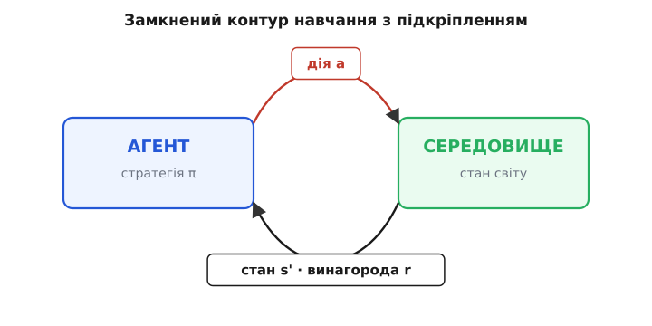
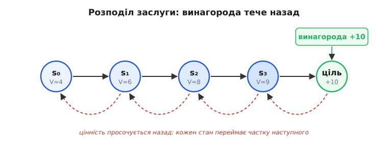
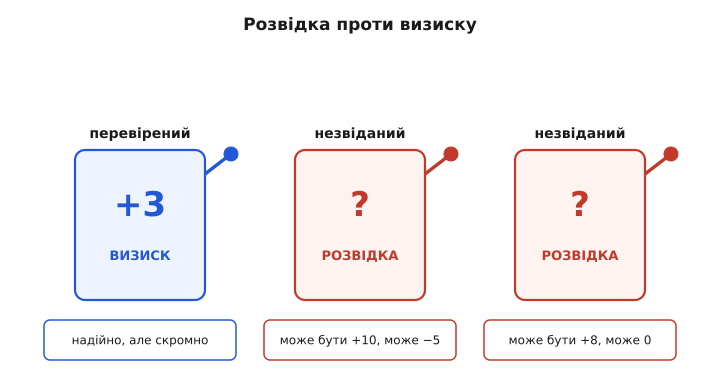

# Навчання з підкріпленням: вчитися діяти зі спроб і винагород

<preknowlist>
- [Що таке машинне навчання](root:sf-ml/what-is-ml) — програма, що виводить поведінку з даних, а не з написаних людиною правил.
- [Навчання з учителем](root:sf-ml/supervised-learning) — модель учиться на розмічених прикладах, де до кожного входу дано правильну відповідь.
- [Навчання без учителя](root:sf-ml/unsupervised-learning) — модель шукає структуру в самих даних, без будь-яких відповідей.
- [Градієнтний спуск](root:sf-ml/gradient-descent) — оцінку підтягують маленьким кроком у бік меншої похибки; звідси коефіцієнт навчання α.
</preknowlist>

Уяви, що ти вчиш собаку сідати. Ти не можеш вкласти йому в голову інструкцію «зігни задні лапи на 40 градусів». Ти можеш лише одне: коли він випадково зробив щось схоже на «сісти» — даєш ласощі. З часом собака сам вибудовує зв'язок «оця поза → смачно» і починає сідати навмисне. Ніхто не писав правила. Була лише **дія**, **наслідок** і поступове схиляння до того, що приносить приємне.

Це і є навчання з підкріпленням (англ. *reinforcement* — підсилення). Воно стоїть окремо від двох звичніших родів машинного навчання. У [навчанні з учителем](root:sf-ml/supervised-learning) моделі показують приклади з **правильними відповідями**: ось фото — це кіт. У [навчанні без учителя](root:sf-ml/unsupervised-learning) відповідей нема, і модель шукає **структуру** в самих даних. А тут нема ні того, ні того: ніхто не каже агентові, який хід правильний. Є лише **число-винагорода** після кожної дії — і завдання самому здогадатися, які дії ведуть до того, щоб цього числа набралося якнайбільше в сумі.

> 🔧 **Навіщо це.** Бери навчання з підкріпленням, коли **правильної відповіді на кожен крок нема, зате є вимірна мета**. Керувати дроном так, щоб він не впав; вести робота лабіринтом до виходу; налаштувати регулятор, щоб система швидко виходила на режим без перерегулювання. У всіх цих задачах ти не знаєш наперед «правильної» дії в кожній точці — але вмієш **оцінити результат** (утримався в повітрі — добре, врізався — погано). Саме таку задачу RL і розв'язує: перетворює «оцінку результату» на «стратегію дій».

## Замкнений контур: агент і середовище

Уся конструкція тримається на двох дійових особах. **Агент** (англ. *agent* — той, що діє) — це той, хто вчиться й ухвалює рішення: програма в дроні, гравець у грі. **Середовище** (англ. *environment*) — усе інше, весь світ навколо агента, який реагує на його дії: повітря й гравітація для дрона, дошка й суперник для гравця.

Вони обмінюються по колу, крок за кроком. Агент бачить **стан** (англ. *state*) — знімок ситуації прямо зараз: висота й швидкість дрона, розташування фігур на дошці. За станом він обирає **дію** (англ. *action*): додати газу, піти конем. Середовище приймає дію й відповідає двома речами: новим **станом** (світ змінився) і **винагородою** (англ. *reward*) — одним числом, що каже, наскільки добре чи погано вийшло. Далі все повторюється з нового стану.


*Замкнений контур. Це не разове «вхід → вихід», а безкінечна взаємодія в часі. Агент дивиться на стан, обирає **дію** за своєю стратегією; середовище відповідає **новим станом** (світ зрушив) і **винагородою** — числом-оцінкою ходу. Далі цикл повторюється з нового стану. Уся мета агента — так підбирати дії, щоб сумарна винагорода за всю взаємодію була якнайбільшою.*

Ключове слово тут — **сумарна**. Агент женеться не за винагородою прямо зараз, а за її сумою по всьому шляху вперед. Це принципово, бо в житті найкращий хід зараз часто дає найгіршу винагороду вмить. Пожертвувати пішака в шахах — миттєвий мінус; але якщо через три ходи це веде до мату, сумарно це найкращий вибір. Здатність терпіти малий збиток зараз заради великого виграшу потім і відрізняє осмислену стратегію від жадібного хапання найближчого шматка.

Правило, за яким агент обирає дію в кожному стані, називають **стратегією** (англ. *policy*, від гр. *politeia* — спосіб урядування), і позначають грецькою π. Стратегія — це і є те, що агент вчить: відображення «стан → яку дію робити». Спочатку π випадкова й дурна, з досвідом вона стає дедалі кращою. Уся мета навчання з підкріпленням в одному реченні: **знайти стратегію π, що максимізує очікувану сумарну винагороду**.

## Цінність: скільки коштує опинитися тут

Щоб вибирати дії розумно, агентові треба відповісти на питання, яке на перший погляд здається неможливим: «якщо я зараз у цьому стані й далі гратиму за своєю стратегією — скільки винагороди я загалом набагаю?». Це число називають **цінністю** стану (англ. *value*) і позначають V(s). Цінність — не винагорода за один крок, а прогноз усього, що чекає попереду з цієї точки.

Навіщо взагалі окрема величина, коли є винагорода? Бо винагорода короткозора, а рішення треба ухвалювати з оглядом на майбутнє. Клітинка поряд із виходом з лабіринту сама по собі не дає нічого — та її **цінність** висока, бо звідти два кроки до великої винагороди. Знаючи цінність сусідніх станів, агент чинить просто: іде туди, де цінність більша. Уся хитрість зводиться до того, щоб цю цінність правильно оцінити.

І тут з'являється спостереження, на якому тримається половина всієї теорії. Цінність стану й цінність **наступного** стану пов'язані простим співвідношенням. Бо «все, що чекає з цього стану» = «винагорода за найближчий крок» + «все, що чекає з наступного стану». Записавши це формулою, дістаємо серце навчання з підкріпленням:

```
V(s) = r + γ · V(s')
```

де `r` — винагорода за перехід, `s'` — наступний стан, а `γ` (гамма) — **коефіцієнт знецінення** (англ. *discount factor*), число між 0 і 1. Це рівняння вперше вивів [Річард Беллман](root:sf-ml/reinforcement-learning/hist-rl-lineage.md) ще в 1950-х, задовго до нейромереж, — і воно досі керує всім.

> 🔧 **Навіщо це.** Гамма — це «наскільки агент цінує майбутнє проти теперішнього». При γ близькому до 1 (скажімо, 0.99) агент далекоглядний: винагорода через сто кроків важить майже як зараз, тож він охоче терпить заради довгої гри. При малій γ (0.5) майбутнє швидко тьмяніє — агент хапає найближче й не будує довгих планів. У реальному керуванні γ ставлять близько до 1, коли важлива поведінка на довгій дистанції (доліт дрона до цілі), і меншою, коли важлива швидка реакція тут і зараз. Це одна з головних ручок, якою налаштовують поведінку.

Розглянемо, як це рівняння працює на очах, на крихітному прикладі.

**Ланцюжок до цілі.** Агент іде п'ятьма станами s₀→s₁→s₂→s₃→ціль. Кожен крок дає винагороду 0, і лише вхід у ціль дає +10. Візьмімо γ = 1 (без знецінення) і порахуймо цінності від кінця:

```
V(ціль) = 10                     (тут і закінчилося)
V(s₃)   = 0 + 1 · V(ціль) = 10
V(s₂)   = 0 + 1 · V(s₃)   = 10
V(s₁)   = 0 + 1 · V(s₂)   = 10
V(s₀)   = 0 + 1 · V(s₁)   = 10
```

Винагорода +10, що чекає в самому кінці, «протекла» назад до першого стану — тепер агент з s₀ знає, що цей шлях зрештою вартий десятки. Візьмімо тепер γ = 0.9, щоб побачити знецінення:

```
V(ціль) = 10
V(s₃)   = 0 + 0.9 · 10    = 9.0
V(s₂)   = 0 + 0.9 · 9.0   = 8.1
V(s₁)   = 0 + 0.9 · 8.1   = 7.29
V(s₀)   = 0 + 0.9 · 7.29  = 6.56
```

Тепер цінність тьмяніє з відстанню: далекі від цілі стани варті менше, бо винагороду ще довго чекати. Саме тому агент, порівнюючи два шляхи до однієї цілі, обере коротший — у нього цінність старту вища.

## Розподіл заслуги: чий це був хід

У цьому прикладі криється найглибша складність усього навчання з підкріпленням, і в неї варто вдивитися. Винагорода прийшла **лише в кінці** — +10 за вхід у ціль. Але ж до цілі привели всі п'ять ходів. Який із них був корисний? Може, вирішальним був поворот на s₁, а решта — очевидні? Ця задача — **розподіл заслуги** (англ. *credit assignment*): як розкидати одну винагороду в кінці по всіх діях, що до неї привели.


*Розподіл заслуги. Винагорода (+10) приходить лише наприкінці, та привели до неї всі ходи. Рівняння Беллмана розв'язує це елегантно: кожен стан **переймає частку цінності наступного**, тож сигнал винагороди просочується назад по всій траєкторії — аж до першого кроку. Далекі стани дістають менше (пунктирні дуги тьмяніють), близькі до цілі — більше. Так одне число в кінці розподіляється по всьому шляху, що до нього вів.*

Рівняння Беллмана вирішує це саме собою: раз цінність кожного стану спирається на наступний, винагорода з кінця автоматично тече вздовж усього ланцюга назад. Не треба вручну вирішувати, який хід «заслужив» — математика сама розкидає заслугу пропорційно до того, наскільки кожен стан наближав до винагороди. У цьому й краса: одне скупе число наприкінці навчає **всю** послідовність рішень.

## Часова різниця: вчитися до кінця гри

Лишається питання: звідки агент бере цінності V(s), якщо спочатку він нічого не знає? Найпрямолінійніший спосіб — дограти партію до кінця, порахувати справжню сумарну винагороду й підправити оцінки. Але це погано: у грі на тисячу кроків доведеться щоразу чекати самого кінця, а в задачах без кінця (керування, що триває вічно) — узагалі неможливо.

Розумніший підхід не чекає кінця, а вчиться **на кожному кроці**, звіряючи свій прогноз із трохи свіжішим прогнозом наступного кроку. Ідея така: агент був у стані s з оцінкою V(s). Він зробив крок, дістав винагороду r і опинився в s' з оцінкою V(s'). Тепер `r + γ·V(s')` — це **точніша** оцінка того ж V(s), бо в ній є один реальний крок замість чистого вгадування. Різницю між новою й старою оцінкою називають **часовою різницею** (англ. *temporal difference*, TD):

```
δ = r + γ · V(s') − V(s)
```

Ця δ — «несподіванка»: наскільки реальність розійшлася з очікуванням. Якщо δ додатна, вийшло краще, ніж думалося, і V(s) треба підняти; якщо від'ємна — опустити. Оновлення роблять маленьким кроком, з коефіцієнтом навчання α (як у [градієнтному спуску](root:sf-ml/gradient-descent)):

```
V(s) ← V(s) + α · δ
```

Це і є **навчання за часовою різницею** — воно тягне оцінку до правди потроху, з кожним кроком, ніколи не чекаючи кінця. Метод запропонував [Річард Саттон](root:sf-ml/reinforcement-learning/hist-rl-lineage.md) 1988 року, і саме він зробив навчання з підкріпленням придатним для довгих і безкінечних задач.

## Q-значення й Q-навчання

Знати цінність стану V(s) добре, але для дії агентові потрібне трохи інше: не «наскільки хороша ця клітинка», а «наскільки хороша ось **ця дія** з цієї клітинки». Тому вводять **Q-значення** (від *quality* — якість): Q(s, a) — очікувана сумарна винагорода, якщо в стані s зробити дію a, а далі діяти за стратегією. Маючи таблицю Q, агент чинить тривіально: у кожному стані бере дію з найбільшим Q. Стратегія випливає з Q сама.

Найвідоміший спосіб вивчити Q називають **Q-навчанням** (англ. *Q-learning*); його придумав [Кріс Воткінс](root:sf-ml/reinforcement-learning/hist-rl-lineage.md) в кембриджській дисертації 1989 року «Learning from Delayed Rewards» — «навчання з відкладених винагород». Правило те саме, що й у TD, лише замість V(s') беруть **найкраще** Q з наступного стану — так агент завжди рівняється на найкращий можливий хід далі:

```
Q(s,a) ← Q(s,a) + α · [ r + γ · max Q(s',a') − Q(s,a) ]
                                    a'
```

У квадратних дужках — та сама несподіванка δ, тільки в термінах Q. `max Q(s',a')` — цінність найкращого продовження з наступного стану. Дивовижна властивість Q-навчання: воно збігається до найкращої стратегії, **навіть якщо агент дорогою робив дурні, випадкові ходи**. Бо воно вчиться не «що я зробив», а «що було б найкраще» — тому й зветься методом *off-policy*, тобто таким, що вчить одну (найкращу) стратегію, поводячись за іншою (дослідницькою).

**Worked-приклад: одне оновлення Q-навчання.** Хай агент у стані s зробив дію a, дістав винагороду r = 1 і потрапив у s', де можливі дві дії з поточними оцінками Q(s',ліворуч) = 5 і Q(s',праворуч) = 8. Стара оцінка Q(s,a) = 4. Візьмімо α = 0.1, γ = 0.9. Реальний код прошивки, що робить один такий крок:

:::tabs
```cpp
// Q-таблиця: [скільки станів][скільки дій]; тут S станів, A дій
float Q[S][A];

// одне оновлення Q-навчання після переходу s --a--> s' з винагородою r
void q_update(int s, int a, float r, int s_next,
              float alpha, float gamma)
{
    // 1) знайти найкраще Q у наступному стані (max по діях)
    float best_next = Q[s_next][0];
    for (int j = 1; j < A; ++j)
        if (Q[s_next][j] > best_next)
            best_next = Q[s_next][j];

    // 2) ціль за Беллманом: винагорода + знецінене найкраще продовження
    float target = r + gamma * best_next;   // 1 + 0.9*8 = 8.2

    // 3) несподіванка δ і крок до цілі
    float delta = target - Q[s][a];         // 8.2 - 4 = 4.2
    Q[s][a] += alpha * delta;               // 4 + 0.1*4.2 = 4.42
}
```
```python
# Q-таблиця: [скільки станів][скільки дій]; тут S станів, A дій
Q = [[0.0] * A for _ in range(S)]

# одне оновлення Q-навчання після переходу s --a--> s' з винагородою r
def q_update(s, a, r, s_next, alpha, gamma):
    # 1) знайти найкраще Q у наступному стані (max по діях)
    best_next = max(Q[s_next])

    # 2) ціль за Беллманом: винагорода + знецінене найкраще продовження
    target = r + gamma * best_next          # 1 + 0.9*8 = 8.2

    # 3) несподіванка δ і крок до цілі
    delta = target - Q[s][a]                # 8.2 - 4 = 4.2
    Q[s][a] += alpha * delta                # 4 + 0.1*4.2 = 4.42
```
:::

Порахуймо руками, щоб побачити механізм:

```
best_next = max(5, 8)          = 8
target    = 1 + 0.9 · 8        = 8.2
δ         = 8.2 − 4            = 4.2      (реальність краща за прогноз)
Q(s,a)    = 4 + 0.1 · 4.2      = 4.42
```

Оцінка підповзла з 4 до 4.42 — на десяту частину несподіванки, бо α = 0.1. Одне переживання ледь зрушує число; але тисячі переходів через той самий стан поступово підтягують Q до справжньої цінності. Так, крок за кроком, з голої випадкової таблиці виростає осмислена стратегія.

> 🔧 **Навіщо це.** Q-таблиця — це буквально двовимірний масив у пам'яті: рядок на стан, стовпець на дію. Для маленьких задач (лабіринт, проста гра) вона влазить у кілобайти й крутиться навіть на [мікроконтролері](root:sf-ml/tinyml). Проблема одна: масив росте з кількістю станів. Дошка го чи камера з мільйонами пікселів дають стільки станів, що таблиця не влізе в жодну пам'ять — і саме тут таблицю замінюють [нейромережею](root:sf-ml/neuron-layer), яка не зберігає кожен стан, а вчиться **передбачати** Q за ознаками стану. Так народилося глибоке навчання з підкріпленням, на якому виріс AlphaGo.

## Розвідка проти визиску

Є ще одна пастка, без якої вся схема не працює, — і вона глибша, ніж здається. Агент вчиться лише на тому, що **спробував**. Але щоб знати, чи хороша дія, її треба зробити хоч раз. Виникає замкнене коло: агент тягне ту дію, яку вважає найкращою (за поточними Q), — але звідки він знає, що деінде не заховане ще краще, якщо ніколи туди не заглядав?


*Розвідка проти визиску. Перевірений важіль дає надійні +3 — тягнути його (**визиск**, англ. exploit) безпечно, але, може, короткозоро. Під незвіданими важелями — невідома величина; смикнути такий (**розвідка**, англ. explore) ризиковано, зате там може ховатися більший виграш. Тягтимеш лише перевірене — ніколи не знайдеш кращого; тягтимеш лише нове — марнуватимеш ходи на завідомо гірше. Уся майстерність — у балансі цих двох.*

Це напруга між **визиском** (англ. *exploitation* — користатися вже відомим найкращим) і **розвідкою** (англ. *exploration* — пробувати незвідане в пошуках кращого). Суцільний визиск застрягає на першому-ліпшому пристойному рішенні й ніколи не знаходить найкращого. Суцільна розвідка вічно мече навмання й ніколи не користається знанням. Розумний агент має робити **і те, й те**: здебільшого чинити за найкращою відомою стратегією, але вряди-годи навмисне пробувати щось нове.

Найпростіший робочий рецепт зветься **ε-жадібним** (англ. *epsilon-greedy*): з імовірністю ε (скажімо, 0.1) агент робить **випадкову** дію-розвідку, а решту часу — **найкращу відому**. Ось як це виглядає в коді:

:::tabs
```cpp
#include <stdlib.h>

// вибір дії: з імовірністю eps — випадкова (розвідка),
// інакше — з найбільшим Q (визиск)
int choose_action(const float *q_row, int A, float eps)
{
    // rand()/RAND_MAX — псевдовипадкове число в [0,1)
    if ((float)rand() / RAND_MAX < eps)
        return rand() % A;              // розвідка: будь-яка дія

    int best = 0;                       // визиск: argmax по Q
    for (int j = 1; j < A; ++j)
        if (q_row[j] > q_row[best])
            best = j;
    return best;
}
```
```python
import random

# вибір дії: з імовірністю eps — випадкова (розвідка),
# інакше — з найбільшим Q (визиск)
def choose_action(q_row, eps):
    # random.random() — псевдовипадкове число в [0,1)
    if random.random() < eps:
        return random.randrange(len(q_row))   # розвідка: будь-яка дія

    # визиск: argmax по Q
    best = 0
    for j in range(1, len(q_row)):
        if q_row[j] > q_row[best]:
            best = j
    return best
```
:::

Часто ε роблять великим на початку (агент нічого не знає — хай досліджує) і поступово зменшують (агент вивчив світ — хай користається). Цей простий прийом розв'язує ту саму дилему, з якою стикається будь-хто в житті: ходити в перевірений ресторан чи спробувати новий, який може виявитися і кращим, і гіршим.

## Де це справді працює

Навчання з підкріпленням засяяло там, де правильної відповіді на кожен крок нема, зате є ясна мета й багато спроб. Історично першою гучною перемогою стала **TD-Gammon** — програма інженера IBM Джеральда Тезауро, яка 1992 року навчилася грати в нарди (backgammon) майже на рівні найкращих людей, [зігравши сама з собою півтора мільйона партій](root:sf-ml/reinforcement-learning/hist-rl-lineage.md) і не діставши від людей жодної підказки, як ходити. За два десятиліття та сама ідея, помножена на глибокі нейромережі, дала **AlphaGo** від DeepMind, що [2016 року обіграв чемпіона світу з го Лі Седоля](root:sf-ml/reinforcement-learning/hist-rl-lineage.md) — гру, яку доти вважали недосяжною для машин.

Але поза іграми навчання з підкріпленням залишається примхливим інструментом. Воно **жадібне до спроб**: агентові треба зіграти мільйони партій, щоб чогось навчитися, — легко у грі, яку можна прокрутити на комп'ютері мільярд разів, але дорого чи небезпечно там, де кожна спроба реальна (розбитий дрон коштує грошей, а не рестарту). Воно **чутливе до форми винагороди**: недбало підібране число-нагорода вчить агента химерних лазівок — він знаходить, як набити винагороду в обхід справжньої мети (класична пастка reward hacking). І воно **нестабільне в навчанні**: те, що агент вивчив, легко розсипається, коли середовище трохи змінюється. Тому в багатьох прикладних задачах керування простіший і передбачуваніший [ПІД-регулятор](root:com-signal/discrete-pid) чи [фільтр Калмана](root:com-signal/kalman-filter) досі надійніший за навчений агент — і це нормально: RL не заміняє класику, а бере ті задачі, де класики бракує.