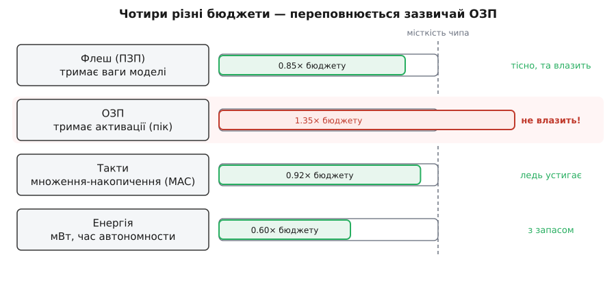
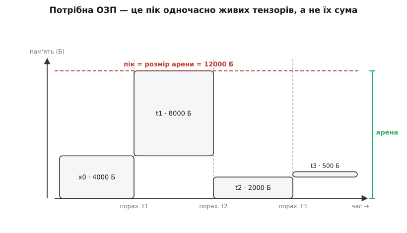
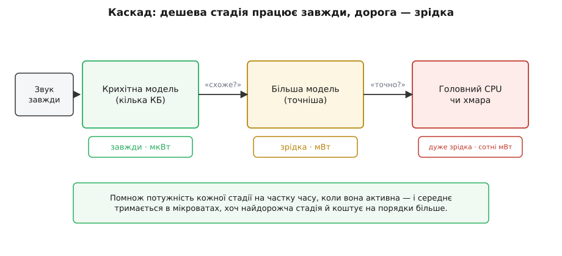

# TinyML: машинне навчання на мікроконтролері

<preknowlist>
- [Що таке ML](topic:sf-ml/what-is-ml) — модель це мільйони ваг і мільйони множень на кожен вхід.
- [Нейрон і шар](topic:sf-ml/neuron-layer) — шар перетворює вхідний тензор на вихідний; значення течуть шар за шаром.
- [Навчання vs вивід](topic:sf-ml/train-vs-inference) — модель довго навчають один раз, а потім лише проганяють вивід.
- [Квантування нейромереж](topic:sf-ml/model-quantization) — заміна 32-бітної дробової ваги на 8-бітне ціле через афінне відображення діапазону.
- [Вартість обчислень](topic:hw-arch/compute-cost) — чому важкий вивід коштує пам'яті, тактів і енергії.
</preknowlist>

Є навчена нейромережа. Вона впізнає слово-команду, жест чи «є людина / нема» — і робить це добре. Тепер її треба запустити не в хмарі, а **на самому пристрої**: у навушнику, датчику, іграшці, дверному дзвінку. Між тренованою моделлю й бортовим чипом лежить провалля, і зазвичай його описують одним числом: модель у тисячі разів завелика. Це число оманливе — не тому що хибне, а тому що **не одне**. Провалля має не одну стіну, а чотири, і та стіна, яку всі називають першою (розмір моделі), майже ніколи не та, об яку розбиваєшся насправді. **TinyML** (англ. *tiny* — крихітний) — це інженерна дисципліна перекривання цього провалля, і починається вона з чесного погляду на те, що саме на мікроконтролері в дефіциті.

### Чотири бюджети, а не один

Мікроконтролер (МК) — це не «маленький комп'ютер». Це чип, який береже **чотири різні ресурси одразу**, і кожен з них — окрема стіна.

**Флеш-пам'ять (ПЗП)** — постійна пам'ять, що зберігає вміст і без живлення. У ній лежить і програма, і **ваги моделі**. Саме сюди впирається «розмір моделі»: десятки-сотні кілобайтів, зрідка мегабайт-другий на старшому МК. Це очевидна стіна, і про неї говорять першою.

**Оперативна пам'ять (ОЗП)** — швидка робоча пам'ять, яку можна перезаписувати. У неї не кладуть ваги — у ній під час виводу живуть **активації**: проміжні тензори, які шар за шаром породжує модель (від лат. *activus* — діяльний; активація шару — це його вихідні числа). Ось цієї пам'яті на МК зовсім мало — від кількох кілобайтів до кількох сотень, — і саме вона зазвичай і є справжньою стіною.

**Такти (обчислення)** — мікроконтролер робить лічені десятки-сотні мільйонів множень-накопичень (MAC) за секунду, тоді як [вивід нейромережі — це саме мільйони таких множень на кадр](topic:hw-arch/compute-cost). І тут ще одна пастка: простий МК часто **взагалі не має апаратного блоку дробових чисел** (FPU, англ. *floating-point unit*). Кожне множення float32 йому доводиться емулювати програмно — десятками інструкцій замість однієї. Тому цілочисельна арифметика на такому чипі не просто ощадніша — вона єдиний швидкий шлях.

**Енергія (мілівати)** — і це головний ресурс, коли пристрій має слухати світ **завжди**, живлячись від крихітного акумулятора чи монетної батарейки. Тут ховається найнесподіваніше. Порахуймо, що взагалі їсть енергію в такому пристрої. Виявляється, саме обчислення — **дешеві**: сам мікроконтролер бере близько мілівата, сенсори — мікровати. Дорого коштує **радіо**: передати дані в хмару — це сотні міліватів увімкненого передавача (Пітер Ворден у впливовій замітці 2018 року «Why the Future of Machine Learning is Tiny» наводить приблизні числа: радіо ~800 мВт, екран ~400 мВт, а сам МК ~1 мВт). Звідси випливає справжня причина, чому TinyML узагалі існує: рахувати на місці треба не тому, що хмара задорога грошима, а тому, що **ввімкнене радіо з'їсть батарею за годину**, а тихий чип на тій самій батареї пропрацює місяцями. Дешевше **не передавати** сирі дані, а перетравити їх на місці й відіслати хіба короткий висновок — або й не відсилати нічого. Саме ця думка — що місцевий вивід дешевший за передачу — [зібрала TinyML в окрему галузь](topic:sf-ml/tinyml/hist-tinyml-field.md) наприкінці 2010-х, довкола розпізнавання слова-пробудження й перших рушіїв на кшталт TFLite Micro.


*Мікроконтролер береже чотири різні ресурси. Флеш тримає ваги, ОЗП — проміжні активації, такти — множення, енергія — час автономної роботи. Модель тисне на всі чотири бюджети одразу, та переповнюється зазвичай саме ОЗП: активації не влазять у робочу пам'ять, хоча ваги в постійну ще влізли б.*

> 🔧 **Навіщо це.** Знати, **який** бюджет упирається, — це знати, який інструмент брати. Команда тижнями чавить розмір моделі (флеш), коли переповнилася насправді ОЗП (активації), — і не зрушить із місця, доки не гляне на правильну стіну. Перше питання перед стисненням завжди: **чого саме не вистачило — постійної пам'яті під ваги, оперативної під активації, тактів чи енергії?**

### Чому стиснути взагалі можливо

Перш ніж перекривати провалля, треба зрозуміти, чому це в принципі виходить: адже не можна просто викинути половину моделі й сподіватися, що вона все ще працює. Виходить тому, що навчена мережа майже завжди **надлишкова**. Параметрів у ній набагато більше, ніж потребує сама задача: під час навчання ця надмірність корисна — вона дає [градієнтному спуску](topic:sf-ml/gradient-descent) простір, у якому легко знайти добрий розв'язок, — але сам знайдений розв'язок несе куди менше інформації, ніж займає місця. Мережа — як конспект, записаний надто розлого: думок у ньому мало, а сторінок багато. Усі прийоми стиснення живляться з одного джерела: **надлишок можна відтиснути, майже не зачепивши суті**. Питання лише в тому, який надлишок і яку стіну кожен прийом прибирає.

### Справжня стіна: пік активацій

Найглибша й найменш очевидна річ у TinyML — це те, скільки насправді треба ОЗП. Наївна відповідь: скласти розміри всіх проміжних тензорів. Вона **завищена в рази**, і хто рахує так, той дарма забраковує моделі, які насправді влізли б.

Причина проста. Мережа рахує шар за шаром: шар читає свій вхідний тензор і пише вихідний. Щойно **наступний** шар прочитав тензор, той більше не потрібен — його пам'ять можна віддати під щось інше. Тобто в кожну мить «живі» лише кілька тензорів, а не всі. Пам'яті треба стільки, скільки займає **найтовща мить** — пік суми одночасно живих тензорів, — а не вся сума за час виводу.

**Пік активацій ланцюжкової мережі з чотирьох тензорів.** Хай вхід і три шари дають тензори таких розмірів (у байтах), і кожен шар потребує живими лише свій вхід і свій вихід:

```
тензори:   x0 = 4000    t1 = 8000    t2 = 2000    t3 = 500
сума всіх: 4000 + 8000 + 2000 + 500 = 14500 байтів

рахуємо t1:  живі {x0, t1}   = 4000 + 8000 = 12000   ← пік
рахуємо t2:  живі {t1, t2}   = 8000 + 2000 = 10000   (x0 звільнено)
рахуємо t3:  живі {t2, t3}   = 2000 +  500 =  2500   (t1 звільнено)

потрібно ОЗП = пік = 12000 байтів,  а не сума 14500
```

Тут виграш скромний, бо мережа коротка. Та він росте з глибиною: у мережі з десяти шарів, кожен з тензором по 8000 байтів, наївна сума — 80 000 байтів (не влізе), а пік «вхід + вихід» — близько 16 000 (влізе). **Та сама мережа не влазить і влазить — залежно лише від того, чи вміє рушій перевикористовувати пам'ять під активації.**


*Кожен проміжний тензор живе від миті, коли його порахували, до миті, коли його востаннє прочитали. Потрібна ОЗП — це не сума смуг, а **найтовщий їх стос** по вертикалі: скільки байтів живе одночасно в найгустішу мить. Пропущений зв'язок (коли ранній тензор потрібен ще й далекому шару) тримає смугу довгою й піднімає пік — тому мережі зі «стрибками» (як залишкові) коштують більше ОЗП, ніж рівний ланцюг тієї самої довжини.*

Звідси випливає ключова думка: розмір моделі й потрібна ОЗП — **різні числа, керовані різними речами**. Розмір моделі задають кількість і формат ваг; пік активацій задає **форма** графа — розміри проміжних тензорів і те, як довго кожен живе. Дві мережі з однаковим числом ваг можуть вимагати ОЗП, що різниться вдесятеро. Тому підбирати архітектуру під МК — це не лише «менше параметрів», а насамперед «тонший пік».

А коли пік порахований, постає інженерна задача: розкласти всі активації в **один** заздалегідь відведений буфер так, щоб живі одночасно не налізли одна на одну, а буфер вийшов якомога менший. Цей буфер зветься **арена** (від лат. *arena* — майданчик; тут єдиний майданчик під усі проміжні тензори), а задача його розкладки — [укласти тензори в арену за їхніми часами життя](topic:sf-ml/tinyml/proj-arena-planner.md) — виявляється тонкою: пік — це лише нижня межа, а через фрагментацію реальна арена буває трохи більша, і оптимальна розкладка загалом обчислювально важка, тож рушії кладуть тензори жадібною евристикою.

### Скриня прийомів — кожен б'є свою стіну

Тепер, коли видно чотири стіни, прийоми стиснення перестають бути випадковим набором: кожен прибирає **конкретний** бюджет, і саме тому їх складають разом.

**Квантування** (від лат. *quantum* — скільки, порція) — заміна 32-бітних дробових ваг на 8-бітні цілі: діапазон значень ділять на 256 рівнів і кожне число клацають у найближчий, [зберігаючи замість дробу номер рівня](topic:sf-ml/model-quantization). Це єдиний прийом, що б'є одразу **три** стіни: флеш (ваги вчетверо менші), такти й енергію (ціле множення дешеве й не потребує FPU) і навіть ОЗП (активації теж стають 8-бітними — пік учетверо тонший). Через це квантування — найдієвіший важіль TinyML, і його застосовують майже завжди.

Одна деталь тут виникає лише при розгортанні на пристрій — у навчанні вона не постає. Щоб клацнути число в рівні, треба знати **діапазон** — від якого до якого. Для ваг він відомий одразу (вони вже пораховані). А от діапазон активацій залежить від **вхідних даних**, яких у мить квантування ще нема. Тому роблять **калібрування**: проганяють крізь навчену модель невелику «репрезентативну вибірку» справжніх прикладів і записують, у які межі насправді потрапляють активації кожного шару. Це квантування **після навчання** (англ. *post-training quantization*) — швидке, але трохи втрачає точність. Коли втрата завелика, вдаються до квантування **свідомого в навчанні** (англ. *quantization-aware training*): під час тренування навмисне імітують округлення до рівнів, і мережа сама вчиться бути стійкою до нього.

**Компактна архітектура** — узяти мережу, зроблену дрібною **від початку**, а не чавити велику. Взірець — **MobileNet** (Ендрю Говард зі співавторами, Google, 2017): замість звичайної [згортки](topic:sf-ml/cnn), що змішує простір і канали одним важким проходом, він робить два дешеві — окремий просторовий фільтр на кожен канал плюс змішування каналів згорткою 1×1, — і це ріже кількість множень у вісім-дев'ять разів майже без утрати якости. Компактна архітектура б'є такти й обидві пам'яті одразу: менше і ваг, і активацій.

**Прорідження** (англ. *pruning* — обрізати) — у навченій мережі багато ваг майже нульові; [їх викидають, роблячи мережу рідшою](topic:sf-ml/weight-pruning). Тут є тонкість, важлива саме на МК: викидання окремих ваг (неструктуроване) зменшує **флеш**, але не завжди прискорює вивід — бо щільне множення однаково множить і на нулі, доки рушій не вміє пропускати діри. Викидання ж цілих каналів (структуроване) стискає й пам'ять, і такти, бо мережа справді меншає у формі.

**Дистиляція** (від лат. *distillare* — стікати краплями, переганяти) — велику точну мережу-**вчителя** використовують, щоб навчити дрібну мережу-**учня** [копіювати її м'які відповіді](topic:sf-ml/knowledge-distillation); учень виходить майже такий розумний, а вміщається в рази менший. Дистиляція б'є всі стіни одразу, бо родить **природно малу** модель, а не обрізок великої.

Складені разом — квантована, проріджена, дистильована компактна мережа — ці прийоми вжимають модель на два порядки. Та зверни увагу: троє з них (квантування ваг, прорідження, дистиляція) цілять переважно в **розмір і такти**, а пік активацій прибирає насамперед **форма** архітектури й розумна розкладка арени. Ось чому саму лише «меншу модель» легко переоцінити: вона рятує флеш, а стіна, об яку б'єшся, — часто ОЗП.

### Як модель потрапляє на чип

Тепер — весь шлях, від тренування до працюючого виводу, без пропусків. [Тренують **звичайно**](topic:sf-ml/train-vs-inference) — у хмарі, на повній точності float32, бо навчання важке й одноразове. Далі навчену модель **квантують** із калібруванням на репрезентативній вибірці. Тоді граф і 8-бітні ваги **серіалізують** у компактний двійковий формат (плаский буфер, англ. *flatbuffer*, що його читають без розпакування). І тут — характерна для МК річ: на чипі **нема файлової системи**, нема куди «покласти файл моделі». Тому серіалізовану модель **вшивають прямо у прошивку** як звичайний масив байтів (`const unsigned char model[]`), і він осідає у флеші поруч із кодом.

На самому чипі модель проганяє **рушій виводу**. Він тримає дві сторони пам'яті нарізно: у флеші — модель (граф і ваги, тільки читання), в ОЗП — **арену** активацій (той єдиний перевикористовуваний буфер) плюс дрібний службовий стан. Рушій іде графом крок за кроком: для кожної операції бере вхідні тензори з арени, кличе відповідне **ядро** (готову функцію, що вміє цю операцію — згортку, додавання, функцію активації), і кладе результат назад в арену. Вхід із сенсора лягає в перший тензор арени, кінцевий результат читають з останнього.


*Дві сторони пам'яті. У постійній (флеш) лежить незмінна модель — граф операцій і 8-бітні ваги — та бібліотека ядер. У робочій (ОЗП) живе арена активацій, яку рушій перевикористовує від шару до шару. Проганяючи вивід, рушій для кожної операції читає вхідні тензори з арени, виконує ядро й пише вихід назад у ту саму арену — тому робочої пам'яті треба лише на пік, а не на всі тензори.*

### Рушій-тлумач чи згенерований код

Як саме модель стає обчисленням на чипі — є два підходи, і вибір між ними — це вибір компромісу.

**Рушій-тлумач** (англ. *interpreter*, від лат. *interpretari* — тлумачити; взірець — TensorFlow Lite Micro, Роберт Девід, Пітер Ворден зі співавторами, 2020) тримає модель **як дані**: граф лежить у флеші буфером, а універсальний рушій читає його й по черзі виконує операції. Він мусить обходитися тим, чого на МК нема: **без динамічного виділення пам'яті** (жодного `malloc`) і **без операційної системи**. Тому рушій нічого не виділяє сам — ти даєш йому наперед відведений масив `uint8_t arena[N]`, і всі тензори він розкладає **всередині** цієї арени. Плюс підходу — гнучкість: одна прошивка проганяє будь-яку модель, а замінити модель можна, не перекомпільовуючи чип. Мінус — рушій несе трохи накладних витрат і тягне за собою ядра.

**Згенерований код** (англ. *code generation*; так роблять microTVM, ST X-Cube-AI) іде іншим шляхом: модель **компілюють** у прямий C-код саме під цей граф — без тлумача, без жодного зайвого ядра. Виходить найменше й найшвидше, та модель тепер **вмурована** в прошивку: змінити її — це перекомпілювати чип.

Одна деталь тлумача варта окремої згадки, бо прямо ощадить флеш. Рушій реєструє **лише ті операції, що є в цій моделі** (через так званий розв'язувач операцій), а не всю бібліотеку ядер — тож невживані ядра не роздувають прошивку. Як саме це виглядає в коді — арена, розв'язувач, виклик виводу — [зібрано в контракті рушія](topic:sf-ml/tinyml/api-tflm.md).

Звідси випливає обмеження, про яке легко забути на етапі проєктування моделі: рушій підтримує **лише підмножину** операцій. Модель, що вживає операцію, якої в наборі ядер нема, **не поїде** на чип — навіть якщо вона крихітна. Тому в TinyML модель конструюють **задом наперед**: не «намалюю яку хочу, а потім запущу», а «беру тільки те, що цільовий рушій уміє виконати».

### Міряти треба на самому чипі

Жодна оцінка на робочій станції не варта довіри. Три числа показує лише справжній пристрій, і всі три — вироки:

**Час виводу** — такти чи мілісекунди на один прогін: чи [встигає модель за потоком даних](topic:sf-ml/inference-latency), чи слово-команда відстає від мовця. **Пік ОЗП** — фактичний максимум зайнятої арени: або вона влізла, або спроба її розмістити просто провалюється при старті. **Енергія на вивід** — мікроджоулі на прогін і те, як часто той прогін трапляється; саме це число вирішує, житиме пристрій від батарейки місяць чи день. Лише чип із його справжніми тактами, кешем і живленням зведе ці три числа докупи — тому в TinyML вимірювання на залізі не завершальна перевірка, а частина проєктування.

### Каскад «завжди напоготові» — і головна метрика

Застосунок, який виростив цілу галузь, — це **розпізнавання слова-пробудження**: «Hey Siri», «OK Google», «прокинься» в навушнику. Воно слухає **вічно**, тож середня потужність мусить триматися в мікроватах. Проганяти повну модель безперестанку — неможливо: батарея сяде за годину. Розв'язок — **каскад** (від італ. *cascata* — водоспад; стадії одна за одною).

Працює він так. Крихітна дешева модель у кілька кілобайтів крутиться **завжди**, щокілька мілісекунд, на малопотужному «завжди-увімкненому» домені чипа й ставить одне грубе питання: «це **схоже** на початок команди?» — і 999 разів із 1000 мовчить. Лише коли вона спрацювала, будиться більша й точніша модель, аби перевірити ретельно; і лише коли підтвердила **вона**, будиться головний процесор чи хмара. Оскільки дорогі стадії запускаються **зрідка**, середня енергія лишається в мікроватному бюджеті, хоч кожна окрема стадія й недешева.


*Три стадії з різною ціною й різною частотою. Найдешевша працює завжди й майже завжди мовчить; кожна наступна дорожча, але спрацьовує в рази рідше. Помножити потужність кожної стадії на частку часу, коли вона активна, — і середнє тримається в мікроватах, хоча найдорожча стадія коштує на порядки більше за найдешевшу.*

Скільки ж це дає насправді — і в чому головний виграш? Порахуймо на Ворденових числах.

**Скільки живе монетна батарейка, якщо рахувати на місці замість передавати.** Монетна батарейка (CR2032) тримає близько 225 мА·год при 3 В — це десь 2400 джоулів запасу. Порівняймо два способи прожити з тим самим потоком даних:

```
запас батарейки ≈ 0.225 А·год · 3 В · 3600 с ≈ 2430 Дж

рахувати на місці:  вивід MobileNetV2 ≈ 110 мкВт на кадр (Ворден, 2018)
   час роботи = 2430 Дж / 110e-6 Вт ≈ 2.2e7 с ≈ 255 діб (місяці роботи)

тримати радіо ввімкненим:  передавач ≈ 800 мВт
   час роботи = 2430 Дж / 0.8 Вт ≈ 3040 с ≈ 51 хвилина
```

Різниця — не у відсотках, а на **три порядки**: та сама батарейка або тримає пристрій, що думає на місці, місяцями, або гине менш ніж за годину, якщо тримати радіо ввімкненим. Ось у чому справжня суть TinyML і чого не видно, доки дивишся лише на розмір моделі: головний виграш — це не швидше множення й не менша модель самі собою, а **енергія, якої ти не витратив**, — на дробову арифметику, яку обійшов цілими числами, і насамперед на **радіо, якого не ввімкнув**. Модель стискають до кілобайтів не заради кілобайтів, а щоб думка залишилася там, де народилися дані, — і батарея жила місяцями. А коли навіть стиснута модель не влазить у найдрібніший чип, постає окреме питання про поділ праці — [**де саме** її рахувати](root:embedded/where-to-compute): на мікроконтролері, бортовому комп'ютері чи в хмарі.
