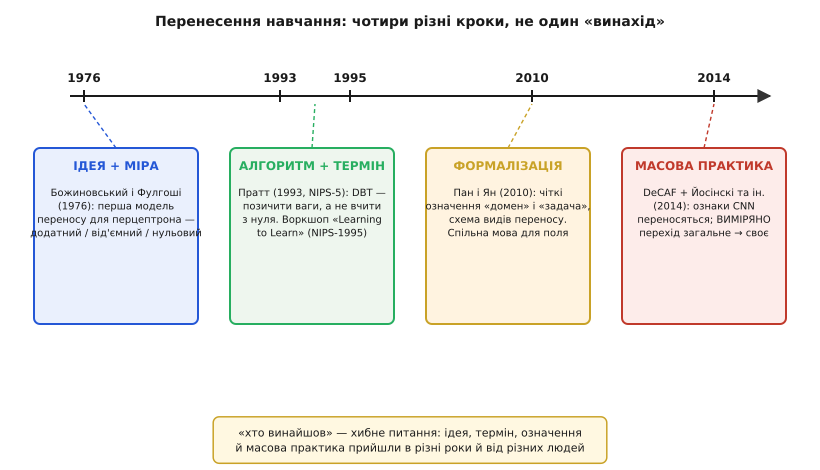

# 📜 Історія перенесення навчання

Питання «хто винайшов перенесення навчання» звучить природно, а насправді воно хибне — і зрозуміти, чому саме, вже означає зрозуміти половину історії. Бо тут не було одного винаходу. Була **ідея** — «а що, як не вчити щоразу з чистого аркуша». Був окремо **термін** і перший робочий **алгоритм**. Ще окремо — **формальні означення**, спільна мова, якою поле нарешті заговорило про себе. І геть окремо, аж за двадцять років, — **масова практика**, коли перенесення з рідкісного трюку стало звичайним першим кроком будь-якого проєкту. Чотири різні речі, чотири різні роки, різні люди на різних континентах. Плутати їх в одну — те саме, що приписати весь автомобіль тому, хто першим сказав «а нехай саме котиться».

Пройдімо ці чотири кроки по черзі — і по дорозі побачимо, звідки взялося те дивовижне спостереження, на якому все тримається: що **низ** зорової мережі майже однаковий, хоч би що вона розпізнавала.


*Чотири різні кроки, які легко злити в один «винахід». Кожен прийшов свого року й від своїх людей: ідея з мірою переносу, потім робочий алгоритм і сам термін, потім строгі означення, і аж наприкінці — вибух масової практики з першим прямим вимірюванням того, як ознаки переходять від загальних до вузько-своїх.*

## Найперша думка: перцептрон, що вже щось бачив (1976)

Задовго до того, як нейромережі стали модою, стояла проста й уперта думка: якщо машина вже навчилася розрізняти одні образи, то на **схожих** нових вона мала б стартувати не з нуля. Це ж очевидно з людей — хто набив око на одному, той швидше опанує близьке.

Найдавніший знайдений слід цієї думки, оформлений строго, — праця 1976 року **Стево Божиновського** (макед. Стево Божиновски) і **Анте Фулгоші** (хорв. Ante Fulgosi). Обидва тоді працювали в Загребі (Хорватія, на той час — Соціалістична Республіка Хорватія у складі Югославії); робота вийшла хорватською у збірнику симпозіуму «Informatica» в місті Блед (тоді теж Югославія, нині Словенія). Це важлива деталь ідентичності: поле англомовне, тож ранній слов'янський внесок легко губиться — а він був, і був першим.

> Статус доказовості: **усталено, з уточненням.** Що це найраніша формальна робота саме про перенесення в нейромережах — обґрунтований пріоритет, який сам Божиновський задокументував пізніше в окремій статті-нагадуванні (журнал «Informatica», 2020), і на неї спираються сучасні огляди. «Абсолютно перший, хто взагалі подумав» — таких заяв уникаємо: думка «вчитися на схожому» стара як саме навчання; конкретно тут ідеться про **першу формальну модель переносу** для навчання перцептрона.

Що саме вони зробили — і чому це не дрібниця. Вони взяли **перцептрон** (найпростішу навчану модель — один шар ваг, що креслить у просторі ознак одну розділову межу) і поставили питання руба: як **подібність** двох задач впливає на те, чи допоможе попереднє навчання. І дали не гасло, а **міру**. Їхня модель розрізняла три випадки, і саме ця трійця виявилася на диво живучою:

```
перенос ДОДАТНИЙ  — стара навченість ПРИСКОРЮЄ нову задачу
перенос НУЛЬОВИЙ  — стара навченість НЕ впливає
перенос ВІД'ЄМНИЙ — стара навченість ЗАВАЖАЄ, робить гірше
```

Спинися на третьому рядку. **Від'ємний перенос** — це не пізніший переляк практиків, це передбачення з першої-таки формальної моделі, ще 1976 року. Уже тоді було зрозуміло математично: якщо стара задача не рідня новій, позичена налаштованість тягне мережу в **свій** бік, і вона програє чистому аркушу. Через півстоліття інженер, у якого зорова мережа завалила розпізнавання звуку, наштовхнеться рівно на це — і не знатиме, що це передбачили ще на перцептроні.

> 🔧 **Навіщо це.** Трійця «додатний / нульовий / від'ємний» — не історична пилюка, а робочий чекліст. Беручись переносити, ти щоразу мовчки ставиш собі те саме питання Божиновського й Фулгоші: моя задача **рідня** джерелу (буде додатний), байдужа (нульовий) чи чужа (буде від'ємний)? Відповідь вирішує, чи взагалі братися за перенесення.

## Слово й алгоритм: Пратт вигадує «recycling» ваг (1993)

Далі — пауза. Ідея була, а поля не було: нейромережі у 80-х лише вибиралися з зими, і думка про перенос лежала без діла. Оживила її **Лорієн Пратт** (англ. Lorien Y. Pratt), тоді професорка Колорадської гірничої школи (Colorado School of Mines) у США. Вона поставила питання інженерно-прямо: навчання великої мережі — це **дорого**, довгі години рахунку. То **навіщо викидати** ваги, здобуті на одній задачі, і починати сусідню з випадкового шуму? Чому не **переробити старе** — не «recycle» вже здобуте?

Із цього постало те, що вона назвала **дискримінативним переносом**, DBT (англ. *Discriminability-Based Transfer*). Робота вийшла у збірнику NIPS-5 — тобто представлена на конференції NIPS наприкінці 1992 року, а надрукована 1993-го (звідси дві дати поряд: захід 1992, том 1993).

> Статус доказовості: **усталено.** DBT і авторство Пратт — задокументовані в матеріалах NIPS-5 («Advances in Neural Information Processing Systems 5», видавництво Morgan-Kaufmann). Це один із ранніх робочих алгоритмів переносу ваг між нейромережами; «найперший узагалі перенос у нейромережах» — ні, першість формальної ідеї належить праці 1976 року (вище).

Що робив DBT — і чому це крок уперед від голої ідеї. Просто **скопіювати** всі ваги зі старої мережі в нову — грубо: частина старих налаштувань новій задачі корисна, частина — сміття, що лише заважатиме. Пратт додала **розбірливість**. DBT оцінював кожну розділову межу (кожну «площину», яку креслив нейрон старої мережі) мірою **придатності** — наскільки цей нейрон узагалі допомагає відрізняти класи нової задачі. Ваги корисних нейронів переносилися сильно, некорисних — приглушувалися. Тобто не «візьми все чуже», а «візьми чуже **розбірливо**». І результат був вимірний: мережі, ініціалізовані через DBT, навчалися **помітно швидше** за ті, що стартували з випадкових ваг.

Тут народилося і слово, яким усе відтоді зветься. Пратт заговорила про **transfer** — перенесення навченого між мережами; звідси й пізніший усталений термін *transfer learning*. Ідея дістала ім'я — а названим користуватися незрівнянно легше.

## «Навчитися вчитися»: воркшоп, що зібрав розсіяних (1995)

Алгоритм є, слово є — але поля як спільноти ще нема: кожен колупався у своєму кутку, під своїми назвами. Зшив розсіяних докупи **воркшоп на NIPS-1995** із влучною назвою «**Learning to Learn**» («Навчитися вчитися»), що пройшов у Вейлі (Колорадо, США) наприкінці 1995 року. Організували його **Джонатан Бекстер** (англ. Jonathan Baxter), **Рич Каруана** (Rich Caruana), **Том Мітчелл** (Tom Mitchell), сама **Лорієн Пратт**, **Деніел Сілвер** (Daniel L. Silver) і **Себастьян Трун** (нім. Sebastian Thrun).

> Статус доказовості: **усталено.** Склад організаторів, назва й місце воркшопу задокументовані в матеріалах NIPS-1995 і в пізнішій книзі. Формулювання нижче — переказ мотивації воркшопу, а не пряма цитата.

Одна їхня теза варта того, щоб її запам'ятати, бо вона — стрижень усього: «**сила навчання з чистого аркуша обмежена**» (tabula rasa learning). Мовляв, годі щоразу вдавати, ніби мережа народжується порожньою й нічого не знає про світ; час навчитися **спиратися на вже здобуте**. Це не про один алгоритм — це зміна погляду: попереднє знання не сміття, яке скидають перед кожною новою задачею, а **капітал**, який вкладають.

Із того воркшопу виросла книга «Learning to Learn» (за редакцією Труна й Пратт, 1998) — і, головне, виросло усвідомлення, що всі ці розсіяні спроби (перенос, багатозадачне навчання, індуктивне зміщення) — про одне: **як передати знання з задачі в задачу**. Поле впізнало себе в дзеркалі.

Зверни увагу на одне ім'я в цьому списку — **Себастьян Трун**. Через двадцять років його аспірант напише експеримент, який усе це **зміряє**. Наука так і в'яжеться: думка, кинута на воркшопі, дозріває в чужих руках наступного покоління.

## Спільна мова: Пан і Ян дають означення (2010)

Минуло ще півтора десятиліття. Перенесення працювало, про нього писали — але кожен **по-своєму**: різні автори називали ті самі речі різними словами, а різні речі — тими самими. Це класична хвороба молодого поля: домовитися неможливо, бо немає спільних означень. Ліки виписали **Сінно Цзялінь Пань** (кит. 潘嵌林, англ. Sinno Jialin Pan) і **Цян Ян** (кит. 杨强, англ. Qiang Yang), тоді обидва пов'язані з Гонконгом (Ян — професор HKUST). Їхній огляд «**A Survey on Transfer Learning**» вийшов 2010 року в журналі IEEE Transactions on Knowledge and Data Engineering (том 22).

> Статус доказовості: **усталено.** Авторство, назва, журнал і рік звірені; це один із найцитованіших текстів поля саме тому, що дав спільну систему координат.

Їхній головний внесок — не новий алгоритм, а **два чіткі поняття**, без яких годі говорити строго: **домен** і **задача**. Різниця тонка, і саме тому важлива.

**Домен** (англ. *domain*) — це «з чого» вчимося: простір ознак і те, як дані в ньому **розподілені**. Формально:

```
домен  D = { X, P(X) }
   X    — простір ознак (напр. усі можливі картинки 224×224)
   P(X) — розподіл: які саме дані трапляються часто, а які рідко
```

**Задача** (англ. *task*) — це «що передбачаємо»: простір відповідей і правило, що зіставляє вхід відповіді. Формально:

```
задача  T = { Y, P(Y|X) }
   Y      — простір міток (напр. {кіт, пес, авто})
   P(Y|X) — правило: яка відповідь для даного входу
```

Навіщо це рознесення — стане очевидно на прикладі. Уяви фото котів удень і ті самі коти на нічних знімках. **Задача** та сама — «кіт чи не кіт», Y і правило незмінні. А от **домен** інший: розподіл пікселів удень і вночі геть різний, P(X) поїхав. Отже, тут переносити треба між **різними доменами при спільній задачі** — і це зовсім не те, що переносити на **іншу задачу** (скажімо, з «кіт/пес» на «здоровий/хворий») при тому самому наборі картинок. Одним словом «перенесення» ці два випадки не розрізниш — а Пан і Ян дали слова, якими розрізниш. Звідси й уся їхня карта видів переносу (коли різниться домен, коли задача, коли є мітки в цілі, коли нема). Поле дістало **спільну мову** — і суперечки «ми про те саме чи ні?» нарешті стали розв'язні.

## Вибух практики: доба ImageNet і момент, коли перенос зміряли (2014)

І тут історія робить різкий поворот — бо змінюється не теорія, а **обставини**. У 2012 році мережа **AlexNet** (Алекс Крижевський, Ілля Суцкевер, Джефрі Гінтон) виграла змагання ImageNet ILSVRC із таким відривом, що зорове розпізнавання за рік перевернулося: [глибокі згорткові мережі](root:sf-ml/cnn) раптом стали різко найкращими. І одразу спливло практичне питання, від якого вже не відмахнешся: цю величезну мережу навчали на **мільйоні** розмічених фото тижнями на дорогих машинах — **невже** щоразу для нової задачі це повторювати? А що, як просто **позичити** її нутрощі?

Виявилося — можна, і як. У 2014 році (препринт — жовтень 2013-го) вийшов **DeCAF** (англ. *Deep Convolutional Activation Feature*) — робота Джеффа Донаг'ю (Jeff Donahue) і колег із Берклі, представлена на ICML 2014. Вони зробили просту, майже нахабну річ: узяли наперед навчену на ImageNet мережу, **відрізали останній шар**, а те, що видавав передостанній, оголосили **універсальним вектором ознак** будь-якого зображення. І цей вектор, подany у простенький класифікатор, бив спеціально збудовані під задачу методи на купі геть інших наборів — сцени, породи, домени. Тобто нутрощі чужої мережі виявилися **готовим екстрактором ознак** — саме те, на чому стоїть уся сучасна практика переносу.

> Статус доказовості: **усталено.** DeCAF (Донаг'ю та ін., ICML 2014, препринт arXiv 1310.1531, жовтень 2013) і AlexNet (Крижевський, Суцкевер, Гінтон, перемога на ILSVRC-2012) звірені. «DeCAF — найперший, хто взяв ознаки CNN» — обережніше: ідея висіла в повітрі, кілька груп рухалися паралельно; DeCAF **чітко показав і віддав** ці ознаки спільноті, і цим важливий.

### Момент вимірювання: Йосінскі, Клун, Бенжіо, Ліпсон

DeCAF показав, що перенос **працює**. Але лишалося сліпе питання, від якого залежала вся стратегія: ознаки в мережі — вони **де саме** загальні, а де вже вузько-свої? Усі відчували, що низ мережі «загальніший» за верх, — але це було чуття, а не число. Його перетворив на число експеримент, який і назвали чесним питанням: «**How transferable are features in deep neural networks?**» («Наскільки переносні ознаки в глибоких нейромережах?») — **Джейсон Йосінскі** (англ. Jason Yosinski), **Джефф Клун** (Jeff Clune), **Йошуа Бенжіо** (фр. Yoshua Bengio) і **Год Ліпсон** (івр. Hod Lipson, амер.-ізраїльський інженер), NIPS 2014.

> Статус доказовості: **усталено.** Автори, назва, рік (NIPS 2014, с. 3320–3328) звірені. Це і є та праця, яка **зміряла** перехід ознак від загальних до специфічних — на неї спирається твердження основної статті, що «це не здогад, а вимір».

Задум був простий до краси. Візьмімо тисячу класів ImageNet і **розколімо** їх навпіл — набір **A** (500 класів) і набір **B** (500 класів). Тепер навчімо мережу на A. І поставмо запитання про кожен її шар: якщо **заморозити** перші *n* шарів мережі-з-A, приставити зверху решту й **доучити на B** — наскільки просяде якість проти мережі, повністю навченої на B? Просідання на шарі *n* — і є **міра специфічності** цього шару: якщо ознаки шару загальні, заморозка нічого не коштує; якщо вузько-свої (заточені під класи A), заморозка боляче б'є по задачі B.

Щоб відділити вплив **специфічності** від інших ефектів, вони ввели контрольну пару. Позначмо мережу так: перша літера — де вчилися перші шари, друга — куди переносимо, число — скільки шарів заморожено.

```
AnB — перші n шарів з мережі, навченої на A, заморожені; решта доучена на B
       (це власне ПЕРЕНЕСЕННЯ: чуже A → нова задача B)
BnB — перші n шарів з мережі, навченої на B, заморожені; решта доучена на B
       («самоперенос»: та сама задача, лише розрізана й підморожена)
```

BnB — хитрий контроль: тут **немає** чужої задачі взагалі (і брали, і доучували на тому самому B), тож будь-яке просідання BnB не можна списати на «ознаки чужі задачі» — воно з іншої причини. І порівняння AnB із BnB розкрило **дві окремі** причини, чому перенос псується. Саме ця пара, а не одна цифра, — головний здобуток роботи.

**Причина перша — крихка співадаптація сусідніх шарів** (англ. *fragile co-adaptation*). Її видно вже на BnB, де чужої задачі нема. Виявилося: якщо різати мережу **посередині** й морозити рівно перші *n* шарів, якість просідає — навіть коли доучуєш на тій самій задачі. Чому? Бо сусідні шари під час навчання **притерлися одне до одного** так тонко, що працюють лише в парі. Заморозивши перші *n*, ти лишаєш верхні шари без їхніх звичних «партнерів» — зв'язок розірвано в найтоншому місці, і градієнтне доучування верху **не вміє** відновити цю тонку взаємну підгонку з нуля. Крихка вона тому, що тримається на **спільній** налаштованості кількох шарів, а не на кожному окремо. Мораль сувора й контрінтуїтивна: шкоду завдає не «чужість» — сам **розріз** посеред притертого механізму вже коштує якості.

**Причина друга — специфічність верхніх шарів.** Оце вже видно на AnB проти BnB: заморожені **верхні** шари мережі-з-A тягнуть якість на B вниз **сильніше**, ніж пояснює сама лише співадаптація. Різниця — це і є ціна того, що верхні шари **заточені під класи A** й на класах B просто недоречні. І що глибше шар, то ця специфічність більша — рівно той градієнт «загальне → вузько-своє», про який каже основна стаття, тепер **виміряний** по шарах.

А чи є той протилежний полюс — шари, **справді** загальні? Є, і це, мабуть, найкрасивіше в роботі. Перший згортковий шар, хоч би що мережа розпізнавала, приходить до майже **тих самих** фільтрів: детектори **країв** під різними кутами (математично схожі на **фільтри Ґабора** — англ. Gabor filters, класичну модель того, як край бачить і зорова кора) і **кольорові плями**. Ці ознаки настільки універсальні, що переносяться **задарма** — заморозь їх і не втратиш нічого. Ось де корінь усієї практики: **низ** зорової мережі — це дорого вироблений, але **загальний** екстрактор країв і кольору, придатний будь-якій зоровій задачі, а вузько-своє живе **вгорі**.

І ще одне — практично найважливіше. Просідання від заморозки **зникало**, щойно замість «заморозити» брали «**доучити**» (fine-tune) перенесені шари малим кроком: тонка взаємна підгонка **відновлювалася**, і перенесена мережа не лише доганяла навчену з нуля, а часто **перевершувала** її. Ось чому [тонке доучування](root:sf-ml/train-vs-inference) працює краще за голу заморозку — це не гасло практиків, а прямий висновок вимірювання: заморозка **рве** співадаптацію, доучування — **зшиває** її назад.

## Що з цього лишилося

Склеїмо чотири кроки в одне речення — і побачимо, чому «хто винайшов» справді хибне питання. **Ідею** з мірою переносу (і, до речі, з передбаченням від'ємного переносу) дали Божиновський і Фулгоші на перцептроні 1976-го. **Слово** й перший розбірливий алгоритм — Пратт 1993-го; воркшоп «Learning to Learn» 1995-го зшив розсіяних у поле. **Спільну мову** — домен і задачу — виклали Пан і Ян 2010-го. А **масову практику** й перше пряме **вимірювання** переходу ознак від загальних до вузько-своїх приніс 2014 рік — DeCAF показав, що чужі ознаки годяться, а Йосінскі, Клун, Бенжіо й Ліпсон **зміряли**, де саме в мережі вони загальні, де свої, і назвали дві причини, чому перенос буває псується.

Найдовговічніше з усього — не алгоритми (їх переросли), а два **спостереження**. Перше, ще з 1976-го: перенос буває **від'ємним**, і чужість джерела карає. Друге, з 2014-го: низ зорової мережі — **загальний** (краї, кольори, майже Ґабор), верх — **свій**, а розрізати притерте посередині коштує якості, поки не зшиєш доучуванням. На цих двох звірених фактах — а не на чиємусь одноосібному «винаході» — і стоїть усе сучасне перенесення навчання.
