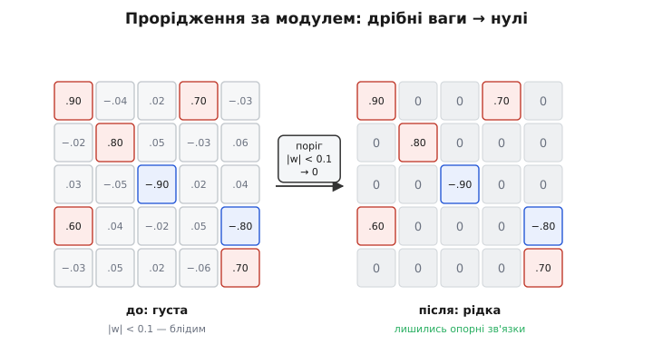
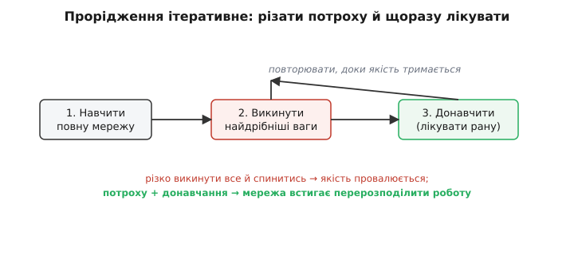

# Прорідження мережі

Візьми будь-яку сучасну нейромережу й приглянься до її ваг — тих чисел, з яких вона зіткана. Виявиться дивне: більшість із них **крихітні**, зависли коло нуля, і майже нічого не важать. Мережа їх вивчила, чесно тримає в пам'яті, множить на них кожен вхід — а прибирай їх, і відповідь майже не зміниться. Виходить, левова частка ваг — **баласт**. Прорідження (англ. *pruning* — обрізання, як садівник зрізає зайві пагони) — це прийом, що цей баласт **знаходить і викидає**: перетворює густу мережу на **рідку** (більшість зв'язків обнулено), майже не втративши якості. Менше ваг — менше пам'яті під модель і менше множень на кожен вивід.

Питання лише в тому, **які саме** ваги викидати, **як** це робити, щоб мережа не розсипалася, і — найкаверзніше — чи справді від дірок у матриці стане **швидше**. Розберімо по черзі.

## Чому в мережі стільки зайвого

Спершу — звідки взагалі береться баласт. Мережу зазвичай будують **завідомо більшою**, ніж треба задачі. Так простіше вчити: у просторій мережі багато шляхів до доброго розв'язку, [градієнтний спуск](topic:sf-ml/gradient-descent) легше знаходить один із них і не так застряє. Тобто надлишок — це **риштування для навчання**: воно потрібне, поки мережа шукає розв'язок, а коли знайшла — половину підпор можна прибрати, будівля встоїть.

Є й глибша причина. Мережа вчиться на скінченній вибірці й **дублює** знання про всяк випадок: одну й ту саму рису вхідних даних ловлять кілька нейронів трохи по-різному, багато ваг лише злегка підправляють те, що вже роблять сусіди. Ця надлишковість корисна під час навчання, але для **готової** моделі — просто зайва вага, яку тягнеш на кожному кроці.

> 🔧 **Навіщо це.** Модель майже завжди тренують «з запасом» — так вона краще вчиться. Але носити цей запас на пристрої дорого: він з'їдає [пам'ять і енергію](topic:hw-arch/compute-cost), яких на борту катма. Прорідження дає змогу спершу скористатися запасом під час навчання, а потім **зрізати** його перед розгортанням — і покласти на чип уже худу модель.

## Найпростіший критерій: за модулем ваги

Отже, треба вибрати ваги на викид. Найпростіша й водночас на диво дієва думка: **вага мала за модулем — значить, майже не впливає на відповідь, її й ріжемо**. Модуль ваги |w| — груба, але чесна оцінка її ваги в буквальному сенсі: чим менша, тим менший її внесок у зважену суму нейрона.

Прорідження за модулем (*magnitude pruning*) робить рівно це: береш поріг, і кожну вагу, чий модуль менший за поріг, ставиш **у нуль**. Не «майже нуль» — точний нуль, назавжди, з позначкою «сюди більше не вертатись». Матриця ваг, доти суцільно заповнена, стає **дірчастою**: лишаються тільки помітні зв'язки-опори, решта згасла.


*Ліворуч густа матриця ваг: чотири помітні (модуль коло 0.6–0.9) і купа дрібних коло нуля, позначених блідим. Поріг |w| < 0.1 клацає всі дрібні в точний нуль. Праворуч рідка матриця: лишились тільки опорні зв'язки, решта згасла — пам'яті під неї не треба, множити на неї не треба.*

Ось як це в коді — прохід масивом ваг із обнуленням дрібних. Разом зі значеннями ведемо **маску**: біт на кожну вагу, «жива / викинута», щоб донавчання (про нього нижче) не воскресило зрізане.

:::tabs
```cpp
// Прорідження шару за модулем: усе, що менше за поріг, — у нуль.
// w[]    — ваги шару (float), n штук
// mask[] — 1 = вага жива, 0 = викинута назавжди
void prune_by_magnitude(float *w, unsigned char *mask, int n, float thr) {
    for (int i = 0; i < n; i++) {
        if (fabsf(w[i]) < thr) {   // мала за модулем — баласт
            w[i]    = 0.0f;
            mask[i] = 0;           // позначаємо: сюди більше не вертатись
        }
    }
}
```
```python
import numpy as np

# Прорідження шару за модулем: усе, що менше за поріг, — у нуль.
# w    — ваги шару (масив float)
# Повертає нову маску: True = вага жива, False = викинута назавжди
def prune_by_magnitude(w, thr):
    mask = np.abs(w) >= thr    # де вага помітна за модулем — лишаємо
    w[~mask] = 0.0             # решту (баласт) — у нуль, сюди більше не вертатись
    return mask
```
:::

Звідки взяти сам поріг? Зазвичай не вгадують число, а задають **частку**: «хочу викинути 80% ваг». Тоді беруть усі модулі ваг, сортують і ставлять поріг там, де відсікається потрібний відсоток найдрібніших. Так контролюєш саме те, що важить — **рідкість** (англ. *sparsity*, частка обнулених ваг), — а не абстрактне значення порогу.

## Різати треба потроху й лікувати рану

Тут криється пастка, через яку наївне прорідження провалюється. Здавалося б: порахував, що 90% ваг дрібні, обнулив їх усі разом — і готово. Але зріж різко велику частку — і мережа **завалиться**: точність упаде так, що моделлю не скористаєшся. Чому? Бо навіть дрібні ваги гуртом дещо роблять, і коли їх раптово не стало, решта мережі до цього **не готова** — рівновага, яку вона надбала за тренування, збита.

Рятунок — робити це як хірург, а не як різник: **потроху й з лікуванням**. Викидаєш невелику пайку найдрібніших ваг, а тоді **донавчаєш** (*fine-tuning*) те, що лишилося, — даєш мережі кілька кроків [градієнтного спуску](topic:sf-ml/gradient-descent), щоб живі ваги **перебрали на себе** роботу викинутих. Потім знову зрізаєш трохи, знову лікуєш. І так по колу, аж поки або досягнеш бажаної рідкості, або якість почне падати — тоді спиняєшся.


*Прорідження — не одна дія, а цикл. Навчили повну мережу, викинули пайку найдрібніших ваг, донавчили решту, щоб вона перерозподілила роботу, — і знову. Різко викинути все й спинитись означає провалити якість; потроху з донавчанням мережа встигає перебудуватись і тримає точність аж до дуже високої рідкості.*

Саме через це донавчання й вражають підсумкові числа. Класична праця Сона Хана зі співавторами (Стенфорд, 2015) показала на великих мережах розпізнавання образів: [так можна викинути дев'ять із десяти ваг](topic:sf-ml/weight-pruning/hist-obd-lottery.md) — рідкість близько 90% — **без утрати** точності. Мережа з десятків мільйонів ваг ужимається в кілька мільйонів, і відповідає так само. Той запас, з яким її будували, справді виявився запасом.

## Дірки в матриці ще не дають швидкості

А тепер — найважливіше й найменш очевидне, місце, де інтуїція зраджує майже кожного. Ти обнулив 90% ваг. Здавалося б, і множень тепер удесятеро менше, і рахувати вдесятеро швидше. **Це не так** — принаймні не задарма.

Причина проста. Звичайний процесор множить матрицю на вектор **суцільно**, підряд, не питаючи, які там числа. Нуль для нього — таке саме число: множення `0 · x` він чесно виконає й додасть нуль до суми. Матриця з дірками займає в пам'яті **стільки ж** місця, що й повна (нулі теж треба десь тримати), і множиться **стільки ж** часу. Ти зекономив пам'ять і час рівно **нічого**, хоч 90% ваг — нулі.

Щоб дірки давали виграш, треба їх **не зберігати й не множити** — тримати лише живі ваги в спеціальному «рідкому» форматі (індекси ненульових плюс їхні значення) і множити тільки їх. Але тут інша біда: розсипані по всій матриці поодинокі ненулі процесор читає **стрибками** пам'яті, а стрибки для нього дорогі — кеш працює на суцільних даних. Часто виходить, що рідке множення поодиноких ваг **повільніше** за щільне множення всієї матриці, дарма що арифметики менше. Виграш у пам'яті лишається, у швидкості — не завжди.

Через це прорідження ділять на два роди, і різниця між ними — практично головне в темі.


*Ліворуч неструктуроване прорідження: обнулені ваги розсипані по всій матриці поодинці. Ненулів менше, але форма матриці та сама, тож звичайний процесор рахує її так само довго. Праворуч структуроване: викинуто **цілі** рядки — цілі нейрони; матриця буквально меншає, і менше рядків означає менше роботи на будь-якому залізі.*

**Неструктуроване** прорідження (те, що ми робили дотепер) обнуляє **окремі** ваги, де впало. Дає найбільшу рідкість за найменших утрат точності — бо вибирає баласт найточніше, вагу за вагою. Але дірки розсипані, тож без особливого заліза чи бібліотек **швидшого виводу не буде**, лише менша модель на диску.

**Структуроване** прорідження викидає ваги **гуртами по структурі**: цілий нейрон (рядок матриці), цілий канал, цілий згортковий фільтр у [згортковій мережі](topic:sf-ml/cnn). Викинув нейрон — матриця буквально **поменшала на рядок**, і це вже щільна менша матриця, яку **будь-який** процесор перемножить швидше. За рідкість платиш точністю трохи більше (гуртом летить і дещо корисне), зате виграш у швидкості **реальний і на звичайному залізі**.

Ось перевірка на структуроване прорідження — чи цілий нейрон вихідного шару можна викинути. Дивимось не на одну вагу, а на **всі вхідні ваги нейрона** гуртом: якщо всі до одної мізерні, нейрон майже нічого не додає — його разом із рядком матриці можна прибрати цілком.

:::tabs
```cpp
// Чи можна викинути весь нейрон: рахуємо суму модулів його вхідних ваг.
// row[]  — рядок матриці: усі ваги, що входять в один нейрон
// cols   — скільки їх (входів)
// Мала сума → нейрон майже не працює → цілий рядок геть (структуровано).
int neuron_is_dead(const float *row, int cols, float eps) {
    float energy = 0.0f;
    for (int j = 0; j < cols; j++)
        energy += fabsf(row[j]);      // сумарна «сила» нейрона
    return energy < eps;              // 1 = кандидат на викид цілком
}
```
```python
import numpy as np

# Чи можна викинути весь нейрон: рахуємо суму модулів його вхідних ваг.
# row — рядок матриці: усі ваги, що входять в один нейрон
# Мала сума → нейрон майже не працює → цілий рядок геть (структуровано).
def neuron_is_dead(row, eps):
    energy = np.abs(row).sum()    # сумарна «сила» нейрона
    return energy < eps           # True = кандидат на викид цілком
```
:::

Вибір між родами — це вибір, **що тобі дорожче**. Треба менша модель у флеші, а швидкість не критична або є підтримка рідких обчислень — бери неструктуроване, воно тисне сильніше. Треба саме **швидший вивід** на звичайному мікроконтролері — бери структуроване, дарма що рідкість вийде скромніша.

## Розумніший критерій: не всі малі ваги однакові

Модуль ваги — груба мірка. Мала вага **зазвичай** маловажлива, але не завжди: буває, крихітна вага сидить на дуже чутливому місці, і прибери її — відповідь помітно зсунеться. І навпаки, велика вага може лежати там, де її вплив гаситься іншими. Точніша мірка питає не «яка вага мала?», а «наскільки **зросте помилка**, якщо цю вагу занулити?» — і цю величину звуть **виразністю** (*saliency*, від лат. *salire* — вистрибувати; те, що вирізняється).

Історично саме з такого критерію все й почалося. Ще 1989 року Ян Лекун зі співавторами запропонував метод із промовистою назвою [Optimal Brain Damage](topic:sf-ml/weight-pruning/hist-obd-lottery.md) — «оптимальне ушкодження мозку»: він оцінював не модуль ваги, а її виразність через **другу похідну** помилки, тобто наскільки круто помилка зросте від занулення саме цієї ваги. Це давало розумніший вибір, ніж «ріж усе дрібне», але коштувало дорого: другі похідні для всіх ваг великої мережі рахувати важко. Тому на практиці частіше беруть дешевий модуль — а докладний [розбір виразності: модуль, лінійне наближення й друга похідна — у сусідній вставці](topic:sf-ml/weight-pruning/math-pruning-saliency.md).

> 🔧 **Навіщо це.** Критерій вибору ваг — це компроміс «точність відбору проти вартості лічби». Модуль майже безплатний і на диво добрий — з нього й починай, у 90% випадків його досить. Тягнися до виразності на других похідних лише коли модуль явно ріже щось важливе й точність провалюється раніше, ніж хотілося б. Не ускладнюй критерій, поки простий працює.

## Несподіванка: щасливі квитки

Довго прорідження вважали суто **післяобробкою**: навчив велику мережу, потім зрізав зайве. Мовляв, рідку мережу з нуля не навчиш — їй бракне того самого простору, що потрібен для навчання. Аж 2018 року Джонатан Френкл і Майкл Карбін показали дещо, що перевернуло погляд, — **гіпотезу щасливого квитка** (*lottery ticket hypothesis*).

Ідея така. Усередині великої мережі **вже сховано** маленьку рідку підмережу, яку — якби ти знав, котра вона, — можна було б навчити **з нуля** до тієї самої якості, що й усю велику. Наче велика мережа купила купу лотерейних квитків, і серед них є **виграшний** — вдало розташована жменька зв'язків із вдалими початковими значеннями. Навчання великої мережі — це, по суті, спосіб **знайти** цей квиток серед решти. А знайшовши (тим самим прорідженням за модулем), можна відкотити його ваги до **початкових** значень і навчити саму підмережу — і вона виграє, дарма що в десять разів менша.

Це не просто цікавинка. Воно пояснює, **чому** прорідження взагалі працює: не «велика мережа надлишкова, обчешемо жир», а «велика мережа — це лотерея, у якій ми шукаємо готовий маленький розв'язок». І воно натякає на мрію: якби вміти вгадувати виграшний квиток **наперед**, велику мережу не довелося б і будувати. Поки що надійно вгадувати не навчилися — виграшний квиток видно лише **після** того, як велику мережу натренуєш, — але напрям заданий.

## Прорідження серед сусідів по стисненню

Прорідження — не самотній прийом, а один із кількох, якими [ужимають модель під пристрій](topic:sf-ml/tinyml), і найкраще вони працюють **разом**. [Квантування](topic:sf-ml/model-quantization) тисне **кожну** вагу, роблячи її коротшою (32 біти → 8): ортогонально до прорідження, яке ваги **викидає**, тож обидва складають без конфлікту — рідка й квантована модель. [Дистиляція знань](topic:sf-ml/knowledge-distillation) заходить з іншого боку: натомість щоб чесати велику мережу, малу мережу-учня **вчать копіювати** відповіді великої. Типовий бойовий конвеєр складає все: узяти компактну архітектуру, **прорідити** її, **квантувати** те, що лишилось, — і аж тоді класти на чип.

Ще одна межа, яку варто провести чітко, — прорідження проти [регуляризації](topic:sf-ml/regularization). Обидва **карають зайву складність**, але по-різному й у різний час. Регуляризація діє **під час** навчання, м'яко притискаючи ваги до нуля, щоб мережа не [перевчилась](topic:sf-ml/overfitting) на шумі; вона робить ваги дрібними, але не викидає їх. Прорідження діє **різко й назавжди**: цю вагу — в нуль, і крапка. Гарно, що вони дружать: регуляризація заздалегідь **зганяє** баласт до нуля, а тоді прорідженню легше його впізнати й зрізати.

## Підсумок теми

Нейромережу будують більшою, ніж треба задачі, — так легше вчити, — тож у готовій моделі більшість ваг виявляються **баластом** коло нуля. **Прорідження** цей баласт викидає, обнуляючи слабкі ваги й перетворюючи густу мережу на **рідку** — менше пам'яті, потенційно менше лічби, майже без утрати якості. Найпростіший критерій — **за модулем**: усе, менше за поріг, у нуль; поріг задають через бажану частку викинутого (рідкість). Робити це треба **потроху з донавчанням**, бо різкий зріз великої частки завалює точність, а поступовий цикл «зрізати → долікувати» дає живим вагам перебрати роботу викинутих — так вдається викинути до дев'яти ваг із десяти дарма. Головна пастка: **неструктуроване** прорідження (окремі ваги) дає меншу модель, але без особливого заліза **не швидшу** — розсипані нулі процесор усе одно множить; **структуроване** (цілі нейрони, канали, фільтри) меншає модель буквально й прискорює вивід на будь-якому залізі, платячи трохи більшою втратою точності. Точніший за модуль критерій — **виразність** (наскільки зросте помилка від занулення ваги, як в Optimal Brain Damage 1989-го), але він дорожчий у лічбі. А **гіпотеза щасливого квитка** (2018) показала, що всередині великої мережі вже схована маленька рідка підмережа, здатна навчитися з нуля до тієї ж якості, — прорідження радше **знаходить** готовий малий розв'язок, ніж обчісує зайве. Разом із [квантуванням](topic:sf-ml/model-quantization) і [дистиляцією](topic:sf-ml/knowledge-distillation) прорідження — один зі стовпів того, як велика модель [їде на крихітний чип](topic:sf-ml/tinyml).
