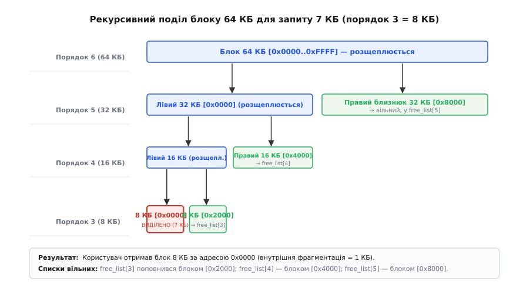
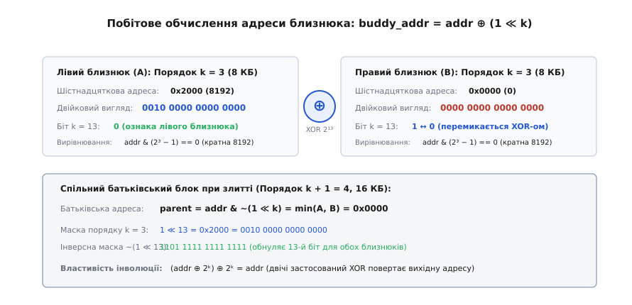
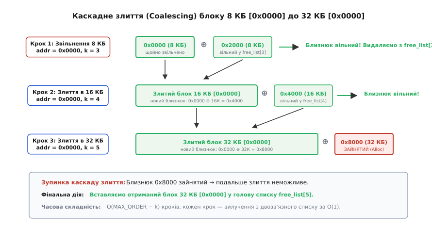
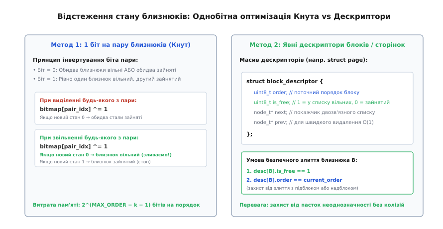

# Алокатор двійкових близнюків (Buddy Allocator)

<preknowlist>
- [Зв'язний список](root:sf-algorithms/linked-list) — вузли з покажчиками на сусідів; вставка й видалення за відомим покажчиком за O(1).
- [Двійкове дерево](root:sf-algorithms/binary-tree) — ієрархія, де кожен вузол має лівого й правого нащадка, а висота дерева логарифмічна від кількості листків.
- [Вирівнювання даних у пам'яті](root:sf-apps/memory-alignment) — кратність адреси розміру блоку та наслідки обнулення молодших бітів.
- [Віртуальна пам'ять](root:hw-arch/virtual-memory) — поділ фізичного простору на сторінки фіксованого розміру та керування вільними фреймами ядра.
</preknowlist>

Операційна система стартує на сервері з шістдесятьма чотирма гігабайтами оперативної пам'яті. Сотні процесів одночасно породжують і знищують потоки, відкривають файлові дескриптори, виділяють буфери для мережевих пакетів і запитують пам'ять під структури ядра: драйверу мережевої карти потрібен неперервний буфер на шістдесят чотири кілобайти для прямого доступу до пам'яті (DMA), системний виклик створення процесу просить дві сторінки по чотири кілобайти під стек ядра, а дисковий кеш захоплює блоки по два мегабайти. Кожна виділена ділянка має різну тривалість життя: мережевий пакет обробляється за кілька мікросекунд, стек процесу існує години, а дисковий кеш утримується тижнями.

Якщо керувати цією пам'яттю за допомогою наївного зв'язного списку вільних ділянок, система швидко деградує. Пошук підхожого шматка алгоритмом першого підхожого (First-Fit) або найкращого підхожого (Best-Fit) змушує ядро перебирати десятки тисяч вузлів списку, витрачаючи мілісекунди на кожне виділення сторінки під час обробки переривань. Ще гірше те, що після звільнення сотень тисяч дрібних об'єктів пам'ять неминуче розбивається на хаотичні уламки: у системі може бути сорок гігабайтів сумарно вільного простору, але жодної неперервної ділянки розміром шістдесят чотири кілобайти. Запит на виділення буфера DMA завершується відмовою, а перемістити зайняті блоки (виконати дефрагментацію з ущільненням) неможливо, оскільки фізичні адреси вже передані апаратним контролерам і зафіксовані в таблицях сторінок.

Щоб подолати цей глухий кут, системному розподілювачу пам'яті потрібні дві суперечливі властивості: вміти знаходити блок потрібного розміру за сталий або логарифмічний час `O(log N)` і миттєво об'єднувати сусідні вільні шматки при звільненні без лінійного сканування списків пам'яті. Рішення полягає в тому, щоб накласти жорстку геометричну дисципліну на всі допустимі розміри блоків. Пам'ять ділиться виключно на блоки, розміри яких є степенями двійки, причому кожен блок завжди має рівно одного симетричного напарника. Такий механізм називається алокатором двійкових близнюків (від латинського *allocare* — призначати, розподіляти; англійською *buddy allocator*, де *buddy* — приятель, близнюк, напарник).

## Геометрія двійкових розбиттів: порядки та інваріанти

Алокатор бере під контроль суцільний пул пам'яті, загальний розмір якого є степенем двійки `2ᴹ` байтів (або базових сторінок). Розмір будь-якого виділеного або вільного блоку в такій системі також зобов'язаний бути степенем двійки `2ᵏ`, де ціле число `k` називається **порядком** блоку (англ. *order*). Мінімальний порядок `k_min` зазвичай визначається розміром базової сторінки архітектури (4 КБ) або розміром службового вузла списку (16 байтів), а максимальний `k_max = M` відповідає всьому пулу.

Головний принцип системи полягає у правилі симетричного розщеплення та злиття:
1. **Розщеплення (Split):** Блок порядку `k` можна розділити виключно на два однакові блоки порядку `k − 1`. Ці два блоки називаються **близнюками** (buddies) один для одного.
2. **Злиття (Coalesce):** Два вільні блоки порядку `k − 1` можуть бути об'єднані в один блок порядку `k` тоді й тільки тоді, коли вони є взаємними близнюками — тобто походять від розщеплення того самого батьківського блоку.


*Рекурсивний поділ блоку розміром 64 КБ для задоволення запиту на 7 КБ. Початковий блок порядку 6 послідовно розщеплюється навпіл через порядки 5 та 4 до порядку 3 (8 КБ). Ліві половини розщеплюються далі, а праві близнюки розміром 32 КБ, 16 КБ та 8 КБ додаються у відповідні списки вільних блоків.*

Цей поділ утворює повне двійкове дерево. Корінь дерева відповідає всьому пулу пам'яті порядку `M`, а листки — блокам мінімального порядку `k_min`. При цьому фізично жодного графа з покажчиками між батьками й дітьми в пам'яті будувати не потрібно: структура дерева неявно закладена в самих числових значеннях адрес.

Звідси випливає критично важливий нюанс, який часто спричиняє помилки в саморобних реалізаціях: **сусідство за адресою не означає близнюцтва**. Якщо в пулі розміром 64 КБ вільні два блоки по 16 КБ за зміщеннями 16 КБ (`0x4000`) та 32 КБ (`0x8000`), вони лежать впритул один до одного, але об'єднати їх у блок 32 КБ не можна. Блок за адресою `0x4000` є правим близнюком блоку `0x0000` (перша 32-кілобайтна половина), тоді як блок `0x8000` є лівим близнюком блоку `0xC000` (друга 32-кілобайтна половина). Їхнє злиття створило б ділянку `[0x4000..0xBFFF]`, початкова адреса якої не кратна 32 КБ, що зруйнувало б усю подальшу математику алокатора.

## Побітова арифметика близнюків: магія оператора XOR

Найвизначнішою перевагою двійкового алокатора є те, що пошук близнюка не потребує звернення до таблиць, хеш-мап чи проходу по дереву. Адреса близнюка обчислюється рівно однією процесорною інструкцією.

Кожен блок порядку `k` (розміром `2ᵏ`) задовольняє **інваріант природного вирівнювання**: його початкова адреса завжди кратна `2ᵏ`. Це означає, що в двійковому поданні адреси молодші `k` бітів (від нульового до `k − 1`) обов'язково дорівнюють нулю:

```
Порядок k = 3 (розмір 8 КБ = 0x2000 = 2¹³ байтів)
Адреса: ... b₁₅ b₁₄ b₁₃ 0 0 0 0 0 0 0 0 0 0 0 0 0
```

Розглянемо спільний батьківський блок порядку `k + 1`, адреса якого кратна `2ᵏ⁺¹` (його `k`-й біт дорівнює нулю). Коли цей блок розпадається на два близнюки порядку `k`:
- **Лівий близнюк** починається з тієї самої адреси, що й батько. Його `k`-й біт дорівнює **0**.
- **Правий близнюк** зсунутий праворуч на `2ᵏ` байтів. Його `k`-й біт дорівнює **1**.

Усі інші біти (і старші за `k`, і молодші за `k`) в адресах обох близнюків абсолютно ідентичні. Отже, щоб отримати адресу напарника для будь-якого блоку, достатньо просто **інвертувати його `k`-й біт**. У двійковій арифметиці інверсію окремого біта виконує операція виключного АБО (`XOR`, мовами C/C++ оператор `^`) з числом `2ᵏ`:

```
buddy_address = block_address ^ (1 << k)
```


*Схема побітового обчислення адреси близнюка через оператор XOR. Для блоку порядку 3 (розмір 8 КБ = 2¹³ байтів) бітова маска 1 ≪ 13 перемикає 13-й розряд адреси. Інверсна маска ~(1 ≪ 13) обнуляє цей біт, миттєво обчислюючи базову адресу батьківського блоку при їхньому злитті.*

Розберемо це на конкретних числах. Нехай розмір пулу дорівнює 64 КБ, а ми працюємо з блоками порядку 13 (`2¹³ = 8192` байти = 8 КБ):

```
Лівий близнюк:   A = 0x2000  (двійкове: 0010 0000 0000 0000)
Маска порядку:   M = 1 << 13 (двійкове: 0010 0000 0000 0000)

Обчислення правого:
B = A ^ M
= 0x2000 ^ 0x2000
= 0x0000                      (двійкове: 0000 0000 0000 0000)

Обчислення назад:
A = B ^ M
= 0x0000 ^ 0x2000
= 0x2000                      (двійкове: 0010 0000 0000 0000)
```

Оскільки операція `XOR` є інволюцією (`x ⊕ y ⊕ y = x`), вона працює абсолютно симетрично в обидва боки: для лівого близнюка дає правого, а для правого — лівого.

Коли обидва близнюки вільні й об'єднуються у спільний батьківський блок порядку `k + 1`, початкова адреса батька завжди є меншою з двох адрес і має нуль у `k`-му біті. Вона обчислюється побітовим «І» з інвертованою маскою:

```
parent_address = block_address & ~(1 << k)
```

Ці дві операції — `^ (1 << k)` та `& ~(1 << k)` — становлять математичне ядро двійкового алокатора. Жодних операцій ділення, залишків чи циклічних пошуків у пам'яті: процесор виконує їх за один такт. Детальний математичний апарат, алгебраїчні властивості інволюцій та строгості вирівнювання викладено у вставці [🧮 Математичний апарат двійкових близнюків та аналіз фрагментації](root:sf-os/buddy-allocator/math-buddy-arithmetic.md).

## Структура даних: масив списків вільних блоків

Щоб операція виділення пам'яті виконувалася за `O(1)` у типовому випадку, алокатор не тримає всі вільні блоки в одній купі. Замість цього використовується масив двозв'язних списків `free_lists`, де кожному порядку `k` виділено власний незалежний список:

```
free_lists[0]  (порядок 4,  16 Б)   -> [блок] <-> [блок] <-> NULL
free_lists[1]  (порядок 5,  32 Б)   -> NULL
free_lists[2]  (порядок 6,  64 Б)   -> [блок] <-> NULL
...
free_lists[12] (порядок 16, 64 КБ)  -> NULL
```

Оскільки вільні блоки є незайнятою пам'яттю, самі вузли двозв'язного списку (покажчики `prev` та `next`) розміщуються **всередині тіла вільного блоку** (інтрузивна організація). Це означає, що алокатор не витрачає жодного байта додаткової динамічної пам'яті на підтримку самих списків: вільний блок на 4 КБ сам зберігає вказівники на своїх сусідів за списком у своїх перших 16 байтах.

### Алгоритм виділення пам'яті (Allocation)

Коли надходить запит на виділення `S` байтів:
1. **Обчислення цільового порядку:** Розмір `S` округлюється вгору до найближчого степеня двійки `2ᵏ`, де `k = max(k_min, ⌈log₂ S⌉)`. Наприклад, запит на 5 КБ округлюється до `k = 13` (8 КБ).
2. **Перевірка списку відповідного порядку:** Алокатор дивиться у `free_lists[k]`. Якщо список не порожній, перший блок вилучається за `O(1)` і негайно повертається користувачеві.
3. **Пошук старшого донора:** Якщо список порожній, алокатор іде вгору за масивом списків `j = k + 1, k + 2, ..., k_max`, шукаючи перший непорожній список. Якщо всі старші списки порожні — пам'ять вичерпана (`NULL`).
4. **Каскадне розщеплення:** Знайдений великий блок порядку `j` вилучається зі свого списку і послідовно ділиться навпіл. На кожному кроці розщеплення від `j` вниз до `k + 1`:
   - Блок ділиться на лівого й правого близнюків розміром `2ᵐ⁻¹`.
   - Правий близнюк поміщається у список вільних `free_lists[m - 1]`.
   - Лівий близнюк іде на наступний крок розщеплення.
5. **Видача блоку:** Лівий блок фінального порядку `k` позначається як зайнятий і повертається зухвало швидко: сумарна кількість ітерацій не перевищує `k_max − k_min` (зазвичай від 10 до 16 кроків).

## Звільнення пам'яті та каскадне злиття

Виділити пам'ять — лише половина справи. Справжня сила двійкових близнюків розкривається під час звільнення (`free`), коли алокатор автоматично відновлює великі неперервні ділянки.


*Покрокове каскадне злиття блоку 8 КБ при звільненні. На першому кроці звільнений блок 0x0000 знаходить вільного близнюка 0x2000 і об'єднується в 16 КБ. На другому кроці новий блок 0x0000 об'єднується з вільним близнюком 0x4000 у 32 КБ. На третьому кроці близнюк 0x8000 виявляється зайнятим, злиття зупиняється, і блок 32 КБ вставляється у free_list[5].*

Коли користувач повертає блок адреси `A` порядку `k`:
1. **Обчислення напарника:** Алокатор рахує адресу близнюка `B = A ⊕ 2ᵏ`.
2. **Перевірка статусу близнюка:** Алокатор перевіряє:
   - Чи є блок `B` вільним у цей момент?
   - Чи має блок `B` **той самий порядок `k`**?
3. **Об'єднання:** Якщо обидві умови виконано:
   - Блок `B` вилучається зі списку вільних `free_lists[k]`.
   - Базова адреса стає `P = A & ~(2ᵏ)`.
   - Порядок збільшується: `k ← k + 1`, `A ← P`.
   - Процес повторюється для нового порядку (спроба злитися з близнюком порядку `k + 1`).
4. **Зупинка:** Щойно на черговому кроці близнюк виявляється зайнятим або розщепленим на дрібніші частини, каскад зупиняється, а підсумковий об'єднаний блок додається у список `free_lists[k]`.

Зверніть увагу: жоден інший блок у системі не чіпається. Усі операції вилучення зі списку двозв'язні й коштують `O(1)`, а кількість злиттів обмежена висотою дерева `O(log N)`.

## Пастка неоднозначності та відстеження стану блоків

Під час злиття постає підступне інженерне питання: як алокатор дізнається, що блок `B` вільний і має саме порядок `k`?

Уявімо, що ми звільняємо лівий блок 16 КБ за адресою `0x0000` (порядок 14). Його близнюк `0x4000` фізично існує в пам'яті. Проте за адресою `0x4000` може відбуватися одна з трьох абсолютно різних ситуацій:
1. Блок `0x4000` повністю виділений користувачеві як єдиний блок 16 КБ.
2. Блок `0x4000` вільний як цілісний блок 16 КБ (лежить у `free_lists[14]`).
3. Блок `0x4000` раніше був розщеплений на два блоки по 8 КБ (`0x4000` та `0x6000`), і з них перший зараз вільний, а другий зайнятий важливими даними!

Якщо алокатор перевірить лише початок пам'яті `0x4000` і побачить там ознаку «вільний», він ризикує помилково об'єднати свій блок із підблоком 8 КБ, затерши зайняті дані за адресою `0x6000`.


*Два підходи до відстеження стану блоків. Ліворуч — метод Кнута з одним бітом на пару близнюків, де біт інвертується при зміні стану будь-якого з напарників. Праворуч — масив явних дескрипторів сторінок (як struct page у Linux), що зберігає точний порядок і прапорець зайнятості для кожного мінімального кванта пам'яті.*

Для подолання цієї пастки застосовують два класичні підходи:

### 1. Явні дескриптори блоків (підхід ядра Linux)
Уся пам'ять розбивається на мінімальні кванти (наприклад, сторінки по 4 КБ). Для кожного кванта створюється фіксований дескриптор у глобальному масиві (у ядрі Linux це масив `struct page` під назвою `mem_map`). Дескриптор першої сторінки блоку зберігає його точний порядок (`page->private = order`) та системний прапорець `PG_buddy` (ознака перебування у вільному списку).

Перевірка близнюка стає тривіальною:
```c
struct page *buddy = page_to_buddy(page, order);
if (page_is_buddy(buddy, order)) {
    /* близнюк вільний і має саме цей порядок — зливаємо */
}
```

### 2. Бітова карта пар близнюків (елегантний метод Кнута)
Якщо збереження дескрипторів занадто дороге для вбудованої системи, Дональд Кнут запропонував трюк: на кожному рівні `k` заводиться бітова карта, де **один біт відповідає парі близнюків**.
- Початково біт дорівнює `0` (обидва вільні або обидва не існують).
- Коли будь-який блок із пари виділяється або розщеплюється, біт інвертується (`bit ^= 1`).
- Якщо біт дорівнює `1` — це означає, що рівно один із близнюків зайнятий, а інший вільний.
- Коли звільняється блок, ми знову інвертуємо біт: якщо значення стало `0`, це беззаперечний доказ того, що його напарник був вільним і мав той самий порядок.

Цей прийом зменшує службові витрати пам'яті до мізерних часток відсотка від загального обсягу пулу. Повний опис функціонального контракту, форматів дескрипторів та правил безпеки викликів наведено у вставці [📋 Специфікація програмного інтерфейсу Buddy Allocator API](root:sf-os/buddy-allocator/api-buddy-allocator.md).

## Ціна простоти: аналіз внутрішньої та зовнішньої фрагментації

Жодна структура даних не буває безкоштовною. Платою за швидкість `O(log N)` та миттєве злиття в алокаторі близнюків є **внутрішня фрагментація** (англ. *internal fragmentation*).

### Внутрішня фрагментація
Оскільки всі блоки квантуються строго за степенями двійки, будь-який запит, розмір якого лише трохи перевищує степінь двійки, спричиняє значний надлишок виділеного простору:
- Запит на 33 КБ змушує виділити блок 64 КБ (31 КБ пам'яті, або 48.4%, марнується всередині блоку).
- Запит на 65 байтів отримує 128 байтів (втрата 49.2%).

Як суворо доведено в математичному аналізі, при типовому логарифмічно-рівномірному розподілі запитів середня внутрішня фрагментація становить близько **28%**.

### Зовнішня фрагментація та боротьба з нею
Хоча алокатор близнюків агресивно бореться із зовнішньою фрагментацією шляхом злиття, він не може усунути її повністю. Класичний сценарій шахівниці: якщо програма виділить сотні дрібних блоків по 4 КБ через кожні 64 КБ, а потім звільнить усі проміжні великі блоки, жоден блок розміром 64 КБ не зможе зібратися докупи, оскільки в кожному з них «застряг» один зайнятий листок 4 КБ.

У сучасних операційних системах цю проблему розв'язують двома фундаментальними архітектурними прийомами:

1. **Дворівнева ієрархія (Buddy + SLAB/SLUB):**
   Алокатор близнюків ніколи не використовують безпосередньо для виділення дрібних об'єктів (наприклад, 32 чи 128 байтів). Алокатор близнюків керує виключно великими сторінками пам'яті (від 4 КБ і більше). Поверх нього працює кешувальний алокатор об'єктів (Slab/Slub у ядрі Linux або `malloc`/`jemalloc` у просторі користувача), який бере у близнюків велику сторінку й акуратно нарізає її на сотні однакових дрібних структур.

2. **Зонування за міграційними типами (Page Mobility Grouping):**
   Ядро Linux розділяє запити на пам'ять на три класи:
   - `MIGRATE_UNMOVABLE` — структури ядра, прив'язані до фізичних адрес (буфери драйверів, таблиці сторінок).
   - `MIGRATE_RECLAIMABLE` — кеші файлових систем (inode, dentry), які можна скинути на диск і звільнити.
   - `MIGRATE_MOVABLE` — сторінки користувацьких процесів, які MMU дозволяє прозоро перемістити в інше фізичне місце, оновивши лише таблицю віртуальних адрес.

Кожен міграційний тип обслуговується окремими великими блоками близнюків. Завдяки цьому «нерухомі» сторінки ніколи не потрапляють усередину блоків рухомої пам'яті, що зберігає здатність алокатора укрупнювати пам'ять до величезних блоків (Huge Pages по 2 МБ та 1 ГБ).

## Історичний контекст та еволюція

Ідея двійкового розщеплення пулу пам'яті на симетричні половини народилася на початку 1960-х років. У 1963 році Гаррі Марковіц (Harry Markowitz) застосував цей підхід у симуляторі SIMSCRIPT, а в 1965 році Кеннет Ноултон (Kenneth Knowlton) опублікував першу класичну статтю в *Communications of the ACM*, закріпивши термін *buddy*. 

Згодом Дональд Кнут довів математичну тотожність адресації близнюків через XOR-маскування, а в 1970-х роках з'явилися модифікації на базі чисел Фібоначчі (Fibonacci Buddy System) та зважених дерев (Weighted Buddy System), які зменшували внутрішню фрагментацію ціною ускладнення адресної арифметики. Повну хронологію розвитку ідей від перфокарт IBM 7090 до сучасних суперкомп'ютерів зібрано у вставці [📜 Історія винайдення алокатора двійкових близнюків](root:sf-os/buddy-allocator/hist-buddy-allocator.md).

## Практична реалізація та порівняння мовами C і C++

Нижче наведено порівняльний каркас реалізації алокатора близнюків. На системному рівні мова C спирається на прямі маніпуляції з адресними зміщеннями та інтрузивними списковими вузлами, тоді як сучасний C++20 інкапсулює пам'ять через безпечні типи `std::span<std::byte>`, концепт джерела пам'яті та апаратний підрахунок розрядності `std::bit_width`.

:::tabs
```c
/* Базові операції двійкового розщеплення та злиття мовою C */
uintptr_t buddy_find_twin(uintptr_t offset, uint8_t order) {
    return offset ^ ((uintptr_t)1 << order);
}

uintptr_t buddy_find_parent(uintptr_t offset, uint8_t order) {
    return offset & ~((uintptr_t)1 << order);
}

/* Перевірка можливості злиття двох блоків */
bool buddy_can_coalesce(const block_tag_t *tags, uintptr_t buddy_idx, uint8_t order) {
    return tags[buddy_idx].is_free && (tags[buddy_idx].order == order);
}
```
```cpp
// Еквівалентні операції мовою C++20 з використанням типізованих зміщень
#include <cstdint>
#include <concepts>
#include <bit>

[[nodiscard]] constexpr uintptr_t buddy_find_twin(uintptr_t offset, uint8_t order) noexcept {
    return offset ^ (1ULL << order);
}

[[nodiscard]] constexpr uintptr_t buddy_find_parent(uintptr_t offset, uint8_t order) noexcept {
    return offset & ~(1ULL << order);
}

[[nodiscard]] constexpr uint8_t size_to_order(size_t bytes, size_t min_block_size) noexcept {
    if (bytes <= min_block_size) return static_cast<uint8_t>(std::countr_zero(min_block_size));
    return static_cast<uint8_t>(std::bit_width(bytes - 1));
}
```
:::

Повний, готовий до компіляції проєкт алокатора з підтримкою ініціалізації, розщеплення, виділення, звільнення та захисту від подвійного очищення розібрано у вставці [⚙️ Реалізація алокатора двійкових близнюків мовами C та C++](root:sf-os/buddy-allocator/proj-buddy-c.md).

## Підсумковий синтез: коли застосовувати алокатор близнюків

Алокатор двійкових близнюків залишається золотим стандартом у тих інженерних задачах, де швидкодія, передбачуваність затримок і захист від зовнішньої фрагментації важать більше, ніж ідеальна щільність пакування байтів:

1. **Менеджери фізичних сторінок операційних систем:** Ядра Linux, FreeBSD, macOS та Windows використовують подібні схеми для виділення неперервних блоків оперативної пам'яті (сторінкових кадрів) для потреб підсистеми віртуальної пам'яті та DMA.
2. **Графічні процесори та драйвери Vulkan/DirectX 12:** Виділення великих буферів текстур і вершинних буферів у відеопам'яті (VRAM), де розміри ресурсів природно кратні степеням двійки.
3. **Системи реального часу (RTOS) та вбудовані контролери:** Завдяки логарифмічно обмеженому часу відгуку `O(log N)` алокатор гарантує відсутність непередбачуваних пауз під час виділення та звільнення пам'яті, що є критичним для авіоніки, автомобільної електроніки та телекомунікаційного обладнання.
