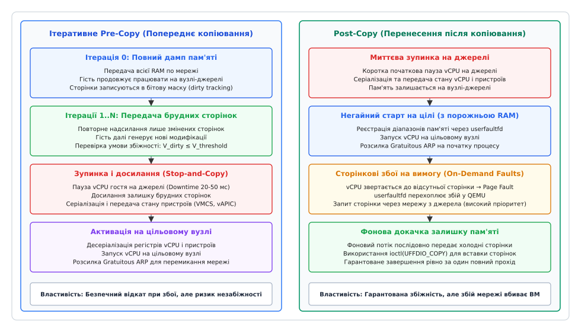
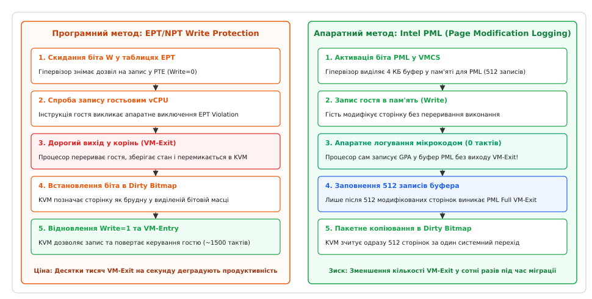
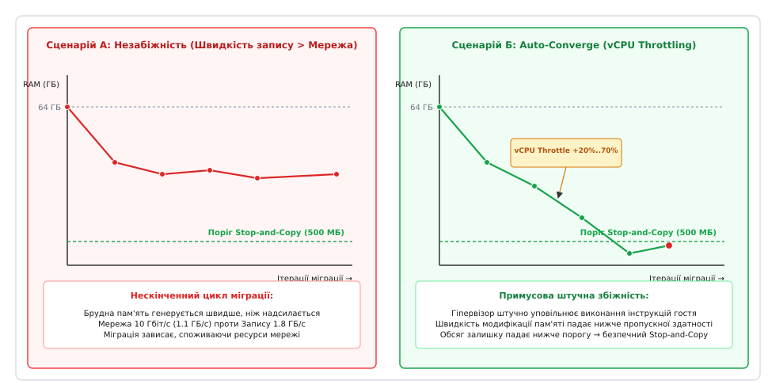
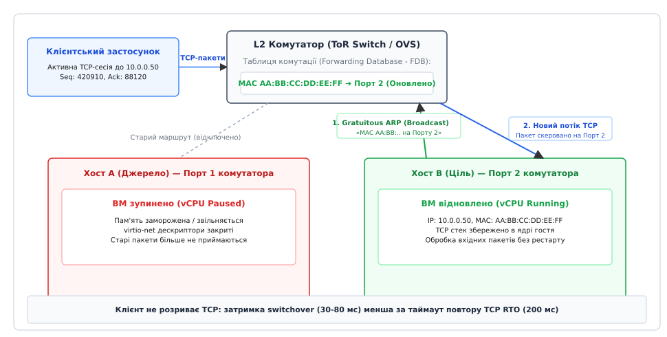

# Жива міграція віртуальної машини: перенести працюючий гість без зупинки

<preknowlist>
- [Апаратна віртуалізація](topic:hw-arch/hardware-virtualization) — режими VMX root/non-root, структури VMCS/VMCB та обробка VM-exit.
- [Віртуальна пам'ять](topic:hw-arch/virtual-memory) — дворівнева трансляція адрес (EPT/NPT), сторінкові збої та біти доступу PTE.
- [userfaultfd](topic:sys-unix/userfaultfd) — перехоплення та обробка сторінкових збоїв у просторі користувача.
- [Штатне вимкнення і drain](topic:sf-release/graceful-shutdown) — збереження мережевих з'єднань і дренаж черг.
</preknowlist>

Коли на фізичному сервері хмарного дата-центру виникають апаратні збої оперативної пам'яті (ECC-помилки), перегрівається материнська плата або настає час оновлення ядра хостової операційної системи, адміністратори не можуть просто вимкнути сервер. На цьому сервері працює екземпляр транзакційної бази даних із 256 ГБ оперативної пам'яті та 64 віртуальними процесорами (vCPU), який обслуговує понад 50 000 активних TCP-з'єднань клієнтів зі всього світу. Звичайна холодна зупинка машини, копіювання стану диска й оперативної пам'яті та повторний запуск на сусідньому вузлі вимагають від 10 до 25 хвилин простою, що означає каскадне порушення угод про рівень обслуговування (SLA), масовий розрив транзакцій і фінансові збитки.

Ця проблема виникає тому, що працююча операційна система — це не застиглий файл на диску, а живий динамічний стан: терабайти модифікованих сторінок пам'яті, регістри процесорів, таймери зворотного відліку, кільцеві буфери віртуальних мережевих карт virtio та напіввідкриті мережеві сокети. Якщо зупинити сервер навіть на секунду, клієнтські стеки TCP зафіксують таймаут очікування пакетів, а гостьові таймери ядра розсинхронізуються із системним годинником реального часу.

Єдиним надійним розв'язанням є **жива міграція віртуальної машини (від лат. *migratio* — переселення, англ. *VM Live Migration*)** — узгоджений протокол реплікації апаратного та сторінкового стану між двома незалежними гіпервізорами по локальній мережі, за якого весь масив пам'яті, віртуальні регістри та відкриті TCP-з'єднання переносяться на новий фізичний хост із паузою, що не перевищує 30–60 мілісекунд — часу, абсолютно непомітного для мережевого протоколу TCP.


*Дві парадигми живої міграції: ітеративне попереднє копіювання (Pre-Copy) проти миттєвого старту з перехопленням збоїв пам'яті (Post-Copy)*

## Анатомія стану віртуальної машини: що саме потрібно перенести

Щоб зрозуміти, чому жива міграція є нетривіальною задачею розподілених систем, розділимо стан віртуальної машини на три фундаментальні категорії:

1. **Статичний дисковий стан (Storage State):** Образи дисків, системні файли та журнальні блоки. У сучасних дата-центрах дисковий стан розміщується на спільному сховищі (Storage Area Network — SAN, кластерних файлових системах Ceph, NFS або протоколах iSCSI / NVMe-over-Fabrics). Це звільняє міграційний рушій від потреби копіювати терабайти дисків: обидва хости вже мають прямий доступ до спільних блоків LUN, тому мігрувати потрібно лише оперативні дані.
2. **Динамічний масив оперативної пам'яті (RAM State):** Десятки чи сотні гігабайтів гостьової фізичної пам'яті (Guest Physical Memory). Головна складність полягає в тому, що гостьові процесори (vCPU) безперервно модифікують пам'ять просто під час її передачі по мережевому кабелю.
3. **Енергозалежний апаратний стан пристроїв (Device Context):** Архітектурний стан кожного vCPU (покажчики інструкцій `RIP`, стек `RSP`, керуючі регістри `CR0`, `CR3`, `CR4`, системні MSR-регістри, стан розширень FPU/AVX/AMX, апаратні структури VMCS на Intel або VMCB на AMD), стан емульованих контролерів переривань (vAPIC, vIOAPIC), апаратних таймерів (TSC, LAPIC Timer, HPET, PIT) та кільцевих дескрипторів віртуальних шин PCI virtio (віртуальні черги virtqueue, індекси доступних і використаних буферів, стан обробки мережевих кадрів).

Якщо перенести пам'ять без синхронізації регістрів або з застарілим значенням покажчика інструкцій `RIP`, гостьова операційна система на новому хості миттєво впаде з помилкою Kernel Panic або зациклиться в недійсному стані обробки переривань.

## Класичний підхід: ітеративне попереднє копіювання (Pre-Copy)

Домінуючим методом живої міграції у хмарній інфраструктурі є **ітеративне попереднє копіювання (англ. *iterative pre-copy live migration*)**. Його головна філософія — передати максимальний обсяг пам'яті тоді, коли віртуальна машина продовжує повноцінно працювати на вихідному хості, зводячи фінальну паузу сервісу до кількох десятків мілісекунд.

Алгоритм виконується у чотири послідовні фази:

### Фаза 0: Ініціалізація та узгодження топології
Гіпервізор на вихідному хості (Source) встановлює TCP або RDMA з'єднання з цільовим гіпервізором (Destination). Цільовий хост перевіряє сумісність апаратних прапорців процесора CPUID, створює порожній домен віртуальної машини, виділяє еквівалентний обсяг оперативної пам'яті через системний виклик `mmap()` та переводить гостьові процесори в режим очікування сигналу запуску.

### Фаза 1: Повний початковий дамп пам'яті (Раунд 0)
Гіпервізор-джерело починає послідовну передачу всіх фізичних сторінок гостя по мережевому каналу. Віртуальна машина продовжує обслуговувати клієнтів на повній швидкості. Водночас у ядрі хоста активується підсистема **відстеження брудних сторінок (англ. *dirty page tracking*)**. Усі сторінки, які гостьовий процесор модифікував під час виконання Раунду 0, позначаються одиничним бітом у спеціальній бітовій масці (Dirty Bitmap).

### Фаза 2: Ітеративні раунди докачування (Раунди 1..N)
Після завершення передачі першого масиву пам'яті координатор міграції зчитує бітову маску. Тепер потрібно відправити не всю пам'ять, а лише ті сторінки, які були позначені як «брудні». Гіпервізор надсилає змінені сторінки, паралельно очищаючи маску. За час надсилання Раунду 1 гість утворює нову, зазвичай значно меншу порцію брудних сторінок. Процес повторюється ітеративно: кожен наступний раунд передає менший обсяг даних і займає менше часу.

### Фаза 3: Зупинка та фінальне копіювання (Stop-and-Copy)
Коли обсяг брудних сторінок, накопичених за черговий раунд, зменшується до порогового значення (наприклад, 30–50 МБ), координатор ініціює перехід до фази **Stop-and-Copy**:
1. Гостьові процесори на вихідному вузлі примусово зупиняються (vCPU Pause). Клієнтські запити тимчасово затримуються у мережевих буферах комутаторів.
2. Виконується фінальний збір бітової маски, і останній невеликий залишок сторінок передається по мережі.
3. Серіалізується повний стан регістрів vCPU, структур VMCS, таймерів та віртуальних пристроїв virtio, після чого цей двійковий блок надсилається цільовому хосту.
4. Цільовий гіпервізор завантажує стан регістрів у структури процесора, відновлює таблиці сторінок і запускає виконання vCPU (VM Resume).
5. Цільовий хост надсилає широкомовний мережевий кадр для миттєвого перемикання комутаторів. Віртуальна машина відновлює обробку запитів на новому обладнанні.


*Механізми відстеження брудних сторінок: програмні виходи EPT Violation проти апаратного мікрокодового логування Intel PML*

## Апаратне відстеження змін пам'яті: від EPT Violation до Intel PML

Швидкість і продуктивність попереднього копіювання повністю залежать від того, наскільки дешево гіпервізор здатен фіксувати факт запису в кожну окрему 4-кілобайтну сторінку пам'яті. В історії апаратної віртуалізації склалося два принципових підходи:

### 1. Програмний захист від запису (EPT / NPT Write-Protection)
Класичний метод спирається на дворівневу трансляцію адрес Extended Page Tables (EPT на Intel) або Nested Page Tables (NPT на AMD):
- На старті кожного раунду міграції гіпервізор KVM проходить по всій таблиці EPT і скидає біт дозволу на запис (`Write=0`) для всіх сторінок гостя.
- Коли гостьовий процесор виконує команду запису в пам'ять (наприклад, `MOV [RAX], RBX`), апаратний блок MMU фіксує порушення прав доступу і генерує вихід із гостя — переривання **EPT Violation (#VMEXIT)**.
- Процесор зупиняє гостя, перемикається в режим root гіпервізора (KVM), витрачаючи від 1000 до 1500 тактів CPU.
- Обробник переривання в ядрі Linux знаходить фізичну адресу сторінки, виставляє біт `1` у бітовій масці брудних сторінок слота пам'яті (`kvm_memslots`), повертає біт `Write=1` у запис PTE і виконує зворотний вхід `VM-Entry`.

Головний недолік цього підходу — колосальні накладні витрати. На серверах баз даних із сотнями тисяч операцій запису на секунду процесор витрачає до 40% своєї обчислювальної потужності виключно на постійні переходи `VM-Exit ➔ VM-Entry`, що призводить до різкої деградації продуктивності гостьової програми прямо під час міграції.

### 2. Апаратне мікрокодове логування (Intel PML — Page Modification Logging)
Починаючи з серверних процесорів Intel Xeon мікроархітектури Broadwell, компанія Intel впровадила технологію **PML**:
- Гіпервізор виділяє у пам'яті хоста 4-кілобайтний буфер логування PML (розрахований на 512 записів 64-бітних адрес сторінок) і записує його фізичну адресу у поле керуючої структури VMCS.
- У таблицях EPT для всіх сторінок активується спеціальний прапорець апаратного логування.
- Коли гостьовий процесор модифікує сторінку, мікрокод процесора **апаратно записує адресу гостьової сторінки (GPA) у буфер PML без жодного виходу VM-Exit**.
- Лише тоді, коли буфер повністю заповнюється 512 записами, процесор генерує один вихід у корінь `EXIT_REASON_PML_FULL`.
- Ядро KVM вичитує одразу 512 адрес за один системний перехід і пакетно оновлює бітову маску.

Завдяки Intel PML кількість дорогих переходів VM-Exit під час міграції скорочується у сотні разів, а накладні витрати на відстеження брудних сторінок падають практично до нуля.


*Збіжність міграції: нескінченний цикл при перевищенні швидкості запису над мережею проти примусового тротлінгу vCPU Auto-Converge*

## Проблема збіжності та методи подолання «гарячої» пам'яті

Ітеративне попереднє копіювання працює бездоганно лише доти, доки швидкість передачі даних по мережі перевищує швидкість, з якою гостьова операційна система генерує нові модифіковані сторінки.

Нехай `B` — ефективна пропускна здатність мережевого каналу (МБ/с), а `D` — швидкість модифікації пам'яті гостем (англ. *dirty rate*, МБ/с). Безрозмірне відношення `ρ = D / B` визначає поведінку всієї системи:

- Якщо `ρ < 1` (наприклад, мережа 10 Гбіт/с дає `B = 1100 МБ/с`, а СУБД генерує зміни зі швидкістю `D = 400 МБ/с`, `ρ ≈ 0.36`), обсяг брудної пам'яті на кожному раунді зменшується у геометричній прогресії `V_n = V₀ · ρⁿ`. Система стійко сходиться до порогу Stop-and-Copy за 6–8 раундів.
- Якщо `ρ ≥ 1` (наприклад, важкий кеш Redis або фоновий перерахунок аналітичної вибірки модифікує пам'ять зі швидкістю `D = 1500 МБ/с`, тоді як мережа обмежена `B = 1100 МБ/с`, `ρ ≈ 1.36`), обсяг брудної пам'яті на кожній ітерації не зменшується, а зростає. Міграція входить у нескінченну петлю стагнації (англ. *migration non-convergence*), нескінченно завантажуючи мережу без шансу перейти до зупинки.

Строгий математичний вивід формул кількості ітерацій, сумарного трафіку, впливу локальності пам'яті Парето–Ціпфа та порогових дедлайнів наведено в окремій довідці: [Математична модель збіжності живої міграції](topic:sf-os/live-migration/math-live-migration-convergence.md).

Для подолання проблеми розбіжності розроблено чотири високоефективні інженерні механізми:

### 1. Адаптивний процесорний тротлінг (Auto-Converge)
Якщо гіпервізор фіксує, що за останні два раунди обсяг брудної пам'яті не зменшився бодай на 10%, вмикається механізм **Auto-Converge**:
- Гіпервізор примусово обмежує доступні кванти процесорного часу гостя (шляхом штучного введення мікропауз або маніпуляцій із планувальником хоста `cgroups cpu.max`).
- На першому кроці vCPU сповільнюється на 20%. Якщо цього недостатньо, тротлінг ступінчасто нарощується: 30%, 40%, аж до 90%.
- Штучне сповільнення процесора примусово знижує темп генерації брудних сторінок `D' = D · (1 - α)`, повертаючи систему в зону збіжності `ρ' < 1`.

### 2. Багатопотокова паралельна передача (Multifd)
Традиційний процес міграції використовував один TCP-потік, який упирався в пропускну здатність одного ядра хоста або ліміти вікна перевантаження TCP. Архітектура **Multifd** розбиває передачу пам'яті на `M` незалежних паралельних потоків (типово від 4 до 16), кожен з яких відкриває власний TCP-сокет або чергу RDMA. Це дозволяє повністю наситити мережеві інтерфейси 40 GbE та 100 GbE, піднімаючи швидкість `B` до 10–11 ГБ/с, завдяки чому навіть дуже важкі навантаження запису вкладаються в умову `ρ < 1`.

### 3. Диференційне RLE-стиснення (XBZRLE)
Алгоритм XBZRLE (XOR-Based Zero Run-Length Encoding) зберігає в оперативній пам'яті кеш раніше відправлених сторінок. Коли сторінка модифікується повторно, замість повних 4096 байтів обчислюється різниця XOR між старою та новою версією. Оскільки в базах даних більшість оновлень зачіпають лише окремі лічильники чи статусні байти всередині сторінки, дельта складається переважно з довгих серій нулів, які компресуються RLE-алгоритмом у пакети розміром 50–200 байтів, скорочуючи потрібний мережевий трафік у 10–20 разів.

### 4. Векторне відсікання нульових сторінок (Zero-Page Optimization)
Перед надсиланням кожна 4 КБ сторінка сканується векторними інструкціями процесора AVX2 / AVX-512. Якщо вся сторінка заповнена нулями (`0x00`), замість 4096 байтів відправляється лише 1-байтний прапорець `RAM_SAVE_FLAG_ZERO` з номером сторінки. Цільовий хост не читає дані з сокета, а просто занулює відповідний блок у себе.

Як усі ці механізми реалізуються в реальному програмному коді на C та C++ з використанням атомарних бітових масок, розібрано в практичній вставці: [Трекер модифікації сторінок і симулятор ітеративної міграції](topic:sf-os/live-migration/proj-dirty-memory-tracker.md).

## Зворотна парадигма: перенесення після копіювання (Post-Copy)

Коли гостьова віртуальна машина настільки інтенсивно змінює пам'ять, що навіть тротлінг Auto-Converge неприпустимо деградує роботу критичного сервісу, класичне попереднє копіювання стає неефективним. У таких випадках застосовують інверсний підхід — **перенесення після копіювання (англ. *post-copy live migration*)**.

Головна концепція Post-Copy: **простій відбувається на самому початку, а вся пам'ять передається рівно один раз**.

1. **Миттєва зупинка на джерелі:** Гіпервізор-джерело зупиняє гостьові процесори vCPU (Downtime триває лише 20–40 мілісекунд).
2. **Передача мінімального контексту:** По мережі негайно передається лише архітектурний стан процесорів (регістри, VMCS) та стан віртуальних пристроїв. Вся оперативна пам'ять залишається на вихідному хості.
3. **Негайний старт на цільовому хості:** Цільовий гіпервізор запускає виконання гостя **з абсолютно порожньою фізичною пам'яттю**.
4. **Обробка сторінкових збоїв на вимогу (On-Demand Paging через `userfaultfd`):**
   - Гостьовий процесор починає виконувати код на новому хості. Перша ж інструкція читання пам'яті, якої ще немає на новому місці, викликає апаратний сторінковий збій (Page Fault).
   - Замість обробки ядром хоста, механізм ядра Linux **`userfaultfd`** перехоплює подію збою і передає повідомлення у простір користувача — міграційному потоку QEMU.
   - Потік QEMU надсилає високопріоритетний запит по мережі на вихідний хост.
   - Вихідний хост зчитує потрібну сторінку зі своєї RAM і негайно відправляє її цілі.
   - Цільовий гіпервізор записує сторінку в пам'ять за допомогою системного виклику `ioctl(uffd, UFFDIO_COPY, &copy)` та розблоковує гостьовий vCPU. Гостьова програма продовжує роботу, не помітивши аномалії.
5. **Фонова докачка (Background Push):** Одночасно з обробкою збоїв на вимогу окремий фоновий потік послідовно передає холодні сторінки з вихідного вузла на цільовий.

```
Схема обробки промаху пам'яті в режимі Post-Copy:
  [Гостьовий vCPU] ➔ Читання відсутньої сторінки GPA
         │
         ▼
  [MMU Page Fault] ➔ Перехоплення ядром Linux
         │
         ▼
  [userfaultfd] ➔ Подія дескриптора передається в QEMU
         │
         ▼ (Мережевий запит пріоритетної сторінки)
  [Джерело Host A] ➔ Відправка 4 КБ сторінки по TCP/RDMA
         │
         ▼
  [ioctl(UFFDIO_COPY)] ➔ Вставка сторінки в RAM + пробудження vCPU
```

### Порівняльний аналіз Pre-Copy та Post-Copy

| Характеристика | Ітеративне Pre-Copy | Post-Copy через userfaultfd |
| :--- | :--- | :--- |
| **Момент простою (Downtime)** | Наприкінці процесу (після досягнення збіжності). | На самому початку процесу (фіксовані 20–40 мс). |
| **Гарантія завершення** | Немає (залежить від співвідношення `D / B`). | **Строго гарантована** (завершується рівно за 1 повний прохід). |
| **Надлишковість трафіку** | Висока (гарячі сторінки пересилаються багаторазово, `η = 1.5 .. 5.0 ×`). | **Ідеальна (η = 1.00 ×)**: кожна сторінка передається рівно 1 раз. |
| **Поведінка при збої мережі** | **Абсолютно безпечна:** віртуальна машина продовжує жити на джерелі. | **Фатальна:** втрата з'єднання знищує стан ВМ без можливості відкату. |
| **Продуктивність гостя** | Не страждає від сторінкових збоїв (але може уповільнюватися тротлінгом). | Тимчасово знижується через очікування сторінок по мережі (затримка 0.1 мс на fault). |

У виробничих кластерах найкращою практикою є **гібридна міграція**: спочатку запускається Pre-Copy, передаючи 80–90% статичної пам'яті без впливу на затримки гостя, а якщо активна СУБД не дозволяє завершити міграцію за 3–4 раунди, гіпервізор автоматично перемикається у Post-Copy.


*Мережеве перемикання: ін'єкція Gratuitous ARP оновлює таблицю FDB комутатора, зберігаючи активні TCP-сесії клієнтів*

## Мережеве перемикання та безшовне збереження TCP-з'єднань

Чому активні TCP-з'єднання клієнтів не розриваються, коли сервер фізично переїжджає на іншу материнську плату?

Секрет криється у дворівневій схемі перемикання мережевого рівня:

1. **Незмінність адрес та лічильників TCP:** Віртуальна машина зберігає тотожні IP-адресу, MAC-адресу віртуальної карти, а також повний стан стека протоколів ядра Linux (номери послідовностей TCP Sequence Numbers, вікна отримання Receive Windows, буфери ретрансмісії).
2. **Проблема комутатора (L2 Forwarding Database):** Після відновлення vCPU на новому хості фізичний мережевий комутатор стійки (Top-of-Rack Switch) або віртуальний міст (Open vSwitch / Linux Bridge) ще не знає про переїзд і продовжує надсилати пакети для цієї MAC-адреси на порт вихідного сервера.
3. **Ін'єкція Gratuitous ARP (GARP):** У першу ж мікросекунду після запуску гостя на цільовому хості гіпервізор самостійно генерує та впорскує в мережевий міст широкомовний пакет **Gratuitous ARP** (для IPv4) або **Unsolicited Neighbor Advertisement** (для IPv6):
   - Пакет містить твердження: `«IP 10.0.0.50 належить MAC AA:BB:CC:DD:EE:FF, яка тепер підключена до Порту 2»`.
4. **Миттєве перенавчання комутатора (FDB Update):** Отримавши цей широкомовний пакет, комутатор оновлює свій реєстр портів Forwarding Database (FDB). Усі наступні клієнтські IP-пакети негайно переспрямовуються на новий порт.
5. **Толерантність клієнтського TCP:** Час повної зупинки гостя (30–60 мс) суттєво менший за стандартний таймер повторного надсилання непідтверджених сегментів TCP (Retransmission Timeout, RTO, який типово становить мінімум 200 мс). Клієнтські застосунки відчувають міграцію лише як незначний сплеск латентності одного мережевого запиту на 40 мс, після чого обмін даними продовжується у штатній сесії без розривів та перепідключень.

## Жива міграція без спільного сховища: блокове дзеркалювання (Block Migration)

Хоча більшість хмарних інфраструктур спирається на мережеві сховища (SAN, Ceph, iSCSI), у багатьох сценаріях (крайові обчислення Edge Computing, гіперконвергентні кластери, локальні NVMe-диски для максимальної швидкості IOPS) віртуальна машина зберігає свої дискові образи безпосередньо на локальних накопичувачах хоста.

У цьому разі міграція стає комбінованою: потрібно одночасно переносити і оперативну пам'ять, і десятки або сотні гігабайтів дискових секторів.

Для розв'язання цієї задачі застосовують механізм **блокового дзеркалювання (англ. *blockdev-mirror*)** у поєднанні з протоколом **NBD (Network Block Device)**:
1. **Початковий експорт цільового диска:** На цільовому хості гіпервізор QEMU створює порожній образ віртуального диска і запускає вбудований NBD-сервер.
2. **Фонове дзеркалювання секторів (Drive Mirroring):** На вихідному хості блоковий рівень QEMU створює активне дзеркало. Усі сектори диска послідовно читаються з локального носія і відправляються по мережі на цільовий NBD-сервер.
3. **Двосторонній запис (Active Churn Mirroring):** Поки триває перекачування базового масиву диска, нові дискові операції запису гостьової ОС дублюються: вони одночасно записуються на локальний диск джерела і транслюються через NBD на цільовий хост. Для оптимізації використовується бітова маска модифікації блоків диска (Dirty Block Bitmap).
4. **Синхронізація та запуск міграції RAM:** Коли дискове дзеркало досягає стану повної синхронізації (усі старі сектори скопійовано, а нові записуються паралельно), гіпервізор ініціює звичайне ітеративне попереднє копіювання оперативної пам'яті (RAM Pre-Copy).
5. **Фінальний перехід (Pivot Switchover):** У фазі Stop-and-Copy, коли vCPU гостя призупинено, гіпервізор скидає незавершені черги дискового вводу-виводу (Flush I/O Ring), закриває мережевий NBD-потік і миттєво перемикає цільовий QEMU на використання тепер уже локального образу диска.

## Проблема прокинутих пристроїв (PCIe Passthrough, SR-IOV та vGPU)

Найважчим бар'єром для живої міграції є технологія прямого прокидання апаратного забезпечення (PCIe Device Passthrough) — пряма передача фізичної мережевої карти, накопичувача NVMe чи графічного процесора (GPU) всередину гостьової віртуальної машини для досягнення продуктивності рівня голого заліза (Bare-Metal Performance).

Коли віртуальна машина напряму керує фізичним кремнієвим чіпом:
- Внутрішній апаратний стан пристрою (регістри конфігурації, дескриптори черг DMA, контексти виконання графічних шейдерів) схований усередині фізичного кремнію і недоступний для зчитування звичайними засобами гіпервізора.
- Апаратний модуль DMA виконує прямий запис у пам'ять гостя повз центральний процесор і повз таблиці EPT, через що стандартні механізми відстеження брудних сторінок не фіксують факт модифікації пам'яті.

Для вирішення цієї проблеми індустрія розробила три взаємодоповнюючі архітектурні рішення:

### 1. Мережевий спарений адаптер (SR-IOV Failover Bonding)
Для мережевих інтерфейсів із підтримкою SR-IOV (Single Root I/O Virtualization) застосовують схему подвійного інтерфейсу:
- Гостьова операційна система бачить мережевий бонд (Bonding / Team Interface), який об'єднує два підлеглі пристрої: первинний швидкісний апаратний VF (Virtual Function) та вторинний паравіртуальний адаптер `virtio-net`.
- Перед початком міграції гіпервізор надсилає гостю команду гарячого вилучення апаратного пристрою (PCIe Hot-Unplug). Мережевий стек гостя плавно переводить увесь трафік на паравіртуальний `virtio-net`.
- Віртуальна машина мігрує у стандартному режимі. На новому хості гіпервізор виконує зворотне гаряче підключення (PCIe Hot-Plug) нового фізичного VF-інтерфейсу, і трафік автоматично повертається на апаратний канал.

### 2. Паравіртуалізований датапат (vDPA — vHost Data Path Acceleration)
Технологія vDPA стандартизує апаратний інтерфейс мережевих карт і прискорювачів: залізо апаратно реалізує стандартні черги `virtio`, але керуюча площина залишається в руках ядра Linux. Це дозволяє гіпервізору в будь-який момент заморозити стан апаратних черг і скопіювати їх під час фази Stop-and-Copy.

### 3. Стандарт апаратної міграції VFIO Migration v2
Для графічних процесорів (NVIDIA vGPU, Intel Data Center GPU Flex) ядро Linux (починаючи з 5.18) впровадило єдиний інтерфейс драйверів апаратної міграції:
- Драйвер відеокарти вендора реалізує скінченний автомат `VFIO_DEVICE_STATE_STOP_COPY`.
- Під час фази Stop-and-Copy драйвер апаратно заморожує графічні конвеєри, зчитує бінарний дамп внутрішніх регістрів і пам'яті VRAM відеокарти та передає його у міграційний потік QEMU.
- Цільовий хост завантажує цей дамп в ідентичний графічний чіп на новому сервері, дозволяючи віртуальним машинам із задачами машинного навчання та 3D-рендерингу безшовно мігрувати між серверами.

## Прозорі великі сторінки (Transparent Huge Pages) та їхня поведінка під час міграції

Сучасні сервери широко використовують прозорі великі сторінки розміром 2 МБ або 1 ГБ замість стандартних 4 КБ. Це кардинально зменшує розмір таблиць сторінок і скорочує кількість промахів буфера трансляції адрес (TLB).

Проте під час живої міграції виникає конфлікт гранулярності:
- Якщо гіпервізор відстежує брудні сторінки з точністю до 2 МБ, навіть запис одного байта гостем змушує систему повторно пересилати через мережу всі 2 097 152 байти. Це миттєво перевантажує мережевий канал і робить міграцію незбіжною.
- Якщо ж ядро хоста під час активації відстеження розбиває 2 МБ сторінку на 512 звичайних 4 КБ сторінок (англ. *HugePage Splitting*), накладні витрати на обхід таблиць сторінок та інваріантне очищення TLB на всіх ядрах CPU різко зростають.

Сучасні версії KVM застосовують адаптивну стратегію: на початкових раундах пам'ять передається великими 2 МБ блоками, а на фінальних раундах розбивається на 4 КБ кадри лише для тих сторінок, які активно модифікуються, відновлюючи 2 МБ структуру вже на цільовому хості після завершення міграції за допомогою фонового демона `khugepaged`.

## Синхронізація часу та віртуальні таймери

Один із найбільш підступних крайових випадків живої міграції — збереження монотонності системного часу.

Гостьові ядра операційних систем вимірюють час за допомогою процесорного лічильника тактів **TSC (Time Stamp Counter)**. Проте два фізичні сервери в дата-центрі можуть мати різні базові частоти процесорів (наприклад, 2.6 ГГц проти 3.0 ГГц) або несинхронізовані початкові значення лічильників.

Якщо віртуальна машина після переїзду прочитає лічильник тактів, який поверне менше значення, ніж було секунду тому на старому сервері, ядро зафіксує порушення монотонності часу (Time Drift / Jump Backwards). Це призводить до падіння баз даних (PostgreSQL, Cassandra), аварійного спрацьовування таймаутів розподілених блокувань та розсинхронізації журналів аудиту.

Для запобігання цьому гіпервізори KVM використовують апаратне масштабування та зміщення таймерів:
- **VMX TSC Offset (`IA32_TSC_ADJUST`):** Апаратний регістр VMCS, що додає фіксовану константу зміщення до кожного читання команди `RDTSC` гостем.
- **VMX TSC Scaling:** Апаратний множник частоти, який апаратно перераховує такти нового процесора відповідно до базової частоти вихідного хоста.
- **Паравіртуальний годинник (kvm-clock):** Спільна структура в оперативній пам'яті, через яку гіпервізор повідомляє гостьовому ядру точне співвідношення системного наносекундного часу та лічильника тактів.

## Керування міграцією через QMP та libvirt

Усі описані низькорівневі процедури автоматизовані через стандартизовані API.

Повний перелік параметрів команд QMP, прапорців утиліти `virsh`, формат бінарного потоку Wire Protocol та скінченний автомат переходів наведено в окремому довіднику: [Інтерфейси та протокол міграції: QMP, libvirt та формат потоку](topic:sf-os/live-migration/api-qemu-migration.md).

Як ідея перенесення обчислень пройшла шлях від ранніх невдалих спроб міграції окремих процесів у 1980-х роках до сучасних безшовних хмарних систем із підтримкою прискорювачів GPU, описано в історичній довідці: [Від міграції процесів до безшовних хмар: історія живої міграції](topic:sf-os/live-migration/hist-live-migration.md).

> 🔧 **Навіщо це.** Управління живою міграцією — це фундаментальний інструмент високої доступності (High Availability) та планування потужностей (Capacity Planning) у хмарних платформах. Розуміння фізики збіжності, механізмів апаратного логування Intel PML, парадигми Post-Copy та мережевої ін'єкції Gratuitous ARP дозволяє інженерам надійно планувати регламентні роботи на залізі дата-центрів, уникати деградації СУБД під час переїздів та гарантувати безперервність обслуговування критичних цифрових сервісів.
