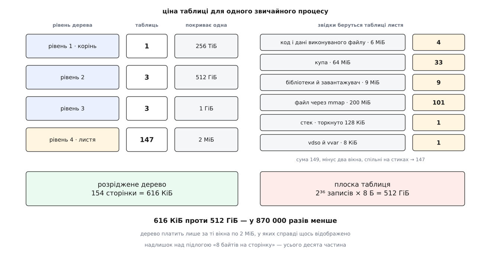
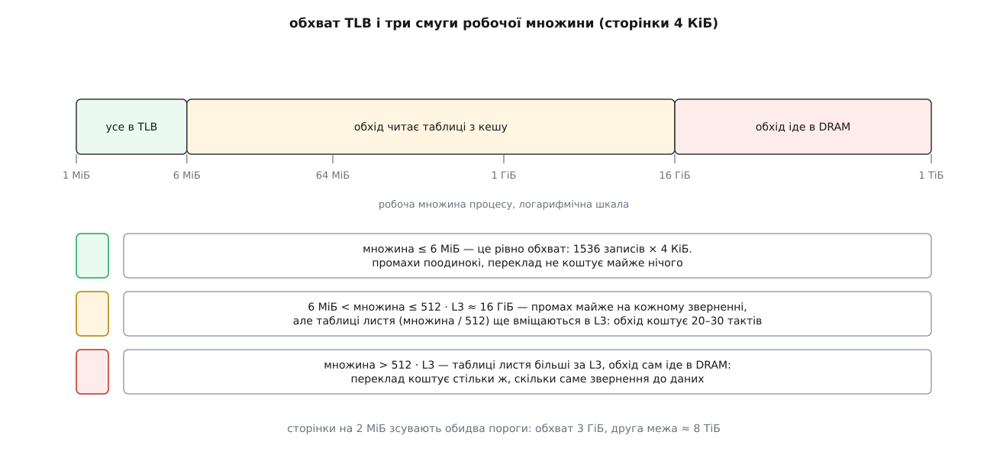

# 🧮 Ціна перекладу в цифрах: скільки важить таблиця й скільки коштує одне звернення

Порахуємо три величини, які зазвичай називають на око: скільки байтів займає таблиця сторінок звичайного процесу, у скільки звернень до пам'яті обходиться один переклад і з якого розміру робочої множини промахи повз кеш перекладу стають головною статтею витрат. Усі три відповіді ростуть з одного числа, і побачити цей корінь важливіше, ніж запам'ятати цифри.

## Число 512 і три його наслідки

Таблиця займає рівно одну сторінку — 4096 байтів. Запис у ній має 8 байтів: сорок із гаком бітів під номер кадру плюс прапорці. Ділення дає єдине число, з якого далі виводиться все:

```
записів у таблиці = 4096 / 8 = 512 = 2⁹
```

Звідси випливають три різні речі, які легко сплутати між собою.

**Перше: дев'ять бітів індексу на рівень.** Щоб вибрати один запис із 512, потрібно й досить дев'яти бітів. Номер сторінки в 48-бітному просторі має 48 − 12 = 36 бітів, отже рівнів потрібно ⌈36 / 9⌉ = 4. Ніхто не «обирав чотири»; глибина — це наслідок розміру сторінки:

```
глибина = ⌈(A − 12) / 9⌉        A — скільки бітів адреси справді працюють
A = 48 → 4 рівні
A = 57 → 5 рівнів
```

**Друге: покриття множиться на 512 з кожним рівнем угору.** Один запис останнього рівня описує сторінку; ціла таблиця останнього рівня — 512 сторінок; один запис передостаннього рівня вказує на таку таблицю, тобто описує ті самі 512 сторінок. Драбина виходить така:

```
рівень 4 (листя):  512 · 4 КіБ   = 2 МіБ
рівень 3:          512 · 2 МіБ   = 1 ГіБ
рівень 2:          512 · 1 ГіБ   = 512 ГіБ
рівень 1 (корінь): 512 · 512 ГіБ = 256 ТіБ
```

Останній рядок — це весь 48-бітний простір, і те, що драбина закінчується точно на ньому, — та сама перевірка глибини, тільки з іншого боку.

**Третє: щільність опису — 8 байтів на кожні 4096 байтів пам'яті, тобто 1/512.**

```
1/512 = 0.1953 %
```

Це підлога ціни. Хоч як розкладай таблиці по рівнях, поки запис має 8 байтів, а сторінка 4 КіБ, опис відображеної пам'яті коштуватиме не менше двох тисячних від неї самої. Далі побачимо, що реальне дерево тримається в межах десяти відсотків над цією підлогою, — тобто сама конструкція майже оптимальна. Уся біда плоскої таблиці не в щільності, а в тому, до чого щільність прикладена.

## Плоска таблиця: біда не в розмірі, а в тому, чому він пропорційний

Загальний вираз для простору з A робочих бітів адреси, сторінкою S байтів і записом E байтів:

```
плоска таблиця = 2ᴬ / S · E

A = 48, S = 2¹² Б, E = 2³ Б:
   2⁴⁸ / 2¹² · 2³ = 2³⁶ · 2³ = 2³⁹ Б = 512 ГіБ
```

Тепер порівняйте 512 ГіБ із 256 ТіБ, які ця таблиця описує: відношення рівно 1/512, ті самі 0.195 %. Плоска таблиця не марнотратна — вона платить точнісінько підлогу, ані байта понад. Погано інше: підлогу вона платить за **весь простір**, а процес користується з нього мізерною часткою.

Візьмімо звичайний процес: виконуваний файл на 6 МіБ, купа на 64 МіБ, п'ять спільних бібліотек із динамічним завантажувачем на 9 МіБ, файл на 200 МіБ, відображений через `mmap`, торкнутий шматок стека на 128 КіБ і дві сторінки `vdso`. Разом 279 МіБ відображеного.

```
плоска таблиця / відображена пам'ять = 512 ГіБ / 279 МіБ ≈ 1878
```

Таблиця в 1878 разів більша за пам'ять, про яку вона хоч щось каже. І далі буде гірше: кожні дев'ять бітів, додані до адреси, множать плоску таблицю на 512. Перехід на п'ятирівневий переклад із 57-бітною адресою дає

```
A = 57: 2⁵⁷ / 2¹² · 2³ = 2⁴⁸ Б = 256 ТіБ
```

— плоска таблиця розросталася б до розміру, який донедавна був усім адресним простором. Дерево на тому самому переході дорожчає рівно на один вузол, тобто на 4 КіБ. Ось у цій парі чисел — 512 ГіБ → 256 ТіБ проти +4 КіБ — і полягає вся суть переходу до розрідженого дерева.

## Перепис вузлів розрідженого дерева

Тепер порахуємо дерево чесно, вузол за вузлом. Правило одне: таблиця рівня існує тоді й лише тоді, коли в діапазоні, який вона покриває, відображено хоч одну сторінку. Кількість таблиць, які перетинає ділянка, — це не просто «довжина поділити на покриття», бо ділянка майже ніколи не починається на межі покриття:

```
таблиць = ⌊(початок + довжина − 1) / покриття⌋ − ⌊початок / покриття⌋ + 1
```

Це округлення вгору плюс граничний доважок: ділянка на 6 МіБ, зсунута всередині свого 2-МіБ вікна, перетинає чотири вікна, а не три. Ось те саме кодом:

```c
#include <stdint.h>
#include <stddef.h>
#include <stdio.h>

#define ENTRIES 512ULL          /* 4096 байтів таблиці / 8 байтів запису */

/* Скільки таблиць того рівня, один запис якого покриває entry_span байтів,
   перетинає ділянка [start, start + len). */
static uint64_t tables_for(uint64_t start, uint64_t len, uint64_t entry_span)
{
        uint64_t table_span = entry_span * ENTRIES;

        return (start + len - 1) / table_span - start / table_span + 1;
}

int main(void)
{
        static const struct { uint64_t start, len; } vma[] = {
                { 0x555555554000ULL,   6ULL << 20 },   /* код і дані     */
                { 0x555555b54000ULL,  64ULL << 20 },   /* купа           */
                { 0x7f3c9a123000ULL, 200ULL << 20 },   /* файл через mmap */
                { 0x7ffffffdf000ULL, 128ULL << 10 },   /* торкнутий стек */
        };
        uint64_t leaves = 0;

        for (size_t i = 0; i < sizeof vma / sizeof *vma; i++)
                leaves += tables_for(vma[i].start, vma[i].len, 4096);

        printf("таблиць листя: %llu (%llu КіБ)\n",
               (unsigned long long)leaves,
               (unsigned long long)(leaves * 4096 / 1024));
        return 0;
}
```

Ці чотири ділянки дають 4 + 33 + 101 + 1 = 139 таблиць листя. Додайте бібліотеки й `vdso` — і повний перепис виглядає так:

| ділянка | розмір | таблиць листя |
|---|---|---|
| код і дані виконуваного файлу | 6 МіБ | 4 |
| купа | 64 МіБ | 33 |
| бібліотеки й динамічний завантажувач | 9 МіБ | 9 |
| файл через `mmap` | 200 МіБ | 101 |
| стек, торкнута частина | 128 КіБ | 1 |
| `vdso` і `vvar` | 8 КіБ | 1 |

Сума по рядках — 149, але два 2-МіБ вікна тут спільні для сусідніх ділянок (кінець завантажувача сидить у тому самому вікні, що й початок відображеного файлу, і те саме з `vdso`), тож насправді таблиць листя 147. Граничний доважок працює в обидва боки.

Верхні рівні рахуються тим самим правилом, тільки з іншим покриттям. Усі ділянки збираються у три вікна по 1 ГіБ (виконуваний файл із купою, зона `mmap`, стек) — це три таблиці третього рівня. Вони ж лягають у три вікна по 512 ГіБ — три таблиці другого рівня. Плюс один корінь.

```
рівень 1: 1
рівень 2: 3
рівень 3: 3
рівень 4: 147
──────────────
разом    154 сторінки = 616 КіБ
```



*Три верхні рівні коштують сім сторінок на весь процес; майже все важить листя, і його кількість пропорційна не простору, а кількості зайнятих вікон по 2 МіБ.*

Два відношення варто побачити поруч:

```
616 КіБ проти 512 ГіБ                    → у 871 544 рази менше
616 КіБ / 279 МіБ = 0.2155 %             → надлишок над пам'яттю
підлога 1/512     = 0.1953 %
0.2155 / 0.1953   = 1.10                 → лише на 10 % вище за підлогу
```

Друге відношення важливіше за перше. Дерево бере за кожну **зайняту** сторінку ті самі 8 байтів, що взяла б плоска таблиця, а всю решту простору отримує задарма; ті десять відсотків надлишку — це сім верхніх вузлів і граничні доважки на краях ділянок. Виграш у 871 544 рази здобуто не хитрішим кодуванням, а тим, що з дерева викинули опис неіснуючого.

Цю арифметику легко перевірити на живій машині. Ядро рахує всі сторінки, витрачені на таблиці, і показує суму:

```sh
$ grep PageTables /proc/meminfo
PageTables:       308864 kB
```

Триста мегабайтів на машині — це приблизно 500 процесів по 616 КіБ, і сходиться воно якраз тому, що більшість процесів у системі відображає кількасот мебібайтів.

Ще один наслідок, який видно тільки в цих одиницях: `fork` не ділить таблицю, а копіює її. Породження описаного процесу означає виділити 154 сторінки й переписати в них 616 КіБ записів — ще до того, як [копіювання при записі](topic:sf-os/copy-on-write) почне розмножувати самі дані. Для процесу, який відобразив 40 ГіБ файлів, той самий перепис дає вже понад 80 МіБ таблиць, і `fork` на ньому відчутно кусається.

## Де дерево дорожчає: розсіювання

Підлога 1/512 досягається лише тоді, коли вікно на 2 МіБ заповнене повністю. Загальний вираз для надлишку зручно записати через кількість корисних сторінок у вікні:

```
надлишок = 4 КіБ · (створених вузлів) / (корисних сторінок · 4 КіБ)
```

Підставмо чотири випадки:

```
512 сторінок у вікні (усе вікно):  4 КіБ / 2 МіБ    = 0.195 %   ← підлога
100 сторінок у вікні:              4 КіБ / 400 КіБ  = 1 %
1 сторінка на кожні 2 МіБ:         4 КіБ / 4 КіБ    = 100 %
1 сторінка на кожен 1 ГіБ:         8 КіБ / 4 КіБ    = 200 %
1 сторінка на кожні 512 ГіБ:      12 КіБ / 4 КіБ    = 300 %
```

Читається це так: щоб таблиця коштувала менше відсотка, у 2-МіБ вікні має бути хоча б сотня зайнятих сторінок, тобто п'ята частина вікна. А процес, який розкидав по одній сторінці через кожен гігабайт простору, витрачає на опис своєї пам'яті вдвічі більше, ніж займає сама пам'ять — по дві нові таблиці на кожну корисну сторінку. Це не гіпотетичний випадок: так поводиться алокатор, що бере в ядра дрібні ділянки за випадковими адресами, і так поводиться програма, яка навмисно розсіює відображення заради [рандомізації простору](topic:sys-unix/address-space-randomization).

## Скільки звернень коштує один переклад

Друга величина — час, а не місце. Промах повз кеш перекладу означає, що MMU мусить сама пройти дерево, а кожен крок дерева — це звичайне читання з пам'яті:

```
чотири рівні + саме звернення до даних = 5 звернень
п'ять рівнів (LA57)                    = 6 звернень
```

Якби кожне з них ішло аж у мікросхему пам'яті, вийшло б приблизно так:

```
4 · 250 тактів (обхід) + 250 тактів (дані) = 1250 тактів
проти 250 тактів без перекладу             → у 5 разів дорожче
```

Але виміряна ціна промаху зовсім інша. Відкриті заміри затримок дають близько 17 тактів на Intel Skylake і близько 24 на AMD Zen 3 — числа саме виміряні, а не взяті з документації виробників, тому читати їх варто як порядок величини. Порядок цей, однак, незаперечний, і з нього виводиться висновок:

```
навіть чотири влучання в кеш другого рівня: 4 · 14 = 56 тактів
виміряно                                  : 17…24 такти
```

Отже обхід **не робить чотирьох звернень**. Проміжні рівні дерева кешуються окремо від TLB — Intel зве ці структури кешами структур сторінкування, AMD — кешами обходу. Вони тримають не пари «сторінка → кадр», а частково пройдені шляхи, і виграш тут дає та сама драбина покриття:

```
один запис рівня 1 покриває 512 ГіБ  → у нашого процесу їх 3
один запис рівня 2 покриває 1 ГіБ    → у нашого процесу їх 3
один запис рівня 3 покриває 2 МіБ    → їх стільки, скільки вікон
```

Верхні два рівні всього процесу — це шість записів. Вони назавжди осідають у кеші обходу на кілька десятків записів і більше ніколи не читаються з пам'яті. Обхід починається щонайраніше з третього рівня, а найчастіше — просто з листка:

```
очікувана довжина обходу ≈ 1…2 звернення, і ті переважно в кеш даних
```

Саме тому промах повз TLB коштує двадцять тактів, а не тисячу. Коли ж і кеш обходу не допомагає — а це буває, коли робоча множина розтягнута на десятки гігабайтів і записів третього рівня стає забагато, — ціна повертається до сотень тактів.

Окремий випадок — робота під гіпервізором, де кожна адреса з гостьової таблиці сама потребує перекладу через таблиці хазяїна, і одне читання перетворюється на 24: [арифметика вкладеного перекладу](topic:hw-arch/hardware-virtualization/math-nested-paging.md) розібрана окремо.

## Середня ціна через частку влучань

Тепер зведімо все в одну формулу. Хай `h` — частка звернень, які знаходять готовий переклад у [TLB](topic:hw-arch/tlb), `t_обходу` — середня ціна промаху в тактах. Тоді на одне звернення до пам'яті припадає:

```
t̄ = t_влучання + (1 − h) · t_обходу
```

Пошук у TLB іде паралельно з вибіркою рядка кеша першого рівня, тому `t_влучання` не додає нічого до критичного шляху й у розрахунку його можна взяти нулем. Лишається чистий надлишок перекладу:

```
надлишок = (1 − h) · t_обходу
```

При `t_обходу` = 25 тактів:

```
h = 99.9 %  →  0.03 такту на звернення
h = 99   %  →  0.25
h = 95   %  →  1.25
h = 90   %  →  2.5
h = 50   %  →  12.5
h = 10   %  →  22.5
```

Числа виглядають невинно, поки не порівняти їх із ціною самого звернення. Влучання в кеш першого рівня коштує близько чотирьох тактів. Щоб переклад додавав до нього не більш як п'ять відсотків, потрібно:

```
(1 − h) · 25 ≤ 0.05 · 4       →      1 − h ≤ 0.008      →      h ≥ 99.2 %
```

Ось де ховається справжня вимога. Дев'яносто дев'ять відсотків влучань — це не «майже ідеально», це вже 6 % надлишку на кожному зверненні до кеша першого рівня. Пороги пом'якшуються тільки тоді, коли самі дані лежать далеко: якщо звернення й так іде в кеш третього рівня за 40 тактів, тих самих п'яти відсотків вистачає вже при h ≥ 92 %.

Зручніше міряти не частку, а промахи на тисячу команд — саме це показують лічильники процесора:

```
такти обходу на 1000 команд = MPKI · t_обходу

MPKI =  1  →   25 тактів
MPKI =  5  →  125
MPKI = 10  →  250
MPKI = 30  →  750
```

Порівнюйте з базою: добре оптимізований код виконує тисячу команд приблизно за 500 тактів. Отже MPKI = 1 з'їдає п'ять відсотків часу, MPKI = 10 — половину бази понад неї, а MPKI = 30 перетворює переклад адрес на найдорожчу операцію в програмі.

> 🔧 **Навіщо це.** Формула `(1 − h) · t_обходу` пояснює, чому профіль такої програми виглядає обманливо. Обхід дерева робить апаратура, тому в профілі немає ані рядка коду, ані виклику ядра — час просто розмазується по всіх зверненнях до пам'яті, і здається, що «повільна сама програма». Побачити правду можна лише лічильниками промахів: якщо `dTLB-load-misses` дає MPKI за десяток, шукати треба не гарячу функцію, а розкладку даних.

## Обхват TLB

Третя величина — межа, за якою частка влучань починає падати. Вона рахується одним множенням:

```
обхват = записів у TLB · розмір сторінки
```

Для Intel Skylake, де кеш перекладу першого рівня має 64 записи під сторінки 4 КіБ, 32 під 2 МіБ і 4 під 1 ГіБ, а другий рівень — 1536 записів, спільних для 4 КіБ і 2 МіБ, плюс окремі 16 під 1 ГіБ:

| сторінка | рівень 1 | обхват | рівень 2 | обхват |
|---|---|---|---|---|
| 4 КіБ | 64 | 256 КіБ | 1536 | 6 МіБ |
| 2 МіБ | 32 | 64 МіБ | 1536 | 3 ГіБ |
| 1 ГіБ | 4 | 4 ГіБ | 16 | 16 ГіБ |

На AMD Zen 3 картина того самого штибу: 64 записи в першому рівні й 2048 у другому, тобто 8 МіБ обхвату на сторінках 4 КіБ і 4 ГіБ на сторінках 2 МіБ.

Зіставте перший рядок таблиці з розміром [кеша](topic:hw-arch/cache) останнього рівня — на серверному кристалі це десятки мебібайтів:

```
обхват TLB на сторінках 4 КіБ:  6 МіБ
кеш третього рівня            : 32 МіБ
```

Обхват **менший за кеш даних**, і то в кілька разів. Звідси беруться робочі множини, які цілком уміщаються в кеш — дані знаходяться за 40 тактів, — але не вміщаються в кеш перекладу, тож до кожного такого звернення додається ще й обхід. Кеш даних тут не рятує: він тримає вміст сторінок, а не відповідь на питання, де ті сторінки лежать.

## Дві межі робочої множини

Лишилося оцінити, коли промахи стають головною статтею. Візьмімо найгрубішу модель: [робоча множина](topic:sf-os/working-set) розміром W, звернення по ній рівномірно випадкові, TLB на E записів витісняє найдавніше вжите. Тоді частка влучань — це просто частка множини, яка в TLB уміщається:

```
h ≈ min(1, E · S / W)
```

При E = 1536 і S = 4 КіБ:

```
W =   6 МіБ  →  h = 1.00   →  надлишок  0.0 такту
W =  12 МіБ  →  h = 0.50   →           12.5
W =  64 МіБ  →  h = 0.09   →           22.7
W = 600 МіБ  →  h = 0.01   →           24.8
```

Модель навмисно песимістична: справжні програми мають локальність, тож при 12 МіБ їхнє `h` буде куди ближче до одиниці, ніж 0.5. Але форма кривої правильна — надлишок швидко впирається в стелю `t_обходу` і далі не росте. Отже перша межа — це просто обхват: **із 6 МіБ промахи з'являються, і десь до 60 МіБ надлишок доходить до своєї стелі приблизно у 25 тактів на звернення.**

Друга межа цікавіша, бо там міняється не частота промахів, а їхня ціна. Обхід коштує двадцять тактів, поки таблиці листя знаходяться в кеші. А займають вони, як ми вже порахували, 1/512 від описаної пам'яті:

```
таблиці листя = W / 512

вони перестають уміщатися в кеш, коли  W / 512 > L3,
тобто                                   W > 512 · L3
```

```
L3 =   8 МіБ  →  W ≈   4 ГіБ
L3 =  32 МіБ  →  W ≈  16 ГіБ
L3 = 256 МіБ  →  W ≈ 128 ГіБ
```

Це верхня оцінка, і то щедра: дані б'ються за той самий кеш і витісняють з нього таблиці, тому справжня межа настає раніше. Зате висновок від цього тільки міцніє: щойно робоча множина переростає кількасот разів узятий кеш, кожен промах повз TLB перетворюється на повноцінний похід у пам'ять, і переклад починає коштувати стільки ж, скільки саме звернення до даних. Час на пам'ять подвоюється — не через дані, а через питання, де вони лежать.



*Перша межа — обхват TLB, за нею промахи стають масовими, але дешевими. Друга — момент, коли самі таблиці листя перестають уміщатися в кеш; після неї переклад коштує як звернення до даних.*

Обидві межі рухає одне й те саме: [великі сторінки](topic:sys-unix/huge-pages-tlb-reach). Перехід на 2 МіБ множить обхват на 512 (6 МіБ → 3 ГіБ) і водночас прибирає останній рівень дерева, тож таблиці стають у 512 разів меншими:

```
таблиці на сторінках 2 МіБ = W / (512 · 512) = W / 262144
W = 1 ТіБ → 4 МіБ таблиць — легко вміщаються в кеш
друга межа = 262144 · L3 ≈ 8 ТіБ при L3 = 32 МіБ
```

Тобто для бази даних на терабайт пам'яті сторінки по 2 МіБ переносять обидві межі за обрій задачі, а сторінки по 4 КіБ лишають її глибоко в червоній смузі. Сторінки на 1 ГіБ виглядають ще спокусливіше, але тут арифметика підступна: обхват у 16 ГіБ здобувається шістнадцятьма записями, і робоча множина на сотню гігабайтів витісняє їх так само безжально, як і будь-які інші, — величезне покриття одного запису не рятує, коли самих записів шістнадцять.
