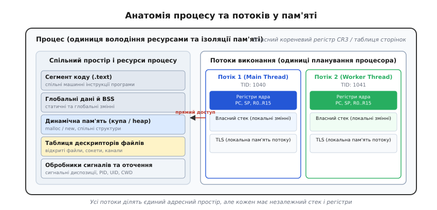
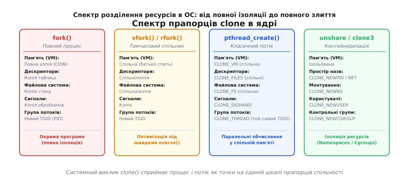
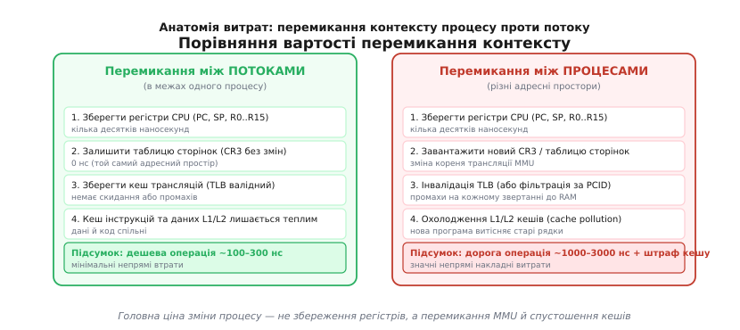
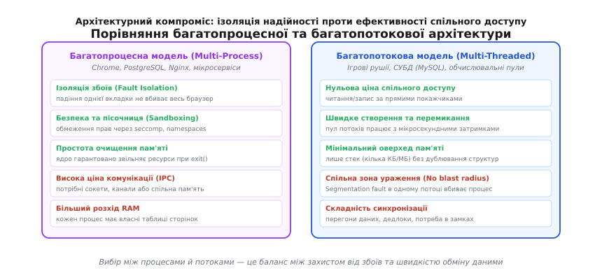

# Процеси й потоки: анатомія розділення пам'яті та обчислень

<preknowlist>
- [Віртуальна пам'ять](root:hw-arch/virtual-memory) — ізоляція адресних просторів, трансляція адрес і таблиці сторінок.
- [Перемикання контексту](root:sf-os/context-switch) — збереження й відновлення регістрового стану процесорного ядра.
- [Стек](root:sf-lang/stack-lifo) — організація локальних змінних і кадрів викликів.
- [Купа й динамічна пам'ять](root:sf-lang/heap-dynamic-memory) — виділення довільних блоків даних у спільній пам'яті.
</preknowlist>

Уявіть розробку сучасного веббраузера, який одночасно завантажує десятки вкладок із довільним кодом JavaScript, декодує потокове відео високої роздільної здатності й обробляє ввід користувача з частотою 60 кадрів на секунду. Якщо запустити кожну вкладку як повністю ізольовану окрему програму зі своїм адресним простором, спроба передати тривимірну сцену з рушія рендерингу у віконний менеджер вимагатиме копіювання сотень мегабайтів пікселів через міжпроцесні канали зв'язку, а таблиці сторінок віртуальної пам'яті для сотні відкритих вкладок поглинуть гігабайти оперативної пам'яті лише на службові структури ядра. Якщо ж запустити всі вкладки всередині єдиної програми зі спільною пам'яттю, єдина помилка розіменування нульового покажчика чи переповнення буфера на сторонньому рекламному банері однієї вкладки миттєво знищить роботу всіх інших відкритих вікон разом із браузером.

Ця дилема оголює фундаментальну інженерну суперечність: комп'ютерній системі одночасно потрібні **ізоляція та захист ресурсів** від помилок і зловмисників, але водночас необхідні **максимальна швидкість та мінімальні витрати** при паралельному виконанні пов'язаних задач.

Операційні системи вирішують цю суперечність через поділ виконання на дві ортогональні абстракції: **процес** (як одиницю володіння ресурсами та ізоляції) і **потік** (як одиницю планування процесорного часу).

---

### Деконструкція моноліту: Процес як фортеця, Потік як робітник

У ранніх операційних системах програма, що виконувалася, була неподільним монолітом. Коли ядро запускало програму, воно виділяло їй ділянку пам'яті, створювало таблицю відкритих файлів і призначало один лічильник команд. Проте з розвитком багатоядерних процесорів та складних систем стало очевидно, що комп'ютер виконує дві принципово різні речі:
1. **Володіє ресурсами** (пам'яттю, відкритими файлами, мережевими з'єднаннями, правами користувача).
2. **Змінює стан регістрів процесора** (виконує послідовність машинних інструкцій крок за кроком).

Це розмежування породило чітку термінологічну та архітектурну межу:

- **Процес** (лат. *processus* — «просування, протікання, рух уперед») — це пасивний суб'єкт власності та ізоляції. Процес можна уявити як ізольовану фортецю або контейнер ресурсів. Він володіє власним [віртуальним адресним простором](root:hw-arch/virtual-memory), таблицею дескрипторів відкритих файлів, мережевих сокетів і каналів, обліковими правами користувача (`UID`/`GID`), диспозиціями обробників сигналів і поточною робочою текою. Сам по собі процес нічого не обчислює: він лише тримає ресурси, у межах яких відбувається обчислення.
- **Потік** (англ. *thread* — «нитка [виконання]») — це активна одиниця виконання інструкцій на процесорі. Потік — це робітник усередині фортеці-процесу. Він володіє власним лічильником команд (`PC`, *Program Counter*), вказівником верхівки стека (`SP`, *Stack Pointer*), набором робочих регістрів процесора, індивідуальним стеком для локальних змінних та пріоритетом у [планувальнику операційної системи](root:sf-os/scheduler).

Один процес завжди містить щонайменше один потік (його називають головним потоком, *main thread*), але може містити десятки або сотні потоків.


*Анатомія пам'яті процесу та його потоків. Усі потоки одного процесу ділять спільний віртуальний адресний простір (сегмент коду, купу, глобальні змінні) та дескриптори файлів, але кожен потік володіє індивідуальним регістровим контекстом CPU та власним ізольованим стеком викликів.*

Кожен потік усередині процесу бачить абсолютно ту саму пам'ять: якщо перший потік виділяє блок пам'яті на купі через `malloc` і записує туди число, другий потік може миттєво прочитати це число за прямим покажчиком без будь-яких системних викликів або допомоги операційної системи.

> 📜 Про те, як операційні системи пройшли шлях від важкого моноліту Multics і Unix V6 до мікроядер Mach та сучасної бібліотеки NPTL, докладно розповідає [історичний нарис розвитку потоків](root:sf-os/process-vs-thread/hist-process-to-thread.md).

---

### Анатомія спільного й приватного: що дійсно розділено, а що є ілюзією

Щоб писати надійні багатопотокові та багатопроцесні програми, необхідно точно розуміти кордон між спільними ресурсами процесу та індивідуальним станом кожного потоку.

#### Спільні ресурси процесу
Усі потоки, запущені в межах одного процесу, беззастережно ділять між собою:

1. **Віртуальний адресний простір**:
   - **Сегмент коду (`.text`)**: машинний код усіх функцій програми. Усі потоки виконують той самий код (хоча можуть перебувати в зовсім різних функціях одночасно).
   - **Глобальні та статичні дані (`.data`, `.bss`)**: змінні, оголошені поза функціями, існують в єдиному екземплярі на весь процес.
   - **Купа ([Heap](root:sf-lang/heap-dynamic-memory))**: уся пам'ять, виділена динамічно через `malloc`, `calloc`, `new` або `mmap`. Будь-який покажчик на купу, переданий між потоками, залишається повністю валідним.
2. **Таблиця файлових дескрипторів**: якщо потік A відкриває файл або мережевий сокет і отримує числовий дескриптор `fd = 5`, потік B може негайно читати з цього `fd = 5`.
3. **Позиція зміщення у файлі (*file offset*)**: це класична підводна пастка. Дескриптор файлу вказує на системну структуру відкритого файлу в ядрі (*open file description*), яка зберігає поточну позицію читання/запису. Якщо потік A читає 100 байтів із файлу, позиція зміщується на 100 байтів уперед; наступний виклик `read()` у потоці B почне читання зі 101-го байта, а не з початку файлу. Щоб уникнути взаємного збивання позицій, у багатопотоковому коді застосовують виклики позиційного вводу-виводу `pread()` та `pwrite()`, які приймають зміщення явним аргументом і не чіпають спільний покажчик файлу.
4. **Ідентифікатори та права процесу**: числовий `PID` (ідентифікатор процесу), права користувача (`UID`/`EUID`), права групи (`GID`), поточний робочий каталог (`CWD`) та диспозиції сигналів (які сигнали ігнорувати, а на які призначено функції-обробники).

#### Приватний стан потоку
Кожен потік володіє власним мінімальним набором даних, необхідним для незалежного виконання:

1. **Регістровий контекст процесора**:
   - **Лічильник команд (`PC` / `RIP`)**: фіксує, яку саме інструкцію потік виконує цієї миті.
   - **Вказівник стека (`SP` / `RSP`)**: вказує на верхівку індивідуального стека потоку.
   - **Регістри загального призначення**: проміжні обчислювальні значення, локальні для поточного коду.
2. **Стек викликів ([Stack](root:sf-lang/stack-lifo))**: кожен потік отримує власну ділянку пам'яті під стек (типово від 2 до 8 МБ на десктопних ОС). На стеку розміщуються аргументи викликів, локальні змінні функцій та адреси повернення.
3. **Локальна пам'ять потоку (TLS, *Thread-Local Storage*)**: спеціальні змінні, помічені специфікатором `__thread` у C або `thread_local` у C++. Для кожного потоку створюється власна незалежна копія такої змінної, а апаратний доступ забезпечується через спеціальні сегментні регістри процесора (`FS`/`GS` на x86-64 або `TPIDR_EL0` на ARM64). Динамічний лінкер (`ld.so`) налаштовує сегмент TLS при старті кожного нового потоку.
4. **Маска заблокованих сигналів**: кожен потік може індивідуально заблокувати або дозволити надходження певних сигналів через `pthread_sigmask()`.
5. **Змінна стану помилок (`errno`)**: у сучасних багатопотокових бібліотеках `errno` — це не глобальна змінна, а макрос, що розгортається у виклик функції (наприклад, `*__errno_location()`), яка повертає адресу комірки в індивідуальному сегменті TLS поточного потоку. Завдяки цьому помилка в одному потоці не перезаписує код помилки іншого.

```
       ПРОЦЕС (Адресний простір, CR3, Таблиця файлів, PID)
 ┌─────────────────────────────────────────────────────────────┐
 │  Код (.text)      Глобальні дані (.data)     Купа (Heap)   │
 │                                                             │
 │  ┌────────────────────────┐     ┌────────────────────────┐  │
 │  │   ПОТІК 1 (TID 101)    │     │   ПОТІК 2 (TID 102)    │  │
 │  │ ┌────────────────────┐ │     │ ┌────────────────────┐ │  │
 │  │ │ Регістри: PC, SP   │ │     │ │ Регістри: PC, SP   │ │  │
 │  │ ├────────────────────┤ │     │ ├────────────────────┤ │  │
 │  │ │ Стек потоку 1      │ │     │ │ Стек потоку 2      │ │  │
 │  │ ├────────────────────┤ │     │ ├────────────────────┤ │  │
 │  │ │ TLS (thread_local) │ │     │ │ TLS (thread_local) │ │  │
 │  │ └────────────────────┘ │     │ └────────────────────┘ │  │
 │  └────────────────────────┘     └────────────────────────┘  │
 └─────────────────────────────────────────────────────────────┘
```

#### Механіка маршрутизації сигналів у багатопотоковому процесі

Сигнали в POSIX-системах виявляють тонкий поділ між процесом та його потоками. Сигнали поділяються на два принципово різні класи:

1. **Синхронні сигнали (спрямовані на потік)**: виникають як прямий наслідок виконання процесорної інструкції конкретним потоком (апаратний збій розіменування недійсної пам'яті `SIGSEGV`, ділення на нуль `SIGFPE`, виконання недійсної інструкції `SIGILL`). Ядро операційної системи завжди доставляє такий сигнал **виключно тому конкретному потоку**, який виконав помилкову інструкцію. Якщо потік не перехопив сигнал, стандартна дія `SIGSEGV` вбиває весь процес.
2. **Асинхронні сигнали (спрямовані на процес)**: надходять ззовні від інших процесів через виклик `kill(pid, SIGTERM)` або від термінала (`SIGINT` при натисканні Ctrl+C). Ядро Linux поміщає такий сигнал у чергу спільно очікуючих сигналів процесу (`task->signal->shared_pending`) та доставляє його **будь-якому одному довільному потоку**, у якого цей сигнал наразі не заблокований у масці `pthread_sigmask`.

Якщо потрібно надіслати асинхронний сигнал конкретному потоку всередині процесу, використовують системний виклик `pthread_kill(tid, sig)` або виклик ядра `tgkill(tgid, tid, sig)`.

> 🔧 **Навіщо це: ілюзія захисту стека.** Важливо пам'ятати: хоча логічно стек вважається приватним для потоку, **апаратно він ніяк не ізольований**. Оскільки всі стеки розташовані в єдиному віртуальному адресному просторі процесу, потік A може передати покажчик на свою локальну змінну потоку B. Потік B може прочитати або навіть пошкодити дані на стеку потоку A. У разі виходу з функції стек знищується, і такий покажчик перетворюється на висячий (*dangling pointer*), спричиняючи підступне псування пам'яті. Щоб запобігти випадковому розростанню стека в сусідні ділянки пам'яті, бібліотека виділяє знизу кожного стека захисну сторінку (*guard page*) з правами `PROT_NONE`, звернення до якої негайно спричиняє `SIGSEGV`. Повна ізоляція пам'яті існує лише між різними процесами.

---

### Погляд ядра: відсутність «потоків» і спектр прапорців `clone()`

Як саме операційна система розрізняє процеси й потоки під капотом? Відповідь у випадку ядра Linux дивує багатьох системних програмістів: **ядро взагалі не містить окремої структури для потоку**.

Для планувальника Linux існує лише один уніфікований тип сутності — **задача**, представлена структурою `struct task_struct`. Кожна задача має свій числовий ідентифікатор `PID` (з погляду ядра це `TID`, *Thread ID*), власний стан регістрів і пріоритет планування.

Різниця між тим, що простір користувача називає «процесом», і тим, що він називає «потоком», визначається виключно **ступенем розділення внутрішніх структур ядра**.

Коли програма викликає системний виклик `clone()`, вона передає бітову маску прапорців, яка наказує ядру: створити нову копію ресурсу чи передати покажчик на наявну структуру батька, збільшивши лічильник посилань.

```
Повна ізоляція                                            Повне злиття
(Процес)                                                      (Потік)
─────────────────────────────────────────────────────────────────────►
fork()              vfork()            clone(...)     pthread_create()
(Нова пам'ять,      (Спільна пам'ять,  (Вибіркова     (CLONE_VM,
 нова таблиця       батько спить до    комбінація     CLONE_FILES,
 файлів)            execve)            прапорців)     CLONE_THREAD)
```


*Спектр системного виклику clone(). Прапорці дозволяють конструювати будь-який ступінь зв'язності: від повної копії (fork) через часткове розділення до повного злиття всіх ресурсів (pthread_create).*

Розглянемо ключові прапорці виклику `clone()`, які формують цю поведінку:

1. **`CLONE_VM`**: якщо прапорець виставлено, нова задача отримує той самий покажчик `task->mm` на дескриптор віртуальної пам'яті, що й батько. Якщо прапорець скинуто — ядро дублює таблиці сторінок через [Copy-on-Write](root:sf-algorithms/copy-on-write-structures) (поведінка процесу).
2. **`CLONE_FILES`**: якщо виставлено, обидві задачі ділять спільну структуру `task->files` (таблицю дескрипторів). Якщо скинуто — копіюються номери дескрипторів, але таблиці стають незалежними.
3. **`CLONE_FS`**: визначає, чи є спільною інформація про кореневий каталог (`chroot`), робочий каталог (`chdir`) та маску створення файлів (`umask`).
4. **`CLONE_SIGHAND`**: спільна таблиця обробників сигналів `task->sighand`.
5. **`CLONE_THREAD`**: найважливіший прапорець, що об'єднує задачі в одну **групу потоків** (*Thread Group*).

Коли встановлено `CLONE_THREAD`, нова задача отримує той самий ідентифікатор групи потоків `TGID` (*Thread Group ID*), що й лідер групи. Коли звичайна прикладна програма викликає функцію `getpid()`, бібліотека C повертає саме `TGID`, а не внутрішній числовий `PID` задачі ядра. Тому всі потоки всередині одного процесу бачать однаковий `PID`, хоча кожен із них має унікальний системний `TID` (який можна дізнатися через системний виклик `gettid()`).

> 📋 Повний перелік системних викликів, сигнатур POSIX API, масок прапорців `clone()` та кодів помилок зібрано в [довіднику інтерфейсів процесів і потоків](root:sf-os/process-vs-thread/api-posix-threads-processes.md).

---

### Фізична ціна виконання: перемикання контексту, кеші та пам'ять

Чому виконання в потоках традиційно вважається «легшим» і швидшим за виконання в окремих процесах? Відповідь криється у фізичній будові центрального процесора та апаратного блоку керування пам'яттю ([MMU](root:hw-arch/virtual-memory)).

#### 1. Ціна перемикання контексту
Коли процесорне ядро перемикається між двома задачами, обсяг необхідної роботи кардинально відрізняється залежно від того, чи ділять ці задачі спільний адресний простір:

- **Перемикання між потоками одного процесу**: ядро зберігає десяток регістрів поточного потоку на його стек, змінює значення покажчика стека `SP` у структурі задачі, завантажує збережені регістри наступного потоку й переходить за його лічильником команд `PC`. Ця операція коштує лічені десятки або сотні тактів процесора (**~100–300 наносекунд**). Головне: адресний простір залишається незмінним, кореневий регістр таблиць сторінок процесора (`CR3` на x86 чи `TTBR0` на ARM) **не перезаписується**. Буфер швидкої трансляції адрес ([TLB](root:hw-arch/tlb)) залишається повністю чинним, а кеші інструкцій та даних L1/L2 не втрачають актуальності.
- **Перемикання між різними процесами**: ядро зобов'язане не лише зберегти регістри, а й повністю перемкнути адресний простір, записавши нову фізичну адресу кореневої таблиці сторінок у керівний регістр `CR3`. Це спричиняє так звані **непрямі накладні витрати**:
  1. **Інвалідація TLB**: усі кешовані трансляції віртуальних адрес у фізичні стають недійсними (якщо процесор не підтримує теги просторів PCID/ASID). Кожне наступне звернення до пам'яті нового процесу змушене проходити повний чотирирівневий пошук у повільній RAM (*page table walk*).
  2. **Охолодження кешів процесора (*Cache Pollution*)**: дані попереднього процесу поступово витісняються з кешів L1/L2/L3 новим кодом і даними. Коли планувальник повернеться до першого процесу, той відчує масову серію промахів кешу (*cache misses*).

Сумарна вартість зміни процесу становить від **1000 до 3000 наносекунд**, а з урахуванням відновлення робочого набору в кешах штраф може сягати сотень мікросекунд.


*Анатомія вартості перемикання контексту. Перемикання потоків оновлює лише регістри ядра, зберігаючи таблиці сторінок і гарячий TLB. Перемикання процесів змінює CR3, інвалідує TLB та охолоджує кеші процесора.*

#### 2. Витрати оперативної пам'яті на створення
Створення нового процесу через `fork()` вимагає виділення структур ядра `task_struct`, структур областей пам'яті `vm_area_struct`, дублювання таблиць сторінок рівнів PML4/PDPT/PD/PT та створення копії дескрипторів файлів. Навіть порожній процес забирає від 40 до 80 кілобайтів службової пам'яті ядра ще до того, як виділить перший байт користувацьких даних.

Створення потоку вимагає лише невеликої структури керування в ядрі та виділення віртуального адресного простору під стек. Оскільки стек виділяється віртуально через `mmap()`, фізичні сторінки оперативної пам'яті будуть виділені операційною системою поступово (за викликом, *on demand*), лише в міру реального заглиблення стека функціями потоку.

> ⚙️ Практичні виміри різниці в наносекундах, споживанні пам'яті RSS та затримках обміну даними наведено в [практичному проєкті бенчмаркінгу процесів і потоків](root:sf-os/process-vs-thread/proj-process-vs-thread-benchmark.md).

---

### Синхронізація, комунікація та класичні пастки

Зручність спільної пам'яті в потоках породжує найскладніший клас програмних помилок у комп'ютерній інженерії, тоді як ізоляція процесів робить обмін даними безпечним, але дорожчим.

#### Міжпроцесна взаємодія (IPC) проти спільної пам'яті

Щоб передати дані між двома ізольованими процесами, розробник зобов'язаний скористатися механізмами міжпроцесної взаємодії ([IPC](root:sf-tasks/task-ipc)):
- **Системні канали зв'язку (Pipes, FIFO)**: потік байтів, що передається через буфер ядра.
- **Сокети домену Unix (Unix Domain Sockets)**: надійний двосторонній канал із підтримкою передачі відкритих файлових дескрипторів.
- **Спільна пам'ять (Shared Memory, `shmget` / `mmap(MAP_SHARED)`)**: явне відображення однакових фізичних сторінок пам'яті в адресні простори різних процесів.
- **Черги повідомлень (Message Queues)**: дискретні пакети повідомлень із пріоритетами.

Головна перевага IPC — **чітка межа та безпека**: процеси не можуть випадково зіпсувати пам'ять один одного. Головний недолік — **накладні витрати**: передача вимагає копіювання байтів через ядро (`copy_from_user` → `copy_to_user`), серіалізації/десеріалізації складних структур даних (JSON, Protobuf) та системних викликів.

У потоках комунікація є майже безкоштовною: один потік записує покажчик на об'єкт у пам'ять, інший потік читає його. Проте ця простота вимагає обов'язкової явної синхронізації:
- [Перегони даних (Data Races)](root:sf-tasks/data-races-locks): якщо два потоки одночасно звертаються до однієї комірки пам'яті й хоча б один виконує запис без синхронізації, поведінка програми стає невизначеною (Undefined Behavior).
- [Взаємні блокування (Deadlocks)](root:sf-tasks/deadlock): ситуація, коли потік 1 чекає на замок A, утримуючи замок B, а потік 2 чекає на замок B, утримуючи замок A. Програма зависає назавжди.
- **Псевдорозділення ([False Sharing](root:hw-arch/false-sharing))**: коли два потоки на різних ядрах процесора змінюють абсолютно незалежні змінні, які випадково опинилися в межах однієї 64-байтної кеш-лінії процесора. Апаратний протокол когерентності кешів починає безперервно ганяти кеш-лінію між ядрами, сповільнюючи виконання в десятки разів.

#### Смертельна пастка: `fork()` у багатопотоковій програмі

Один із найнебезпечніших крайових випадків системного програмування — виклик `fork()` у програмі, яка вже має кілька активних потоків.

Згідно зі стандартом POSIX, системний виклик `fork()` дублює в дочірньому процесі **лише той один потік, який викликав `fork()`**. Усі інші потоки батьківського процесу в нащадку просто зникають без жодного попередження та очищення.

Чому це призводить до катастрофи:
1. Уявіть, що потік A у батьківському процесі захопив м'ютекс розподільника пам'яті `malloc` або внутрішній замок бази даних.
2. Тієї самої мікросекунди потік B викликає `fork()`.
3. У дочірньому процесі створюється точна копія пам'яті, де м'ютекс позначено як **захоплений**.
4. Проте самого потоку A в дочірньому процесі **не існує**! Ніхто й ніколи не викличе `pthread_mutex_unlock()`.
5. Перша ж спроба дочірнього процесу виділити пам'ять через `malloc()` або виконати логування спробує захопити цей замок і намертво заблокує дочірній процес у вічному дедлоку.

#### Витік файлових дескрипторів та прапорець `O_CLOEXEC`

Ще однією підступною проблемою паралелізму є стан гонитви між відкриттям файлу та викликом `execve()`. За замовчуванням усі відкриті дескриптори файлів успадковуються дочірньою програмою після `execve()`.

У багатопотоковій програмі можливий такий сценарій:
1. Потік 1 відкриває конфіденційний сокет до бази даних або файл із приватними ключами через `open("keys.pem", O_RDONLY)`.
2. Одночасно Потік 2 створює дочірній процес (`fork()`) і викликає сторонню утиліту (`execve("/bin/ls")`).
3. Якщо дескриптор не мав прапорця закриття при виконанні, стороння утиліта успадкує відкритий дескриптор секретного файлу.

Вирішенням є обов'язкове використання прапорця `O_CLOEXEC` під час відкриття файлів або `SOCK_CLOEXEC` під час створення сокетів, що гарантує атомарне встановлення захисту від успадкування в момент системного виклику.

> 🔧 **Навіщо це: правило виклику `fork`.** Якщо ваша програма є багатопотоковою, єдиною безпечною дією всередині дочірнього процесу після `fork()` є негайний виклик однієї з функцій сімейства `execve()` (яка замінить образ пам'яті та скине всі замки) або виклик виключно асинхронно-безпечних функцій (*async-signal-safe functions*) з подальшим `_exit()`. Будь-які виклики `malloc`, `printf` чи захоплення м'ютексів між `fork` та `exec` у багатопотоковому коді є грубою помилкою.

---

### Архітектурні моделі: коли процеси, коли потоки, коли гібрид

Вибір між багатопроцесною та багатопотоковою архітектурою є класичним інженерним компромісом між **надійністю/ізоляцією** та **продуктивністю/щільністю**.


*Архітектурний компроміс. Багатопроцесна модель обирає надійність, безпеку та ізоляцію ціною IPC. Багатопотокова модель обирає максимальну продуктивність спільної пам'яті ціною відсутності захисту від збоїв.*

#### 1. Коли обирати багатопроцесну модель (Multi-Process)
- **Ізоляція збоїв (Fault Isolation)**: якщо падіння одного воркера не повинно впливати на решту системи.
  - *Приклад*: система керування базами даних **PostgreSQL**. Кожне клієнтське підключення обслуговується окремим процесом операційної системи. Якщо складний SQL-запит спричинить падіння процесу через внутрішню помилку, ядро ОС миттєво звільнить усі його дескриптори й пам'ять, а решта тисяч клієнтів продовжуватимуть роботу без переривань.
- **Пісочниці та безпека (Sandboxing)**: коли необхідно виконати потенційно небезпечний сторонній код з обмеженими правами через механізми `seccomp`, `namespaces` або `chroot`.
  - *Приклад*: браузер **Google Chrome**. Кожна відкрита вебсторінка виконується в окремому ізольованому процесі рендерингу. Навіть у разі успішної експлуатації вразливості нульового дня шкідливий скрипт опиняється замкненим усередині процесу без доступу до файлової системи та пам'яті інших вкладок.
- **Захист від витоків пам'яті**: довгоживучі задачі, які можуть фрагментувати купу. Завершення процесу гарантує 100% повернення всіх ресурсів операційній системі без ризику накопичення витоків.

#### 2. Коли обирати багатопотокову модель (Multi-Threaded)
- **Інтенсивні обчислення над спільними великими масивами даних**: коли копіювання даних через канали IPC знищує пропускну здатність.
  - *Приклад*: фізичні, графічні та аудіорушії комп'ютерних ігор, наукові симуляції, навчання нейромереж. Усі ядра процесора паралельно обробляють єдиний масив вершин або матрицю ваг у спільній пам'яті.
- **Високопродуктивні мережеві кеші та сервери з мікросекундними затримками**: коли витрати на створення процесів та перемикання `CR3` неприпустимі.
  - *Приклад*: сервери баз даних у пам'яті (Memcached) або пули обробки подій у високонавантажених серверах.

#### 3. Гібридні архітектури
Більшість найпотужніших сучасних систем використовують комбінований підхід:
- **Nginx**: запускає фіксовану кількість робочих процесів (по одному на кожне фізичне ядро процесора для уникнення міжпроцесорної міграції), а всередині кожного процесу крутить асинхронний цикл подій ([Event Loop](root:sf-tasks/event-loop)) або невеликий пул потоків для блокуючих дискових операцій.
- **Node.js / Go / Rust**: використовують легкі потоки/корутини поверх невеликого пулу системних потоків ядра (модель M:N на рівні мови), що поєднує низьку вартість перемикання з повною утилізацією всіх ядер комп'ютера.

---

### Робочий приклад: Паралельна обробка даних через процеси та потоки

Щоб наочно закріпити різницю в реалізації, порівняємо одну й ту саму задачу — паралельне обчислення суми елементів великого числового масиву — у двох варіантах: через створення дочірнього процесу з обміном через `pipe` та через створення потоку зі спільною пам'яттю.

:::tabs
```c
#include <stdio.h>
#include <stdlib.h>
#include <unistd.h>
#include <pthread.h>
#include <sys/wait.h>

#define ARRAY_SIZE 1000000

// Структура для передачі завдань потоку
typedef struct {
    const int *data;
    size_t start;
    size_t end;
    long long partial_sum;
} ThreadTask;

static void *thread_worker(void *arg) {
    ThreadTask *task = (ThreadTask *)arg;
    long long sum = 0;
    for (size_t i = task->start; i < task->end; ++i) {
        sum += task->data[i];
    }
    task->partial_sum = sum;
    return NULL;
}

int main(void) {
    // 1. Ініціалізація тестового масиву
    int *array = malloc(ARRAY_SIZE * sizeof(int));
    if (!array) return EXIT_FAILURE;
    for (int i = 0; i < ARRAY_SIZE; ++i) array[i] = 1;

    size_t mid = ARRAY_SIZE / 2;

    printf("--- ВАРІАНТ 1: Обчислення через ПОТОКИ (Shared Memory) ---\n");
    ThreadTask task = { .data = array, .start = mid, .end = ARRAY_SIZE, .partial_sum = 0 };
    pthread_t thread;

    // Створюємо потік: він читає той самий масив за прямим покажчиком
    pthread_create(&thread, NULL, thread_worker, &task);

    // Головний потік обчислює першу половину
    long long main_sum = 0;
    for (size_t i = 0; i < mid; ++i) main_sum += array[i];

    pthread_join(thread, NULL);
    long long total_thread_sum = main_sum + task.partial_sum;
    printf("Результат через потоки: %lld\n\n", total_thread_sum);

    printf("--- ВАРІАНТ 2: Обчислення через ПРОЦЕСИ (Fork + Pipe) ---\n");
    int pipefd[2];
    if (pipe(pipefd) < 0) { free(array); return EXIT_FAILURE; }

    pid_t pid = fork();
    if (pid == 0) {
        // Дочірній процес: обчислює другу половину
        close(pipefd[0]); // Закриваємо кінець для читання
        long long child_sum = 0;
        for (size_t i = mid; i < ARRAY_SIZE; ++i) child_sum += array[i];

        // Передаємо результат батькові через системний канал
        write(pipefd[1], &child_sum, sizeof(child_sum));
        close(pipefd[1]);
        free(array);
        _exit(EXIT_SUCCESS);
    }

    // Батьківський процес
    close(pipefd[1]); // Закриваємо кінець для запису
    long long proc_main_sum = 0;
    for (size_t i = 0; i < mid; ++i) proc_main_sum += array[i];

    long long proc_child_sum = 0;
    read(pipefd[0], &proc_child_sum, sizeof(proc_child_sum));
    close(pipefd[0]);
    waitpid(pid, NULL, 0);

    long long total_proc_sum = proc_main_sum + proc_child_sum;
    printf("Результат через процеси: %lld\n", total_proc_sum);

    free(array);
    return EXIT_SUCCESS;
}
```
```cpp
#include <iostream>
#include <vector>
#include <thread>
#include <numeric>
#include <span>
#include <system_error>
#include <unistd.h>
#include <sys/wait.h>

constexpr size_t ARRAY_SIZE = 1'000'000;

// Обчислення суми частини масиву через std::span
long long calculate_sum(std::span<const int> slice) noexcept {
    return std::accumulate(slice.begin(), slice.end(), 0LL);
}

int main() {
    std::vector<int> data(ARRAY_SIZE, 1);
    const size_t mid = ARRAY_SIZE / 2;

    std::cout << "--- ВАРІАНТ 1: Обчислення через ПОТОКИ (C++ std::jthread) ---\n";
    long long thread_part_sum = 0;
    {
        std::span<const int> second_half(data.data() + mid, ARRAY_SIZE - mid);
        // jthread отримує прямий доступ до пам'яті вектора
        std::jthread worker([second_half, &thread_part_sum]() {
            thread_part_sum = calculate_sum(second_half);
        });

        // Головний потік обчислює свою половину
        std::span<const int> first_half(data.data(), mid);
        long long main_part_sum = calculate_sum(first_half);

        // worker автоматично приєднується (join) при виході з блоку видимості
        std::cout << "Результат через потоки: "
                  << (main_part_sum + thread_part_sum) << "\n\n";
    }

    std::cout << "--- ВАРІАНТ 2: Обчислення через ПРОЦЕСИ (fork + pipe) ---\n";
    int pipefd[2];
    if (::pipe(pipefd) < 0) {
        throw std::system_error(errno, std::generic_category(), "Помилка створення pipe");
    }

    pid_t pid = ::fork();
    if (pid < 0) {
        throw std::system_error(errno, std::generic_category(), "Помилка fork");
    }

    if (pid == 0) {
        // Дочірній процес
        ::close(pipefd[0]);
        std::span<const int> second_half(data.data() + mid, ARRAY_SIZE - mid);
        long long child_sum = calculate_sum(second_half);

        ::write(pipefd[1], &child_sum, sizeof(child_sum));
        ::close(pipefd[1]);
        ::_exit(0);
    }

    // Батьківський процес
    ::close(pipefd[1]);
    std::span<const int> first_half(data.data(), mid);
    long long parent_sum = calculate_sum(first_half);

    long long child_result = 0;
    ::read(pipefd[0], &child_result, sizeof(child_result));
    ::close(pipefd[0]);

    int status = 0;
    ::waitpid(pid, &status, 0);

    std::cout << "Результат через процеси: "
              << (parent_sum + child_result) << '\n';

    return 0;
}
```
:::

---

### Підсумок

Процес і потік — це не конкуруючі сутності, а взаємодоповнюючі рівні абстракції операційної системи:

1. **Процес** — це **одиниця ізоляції та володіння ресурсами**. Він має власний віртуальний адресний простір, таблицю відкритих файлів і права доступу. Збій усередині процесу надійно ізолюється ядром і не руйнує стан сусідніх програм.
2. **Потік** — це **одиниця планування процесорного часу**. Він представляє незалежну траєкторію виконання (регістри, стек, лічильник команд) всередині адресного простору процесу. Усі потоки процесу ділять пам'ять напряму за нульову ціну комунікації, але вимагають ретельної синхронізації замками.
3. На рівні ядра Linux процес і потік уніфіковані структурою `task_struct`, а системний виклик `clone()` дозволяє налаштовувати будь-яку комбінацію спільності ресурсів.
4. Перемикання між потоками коштує сотні наносекунд завдяки збереженню таблиць сторінок та теплого TLB; перемикання між процесами коштує мікросекунди через зміну регістра `CR3` та скидання кешів.

Глибоке розуміння цієї межі дозволяє архітектору проєктувати системи, де важка ізоляція процесів захищає критичні вузли від збоїв та атак, а легкі потоки забезпечують максимальну швидкість паралельних обчислень.
