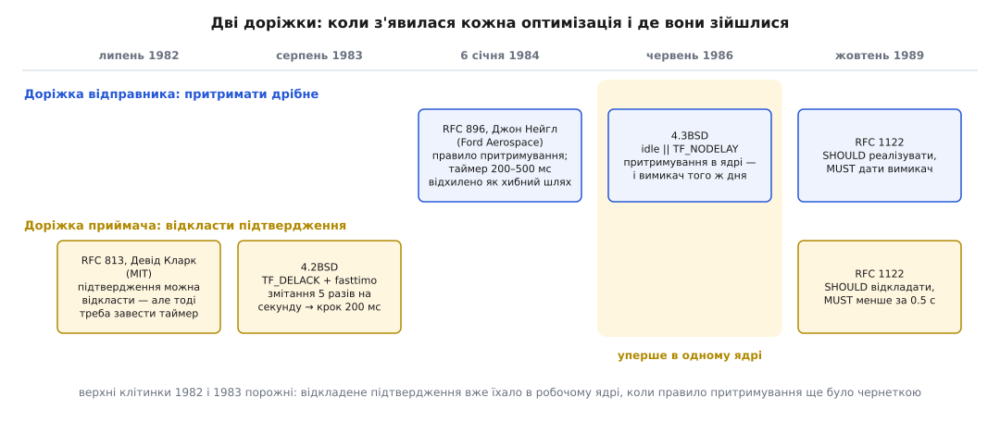

# 📜 Дві оптимізації, що не порозумілися

Сталу затримку в сорок або двісті мілісекунд, яку й досі ловлять у мережевому коді, не спричинив ані дефект, ані чийсь недогляд: це слід від зустрічі двох правильних ідей, придуманих у різних місцях, з різних причин і в різні роки. Розібрати, звідки взялася кожна, варто саме тому, що жодну з них не вийде просто «виправити» — обидві й далі роблять те, заради чого їх завели.

## Мережа, у якій усе тонуло

На початку 1980-х Ford Aerospace and Communications Corporation тримала власну далекобійну мережу IP/TCP — за словами RFC 896, єдину приватну мережу такого штибу на той час. Вона зшивала майданчики в Мічигані, Каліфорнії та Англії орендованими лініями, включно із супутниковим стрибком через Атлантику, і швидкості ланок у ній різнилися від 1200 біт/с до 10 мільйонів біт/с — розрив у вісім тисяч разів.

Саме на такому розриві й ламалося все. Уяви шлюз, в один бік якого впирається Ethernet на 10 Мбіт/с, а з другого виходить орендована лінія на 1200 біт/с. Черга в шлюзі переповнюється, зайві пакети зникають, відправники за таймаутом шлють їх знову — і, поки повтор іде, у мережі вже їде кілька копій одного й того самого. Що більше копій, то довша черга; що довша черга, то більший час обігу; що більший час обігу, то раніше спрацьовує наступний таймаут повтору. Петля замикається сама на себе, і лінія доходить до стану, коли вона повністю зайнята, а корисних даних не несе майже нічого. Джон Нейгл (John Nagle) назвав це явище **congestion collapse** — колапсом від заторів; сам термін уперше з'явився саме в RFC 896.

> Треба знати: TCP повторює те, що не підтверджене, і сам вирішує, коли вважати пакет загубленим. Якщо мережа й так перевантажена, ці повтори її добивають, тому в стек довелося вбудувати окремий механізм, який притишує відправника при перших ознаках втрат — [керування перевантаженням](root:com-transport/congestion-control).

Друга біда була дрібнішою на вигляд, але з тієї ж родини. Тодішній типовий трафік — символ за символом від термінала до великої машини. RFC 896 називає ціну прямо: на кожен корисний байт з клавіатури в мережу йде пакет на 41 байт — один байт даних і сорок байтів заголовків IP та TCP. Понад дев'яносто сім відсотків смуги витрачається на конверт. На Ethernet це образливо, але терпимо; на лінії 1200 біт/с це вирок.

## Правило, яке обійшлося без таймера

Очевидний спосіб склеїти дрібне — зачекати. Саме так на той час і робили: дрібний пакет притримували на 200–500 мс у надії, що за цей час набіжить ще символ-другий і поїдуть вони разом. Нейгл цей шлях розглянув і відхилив, причому з аргументом, який варто прочитати уважно: біда таймера в тому, що неможливо підібрати одну сталу, яка влаштує всіх. Затримка, достатньо коротка, щоб Ethernet на 10 Мбіт/с лишався жвавим, надто коротка, щоб урятувати від колапсу навантажену мережу з часом обігу в п'ять секунд; а затримка, достатня для навантаженої мережі, зробить із користувачів Ethernet нещасних людей.

Тому він запропонував правило зовсім іншої природи — без жодної сталої часу. Формулювання RFC 896 коротке: не відсилати нових сегментів, поки на з'єднанні лишається хоч щось раніше відправлене й не підтверджене.

Уся сила тут у тому, що правило **саме себе тактує**. Мірою затримки стає не число з конфігурації, а час обігу цього конкретного з'єднання — рівно те, що й треба.

```
Ethernet, час обігу ≈ 1 мс
  символ → з'єднання порожнє → летить негайно
  підтвердження ≈ через 1 мс → наступний символ теж летить негайно
  → жодної помітної затримки, пакет на символ

Далека лінія, час обігу ≈ 5 с, користувач друкує 5 символів/с
  1-й символ → з'єднання порожнє → летить негайно
  наступні 24 символи → чекають, бо перший ще не підтверджено
  підтвердження прийшло → усі 24 їдуть ОДНИМ пакетом
  → 25 разів менше пакетів, і жодного налаштування
```

На швидкій мережі правило не притримує нічого, бо підтвердження встигає повернутися раніше, ніж людина натисне другу клавішу. На повільній воно склеює тим щільніше, чим гірше мережі. Одне правило, нуль параметрів, і саме те, чого таймер дати не міг.

RFC 896 «Congestion Control in IP/TCP Internetworks» вийшов **6 січня 1984 року** за підписом Джона Нейгла з Ford Aerospace and Communications Corporation. Це важливо: документ описує не задум, а те, що вже працювало — RFC прямо каже, що схему використовують у мережі Ford Aerospace Software Engineering Network і що з нею стало можливо ганяти екранні редактори через Ethernet і водночас говорити з віддаленими машинами TOPS-20.

Ім'я «алгоритм Нейгла» схемі дали інші. Сам він, за власним свідченням, звав її **tinygram prevention** — запобіганням крихітним пакетам. Назва чесніша: вона каже, чого схема уникає, а не чиє в неї прізвище.

## Кларк: підтвердження не мусить летіти негайно

Тим часом за півтора року **до** RFC 896 у зовсім іншому місці визріла друга ідея. У липні 1982-го Девід Кларк (David D. Clark) із Лабораторії комп'ютерних наук MIT випустив RFC 813 «Window and Acknowledgement Strategy in TCP».

Кларка займало те саме марнотратство, але з боку приймача. Приймач, отримавши дані, за замовчуванням відповідає порожнім пакетом-підтвердженням: сорок байтів заголовків і нуль корисного вантажу. Кларк зауважив, що більшість таких пакетів не роблять узагалі нічого: вони не відкривають відправникові більшого вікна, не рятують від повтору й не везуть жодних даних у зворотний бік. Звідси його порада: не підтверджувати, якщо підтвердження не збільшує доступне вікно, не потрібне, щоб запобігти повторові, і не їде причепом до сегмента, який і так вирушає назад.

Останній випадок — найсмачніший. Якщо трохи зачекати, програма на цьому боці, найімовірніше, сама щось відповість, і підтвердження поїде в її пакеті задарма. Замість двох пакетів — один. Але «трохи зачекати» вимагає механізму очікування, і Кларк це записує без прикрас: відкладаючи підтвердження, реалізація мусить завести таймер, який його потім таки надішле.

Скільки саме чекати, Кларк теж назвав: для Арпанету, за його словами, розумний проміжок — 200–300 мілісекунд. Ось де народилася та стала часу, якої Нейгл півтора року по тому свідомо уникатиме.

Але тут історію зазвичай обривають, і даремно. Кларк не вважав сталу остаточною відповіддю. У Додатку А того самого RFC 813 він описує, як цю затримку **міряти**: щойно приходить сегмент без прапорця push, запускається таймер до приходу наступного сегмента; ці проміжки між сегментами усереднюються експоненційним згасанням; і затримка підтвердження підбирається під темп, з яким співрозмовник насправді шле дані.

Тобто адаптивний варіант лежав у тому самому документі, що й число. Просто число займало один рядок в основному тексті, а вимірювання — окремий додаток, і реалізації пішли простішою дорогою. І це ще відгукнеться: Linux через тридцять із гаком років прийде рівно до Додатку А — мірятиме темп сегментів і підбиратиме затримку в межах вилки. Ідеї не бракувало; бракувало охоти втілити її тоді, коли вона ще нічого не коштувала.

Обидва — і Кларк, і Нейгл — бачили ту саму проблему: конверт, більший за вантаж. Обидва мали рацію. Різниця в тому, з якого боку кожен дивився. Відправник має природний годинник — час обігу, який йому щоразу повертають підтвердження. Приймачеві чекати нема на що, крім даних, яких може й не бути, — тож у нього лишається тільки годинник ядра.

## Що насправді лежало в коді Берклі

Ідея, RFC і рядок у ядрі — три різні речі, і в цій історії вони стоять не в тому порядку, у якому їх зазвичай переказують. Це видно просто з вихідних текстів BSD.

**4.2BSD, серпень 1983.** У `tcp_var.h` цієї версії є прапорець `TF_DELACK` із коментарем «ack, but try to delay it», а в `tcp_timer.c` — функція `tcp_fasttimo`, яка проходить по з'єднаннях, знімає цей прапорець і виштовхує підтвердження. Тобто відкладене підтвердження вже їде в робочому ядрі. А от прапорця `TF_NODELAY` там **немає взагалі**, і в `tcp_output.c` немає жодного притримування: сегмент вирушає, щойно він повний або щойно черговий запис спорожнює передавальний буфер.

Наскільки довго відкладається підтвердження, задає одна константа в `protosw.h`:

```
#define PR_SLOWHZ  2   /* 2 slow timeouts per second */
#define PR_FASTHZ  5   /* 5 fast timeouts per second */
```

П'ять змітань на секунду — це сітка з кроком 200 мс. І тут ховається деталь, яку часто проминають: це не таймер на з'єднання, а **періодичне змітання всіх з'єднань**. Скільки чекатиме конкретне підтвердження, залежить від того, куди між двома змітаннями впав сегмент, — від майже нуля до повних 200 мс. Затримка не просто фіксована, вона ще й непередбачувана в межах кроку.

**4.3BSD, червень 1986.** Аж тепер, через два роки й п'ять місяців після RFC 896, у `tcp_var.h` з'являється `TF_NODELAY` із коментарем «don't delay packets to coalesce», а в `tcp_output.c` — рішення про відсилання набуває вигляду:

```c
if ((idle || tp->t_flags & TF_NODELAY) &&
    len + off >= so->so_snd.sb_cc)
        goto send;
```

Читається це так: неповний сегмент вирушає, тільки якщо з'єднання порожнє (`idle` — нічого непідтвердженого) **або** програма попросила не притримувати. Це і є правило Нейгла в коді — і разом із ним, тим самим рядком, того ж дня, з'явився вимикач. Вимикач не був пізнішою латкою поверх помилки: його заклали в саму доставку, бо RFC 1122 три роки по тому лише закріпить те, що Берклі вже зробили.



*Порожні верхні клітинки 1982 і 1983 — не оздоба: у дереві BSD відкладене підтвердження поїхало в робочому ядрі раніше, ніж вийшов RFC про притримування.*

## Стик

Кожна оптимізація окремо поводиться бездоганно. Зіштовхує їх один-єдиний, зате дуже поширений візерунок: **два записи, тоді читання** — програма пише заголовок, потім тіло, а тоді чекає на відповідь.

```
Клієнт: send(заголовок, 8 Б)   → з'єднання порожнє → летить негайно
Клієнт: send(тіло, 200 Б)      → перше ще не підтверджено → ПРИТРИМАНО
Сервер: отримав 8 байтів       → відповідати нема на що (тіла нема)
                               → підтвердження ВІДКЛАДЕНО: раптом буде відповідь
        ... тиша ...
        спрацював таймер       → підтвердження таки поїхало
Клієнт: підтвердження прийшло  → тіло нарешті летить
```

Відправник чекає на підтвердження. Приймач чекає на дані, щоб причепити підтвердження до відповіді. Обидва чекають одне на одного, і розчепити їх може лише годинник. Причому жодна зі сторін не помиляється: відправник виконує правило Нейгла, приймач — пораду Кларка.

Сучасні числа — прямі нащадки тих самих констант. У Linux у `include/net/tcp.h` стоїть:

```
#define TCP_DELACK_MAX  ((unsigned)(HZ/5))   /* 200 мс — стеля  */
#define TCP_DELACK_MIN  ((unsigned)(HZ/25))  /*  40 мс — підлога */
```

Стеля в 200 мс — це та сама п'ятірка з `PR_FASTHZ` 1983 року, що доїхала до наших днів. Підлога в 40 мс — пізніше пом'якшення: замість однієї сталої Linux міряє, з яким темпом приходять сегменти, і підбирає затримку в цих межах, тож у швидкій локальній мережі ти бачиш саме підлогу. Це, зрештою, і є Додаток А з RFC 813 — вимірювання замість числа, — тільки втілене років на тридцять пізніше й затиснуте у вилку, обидва краї якої лишилися сталими з минулого. Ось звідки беруться ті рівні сорок мілісекунд, які так легко сплутати з мережевою проблемою: це не мережа, а годинник ядра.

І ось у чому гіркота цієї історії. Нейгл окремо й розгорнуто пояснив, чому фіксована стала часу — хибний шлях, і побудував своє правило так, щоб її не мати. А коли він це писав, фіксована стала часу вже п'ятий місяць працювала в робочому ядрі — просто з іншого боку з'єднання, куди його аргумент не дотягнувся.

## Що про це казав сам Нейгл

Нейгл повертався до цієї теми не раз — зокрема в коментарях на Hacker News під ніком Animats, які він підписував власним ім'ям. Його позиція за роки не змінилася й полягає в тому, що винуватити слід не притримування, а фіксований таймер відкладеного підтвердження.

У серпні 2015-го він писав, що погана взаємодія двох механізмів його досі дратує: одну штуку спроєктував він, другу — хтось у Берклі, а коли він про це дізнався, він уже пішов із мережевої архітектури й працював над іншим в іншій компанії. Далі — суть: та фіксована двохсотмілісекундна затримка у відкладеному підтвердженні була поганою ідеєю; уся ця затія була хаком заради посимвольного Telnet, а важив він для Берклі тому, що там стояло багато простих термінальних серверів. Фіксована пауза підібрана під час людської реакції й час, потрібний UNIX на відлуння символу; коли надрукований символ треба повернути назад, підтвердження справді їде причепом до відлуння — і це один із небагатьох випадків, де відкладати вигідно.

І там-таки — його рецепт, який пояснює, чого бракує: відкладене підтвердження мало б бути **вимкненим за замовчуванням** і вмикатися лише тоді, коли з'єднання показало стійкий візерунок «отримав, підтвердив, а програма тут-таки відповіла, тож підтвердження можна було склеїти з відповіддю». Тобто не стала, а спостереження — рівно та сама ідея самотактування, з якої виріс RFC 896.

Півроку раніше, у лютому 2015-го, він назвав і походження самого числа. Чому 200 мс? Час людської реакції. А конструкція, за його словами, запозичена з пристроїв інтерфейсу X.25, де такий механізм звався **accumulation timer** — таймером накопичення. Далі йде фраза, що б'є точно в суть: це єдиний короткий фіксований таймер у TCP, усе інше в протоколі прив'язане до якоїсь обчисленої величини на кшталт часу обігу. У протоколі, де кожна затримка виводиться з вимірювання, рівно один проміжок узятий іззовні — зі швидкості людських пальців.

У грудні 2022-го він додав історичне тло: після того як він завів своє правило, Берклі завели відкладені підтвердження, щоб розвантажити свої термінальні концентратори — там кожне натискання породжувало пакет із одним байтом, у відповідь порожній пакет-підтвердження, а слідом ще пакет із відлунням символу; відкладення давало їм близько тридцяти відсотків економії на TELNET. Висновок його короткий: обидва механізми не повинні бути ввімкнені одночасно, але зазвичай вони ввімкнені обидва.

Є ще одна причина, чому стик не «полагодили» ні тоді, ні потім, і Нейгл формулює її як інженерну, а не історичну: **ручки стоять на протилежних кінцях з'єднання**. Притримування вимикається у відправника, відкладене підтвердження — у приймача, а потрібна комбінація («тут не притримувати, там не відкладати») з одного кінця не задається взагалі. Звідси й закріпилася практика робити те єдине, що ти можеш зробити у себе: поставити `TCP_NODELAY` і не думати про другий бік. Наприкінці 2025-го він повторив це майже дослівно, додавши, що виправити мали сорок років тому.

Тут варто розділити рівні. Порядок, який він називає, — це порядок його власного проєкту: його схема справді працювала в мережі Ford Aerospace до січня 1984-го. Датування берклівської вставки в нього пливе — в одному коментарі «десь 1985-го», — і саме тут самозвіт варто звірити з деревом: прапорець `TF_DELACK` лежить уже в 4.2BSD, тобто найпізніше в серпні 1983-го. **Надрукований** запис виглядає так: ідея відкладеного підтвердження опублікована Кларком у липні 1982-го, у дереві BSD поїхала в серпні 1983-го — за п'ять місяців до RFC 896 і майже за три роки до того, як притримування з'явилося в 4.3BSD.

Суперечності тут менше, ніж здається: твердження стосуються різних речей — одне послідовності робіт у Ford Aerospace, друге послідовності релізів у Берклі, — і людська пам'ять на дати чужої команди через сорок років не є доказом. Чи брали реалізатори 4.2BSD відкладене підтвердження безпосередньо з RFC 813, документально сказати не можу: часовий порядок це дозволяє, прямого свідчення я не бачив. За обставини, що прибрали з-за столу єдину людину, яка могла заперечити, свідчення теж лише його власне: Ford Aerospace переносила мережеві роботи з Пало-Альто до Колорадо-Спрінгс, він 1986-го пішов — далі був Autodesk і зовсім інші задачі.

## Що з цього закріпили в стандарті

Обидві оптимізації остаточно узаконив один документ — RFC 1122 «Requirements for Internet Hosts» за редакцією Роберта Брейдена (Robert Braden), жовтень 1989 року. Він же розставив і запобіжники.

Про притримування (розділ 4.2.3.4): реалізація TCP **SHOULD** мати алгоритм Нейгла, «щоб зліплювати короткі сегменти», — а далі стоїть слово жорсткіше: **MUST** існувати спосіб вимкнути алгоритм на окремому з'єднанні. Не «варто передбачити», а «мусить бути». Зверни увагу на перекіс: мати притримування — лише SHOULD, мати від нього ключ — MUST. Вимикач із 4.3BSD став обов'язковішим за сам механізм, який він вимикає.

Про відкладення (розділ 4.2.3.2): підтвердження **SHOULD** відкладати, але воно не має бути відкладене надмірно — зокрема затримка **MUST** бути меншою за 0.5 секунди, а в потоці повнорозмірних сегментів підтвердження **SHOULD** приходити щонайменше на кожен другий. Саме це останнє правило рятує великі передачі: у щільному потоці підтвердження йдуть через сегмент і притримувати нема чого. Стик кусає тільки дрібний візерунок «запис, запис, читання».

## Три пари виписані, четвертої немає

RFC 1122 не сліпий до взаємодій — навпаки, він їх виписує педантично. У розділі про відкладене підтвердження є попередження, що надмірні затримки збивають вимірювання часу обігу й тактування пакетів. У розділі про вікно приймача сказано, що механізм уникання дурного вікна (silly window syndrome) поєднується з відкладеним підтвердженням і разом вони вирішують, коли підтвердження таки поїде. У розділі про притримування сказано, що воно й уникання дурного вікна відіграють взаємодоповняльні ролі.

Три пари виписані. Четвертої — притримування × відкладене підтвердження — немає. Слова «delayed ACK» трапляються в документі п'ять разів, і жодного разу не в розділі про алгоритм Нейгла; розділ 4.2.3.4 посилається на уникання дурного вікна й на повільний старт, але не на сусідній розділ, що стоїть двома пунктами вище. Обидва механізми узаконені в одному документі, за півтори сторінки один від одного, і документ жодним словом не каже, що станеться, коли ввімкнути обидва.

Ось і відповідь на питання, чому їх не примирили на рівні стандарту: їх не примиряли, бо не бачили як пару. Кожен розділ писався як окрема вимога до окремої підсистеми — «що мусить уміти відправник», «що мусить уміти приймач», — і в цій нарізці стик між двома кінцями одного з'єднання просто не мав де проступити.

Показово й те, як прийшло найкраще пом'якшення — повз стандарт. Ґреґ Міншалл (Greg Minshall) у драфті «A Suggested Modification to Nagle's Algorithm» (редакція -01 від 18 червня 1999-го) звужує умову: чекати треба не тоді, коли непідтверджене хоч щось, а тоді, коли непідтверджений останній **дрібний** пакет. Драфт так і не став RFC — він протермінувався й лежить в архіві. Зате живе в коді: у Linux `tcp_output.c` умови відсилання виписані списком, і четвертий пункт каже просто, що за модифікацією Міншалла достатньо, щоб були підтверджені всі надіслані дрібні пакети. Змішаному трафікові з великих і дрібних записів це помітно допомагає, але візерунка «дрібне, дрібне, чекаю» не рятує.

З боку приймача Linux дав `TCP_QUICKACK` — прохання не відкладати. Ручка вийшла дивна: ядро саме повертає з'єднання у звичайний режим, тож просити доводиться знову й знову, і сам Нейгл у 2022-му згадував про це з роздратуванням.

## Чого в цій історії немає

Немає винного. Немає й «Нейгл зіпсував інтернет»: правило притримування досі робить рівно те, для чого його завели, і якщо його прибрати зовсім, повернеться проблема дрібного пакета — сорок байтів конверта на байт вантажу, тільки тепер помножені на мільярди з'єднань. Немає й дзеркального міфу, що відкладене підтвердження — дурість: без нього посимвольний трафік коштував би вдвічі більше пакетів, і саме заради цієї економії його й заводили.

Що справді є — це три різні речі, які варто називати різними іменами. **Ідея**: у Кларка (липень 1982) і в Нейгла (робоча схема в Ford Aerospace до січня 1984). **RFC**: 813, 896 і 1122 — документи, що фіксують ідею, а не код. **Реалізація**: 4.2BSD із відкладенням і без вимикача, 4.3BSD із притримуванням і вимикачем, Linux із варіантом Міншалла та підлогою в 40 мс. Розрив між цими рівнями і є те місце, де двом правильним ідеям не дали побачити одна одну: коли Кларк писав про таймер, притримування ще не існувало на папері; коли Нейгл писав, що таймери — хибний шлях, таймер уже п'ятий місяць працював у чужому ядрі.
