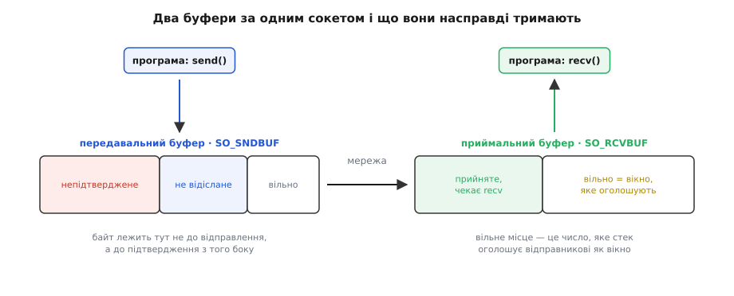
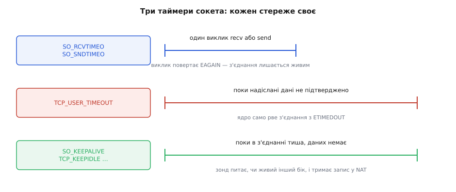
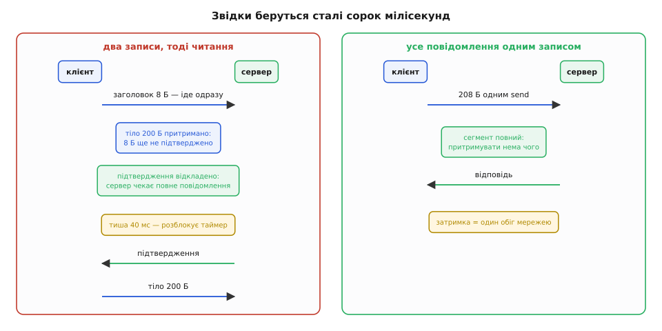
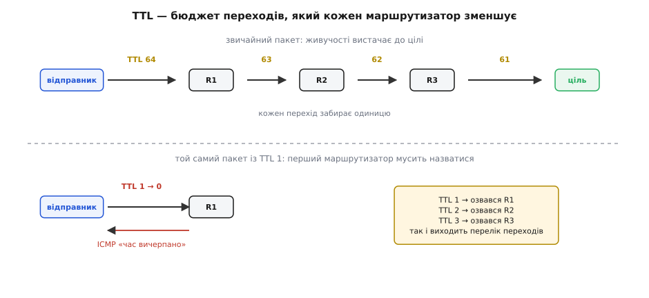

# Опції сокета: буфери, таймаути, TCP_NODELAY, TTL

<preknowlist>
- [Сокети TCP/UDP](topic:sf-os/sockets-tcp-udp) — сокет як кінець розмови, потік TCP проти датаграми UDP, виклики `send`, `recv`, `connect`.
- [Блокуючий і неблокуючий ввід-вивід](topic:sf-tasks/blocking-vs-nonblocking-io) — що означає «виклик заблокувався» і чим від нього відрізняється неблокуючий режим.
- [Ядро й простір користувача](topic:sys-unix/kernel-and-userspace) — межа, за якою живуть буфери й таймери сокета: програма не володіє ними, а просить.
- [Маршрутизація](topic:com-transport/ip-routing) — маршрутизатор, перехід із мережі в мережу, шлях пакета крізь кілька вузлів.
</preknowlist>

## Куди зникають дані між `send` і дротом

Програма шле дванадцять байтів команди й засікає час до відповіді. На тій самій машині відповідь приходить за пів мілісекунди. Той самий код між двома серверами в одній стійці — сорок мілісекунд. Мережа тут ні до чого: `ping` між тими машинами показує 0.2 мс, канал вільний, процесор простоює. Сорок мілісекунд узялися нізвідки й тримаються з дивовижною сталістю — не 38 і не 44, а рівно сорок, знову й знову.

Розгадка починається з того, що `send` **не надсилає**. Він копіює твої байти в пам'ять ядра й повертається — а що з ними станеться далі, вирішує не він. Між копіюванням і дротом стоїть машина зі своїми правилами, і ця машина ухвалює щонайменше чотири самостійні рішення.

**Скільки даних тримати.** У ядра є пам'ять під дані, які ти вже віддав, але яких мережа ще не проковтнула, і під дані, що прийшли, але яких ти ще не забрав. Розмір цієї пам'яті визначає і швидкість, і затримку.

**Скільки чекати.** Коли ти кличеш `recv`, а другого боку немає, хтось має вирішити, коли припинити чекання. Само по собі TCP на це не квапиться.

**Коли відсилати.** Стек має право **притримати** твої байти на мить, щоб склеїти їх із наступними в один повніший пакет. Саме звідси беруться ті сорок мілісекунд.

**Як далеко пускати.** Кожен пакет несе лічильник дозволених переходів, і його початкове значення теж хтось обирає.

Жодне з цих рішень стек не може ухвалити правильно, бо правильність залежить від того, чого хоче твоя програма, а цього стек не знає. Передача файлу хоче великих пакетів і повних буферів; керування роботом хоче, щоб дванадцять байтів вилетіли негайно й нікого не чекали. Обидва бажання законні, обидва не можна вдовольнити одночасно — тож стек має **замовчування**, підібрані під усереднений випадок. Усередненого випадку не існує; існують конкретні програми, для яких замовчування або пасує, або мовчки шкодить.

**Опції сокета** — це єдиний спосіб сказати стекові те, чого він не може вивести сам: який у тебе намір і які в тебе ресурси. Не «зроби краще», а «ось у чому мій випадок не середній».

## Опція — це поле в об'єкті ядра

Сокет із боку програми — просто число, дескриптор. Із боку ядра це структура з десятками полів: покажчики на буфери, таймери, прапорці, лічильники, стан автомата TCP. Виклик `setsockopt` записує одне з цих полів, `getsockopt` — читає. Ніякої магії тут немає, і саме тому інтерфейс має незвичний на вигляд підпис.

```c
int setsockopt(int fd, int level, int optname, const void *val, socklen_t len);
int getsockopt(int fd, int level, int optname,       void *val, socklen_t *len);
```

Два параметри тут варті пояснення. Перший — **рівень** (`level`). Сокет не однорідний: він складений із шарів, і кожен шар має власні поля. `SOL_SOCKET` — це сам об'єкт сокета, спільний для всіх протоколів: буфери, таймаути, прапорці повторного використання адреси. `IPPROTO_TCP` — машина TCP усередині: притримування дрібних пакетів, лічильники підтримки з'єднання. `IPPROTO_IP` — те, що піде в заголовок IP: лічильник переходів, поле пріоритету, налаштування багатоадресної розсилки. Рівень — не бюрократія, а адреса шару, до якого ти звертаєшся; імена опцій унікальні лише в межах рівня, тож без нього ядро не знало б, до кого ти говориш.

Другий — **покажчик і довжина** замість звичайного значення. Опції мають різні типи: одні беруть `int`, інші — `struct timeval`, `struct linger`, `struct ip_mreq`. Один підпис на всіх можливий тільки через нетипізований покажчик, а довжина каже ядру, скільки байтів читати, і рятує від тихого прочитання чужої пам'яті. Ціна цієї універсальності — компілятор не перевірить тип: передаси `int` там, де очікують `struct timeval`, і отримаєш або `EINVAL`, або, гірше, мовчазне сміття в полі.

Помилки варто розрізняти. `ENOPROTOOPT` означає «такої опції на цьому рівні немає» — типово ти переплутав рівень або пишеш під стек, де опцію не реалізували. `EINVAL` — «значення не годиться»: не той розмір, від'ємне число, заборонена комбінація. `EBADF` — дескриптор не той. Мовчазно ігнорувати результат `setsockopt` — погана звичка саме тому, що на іншій системі та сама опція просто не спрацює, а програма далі поводитиметься так, ніби все гаразд.

Найважливіше в механіці: **опція — це прохання, а не наказ**. Ядро вільне змінити значення, і воно це робить. Класичний приклад — розмір приймального буфера в Linux: ядро подвоює те, що ти попросив, бо частина пам'яті піде на службові структури, а не на самі дані, і потім обмежує результат системною стелею `net.core.rmem_max`.

**Просимо 256 КіБ приймального буфера й читаємо, що вийшло**

```c
int want = 256 * 1024;
if (setsockopt(fd, SOL_SOCKET, SO_RCVBUF, &want, sizeof want) < 0)
    perror("SO_RCVBUF");

int got = 0;
socklen_t len = sizeof got;
getsockopt(fd, SOL_SOCKET, SO_RCVBUF, &got, &len);
printf("просив %d, маю %d\n", want, got);
```

```text
просив 262144, маю 524288      ← Linux подвоїв
```

Прочитане значення вдвічі більше за прохане, і це не помилка: половина піде на облік. А якби системна стеля була нижчою за прохане, `setsockopt` **не** повернув би помилки — він просто дав би менше. Звідси правило, з якого починається будь-яке налаштування сокета: **поставив — прочитай назад**. Те, що ти справді маєш, каже `getsockopt`, а не твоя змінна.

Друга тонкість — **момент**. Частина опцій має бути виставлена до певного виклику, бо після нього змінювати вже нічого. `SO_REUSEADDR` ставлять **до `bind`**, бо саме `bind` перевіряє зайнятість адреси. Розміри буферів TCP ставлять **до `connect` або `listen`**, і причина глибша, ніж здається: коефіцієнт масштабування вікна сторони узгоджують у пакетах рукостискання, тож після встановлення з'єднання стеля вікна вже зафіксована. Поставиш буфер після `connect` — число зміниться, а користі не буде. Для сервера з цього випливає неочевидний наслідок: опції ставлять на **слухаючий** сокет, а сокети, що народжуються з `accept`, успадковують більшість із них. Не всі, тож `accept`-цикл усе одно варто перевіряти на своїй системі.

> 🔧 **Навіщо це.** Половина «загадкових» звітів про мережеві налаштування — це опції, виставлені не в той момент або мовчки обрізані системною стелею. Три рядки `getsockopt` після налаштування сокета зазвичай економлять день на пошук причини, чому продуктивність не змінилася. Повний перелік викликів, що творять сокет, — у [API сокетів](topic:sf-os/sockets-tcp-udp); порядок «створив → опції → `bind`/`connect`» — частина цього API, а не стильова забаганка.

## Буфери: пам'ять, у якій дані живуть без тебе

За кожним сокетом стоять два буфери, і плутати їхні ролі не варто, бо роботи в них зовсім різні.

**Передавальний буфер** (`SO_SNDBUF`) виглядає як черга: ти складаєш туди байти, стек виймає й відсилає. Але в TCP у нього є друга, менш очевидна робота — **пам'ять про непідтверджене**. TCP зобов'язаний доставити дані, а отже, мусить уміти повторити пакет, якщо той загубився. Повторити можна лише те, що ще зберігається. Тому байт живе в передавальному буфері не до моменту відправлення, а до **підтвердження від іншого боку**. З цього випливає річ, що спантеличує при першій зустрічі: буфер може бути повний, хоча мережа вільна, — просто підтвердження ще не встигли повернутися. Блокуючий `send` у цю мить зупиняється, неблокуючий повертає `EAGAIN`, а частковий запис (`send` віддав менше, ніж ти просив) — цілком нормальна відповідь, яку код зобов'язаний обробити.

**Приймальний буфер** (`SO_RCVBUF`) — черга в інший бік: сюди стек кладе те, що прийшло, і чекає, доки ти забереш це через `recv`. І тут його розмір керує не лише тим, скільки даних переживе твою паузу. **Вільне місце в приймальному буфері — це і є вікно, яке TCP оголошує іншому боку.** Оголошене вікно каже відправникові: «більше за стільки байтів наперед не шли». Це механізм [керування потоком](topic:com-transport/flow-control) — захист повільного приймача від швидкого відправника. Наслідок прямий і кількісний: розмір приймального буфера ставить **стелю швидкості** з'єднання.

**Скільки байтів мусить поміститися у вікні на далекій лінії**

```text
Канал:               100 Мбіт/с = 12 500 000 байт/с
Час обігу (RTT):     150 мс     = 0.150 с
Даних «у дорозі», поки летить перше підтвердження:
    12 500 000 · 0.150 = 1 875 000 байтів ≈ 1.79 МіБ
```

Це число — добуток пропускної здатності на затримку — і є мінімальний розмір вікна, за якого канал завантажений безперервно. Якщо вікно менше, відправник вичерпує його й **чекає**, замість слати далі. Порахуймо, що дає класичні 64 КіБ:

```text
Вікно:      65 536 байтів
RTT:        0.150 с
Швидкість:  65 536 / 0.150 = 436 907 байт/с ≈ 3.5 Мбіт/с
```

Три з половиною мегабіти на стомегабітному каналі — і жодного втраченого пакета, жодного перевантаження. Просто вікно замале для такої відстані. Історично 64 КіБ — це стеля самого поля вікна в заголовку TCP, бо воно шістнадцятибітове; більші вікна працюють через **коефіцієнт масштабування**, яким сторони обмінюються в рукостисканні. Ось чому розмір буфера має бути виставлений до `connect`: коефіцієнт домовляють один раз, на початку.



*Передавальний буфер відпускає байт лише після підтвердження, тому його займає не «те, що не встигло піти», а «те, за що ще відповідають»; вільне місце в приймальному буфері — це число, яке стек оголошує відправникові як вікно.*

Звідси природний висновок «зробімо буфери великими» — і саме тут ховається друга половина правди. Дані, які лежать у **твоєму** передавальному буфері, вже не можна ні скасувати, ні обігнати. Вони стоять у черзі, і все, що ти надішлеш після них, чекатиме, доки черга розсмокчеться.

**Скільки затримки додає власний буфер на вузькому каналі**

```text
Передавальний буфер:  1 МіБ = 1 048 576 байтів
Канал:                2 Мбіт/с = 250 000 байт/с
Час спорожнення черги:
    1 048 576 / 250 000 = 4.19 с
```

Команда «стоп», записана в сокет після мегабайта телеметрії, вилетить у мережу через чотири секунди. Це та сама механіка, що робить перевантажені черги в мережах джерелом затримки, — [черга додає час, пропорційний своїй довжині](topic:com-transport/queue-theory-networks), і байт не має способу оминути тих, хто став перед ним. Великий буфер купує пропускну здатність за затримку, і на вузькому каналі ціна стає дикою.

Тому в Linux розміром приймального буфера за замовчуванням керує **самоналаштування**: ядро саме підбирає його в межах трійки `net.ipv4.tcp_rmem` за виміряним часом обігу й темпом, з яким програма забирає дані. Явний `setsockopt(SO_RCVBUF)` цей механізм **вимикає** — ядро ставить прапорець «користувач знає краще» й більше не чіпає розмір. У більшості випадків це погіршення: ти замінюєш вимір здогадом. Правильна послідовність — спершу переконатися, що вимірювання показує впирання саме у вікно, і лише тоді втручатися, а системну стелю піднімати через `sysctl`, а не через опцію конкретного сокета.

У UDP буфери значать зовсім інше, бо там немає ні підтверджень, ні вікна. Приймальний буфер — просто **черга цілих датаграм**. Переповнилася — датаграма зникає **тихо**: ніхто не повторить її й не попередить тебе, лічильник зросте хіба що в системній статистиці (`netstat -su`, рядок про помилки приймального буфера). Це найчастіша причина «загублених» пакетів у програмах, що читають UDP нерівномірно: черга не витримує сплеску, поки програма зайнята обробкою. Тут збільшення `SO_RCVBUF` — правильне й пряме лікування, а не здогад. Інші способи, якими датаграма може щезнути, розібрано в [семантиці датаграми UDP](topic:com-transport/udp-datagram-semantics).

На мікроконтролері буфери перестають бути абстракцією й стають статтею витрат RAM. У lwIP розмір вікна й передавального буфера задають **при збірці** (`TCP_WND`, `TCP_SND_BUF`), а не через `setsockopt`; в ESP-IDF обидва за замовчуванням 5760 байтів — рівно чотири сегменти по 1440. Порахуймо, що це означає на з'єднанні через півсвіту:

```text
Вікно:      5760 байтів
RTT:        100 мс = 0.100 с
Стеля:      5760 / 0.100 = 57 600 байт/с ≈ 0.46 Мбіт/с
```

Пів мегабіта — і це на плати з Wi-Fi, здатним на десятки мегабіт. Вузьке місце тут не радіо, а чотири кілобайти RAM, віддані під вікно. Збільшити його можна, але кожен байт вікна — це байт, якого не буде в купі; на чипі з двомастами кілобайтами такий обмін роблять свідомо й один раз, а не «про всяк випадок».

> 🔧 **Навіщо це.** Коли швидкість передачі вперлася в стелю, поділи виміряну швидкість на розмір вікна — якщо вийде приблизно один обіг, ти впираєшся у вікно, а не в канал і не в процесор. Ця перевірка на дві дії відрізняє випадок, де допоможуть буфери, від випадку, де вони не дадуть нічого, бо там втрати або [керування перевантаженням](topic:com-transport/congestion-control) стримує відправника незалежно від буферів.

## Таймаути: як не чекати вічно

Тепер друге рішення — коли припинити чекання. Уяви, що в сервера, з яким ти говориш, висмикнули кабель живлення. Він не надішле нічого: ні `FIN`, ні `RST`, ні помилки. Для TCP тиша — законний стан з'єднання; протокол свідомо переживає хвилини мовчання, бо мережа буває тимчасово недоступною, і рвати робоче з'єднання через десять секунд мовчанки було б гірше, ніж зачекати. Твій блокуючий `recv` при цьому чекатиме, скільки скажеш, — а за замовчуванням ти не сказав нічого, отже, вічно.

Найпряміший інструмент — `SO_RCVTIMEO` і `SO_SNDTIMEO`. Вони беруть `struct timeval` і обмежують час, який **один виклик** має право проблокуватися. Вичерпався — виклик повертає `-1` з `EAGAIN` (він же `EWOULDBLOCK`), так само, як повернув би неблокуючий сокет.

Тут ховається пастка, через яку такий код ламається на межі. Таймаут обмежує **виклик**, а не операцію. Якщо `recv` уже встиг забрати частину даних, а тоді настав час, він поверне не помилку, а **кількість переданих байтів** — тобто виглядатиме як звичайне часткове читання. А цикл, що збирає повне повідомлення, викличе `recv` іще раз — і кожна ітерація дістане свіжий повний таймаут. П'ять ітерацій по дві секунди — це десять секунд, хоча ти «поставив дві». Щоб обмежити операцію цілком, треба тримати **дедлайн** і перед кожним викликом перераховувати, скільки часу лишилося.

```c
static long now_ms(void) {
    struct timespec ts;
    clock_gettime(CLOCK_MONOTONIC, &ts);
    return ts.tv_sec * 1000L + ts.tv_nsec / 1000000L;
}

/* прочитати рівно need байтів, витративши на все не більше budget_ms */
int recv_exact_deadline(int fd, void *buf, size_t need, long budget_ms) {
    long deadline = now_ms() + budget_ms;
    size_t got = 0;

    while (got < need) {
        long left = deadline - now_ms();
        if (left <= 0) { errno = ETIMEDOUT; return -1; }

        struct timeval tv = { .tv_sec = left / 1000,
                              .tv_usec = (left % 1000) * 1000 };
        if (setsockopt(fd, SOL_SOCKET, SO_RCVTIMEO, &tv, sizeof tv) < 0)
            return -1;

        ssize_t n = recv(fd, (char *)buf + got, need - got, 0);
        if (n == 0) { errno = ECONNRESET; return -1; }  /* інший бік закрив */
        if (n < 0) {
            if (errno == EINTR) continue;               /* сигнал — не помилка */
            return -1;                                  /* EAGAIN — час вичерпано */
        }
        got += (size_t)n;
    }
    return 0;
}
```

Годинник тут навмисно **монотонний**: `CLOCK_MONOTONIC` не стрибає, коли систему підводять під точний час, а `CLOCK_REALTIME` стрибає — і дедлайн разом із ним. Ця дрібниця з'їдає години налагодження раз на кілька років, і завжди в найгіршу мить.

Із `connect` окрема історія. У Linux `SO_SNDTIMEO` на нього поширюється, але поводиться не так, як очікують: вичерпавши час, `connect` повертає `-1` з `EINPROGRESS` — «іще в процесі», — і спроба з'єднатися **триває у фоні**. Ти перестав чекати, але ядро не перестало намагатися, і це не те саме, що скасувати з'єднання. На інших системах ця опція на `connect` не діє взагалі. Тому переносний і чесний спосіб обмежити час з'єднання один: перевести сокет у неблокуючий режим, викликати `connect`, дочекатися готовності на запис і **окремо спитати результат**.

```c
int connect_timeout(int fd, const struct sockaddr *addr, socklen_t alen, int ms) {
    int flags = fcntl(fd, F_GETFL, 0);
    fcntl(fd, F_SETFL, flags | O_NONBLOCK);

    if (connect(fd, addr, alen) == 0) {      /* устиг одразу — типово локальний хост */
        fcntl(fd, F_SETFL, flags);
        return 0;
    }
    if (errno != EINPROGRESS) return -1;     /* справжня помилка, а не «в процесі» */

    struct pollfd p = { .fd = fd, .events = POLLOUT };
    int r = poll(&p, 1, ms);
    if (r == 0) { errno = ETIMEDOUT; return -1; }
    if (r < 0)  return -1;

    int err = 0;                             /* готовність на запис ≠ успіх */
    socklen_t len = sizeof err;
    if (getsockopt(fd, SOL_SOCKET, SO_ERROR, &err, &len) < 0) return -1;
    if (err != 0) { errno = err; return -1; }

    fcntl(fd, F_SETFL, flags);
    return 0;
}
```

Ключовий рядок тут — `SO_ERROR`. Сокет став готовим на запис і в разі успіху, і в разі відмови: `poll` каже лише «стан змінився», а не «все добре». Помилка сталася тоді, коли в жодному виклику ніхто не сидів, і ядру не було кому її повернути, — тож воно поклало її в поле сокета, звідки її й забирають `getsockopt`. Читання `SO_ERROR` водночас **очищає** поле: помилку віддають один раз. Механіку очікування на кількох дескрипторах розібрано в [select, poll, epoll](topic:sys-unix/select-poll-epoll); тут важливо лише те, що готовність і успіх — різні речі.

Таймаут виклику відповідає на питання «чи чекати мені далі». На питання «чи живий іще той бік» він не відповідає, і для нього є два інші механізми, які плутають між собою частіше за все.

**`TCP_USER_TIMEOUT`** обмежує, скільки часу дані мають право лишатися **непідтвердженими**. Вичерпався ліміт — ядро само рве з'єднання з `ETIMEDOUT`, і твій наступний виклик отримає чесну помилку замість тиші. Без цієї опції стек повторює втрачений сегмент із дедалі довшими паузами, і за замовчуванням здається аж після півтора десятка спроб — це чверть години, під час якої з'єднання формально живе, а насправді давно мертве. Для служби, що мусить помітити зникнення партнера за секунди, це саме та ручка, що потрібна: вона діє на **напрямку відправлення** й спрацьовує лише тоді, коли є що підтверджувати.

**`SO_KEEPALIVE`** розв'язує протилежний випадок — з'єднання **простоює**, даних немає, отже, нема чого не підтверджувати. Увімкнена підтримка змушує стек після певної тиші надіслати порожній зондувальний сегмент із номером уже підтвердженого байта: приймач зобов'язаний відповісти підтвердженням, і сама відповідь доводить, що інший бік живий. Кількість і темп зондів задають `TCP_KEEPIDLE`, `TCP_KEEPINTVL`, `TCP_KEEPCNT`. Проблема в замовчуваннях: у Linux це 7200 секунд тиші перед першим зондом, далі дев'ять спроб по 75 секунд — стандарт вимагає, щоб типове значення було не меншим за дві години, тож вимкнений із розетки сервер помітять не раніше, ніж за два з гаком години.

Дві години — вічність не лише для програми. Проміжні вузли, що [транслюють адреси](topic:com-transport/nat), тримають запис про з'єднання в таблиці лічені хвилини простою, а тоді викидають. Після цього твої пакети йдуть у нікуди, хоча обидві сторони вважають з'єднання живим. Тому зонди підтримки з'єднання ставлять із періодом у десятки секунд — і тоді вони роблять другу, часто головнішу роботу: **не дають запису протухнути**. Прикладний рівень робить те саме своїм «серцебиттям» — періодичним повідомленням у самому протоколі; воно дорожче за зонд TCP, зате перевіряє не тільки стек, а й те, що програма на тому боці жива й обробляє чергу. Що робити з виявленою смертю з'єднання — перепідключатися, чекати, скидати стан — це вже [керування з'єднаннями](topic:com-protocol/connection-management), окреме рішення від самого виявлення.



*Три механізми стережуть три різні речі, і жоден не замінює іншого: таймаут виклику повертає керування твоєму коду, TCP_USER_TIMEOUT рве з'єднання, у якому дані не доходять, зонди підтримки перевіряють з'єднання, яким нічого не йде.*

Останній таймер із цієї сім'ї — `SO_LINGER`, і він керує тим, що робить `close`. За замовчуванням `close` повертається негайно, а ядро дотискає лишок передавального буфера у фоні. З `SO_LINGER` і ненульовим часом `close` блокується, доки дані не буде підтверджено або час не вичерпається, — це потрібно рідко, головно щоб дізнатися про невдачу доставки. А от `SO_LINGER` із **нулем** — зовсім інша дія: закриття надсилає `RST`, миттєво знищуючи з'єднання разом із недосланими даними й оминаючи стан `TIME_WAIT`. Його іноді ставлять, щоб позбутися «адреса вже зайнята» при перезапуску сервера, і це помилка діагнозу: для цього є `SO_REUSEADDR`, а нульовий `SO_LINGER` мовчки викидає дані, які інший бік уже вважав надісланими.

## `TCP_NODELAY`: коли стек вирішує зачекати

Повернімося до сорока мілісекунд із початку. Їх створює третє рішення стека — **коли саме відсилати те, що ти передав**.

Причина, з якої стек узагалі має право зволікати, суто арифметична. Пакет із одним байтом даних несе двадцять байтів заголовка IP і ще двадцять — заголовка TCP. Сорок один байт трафіку на один корисний. Коли програма шле по байту (а термінал у 1980-х шле саме так, по натисненій клавіші), канал забивається заголовками, а на повільній лінії до цього додається ефект зі зворотним зв'язком: чим більше дрібних пакетів, тим довші черги, тим довше йдуть підтвердження, тим більше дрібних пакетів устигає накопичитися. Мережа може дійти до стану, коли лінія завантажена вщерть, а корисних даних крізь неї проходить дедалі менше.

Ліки описав Джон Нейгл у RFC 896 (січень 1984 року, тоді він працював у Ford Aerospace, де ця біда й спостерігалася на власній мережі компанії). Правило коротке: **доки є надіслані, але ще не підтверджені дрібні дані, нові дрібні дані чекають**. Щойно прийде підтвердження — накопичене летить одним пакетом; якщо ж накопичився повний сегмент, він іде негайно, не чекаючи нічого. Обидві межі важливі: масова передача великими шматками алгоритму не помічає взагалі, бо кожен її запис і так повний.

Само по собі це правило нічого не гальмує надовго — воно чекає рівно до наступного підтвердження. Проблему створює **друга** оптимізація, придумана незалежно і в іншому місці. Приймач має право не підтверджувати кожен сегмент негайно: стандарт (RFC 1122) дозволяє **відкласти підтвердження** — до пів секунди, типово близько 200 мс, а в Linux нижня межа історично 40 мс. Логіка розумна: якщо трохи зачекати, програма на цьому боці, найімовірніше, відповість, і підтвердження поїде разом із відповіддю в одному пакеті замість двох.

Кожна оптимізація сама по собі правильна. Разом вони дають глухий кут, і трапляється він на цілком буденному візерунку — **два записи, тоді читання**.

```text
Клієнт: send(заголовок, 8 Б)   → летить одразу (непідтвердженого нічого немає)
Клієнт: send(тіло, 200 Б)      → притримано: попередні 8 байтів не підтверджено
Сервер: отримав 8 байтів       → підтвердження відкладено: раптом буде відповідь
Сервер: чекає на повне повідомлення, тож не відповідає
        ... 40 мс тиші ...
Сервер: спрацював таймер       → надсилає підтвердження
Клієнт: підтвердження прийшло  → відсилає 200 байтів
```

Відправник чекає на підтвердження, приймач чекає на дані, і розблоковує їх лише таймер. Ось звідки бралися ті рівні сорок мілісекунд: це не мережа й не програма, а стик двох оптимізацій, кожна з яких сама по собі має рацію. Сам Нейгл згодом не раз казав, що винуватити слід не притримування дрібних пакетів, а відкладене підтвердження з його фіксованим таймером. Як обидві ідеї народилися й чому їх не примирили одразу — в [історії двох оптимізацій, що не порозумілися](topic:sf-os/socket-options/hist-nagle-nodelay.md).

Діагностична ознака тут напрочуд чітка: **затримка стала й підозріло кругла** — сорок або двісті мілісекунд — і **не залежить від обсягу даних**. Коли зайвий час росте разом із розміром повідомлення, винен канал або буфери; коли він стоїть як укопаний на круглому числі, винен таймер.

Ліків два, і вони різні за глибиною.

Перше — **не створювати візерунка**. Заголовок і тіло — це одне повідомлення, тож і в сокет вони мають потрапити одним записом: зібрати їх у буфер і викликати `send` раз, або віддати обидва шматки одним `writev`. Тоді немає ні дрібного «першого», ні притримування, ні очікування — і жодна опція не потрібна. Це не хитрість, а те, як зазвичай і треба говорити з потоком TCP: [кадрування повідомлень](topic:com-protocol/tcp-message-framing) все одно вимагає складати повідомлення цілком, перш ніж його відсилати.

Друге — **вимкнути притримування** опцією `TCP_NODELAY`:

```c
int on = 1;
setsockopt(fd, IPPROTO_TCP, TCP_NODELAY, &on, sizeof on);
```

Тепер кожен `send` виходить у мережу негайно, хоч би скільки байтів у ньому було. Це те, що потрібно для запит-відповідь обмінів, керування, ігор і віддалених викликів, де важить час реакції, а не заголовки. Ціна теж реальна: більше пакетів, більше службових байтів, більше переривань і обробки на обох кінцях. Для потоку дрібних записів без реального дедлайну вимкнене притримування — це змарнована пропускна здатність.

Є й протилежна ручка, `TCP_CORK` у Linux: доки вона стоїть, стек **не** відсилає неповних сегментів узагалі, а після зняття випускає накопичене. Це «притримування під керуванням програми» — зручно, коли ти сам знаєш, що зараз долучиш ще шматок (типово заголовок і тіло відповіді). У поточній реалізації вона не тримає довше за 200 мс, після чого відпускає дані сама. `TCP_CORK` перекриває `TCP_NODELAY`, тож ставити обидві одночасно немає сенсу. З боку приймача є симетричний `TCP_QUICKACK`, який просить надсилати підтвердження без відкладання, — але він одноразовий: ядро повертає його у звичайний режим, тож розраховувати на нього як на постійне налаштування не варто.



*Ліворуч — два записи поспіль: другий притримано до підтвердження, а підтвердження відкладено до таймера; праворуч — те саме повідомлення одним записом, де чекати нема на що.*

> 🔧 **Навіщо це.** `TCP_NODELAY` — найчастіше виправдана опція в мережевому коді й водночас найчастіше застосована як заклинання. Перевіряй порядок: спершу склей повідомлення в один запис, і якщо стала затримка зникла — опція взагалі не потрібна. Якщо ж протокол за своєю природою шле дрібне й негайне (телеметрія, керування, підтвердження на прикладному рівні), вимикай притримування свідомо й фіксуй у коді чому — інакше наступний читач видалить незрозумілий рядок.

## TTL: скільки світу пакет має право побачити

Четверте рішення стосується вже не часу, а простору — і воно єдине з чотирьох, що керує полем усередині самого пакета.

Уяви маршрутизатор A, який вважає, що шлях до мети веде через B, і маршрутизатор B, який вважає, що через A. Такі стани виникають природно: таблиці маршрутів оновлюються не миттєво, і на кілька секунд під час перебудови петля цілком можлива. Пакет, який у неї потрапив, ходитиме колом, поки хтось його не спинить. А оскільки в петлю потрапляє не один пакет, а весь потік у той бік, лінія між A і B за секунди забивається трафіком, який нікуди не йде.

Спинити пакет може лише він сам. Тому в заголовку IP є однобайтове поле, яке **кожен маршрутизатор зменшує на одиницю**; коли воно доходить до нуля, пакет знищують, а джерелу шлють службове повідомлення ICMP «час вичерпано». Петля перестає бути вічною: живучість пакета обмежена наперед. Такі повідомлення — окремий канал, яким мережа скаржиться відправникові замість даних, і доходять вони до програми не самі собою, а [через помилки сокета](topic:com-transport/icmp-errors-in-code).

Назва поля — Time To Live, «час життя» — сьогодні збиває з пантелику, і небезпідставно. У початковому описі протоколу (RFC 791) воно справді означало **секунди**: маршрутизатор мав зменшувати його на час затримки пакета в собі, але **не менш ніж на одиницю**. Виміряти ту затримку чесно ніхто не брався, тож усі завжди віднімали одиницю — і вимоги до маршрутизаторів (RFC 1812) прямо зафіксували, що поле має властивості лічильника переходів. В IPv6 його зрештою назвали чесно — Hop Limit, «межа переходів». Тож TTL — це не час, а **бюджет переходів**, і в коді його виставляють опцією `IP_TTL` (для IPv6 — `IPV6_UNICAST_HOPS`).

Замовчування різняться за системами: у Linux це 64, у Windows — 128, у деякого мережевого обладнання 255. Звідси побічний ефект, яким користуються і діагности, і розвідка: за TTL у відповіді на `ping` можна прикинути і систему на тому боці, і кількість переходів до неї. Відповідь із TTL 57 при типовому початковому 64 означає сім маршрутизаторів на шляху.

Найкрасивіше застосування цієї опції — інструмент, що виріс саме з неї. Якщо надіслати пакет із TTL 1, перший же маршрутизатор його вб'є й **представиться** повідомленням «час вичерпано» — зі своєю адресою у відправнику. Із TTL 2 представиться другий. Так пакет за пакетом вимальовується весь шлях: це `traceroute`, який Ван Джейкобсон написав 1988 року, реалізувавши ідею, що приписують Стівові Дірінгу. Поле, придумане проти зациклення, стало картографом мережі — і саме тому опція `IP_TTL` існує в API: без неї така програма була б неможлива.

Друге застосування виглядає ще несподіваніше: TTL як **доказ близькості**. Значення в пакеті можна поставити будь-яке, але **збільшити його в дорозі не може ніхто** — кожен маршрутизатор лише зменшує. Отже, якщо пакет прийшов із TTL 255, він фізично не міг пройти жодного переходу: відправник — сусід на тому самому каналі. На цьому побудований механізм GTSM (RFC 5082): маршрутизатори, що обмінюються службовими протоколами, шлють їх із TTL 255 і відкидають усе, що прийшло з меншим. Підробити адресу відправника легко, а підробити нульову відстань — ні.

Окремо стоїть багатоадресна розсилка, і тут на новачків чекає найтихіша пастка розділу. У неї **своя** опція, `IP_MULTICAST_TTL`, і своє замовчування — **одиниця**. Тобто типово багатоадресний пакет не виходить за межі своєї підмережі взагалі: перший же маршрутизатор його зупинить. Це не помилка, а свідомий вибір безпеки — програма, що ненароком розсилає щось усім, за замовчуванням не засмітить чужі мережі. Але виглядає це як містика: код виявлення вузлів бездоганно працює на одному комутаторі й «не бачить нікого» щойно вузли розводять по підмережах. Для багатоадресної розсилки TTL узагалі читають не як живучість, а як **область поширення**: одиниця — своя підмережа, десятки — свій майданчик, більше — ширше. Поруч живуть дві опції з тієї ж родини: `IP_MULTICAST_IF` вибирає, з якого мережевого інтерфейсу слати (на машині з кількома інтерфейсами вгадувати доводиться не стеку, а тобі), а `IP_MULTICAST_LOOP` вирішує, чи бачить відправник власні пакети на цій же машині. Подробиці самої розсилки й побудови виявлення — у [багатоадресній розсилці й виявленні вузлів](topic:com-transport/multicast-and-discovery).

```c
int ttl = 64;                       /* звичайний одноадресний TTL: int */
setsockopt(fd, IPPROTO_IP, IP_TTL, &ttl, sizeof ttl);

unsigned char mttl = 8;             /* багатоадресний: історично байт */
setsockopt(fd, IPPROTO_IP, IP_MULTICAST_TTL, &mttl, sizeof mttl);
```

Різниця в типах — не примха, а спадок BSD: багатоадресні опції там означені як однобайтові, і на системах родини BSD передача `int` дасть `EINVAL`. Linux приймає обидва варіанти, тому помилку помічають уже після переносу коду.



*Кожен перехід забирає одиницю, а нуль перетворює пакет на повідомлення «час вичерпано» зі зворотною адресою маршрутизатора — на цьому й побудовано traceroute.*

## Як вибирати ручку

Усі чотири опції, попри різні рівні й типи, влаштовані однаково: вони не роблять стек кращим, а повідомляють йому те, чого він не може дізнатися сам. Стек не знає, що для твого протоколу дванадцять байтів затримки коштують дорожче, ніж зайвий заголовок. Не знає, що твоя програма стоятиме на чипі з двомастами кілобайтами пам'яті. Не знає, що твої пакети не мають права вийти за межі однієї підмережі. Замовчування — це усереднення всього Інтернету; воно поступається твоєму знанню рівно там, де твій випадок від того усереднення відрізняється, і ніде більше.

Звідси й дисципліна. **Законних причин змінити опцію дві**: намір програми не середній (затримка важить більше за пропускну здатність або навпаки) і ресурси не середні (пам'яті мало, канал вузький, шлях довгий). Третьої причини — «так радять в інтернеті» — не існує; опція, поставлена без виміру, найчастіше або нічого не робить, або мовчки шкодить, і виявляється це через рік у чужому коді.

Симптом досить точно вказує на ручку. Стала кругла затримка, незалежна від обсягу, — притримування відправлення й відкладене підтвердження. Швидкість, що вперлася в стелю, яка дорівнює вікну, поділеному на час обігу, — буфери. Зависання без помилки — таймаути й підтримка з'єднання. Пакети, що не виходять за межі підмережі, — TTL, і майже завжди багатоадресний. Тихі втрати UDP при сплесках — приймальний буфер.

Практичних застережень три. **Опції належать сокетові, а не програмі**: кожен новий дескриптор починає з замовчувань, і сокет із `accept` успадковує не все — те, що має бути на слухаючому, ставлять до `listen`. **Прочитати назад важливіше, ніж поставити**: ядро подвоює, обрізає стелею й іноді просто не реалізує опцію, а `setsockopt` про це не скаже. **Переносність не безкоштовна**: у lwIP частина опцій узагалі відсутня, а розмір вікна визначено при збірці; у Windows `SO_RCVTIMEO` бере не `struct timeval`, а число мілісекунд. Точні типи, рівні, замовчування й межі зібрано в [довіднику опцій сокета](topic:sf-os/socket-options/api-setsockopt.md), а зведення чотирьох ручок в один робочий модуль із вимірюванням ефекту — у [налаштуванні сокета в коді](topic:sf-os/socket-options/proj-socket-tuning.md).

Найкорисніша ж звичка проста: перш ніж крутити ручку, назви вголос, **яке саме рішення стека** ти збираєшся змінити й **чому твій випадок відрізняється від середнього**. Якщо на друге питання немає відповіді в одне речення — опція не потрібна, а проблема деінде.
