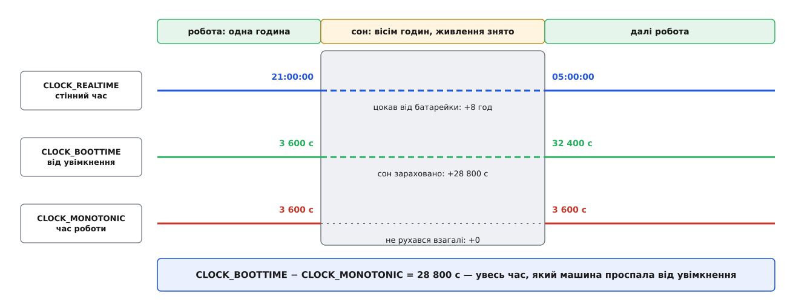

# ⚙️ Демон, що переживає сон: три годинники, будильник і перевірка зв'язку

Програма, яка нічого не знає про призупинення, після пробудження бреше про час і тримається за мертве з'єднання — і робить це мовчки, без жодної помилки. Зберемо на C службу, яка натомість помічає розрив, міряє його з точністю до мілісекунди, вміє прокинутися сама в потрібну мить і не вірить дескрипторові на слово.

## Чому наївний демон зламається тричі

Візьмімо звичайну службу: раз на тридцять секунд опитує датчик, тримає постійне з'єднання з сервером і о третій ночі перевертає журнал. Написана в лоб — цикл із `sleep(30)`, `poll()` на сокеті, порівняння стінного часу з «03:00» — вона працює бездоганно, доки машина не засне.

Ви закриваєте кришку о 21:00 і відкриваєте о 05:00. Ламаються три різні речі, і всі три ростуть з одного кореня.

`sleep(30)`, у який ми ввійшли о 20:59:50, скінчиться о **05:00:20**, а не о 21:00:20. У Linux `nanosleep()` (а `sleep()` — це він) відлічує на монотонному годиннику всупереч POSIX, який приписує реальний. Монотонний годинник під час сну не рухається взагалі — отже, з тридцяти секунд ми «відспали» десять до засинання й доспимо решту двадцять уже вранці. Опитування датчика не запізнилося на вісім годин — воно просто не помітило, що їх не було.

Журнал не перевернувся: третя година ночі настала тоді, коли в системі ніхто не виконувався, а перевірку «чи вже 03:00» ніхто не зробив.

А сокет після пробудження на вигляд цілий: дескриптор дійсний, `poll()` не показує ні помилки, ні кінця потоку. Насправді співрозмовник розірвав з'єднання ще опівночі, бо його таймери йшли своїм ходом.

Спільний корінь — припущення, що час усередині процесу і є час у світі. Полагодити треба саме його.

## Три годинники: різниця, що дорівнює сну

Linux пропонує три відповіді на питання «котра година», і вони поводяться крізь сон по-різному.



*Монотонний стоїть, стінний і завантажувальний ідуть — і саме їхня розбіжність вимірює сон.*

`CLOCK_MONOTONIC` міряє час роботи й не рахує призупинення. `CLOCK_BOOTTIME` — те саме від того самого початку, але **разом із паузами**. `CLOCK_REALTIME` — стінний час, який ядро після пробудження бере з годинника реального часу, що живився від батарейки; він єдиний уміє стрибати і вперед, і назад.

Звідси береться найкорисніший вимірювальний інструмент цієї теми: **різниця `CLOCK_BOOTTIME` і `CLOCK_MONOTONIC` дорівнює всьому часу, який машина проспала від увімкнення**. Величина ніколи не спадає, тож два її заміри дають точну довжину сну між ними — без сигналів, без прав, без опитування ядра.

```c
#define _GNU_SOURCE
#include <stdint.h>
#include <time.h>

static int64_t now_ns(clockid_t clk)
{
    struct timespec ts;
    clock_gettime(clk, &ts);
    return (int64_t)ts.tv_sec * 1000000000LL + ts.tv_nsec;
}

/* Скільки машина проспала від увімкнення. Величина монотонно зростає. */
static int64_t slept_ns(void)
{
    return now_ns(CLOCK_BOOTTIME) - now_ns(CLOCK_MONOTONIC);
}
```

Два читання не є однією неподільною дією, тож різниця має похибку в десятки наносекунд — рівно стільки, скільки триває проміжок між викликами. Ми порівнюємо мілісекунди, тому це нас не турбує. Природа й ціна самих цих годинників — окрема [тема про час у ядрі](root:sys-unix/kernel-timekeeping).

> 🔧 **Навіщо це.** Спокуслива й хибна альтернатива — стежити за `CLOCK_REALTIME` і вважати стрибок ознакою сну. Стінний час стрибає ще й тоді, коли служба синхронізації править його на секунду, і назад теж; відрізнити одне від одного за ним неможливо. Різниця `BOOTTIME − MONOTONIC` росте **тільки** від призупинення й ніколи ні від чого іншого.

## Будильник, який має право підняти машину

Тепер зробимо так, щоб опитування датчика взагалі не залежало від того, спимо ми чи ні. Замість `sleep()` беремо [таймер-дескриптор](root:sys-unix/process-timers) — і тут важливо, який саме годинник йому дати, бо варіанти дають чотири різні поведінки:

- `CLOCK_MONOTONIC` — таймер завмирає разом із монотонним годинником: після пробудження чекатиме залишок періоду;
- `CLOCK_BOOTTIME` — сон зараховано, тож на пробудженні таймер уже прострочений і спрацює одразу, повідомивши кількість пропущених періодів. Але сам розбудити машину він не може;
- `CLOCK_BOOTTIME_ALARM` і `CLOCK_REALTIME_ALARM` — те саме, але такий таймер **піднімає систему** через апаратний годинник реального часу. Саме цим механізмом користуються таймери systemd з `WakeSystem=`.

Будильникові годинники доступні не всім: ядро вимагає можливості `CAP_WAKE_ALARM` — одного з [дрібних складників колишньої всесильности root](root:sys-unix/capabilities). Її відсутність — не привід падати: без права будити лишається чесний `CLOCK_BOOTTIME`.

```c
#include <errno.h>
#include <unistd.h>
#include <sys/timerfd.h>

/* Періодичний таймер, що рахує сон і, якщо дозволено, будить машину. */
static int make_alarm(int64_t period_ns)
{
    int fd = timerfd_create(CLOCK_BOOTTIME_ALARM, TFD_CLOEXEC | TFD_NONBLOCK);
    if (fd < 0 && errno == EPERM)          /* немає CAP_WAKE_ALARM */
        fd = timerfd_create(CLOCK_BOOTTIME, TFD_CLOEXEC | TFD_NONBLOCK);
    if (fd < 0)
        return -1;

    struct timespec p = { .tv_sec  = period_ns / 1000000000LL,
                          .tv_nsec = period_ns % 1000000000LL };
    struct itimerspec its = { .it_value = p, .it_interval = p };
    if (timerfd_settime(fd, 0, &its, NULL) < 0) {
        close(fd);
        return -1;
    }
    return fd;
}
```

## Підписка на «стінний час перестрибнув»

Строк «о третій ночі» прив'язаний до стінного часу, а той міняється не лише сном. Потрібне сповіщення: «зміщення між монотонним і стінним годинниками стало іншим — перерахуй свої строки».

Таке сповіщення в ядрі є, і виглядає воно несподівано. Створюємо таймер на `CLOCK_REALTIME`, ставимо його **абсолютним** строком у далеке майбутнє й додаємо прапорець `TFD_TIMER_CANCEL_ON_SET`. Спрацювання нас не цікавить — цінне те, що станеться раніше: коли стінний час перестрибне, ядро **скасує** цей таймер, дескриптор стане читабельним, а `read()` поверне помилку `ECANCELED`.

Найважливіше тут те, чого не видно з опису прапорця: **пробудження зі сну теж скасовує такий таймер**. Ядро на виході з призупинення повідомляє підсистему таймер-дескрипторів, а та порівнює збережене зміщення «монотонний → стінний» із поточним. Після восьмигодинного сну зміщення виросло на вісім годин — отже, скасування прийде обов'язково. Одна підписка накриває обидва випадки: і правку годинника ззовні, і сон.

```c
#include <time.h>

static int arm_wallwatch(int fd)
{
    /* Абсолютний строк у далекому майбутньому: чекаємо не спрацювання,
       а скасування. Прапорець CANCEL_ON_SET чинний лише разом з ABSTIME
       і лише на CLOCK_REALTIME або CLOCK_REALTIME_ALARM. */
    struct itimerspec its = {
        .it_value = { .tv_sec = time(NULL) + 100LL * 365 * 24 * 3600 }
    };
    return timerfd_settime(fd, TFD_TIMER_ABSTIME | TFD_TIMER_CANCEL_ON_SET,
                           &its, NULL);
}

static int make_wallwatch(void)
{
    int fd = timerfd_create(CLOCK_REALTIME, TFD_CLOEXEC | TFD_NONBLOCK);
    if (fd < 0)
        return -1;
    if (arm_wallwatch(fd) < 0) {
        close(fd);
        return -1;
    }
    return fd;
}
```

Обидва дескриптори лягають в один набір [epoll](root:sys-unix/select-poll-epoll) поруч із робочим сокетом, і цикл стає таким:

```c
for (;;) {
    struct epoll_event ev[8];
    int n = epoll_wait(ep, ev, 8, timeout_ms());
    if (n < 0 && errno == EINTR)
        continue;

    /* Перше після будь-якого повернення з очікування: чи ми спали? */
    int64_t now_slept = slept_ns();
    int64_t gap_ms = (now_slept - last_slept) / 1000000;
    last_slept = now_slept;
    if (gap_ms > 1000)
        probe_link(link);              /* сокет під підозрою */

    for (int i = 0; i < n; i++) {
        uint64_t ticks;
        int fd = ev[i].data.fd;

        if (fd == alarm_fd) {
            if (read(fd, &ticks, sizeof ticks) == (ssize_t)sizeof ticks)
                poll_sensor(ticks);    /* ticks > 1 — періоди пропущено */
        } else if (fd == wall_fd) {
            if (read(fd, &ticks, sizeof ticks) < 0 && errno == ECANCELED) {
                reschedule_wallclock_jobs();
                arm_wallwatch(fd);     /* поновлюємо підписку */
            }
        } else if (fd == link) {
            serve_link(fd);
        }
    }
}
```

Щойно ми вичитали `ECANCELED`, ядро запам'ятовує нове зміщення й підписка живе далі сама — повторне `timerfd_settime` тут лише дешева перестраховка.

## Сокет, що на вигляд живий

Тепер найпідступніше. Дескриптор з'єднання після сну дійсний, бо він — об'єкт ядра, а ядро цілком пережило ніч. Про смерть з'єднання ядро дізнається лише від співрозмовника, а той або надіслав розрив, коли нас не було (і пакет пропав), або досі чемно чекає.

І чекання не рятує. Час очікування `epoll_wait`, `poll` та `SO_RCVTIMEO` ядро відлічує на монотонному годиннику — тому вісім годин сну **не з'їдають** п'ятисекундного строку: після пробудження очікування спокійно доходить залишок і повертає нуль подій, як і мало б.

Чесних важелів рівно два, і другий обов'язковий.

Перший — `TCP_USER_TIMEOUT`: скільки мілісекунд ядро терпить непідтверджені надіслані дані, перш ніж закрити з'єднання з `ETIMEDOUT`. Він працює лише тоді, коли в польоті щось є. Обіцянка `SO_KEEPALIVE` тут майже марна: типове `TCP_KEEPIDLE` — дві години простою до першої проби, і чекати їх після кожного пробудження безглуздо. Ці важелі й межі кожного з них — окрема тема про [виявлення мертвого з'єднання](root:sys-unix/tcp-connection-liveness).

Другий — не вірити й спитати самому. Помітивши сон, надсилаємо прикладний запит і **ставимо власний строк на відповідь**. Успішний `write()` нічого не доводить: байти лягли у буфер відправлення, і тільки відповідь є доказом. Строк ведемо на `CLOCK_BOOTTIME`, щоб повторний сон не подовжив його мовчки.

```c
#include <netinet/in.h>
#include <netinet/tcp.h>
#include <sys/socket.h>

static int64_t answer_due_ns;          /* 0 — запиту в польоті немає */

static void set_link_deadline(int fd, unsigned ms)
{
    setsockopt(fd, IPPROTO_TCP, TCP_USER_TIMEOUT, &ms, sizeof ms);
}

static void probe_link(int fd)
{
    static const char ping[] = "PING\n";
    ssize_t k = write(fd, ping, sizeof ping - 1);
    if (k < 0 && errno != EAGAIN) {
        reconnect();                   /* тут смерть уже очевидна */
        return;
    }
    /* Байти щонайбільше лягли у власний буфер відправлення —
       чекаємо не на них, а на відповідь. */
    answer_due_ns = now_ns(CLOCK_BOOTTIME) + 5LL * 1000000000LL;
}
```

Строк перевіряють на кожному оберті циклу поряд із рештою: минув, а відповіді немає — з'єднання перепідключають. Дескриптор сокета сам ніколи про це не скаже; [сокет — це дескриптор](root:sys-unix/socket-as-descriptor), а не зобов'язання, що на тому кінці хтось живий. Разом із з'єднанням після довгого сну протухає й усе інше, що спиралося на зовнішній світ: токени доступу, оренда мережевої адреси, кеш розв'язаних імен.

## Присипляння без гонки

Якщо ваша програма не просто переживає сон, а сама вирішує, коли спати, з'являється тонка гонка: подія пробудження може статися між рішенням «пора спати» і самим засинанням — і буде проковтнута.

Ядро дає на це файл `/sys/power/wakeup_count` із лічильником зареєстрованих подій. Правило просте: **прочитай число, ухвали рішення, запиши це саме число назад**. Запис удасться лише тоді, коли лічильник не змінився; після вдалого запису ядро скасує засинання, щойно надійде хоч одна нова подія.

```c
#include <fcntl.h>
#include <string.h>

/* 0 — поспали й прокинулися; 1 — подія завадила; -1 — помилка. */
static int suspend_if_idle(void)
{
    char buf[32];
    int fd, n;

    /* Читання блокується, поки ядро дообробляє події, що вже в польоті. */
    fd = open("/sys/power/wakeup_count", O_RDONLY | O_CLOEXEC);
    if (fd < 0) return -1;
    n = read(fd, buf, sizeof buf - 1);
    close(fd);
    if (n <= 0) return -1;
    buf[n] = '\0';

    /* ... тут ухвалюємо рішення: чи справді нам немає чого робити ... */

    fd = open("/sys/power/wakeup_count", O_WRONLY | O_CLOEXEC);
    if (fd < 0) return -1;
    n = write(fd, buf, strlen(buf));
    close(fd);
    if (n < 0)
        return errno == EINVAL ? 1 : -1;

    fd = open("/sys/power/state", O_WRONLY | O_CLOEXEC);
    if (fd < 0) return -1;
    n = write(fd, "mem", 3);           /* повернеться вже після пробудження */
    close(fd);
    return n < 0 ? -1 : 0;
}
```

Зверніть увагу на код помилки: невдалий запис лічильника дає **`EINVAL`**, а не `EBUSY`, як часто пишуть. `EBUSY` тут означає зовсім інше — що ввімкнено автосон через `/sys/power/autosleep`. І ще одне: запис у `/sys/power/state` доступний лише з правами root і йде повз усі верхні шари, тож на робочій станції присиплянням має керувати [служба сеансів](root:sys-unix/logind-sessions-seats). Ця послідовність цінна тим, що показує, **що саме** робить під капотом вона сама.

## Ціна й пастки

Уся конструкція коштує два зайві дескриптори й одне віднімання на оберт циклу — тобто нічого. Складність зосереджена не в коді, а в переліку хибних припущень, від яких він захищає:

- **`sleep()` і `nanosleep()` завмирають** на час сну — вони на монотонному годиннику. Періодичність тримають таймери на `CLOCK_BOOTTIME`, не паузи;
- **строки очікування на сокетах теж не рахують сон** — той самий монотонний годинник. Восьмигодинна ніч не вичерпає п'ятисекундного строку;
- **`CLOCK_BOOTTIME` без `_ALARM` не будить машину.** Якщо роботу треба зробити о третій ночі, а не «коли-небудь після пробудження», потрібен будильниковий годинник і `CAP_WAKE_ALARM`;
- **`TFD_TIMER_CANCEL_ON_SET` чинний лише разом з `TFD_TIMER_ABSTIME`** і лише на `CLOCK_REALTIME` чи `CLOCK_REALTIME_ALARM`. На монотонному чи завантажувальному годиннику прапорець просто не має сенсу;
- **`read()` з таймер-дескриптора після скасування повертає `-1`**, а не вісім байтів. Код, який перевіряє лише `== sizeof(uint64_t)`, тихо з'їсть подію разом із `ECANCELED`;
- **кількість спрацювань із `read()` буває більшою за одиницю.** Що з нею робити — надолужувати чи зарахувати як пропущене — залежить від задачі: телеметрії потрібне свіже значення, лічильникові спожитого — кожен пропущений період.

Головне ж правило одне: після сну **все, що описує зовнішній світ, вважається застарілим, доки не перевірене**. Ядро чесно відновлює власний стан — але воно не має жодного способу відновити те, що за цей час устиг подумати співрозмовник.
