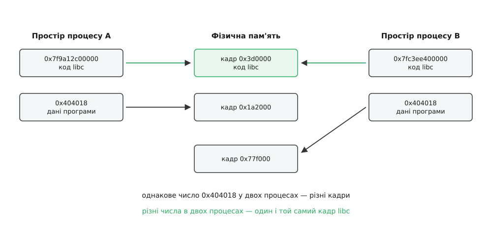
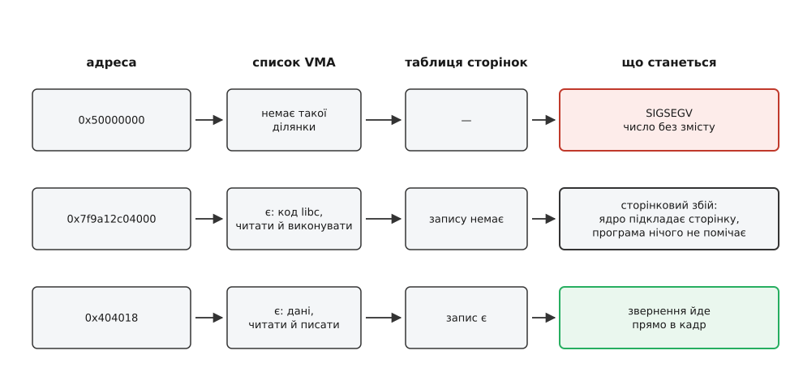
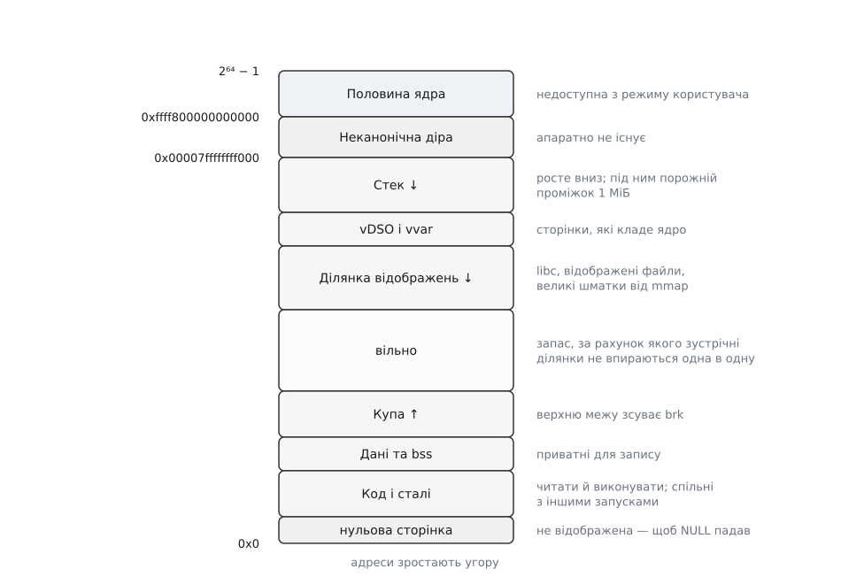

# Віртуальний адресний простір процесу

<preknowlist>
- [Ядро й простір користувача](root:sys-unix/kernel-and-userspace) — програма не порядкує залізом сама: усім, що стосується спільних ресурсів, керує ядро, а програма лише просить.
- [Процес](root:sys-unix/process-model) — що саме ядро тримає про один запуск програми, щоб той запуск можна було спинити й продовжити.
- [Віртуальна пам'ять](root:hw-arch/virtual-memory) — сама ідея, що адреса в програмі перекладається в адресу в мікросхемі.
- [Блок керування пам'яттю (MMU)](root:hw-arch/mmu) — апаратний вузол, який виконує цей переклад на кожному зверненні до пам'яті.
- [Системний виклик](root:sys-unix/syscall-mechanics) — як програма переходить у режим ядра з проханням і повертається назад.
</preknowlist>

## Двоє з однаковою адресою

Ось програма, коротша нікуди:

:::tabs
```c
#include <stdio.h>

int counter = 7;

int main(void) {
    printf("%p = %d\n", (void *)&counter, counter);
    getchar();          /* тримаємо процес живим */
    return 0;
}
```
```cpp
#include <iostream>

int counter = 7;

int main() {
    std::cout << static_cast<void*>(&counter) << " = " << counter << '\n';
    std::cin.get();     /* тримаємо процес живим */
    return 0;
}
```
:::

Зберіть її і запустіть двічі — у двох терміналах, паралельно. Щоб числа не стрибали, вимкніть на час досліду рандомізацію: `setarch -R ./a.out`. Обидва запуски надрукують **той самий покажчик**, скажімо `0x404018 = 7`.

Тепер приєднайтеся зневаджувачем до першого процесу й запишіть у `counter` число 99. Другий процес про це не дізнається ніколи: у ньому за адресою `0x404018` як лежала сімка, так і лежить.

Число одне — комірки різні. Виснувати з цього можна тільки одне: **число, яке інструкція називає адресою, не є номером комірки в мікросхемі пам'яті**. Це число з якогось іншого рахунку, і хтось між процесором і мікросхемою перекладає його на справжній номер — по-різному для першого процесу й для другого.

Питання, з якого починається все цікаве: навіщо взагалі знадобився цей переклад? Що такого нестерпного в чесних адресах, що заради брехні поставили окремий апаратний вузол і повісили на ядро цілу бухгалтерію?

## Чому чесні адреси нестерпні

Уявімо машину без жодного перекладу: число в інструкції їде на шину як є. Одна фізична пам'ять, у ній кілька програм. Пройдімося по тому, що з цього виходить — не переліком, а ланцюжком, бо всі біди тут виростають з одного кореня.

**Програму доводиться прив'язувати до місця ще до запуску.** Компонувальник (лінкер), збираючи виконуваний файл, мусить десь записати, за якою адресою лежить `counter`. Якщо адреса справжня, то він мусить знати наперед, у яку ділянку фізичної пам'яті програму завантажать. А цього ніхто не знає: залежить від того, що вже виконується. Лишається один вихід — залишити в файлі список усіх місць, де згадано адресу, і на кожному завантаженні проходити цим списком і виправляти числа. Це називається переміщенням (англ. *relocation*), і воно коштує часу на кожному запуску.

**Другий запуск тієї самої програми не може скористатися першим.** Дві копії `grep` виконують ті самі байти інструкцій. Хотілося б тримати ці байти в пам'яті **один раз**. Але після переміщення байти вже не ті самі: у копії, завантаженій за іншою адресою, всередині інструкцій стоять інші числа. Спільний код неможливий — рівно тому, що адреси чесні.

**Ніщо не боронить чужу пам'ять.** Помилка в покажчику — і програма пише в дані сусідки або в таблиці ядра. Щоб цього не сталося, хтось мусив би перевіряти **кожне** звернення на належність дозволеній ділянці. Апаратно так робили: пара регістрів «база й межа» задавала процесові одну суцільну ділянку. Але одна суцільна ділянка — це наступна біда.

**Пам'ять доводиться давати суцільними шматками, і вона кришиться.** Три програми зайняли по 100 МіБ, ще 100 МіБ лишалося вільними в хвості; середня програма завершилася — і тепер маємо 100 МіБ вільних посередині плюс ті 100 у хвості. Наступній програмі треба 150 МіБ: вільного 200, а суцільного — тільки 100. Пам'ять є, і водночас її немає: це зовнішня фрагментація. Так само нікуди не росте купа: за верхньою межею ділянки вже стоїть чужа.

**Програма не може бути більшою за встановлену пам'ять.** Не влізло — не запуститься, хоч би скільки з тих даних насправді знадобилося.

Усі п'ять бід — наслідок однієї-єдиної тотожності: **адреса = місце**. Поки число в інструкції означає фізичне місце, програма прив'язана до цього місця, ділити його ні з ким не може, вийти за нього — теж, а сама пам'ять лишається неподільним суцільним ресурсом.

Отже, розв'язок мусить розірвати саме цю тотожність. І він відомий з початку 1960-х: між тим, що називає інструкція, і тим, що лежить на шині, ставлять таблицю. Історія цього винаходу — машина Atlas у Манчестері, «однорівнева пам'ять» Кілбурна, і майже двадцять років, поки ця ідея дійшла до Unix — [окремою розповіддю](root:sf-os/virtual-address-space/hist-one-level-store.md).

## Одна вставка між інструкцією й шиною

Механізм у своїй суті простий до непристойності. Кожне звернення до пам'яті процесор проганяє через таблицю: число з інструкції він розбирає на дві частини — **номер сторінки** й **зсув усередині сторінки**, — за номером сторінки шукає в таблиці запис і бере звідти номер фізичної сторінки (кадру). Зсув переїжджає без змін. Пошуком займається апаратний вузол — [MMU](root:hw-arch/mmu); таблицю веде ядро й на кожен процес свою.

Чому сторінками, а не побайтово, видно з арифметики. Якби таблиця мала запис на кожен байт, вона була б більшою за саму пам'ять, яку описує. Тому переклад роблять із крупністю сторінки — на x86-64 це 4 КіБ, — і всі 4096 байтів однієї сторінки їдуть в одне місце разом. Як саме влаштована сама таблиця (а вона багаторівнева, і не випадково) — [окрема тема](root:sf-os/paging-and-mmu); тут важить не її будова, а сам факт її існування.

**Скільки коштувала б плоска таблиця.** На x86-64 користувацька половина простору — 47 біт адреси. Порахуймо, скільки записів довелося б тримати, якби таблиця була простим масивом:

```
розмір простору      = 2⁴⁷ байтів      = 128 ТіБ
сторінка             = 4 КіБ           = 2¹² байтів
записів у таблиці    = 2⁴⁷ / 2¹²       = 2³⁵ ≈ 34.4 млрд
запис                = 8 байтів
таблиця              = 2³⁵ · 8         = 2³⁸ байтів = 256 ГіБ
```

Двісті п'ятдесят шість гігабайтів таблиці на кожен процес — включно з `echo`. Саме тому таблиця багаторівнева: гілки, що описують невживані ділянки, просто не існують, і реальна таблиця маленької програми важить кілька десятків кілобайтів.

Тепер повернімося до головного. Оскільки таблиця своя в кожного процесу, число `0x404018` перестало означати місце. Воно означає **запис у таблиці цього процесу** — і рівно стільки. Набір усіх чисел, які процес може назвати, разом із таблицею, що надає їм змісту, і є його **віртуальний адресний простір** (лат. *virtualis* — можливий, той, що виявляє себе в дії).

Слово «віртуальний» тут не про «несправжній»: звернення за такою адресою цілком справжнє і закінчується справжньою коміркою. Воно про те, що адреса діє **тільки в межах свого простору** — як номер квартири діє тільки в межах свого будинку.



*Та сама віртуальна адреса в двох процесах веде в різні кадри — це ізоляція. Різні віртуальні адреси в двох процесах можуть вести в один кадр — це спільна пам'ять. Обидва явища дає одна й та сама таблиця.*

## Що з цього виходить одразу

П'ять бід чесних адрес зникають не по черзі, а всі разом — бо зник їхній спільний корінь. Варто пройтися по кожній і побачити механізм, а не просто результат.

**Ізоляція виходить сама, без жодної перевірки.** Ядру не треба стежити за покажчиками процесу. Якщо в таблиці процесу немає запису для сторінки, у якій лежать чужі дані, то чужі дані для нього просто **не мають імені**: жодне 64-бітове число не веде до них. Це сильніше за заборону. Заборонене можна спробувати порушити; те, чого не можна назвати, не можна навіть спробувати.

**Адреси стають сталими, і переміщення зникає.** Компонувальник кладе `counter` за адресою `0x404018` — і в кожному запуску ця адреса вільна, бо простір у кожного свій. Файл завантажується без правок. (Сучасні системи навмисне ламають цю сталість і розкидають ділянки випадково — але це вже свідомий захист, а не необхідність: [рандомізація адресного простору](root:sys-unix/address-space-randomization).)

**Суцільність з'являється там, де її фізично немає.** Ділянка віртуальних адрес на 8 МіБ може складатися з двох тисяч кадрів, розкиданих по всій пам'яті: сусідні номери сторінок у таблиці нічим не зобов'язані бути сусідніми кадрами. Зовнішня фрагментація зникає як явище — вільні кадри однакові й взаємозамінні. І купа тепер має куди рости: досить додати записи в таблицю.

**Запис у таблиці може вказувати не в пам'ять.** Ось найплідніший наслідок. Раз звернення все одно проходить через запис, цей запис може бути й **порожнім** — а звернення до нього спричиняє переривання, яке обробляє ядро. Тобто ядро дістає гачок, за який чіпляється буквально все інше: [сторінковий збій](root:sf-os/page-fault) дає змогу віддавати пам'ять ліниво (лише коли до неї справді торкнулися), тримати за адресами вміст файлу ([mmap](root:sys-unix/mmap-model)), витісняти сторінки на диск і повертати назад ([свопінг](root:sys-unix/swap-and-reclaim)).

**Один кадр може лежати в двох таблицях.** Код `libc` фізично лежить у пам'яті один раз, а відображений у сотні процесів. Те саме дає спільну пам'ять між процесами й [копіювання при записі](root:sf-os/copy-on-write), на якому тримається дешевий `fork`.

> 🔧 **Навіщо це.** Коли служба на сервері «займає 300 МіБ», а таких служб двадцять, і разом вони чомусь займають не 6 ГіБ, а два — це не помилка вимірювання. Спільні сторінки бібліотек порахувалися двадцять разів у стовпчику RSS і один раз у пам'яті. Щоб рахувати чесно, дивляться на PSS, де спільний кадр ділиться між усіма, хто його відобразив ([як міряти пам'ять процесу](root:sys-unix/memory-accounting)).

## Простір — це не пам'ять, а набір обіцянок

Звідси випливає річ, на якій найчастіше спотикаються: **розмір адресного простору й розмір спожитої пам'яті — величини різної природи**.

Простір — це діапазони чисел, яким ядро погодилося надати змісту. Пам'ять — кадри, які під цими числами вже лежать. Перше може бути велетенським при мізерному другому.

Ось звичайна для баз даних картина:

```
процес відобразив файл на 40 ГіБ:   mmap(NULL, 40 ГіБ, PROT_READ, MAP_SHARED, fd, 0)
VSZ (розмір простору)             = 40 ГіБ + решта ділянок
торкнувся під час запиту          = 900 сторінок × 4 КіБ = 3.5 МіБ
RSS (кадрів у пам'яті)            ≈ 3.5 МіБ + код і стек
```

Процес із `VSZ` 40 ГіБ на машині з 8 ГіБ пам'яті — це не аварія, а норма. Він **назвав** сорок гігабайтів, а взяв три мегабайти. Так само поводиться будь-який потік: типова резервація стека — 8 МіБ простору, з яких реально задіяно кілька кілобайтів.

Отже, коли ядро віддає пам'ять, воно віддає не пам'ять, а **обіцянку**: «за цими числами буде щось осмислене, коли ти туди звернешся». Обіцянок можна роздати більше, ніж є пам'яті, — і Linux свідомо так робить, бо переважна більшість обіцянок ніколи не буде витребувана. Що станеться, коли витребують усі одразу, — окрема, доволі драматична історія: [overcommit і OOM-killer](root:sys-unix/overcommit-and-oom).

## Дві картини одного простору

Тепер найважливіше для розуміння всього подальшого. Адресний простір процесу існує в ядрі **у двох різних поданнях одночасно**, і вони описують різні речі.

Перше подання — **список ділянок**. Ядро тримає для процесу структуру `mm_struct`, а в ній — набір `vm_area_struct`, які скорочено звуть VMA (англ. *virtual memory area*). Одна VMA — це один суцільний діапазон віртуальних адрес з однаковими властивостями:

```
початок і кінець    0x7f2a1c000000 – 0x7f2a1c1f4000
права               читання, виконання, приватна
чим підперта        файл /usr/lib/libc.so.6, зсув 0x28000
```

Список VMA — це **те, що процесові обіцяно**. Він компактний: десяток-другий записів на просту програму, кілька сотень на браузер. Сусідні ділянки з однаковими властивостями ядро зливає в одну.

Друге подання — **таблиця сторінок**, з якою працює MMU. Це **те, що вже втілено**: записи існують лише для тих сторінок, до яких процес уже звертався і які ядро вже підклало.

Ключове співвідношення: **таблиця сторінок є похідною від списку VMA**, а не навпаки. Список — джерело правди, таблиця — його матеріалізована частина. Тому таблицю можна безкарно частково викидати: сторінку витіснили на диск, запис прибрали — обіцянка лишилася чинною, і ядро виконає її наступного разу.

З двох подань виходить, що доля адреси вирішується аж у мить звернення — і варіантів там кілька:



*Список VMA — обіцяне; таблиця сторінок — уже втілене. Куди звернення потрапить у цій парі, вирішує, чи побачить програма помилку.*

1. **Адреса не належить жодній VMA.** Ядро не має чим наповнити запис: воно навіть не знає, що мало б там лежати. Процес дістає `SIGSEGV`. Саме це ховається за словами «segmentation fault»: не «зайшов у чужу пам'ять», а «назвав число, якому в цьому просторі не надано змісту».
2. **Адреса належить VMA, але запису в таблиці немає.** MMU здіймає збій, ядро дивиться у VMA, бачить, чим ділянку підперто, знаходить чи читає потрібну сторінку, дописує запис і повертає керування на ту саму інструкцію. Програма про це не дізнається — вона побачить лише те, що інструкція виконалася трохи довше.
3. **Запис є, але прав бракує.** Тут доля залежить від того, що каже VMA. Якщо VMA дозволяє запис, а сторінка позначена «тільки читати» через копіювання при записі, ядро зробить копію й дозволить писати. Якщо ж і VMA каже «тільки читати» — це справжнє порушення, і буде `SIGSEGV`.

Ця розбіжність між обіцяним і втіленим — не деталь реалізації, а те, з чого зроблено весь механізм. Ліниве виділення, відображення файлів, свопінг, копіювання при записі — це чотири різні відповіді на одне питання: «що робити, коли адреса у VMA є, а сторінки під нею немає».

Подивитися на список VMA живого процесу можна просто оком: ядро друкує його у файлі `/proc/<pid>/maps` ([/proc: процеси як файли](root:sys-unix/proc-reading-process-and-kernel-state)). Рядок на VMA, з адресами, правами й підпіркою; сусідній `smaps` додає до кожної ділянки скільки в ній насправді сторінок, скільки з них спільних і скільки брудних — [формат цих файлів по полях](root:sf-os/virtual-address-space/api-maps-format.md).

## Як виглядає простір у Linux на x86-64

Числа тут не самоцінні, але без них картина лишається абстрактною.

Апаратура x86-64 при чотирирівневій таблиці перекладає 48 біт адреси. Решта старших бітів мусить бути копією 47-го — такі адреси звуть канонічними; усе між ними апаратно не існує, і в 64-бітовому просторі зяє величезна діра. Ядро користається цією дірою як природним кордоном: нижня половина (від нуля до `0x00007ffffffff000`, себто 128 ТіБ) — простір користувача, верхня (від `0xffff800000000000`) — простір ядра.

Нові процесори вміють п'ятирівневу таблицю (ознака `la57` у `/proc/cpuinfo`) і перекладають 57 біт, що дає 128 ПіБ разом. Linux, однак, **не роздає адрес понад 47 біт за замовчуванням**: надто багато старого коду ховає теги у верхніх бітах покажчика. Хочеш вище — попроси явно, передавши в `mmap` підказку-адресу з великих чисел.

Усередині користувацької половини звична розкладка така:



*Купа й ділянка відображень ростуть назустріч одна одній, і величезний вільний проміжок між ними — не марнотратство, а запас, за рахунок якого жодна з них не впирається в іншу.*

- **Сегменти виконуваного файлу** — код, сталі, ініціалізовані дані, неініціалізовані дані. Їх кладе ядро за приписом із заголовків [ELF](root:sys-unix/elf-structure); код відображається з файлу як «читати й виконувати», дані — як приватні для запису.
- **Купа** — ділянка одразу за даними, верхню межу якої зсуває виклик `brk`. Сьогодні великі запити алокатор бере не тут, а окремими `mmap` ([звідки алокатор бере пам'ять](root:sys-unix/allocator-and-kernel)).
- **Ділянка відображень** — сюди лягають спільні бібліотеки, відображені файли й великі анонімні шматки. Росте вниз, від високих адрес.
- **Стек** — на самому верху користувацької половини, росте вниз. Він розширюється автоматично: звернення трохи нижче поточної межі ядро тлумачить як «стекові треба ще» і посуває VMA. Щоб стек, розростаючись, не наскочив на чуже відображення, ядро тримає під ним порожній проміжок — типово 256 сторінок (1 МіБ). Цей проміжок збільшили в 2017 році після атаки Stack Clash, яка показала, що однієї сторінки замало: великий кадр стека міг перестрибнути через неї.
- **vDSO і vvar** — сторінки, які ядро відображає в кожен процес, щоб частину викликів (як `gettimeofday`) можна було виконати без переходу в ядро ([vDSO](root:sys-unix/vdso)).

Половина ядра присутня в таблиці **кожного** процесу, і на це є вагома причина: коли програма робить системний виклик, процесор перемикає режим, але **не перемикає таблицю сторінок**. Якби код ядра лежав в окремому просторі, кожен виклик коштував би зміни кореня таблиці й скидання кешу перекладів — тобто був би на порядок дорожчим. Записи ядерної половини позначені як недоступні з режиму користувача, тож апаратура сама відсікає спроби туди зазирнути.

Ця економія протрималася до 2018 року. Вразливість Meltdown показала, що спекулятивне виконання встигає прочитати ядерну сторінку до перевірки прав і лишити слід у кеші — тобто вміст ядра можна відновити побічним каналом, не маючи жодного права на нього. Відповіддю став саме той дорогий варіант, якого уникали: дві окремі таблиці на процес, з мінімальним «вікном» ядерного коду в користувацькій ([ізоляція таблиць сторінок ядра](root:sys-unix/kernel-page-table-isolation)).

## Що процес може робити зі своїм простором

Важлива дрібниця, яку легко проґавити: програма **ніколи не чіпає таблицю сторінок**. Записи в ній — власність ядра, і жодного способу їх редагувати з простору користувача немає. Програма редагує **список VMA**, і робить це трьома системними викликами.

`mmap` додає VMA: «дай мені діапазон адрес отакого розміру, з такими правами, підпертий оцим файлом (або нічим)». Повертає початкову адресу. `munmap` викидає діапазон зі списку — і разом з ним усі відповідні записи таблиці. `mprotect` змінює права наявного діапазону, розрізаючи VMA на частини, якщо діапазон захопив її середину. Ці виклики й усе, що з них виростає, докладно розібрано в [темі про mmap](root:sys-unix/mmap-model).

Окремо стоїть `madvise` — здебільшого не наказ, а порада ядру: «цю ділянку читатиму послідовно», «ця більше не потрібна, можеш забрати сторінки». Такі поради ядро вільне послухатися або ні, і на семантику програми це не впливає. Виняток, про який варто знати одразу, — `MADV_DONTNEED`: його ядро виконує неухильно, і разом зі сторінками зникає їхній вміст, тож наступне читання з приватної анонімної ділянки поверне нулі. Обіцянка лишається цілою, дані — ні.

Права на ділянку — читання, запис, виконання — задаються окремо, і апаратура їх дотримує. Звідси правило, яке нині виконують усі: жодна ділянка не повинна бути водночас записуваною й виконуваною. Порушник, що зумів записати свої байти в дані, не зможе передати на них керування, бо сторінки даних не виконувані. Апаратна підтримка цього (біт заборони виконання) з'явилася в x86-64 із самого початку — до того на 32-бітових x86 «право читати» означало й «право виконувати», і цим користувалися всі переповнення буфера того часу.

> 🔧 **Навіщо це.** Коли JIT-компілятор породжує машинний код у пам'яті, він не може писати й виконувати в одну сторінку. Порядок дій завжди такий: відобразити ділянку як записувану, згенерувати код, викликати `mprotect` на «читати й виконувати», і лише тоді стрибати туди. Пропущений `mprotect` дає `SIGSEGV` на першому ж стрибку — і це та помилка, яка виглядає як «збій у згенерованому коді», хоча код цілком справний.

Побачити всі три подання власного простору й помацати межу між ними можна невеликою програмою — вона резервує гігабайт, дивиться, як зростає RSS у міру торкання сторінок, і ловить `SIGSEGV` з адресою, яка його спричинила: [прогулянка власним адресним простором](root:sf-os/virtual-address-space/proj-address-space-probe.md).

## Простір як частина особистості процесу

Оскільки адресний простір — окрема структура в ядрі, а задача лише посилається на неї, з нього виходять три різні поведінки, які інакше довелося б заучувати нарізно.

**`fork` дає дитині власний простір, копіюючи список VMA, а не пам'ять.** Обидва процеси спершу вказують на ті самі кадри, позначені «тільки читати»; перший запис у сторінку спричиняє збій, і ядро робить копію саме тієї сторінки. Тому породження процесу коштує дешево незалежно від того, скільки пам'яті займає батько ([fork](root:sys-unix/fork-semantics), [копіювання при записі](root:sf-os/copy-on-write)).

**`exec` не змінює процес — він викидає простір і будує новий.** PID, дескриптори й ідентичність лишаються ті самі, а весь зміст адрес заміняється на приписаний новим ELF-файлом. Ось чому після `exec` не «губляться» змінні: губитися нема чому, простір інший ([exec](root:sys-unix/exec-semantics)).

**Потоки одного процесу вказують на один і той самий `mm_struct`.** Саме це, а не якась окрема «спільність пам'яті», робить їх потоками: вони буквально користуються однією таблицею, тож покажчик, обчислений в одному, чинний в іншому ([потоки як задачі](root:sys-unix/threads-as-tasks)).

І звідси ж — чому пам'ять повертається системі після завершення. Простір живе, доки на нього хтось посилається. Помирає остання задача — гине `mm_struct`, а з ним ідуть у вільний список усі кадри, які були під ним. Це не ввічливість програми й не робота збирача сміття, а звичайний підрахунок посилань у ядрі: програма, яка «забула звільнити пам'ять», при завершенні все одно нічого не лишає по собі.

## Ціна брехні

Переклад не безкоштовний, і чесно назвати його ціну варто.

Кожне звернення до пам'яті — це насправді кілька звернень: спершу по записах таблиці, потім по даних. При чотирирівневій таблиці прохід коштує до чотирьох додаткових читань з пам'яті на одне корисне. Так було б, якби переклади не кешували — але їх кешують: невеликий асоціативний кеш усередині процесора тримає останні пари «сторінка → кадр» ([TLB](root:hw-arch/tlb)). Влучення в цей кеш робить переклад безкоштовним, і саме тому вся конструкція взагалі життєздатна.

Звідси випливає неочевидний наслідок для швидкодії: **обсяг гарячих даних важить менше, ніж кількість різних сторінок, по яких вони розкидані**. Обхід, що б'є по мільйону випадкових сторінок, промахується повз кеш перекладів на кожному кроці, хоч би скільки даних читав. Радикальний засіб проти цього — збільшити сторінку, щоб той самий кеш накривав більше пам'яті ([великі сторінки](root:sys-unix/huge-pages-tlb-reach)).

Друга стаття витрат — [перемикання контексту](root:sf-os/context-switch). Перехід на процес з іншим простором означає зміну кореня таблиці, а колись означав і повне скидання кешу перекладів. Сучасні процесори мітять записи ідентифікатором простору (на x86 це PCID), тож чужі переклади не викидаються й після повернення ще чинні.

Ці витрати — плата за все перелічене вище, і вони давно окупилися: без них не існувало б ні спільних бібліотек, ні дешевого `fork`, ні відображення файлів, ні контейнерів.

## Що насправді означає адреса

Найкоротше означення виходить таке: адресний простір — це **простір імен**, який ядро заводить процесові, а адреса — ім'я в цьому просторі, а не місце.

Різниця не термінологічна. Місце або є, або немає, і його властивості задані заздалегідь. Ім'я ж — це питання, на яке хтось відповідає **в момент звернення**, і відповідь може бути якою завгодно: кадр у пам'яті, шматок файлу на диску, сторінка, спільна з десятком інших процесів, копія, зроблена щойно на цьому самому зверненні, або відмова. Один механізм, різні відповіді.

Тому все, що звучить як окремі можливості системи — ліниве виділення, `mmap`, свопінг, копіювання при записі, спільна пам'ять, overcommit, ізоляція, контейнери — не додано до адресного простору збоку. Це просто перелік того, що ядро може відповісти, коли процес назве число.
