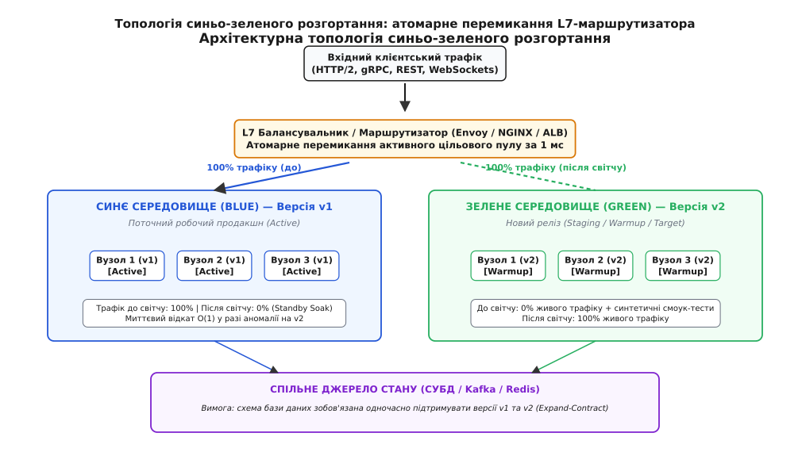
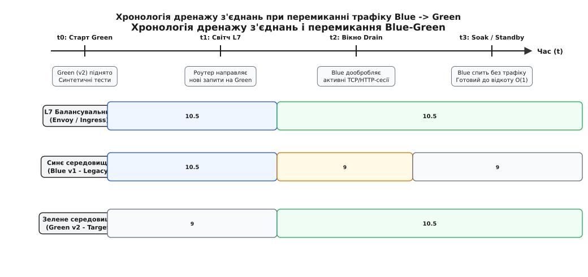
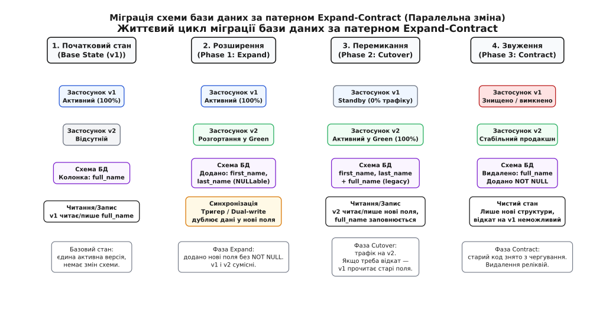
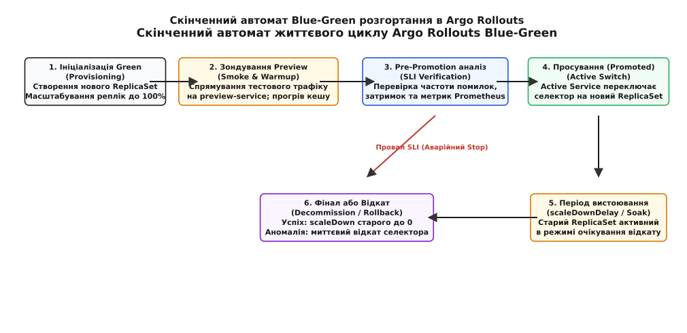

# Синьо-зелене розгортання: ізольовані середовища, миттєве перемикання трафіку та стратегії сумісності стану

<preknowlist>
- [Тактики експлуатованості й розгортуваності](topic:sf-apps/operability-tactics) — якісні атрибути, що визначають легкість доставки змін і спостереження за живою системою.
- [Штатне вимкнення і drain](topic:sf-release/graceful-shutdown) — коректне завершення активних з'єднань і виведення вузлів з пулу балансування без втрати запитів.
- [Стратегії деплою](topic:sf-release/deployment-strategies) — огляд спектра стратегій відтворення, канарок та почергового оновлення.
- [Метрики](topic:sf-release/metrics-monitoring) — числовий збір показників частоти помилок, затримок і насиченості в режимі реального часу.
- [Прапорці функцій](topic:sf-release/feature-flags) — відокремлення фізичного розгортання артефакту від активації бізнес-логіки.
</preknowlist>

Банківський платіжний шлюз обробляє потік у 45 000 транзакцій на секунду під час пікових вечірніх розрахунків. Інженерна команда ініціює почергове оновлення (rolling update) кластера з сорока вузлів для переходу на нову версію сервісу білінгу. Під час поступової заміни перших десяти серверів у системі одночасно опиняються процеси старої (v1) та нової (v2) версій. Виявляється, що новий реліз містить змінену структуру внутрішнього бінарного повідомлення gRPC: старі вузли v1, отримуючи запити від оновлених вузлів v2, не можуть десеріалізувати нові поля заголовків і аварійно переривають транзакції з кодом `InternalServerError`.

За перші двадцять секунд понад 2 800 клієнтських платежів зазнають збою: гроші списуються з рахунку відправника, але не зараховуються отримувачу через розрив розподіленої транзакції. Коли інженери запускають процедуру відкату, вона також виконується почергово і триває дванадцять хвилин, протягом яких система продовжує генерувати каскадні помилки. Після інциденту з'ясовується, що нова версія встигла частково оновити спільну базу даних, через що відновлені старі процеси більше не можуть коректно зчитувати записи користувачів.

Ця аварія демонструє головну вразливість стратегій поступового оновлення: одночасна присутність двох різних версій коду у спільному середовищі створює непередбачувані стани несумісності, а час відкату виявляється неприпустимо довгим. Щоб усунути стан змішаних версій і забезпечити миттєве повернення до стабільного стану в разі виявлення прихованих дефектів, застосовують архітектурний підхід із повним дублюванням продакшн-контурів.

## Сутність механізму: ізоляція, прогрів та атомарний світч

Замість заміни процесів усередині єдиного працюючого пулу створюються два абсолютно незалежні, проте ідентичні за конфігурацією та потужністю виробничі середовища, які умовно позначають кольорами «Синій» (англ. *Blue*) та «Зелений» (англ. *Green*).

```text
У будь-який момент часу:
  • ОДНЕ середовище є АКТИВНИМ (обслуговує 100% публічного трафіку користувачів).
  • ДРУГЕ середовище є ПАСИВНИМ (слугує тестовим полігоном або гарячим резервом).
```

Коли готується до випуску нова версія програмного забезпечення, вона розгортається у повному обсязі в пасивному середовищі. Поки старе середовище безперервно обслуговує запити користувачів, новий реліз проходить синтетичне тестування, прогрів внутрішніх кешів та ініціалізацію пулів підключень до баз даних в умовах, максимально наближених до реального продакшну. 

Щойно верифікацію завершено, мережевий маршрутизатор на рівні L7 атомарно перемикає весь вхідний потік клієнтських запитів на нове середовище за лічені мілісекунди. Цей архітектурний патерн отримав назву **синьо-зелене розгортання** (англ. *blue-green deployment*, від фр. *déployer* / лат. *displicare* — розгортати, розправляти складене, виводити бойові підрозділи на позицію).


*Архітектурна топологія синьо-зеленого розгортання: L7-маршрутизатор атомарно перемикає активний контур між Blue та Green середовищами над спільним шаром стану.*

[Історію виникнення патерну від дубльованих телефонних комутаторів Bell Labs до формулювання Мартіном Фаулером і Дезом Гемблом](topic:sf-release/blue-green-deployment/hist-blue-green-origins.md) варто розглянути окремо — вона показує, як боротьба з нічними технологічними вікнами сформувала сучасні інженерні стандарти нульового простою.

> 🔧 **Навіщо це.** Синьо-зелене розгортання гарантує найнижчий у галузі час відновлення працездатності (Mean Time to Recovery, MTTR). Якщо в новому релізі виявляється критична помилка під реальним навантаженням, системі не потрібно перезбирати контейнери чи розгортати старі бінарні файли: один виклик API маршрутизатора повертає трафік на старе живе середовище за час `O(1)`.

## П'ять фаз життєвого циклу синьо-зеленого релізу

Процедура синьо-зеленого розгортання розгортається за строгою послідовністю п'яти фаз:

```text
  [ 1. Виділення Green ] ──> [ 2. Прогрів та Smoke ] ──> [ 3. Світч L7 (Cutover) ]
                                                                   │
                                                                   ▼
  [ 5. Знищення Blue ] <── [ Стабільність OK ] <── [ 4. Дренаж та Вистоювання (Soak) ]
                                                                   │
                                                           (Збій метрик SLI?)
                                                                   ▼
                                                       [ 5а. Відкат на Blue за O(1) ]
```

### 1. Виділення ресурсів та розгортання (Provisioning & Staging)
Якщо в поточний момент 100% публічного трафіку обслуговує синє середовище (версія v1), контролер ідентифікує зелене середовище як цільове. У зеленому середовищі розгортається повний стек нової версії (v2). В еластичних хмарах це може бути динамічне створення нової групи віртуальних машин або виділення об'єкта `ReplicaSet` у кластері Kubernetes.

На цьому етапі зелене середовище є повністю ізольованим від зовнішнього світу: воно має власні внутрішні IP-адреси або окремий внутрішній DNS-домен, доступний лише для інженерних інструментів та автоматизованих тестових раннерів.

### 2. Синтетичне зондування та прогрів (Health Checking & Cache Warming)
Новостворені процеси проходять багаторівневу перевірку зондами готовності (readiness probes). Проте проходження зондів не означає готовності приймати піковий трафік: процеси страждають від холодного старту (нерозігрітий JIT-компілятор, порожні внутрішні кеші `LRU`, неініціалізовані пули з'єднань із базою даних).

Якщо спрямувати повне навантаження на щойно запущений сервіс, виникає явище лавиноподібного завалу (англ. *thundering herd problem*): сотні потоків одночасно намагатимуться відкрити нові сокети до СУБД та завантажити однакові ключі з віддаленого кешу, викликаючи вичерпання дескрипторів та різкий стрибок затримок обробки.

Через внутрішній прев'ю-маршрут (англ. *preview route*) контролер спрямовує контрольований потік синтетичних запитів. Це заповнює кеші та змушує середовище виконання скомпілювати гарячий байткод у нативні машинно-орієнтовані інструкції процесора без жодного ризику затримок для реальних користувачів.

### 3. Атомарне перемикання трафіку (Atomic Cutover)
Отримавши позитивні результати димових тестів (smoke tests), контролер звертається до балансувальника навантаження (L7-проксі) і змінює маршрутне правило. Усі нові клієнтські TCP-з'єднання та HTTP-запити в момент `t` миттєво починають надходити на зелене середовище. Час перемикання становить менше 1–2 мілісекунд.

При цьому ніякі процеси не перезапускаються: балансувальник оновлює вказівник у таблиці оперативної пам'яті, що виключає втрату пакетів або появу проміжних станів часткової доступності.

### 4. Дренаж з'єднань та вистоювання (Connection Draining & Standby Soak)
Після перемикання синє середовище не вимикається негайно. Воно переводиться в режим дренажу (англ. *connection draining*): старі сокети дообробляють активні клієнтські запити протягом фіксованого вікна (наприклад, 30–60 секунд).

Після завершення активних з'єднань синє середовище переходить у стан очікування (англ. *standby soak period*). Процеси продовжують працювати в пам'яті, пули підключень лишаються відкритими. Якщо протягом періоду вистоювання (від 15 хвилин до кількох годин) система моніторингу зафіксує аномалії на новому релізі, балансувальник миттєво поверне вхідний трафік назад на синє середовище.


*Хронологія дренажу з'єднань при перемиканні трафіку: старий контур плавно вичерпує відкриті сокети та переходить у режим очікування без скидання клієнтських транзакцій.*

### 5. Виведення з експлуатації або збереження в резерві (Decommissioning)
Коли період вистоювання завершується без жодних збоїв у роботі, реліз вважається офіційно закріпленим (англ. *promoted*). Синє середовище або вимикається для економії обчислювальних ресурсів, або лишається в пасивному стані як мішень для наступного релізу (версії v3).

[Практичну реалізацію асинхронного контролера синьо-зеленого розгортання з атомарним L7-перемиканням та автоматичним відкатом](topic:sf-release/blue-green-deployment/proj-blue-green-controller.md) наведено в окремому проекті — він демонструє код обробки стадій життєвого циклу, тайм-аутів дренажу та логіку зворотного перемикання за сигналами телеметрії.

## Головний виклик архітектури: спільне джерело стану та бази даних

Найбільша інженерна складність синьо-зеленого розгортання криється не в обчислювальних вузлах (stateless-сервіси легко дублюються), а в шарі персистентного стану (бази даних, кеші, брокери повідомлень).

Якщо обидва середовища — і Blue, і Green — підключаються до єдиної спільної бази даних, виникає фундаментальна вимога: **схема бази даних зобов'язана одночасно підтримувати як стару версію коду v1, так і нову версію v2**.

```text
[ Синє середовище v1 ] ──┐
                         ├───> [ Єдина СУБД: Схема зобов'язана бути ]
[ Зелене середовище v2 ] ──┘     [ сумісною з v1 ТА v2 ОДНОЧАСНО!  ]
```

Якщо новий код v2 вимагає видалення стовпця або розділення таблиці, пряме виконання DDL-міграції перед релізом негайно зламає працюючий код v1 у синьому контурі ще до перемикання маршрутизатора. А якщо міграція виконається після перемикання, екстрений відкат на v1 стане неможливим.

### Патерн паралельної зміни: Expand-Contract

Для безпечної еволюції бази даних у синьо-зелених контурах застосовують патерн **Expand-Contract** (також відомий як *Parallel Change*). Будь-яка зміна структури розбивається на три послідовні релізи:

1. **Фаза розширення (Expand):** у базу даних додаються нові стовпці або таблиці без деструктивних модифікацій. Нові поля створюються як опціональні (`NULLable`) або з дефолтними значеннями. На рівні СУБД або застосунку впроваджується подвійний запис (dual-write). Старий код v1 продовжує читати й писати старі поля, ігноруючи нові.
2. **Фаза перемикання (Cutover):** розгортається новий код v2, який читає дані з нових полів, але продовжує дублювати запис у старі поля для збереження зворотної сумісності. Трафік перемикається на Green. Якщо виникає аварія і трафік повертається на Blue, старий код v1 знаходить усі необхідні дані в старих полях.
3. **Фаза звуження (Contract):** після того, як версія v2 відпрацювала в продакшені достатній час без збоїв і старе синє середовище виведено з експлуатації, окремим релізом виконується фінальна міграція, яка видаляє застарілі реліктові стовпці та накладає суворі обмеження `NOT NULL`.


*Фази еволюції схеми даних за патерном Expand-Contract: плавний перехід між версіями без блокування читання та запису обома контурами.*

### Практичний сценарій: розділення стовпця `full_name` на `first_name` та `last_name`

Розглянемо класичний приклад рефакторингу реляційної таблиці клієнтів. Якщо в початковому стані таблиця містить стовпець `full_name`, а новий реліз вимагає роздільного зберігання імені та прізвища, процес міграції розгортається у чотири кроки:

#### Крок 1 (Переддеплойна міграція бази даних)
Інженерний скрипт виконує розширення структури без блокування читання старим кодом:

```sql
-- Додаємо нові поля як опціональні (NULLable)
ALTER TABLE customers ADD COLUMN first_name VARCHAR(128);
ALTER TABLE customers ADD COLUMN last_name VARCHAR(128);

-- Створюємо тригер бази даних для автоматичного розщеплення full_name під час запису старим кодом v1
CREATE OR REPLACE FUNCTION sync_customer_names() RETURNS TRIGGER AS $$
BEGIN
    IF NEW.first_name IS NULL THEN
        NEW.first_name := split_part(NEW.full_name, ' ', 1);
        NEW.last_name := split_part(NEW.full_name, ' ', 2);
    END IF;
    RETURN NEW;
END;
$$ LANGUAGE plpgsql;

CREATE TRIGGER trg_sync_names BEFORE INSERT OR UPDATE ON customers
FOR EACH ROW EXECUTE FUNCTION sync_customer_names();
```

#### Крок 2 (Фоновий бекфіл історичних даних)
Фоновий воркер порціями по 5 000 рядків оновлює існуючі записи в базі даних, заповнюючи нові поля для старих користувачів:

```sql
UPDATE customers 
SET first_name = split_part(full_name, ' ', 1),
    last_name = split_part(full_name, ' ', 2)
WHERE first_name IS NULL AND id BETWEEN 1 AND 5000;
```

#### Крок 3 (Розгортання Green та перемикання трафіку)
У зеленому середовищі запускається версія коду v2. Цей код зчитує поля `first_name` та `last_name`, але при створенні нового користувача формує значення для обох форматів:

```python
# Код застосунку v2: підтримує обидва формати для безпечного відкату
customer.first_name = parsed_first
customer.last_name = parsed_last
customer.full_name = f"{parsed_first} {parsed_last}"  # Для зворотної сумісності з v1!
db.session.add(customer)
```

Маршрутизатор перемикає трафік на Green. Якщо виникає аварія і трафік повертається на Blue, старий код v1 успішно читає `full_name`, створений новим кодом.

#### Крок 4 (Фінальне очищення після закріплення релізу)
Коли старий код v1 повністю знятий з чергування, запускається пост-деплойна міграція звуження (Contract):

```sql
DROP TRIGGER trg_sync_names ON customers;
DROP FUNCTION sync_customer_names();
ALTER TABLE customers DROP COLUMN full_name;
ALTER TABLE customers ALTER COLUMN first_name SET NOT NULL;
ALTER TABLE customers ALTER COLUMN last_name SET NOT NULL;
```

### Небезпека блокувань DDL під час міграцій
Навіть суто адитивні міграції (наприклад, додавання нового стовпця або індексу) можуть заблокувати живе синє середовище. У реляційних СУБД (PostgreSQL, MySQL) виконання команди на кшталт:

```sql
-- НЕБЕЗПЕЧНО: накладає ексклюзивне блокування AccessExclusiveLock на всю таблицю!
ALTER TABLE orders ADD COLUMN delivery_status VARCHAR(32) DEFAULT 'PENDING' NOT NULL;
```

призводить до захоплення ексклюзивного блокування таблиці. Якщо таблиця містить мільйони рядків, операція перезапису сторінок на диску блокує всі паралельні транзакції клієнтів у синьому контурі, викликаючи сплеск затримок та тайм-аутів.

Для запобігання цьому застосовують безаварійні тактики міграції:
1. Додавання стовпця без обмеження `NOT NULL` (у PostgreSQL версій 11+ додавання стовпця з дефолтним значенням виконується за мікросекунди без переписування таблиці).
2. Створення індексів виключно у фоновому режимі (`CREATE INDEX CONCURRENTLY` у PostgreSQL або `ONLINE` DDL у MySQL).
3. Фонове заповнення нових полів порціями (батчами) за допомогою окремого фонового воркера.

### Проблема асинхронних черг та споживачів (Worker Competition)
Якщо бекенд взаємодіє з чергами повідомлень (Kafka, RabbitMQ, SQS), одночасний запуск двох контурів створює конкуренцію споживачів. Якщо воркери обох середовищ підключені до одного топіка, повідомлення розподілятимуться між ними випадковим чином. Якщо воркер v1 прочитає повідомлення нового формату, він не зможе його розпарсити і відправить у чергу помилок (Dead Letter Queue).

Для розв'язання цієї проблеми застосовують:
* **Версіювання топіків:** сервіси v1 публікують у `orders.v1`, а v2 — у `orders.v2`.
* **Перемикання груп споживачів:** воркери у зеленому середовищі запускаються з неактивними групами споживачів і підключаються до вичитування черги лише одночасно з перемиканням основного L7-маршрутизатора.
* **Сумісність схем (Schema Registry):** використання бінарних форматів серіалізації з суворою зворотною сумісністю (Protocol Buffers або Apache Avro), де нові поля мають унікальні числові теги, а невідомі поля безпечно ігноруються старим кодом.

## Кешування, інвалідація та захист від отруєння кешу

У розподілених системах із багаторівневим кешуванням синьо-зелений реліз створює специфічні виклики для консистентності даних. Кеш поділяється на два принципові рівні:

1. **Локальний кеш у пам'яті процесу (L1 In-Process Cache):** структури даних у пам'яті кожного окремого пода (Guava Cache, Caffeine, словники в RAM). У синьо-зеленій схемі цей кеш автоматично ізольований: поди v2 мають власну незалежну пам'ять і не впливають на кеш v1.
2. **Спільний розподілений кеш (L2 Distributed Cache):** централізований кластер Redis або Memcached, до якого одночасно звертаються як сині, так і зелені вузли.

### Небезпека отруєння кешу (Cache Poisoning)
Якщо структура об'єкта змінюється у версії v2, а сервіс записує серіалізовані об'єкти в спільний Redis за тими самими ключами (наприклад, `user:1042`), виникає катастрофічний стан:
* Вузол Green (v2) записує в кеш об'єкт із новою структурою полів (наприклад, поле `address` стало вкладеним JSON-об'єктом замість рядка).
* Вузол Blue (v1), який у цей самий момент обслуговує реального користувача, намагається прочитати ключ `user:1042`.
* Старий код v1 зазнає збою десеріалізації і повертає користувачу помилку `HTTP 500`.

Ще небезпечнішим стає аварійний відкат: якщо після перемикання на Green новий код устиг перезаписати тисячі ключів у кеші, швидке повернення маршрутизатора на Blue призведе до масового падіння старого коду через читання «отруєних» даних.

### Простір імен ключів за версією артефакту (Key Namespacing)
Для запобігання отруєнню кешу застосовують префіксування ключів за семантичною версією або хешем контракту схеми:

```text
Ключ для v1:   cache:v1:user:1042   ──> Читає та пише виключно Blue (v1)
Ключ для v2:   cache:v2:user:1042   ──> Читає та пише виключно Green (v2)
```

При такому підході вузли обох середовищ мають повністю ізольовані простори ключів усередині єдиного кластера Redis. Якщо відбувається аварійний відкат, старе синє середовище продовжує працювати з чистими, незіпсованими даними версії v1, а застарілі ключі v2 автоматично видаляються за механізмом `TTL` (Time to Live).

## Мережеві механізми перемикання трафіку

Перемикання потоку запитів між середовищами може реалізовуватися на різних рівнях мережевого стека OSI:

```text
Рівень 7 (HTTP / TLS):   [ L7 Проксі (Envoy / ALB / HAProxy) ] ──> Затримка 1 мс, ідеальний drain
Рівень 4 (TCP / IP):     [ L4 Балансувальник (IPVS / NLB) ]    ──> Не бачить HTTP/2 фреймів
Рівень 3 (DNS):          [ DNS Записи (A / CNAME) ]            ──> Затримка кешування годинами
```

### Чому DNS-перемикання непридатне для синьо-зеленого розгортання
Найпростіший на перший погляд спосіб перемикання — зміна IP-адреси доменного імені в DNS-записах — на практиці є найменш надійним. 

Незважаючи на низьке значення параметра `TTL` (наприклад, `TTL=5` секунд), проміжні резолвери інтернет-провайдерів, корпоративні проксі та браузери користувачів масово ігнорують цей параметр і кешують старі IP-адреси на десятки хвилин або навіть годин. У результаті трафік розмазується між Blue та Green на невизначений час, коректний дренаж з'єднань стає неможливим, а спроба швидкого відкату призводить до тривалої аварії.

Крім того, при зміні DNS клієнти не отримують сигналів завершення з'єднань: відкриті сокети лишаються підключеними до старих серверів, що робить неможливим прогнозоване виведення синього контуру з експлуатації.

### L7-проксі та специфіка протоколів HTTP/2 і gRPC
Сучасні системи прогресивного розгортання використовують зворотні проксі прикладного рівня (Envoy, NGINX, HAProxy, AWS ALB). 

Особливої уваги вимагають бінарні мультиплексовані протоколи (HTTP/2, HTTP/3, gRPC). У цих протоколах клієнт відкриває одне TCP-з'єднання і передає по ньому сотні паралельних запитів годинами. Якщо проксі працює на рівні L4, воно не здатне розірвати це з'єднання без помилки. L7-проксі розбирає потік на рівні окремих фреймів, маршрутизуючи кожен логічний RPC-виклик окремо, а при виведенні старого пулу надсилає керівний кадр `GOAWAY`, сигналізуючи клієнту про необхідність відкрити новий канал без обриву активних транзакцій.

### Реалізація в Kubernetes: Argo Rollouts
У кластерах Kubernetes класичне синьо-зелене перемикання зазвичай реалізують за допомогою контролера Argo Rollouts. Контролер маніпулює двома об'єктами `Service`: активним (`active-service`) та тестовим (`preview-service`).

Коли створюється новий `ReplicaSet`, контролер зв'язує його з `preview-service` для виконання автоматизованих тестів. Після успішної перевірки контролер за один виклик Kubernetes API оновлює селектор міток в `active-service`, що змушує системний компонент `kube-proxy` та Ingress-контролери миттєво змінити таблиці iptables / IPVS на всіх робочих вузлах кластера.


*Скінченний автомат станів контролера Argo Rollouts: перехід від створення цільового ReplicaSet до верифікації метрик та перемикання селектора служб.*

[Повний довідник конфігурацій Argo Rollouts, Envoy RDS та сокетів HAProxy](topic:sf-release/blue-green-deployment/api-blue-green-spec.md) наведено в окремій довідковій вставці — там зібрано специфікації маніфестів, таблиці параметрів та готові конфігурації для виробничих середовищ.

## Автоматизований контроль бюджету помилок під час вистоювання

Період вистоювання (Soak period) у сучасних системах не є пасивним очікуванням. Автоматизований контролер безперервно обчислює швидкість вичерпання бюджету помилок (англ. *Multi-Window Multi-Burn-Rate Alerting*, за методологією Google SRE).

Якщо цільовий показник доступності становить `SLO = 99.9%`, припустима частка помилок (Error Budget) становить `0.1%` (або `0.001`). Коефіцієнт швидкості спалювання бюджету (Burn Rate) обчислюється як відношення поточної частоти помилок до допустимого бюджету:

```text
BurnRate = Спостережувана_частота_помилок ÷ (1.0 - SLO)
```

Якщо протягом 5 хвилин спостереження Burn Rate сягає `14.4` (що відповідає спалюванню 2% усього місячного бюджету помилок лише за одну годину), контролер автоматично анулює розгортання:

1. Маршрутизатор миттєво повертає 100% трафіку на синє середовище.
2. Зелене середовище заморожується для збереження дампу пам'яті (Heap Dump) та системних логів.
3. У системі відстеження інцидентів створюється тікет із детальним зрізом метрик на момент аварійного перемикання.

## Гібридні моделі: Синьо-зелене розгортання з канарковою фазою

Хоча класичне синьо-зелене розгортання передбачає миттєве перемикання 100% трафіку, у надвеликих системах (де 1% помилок під час світчу може торкнутися десятків тисяч клієнтів) застосовують гібридний патерн: **синьо-зелене розгортання з канарковим зміщенням трафіку** (англ. *Blue-Green with Canary Traffic Shifting*).

```text
1. Підйом повного середовища Green (100% потужності кластера).
2. Прогрів та синтетичні смоук-тести на Green (0% публічного трафіку).
3. Канарковий зріз: L7-проксі спрямовує 5% реального трафіку на Green, 95% лишається на Blue.
4. Верифікація бізнес-метрик під реальним навантаженням протягом 5 хвилин.
5. Фінальний світч: переведення решти 95% трафіку на Green (разом 100%).
6. Вистоювання Blue в режимі гарячого резерву.
```

Цей гібридний підхід поєднує найкращі риси обох світів:
* Від канаркового розгортання він бере **мінімальний радіус ураження** (лише 5% користувачів відчують проблему, якщо реліз містить приховану аномалію).
* Від синьо-зеленого розгортання він бере **миттєвий відкат `O(1)`** та **відсутність дефіциту потужностей** (оскільки зелене середовище вже розгорнуте на 100%, йому не загрожує перевантаження при раптовому перемиканні трафіку).

## Гео-розподілені та мультирегіональні синьо-зелені кластери

У глобальних системах із катастрофостійкою архітектурою (Disaster Recovery, DR) концепція синьо-зеленого розгортання масштабується на рівень цілих географічних регіонів або незалежних дата-центрів.

У цій моделі Синє середовище розміщується, наприклад, у дата-центрі Франкфурта (Region A), а Зелене середовище — у дата-центрі Дубліна (Region B).

```text
[ Глобальний Anycast BGP / Cloudflare / Route 53 ]
                    │
       ┌────────────┴────────────┐ (Миттєве перемикання ваг BGP)
       ▼                         ▼
[ РЕГІОН A (Blue - Активний) ]   [ РЕГІОН B (Green - Резервний/Новий) ]
  • Повний стек v1                 • Повний стек v2 (Прогрів)
  • Primary СУБД (Запис) ──(Синхр. реплікація)──> • Standby СУБД (Читання)
```

При проведенні мультирегіонального синьо-зеленого релізу ключовим інваріантом є синхронізація персистентного стану:

1. **Реплікаційний лаг (Replication Lag):** перед перемиканням трафіку на новий регіон контролер перевіряє, що відставання реплікації бази даних становить 0 байтів. Якщо асинхронна реплікація має затримку навіть у 200 мілісекунд, миттєве перемикання спричинить втрату транзакцій (порушення Recovery Point Objective, RPO).
2. **Промоушн бази даних (Database Failover/Promotion):** під час світчу пасивна репліка бази даних у Регіоні B переводиться в статус головного майстра (Primary Write Node), а стара база в Регіоні A стає підлеглою реплікою (Read Replica).
3. **Anycast BGP та перемаршрутизація:** замість повільного оновлення DNS-записів глобальний трафік перенаправляється за допомогою протоколу BGP (Border Gateway Protocol) або Anycast IP-маршрутизації на рівні магістральних провайдерів, що скорочує час глобального перемикання до часток секунди для користувачів по всьому світу.

## Сесії користувачів, WebSockets та стан підключень

Якщо архітектура веб-застосунку спирається на сесії, прив'язані до конкретного вузла (англ. *session affinity* / *sticky sessions*), синьо-зелене перемикання може спричинити масову втрату авторизації користувачів.

Для запобігання цьому застосовують два підходи:

1. **Екстерналізація стану сесій (Stateless Compute):** дані сесій виносяться в швидке розподілене сховище в оперативній пам'яті (Redis Cluster, Memcached) або кодуються у підписаних токенах JWT. У такому разі запит користувача може бути безшовно оброблений будь-яким екземпляром застосунку як у синьому, так і в зеленому контурі.
2. **Дренаж із збереженням сесій (Affinity-aware Draining):** балансувальник дозволяє існуючим користувачам із кукою сесії завершити роботу на синіх вузлах протягом тривалого періоду (наприклад, 15–30 хвилин), тоді як усі нові користувачі негайно спрямовуються на зелене середовище.

Для постійних двонаправлених з'єднань (WebSockets, Server-Sent Events) бекенд після перемикання балансувальника надсилає клієнтам службове повідомлення про необхідність планового перепідключення. Клієнтська бібліотека розриває сокет і повторно встановлює зв'язок через зважену випадкову паузу (англ. *jittered backoff*), потрапляючи вже на нове зелене середовище без перевантаження мережевого шлюзу.

## Економіка та оптимізація витрат: ефемерний Green

Головним аргументом проти синьо-зеленого розгортання традиційно вважалася висока вартість інфраструктури: утримання подвійного комплексу серверів створює накладні витрати на рівні `2.0x` (100% надлишок потужностей).

У сучасних хмарних інфраструктурах ця проблема вирішується за допомогою **ефемерних середовищ** (англ. *on-demand ephemeral environments*):

```text
[ Спокійний стан кластера: Працює лише Blue (1.0x витрат) ]
                        │
                        ▼ (Запуск CI/CD конвеєра за 10 хв до релізу)
[ Автоматичний поділ: Підйом Green (2.0x витрат на 30 хвилин) ]
                        │
                        ▼ (Світч L7 + успішне вистоювання Soak)
[ Фінал: Знищення Blue -> Працює лише Green (1.0x витрат) ]
```

Оскільки оплата у хмарних провайдерах нараховується посекундно або похвилинно, паралельна робота зеленого середовища протягом 30 хвилин додає менше 0.1% до щомісячного рахунку за інфраструктуру, повністю усуваючи фінансовий бар'єр для використання синьо-зеленого підходу.

## Розрахунок бюджету часу перемикання та відкату

Розглянемо практичний інженерний розрахунок загального часу розгортання та критичного вікна відновлення у разі збою.

Нехай кластер містить `N = 50` реплік мікросервісу.
* Час холодного запуску одного пода: `T_start = 25` с.
* Час прогріву кешів (Warmup) на цільовому пулі: `T_warm = 40` с.
* Час виконання димових тестів (Smoke): `T_smoke = 15` с.
* Затримка перемикання L7-роутера: `T_switch = 0.002` с (2 мс).
* Час виявлення аномалії моніторингом (SLI detection): `T_detect = 10` с.
* Час зворотного перемикання (Rollback Cutover): `T_rollback = 0.002` с.

Порівняємо час аварійного відновлення (MTTR) для синьо-зеленого деплою та класичного rolling-деплою:

```
Для синьо-зеленого деплою (відкат через L7-перемикач):
MTTR_bg = T_detect + T_rollback
        = 10 с + 0.002 с
        = 10.002 с              [миттєве повернення на живий Blue]

Для Rolling Update (почергова повторна заміна N подів з кроком batch=5):
Кількість_кроків = 50 ÷ 5 = 10
MTTR_rolling = T_detect + (Кількість_кроків · T_start)
             = 10 с + (10 · 25 с)
             = 260 с             [4 хвилини 20 секунд аварійного стану]
```

Розрахунок наочно демонструє, чому критичні високонавантажені системи віддають перевагу синьо-зеленій стратегії: час перебування користувачів під впливом аварійного релізу скорочується у 26 разів — з 260 секунд до 10 секунд.

## Порівняльний аналіз стратегій розгортання

Вибір між синьо-зеленим розгортанням та альтернативними стратегіями (канарковим оновленням, rolling-оновленням або темними запусками) залежить від архітектурних пріоритетів конкретної системи:

| Критерій оцінки | Синьо-зелене (Blue-Green) | Канаркове (Canary) | Почергове (Rolling) | Перестворення (Recreate) |
| :--- | :--- | :--- | :--- | :--- |
| **Час простою (Downtime)** | **Нуль (0 с)** | **Нуль (0 с)** | **Нуль (0 с)** | Присутній (хвилини/години) |
| **Накладні витрати (Overhead)** | `2.0x` (подвоєння на час релізу) | `1.0x` + 5–10% канарка | `1.0x` + maxSurge (10–25%) | `1.0x` (без запасу) |
| **Радіус ураження (Blast Radius)** | 100% трафіку після світчу | Мінімальний (1–5% користувачів) | Поступовий (20% → 50% → 100%) | 100% аудиторії |
| **Швидкість відкату (MTTR)** | **Миттєва `O(1)` (< 1 с)** | Швидка `O(1)` (зняття канарки) | Повільна `O(N)` (почерговий редеплой) | Повільна (повторний деплой) |
| **Стан змішаних версій** | **Відсутній** (сувора ізоляція) | Присутній (v1 та v2 одночасно) | Присутній протягом усього релізу | Відсутній |
| **Вимоги до схеми БД** | Сумісність N-1 та N+1 (Expand-Contract) | Сумісність N-1 та N+1 | Сумісність N-1 та N+1 | Дозволені деструктивні DDL |

Синьо-зелене розгортання перетворює випуск нового коду з небезпечної нічної операції на рутинний передбачуваний процес, виключаючи стан змішаних версій та гарантуючи миттєвий захист клієнтського трафіку від будь-яких прихованих дефектів програмного забезпечення.
