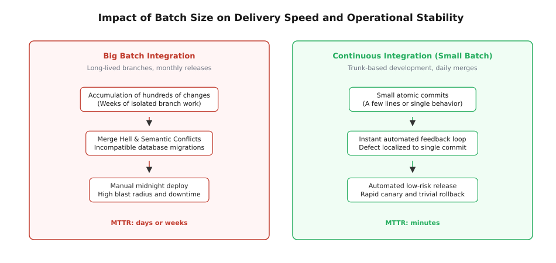
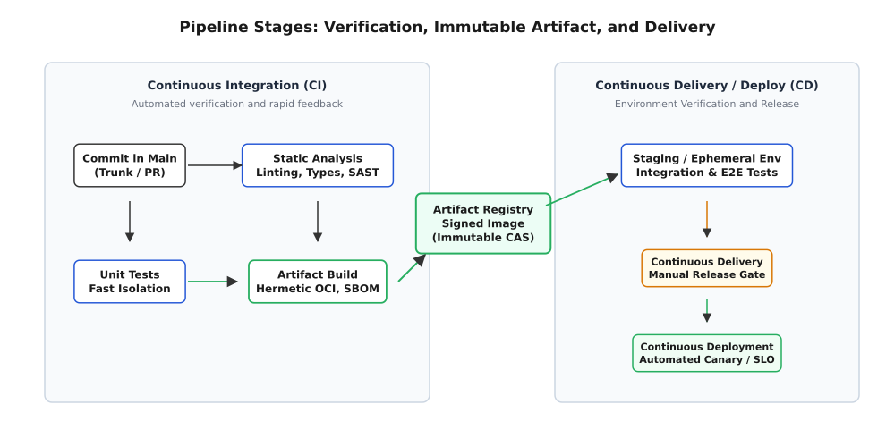
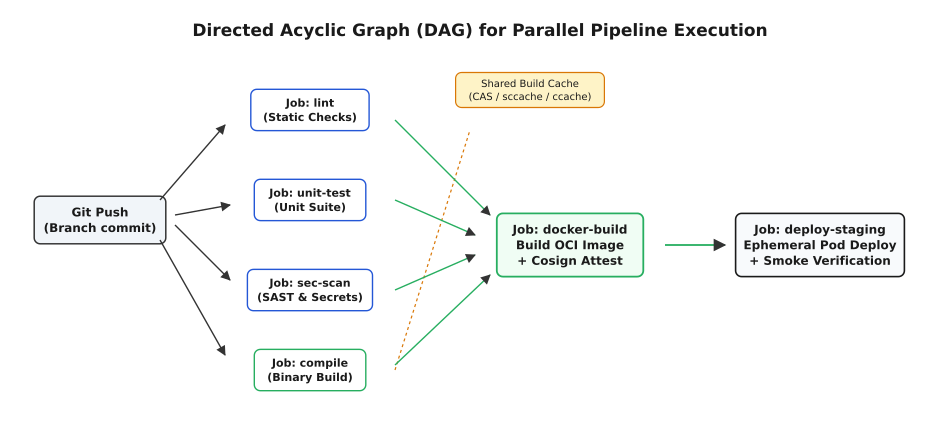

# CI/CD: Неперервна інтеграція та неперервне доставлення

<preknowlist>
* [Тестування програмного забезпечення](root:sf-release/integration-testing)
* [Контейнеризація та середовища виконання OCI](root:sf-os/containers)
* [Оркестрація та управління інфраструктурою](root:sf-release/container-orchestration)
* [Розгортання без простоїв та канарочні релізи](root:sf-release/deployment-strategies)
</preknowlist>

Двадцять п'ять інженерів працюють над розподіленою платіжною системою в ізольованих гілках протягом трьох тижнів. Кожен розробник успішно запускає юніт-тести на власному ноутбуці, де база даних імітується локальним SQLite або моками, а сторонні банківські шлюзи замінені статичними заглушками. Напередодні щомісячного релізу всі двадцять п'ять гілок одночасно зливаються у гілку `release`. Відбувається катастрофічний конфлікт: чотириста файлів містять несумісні текстові правки, міграція схеми бази даних від однієї команди ламає збережені процедури іншої, а оновлена версія базової HTTP-бібліотеки видаляє метод, на який спираються три суміжні модулі. Інтеграція займає два тижні ручного розбору конфліктів, після чого скомпільований о третій ночі бінарний файл вивантажується на бойові сервери за допомогою SSH-скрипта і спричиняє чотиригодинний простий через невідповідність версій системних динамічних бібліотек на хості.

Цей сценарій — класичний приклад так званого «інтеграційного пекла» (англ. *merge hell*). Його фундаментальна причина криється не в низькій кваліфікації окремих інженерів, а у відкладеній інтеграції: чим довше вихідний код живе в ізоляції від коду інших учасників команди, тим вища ентропія несумісності та тим дорожчим стає пошук і усунення кожного окремого дефекту.

> 🔧 **Навіщо це.**
> Парадигма **CI/CD** (Continuous Integration / Continuous Delivery) перетворює інтеграцію, тестування та доставку програмного забезпечення з періодичної ризикованої події на безперервний, автоматизований, детермінований інженерний конвеєр. Замість накопичення змін у гігантські пачки CI вимагає інтегрувати код у спільну магістраль щодня невеликими порціями, а CD гарантує, що будь-яка успішно зібрана версія готова до безпечного автоматичного або напівавтоматичного розгортання в робочому середовищі.

Детальний аналіз переходу від нічних збірок до декларативного GitOps та безпарольних OIDC-пайплайнів наведено у вставці [📜 Історія народження CI/CD: від нічних збірок до GitOps](root:sf-release/ci-cd/hist-ci-cd-evolution.md).

---

## Фундаментальна механіка розміру пачок (Batch Size Dynamics)

Центральним концептом неперервної інтеграції є радикальне зменшення розміру робочої пачки (англ. *batch size*). У традиційних каскадних або квазі-гнучких процесах зміни накопичуються великими партіями протягом усього спринту або релізного циклу.

```text
Традиційна інтеграція (Big Batch):
Розробка (30 днів) ───> Злиття (5 днів) ───> Ручне тестування (10 днів) ───> Реліз (Падіння)
                      ▲
                      └── Експоненційне зростання конфліктів і ризику

Неперервна інтеграція (Small Batch / CI):
Коміт 1 (30 хв) ──> Авто-CI (5 хв) ──> Main
Коміт 2 (45 хв) ──> Авто-CI (5 хв) ──> Main
Коміт 3 (20 хв) ──> Авто-CI (5 хв) ──> Main ──> CD ──> Staging/Canary
```


*Вплив розміру пачки змін на швидкість і стабільність поставки: малі пачки забезпечують швидкий зворотний зв'язок і низький ризик дефектів*

Коли розмір пачки скорочується до одного логічного коміту, час зворотного зв'язку зменшується з тижнів до лічених хвилин. Якщо автоматизований тест падає на коміті з двадцяти рядків, точна причина збою локалізується миттєво: вона знаходиться саме в цих двадцяти рядках, а не серед десятків тисяч рядків змін сорока різних інженерів.

Зменшення розміру пачок розв'язує три критичні системні проблеми розробки:
1. **Ціна утримання незавершеного виробництва (Holding Cost of WIP)**: неінтегрований код є замороженою інвестицією, яка не приносить цінності користувачам, але застаріває відносно магістралі з кожною годиною.
2. **Експоненційна вартість локалізації збоїв**: вартість виправлення помилки на етапі написання коду становить хвилини; на етапі ручної інтеграції через місяць — години або дні; у продакшені під час аварії — десятки тисяч доларів простою.
3. **Психологічний бар'єр релізу**: рідкісні великі релізи викликають страх у команд, що спонукає робити їх ще рідшими та більшими, утворюючи замкнене деструктивне коло. Часті дрібні релізи перетворюють доставку на рутинну непомітну подію.

Строге математичне обґрунтування теорії масового обслуговування черг збірок, формули накопичення дефектів та розрахунку метрик DORA наведено у вставці [🧮 Математика черг, розміру пачок і метрик DORA](root:sf-release/ci-cd/math-feedback-loop-and-dora.md).

---

## Неперервна інтеграція (CI): Trunk-Based Development та автоматичний бар'єр якості

Неперервна інтеграція — це не просто запуск скриптів на сервері, а сувора інженерна дисципліна, яка вимагає виконання трьох обов'язкових умов:
1. **Єдине джерело істини (Trunk-Based Development)**: розробники працюють у короткоживучих гілках (тривалістю від кількох годин до максимум одного робочого дня) або комітять безпосередньо в основну гілку `main` (магістраль). Довгоживучі гілки функціоналу (англ. *feature branches*), що живуть тижнями, суворо заборонені.
2. **Автоматична верифікація кожного коміту**: на кожну подію надсилання змін (`git push`) або створення запиту на злиття (Pull Request) незалежний ізольований агент запускає чисту збірку та повний тестовий набір.
3. **Культура «Зупинки конвеєра» (Stop-the-Line / Andon Cord)**: якщо основна гілка зламана (червоний білд), пріоритет команди номер один — відновити зелений стан магістралі або негайно відкотити (`git revert`) зламаний коміт. Накладати нові зміни на червоний білд суворо заборонено.

### Розділення розгортання та релізу: Feature Flags
Постає природне запитання: як інтегрувати незавершений функціонал у спільну гілку `main` кілька разів на день, не ламаючи поведінку продукту для користувачів?

Відповіддю є патерн **Feature Flags** (прапорці функціоналу). Новий код зливається в магістраль і розгортається в продакшен у неактивному стані, захований за умовною динамічною конструкцією:

:::tabs
== C
```c
#include <stdbool.h>

bool is_feature_enabled(const char *flag_key, const void *user_context);
void execute_payment_v2(void *tx);
void execute_legacy_payment(void *tx);

void process_transaction(void *tx, const void *user_context) {
    if (is_feature_enabled("new_payment_v2", user_context)) {
        execute_payment_v2(tx);
    } else {
        execute_legacy_payment(tx);
    }
}
```
== C++
```cpp
#include <string_view>
#include <memory>

class FeatureFlagService {
public:
    virtual ~FeatureFlagService() = default;
    [[nodiscard]] virtual bool is_enabled(std::string_view flag_key, 
                                          const UserContext& context) const noexcept = 0;
};

void process_transaction(Transaction& tx, 
                         const UserContext& context, 
                         const FeatureFlagService& flags) {
    if (flags.is_enabled("new_payment_v2", context)) {
        execute_payment_v2(tx);
    } else {
        execute_legacy_payment(tx);
    }
}
```
:::

Це розділяє поняття **розгортання** (англ. *deployment* — фізична присутність бінарного коду на серверах) та **релізу** (англ. *release* — активація бізнес-логіки для користувачів). Команда може тестувати новий функціонал на внутрішніх користувачах у продакшені задовго до публічного запуску, уникаючи довгоживучих гілок.

### Черги злиття (Merge Queues) та боротьба зі станом гонки
У високонавантажених репозиторіях із сотнями інженерів виникає семантичний стан гонки:
* Розробник А створює PR-1 на базі коміту `C_0`. CI успішно проходить.
* Розробник Б створює PR-2 на базі коміту `C_0`. CI також проходить.
* PR-1 зливається в `main`, створюючи коміт `C_1`.
* PR-2 автоматично зливається після PR-1, створюючи коміт `C_2`.

Хоча обидва PR окремо були зеленими на стані `C_0`, їхня семантична комбінація в `C_2` може бути зламаною (наприклад, PR-1 перейменував функцію, а PR-2 додав новий виклик старої назви у своєму файлі).

Для розв'язання цієї проблеми сучасні CI-платформи використовують **Merge Queue** (чергу злиття). Черга створює віртуальний спекулятивний коміт `merge(C_1, PR-2)`, запускає повний CI-прогін на цій комбінації, і лише в разі успіху переносить зміну в `main`. Якщо прогін падає, PR-2 викидається з черги без блокування інших розробників, а автору надсилається детальний звіт про помилку.

---

## Неперервне доставлення (CD) проти Неперервного розгортання

Терміни Continuous Delivery та Continuous Deployment часто скорочують як CD, проте вони мають принципову архітектурну відмінність у точці прийняття рішення про реліз.

```text
               ┌─────────────────────────┐
               │ Continuous Integration  │
               │  Build -> Test -> Pack  │
               └────────────┬────────────┘
                            │
               ┌────────────▼────────────┐
               │   Continuous Delivery   │
               │   Deploy to Staging     │
               └────────────┬────────────┘
                            │
              ┌─────────────┴─────────────┐
              │                           │
    [Ручне затвердження]        [Повна автоматизація]
              │                           │
   ┌──────────▼──────────┐     ┌──────────▼──────────┐
   │ Continuous Delivery │     │Continuous Deployment│
   │  Deploy to Prod     │     │  Deploy to Prod     │
   └─────────────────────┘     └─────────────────────┘
```

1. **Continuous Delivery (Неперервне доставлення)**: код автоматично проходить усі стадії перевірки, компілюється, упаковується в незмінний артефакт і розгортається на тестових та передпродуктивних середовищах (`staging`, `preprod`). Артефакт гарантовано готовий до випуску в будь-яку секунду, але саме рішення про випуск у продакшен приймається людиною (натисканням кнопки в панелі керування або підписом реліз-менеджера).
2. **Continuous Deployment (Неперервне розгортання)**: повністю автономний конвеєр без участі людини. Будь-який коміт, що успішно подолав усі автоматичні бар'єри якості, самостійно розгортається у продакшені та починає обслуговувати живий трафік. Безпека такого підходу гарантується автоматичним канарочним випуском (англ. *canary release*), статистичним аналізом метрик надійності (SLO/SLI) та миттєвим автоматичним відкатом при фіксації аномалій.

### Фундаментальний принцип: незмінність артефакту (Immutable Artifact)
Критичне правило Continuous Delivery стверджує: **артефакт збирається рівно один раз** на етапі CI. Суворо заборонено перекомпільовувати код окремо для staging і окремо для production з різними прапорцями збірки.

Один і той самий скомпільований бінарний файл або OCI-контейнер проходить крізь усі середовища. Різниця в поведінці між середовищами досягається виключно через зовнішню конфігурацію (змінні оточення, ConfigMaps, Secrets), що передається контейнеру під час запуску (відповідно до методології Twelve-Factor App). Для очищення старих версій реєстри налаштовують політики очищення за часом життя (TTL) та кількістю версій, зберігаючи образи, підписані релізними тегами.

---

## Анатомія п'яти стадій конвеєра (The 5 Pipeline Stages)

Промисловий конвеєр неперервної інтеграції та доставлення проектується за принципом швидкого відсікання: найдешевші та найшвидші перевірки виконуються першими, а найдорожчі та повільні — останніми.


*Анатомія конвеєра CI/CD: від локального коміту через паралельні фази верифікації до фіксації незмінного артефакту та автоматичної доставки*

### 1. Статичний аналіз та попередня перевірка (Pre-flight & Linting)
* **Тривалість**: 10–60 секунд.
* **Задачі**:
  * Перевірка синтаксису та форматування вихідного коду (`clang-format`, `gofmt`, `prettier`).
  * Статична перевірка типів і лінтування (`clang-tidy`, `mypy`, `eslint`).
  * Пошук випадково зафіксованих секретів (API-ключів, паролів, приватних ключів) через ентропійний аналіз (`gitleaks`, `trufflehog`).
  * Базовий аналіз безпеки вихідного коду (SAST: Static Application Security Testing, наприклад `CodeQL`, `Semgrep`).

### 2. Герметична компіляція та детермінована збірка (Hermetic Builds)
* **Тривалість**: 1–5 хвилин.
* **Задачі**:
  * Компіляція бінарних файлів у суворо ізольованому контейнері без доступу до зовнішнього інтернету (герметичність). Усі залежності монтуються локально або беруться з попередньо верифікованого вендор-кешу.
  * Використання контентно-адресованого кешу компілятора (`ccache`, `Bazel`, `sccache`): якщо хеш вихідного коду та прапорців компілятора не змінився, об'єктний файл миттєво повертається з кешу.
  * Бінарна відтворюваність (англ. *Reproducible Builds*): два незалежні прогони збірки на ідентичному коміті на різних агентах зобов'язані видавати побайтово рівні виконувані файли з однаковим SHA-256 хешем.

### 3. Піраміда верифікації (Verification Pyramid in CI)
* **Тривалість**: 2–10 хвилин.
* **Задачі**:
  * **Модульні тести (Unit Tests)**: тисячі швидких тестів (< 5 мс на тест) з повною ізоляцією пам'яті та відсутністю дискового або мережевого вводу-виводу.
  * **Компонентні та контрактні тести (Contract Tests)**: верифікація сумісності схем gRPC/Protobuf, OpenAPI, JSON Schema між мікросервісами за допомогою Pact.
  * **Інтеграційні тести в ефемерних середовищах**: запуск реальних баз даних (PostgreSQL, Redis, Kafka) як допоміжних контейнерів у локальній мережі воркера за допомогою механізму Testcontainers або Kubernetes-sidecars.
  * **Динамічне шардування тестів (Test Sharding)**: розподіл набору з тисяч тестів на `N` паралельних потоків воркерів на основі історичних даних про час їхнього виконання для мінімізації загального часу очікування.

### 4. Пакування та криптографічний ланцюг постачання (Supply Chain Security)
* **Тривалість**: 1–3 хвилини.
* **Задачі**:
  * Формування мінімального OCI-образу без зайвих системних утиліт і shell-оболонок (Distroless / Wolfi / Chainguard).
  * Багатоетапна збірка (Multi-stage builds) з оптимізацією шарів кешування BuildKit (`--cache-to=type=registry`, `--cache-from=type=registry,mode=max`).
  * Генерація маніфесту компонентів програмного забезпечення (SBOM: Software Bill of Materials у форматах SPDX або CycloneDX) через сканування `syft` або `trivy`.
  * Генерація та підписання атестації походження SLSA Provenance v1.0 за допомогою утиліти `cosign` та ефемерних сертифікатів Sigstore/Fulcio.
  * Фіксація артефакту в реєстрі виключно за незмінним криптографічним дайджестом (`sha256:7f8a9b...`), а не за рухомим тегом `latest` чи номером версії.

### 5. Прогресивна доставка та телеметричний зворотний зв'язок (Progressive Delivery)
* **Тривалість**: 5–30 хвилин.
* **Задачі**:
  * Розгортання нової версії за стратегією Rolling Update, Blue-Green або Canary (1% -> 10% -> 50% -> 100% трафіку).
  * Безперервне опитування систем моніторингу (Prometheus, Datadog) на предмет відхилення ключових метрик: відсоток помилок, час відповіді p99, завантаження CPU.
  * Автоматичний відкат (англ. *automated rollback*) контролером Flagger або Argo Rollouts при спрацюванні тригера тривоги за лічені секунди.

---

## Масштабування монорепозиторіїв та аналіз зачеплених цілей (Affected Targets)

У монорепозиторіях корпоративного масштабу, де зберігаються сотні окремих мікросервісів та спільних бібліотек, запуск повного конвеєра збірки на кожен дрібний коміт займав би години дорогоцінного часу. Для збереження швидкого зворотного зв'язку до 5 хвилин системи розподіленої збірки (Bazel, Nx, Turborepo) використовують граф залежностей робочого простору.

Рушій виконує команду `git diff --name-only HEAD~1` і зіставляє список змінених файлів із загальним графом модулів. Компілюються та тестуються виключно ті пакети, які зазнали прямих змін, а також їхні безпосередні та транзитивні споживачі (англ. *affected targets*). Усі інші незалежні сервіси миттєво підтягуються з віддаленого контентно-адресованого кешу артефактів без повторного виконання тестів.

---

## Стратегії розгортання без простоїв (Zero-Downtime Deployment Patterns)

У фазі доставлення конвеєр CD взаємодіє з кластером оркестрації (Kubernetes, Nomad) для заміни старої версії коду новою без втрати жодного клієнтського HTTP-запиту.

### 1. Поетапне оновлення (Rolling Update)
Екземпляри сервісу оновлюються по черзі відповідно до параметрів `maxSurge` (скільки додаткових подів можна створити понад норму) та `maxUnavailable` (скільки подів старої версії можна вимкнути одночасно).
* **Механізм перевірки готовності (Readiness Probes)**: трафік спрямовується на новий под лише після того, як його endpoint `/healthz/ready` повертає HTTP 200 (база даних підключена, кеш прогрітий).
* **Плавне завершення з'єднань (Connection Draining / Graceful Shutdown)**: при зупинці старого поду йому надсилається сигнал `SIGTERM`, після чого процес припиняє приймати нові з'єднання, завершує обслуговування активних запитів протягом grace-періоду (наприклад, 30 секунд) і лише тоді завершує роботу.

### 2. Blue-Green розгортання
Розгортаються два абсолютно ідентичні виробничі контури: синій (`Blue` — активний, обслуговує 100% трафіку) та зелений (`Green` — нова версія).
* Нова версія розгортається у контурі `Green` та проходить синтетичні smoke-тести в реальному продакшен-середовищі без доступу публічних користувачів.
* Після успішної верифікації балансувальник навантаження або Service Mesh атомарно перемикає 100% трафіку з `Blue` на `Green`.
* У разі виявлення прихованого дефекту зворотне перемикання на `Blue` займає частки секунди. Недоліком є подвоєна потреба в обчислювальних ресурсах кластера.

### 3. Канарочне розгортання (Canary Deployment)
Нова версія отримує фіксовану невелику частку живого трафіку (наприклад, 2% або лише запити від внутрішніх бета-тестувальників).
* Спеціальний оператор (Argo Rollouts / Flagger) виконує статистичний аналіз (наприклад, критерій Манна-Вітні U або тест Колмогорова-Смирнова) метрик Canary-подів проти Baseline-подів старої версії.
* Якщо частка помилок (HTTP 5xx) та час відповіді p99 у канарочної версії залишаються в межах норми, вага трафіку поступово збільшується: 5% -> 10% -> 25% -> 50% -> 100%.
* При перевищенні порогу деградації (SLO violation) трафік миттєво повертається на 0%, мінімізуючи радіус ураження інциденту (англ. *blast radius*).

---

## Верифікація атестацій у кластері (Admission Controllers)

Криптографічний підпис артефакту та маніфест SLSA не приносять користі, якщо виробничий кластер приймає будь-які образи з реєстру. Тому фінальною ланкою ланцюга безпеки CD є контролери допуску (англ. *Admission Controllers*, такі як Kyverno або OPA Gatekeeper).

Перед тим як створити Pod у кластері Kubernetes, контролер допуску перехоплює запит API-сервера та виконує криптографічну перевірку:
1. Завантажує підпис образу з реєстру через Cosign.
2. Звіряє публічний сертифікат із коренем довіри Sigstore або внутрішнім корпоративним центром сертифікації (CA).
3. Перевіряє твердження атестації: образ повинен бути зібраний виключно з основної гілки `main` офіційного репозиторію організації за допомогою затвердженого конвеєра.
4. Якщо образ не підписаний або підпис не відповідає політиці безпеки, запуск поду блокується з кодом HTTP 403 Forbidden.

---

## Спостережуваність конвеєрів (CI/CD Observability & OpenTelemetry)

Сучасні конвеєри великих організацій обробляють десятки тисяч задач щодня. Для діагностики деградації швидкості пайплайнів використовується розподілене трасування за стандартом OpenTelemetry (OTel).

Кожен запуск конвеєра генерує розподілений слід (англ. *trace*), де кореневий спан відповідає повному пайплайну, а дочірні спани вимірюють точний час завантаження кешу, компіляції окремих пакетів, виконання тестових наборів та вивантаження артефактів. Це дозволяє команді платформи миттєво виявляти «гарячі точки» та вузькі місця критичного шляху за допомогою flame-графіків і теплових карт затримок у реальному часі.

---

## Графовий планувальник (DAG Runner Architecture)

Системи виконання конвеєрів відмовилися від жорстких послідовних фаз (де всі тести чекають завершення всіх компіляцій) на користь довільних спрямованих ациклічних графів (DAG).


*Спрямований ациклічний граф (DAG) виконання паралельних задач у CI з топологічним плануванням та каскадним пропуском при помилці*

У DAG-моделі кожна задача оголошує лише безпосередні залежності через директиву `needs`. Планувальник обчислює півстепінь заходу (`in-degree`) кожного вузла. Вузли з нульовим `in-degree` негайно надсилаються до пулу вільних потоків або агентів. Після успішного завершення задачі лічильники `in-degree` всіх її прямих нащадків декрементуються, і розблоковані задачі потрапляють у чергу готовності.

Якщо задача компіляції зазнає невдачі, планувальник виконує каскадне відсікання (*cascade skip*): усі залежні вузли миттєво переходять у стан `SKIPPED`, вивільняючи ресурси пулу та мінімізуючи витрати інфраструктури.

Повну багатопотокову реалізацію конвеєрного DAG-рушія мовами C та сучасним стандартом C++20 з пулом потоків, м'ютексами, умовними змінними та каскадним відсіканням наведено у вставці [⚙️ Конвеєрний рушій виконання DAG задач із паралельним плануванням](root:sf-release/ci-cd/proj-pipeline-dag-runner.md).

---

## Проблема нестабільних тестів (Flaky Tests) та стратегії ізоляції

Нестабільний тест (англ. *flaky test*) — це тест, результат виконання якого недетермінований: він може пройти успішно або впасти на абсолютно ідентичному вихідному коді.

Нестабільні тести є справжньою отрутою для культури CI. Коли тести падають без причини, інженери втрачають довіру до конвеєра, починають перезапускати збірки навмання («flaky retry») та ігнорувати реальні критичні збої, вважаючи їх черговим хибним спрацьовуванням.

### Першопричини появи нестабільності
1. **Гонки потоків та пам'яті (Race Conditions)**: некоректна синхронізація у багатопотоковому коді, що проявляється лише за певного планування квантів часу операційною системою.
2. **Нереалістичні та жорсткі таймаути**: очікування асинхронної події через фіксований `sleep(100ms)` замість активного опитування стану (англ. *polling / wait-until*). На завантаженому агенті CI потік може отримати затримку планувальника, і 100 мс виявиться недостатньо.
3. **Забруднення спільного стану (Shared State Pollution)**: тест А записує рядок у спільну базу даних або глобальну змінну і не очищує її в блоці `finally` або `tearDown()`, через що тест Б, запущений пізніше, падає на неочікуваних даних.
4. **Неявна залежність від порядку виконання**: виконання тестів у недетермінованому порядку призводить до прихованих залежностей між тестами.
5. **Залежність від системного часу або локалі**: використання системного годинника (`Date.now()`, `time.time()`) без мокінгу часових поясів або високосних років.

### Інженерні патерни боротьби з нестабільністю
* **Повторні спроби (Retry Pattern)**: автоматичний повторний запуск невдалого тесту до трьох разів. Це тактичний «пластир», який рятує конвеєр від хибних блокувань, але маскує дефект.
* **Автоматичний карантин (Quarantine Gate)**: тест, що проявив нестабільність (наприклад, пройшов 2 рази з 3), автоматично позначається тегом `@quarantine`. Карантинні тести продовжують виконуватися на окремому воркері, але їхнє падіння не блокує злиття PR. Розробнику призначається завдання з найвищим пріоритетом на стабілізацію або видалення тесту.
* **Стрес-тестування нових тестів (Flaky Detection Pass)**: на етапі PR усі нові або змінені тести запускаються 50 разів поспіль у випадковому порядку з випадковим навантаженням на CPU. Якщо хоча б один прогін зазнає краху, PR блокується до усунення недетермінізму.

---

## Безпека інфраструктури агентів: Ефемерні середовища та OIDC

Агенти CI/CD мають прямий доступ до вихідного коду компанії, систем збірки та часто володіють правами на розгортання в продакшені. Це робить їх мішенню номер один для атак на ланцюг постачання (англ. *supply chain attacks*).

### Ефемерні агенти проти довгоживучих хостів
* **Довгоживучі агенти (Persistent Static Runners)**: пул серверів, на яких послідовно виконуються білди різних користувачів і гілок. Це вкрай небезпечно: шкідливий PR може змінити глобальний `~/.bashrc`, зберегти прихований мережевий бекдор або прочитати секрети та кеш, залишені попереднім білдом іншого проєкту.
* **Ефемерні агенти (Ephemeral Autoscaling Runners)**: кожен пайплайн або окрема задача отримує абсолютно новий, чистий контейнер або мікровіртуальну машину (Firecracker, gVisor, rootless Podman). Після завершення задачі віртуальна машина безповоротно знищується разом з усіма тимчасовими файлами, гарантуючи нульовий залишковий стан.

```text
Запит на збірку ──> Kubernetes Autoscaler ──> Запуск Pod (чистий образ)
                                                     │
                                             Виконання задачі
                                                     │
                                             Знищення Pod (0 залишкового стану)
```

### Проблема Docker-in-Docker (DinD) та безпечна контейнеризація
Для збірки OCI-образів усередині CI-контейнера традиційно монтували сокет хоста `/var/run/docker.sock` або запускали Docker-in-Docker у привілейованому режимі (`--privileged`). Монтування сокета хоста надає контейнеру повні права `root` на хостовій машині, дозволяючи атакуючому вийти за межі ізоляції.

Сучасний стандарт безпеки вимагає використання безпривілейованих утиліт збірки образів, які працюють у просторі користувача (user namespaces) без прав root та без доступу до демона Docker:
* **Kaniko**: збирає контейнери з Dockerfile всередині звичайного Kubernetes Pod без root-привілеїв.
* **Buildah / Podman**: збірка образів з повною підтримкою user namespace remapping.

### Безпарольна автентифікація через OIDC (Zero Static Secrets)
Зберігання статичних довготривалих токенів AWS Access Key або API-ключів у налаштуваннях репозиторію є критичною вразливістю. У разі витоку або компрометації агента ці ключі дозволяють зловмиснику атакувати хмарну інфраструктуру.

Сучасні конвеєри використовують OpenID Connect (OIDC) федерацію:
1. Агент CI запитує короткоживучий криптографічний JWT-токен у провайдера конвеєра.
2. Токен містить зашиті твердження (англ. *claims*): репозиторій, гілку, оточення, автора коміту, хеш коміту.
3. Агент надсилає цей JWT до хмарного провайдера (наприклад, AWS STS або GCP Workload Identity).
4. Хмара перевіряє криптографічний підпис і тимчасово видає агенту IAM-роль з обмеженим терміном дії (наприклад, 15 хвилин), дозволяючи виконати розгортання без збереження статичних паролів.

Повний машинний контракт декларативної конфігурації конвеєра, схему AST, специфікацію кешування, матриць задач та OIDC наведено у вставці [📋 Специфікація та контракт декларативного опису пайплайну](root:sf-release/ci-cd/api-pipeline-spec.md).

---

## Підсумковий синтез архітектури

Конвеєр неперервної інтеграції та доставлення є центральною нервовою системою сучасної розробки програмного забезпечення. Він трансформує суб'єктивну розробку на локальних машинах у відтворюваний, прозорий та надійний інженерний процес, де:
1. Будь-яка зміна інтегрується малими порціями в спільну магістраль щодня.
2. Кожна лінія коду автоматично перевіряється на відсутність синтаксичних, логічних і безпекових дефектів на ізольованих агентах.
3. Вихідний артефакт пакується герметично один раз, підписується криптографічним ключем і фіксується за незмінним дайджестом.
4. Доставка в робоче середовище здійснюється поступово, контролюється телеметрією реального часу та забезпечує миттєвий автоматичний відкат у разі деградації якості сервісу.
