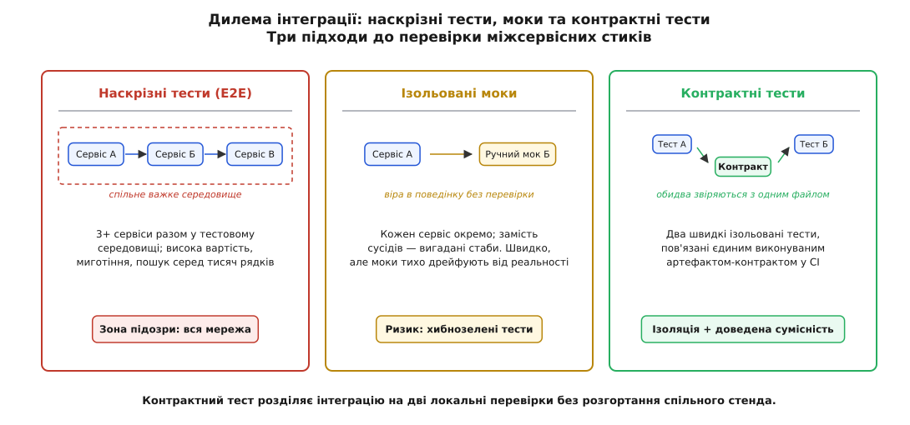
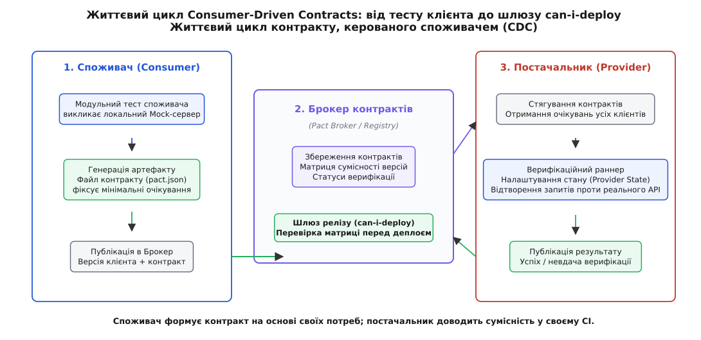
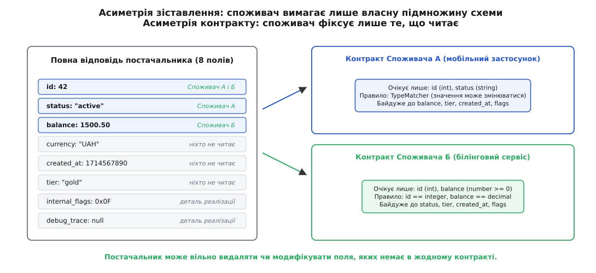
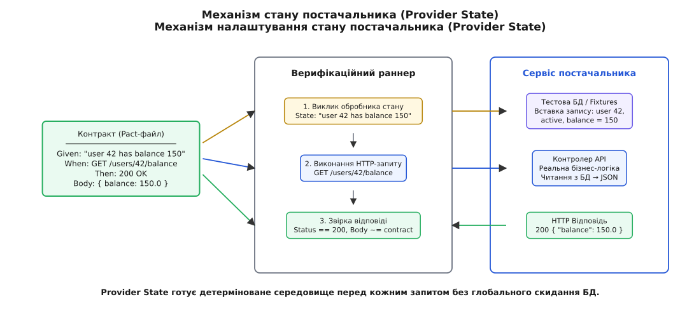
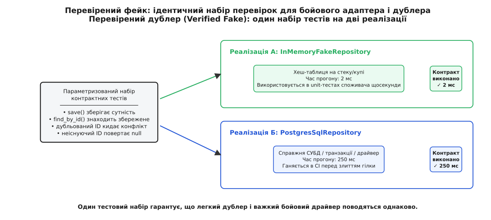

# Контрактні тести: угода на межі двох світів

<preknowlist>
- [Інтерфейс проти реалізації](topic:sf-apps/interface-vs-implementation) — що таке публічна обіцянка модуля і чому деталі реалізації мають вільно змінюватися.
- [Дублери: стаб, мок, фейк, спай](topic:sf-release/test-doubles) — як підміна співпрацівників у тестах дає швидкість, але створює ризик розходження з реальністю.
- [Модульний тест: одиниця, ізоляція, швидкість](topic:sf-release/unit-testing) — чому звуження зони підозри є головною цінністю швидкого тесту.
- [Проєктування за контрактом](topic:sf-release/design-by-contract) — передумови, постумови та інваріанти як фундаментальні закони взаємодії коду.
- [Семантичне версіонування (SemVer)](topic:sf-release/semantic-versioning) — як мажорні, мінорні та патч-версії сигналізують про сумісність або злам контракту.
</preknowlist>

Уяви систему з двох мікросервісів: сервіс оплати (Billing) звертається до сервісу профілів (Profile), щоб отримати статус підписки користувача. У репозиторії Billing написали швидкий модульний тест: замість справжнього Profile підставили стаб, який повертає `{ "status": "active" }`. Тест виконується за 4 мілісекунди, пайплайн Billing зелений. Тієї ж години розробники Profile перейменовують поле `"status"` на `"subscription_state"`, бо проводять плановий рефакторинг своєї моделі даних. Їхні власні модульні тести теж проходять за 5 мілісекунд, їхній пайплайн так само світиться зеленим. Обидва сервіси розгортаються в робоче середовище — і першої ж секунди білінг починає падати з помилкою `NullPointerException`, бо поле `"status"` тепер порожнє.

Формально кожен розробник виконав свою роботу сумлінно: модульні тести перевірили внутрішню логіку, код скомпільовано без помилок, збірка бездоганна. Практично — білінг паралізовано, платежі зупинено, а бізнес зазнає збитків. Традиційні засоби тестування виявляються безпорадними: модульний тест нічого не знає про зміни в сусідньому сервісі, бо спирається на застиглу вигадку свого автора, а наскрізний тест на спільному стенді занадто повільний, щоб запускати його на кожен коміт.

Ця проблема виникає щоразу, коли два програмні компоненти розвиваються незалежно, але мають узгоджувати свої протоколи обміну. Відповіддю на цей виклик є **контрактне тестування** (англ. *contract testing*, від лат. *contractus* — договір, угода): методологія, що розділяє перевірку міжсервісної інтеграції на дві швидкі, повністю автономні перевірки, пов'язані єдиним виконуваним артефактом — контрактом.

## Дилема інтеграції: чому моки сліпнуть, а наскрізні тести тонуть

Коли програмна система розбивається на окремі компоненти — модулі, бібліотеки, мікросервіси чи клієнт-серверні застосунки — розробники стикаються з вибором між двома крайнощами.

Перша крайність — **ізольовані тести з неперевіреними дублерами** (моками або стабами). Кожен сервіс тестується виключно у власному процесі. Усі зовнішні виклики (HTTP-запити, звернення до баз даних, виклики черг повідомлень) замінюються штучними заглушками. Переваги очевидні: тест біжить за частки мілісекунди, не потребує мережі, не залежить від стану чужої інфраструктури й дає миттєвий зворотний зв'язок розробнику під час написання коду.

Проте за цю швидкість доводиться платити сліпотою. Дублер — це завжди лише **зафіксоване уявлення автора тесту про те, як поводиться зовнішній компонент**. Якщо справжній постачальник змінює формат відповіді, додає обов'язковий заголовок або перейменовує поле, дублер про це не дізнається. Виникає явище, відоме в інженерії як **дрейф дублера** (англ. *mock drift*): код постачальника пішов уперед, а дублер у репозиторії споживача застиг у минулому. Модульні тести залишаються хибнозеленими, створюючи ілюзію повної безпеки, доки система не зустрінеться з реальністю на стадії розгортання.

Друга крайність — **наскрізні інтеграційні тести** (англ. *End-to-End*, E2E). Щоб позбутися дрейфу моків, інженери будують спільний тестовий стенд (Staging або Integration Environment), розгортають туди всі `N` сервісів системи зі справжніми базами даних та мережевими шлюзами й ганяють користувацькі сценарії «від інтерфейсу до сховища».


*Три стратегії тестування стиків: наскрізне важке середовище тоне в комбінаторному вибуху; моки дрейфують; контрактні тести фіксують взаємні зобов'язання в ізоляції.*

Наскрізне тестування виглядає надійним на папері, але на практиці майже завжди призводить до інженерного колапсу:

1. **Комбінаторний вибух вартості.** Якщо в системі є `N` сервісів, кожен із яких має `M` можливих версій та конфігурацій, простір станів для тестування зростає як добуток. Підтримувати актуальність тестових даних у десятках пов'язаних баз стає окремою повноцінною роботою.
2. **Миготливі тести (Flaky Tests).** Мережеві затримки, перезапуски контейнерів, конфлікти за спільні тестові записи призводять до того, що набір із сотень наскрізних тестів падає випадковим чином. Червоне світло перестає означати помилку в коді — воно означає «стенд знову кліпнув». Команди звикають перезапускати збірку, втрачаючи довіру до тесту як детектора. Якщо ймовірність збою одного сервісу через мережу чи тайм-аут становить хоча б 0.5 %, то для наскрізного сценарію з 10 сервісів імовірність успішного зеленого прогону становить `(1 - 0.005)¹⁰ ≈ 95.1 %`, тобто кожен двадцятий прогін падатиме на порожньому місці.
3. **Величезна зона підозри.** Коли падає наскрізний тест, зона підозри охоплює всі сервіси ланцюжка, балансувальники навантаження, мережеві шлюзи та бази даних. Щоб знайти один зламаний рядок, інженери витрачають години на розбір розподілених логів і трасувань.
4. **Вузьке горло релізів.** Якщо для викачування сервісу потрібно прогнати годинний набір E2E-тестів на спільному стенді, команди шикуються в чергу. Автономність розробки знищується: швидкість випуску всієї компанії падає до швидкості найповільнішого сервісу.

Контрактні тести розв'язують цю дилему, пропонуючи третій шлях: замість зводити дві половини системи разом на важкому стенді, кожну сторону перевіряють окремо, але проти **єдиного спільного артефакту — контракту**. Про історію виникнення цього підходу детально йдеться у вставці [Історія появи Consumer-Driven Contracts і народження Pact](topic:sf-release/contract-testing/hist-consumer-driven-contracts.md).

> 🔧 **Навіщо це.** Контрактні тести перетворюють важку й нестабільну інтеграційну перевірку на два швидкі локальні тести. Ти отримуєш швидкість і детермінізм модульних тестів (виконання за мілісекунди) разом із надійністю наскрізного тестування (гарантія того, що реальні сервіси сумісні на протокольному рівні).

## Анатомія контрактного тесту: сторони та артефакт

Щоб формалізувати взаємодію двох компонентів, контрактне тестування вводить чіткі ролі та стандартизований носій домовленостей:

- **Споживач** (англ. *consumer*, від лат. *consumere* — споживати, використовувати) — компонент, який ініціює запит або підписується на повідомлення. Споживач залежить від даних, які повертає інша сторона (наприклад, мобільний клієнт, веб-інтерфейс або бекенд-сервіс, що викликає стороннє API).
- **Постачальник** (англ. *provider*, від лат. *providere* — передбачати, забезпечувати) — компонент, який приймає запит, виконує обробку та повертає відповідь, або генерує події в чергу (наприклад, сервіс авторизації, білінговий шлюз чи бекенд-контролер).
- **Контракт** (англ. *contract*) — машиночитний артефакт (зазвичай JSON-документ), що містить формальний опис усіх взаємодій між конкретним споживачем та конкретним постачальником.

Кожна взаємодія (англ. *interaction*) усередині контракту фіксує три обов'язкові речі:
1. **Передумову** (стан постачальника, англ. *Provider State*) — у якому стані має перебувати постачальник, щоб цей запит мав сенс (наприклад, «користувач із номером 42 існує і має заблокований рахунок»).
2. **Запит споживача** — точний HTTP-метод, шлях, параметри рядка запиту (query params), необхідні заголовки та структуру тіла запиту.
3. **Очікувану відповідь** — статус-код відповіді (наприклад, `200 OK` або `404 Not Found`), обов'язкові заголовки та структуру тіла відповіді з правилами валідації полів.

Головна відмінність контракту від звичайної документації (як-от сторінка у Wiki чи опис у Swagger) полягає в тому, що **контракт є виконуваним**. Він не пишеться людьми вручну як текст для читання — він генерується автоматично під час виконання тестів споживача і виконується як тестовий набір під час перевірки постачальника.

## Керовані споживачем контракти (Consumer-Driven Contracts)

Історично першим підходом до контрактів були контракти, що їх диктував постачальник (англ. *Provider-Driven*): автор API писав WSDL- або OpenAPI-специфікацію, оголошував її «законом» і вимагав від клієнтів підлаштовуватися. Проте на практиці постачальник майже ніколи не знає, хто саме читає його відповіді й які поля насправді потрібні клієнтам.

Якщо API повертає об'єкт користувача з сорока полів, а мобільному клієнту потрібні лише `id` та `display_name`, класична схема постачальника зв'язує йому руки. Постачальник не може видалити застаріле поле `fax_number`, бо боїться зламати невідомого клієнта.

Підхід **контрактів, керованих споживачем** (англ. *Consumer-Driven Contracts*, CDC), розвертає цей процес. Контракт формує не постачальник, а **споживач**. Кожен клієнт декларує рівно те, що йому потрібно для виконання власних бізнес-задач.


*Повний цикл CDC: споживач генерує файл контракту через власний тест; постачальник автономно верифікує його в CI; брокер підтверджує сумісність перед релізом.*

Життєвий цикл CDC складається з чотирьох послідовних фаз:

### Фаза 1: Генерація контракту споживачем
Розробник споживача пише звичайний модульний тест свого коду. Для цього бібліотека контрактного тестування (наприклад, Pact) піднімає локальний тестовий Mock-сервер.
У тесті розробник каже: «Якщо мій клієнт надішле `GET /users/42`, я очікую, що сервер поверне статус `200` і тіло з полями `id` (число) та `status` (рядок)».
Клієнтський код виконує справжній HTTP-запит до цього локального Mock-сервера. Якщо код клієнта правильно сформував запит і зміг успішно розібрати відповідь, тест проходить. При цьому Mock-сервер записує цю взаємодію у файл контракту (`pact.json`).

### Фаза 2: Публікація в Брокер контрактів
Після успішного прогону тестів у CI споживача згенерований файл контракту відправляється до централізованого сховища — **Брокера контрактів** (англ. *Contract Broker*, від давньофр. *brocour* — посередник, укладач угод). Брокер зберігає версію клієнта, прив'язує до неї контракт і веде матрицю взаємної сумісності версій.

### Фаза 3: Верифікація постачальником
У репозиторії постачальника налаштовано окремий крок CI: верифікаційний раннер звертається до Брокера, завантажує всі активні контракти від усіх своїх клієнтів і починає їхнє виконання проти реального коду постачальника:
1. Для кожної взаємодії раннер викликає спеціальну функцію налаштування середовища (Provider State), яка готує потрібні тестові записи в базі.
2. Раннер відправляє реальний HTTP-запит у контролер постачальника.
3. Отримана відповідь порівнюється з правилами, записаними споживачем.
Якщо контролер постачальника повернув правильний статус і всі очікувані поля мають потрібні типи, контракт вважається виконаним. Результат верифікації (успіх або помилка) відправляється назад у Брокер.

### Фаза 4: Шлюз розгортання (`can-i-deploy`)
Перед розгортанням нової версії сервісу в робоче середовище (Production) інструмент розгортання звертається до Брокера із запитом: «Чи можу я викатити версію 2.4.1 сервісу Profile?». Брокер перевіряє матрицю: чи верифікована версія 2.4.1 проти тих версій усіх клієнтів, які **зараз прямо працюють на проді**. Якщо хоча б один контракт червоний або не був перевірений, деплой блокується автоматично.

## Правила зіставлення та асиметрія контракту (Закон Постела)

Найпоширеніша помилка початківців у контрактному тестуванні — вимагати точного побайтового збігу значень. Якщо контракт вимагає, щоб поле `balance` дорівнювало точно `1250.75`, такий тест буде крихким: будь-яка зміна тестової фікстури зламає збірку, хоча структура протоколу залишилася незмінною.

Контрактні тести спираються на **структурні правила зіставлення** (англ. *Matching Rules*), що реалізують Закон Постела (відомий як принцип стійкості): *«Будь консервативним у тому, що відправляєш, і ліберальним у тому, що приймаєш»*.


*Асиметрія вимог: постачальник формує багату відповідь, але кожен споживач прив'язується лише до життєво необхідних йому полів.*

Правила матчингу дають змогу перевіряти сумісність на рівні типів і структурних закономірностей:

- **Зіставлення за типом (Type Matcher):** Споживач вказує приклад значення (`"example": 42`), але правило каже `match: type`. Постачальник може повернути число `100` або `9999` — тест буде зеленим, доки це число, а не рядок.
- **Регулярні вирази (Regex Matcher):** Для полів із фіксованим форматом (UUID, дати стандарту ISO-8601, номери телефонів) фіксується шаблон. Значення може бути будь-яким, аби воно задовольняло вираз.
- **Мінімальний розмір колекцій (Min / EachLike):** Якщо API повертає масив товарів, споживач фіксує: «масив повинен містити щонайменше 1 елемент зазначеної структури». Постачальник може повернути 10 товарів — тест успішно пройде.
- **Ігнорування неоголошених полів (Asymmetric Tolerance):** Якщо постачальник повертає у відповіді 20 полів, а споживач описав у контракті лише 3, наявність решти 17 полів **повністю ігнорується**.

Така асиметрія дає колосальну інженерну свободу:
1. Постачальник може додавати нові поля, оптимізувати відповіді та розширювати API без остраху зламати старих клієнтів.
2. Постачальник точно знає, які поля є «мертвими»: якщо певне поле не згадується в жодному контракті жодного клієнта, його можна безпечно видалити з кодової бази без тривалих погоджень у чатах.

Повний опис структури JSON-документів контракту та специфікації правил зіставлення наведено в довіднику [Специфікація контракту та правила зіставлення](topic:sf-release/contract-testing/api-contract-spec.md).

## Стан постачальника (Provider State) та ізоляція передумов

Запити до API майже ніколи не бувають повністю безіменими й безконтекстними. Щоб перевірити відповідь `GET /orders/101`, замовлення з номером `101` повинно фізично існувати в системі постачальника. А щоб перевірити обробку помилки `409 Conflict`, замовлення має перебувати в специфічному стані — наприклад, «вже оплачено».

Як вирішити цю проблему без завантаження важких гігабайтних тестових баз даних? Відповіддю є концепція **стану постачальника** (англ. *Provider State*).


*Механізм Provider State: верифікаційний раннер викликає локальний обробник передумови перед виконанням кожного HTTP-запиту.*

Стан постачальника працює за чітким протоколом:
1. Споживач у своєму тесті вказує текстовий маркер стану: наприклад, `given("користувач 42 має заблокований рахунок")`. Цей рядок записується в JSON-файл контракту.
2. У репозиторії постачальника інженери реєструють карту обробників станів (State Handlers). Для кожного рядка визначається коротка функція підготовки:
```
state_handlers["користувач 42 має заблокований рахунок"] = () => {
    database.clean();
    database.insert_user({ id: 42, blocked: true, balance: 0.0 });
};
```
3. Коли верифікаційний раннер зчитує взаємодію, він перед виконанням HTTP-запиту спочатку викликає зареєстровану функцію стану. База даних локально й детерміновано приводиться в потрібний стан за лічені мілісекунди.
4. Після цього раннер виконує запит і перевіряє відповідь.

Завдяки цьому кожен тест є повністю самодостатнім, незалежним від інших тестів і не потребує ручного скидання спільної бази даних між запусками.

## Робота з новими фічами: незавершені контракти (Pending Pacts)

Коли споживач розробляє нову функціональність, він додає нові взаємодії до контракту ще до того, як постачальник встиг їх реалізувати. Якщо такий контракт одразу почне перевірятися в головній гілці постачальника, пайплайн постачальника зламається, блокуючи чужу роботу.

Для розв'язання цього організаційного конфлікту брокери контрактів підтримують механізм **незавершених контрактів** (англ. *Pending Pacts* та *Work-In-Progress Pacts*):
- Новий контракт публікується з міткою `pending`.
- Раннер постачальника запускає верифікацію цього контракту: якщо тест падає, збірка постачальника **не переривається** червоним світлом, але в брокер записується статус «не реалізовано».
- Щойно команда постачальника реалізує потрібний ендпоінт, верифікація стає зеленою. Брокер автоматично знімає мітку `pending`. Відтепер цей контракт стає обов'язковим, і будь-яка майбутня поломка ламатиме збірку постачальника.

Це уможливлює паралельну роботу команд: споживач може змерджити свій код першим, не ламаючи чужих білдів, а постачальник дізнається про нові вимоги прямо зі свого тестового звіту.

## Версіонування, теги та середовища в Брокері контрактів

У реальних інженерних процесах сервіси розвиваються в сотнях паралельних гілок. Щоб Брокер контрактів не плутав робочі експерименти розробників із бойовими версіями, застосовується система тегування та прив'язки до середовищ (Environments):

1. **Теги гілок (Branch Tagging):** Коли контракт публікується з функціональної гілки `feat/payment-apple-pay`, він позначається відповідним тегом. Постачальник може налаштувати вибірковий прогін контрактів саме з цієї гілки для спільної перевірки фічі.
2. **Маркери середовищ (Environment Markers):** Коли версія сервісу розгортається в кластер `staging` або `production`, система CD реєструє в брокері подію: `OrderService v1.8.0 deployed to production`.
3. **Обчислення перетину в `can-i-deploy`:** Запит на дозвіл розгортання перевіряє не якусь абстрактну «останню збірку», а точний збіг матриці: «Чи сумісна моя версія з версіями всіх клієнтів, які мають активний запис `deployed to production`?».

Це гарантує, що розробник не зламає старий мобільний додаток, який уже пів року працює на смартфонах користувачів, навіть якщо в головній гілці репозиторію вже розробляється наступна мажорна версія API.

## Двонаправлене контрактне тестування (Bi-Directional Contract Testing)

Класичний підхід CDC вимагає, щоб обидві команди використовували спеціалізовані бібліотеки (наприклад, Pact) і писали відповідні верифікаційні тести. Проте у великих організаціях або при роботі зі сторонніми публічними API (як-от Stripe чи Twilio) постачальник не завжди готовий запускати чужий тестовий раннер у своєму CI.

У таких сценаріях застосовують **двонаправлене контрактне тестування** (англ. *Bi-Directional Contract Testing*, BDCT):
- **З боку споживача:** Споживач, як і раніше, генерує контракт за допомогою мок-тестів у своєму репозиторії.
- **З боку постачальника:** Постачальник публікує свою еталонну OpenAPI- або Protobuf-схему, яка автоматично генерується з його коду під час збірки.
- **На рівні Брокера:** Брокер контрактів виконує статичне порівняння двох схем: перевіряє, чи є вимоги споживача валідною підмножиною схеми постачальника.

Цей підхід дещо слабший за повноцінний CDC, оскільки не перевіряє динамічні стани постачальника (Provider States), але він дозволяє охопити контрактним захистом легасі-системи та зовнішні партнерські інтеграції без зміни їхньої інфраструктури.

## Контрактне тестування черг і повідомлень (Message Contracts)

Хоча найчастіше контракти застосовують для HTTP REST та gRPC API, розподілені системи масово використовують асинхронну взаємодію через брокери повідомлень (Kafka, RabbitMQ, MQTT, AWS SQS).

У подієво-орієнтованих архітектурах (англ. *Event-Driven Architecture*) ламання схеми повідомлення є ще небезпечнішим, ніж у HTTP: якщо продюсер опублікував у топік подію з неправильним типом поля, падіння консьюмерів може статися через години після публікації, а «отруєне» повідомлення заблокує чергу (англ. *poison pill*).

Контрактне тестування повідомлень працює за абсолютно аналогічним принципом, але без мережевого HTTP-рівня:

1. **Споживач повідомлення (Consumer):** Пише тест свого обробника подій (Message Handler). Контракт фіксує очікувану структуру JSON- або Protobuf-повідомлення. Тест перевіряє, що бізнес-логіка споживача коректно реагує на цей зразок повідомлення.
2. **Файл контракту повідомлення:** Замість секцій `request` та `response` зберігає секцію `messageContents` із правилами зіставлення полів та типом події.
3. **Постачальник події (Message Producer):** Під час верифікації раннер викликає фабрику подій постачальника і перевіряє: «Чи здатний мій код згенерувати подію, яка задовольняє всі структурні вимоги, записані споживачем?».

Таким чином асинхронний стик перевіряється в CI обох сервісів без необхідності піднімати реальний кластер Kafka чи RabbitMQ у тестах.

## Перевірені дублери (Verified Fakes) у моноліті та процесі

Принцип контрактного тестування не обмежується мікросервісами й мережею. Він працює всередині єдиного кодового моноліту — скрізь, де розробники використовують тестові дублери замість справжніх важких залежностей.

Класичний приклад — доступ до бази даних. У модульних тестах для швидкості використовують об'єкт-підробку — **фейк** (англ. *Fake Object*), який зберігає записи в звичайній хеш-таблиці в оперативній пам'яті (`InMemoryRepository`). Для бойової роботи використовується справжній адаптер бази (`PostgresRepository`).

Як гарантувати, що `InMemoryRepository` і `PostgresRepository` поводяться абсолютно однаково? Відповідь дав Мартін Фаулер: **один контрактний набір тестів на обидві реалізації**.


*Перевірений дублер (Verified Fake): параметризований тестовий набір гарантує, що легка підробка в пам'яті та реальний бойовий драйвер виконують один і той самий контракт.*

Розробник пише єдиний абстрактний набір тестів, що перевіряє інваріанти інтерфейсу сховища:
- `save()` зберігає сутність;
- `find_by_id()` знаходить збережений запис;
- збереження дубліката унікального ключа генерує виняток `DuplicateKeyException`;
- пошук неіснуючого запису повертає порожній результат.

Цей набір тестів параметризується і запускається двічі:
1. Проти `InMemoryRepository` — виконується за 1 мілісекунду і ганяється щохвилини під час TDD-розробки.
2. Проти справжнього `PostgresRepository` (у локальному Docker-контейнері) — виконується довше (100–300 мс) і ганяється перед комітом або в CI.

Якщо обидві реалізації проходять один і той самий набір перевірок, `InMemoryRepository` стає **перевіреним фейком** (англ. *Verified Fake*). Розробники можуть беззастережно довіряти йому в тисячах модульних тестів, знаючи, що він не дрейфує від поведінки справжньої СУБД. Повноцінну реалізацію такого тестового стенда мовами C та C++ розібрано у вставці [Побудова перевіреного контрактного тестового стенда](topic:sf-release/contract-testing/proj-contract-harness.md).

## Типові пастки та антипатерни контрактного тестування

Практика контрактного тестування вимагає дисципліни. Порушення кількох базових принципів може перетворити контрактний набір на джерело постійного роздратування:

1. **Перетворення контракту на функціональний тест (Functional Test in a Contract):** Контракт має перевіряти лише межу та структуру протоколу. Якщо споживач намагається записати 50 взаємодій, щоб перевірити всі можливі гілки математичного розрахунку знижки на сервері, він дублює роботу модульних тестів постачальника. Контракт повинен перевіряти лише унікальні форми відповідей (успіх, помилка валідації, конфлікт), а не всю комбінаторику бізнес-правил.
2. **Жорстке кодування динамічних даних (Hardcoding Dynamic Values):** Вимога точного збігу для дат, токенів чи ідентифікаторів робить контракт крихким. Завжди слід використовувати структурні матчери (`type`, `regex`, `min`).
3. **Забуті помилкові сценарії (Happy Path Only):** Найнебезпечніші аварії в продакшені стаються тоді, коли сервер повертає помилку `422 Unprocessable Entity` або `401 Unauthorized` у новому форматі, якого клієнтський адаптер не вміє розпарсити. Контрактний набір обов'язково повинен містити взаємодії для всіх статус-кодів помилок, на які очікує клієнт.
4. **Отруєння стану в Provider States:** Обробники станів повинні завжди атомарно очищати та наповнювати локальну базу перед кожним тестом, щоб попередній виклик не залишав прихованих слідів для наступного.

## Де межа: коли контрактні тести НЕ замінюють інші рівні

Як і будь-який потужний інструмент, контрактне тестування має чітко окреслену сферу застосування. Контрактні тести не є універсальною срібною кулею і не можуть повністю замінити решту піраміди тестування:

| Що контрактні тести перевіряють бездоганно | Чого контрактні тести НЕ перевіряють |
| :--- | :--- |
| **Сумісність схеми та форматів даних** між клієнтом і сервером. | **Глибоку бізнес-логіку постачальника** (для цього існують внутрішні модульні тести постачальника). |
| **Наявність і типи обов'язкових полів** у відповідях. | **Продуктивність, пропускну здатність та тайм-аути** (це завдання навантажувального тестування). |
| **Правильність формування HTTP-запитів** споживачем. | **Реальну працездатність інфраструктури** (DNS, фаєрволи, сертифікати TLS, маршрутизацію мережі). |
| **Коректність обробки помилкових статус-кодів** клієнтом. | **Коректність складних наскрізних бізнес-процесів**, що охоплюють ланцюжок із 10 сервісів одночасно. |

Правильне місце контрактних тестів у загальній інженерній стратегії — це **рівень межі (стику)**. Вони знімають 90 % тягаря з повільних наскрізних E2E-тестів, залишаючи для наскрізного рівня лише мінімальний набір димових перевірок (англ. *Smoke Tests*) для верифікації бойової конфігурації інфраструктури.

Коли кожна сторона незалежно доводить свою вірність спільному контракту, розподілена система позбувається страху змін. Команди розгортають свій код десятки разів на день без координаційних нарад, бо їхню безпеку стереже математично точний, автоматизований артефакт взаємної довіри.
