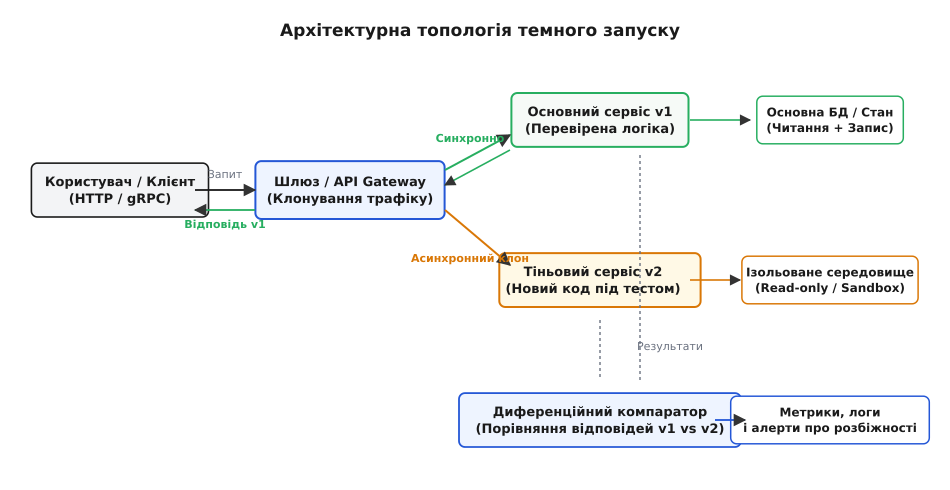
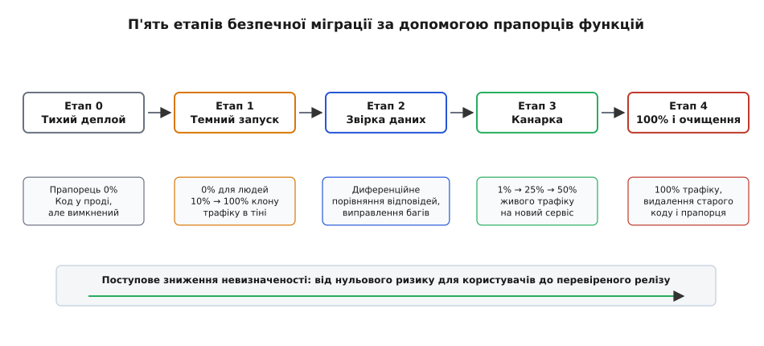
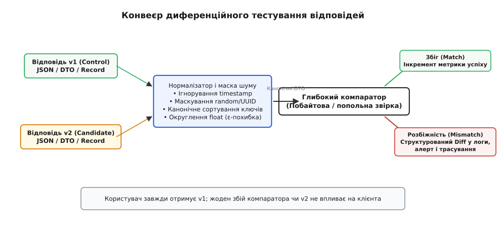

# Темний запуск і feature-flag-міграція

<preknowlist>
- [Тактики експлуатованості й розгортуваності](topic:sf-apps/operability-tactics) — якісні атрибути, що визначають легкість доставки змін і спостереження за живою системою.
- [Стратегії деплою](topic:sf-release/deployment-strategies) — почергове оновлення, синьо-зелене перемикання та канарковий випуск нових версій.
- [Прапорці функцій](topic:sf-release/feature-flags) — відокремлення фізичного розгортання артефакту від активації бізнес-логіки.
- [Розподілений трейсинг](topic:sf-release/distributed-tracing) — простеження шляху запиту через мікросервіси та контекст розподілених спанів.
</preknowlist>

Команда бекенду переписує критичну підсистему розрахунку тарифів і знижок інтернет-магазину. На стенді попереднього тестування з синтетичною базою даних новий рушій демонструє бездоганні результати: час відповіді становить 12 мілісекунд, а частка помилок дорівнює нулю. Проте в живому продакшені під навантаженням у 45 000 запитів на секунду система зустрічається з хаотичною реальністю: складними комбінованими кошиками з тисячами позицій, специфічними валютними округленнями, застарілими форматами профілів клієнтів і раптовими мережевими сплесками. Якщо випустити цей код безпосередньо на користувачів — навіть за канарковою схемою на 1% аудиторії — сотні реальних покупців щохвилини стикатимуться з зависаннями оформлення замовлення, некоректними чеками та фінансовими збитками.

Виникає фундаментальна суперечність: перевірити надійність, продуктивність і точну відповідність результатів нового коду можна лише на реальному потоці живого продакшен-трафіку, але спрямувати цей трафік на новий сервіс означає піддати користувачів неприпустимому ризику аварії.

Цю суперечність розв'язує **темний запуск** (англ. *dark launch*) — інженерна техніка, за якої потік реальних користувацьких запитів або його копія непомітно для клієнта спрямовується на нову підсистему у фоновому режимі («у темряві»), тоді як відповідь формується виключно старою, перевіреною версією системи.

## Анатомія темного запуску: як працює тіньовий потік

Механізм темного запуску ґрунтується на розщепленні вхідного потоку запитів на два незалежні канали обробки. Коли користувацький запит (HTTP, gRPC чи повідомлення з черги) потрапляє на вхідний маршрутизатор або шлюз API, система спрямовує його двома паралельними шляхами:

1. **Основний (контрольний) шлях:** запит синхронно передається на перевірену версію системи (v1). Вона виконує звичну бізнес-логіку, взаємодіє з основною базою даних і формує відповідь, яку клієнт отримує з гарантованою затримкою та надійністю.
2. **Тіньовий (кандидатський) шлях:** копія того самого запиту асинхронно передається на нову версію підсистеми (v2). Новий код обробляє реальні вхідні параметри, прогріває власні кеші, навантажує процесор і мережу, але сформована ним відповідь **ніколи не повертається кінцевому користувачеві**.



*Архітектурна топологія темного запуску: вхідний запит дублюється маршрутизатором; користувач гарантовано отримує відповідь від стабільної версії v1, тоді як тіньова версія v2 тестується на реальному навантаженні.*

Результат роботи тіньового кандидата використовується для двох цілей:
* **Навантажувальне профілювання:** інженери вимірюють затримки (перцентилі p50, p95, p99), споживання пам'яті, поведінку збирача сміття, навантаження на пули з'єднань і стабільність нової архітектури під піковим тиском реальних запитів.
* **Диференційне тестування:** вихідні дані старої та нової систем передаються до спеціального компонента — компаратора (англ. *differential comparator*), який попольно звіряє результати й фіксує будь-які розбіжності.

Якщо новий сервіс падає з критичною помилкою (англ. *panic* або виняток `OutOfMemoryError`), зависає на 30 секунд чи видає неправильну структуру даних, користувач цього взагалі не помічає: його запит успішно обслуговує версія v1. [Історію того, як інженери Facebook у 2008 році за допомогою темного запуску випробували чат на 70 мільйонах користувачів задовго до відкриття інтерфейсу](topic:sf-release/dark-launch/hist-dark-launch-origins.md), варто знати окремо — вона показує, як ця техніка перетворилася на глобальний індустріальний стандарт.

> 🔧 **Навіщо це.** Темний запуск дає можливість безкарно помилятися в продакшені. Інженери можуть випустити абсолютно сирий або глибоко оптимізований рушій на 100% реального трафіку, виявити сотні неочевидних багів у фонових логах, виправити їх і повторити прогін без жодного інциденту в системі моніторингу та без скарг від клієнтів.

## Спектр розгортання: темний запуск, канарка, parallel run та прапорці

Щоб точно обирати інструмент під конкретну задачу, необхідно розрізняти чотири споріднені, але принципово різні поняття:

| Характеристика | Прапорець функції (Feature Flag) | Канарковий випуск (Canary) | Темний запуск (Dark Launch) | Паралельний прогін (Parallel Run) |
| :--- | :--- | :--- | :--- | :--- |
| **Що це таке** | Динамічний перемикач у коді або конфігурації | Маршрутизація частки користувачів на нову версію | Асинхронне дублювання трафіку на новий бекенд | Одночасне довготривале виконання двох систем обліку |
| **Хто бачить результат** | Визначена група користувачів | Малий відсоток випадкових користувачів (1–5%) | Ніхто (результат кандидата знищується або звіряється) | Обидві системи ведуть паралельний запис даних |
| **Радіус ураження (Blast Radius)** | Обмежений налаштуваннями прапорця | Обмежений відсотком канаркового трафіку | **Абсолютний нуль для клієнтів** | Ризик розбіжності первинних станів систем |
| **Вплив на затримку** | Нульовий або мінімальний | Визначається швидкістю нової версії | Нульовий (асинхронне виконання) | Можливе зростання через подвійний синхронний запис |
| **Головна мета** | Керування доступністю функцій | Перевірка базової працездатності на людях | **Перевірка навантаження та побітна звірка логіки** | Звірка фінансових і транзакційних реєстрів за період |

**Прапорець функції (англ. *feature flag*)** — це примітив керування: умовний оператор `if/else`, який на основі контексту (ідентифікатора користувача, відсотка трафіку чи конфігурації) обирає гілку коду. Прапорець є інструментом, за допомогою якого вмикають і темний запуск, і канаркові релізи.

**Канарковий випуск (англ. *canary deployment*)** — це повноцінний реліз для малої частки користувачів. Якщо канарковий вузол видає помилку 500, ті реальні користувачі, які потрапили на цей вузол, бачать збій у своїх браузерах.

**Темний запуск (англ. *dark launch*)** — це невидимий для людей запуск бекенду. Трафік дублюється, але користувач ніколи не стає «піддослідним»: він завжди отримує відповідь від перевіреного стабільного коду.

**Паралельний прогін (англ. *parallel run*)** — це важка транзакційна техніка, характерна для банківського сектору та білінгу, коли дві системи (наприклад, стара монолітна ERP та нова хмарна) паралельно ведуть розрахунки та проводять звірку балансів протягом тижнів або цілих фінансових кварталів перед фінальним вимкненням старої системи.

## Архітектура обчислення прапорців: детерміноване гешування

Для динамічного керування часткою користувачів, які беруть участь у темному запуску або канарковому переході, система повинна розподіляти трафік стабільно й рівномірно. Звернення до централізованої бази даних на кожен HTTP-запит створило б неприпустимі затримки та точку відмови.

Тому сучасні рушії прапорців функцій виконують обчислення локально в пам'яті процесу за допомогою швидких алгоритмів детермінованого некриптографічного гешування (MurmurHash3 або CityHash).

```
user_id: "usr_948102" ──┐
                         ├──> [ MurmurHash3(user_id + flag_key) ] ──> 32-бітний хеш
flag_key: "dark-fee-v2" ─┘                                              │
                                                                         ▼
                                                            [ bucket = hash % 100 ]
                                                                         │
                                                ┌────────────────────────┴────────────────────────┐
                                          [ bucket < 25 ]                                   [ bucket ≥ 25 ]
                                                │                                                 │
                                                ▼                                                 ▼
                                     Увімкнено (25% вибірки)                           Вимкнено (75% вибірки)
```

Математично обчислення бакета виглядає так:

```text
bucket = MurmurHash3(user_id + ":" + flag_salt) % 100
is_enabled = (bucket < target_percentage)
```

Цей підхід забезпечує три критичні властивості:
1. **Детермінованість:** один і той самий користувач гарантовано потрапляє в ту саму експериментальну групу на всіх вузлах кластера без міжсерверної синхронізації.
2. **Рівномірність:** на великій вибірці похибка розподілу часток становить менше 0.05%.
3. **Швидкодія:** обчислення хешу в пам'яті процесу займає менше 15 наносекунд, що усуває будь-який вплив на затримку обробки запиту.

## П'ять етапів міграції за допомогою прапорців функцій

Заміна фундаментальних модулів системи — наприклад, перехід на новий рушій пошуку, заміна бібліотеки криптографії, міграція з реляційної бази даних на документоорієнтовану чи повне переписування API — відбувається за чітким п'ятиетапним конвеєром.



*Конвеєр безпечної міграції: поступовий перехід знижує невизначеність від повного захисту користувачів у тіні до фінального очищення технічного боргу.*

### Етап 0: Приховане розгортання (Silent Deploy)
Новий код вливається в основну гілку репозиторію та розгортається на серверах продакшену. Прапорець функції встановлено у значення `0%` (повністю вимкнено). Новий бінарний файл або контейнер працює в продакшені, але жоден рядок нової логіки ще не виконується. Це гарантує, що сам факт наявності нового коду в збірці не порушує запуск процесів і не конфліктує із залежностями.

### Етап 1: Темний запуск і навантажувальний стрес-тест (Dark Launch)
Через систему динамічної конфігурації вмикається тіньове дублювання трафіку: спершу для 5%, потім 25%, 50% і зрештою 100% запитів. Користувачі все ще отримують результати виключно від старої версії.

На цьому етапі інженери аналізують:
* Чи витримує новий сервіс піковий потік RPS?
* Як поводяться пули з'єднань до бази даних та внутрішні кеші?
* Чи немає витоків пам'яті під тривалим навантаженням?

### Етап 2: Диференційне порівняння та аудит розбіжностей (Differential Verification)
Вмикається компонент диференційного порівняння. Компаратор звіряє вихідні структури даних старої та нової систем для кожного запиту.

Будь-які відхилення автоматично агрегуються й записуються у вигляді структурованих звітів із повним збереженням вхідних параметрів. Команда розробників вивчає ці звіти, знаходить пропущені крайові випадки, вносить виправлення в код кандидата й оновлює його в продакшені, повторюючи темний запуск доти, доки частка розбіжностей не знизиться до абсолютного нуля (`0.0000%`).

### Етап 3: Поетапний канарковий перехід (Canary Cutover)
Коли побітна ідентичність і швидкодія підтверджені на мільйонах тіньових запитів, починається реальний бізнес-реліз. Прапорець функції налаштовують так, щоб нова версія повертала результати реальним користувачам:
* `1%` користувачів перемикаються на новий код (внутрішні тестувальники та випадкова вибірка).
* Через 2 години спостереження частка збільшується до `10%`.
* Через добу — до `50%`, а потім до `100%`.

Якщо на будь-якому кроці виникає непередбачена деградація бізнес-метрик (наприклад, зниження конверсії), прапорець миттєво перемикається назад на стару версію за кілька мілісекунд без перезапуску та без відкоту деплою. При цьому нова версія не вимикається повністю: її знову переводять у режим темного запуску (0% живого трафіку для клієнтів, але збереження тіньового дублювання), що дозволяє інженерам досліджувати причину деградації на реальних вхідних запитах безпосередньо в працюючому середовищі.

### Етап 4: Фіналізація та видалення прапорця (Flag Retirement)
Після того як система успішно відпрацювала 100% трафіку на новому рушії протягом кількох тижнів, настає обов'язковий етап ліквідації технічного боргу.

Інженери видаляють стару гілку коду, прибирають виклики прапорців функцій, вичищають конфігураційні змінні з реєстру та спрощують архітектуру до чистого прямого виклику нового сервісу. Залишати прапорці міграції в коді назавжди неприпустимо: вони перетворюють систему на лабіринт заплутаних умовних переходів.

## Мережеве клонування проти коду застосунку: рівні L4, L7 та Scientist

Організувати дублювання трафіку можна на різних рівнях мережевого стека та архітектури застосунку:

```
Рівень L4 (TCP/IP):        [ Трафік ] ──> Пакетне копіювання (iptables TEE) ──> Проблема з TLS!
                                                                                    │
Рівень L7 (Reverse Proxy): [ Запит ]  ──> Термінація TLS ──> Клон HTTP/gRPC ───> Тіньовий сервіс v2
                                                                                    │
Рівень коду (In-Process):  [ Об'єкт ] ──> Синхронний Control + Асинхронний Candidate (Scientist)
```

### 1. Чому не працює клонування на рівні L4 (TCP/IP)
Спроба клонувати сирі мережеві пакети на рівні мережевої карти або ядра Linux (використовуючи цільовий модуль `iptables -j TEE` або eBPF-програми TC/XDP) у сучасному вебі зазнає краху, якщо використовується шифрування TLS (HTTPS).

Причина полягає в механіці криптографічного рукостискання (англ. *TLS handshake*): кожен клієнт узгоджує унікальні сесійні симетричні ключі шифрування. Тіньовий сервер не має ключів сесії клієнта з основним сервером, тому він не здатен розшифрувати клоновані зашифровані пакети й відкидає TCP-з'єднання з помилкою `TLS alert: bad record MAC`.

### 2. Мережеве дзеркалювання на рівні L7-проксі (Reverse Proxy Mirroring)
Мережеве клонування працює виключно на 7-му прикладному рівні моделі OSI. Проксі-сервер (Envoy, NGINX або шлюз Istio) завершує вхідну TLS-сесію клієнта, розшифровує HTTP- або gRPC-запит і створює дві незалежні вихідні сесії:

```yaml
routes:
  - match: { prefix: "/api/v1/search" }
    route:
      cluster: search_service_v1
      request_mirror_policies:
        - cluster: search_service_v2_dark
          runtime_fraction:
            default_value:
              numerator: 100
              denominator: HUNDRED
```

* **Переваги:** повна незалежність від мови програмування; нульові накладні витрати всередині основного коду; автоматичне безпечне скидання тіньової відповіді на сокеті шлюзу.
* **Обмеження:** проксі бачить лише зовнішній протокол і не має доступу до внутрішнього стану об'єктів у пам'яті застосунку.

### 3. Внутрішньопрограмне тіньове виконання (Патерн Scientist)
Якщо міграція зачіпає внутрішній алгоритм, бібліотеку або метод доступу до бази даних усередині процесу, застосовують патерн Scientist.

Головний потік викликає контрольну функцію й повертає відповідь клієнту, а копію параметрів відправляє в неблокуючу чергу для фонового пулу потоків. Потоки-робітники виконують кандидата, вимірюють мікросекунди затримки та викликають диференційний компаратор. [Практичну реалізацію високопродуктивного асинхронного диспетчера та компаратора мовами C та C++](topic:sf-release/dark-launch/proj-shadow-comparator.md) детально розібрано у відповідній практичній вставці.

## Темний запуск у міграціях баз даних: шаблон подвійного запису

Найскладніший сценарій темного запуску виникає під час заміни основного сховища даних (наприклад, міграція з монолітної реляційної бази MySQL на розподілену NoSQL базу даних Cassandra або DynamoDB). Оскільки сховище містить стан системи (англ. *stateful system*), просте дублювання читання не працює: нова база спочатку порожня.

Для безпечної міграції сховищ застосовують патерн **подвійного запису з тіньовим читанням** (англ. *dual-write with shadow read*), що складається з п'яти послідовних кроків:

```
Крок 1: Подвійний запис   Запит на запис ──> [ Стара БД (Синхронно) ]
                                                   │
                                                   └──(Асинхронно через CDC/Kafka)──> [ Нова БД ]

Крок 2: Бекфіл даних      [ Фоновий мігратор ] ──> Копіювання історичних даних

Крок 3: Тіньове читання   Запит на читання ──> [ Стара БД ] ──> Результат клієнту
                                                    │
                                                    └──(Тінь)──> [ Нова БД ] ──> [ Компаратор ]

Крок 4: Перемикання       Запит на читання ──> [ Нова БД ] ──> Результат клієнту
```

1. **Крок 1: Подвійний запис (Dual Write).** Усі нові операції створення та оновлення записів застосовуються до старої бази синхронно, а до нової бази — асинхронно (через механізм захоплення змін CDC на базі Debezium або чергу Kafka із транзакційним вихідним ящиком — *Transactional Outbox*). Прямий виклик двох баз із коду застосунку без CDC небезпечний: якщо запис у стару базу пройде успішно, а мережа до нової бази відмовить, виникне розкол даних (англ. *data divergence*).
2. **Крок 2: Наповнення історичними даними (Backfill).** Фоновий процес вичитує всі старі історичні записи зі старої бази та переносить їх у нову базу, використовуючи часові мітки (англ. *watermarks*) для уникнення перезапису новіших подій подвійного запису.
3. **Крок 3: Тіньове читання та звірка (Shadow Read).** Коли обидві бази синхронізовані, застосунок починає темне читання: запит на читання читає дані зі старої бази й повертає їх клієнту, а паралельно читає дані з нової бази та попольно звіряє структури в компараторі.
4. **Крок 4: Перемикання читання (Read Cutover).** Коли частка розбіжностей дорівнює нулю, читання перемикають на нову базу (клієнт отримує дані з нової бази), а стара база служить резервним джерелом.
5. **Крок 5: Вимкнення подвійного запису.** Запис у стару базу припиняється, стара база виводиться з експлуатації, а подвійний запис видаляється з кодової бази.

## Темний запуск у подієво-орієнтованих архітектурах (Event Streams)

У системах, побудованих на базі черг повідомлень (Apache Kafka, RabbitMQ, NATS), темний запуск нових споживачів (англ. *consumers*) має власну специфіку. Якщо новий сервіс підписати на той самий топік із тією самою назвою групи споживачів (англ. *consumer group*), брокер почне балансувати повідомлення між старою та новою версіями, розділяючи трафік навпіл, що призведе до катастрофи у разі помилок у новому коді.

Правильний патерн для асинхронних черг полягає у створенні **тіньової групи споживачів** (англ. *shadow consumer group*):

```
Топік Kafka [ orders.created ]
        │
        ├── Група "orders-processor-v1" ──────> Основний обробник (Фіксація offset, зміна стану)
        │
        └── Тіньова група "orders-processor-v2" ──> Тіньовий обробник (Ізольований прогін, без побічних дій)
```

Тіньовий споживач отримує 100% копій усіх повідомлень із топіка з тими самими зміщеннями (англ. *offsets*), обробляє їх у пісочниці й звіряє результуючі події з основним процесором, не впливаючи на просування головного покажчика обробки черги.

## Диференційне тестування: фільтрація недетермінованого шуму

Найбільша практична проблема диференційного порівняння полягає в тому, що наївне побайтове порівняння відповідей (`old == new` або `memcmp`) у реальних розподілених системах практично завжди видає 100% хибних розбіжностей.



*Конвеєр диференційного тестування: перед порівнянням відповіді проходять крізь шар нормалізації, який вилучає недетерміновані мітки часу, ідентифікатори та випадкові порядки полів.*

Причини виникнення недетермінованого шуму та методи їх усунення:

1. **Динамічні часові мітки (`created_at`, `timestamp`):** контроль і кандидат виконуються з різницею в кілька мілісекунд, тому системні годинники повертають різні значення. Нормалізатор видаляє такі поля зі списку порівняння або перевіряє лише допустимий діапазон відхилення (`|t1 - t2| < 500 ms`).
2. **Згенеровані ідентифікатори (`UUID v4`, `auto_increment_id`):** якщо функція генерує новий унікальний ключ запису, значення завжди будуть різними. Компаратор маскує ці поля, замінюючи їх на фіксовану константу `MOCKED_ID` перед порівнянням структури.
3. **Недетермінований порядок ключів у JSON та мапах:** внутрішні геш-таблиці в різних мовах (Go, Python, Java) рандомізують послідовність ітерації ключів. Відповіді, що мають ідентичний вміст, можуть серіалізуватися в різні послідовності байтів. Нормалізатор виконує канонічне сортування ключів перед звіркою.
4. **Похибки чисел із плаваючою комою:** через різницю в оптимізаціях компілятора (FMA, порядок додавання) дробові числа типу `double` можуть відрізнятися в молодших бітах. Порівняння виконується з урахуванням епсилон-допуску: `|a - b| < 10⁻⁶`.

## Статистична еквівалентність для стохастичних систем

Якщо мігрується детермінований алгоритм (розрахунок податку чи валідація формату), вимога до компаратора абсолютна: `100.00%` точний збіг.

Проте якщо міграція стосується рекомендаційних систем, алгоритмів машинного навчання (ранжування пошукової видачі, підбір товарів або моделі з ненульовою температурою генерації), відповіді контролю та кандидата ніколи не будуть побітно однаковими.

У таких системах диференційний компаратор переходить від попольної рівності до **статистичного тестування еквівалентності розподілів**:
* **Критерій Колмогорова-Смірнова:** перевіряє, чи належать оцінки релевантності старого та нового алгоритмів одному й тому самому безперервному розподілу.
* **Відстань Васерштейна (Earth Mover's Distance):** вимірює роботу, необхідну для трансформації одного розподілу ранжування в інший.
* **Перевірка бізнес-інваріантів:** контроль обов'язкових обмежень (наприклад, жоден товар з нульовим залишком на складі не повинен потрапляти у топ-10 видачі незалежно від оцінки моделі).

## Чотири смертельні пастки темного запуску та способи захисту

Незважаючи на безпеку концепції темного запуску, недбала реалізація може зруйнувати продакшен. Інженери виділяють чотири головні архітектурні ризики:

### Пастка 1: Побічні ефекти та мутація стану (The Side-Effect Disaster)
Найнебезпечніша помилка — увімкнути темний запуск для операції, яка змінює стан системи або взаємодіє із зовнішнім світом.

Якщо тіньовий сервіс обробляє запит на створення замовлення й містить реальні виклики платіжного шлюзу Stripe, відправку SMS-повідомлень через Twilio та вставку рядка в таблицю `orders`, темний запуск призведе до того, що з клієнта двічі спишуться гроші, йому надійде подвійне сповіщення, а в базі даних виникне дублікат замовлення з конфліктом унікальних ключів.

**Стратегії захисту:**
* **Тільки читання (Read-Only Shadowing):** темний запуск застосовують тільки для безстатусних обчислень, алгоритмів пошуку, побудови звітів та формування вибірок даних.
* **Віртуалізація побічних ефектів (Sink Mocking):** у тіньовому середовищі всі зовнішні виклики (Stripe, Kafka, Email) підміняються спеціальними адаптерами-заглушками (англ. *null sink* або *sandbox mock*), які логують факт виклику з аргументами, але не виконують реальну мережеву дію.
* **Тіньова база даних (Shadow Database):** кандидат виконує операції запису в ізольовану копію бази даних (пісочницю), дані з якої періодично скидаються й не впливають на основний стан бізнесу.

### Пастка 2: Виснаження спільних ресурсів (Resource Contention)
Дублювання 100% трафіку означає, що кількість запитів до системи зростає рівно вдвічі (2× RPS).

Якщо новий сервіс робить важкі SQL-запити до тієї самої основної бази даних PostgreSQL, звертається до спільного кластера Redis або викликає мікросервіс автентифікації, база даних може не витримати подвоєння кількості підключень і впасти під навантаженням.

**Стратегії захисту:**
* Починати темний запуск з низьких часток семплювання (`sampling_rate = 1%`).
* Використовувати виділені репліки баз даних тільки для читання (англ. *read replicas*) для тіньового сервісу.
* Налаштовувати незалежні ліміти пулів підключень та автоматичні автоматичні вимикачі (англ. *circuit breakers*), які миттєво гасять тіньовий трафік, якщо затримка основної бази починає зростати.

### Пастка 3: Вплив на затримку та виснаження потоків (Thread Starvation)
Якщо всередині моноліту тіньовий кандидат виконується в синхронному блоці або чекає у черзі зі спільним пулом потоків, будь-яке сповільнення або зависання кандидата призводить до накопичення черги викликів. Головні потоки вичерпуються, і клієнти починають отримувати помилки за таймаутом.

**Стратегії захисту:**
* Суворе асинхронне виконання у виділеному пулі фонових потоків з низьким пріоритетом (англ. *nice level* у Linux).
* Використання неблокуючої черги з обмеженим розміром та політикою негайного відкидання завдань *drop-on-overflow*.
* Жорсткий ліміт часу виконання (watchdog timeout): якщо кандидат не вклався у 50 мс, його виконання примусово переривається.

### Пастка 4: Накопичення мертвого коду та «зомбі-прапорці» (Flag Debt)
Якщо прапорці міграції не видаляти після завершення релізу, кодова база перетворюється на технічне звалище. З часом розробники забувають, які прапорці активні, умовні гілки починають взаємно блокувати одна одну, а кількість можливих комбінацій станів зростає експоненційно (`2ⁿ`), що унеможливлює тестування.

**Стратегії захисту:**
* Встановлення жорсткого терміну життя для кожного міграційного прапорця (TTL не більше 30 днів).
* Автоматичні сповіщення в системі контролю версій про прапорці, стан яких не змінювався понад два тижні.
* Використання інструментів автоматичного статичного аналізу AST-дерева коду (наприклад, Uber Piranha), які після фінального релізу автоматично знаходять застарілий прапорець, видаляють умовну конструкцію `if (flag)` і генерують готовий Pull Request на очищення мертвого коду.

## Спостережуваність: як ізолювати тіньову телеметрію від SLA

Під час роботи темного запуску критично важливо правильно налаштувати збір метрик і трейсів. Поширена помилка — записувати помилки та затримки тіньового кандидата у спільні сервісні лічильники `http_requests_total` та `http_request_duration_seconds`.

Якщо новий кандидат викидає помилки на 20% запитів, але вони потрапляють у загальний графік сервісу, черговий інженер отримує помилковий нічний алерт про порушення угоди про рівень обслуговування (SLA), а автоматичні системи автоскейлу починають безпідставно роздувати кількість реплік.

Правильна архітектура телеметрії вимагає строгого маркування:
* Усі HTTP-запити до тіньового сервісу маркуються заголовком `X-Shadow-Request: true`.
* Усі метрики та спани трасування кандидата отримують тег `is_shadow: "true"`.
* Дашборди та алерти сервісу за умовчанням фільтрують потік (`is_shadow != "true"`), захищаючи клієнтський бюджет помилок (англ. *error budget*) від штучного спалювання експериментальним кодом.

## Автоматизація в GitOps та прогресивна доставка (Progressive Delivery)

У сучасних хмарних середовищах на базі Kubernetes процес темного запуску та міграції інтегрують із контролерами прогресивної доставки (Argo Rollouts, Flagger). Замість ручного перемикання прапорців оператор зв'язує маршрутизатор шлюзу (Envoy/Istio) із запитами до Prometheus.

Контролер автоматично виконує такий алгоритм:
1. Вмикає 100% дзеркалювання трафіку на нову версію Deployment.
2. Протягом 12 годин кожні 60 секунд аналізує метрику розбіжностей диференційного компаратора.
3. Якщо частка розбіжностей дорівнює нулю (`0.0000%`) і затримка p99 менша за ліміт, оператор автоматично зупиняє дзеркалювання та розпочинає канарковий випуск (1% → 10% → 50% живих користувачів).
4. Якщо виявлено стрибок розбіжностей або помилок, оператор автоматично гасить тіньовий сервіс, фіксує дефект у системі трекінгу інцидентів і блокує реліз.

## Підсумок: науковий метод в експлуатації систем

Темний запуск у поєднанні з прапорцями функцій та диференційним тестуванням перетворює оновлення складних систем із небезпечного акту сліпої віри на керований науковий процес.

Замість того щоб розгортати код о третій годині ночі з надією на успіх, інженерна команда отримує вичерпну доказову базу: точні графіки затримок, підтверджені профілі навантаження та мільйони порівняних відповідей без жодного відхилення. Тільки такий підхід забезпечує абсолютну надійність сучасних розподілених платформ, дозволяючи оновлювати критичні підсистеми сотні разів на день непомітно для мільйонів користувачів.
