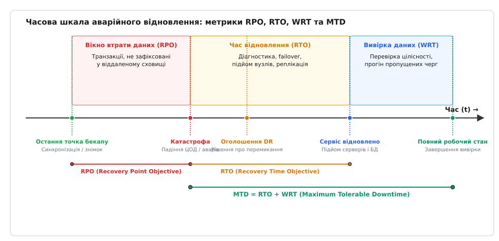
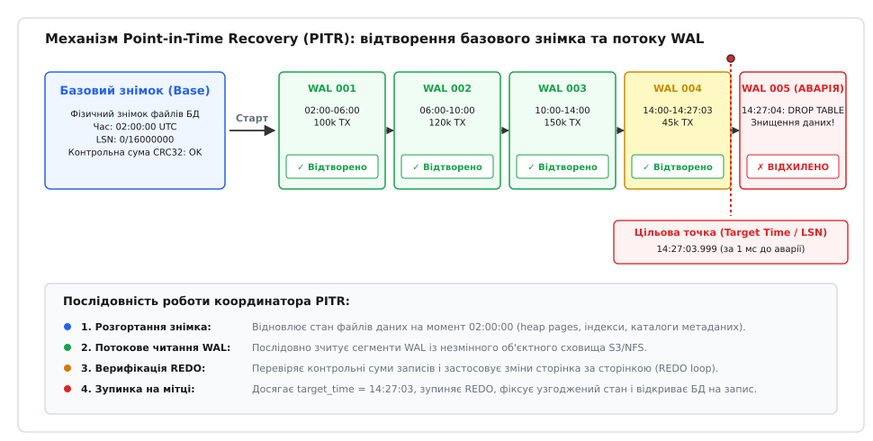
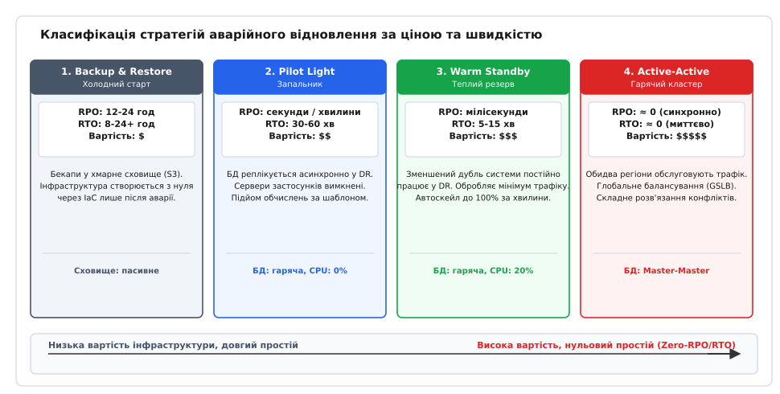
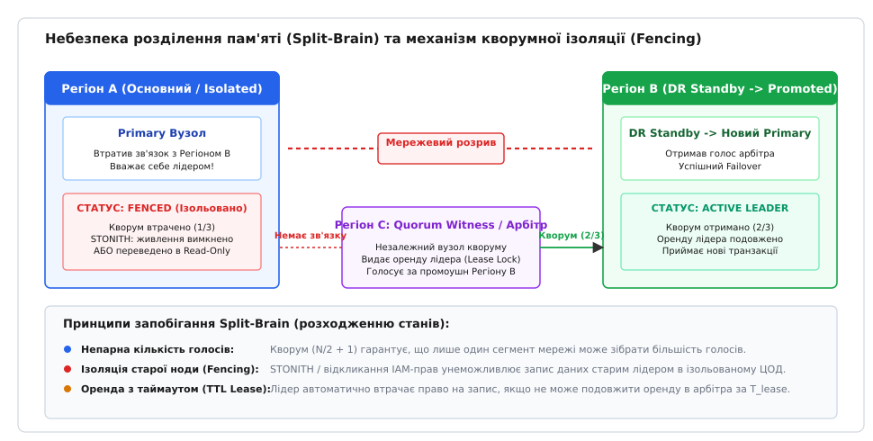

# Бекапи і DR

<preknowlist>
- [Журнал попереднього запису (WAL)](root:sf-data/write-ahead-log) — принцип попередньої фіксації мутацій у послідовний журнал перед зміною сторінок пам'яті.
- [Транзакції та ACID](root:sf-data/transactions-acid) — гарантії атомарності, узгодженості та довговічності стану бази даних.
- [Реплікаційний лаг і сесійні гарантії](root:sf-distributed/replication-lag) — природа затримки поширення журналу між вузлами в асинхронних системах.
- [Інфраструктура як код](root:sf-release/infrastructure-as-code) — декларативний опис та детерміноване відтворення обчислювальних ресурсів.
</preknowlist>

У ніч на 10 березня 2021 року у французькому місті Страсбург спалахнула пожежа в центрі обробки даних компанії OVHcloud. Вогонь повністю знищив чотириповерховий корпус SBG2 і вивів з ладу сусідній SBG1, перетворивши десятки тисяч серверів на розплавлений метал. Тисячі комерційних сайтів, платіжних шлюзів і банківських систем миттєво зникли з мережі. Найбільш нищівного удару зазнали ті організації, які вважали свій кластер «надійно зарезервованим», оскільки запустили реплікацію бази даних на сусідні стійки всередині того самого дата-центру або зберігали резервні копії на сусідньому мережевому накопичувачі: їхні основні сервери згоріли разом із репліками та резервними копіями, спричинивши безповоротну втрату терабайтів бізнес-даних.

Ця катастрофа унаочнила фундаментальну інженерну різницю між двома поняттями, які команди розробки часто помилково плутають: високою доступністю та аварійним відновленням. **Висока доступність (англ. *High Availability*, HA)** захищає систему від локальних збоїв окремих компонентів — відмови одного блоку живлення, деградації диска в масиві RAID або перезапуску окремого процесу операційною системою. Вона працює в межах мілісекунд завдяки синхронній реплікації та автоматичному вибору нового лідера. Натомість **аварійне відновлення (англ. *Disaster Recovery*, DR; від лат. *dis-* — згуба, руйнування та *astrum* — зірка, нещаслива доля)** проектується для виживання в умовах тотального знищення інфраструктури: фізичної загибелі цілого центру обробки даних, регіонального блекауту, стихійного лиха, масової атаки вірусів-шифрувальників або випадкового виконання руйнівного скрипту, який за частку секунди видалив таблиці на лідері та миттєво розмножився на всі активні репліки.

Висока доступність зберігає доступність у разі штатної поломки деталі. Аварійне відновлення зберігає саме життя бізнесу, коли зникло все середовище виконання.


*Часова шкала аварійного відновлення: метрики втрати даних (RPO), технічного відновлення інфраструктури (RTO) та повної вивірки бізнес-процесів (MTD = RTO + WRT)*

## Чотири метрики виживання: RPO, RTO, WRT та MTD

Будь-яке проектування аварійного відновлення починається не з вибору хмарних сервісів чи технологій дисків, а з формулювання чотирьох часових меж, які визначають допустимі межі шкоди для організації.

Першою критичною метрикою є **точка відновлення (англ. *Recovery Point Objective*, RPO)**. Вона визначає максимальний обсяг даних, виражений у часовому інтервалі, втрату якого організація здатна пережити без загрози своєму існуванню. Якщо база даних фіксує резервну копію раз на добу опівночі, а катастрофа сталася о 23:59, різниця між моментом останньої зафіксованої копії та моментом аварії складає 23 години 59 хвилин. Увесь цей масив замовлень, платежів і реєстрацій користувачів зникає назавжди. Показник RPO = 0 означає, що жодна підтверджена клієнту транзакція не може бути втрачена за жодних обставин, що вимагає синхронного міжрегіонального запису.

Другою метрикою є **час відновлення (англ. *Recovery Time Objective*, RTO)**. Це максимальний допустимий інтервал від моменту оголошення надзвичайної ситуації до моменту, коли інфраструктура резервного майданчика здатна приймати клієнтські запити. RTO включає діагностику проблеми, прийняття управлінського рішення про перемикання (англ. *failover*), автоматичне або ручне підняття віртуальних машин за шаблонами, розгортання образів контейнерів, перевірку цілісності баз даних і перемикання записів маршрутизації DNS або BGP.

Між моментом технічної готовності серверів і повноцінним поверненням сервісу до роботи лежить третій інтервал — **час вивірки та доопрацювання (англ. *Work Recovery Time*, WRT)**. Коли сервери вже піднялися у резервному регіоні, стан даних у них відстає на величину RPO, черги повідомлень містять пропущені події, а зовнішні платіжні шлюзи мають розбіжності за завислими транзакціями. Протягом WRT інженери запускають скрипти звірки балансів, проганяють журнали аудиту, усувають конфлікти транзакцій і відновлюють цілісність бізнес-логіки.

Сума часу технічного відновлення та часу вивірки формує граничний показник виживання — **максимально допустимий час простою (англ. *Maximum Tolerable Downtime*, MTD)**:

```
MTD ≥ RTO + WRT   [інваріант бізнес-виживання: повний час повернення до ладу не перевищує граничний ліміт]
```

Якщо фактична тривалість аварійних робіт перевищує MTD, компанія стикається з незворотними регуляторними санкціями, анулюванням ліцензій або банкрутством. Детальний математичний апарат залежності фінансових втрат від RPO і RTO, моделі розрахунку щільності транзакцій та алгоритми оптимізації вартості простою виведено в окремому розділі: [Математичні моделі RPO, RTO та вартості відновлення](root:sf-release/disaster-recovery/math-rpo-rto-and-cost.md).

## Анатомія резервного копіювання: від наївного копіювання до узгоджених знімків

Найпростіша інтуїція розробника підказує записати копію файлів бази даних звичайною командою копіювання файлової системи на кшталт `cp -r /var/lib/postgresql/data /backup`. Проте виконання цієї команди над працюючою реляційною або документоорієнтованою базою даних гарантовано призводить до створення пошкодженого, непридатного для відновлення сміття.

Причина полягає у розриві сторінок (англ. *torn pages*). Сучасні СКБД працюють із даними блоками фіксованого розміру (зазвичай 4 КБ або 8 КБ у PostgreSQL та 16 КБ в InnoDB MySQL), які кешуються в оперативній пам'яті (`buffer pool`). Коли процес `cp` зчитує 8-кілобайтну сторінку з диска, фоновий процес скидання буферів ядра СКБД (`checkpointer` або `page cleaner`) може перебувати посеред операції запису того самого блоку через виклики `write()`. У результаті утиліта копіювання зчитує перші 4 КБ старої версії сторінки та останні 4 КБ нової версії. Заголовок сторінки, покажчики на кортежі та контрольні суми перестають сходитися, що робить файл нечитабельним для рушія відновлення. Крім того, операція копіювання файлів триває хвилини або години: таблиця `orders`, скопійована о 02:00, посилатиметься на записи таблиці `payments`, зчитані о 02:15, руйнуючи посилальну цілісність і гарантії ізоляції.

Для отримання коректних резервних копій застосовують три принципово різні механізми.

### 1. Логічні дампи (Logical Backups)

Утиліти на зразок `pg_dump` або `mysqldump` підключаються до СКБД як звичайний клієнт, відкривають транзакцію з рівнем ізоляції `REPEATABLE READ` або `SERIALIZABLE` і вивантажують структуру та вміст таблиць у вигляді набору SQL-інструкцій (`CREATE TABLE`, `INSERT`, `COPY`).

*Переваги:* Логічний дамп незалежний від апаратної архітектури, версії операційної системи та розміру сторінки диска. Його можна розгорнути на новішій версії СКБД або використати для вибіркового відновлення окремої таблиці чи схеми.

*Недоліки:* Катастрофічно низька швидкість роботи. Для створення дампу на 2 ТБ сервер змушений прочитати всі записи, перетворити бінарні дані на текст і передати їх мережею. Відновлення вимагає повторного виконання мільйонів SQL-запитів, парсингу синтаксису, перевірки зовнішніх ключів і повної перебудови всіх індексів B-Tree з нуля, що збільшує RTO з хвилин до десятків годин.

### 2. Фізичні бінарні знімки (Physical Base Backups)

Фізичне копіювання переносить безпосередньо бінарні файли просторів таблиць (`heap files`), каталогів метаданих та системних журналів. Щоб уникнути пошкодження сторінок, перед початком копіювання СКБД переводиться у спеціальний режим (наприклад, функція `pg_backup_start()` у PostgreSQL):
1. СКБД виконує форсований чекпоінт, скидаючи всі брудні сторінки з оперативної пам'яті на диск.
2. Вмикається режим запису повних сторінок (англ. *full-page writes*): під час першої зміни будь-якої сторінки після чекпоінту її повний 8-кілобайтний образ записується у журнал випереджального запису (WAL).
3. Після цього зовнішня утиліта може безпечно копіювати файли бази даних. Навіть якщо `cp` зчитає розірвану сторінку, під час відновлення рушій виявить розбіжність контрольної суми та повністю замінить пошкоджену сторінку її еталонним образом із журналу WAL.
4. Після завершення копіювання викликається `pg_backup_stop()`, яка фіксує фінальний сегмент журналу.

### 3. Знімки файлових систем та блокових сховищ (Storage Snapshots)

Технологія Copy-on-Write (CoW) на рівні файлових систем (ZFS, Btrfs), менеджерів логічних томів (LVM) або хмарних блокових сховищ (AWS EBS, GCP Persistent Disk) дозволяє створювати знімки томів за мілісекунди. При створенні знімка блоки даних не дублюються: фіксується лише дерево метаданих покажчиків. Усі наступні зміни записуються у нові блоки, зберігаючи стан на момент створення знімка незмінним.

Щоб такий знімок гарантував узгодженість на рівні застосунку (англ. *application-consistent snapshot*), перед його створенням операційна система повинна заморозити скидання буферів файлової системи викликом `fsfreeze` або API віртуалізації, а після фіксації метаданих знімка — миттєво відновити операції вводу-виводу.

### Золоте правило 3-2-1 та його сучасна еволюція 3-2-1-1-0

Класичне правило резервного копіювання, сформульоване фотографом Пітером Кроґом і прийняте індустрією зберігання даних, вимагає:
- **3** копії даних (1 робочий оригінал і щонайменше 2 резервні копії);
- **2** різних типи носіїв (наприклад, швидкісні диски NVMe для оперативної роботи та об'єктне сховище або стрічкові картриджі LTO для архіву);
- **1** копія за межами основного майданчика (інший фізичний регіон або хмарний провайдер на відстані щонайменше 100 км для захисту від спільних географічних катастроф).

В епоху вірусів-вимагачів (Ransomware) та цілеспрямованих зламів інфраструктури це правило було розширене до стандарту **3-2-1-1-0**:
- **+1** копія в абсолютно незмінному сховищі (англ. *Immutable / WORM*) або ізольованому від мережі сховищі з фізичним розривом (англ. *Air-Gapped*);
- **0** помилок під час щоденного автоматичного відновлення резервних копій у тестовому пісочнику.

## Потокове відновлення до точки в часі (Point-in-Time Recovery)

Резервна копія, створена навіть кілька годин тому, не захищає від критичної людської або програмної помилки. Уявімо ситуацію: о 14:27 інженер під час ручного обслуговування бази даних помилково виконав команду `DROP TABLE users;` замість тестової схеми, або сервіс міграцій застосував некоректний DDL-скрипт.

Якщо відновити повний нічний бекап, створений о 02:00, система повернеться у стан дванадцятигодинної давнини, а всі транзакції клієнтів за поточний робочий день буде безповоротно втрачено. Якщо ж покластися на репліку високої доступності, вона виконає `DROP TABLE` через 2 мілісекунди після лідера.

Єдиним способом порятунку в такій ситуації є **відновлення до точного моменту в часі (англ. *Point-in-Time Recovery*, PITR)**.


*Потокове відновлення стану бази даних: застосування базового знімка та послідовне програвання сегментів журналу попереднього запису до точного моменту перед аварією*

### Механіка функціонування PITR

Фундаментом PITR є журнал попереднього запису [Журнал попереднього запису (WAL)](root:sf-data/write-ahead-log), у який СКБД послідовно та синхронно записує байтові зміни сторінок до їхньої фіксації на диску.

Процес реалізується через безперервне архівування журналів:
1. **Безперервна ротація сегментів:** Як тільки черговий файл журналу WAL (наприклад, розміром 16 МБ у PostgreSQL) заповнюється, фоновий процес `archiver` негайно завантажує його у віддалене об'єктне сховище (AWS S3, Google Cloud Storage, Ceph) за допомогою команди `archive_command`.
2. **Незмінність сегментів:** Кожен заархівований файл отримує унікальний мономерно зростаючий номер у послідовності LSN (англ. *Log Sequence Number*). Сегменти журналу доступні лише для читання.
3. **Алгоритм відновлення:**
   - Координатор аварійного відновлення бере останній доступний фізичний базовий знімок, створений ДО моменту аварії (наприклад, нічний бекап від 02:00:00).
   - Файли розгортаються на новому інстансі бази даних.
   - СКБД запускається в режимі відновлення (`standby_mode = on` або наявність маркера `recovery.signal`) і починає вичитувати збережені сегменти WAL зі сховища через команду `restore_command`.
   - Рушій послідовно виконує цикл повторення операцій (англ. *REDO loop*), накладаючи кожну зміну на сторінки даних і відновлюючи стан транзакція за транзакцією.
   - У конфігурації встановлюється цільовий критерій зупинки:
     ```ini
     recovery_target_time = '2026-08-20 14:27:03.999 UTC'
     recovery_target_action = 'promote'
     ```
   - Дійшовши до транзакції з міткою часу 14:27:03.999, СКБД негайно зупиняє процес відтворення журналу, ігноруючи наступний запис із `DROP TABLE`, скидає незавершені на цей момент транзакції через механізм відкату (`UNDO`), призначає новий таймлайн (англ. *Timeline ID*) і відкриває базу даних для читання та запису.

Повний цикл парсингу двійкових записів WAL, валідацію контрольних сум CRC32 та алгоритм відновлення мовами C і C++ продемонстровано у практичній роботі: [Реалізація рушія Point-in-Time Recovery](root:sf-release/disaster-recovery/proj-pitr-engine.md).

## Чотири стратегії аварійного відновлення: архітектура та компроміси

Вибір моделі міжрегіонального резервування завжди є компромісом між капітальними витратами на утримання простоюючого обладнання та ціною секунд простою бізнесу. Індустріальний стандарт класифікує стратегії DR на чотири чіткі архітектурні рівні.


*Чотири класичні моделі аварійного перемикання: баланс між фінансовими витратами на підтримку резерву та швидкістю повернення сервісу до життя*

### 1. Backup and Restore (Холодний старт)

Найбільш ощадлива стратегія: у вторинному регіоні взагалі немає запущених обчислювальних ресурсів або серверів баз даних. Усе, що існує в DR-зоні — це зашифровані резервні копії знімків дисків та сегменти WAL в об'єктному сховищі, репліковані між регіонами.

*Сценарій аварії:* Інженери запускають скрипти [Інфраструктура як код](root:sf-release/infrastructure-as-code) (Terraform, OpenTofu, Pulumi), які створюють віртуальні мережі, балансувальники, кластери Kubernetes, ініціалізують дискові томи, скачують гігабайти базових знімків, розгортають СКБД та підключають додатки.
- **RPO:** Від кількох годин до 24 годин (якщо немає потокового архівування WAL) або кілька хвилин (за наявності крос-регіонального S3).
- **RTO:** Від 4 до 24+ годин, оскільки створення сотень віртуальних машин і розгортання терабайтів даних вимагає значного часу.
- **Вартість:** Мінімальна (оплачується лише зберігання байтів).

### 2. Pilot Light (Запальник газової колонки)

Назва походить від аналогії з постійно палаючим гнотом газового котла: вогонь горить постійно, але весь теплообмінник вмикається лише тоді, коли відкривають кран гарячої води.

У DR-регіоні постійно працює мінімальне ядро збереження стану: репліка бази даних (часто меншого розміру, ніж на основному майданчику), яка безперервно приймає асинхронний потік реплікації. Усі обчислювальні вузли (воркери, API-сервери, мікросервіси) вимкнені або сконфігуровані з нульовою кількістю реплік (`replicas: 0`).

*Сценарій аварії:* Репліка бази даних підвищується до статусу лідера (`promote`), масштабується до повної потужності, після чого оркестратор за лічені хвилини піднімає контейнери з попередньо зібраних образів.
- **RPO:** Секунди або мілісекунди (обмежується реплікаційним лагом).
- **RTO:** Від 15 до 45 хвилин.
- **Вартість:** Помірна (утримання репліки БД та мінімального сховища).

### 3. Warm Standby (Теплий резерв)

У вторинному регіоні цілодобово працює повнофункціональна, але масштабована вниз копія всього продуктового середовища (наприклад, 20% від потужності основного кластера). Вона здатна приймати службовий трафік перевірки здоров'я, виконувати фонову аналітику тільки на читання або обслуговувати невелику частку реальних користувачів.

*Сценарій аварії:* Після фіксації відмови основного регіону балансувальники глобальної маршрутизації (GSLB) перенаправляють 100% трафіку на теплий сайт, одночасно активуючи політики горизонтального автоскейлінгу (HPA), які за 3–7 хвилин доводять кількість контейнерів і вузлів до повного робочого профілю.
- **RPO:** Частки секунди (асинхронна потокова реплікація).
- **RTO:** Від 2 до 10 хвилин.
- **Вартість:** Висока (постійна оплата 20–30% паралельної інфраструктури).

### 4. Multi-Region Active-Active (Гарячий дубль)

Найвищий рівень надійності: два або більше регіонів одночасно обслуговують 100% користувацького навантаження. Трафік балансується через Anycast BGP або геолокаційний DNS на базі вимірювання затримок. Кожен регіон володіє достатнім запасом потужності (`headroom`), щоб у разі раптового зникнення іншого регіону миттєво прийняти його навантаження без деградації затримок.

*Сценарій аварії:* Відбувається повністю прозоро для користувачів. Мережевий балансувальник знімає трафік із мертвого регіону протягом кількох секунд.
- **RPO:** ≈ 0 (за умови використання розподіленого консенсусу або мультилідерної реплікації).
- **RTO:** ≈ 0 (миттєве перемикання маршрутів).
- **Вартість:** Максимальна (подвоєння інфраструктури та складний інжиніринг). Вимагає розв'язання складних архітектурних викликів: вирішення міжрегіональних конфліктів паралельного запису (CRDT, Last-Write-Wins), подолання затримки світла у волокні (між континентами RTT складає 70–150 мс) та захисту від каскадного перевантаження працюючого регіону.

Про те, як інженерна думка рухалася від фізичного транспортування магнітних стрічок до сучасних глобальних хмарних кластерів, розповідає історична довідка: [Історія еволюції аварійного відновлення](root:sf-release/disaster-recovery/hist-evolution-of-dr.md).

## Протоколи перемикання, небезпека Split-Brain та ізоляція (Fencing)

Найбільш небезпечним моментом усьому життєвому циклі аварійного відновлення є процедура передачі лідерства — **аварійне перемикання (англ. *Failover*)**.

Уявімо типову топологію: Основний Регіон А (Primary) та Резервний Регіон Б (Standby). Між ними виникає трансконтинентальний розрив оптичного магістрального кабелю або мережевий поділ (англ. *network partition*). Регіон Б перестає отримувати пакети перевірки живості (`heartbeat`) від Регіону А.


*Запобігання розділенню кластера: використання третьої незалежної сторони для арбітражу оренди та примусової апаратної ізоляції відключеного вузла*

Якщо система моніторингу Регіону Б автоматично вирішить, що Регіон А загинув, і підвищить свій Standby до статусу Primary, виникає катастрофічний стан **розділення свідомості (англ. *Split-Brain*)**:
- Регіон А насправді живий і продовжує приймати запити від клієнтів західної півкулі, записуючи транзакції у свій локальний журнал.
- Регіон Б оголосив себе новим лідером і починає приймати запити від користувачів східної півкулі, генеруючи власні незіставні транзакції з тими самими ідентифікаторами.
- Історії даних двох баз безповоротно розходяться. Коли мережевий зв'язок відновиться, автоматично об'єднати дві бази даних без втрати бізнес-транзакцій буде математично неможливо.

### Механізми запобігання Split-Brain

Щоб унеможливити паралельне існування двох лідерів, розподілені системи використовують три фундаментальні інженерні механізми.

#### 1. Кворумний свідок у третьому регіоні (Quorum Witness / Third-Party Arbitrator)
Кластер повинен складатися з непарної кількості голосуючих сторін. Якщо основні бази розміщені у Регіоні А та Регіоні Б, легковажний арбітр (Witness без збереження даних, наприклад вузол Consul або etcd) розміщується у незалежному Регіоні В. Для проголошення лідерства вузол зобов'язаний зібрати більшість голосів:

```
Quorum = ⌊N / 2⌋ + 1   [інваріант більшості: для N=3 кворум вимагає щонайменше 2 незалежні голоси]
```

Якщо Регіон А виявився повністю ізольованим від решти світу, він бачить лише 1 голос із 3 і зобов'язаний добровільно зняти з себе повноваження лідера, заблокувавши операції запису. Тим часом Регіон Б, маючи зв'язок з арбітром у Регіоні В, збирає 2 голоси з 3 (кворум досягнуто) і безпечно стає новим лідером.

#### 2. Примусова апаратна ізоляція (Fencing / STONITH)
Принцип активного огородження (англ. *Node Fencing*) ґрунтується на концепції **STONITH** (акронім від *Shoot The Other Node In The Head* — «вистрелити іншому вузлу в голову»). Перш ніж Standby отримає право відкрити базу даних на запис, координатор відправляє команду апаратного відключення старої ноди через інтерфейси віддаленого керування живленням (IPMI, iLO, PDU) або викликає хмарне API, яке примусово відкликає права доступу інстансу до дисків та мережі. Лише після отримання підтвердження, що старий лідер фізично знеструмлений або позбавлений мережевих інтерфейсів, новий лідер розпочинає обслуговування запитів.

#### 3. Оренда з обмеженим терміном дії (TTL Lease Locks)
Лідер володіє правом прийому запитів не безстроково, а на основі тимчасової оренди (наприклад, на 5 секунд), яку він зобов'язаний безперервно оновлювати у розподіленому сховищі консенсусу. Якщо зв'язок переривається і лідер не може оновити оренду за відведений інтервал `T_lease`, він гарантовано переводить себе в стан `Read-Only` ще до того, як Standby отримає право перехопити звільнену оренду.

### Проблема зворотного перемикання (Failback)

Повернення системи до попереднього стану після усунення аварії (англ. *Failback*) часто є значно складнішою інженерною операцією, ніж первинний Failover.

Коли Регіон А відновлює роботу після пожежі чи збою мережі, він має застарілий стан даних, тоді як нові транзакції за час аварії записувалися в Регіоні Б. Прямий перезапуск лідера в Регіоні А миттєво знищить нові дані. Протокол зворотного повернення вимагає:
1. Заборонити старому майданчику відкриватися на запис.
2. Змінити напрямок потоку реплікації: Регіон Б стає тимчасовим джерелом правди, а Регіон А — його фоловером.
3. Виконати диференційну синхронізацію файлів або застосувати відсутні сегменти WAL за допомогою утиліт швидкого перемотування (наприклад, `pg_rewind`).
4. Дочекатися, поки лаг реплікації між Б і А зменшиться до нуля.
5. У планове технологічне вікно виконати штатне перемикання: заблокувати запис на Б, дочекатися скидання буферів, зробити А новим лідером і повернути маршрутизацію DNS.

## Захист від зловмисників та шифрувальників: WORM і повітряні зазори

Сучасні катастрофи все частіше спричиняються не природними стихіями чи апаратними збоями, а атаками кіберзлочинців і внутрішніх саботажників. Типовий сценарій атаки вірусів-вимагачів (Ransomware) виглядає так: зловмисники місяцями перебувають у мережі підприємства, компрометують облікові записи адміністраторів хмари, знаходять сервери резервного копіювання, одночасно шифрують або видаляють усі бекапи та знімки дисків і лише після цього шифрують продуктивні бази даних.

Якщо резервна копія доступна для запису або видалення обліковим записом адміністратора домену, **вона не є резервною копією**.

Для гарантованого захисту від такого класу загроз впроваджують два рівні ізоляції:

### 1. Незмінні сховища з моделлю WORM (Write Once, Read Many)

Технологія Object Lock (наприклад, в AWS S3, Azure Blob або MinIO) блокує будь-які операції модифікації чи видалення збережених об'єктів протягом наперед визначеного періоду утримання (англ. *Retention Period*).

Існує два режими блокування:
- **Governance Mode:** Блокування може бути зняте лише користувачем зі спеціальними привілейованими правами IAM.
- **Compliance Mode (Суворий регуляторний режим):** Об'єкт не може бути видалений або перезаписаний **жодним користувачем, включаючи обліковий запис root організації та службу підтримки хмарного провайдера**, доки не завершиться встановлений часовий таймер (наприклад, 90 днів). Навіть повне видалення хмарного акаунта блокується до завершення терміну зберігання захищених об'єктів.

### 2. Логічні та фізичні повітряні зазори (Air-Gapping)

Принцип повітряного зазору вимагає повної ізоляції сховища резервних копій від продуктивного контуру безпеки:
- **Окремий акаунт хмари:** Резервні копії реплікуються в цільовий хмарний акаунт або підписку, яка належить іншому дереву організаційного управління, має власну незалежну систему автентифікації (ніякого спільного SSO / Active Directory) та вимагає мультифакторної автентифікації з апаратними ключами безпеки (FIDO2 / YubiKey) від різних офіцерів безпеки.
- **Одностороння передача (One-Way Push / Pull):** Продуктивний контур має право лише записувати нові об'єкти за моделлю «Append-Only», але не має жодних прав на читання, перегляд списку чи видалення з віддаленого сховища. В ідеальному варіанті сервер бекапу сам періодично підключається через ізольований мікротунель, забирає копію та негайно розриває з'єднання.

Повний перелік декларативних специфікацій для налаштування S3 Object Lock, конфігураційного синтаксису контурів безпеки та протоколів перемикання наведено в довіднику: [Специфікації конфігурації аварійного відновлення та політик незмінності](root:sf-release/disaster-recovery/api-dr-runbook-and-config.md).

## Інваріант Шредінгера та культура автоматичних GameDays

В інженерії експлуатації діє непорушний закон: **стан будь-якого резервного копіювання залишається невідомим, доки ви не спробували відновити з нього працюючу систему**. Це так званий «бекап Шредінгера»: резервна копія одночасно існує і не існує, доки її цілісність не перевірена реальною операцією розгортання.

Сотні компаній щороку зазнають краху, маючи терабайти щоденних резервних копій, тому що в день реальної аварії з'ясовується:
- Резервний скрипт пів року записував порожні нульові байти через помилку в конвеєрі `tar | gzip`;
- Пароль від закритого ключа шифрування бекапу був загублений під час реорганізації команди;
- У бекапі збереглися всі таблиці, окрім послідовностей автоінкременту `SEQUENCE`, через що застосунок падає з `Duplicate Key Error` на першому ж новому запиті;
- Нова версія СКБД нездатна прочитати бінарний формат файлів дворічної давності.

Єдиним способом подолання цієї невизначеності є побудова **конвеєра безперервної верифікації відновлення (англ. *Continuous Restore Verification*)**.

```
Розклад (щодня о 03:00) 
  → Створення ізольованої віртуальної машини / поду
  → Завантаження останнього базового знімка та журналів WAL
  → Повне прокручування REDO loop до фінальної точки
  → Запуск набору валідаційних тестів (Smoke Tests / Data Invariants)
  → Звірка контрольних сум ключових таблиць
  → Знищення тестового середовища
  → Відправка метрики в Prometheus: backup_restore_success = 1
```

Крім машинної перевірки даних, стійкість організації вимагає регулярного проведення навчань — **GameDays** (або навчань хаос-інженерії, споріднених із [Хаос-інженерія](root:sf-release/chaos-engineering)):
1. Інженери моделюють повне відключення одного з хмарних регіонів без попередження чергової зміни.
2. Відпрацьовується комунікація команди реагування на інциденти згідно з [Реагування на інциденти](root:sf-release/incident-response).
3. Перевіряється актуальність інструкцій аварійного відновлення (англ. *Runbooks*).
4. Фіксується реальний хронометраж виконання кожного кроку та порівнюється із задекларованим SLA/SLO за стандартом [SLI/SLO/SLA і бюджет помилок](root:sf-release/slo-sli-sla).
5. За підсумками тренування складається відкритий аналітичний звіт без пошуку винних згідно з принципами [Постмортем без винних](root:sf-release/postmortems), а виявлені прогалини в автоматизації оформлюються як пріоритетні інженерні завдання.

> 🔧 **Навіщо це.**
> В аварійному відновленні немає місця припущенням. Неперевірений бекап не є захистом, відсутність тестування міжрегіонального перемикання гарантує тривалий простій під час реальної катастрофи, а реплікація бази даних без захисту від Split-Brain знищує узгодженість швидше, ніж фізична пожежа. Надійна система DR будується на трьох непорушних інваріантах: збереження журналів WAL на незмінних WORM-носіях за межами основного регіону, автоматичне щоденне розгортання бекапів у тестовому пісочнику та регулярне тренування команди на живих симуляціях відмови інфраструктури.
