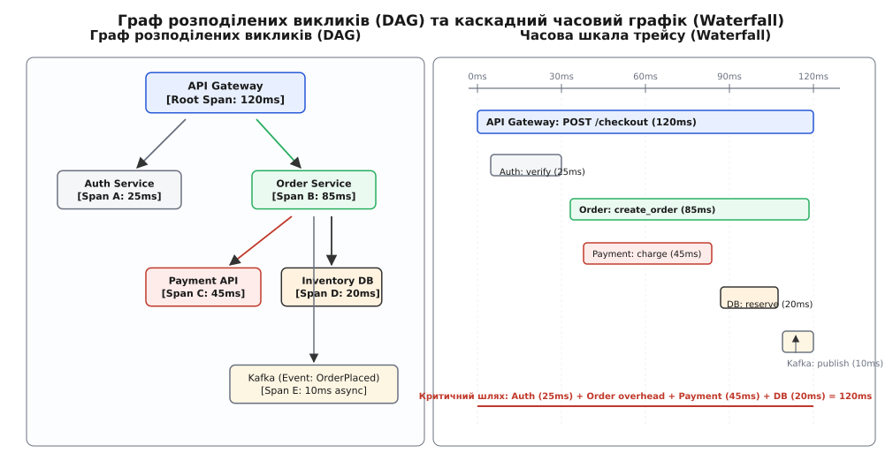
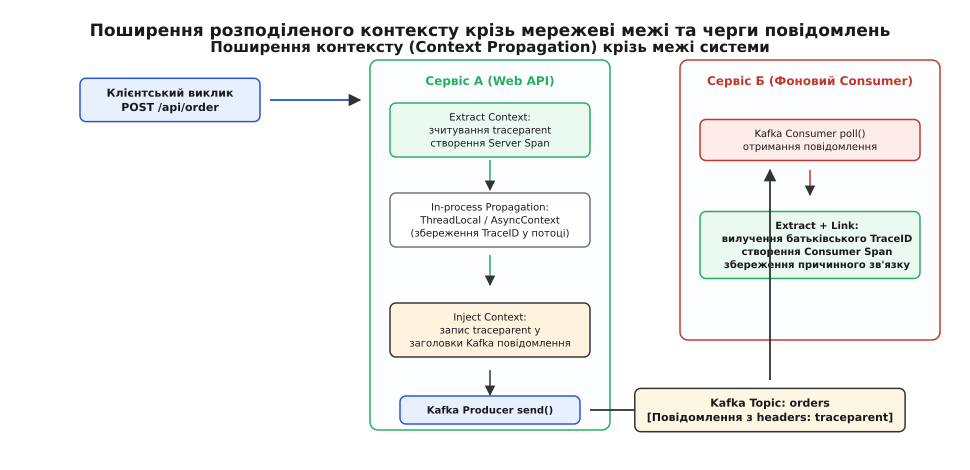
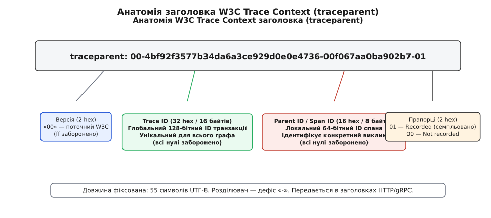
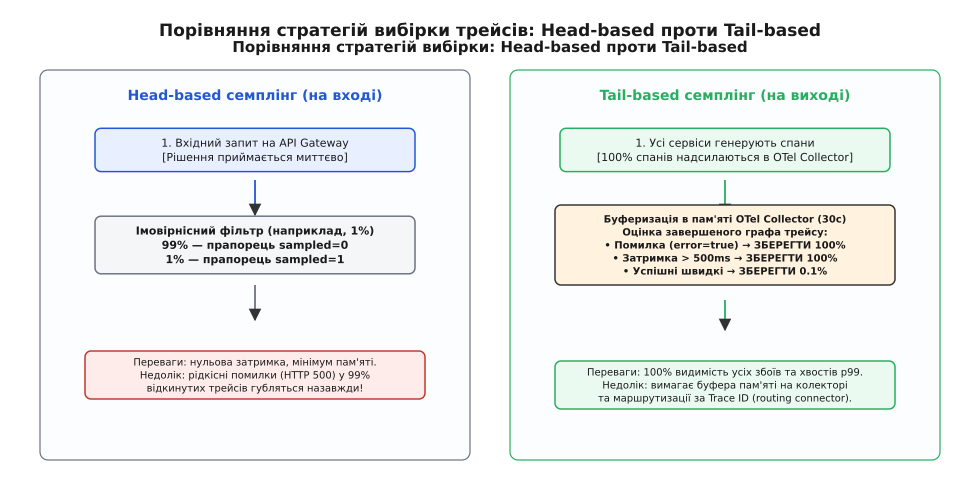
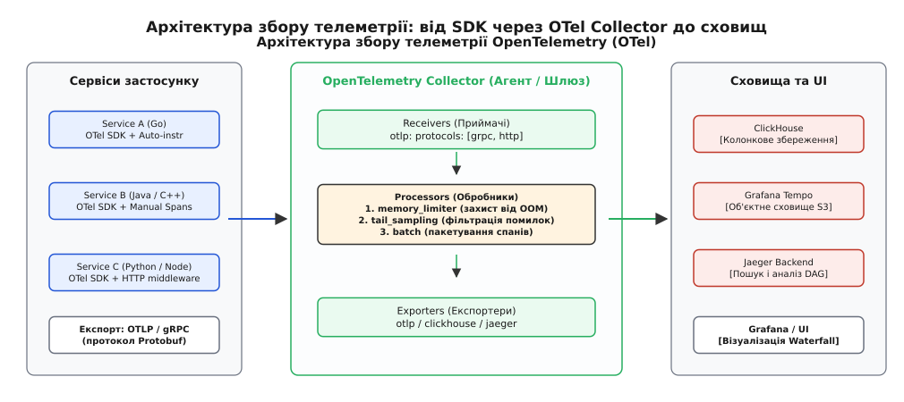

# Розподілений трейсинг

<preknowlist>
- [Структуровані логи](root:sf-release/structured-logging) — машинночитні записи подій у форматі ключ-значення для фіксації стану вузла.
- [Метрики](root:sf-release/metrics-monitoring) — числові часові ряди (лічильники, гістограми затримок) для фіксації системних аномалій.
- [SLI/SLO/SLA і бюджет помилок](root:sf-release/slo-sli-sla) — кількісні цілі доступності та затримок сервісів.
- [HTTP-кешування: Cache-Control, ETag й умовні запити](root:com-protocol/http-caching) — обмін метаданими й контекстом через мережеві HTTP-заголовки.
</preknowlist>

У великому інтернет-магазині під час святкового розпродажу клієнт натискає кнопку оформлення замовлення (`POST /api/v1/checkout`). Замість звичних сорока мілісекунд операція зависає на 3.8 секунди і повертає користувачеві помилку HTTP 504 Gateway Timeout. У системі моніторингу черговий інженер бачить червоний алерт: дев'яносто дев'ятий перцентиль затримки API Gateway підскочив у десять разів. Проте агреговані метрики фіксують лише сам факт загальної деградації і не здатні відповісти, де саме виникла затримка. 

Під капотом один запит на оформлення замовлення каскадом породжує понад сорок синхронних та асинхронних викликів: шлюз звертається до сервісу автентифікації, той перевіряє сесію в Redis, далі викликається сервіс кошика, сервіс знижок, шлюз платіжного провайдера, сервіс перевірки залишків на складі, реляційна база даних PostgreSQL та топік Apache Kafka для сповіщення складської системи. 

У журнальних сховищах у цей момент накопичується п'ятдесят тисяч рядків логів на секунду від двадцяти різних мікросервісів. Логи кожного окремого сервісу виглядають бездоганно: кожен інстанс рапортує, що його локальний обробник відпрацював за кілька мілісекунд. Інженери опиняються перед класичною проблемою «чорної скриньки» розподілених систем: оскільки сервери мають незалежні адресні простори, а їхні системні годинники розходяться на десятки мілісекунд через дрейф NTP, відновити точну хронологію та причинно-наслідковий ланцюг транзакції виключно за розрізненими логами стає математично неможливо.

## Концептуальна модель: Спрямований ациклічний граф (DAG)

Розподілений трейсинг (англ. *distributed tracing*) вирішує проблему діагностики мікросервісів шляхом перетворення кожного клієнтського запиту на структурований **спрямований ациклічний граф (Directed Acyclic Graph, DAG)**, вершинами якого є окремі операції, а ребрами — причинно-наслідкові зв'язки між ними.


*Граф розподілених викликів (DAG) та каскадний часовий графік (Waterfall).*

Базовою одиницею графа є **спан (англ. *span* — відрізок, інтервал)**. Спан представляє неподільний фрагмент роботи, виконаний конкретним сервісом за фіксований проміжок часу. Сукупність усіх спанів, породжених одним початковим запитом, формує єдиний **трейс (англ. *trace* — слід)**.

### Анатомія та поля спана

Кожен спан у системі містить фіксований набір стандартизованих метаданих:
1. **Trace ID (Ідентифікатор трейсу):** глобально унікальне 128-бітне число (32 шістнадцяткових символи). Генерується першим вхідним сервісом і залишається абсолютно незмінним під час проходження запиту крізь сотні проміжних вузлів.
2. **Span ID (Ідентифікатор спана):** унікальне 64-бітне число (16 шістнадцяткових символів), що ідентифікує конкретну поточну дію (наприклад, виконання SQL-запиту).
3. **Parent Span ID (Ідентифікатор батька):** 64-бітне посилання на `Span ID` операції, яка ініціювала поточний виклик. У кореневого спана (`Root Span`), створеного на зовнішньому шлюзі, це поле залишається порожнім.
4. **Operation Name (Назва операції):** короткий текстовий опис виконуваної дії з низькою кардинальністю (наприклад, `HTTP GET /orders/{id}` або `pg_query: select_users`).
5. **Часові мітки (Timestamps):** час початку (`StartTime`) та час завершення (`EndTime`) операції з точністю до наносекунд за шкалою UTC.
6. **Статус операції (Status Code):** результат виконання, що приймає одне з трьох нормалізованих значень:
   * `UNSET (0)` — стан за замовчуванням (робота завершена штатно);
   * `OK (1)` — явне підтвердження успішного завершення бізнес-операції;
   * `ERROR (2)` — зафіксовано критичний збій або аварійне завершення.
7. **Атрибути (Attributes):** структуровані пари ключ-значення, що несуть діагностичний контекст (`http.status_code = 500`, `db.system = "postgresql"`, `net.peer.name = "10.0.4.12"`).
8. **Події (Events / Logs):** внутрішньоспанові структуровані мітки часу для фіксації точкових подій без створення окремого дочірнього спана (наприклад, `cache_miss` або `lock_acquired`).
9. **Зв'язки (Links):** посилання на контексти сторонніх трейсів для моделювання сценаріїв пакетної обробки (Batching) або асинхронного злиття потоків даних (Fan-in).

### Типи спанів (Span Kinds) та подвійний вимір затримок

У розподіленій архітектурі один мережевий виклик завжди породжує пару взаємопов'язаних спанів:
* **Клієнтський спан (`CLIENT`):** відкривається сервісом-ініціатором безпосередньо перед відправкою байтів у сокет і закривається після повного отримання відповіді. Його тривалість включає час перебування в черзі сокета, мережеву затримку в обидва боки (Round-Trip Time, RTT) та час обробки сервером.
* **Серверний спан (`SERVER`):** відкривається сервісом-одержувачем у момент вичитування HTTP-запиту і закривається після відправки заголовків відповіді. Його тривалість відображає чистий час виконання серверної бізнес-логіки.

Різниця між тривалістю клієнтського та серверного спанів:

```
Мережева затримка (RTT + Buffering) = Duration(CLIENT) - Duration(SERVER)
```

Ця формула дозволяє миттєво відрізнити деградацію мережевої інфраструктури (падіння пропускної здатності комутаторів або втрата TCP-пакетів) від перевантаження центрального процесора на цільовому сервері.

Для асинхронних архітектур стандарт виділяє типи `PRODUCER` (публікація повідомлення в брокер) та `CONSUMER` (вичитування та обробка повідомлення воркером). Різниця між `CONSUMER.StartTime` та `PRODUCER.EndTime` показує точний час очікування завдання в черзі (Queue Dwell Time).

Історичну еволюцію розподіленого трейсингу від академічних проєктів Magpie та X-Trace через інженерний прорив Google Dapper до формування відкритого стандарту детально розібрано у вставці [📜 Історія від Magpie і Dapper до OpenTelemetry та W3C](root:sf-release/distributed-tracing/hist-dapper-and-opentelemetry.md).

## Поширення контексту (Context Propagation)

Щоб сервіси могли побудувати єдине дерево викликів, інформація про поточний `Trace ID` та `Span ID` повинна передаватися разом із мережевим трафіком. Цей процес називається **поширенням контексту (англ. *context propagation*)**.

Поширення контексту реалізується за патерном **«Впровадження та вилучення» (Inject / Extract)**:
* **Клієнтська сторона (Inject):** перед відправкою вихідного виклику HTTP-клієнт або gRPC-інтерцептор серіалізує поточний стан трейсу у службові заголовки пакета (HTTP Headers або gRPC Metadata).
* **Серверна сторона (Extract):** вхідний мідлвар веб-сервера зчитує заголовки, відновлює структуру контексту в локальній пам'яті потоку, генерує новий унікальний `Span ID` і призначає вилучений ідентифікатор своїм `Parent Span ID`.


*Поширення розподіленого контексту крізь мережеві межі та черги повідомлень.*

### Міжнародний стандарт W3C Trace Context

До 2020 року системи трейсингу страждали від несумісності заголовків (Zipkin використовував `X-B3-TraceId`, Jaeger — `uber-trace-id`, AWS — `X-Amzn-Trace-Id`). Консорціум W3C стандартизував єдиний протокол передачі контексту — **W3C Trace Context**, що складається з двох ключових HTTP-заголовків:


*Анатомія заголовка W3C Trace Context (traceparent).*

1. **`traceparent`:** компактний 55-символьний ASCII-рядок строго фіксованого формату:
   ```http
   traceparent: 00-4bf92f3577b34da6a3ce929d0e0e4736-00f067aa0ba902b7-01
   ```
   * `00` — версія специфікації (1 байт);
   * `4bf92f3577b34da6a3ce929d0e0e4736` — глобальний Trace ID (16 байтів, 32 hex-символи);
   * `00f067aa0ba902b7` — Parent Span ID (8 байтів, 16 hex-символів);
   * `01` — прапорці трейсу Trace Flags (8-бітова маска, де біт `0x01` вказує на статус `Recorded`).

2. **`tracestate`:** непрозорий список пар `key=value`, призначений для безпечної передачі специфічних метаданих окремих платформ моніторингу (наприклад, внутрішніх ідентифікаторів маршрутизації) через проміжні сторонні шлюзи.

3. **`baggage`:** стандартизований заголовок W3C Baggage для передачі користувацьких бізнес-атрибутів (наприклад, `tenant_id=enterprise_12` або `user_role=admin`) вздовж усього дерева викликів. На відміну від атрибутів спана, які залишаються локальними для одного вузла, елементи Baggage автоматично копіюються в усі подальші дочірні спани на всіх рівнях архітектури.

Повну специфікацію бітових прапорців, правила мутації заголовків та нормалізовані семантичні конвенції OpenTelemetry наведено у довіднику [📋 Специфікація W3C Trace Context та семантичні конвенції OpenTelemetry](root:sf-release/distributed-tracing/api-w3c-trace-context.md).

Практичну низькорівневу реалізацію парсера `traceparent` мовами C, C++, Go та TypeScript із нульовим виділенням динамічної пам'яті продемонстровано у вставці [⚙️ Практикум: реалізація W3C Trace Context пропагатора та Span-контексту](root:sf-release/distributed-tracing/proj-context-propagator.md).

## Інтеграція трьох стовпів: Трейси, Метрики та Логи

Розподілений трейсинг не існує у вакуумі — він є сполучною тканиною для решти компонентів спостережуваності:

### 1. Зв'язок метрик із трейсами через Exemplars
У традиційному моніторингу гістограма затримок показує, що 1% запитів тривав понад дві секунди. Але інженер не міг дізнатися, які саме користувачі зіткнулися з цією затримкою. Механізм **Exemplars** додає посилання на конкретний `Trace ID` безпосередньо у кошик гістограми метрики Prometheus. При натисканні на точку графіку латентності у Grafana користувач миттєво переходить до повного водоспаду трейсу даного аномального запиту.

### 2. Кореляція логів за допомогою Trace ID
Структуровані логери (Logback, Zap, Winston, Serilog) автоматично вилучають поточний `Trace ID` та `Span ID` з контексту потоку (MDC — Mapped Diagnostic Context) і додають їх до кожного JSON-рядка:

```json
{
  "timestamp": "2026-08-20T01:30:00.125Z",
  "level": "ERROR",
  "service": "payment-gateway",
  "trace_id": "4bf92f3577b34da6a3ce929d0e0e4736",
  "span_id": "00f067aa0ba902b7",
  "message": "Bank API connection timeout"
}
```

У сховищі логів (Kibana/Loki) запит за єдиним `trace_id` миттєво повертає всі логи від двадцяти незалежних сервісів, вишикувані у хронологічному порядку.

### 3. Прокидання контексту в бази даних (SQLCommenter)
Щоб пов'язати трейс із повільними запитами в журналах PostgreSQL або MySQL (`slow_query_log`), драйвери застосовують стандарт SQLCommenter. Запит перед відправкою доповнюється коментарем:

```sql
SELECT * FROM orders WHERE user_id = 42 /*traceparent='00-4bf92f3577b34da6a3ce929d0e0e4736-00f067aa0ba902b7-01',service='order-api'*/;
```

Адміністратор бази даних бачить у системних таблицях `pg_stat_activity` конкретний мікросервіс та ідентифікатор транзакції, що ініціювали важке блокування рядків.

## Асинхронні черги та реактивні патерни взаємодії

Коли система переходить від синхронних HTTP/RPC-викликів до подієво-орієнтованої архітектури (Event-Driven Architecture), деревоподібна модель трейсу зазнає суттєвих трансформацій:

### 1. Розчеплення транзакцій через Kafka / RabbitMQ
Під час публікації повідомлення сервіс `order-service` створює спан типу `PRODUCER` і записує заголовок `traceparent` у метадані повідомлення брокера. Коли фоновий консьюмер зчитує повідомлення, виникає дилема:
* **Синхронний ланцюг:** якщо обробка повідомлення є прямим продовженням дії користувача (наприклад, списання коштів), консьюмер створює дочірній спан типу `CONSUMER` із прямим посиланням на `ParentSpanId`. Трейс лишається єдиним.
* **Асинхронний Fan-Out:** якщо одне повідомлення `OrderPlaced` зчитується одночасно десятьма різними мікросервісами (розсилка email, аналітика, склад, антифрод, рекомендації), кожен сервіс створює власний незалежний трейс, посилаючись на оригінальну транзакцію за допомогою об'єкта **`SpanLink`**. Це запобігає перетворенню одного трейсу на гігантське нечитабельне дерево з тисяч спанів.

### 2. Ідемпотентність проти ідентифікатора трейсу
Важливо не плутати бізнес-ключ ідемпотентності (Idempotency Key) та ідентифікатор трейсу `TraceID`:
* **Idempotency Key:** захищає від повторного виконання операції (наприклад, подвійного списання грошей) при повторних спробах (Retries);
* **TraceID:** відстежує кожну окрему мережеву спробу. Якщо клієнт виконав 3 спроби відправки платежу через таймаути, інженер побачить 3 незалежні спани виклику банку з однаковим Idempotency Key, що дозволяє оцінити якість роботи мережевих ретраїв.

## Стратегії вибірки (Sampling): подолання лавини даних

У системах із навантаженням у сотні тисяч запитів на секунду збереження 100% спанів призводить до колапсу мережі та гігантських рахунків за дискові сховища. Виникає необхідність фільтрації — **семплювання (англ. *sampling*)**.

В індустрії застосовуються дві фундаментально різні моделі вибірки:


*Порівняння стратегій вибірки трейсів: Head-based проти Tail-based.*

### 1. Семплювання на вході (Head-based Sampling)
Рішення про запис або відкидання трейсу приймається **найпершим сервісом (API Gateway)** у момент надходження запиту — до того, як почнеться виконання основної бізнес-логіки.

* **Імовірнісний метод (Probabilistic):** генерується псевдовипадкове число від 0 до 1. Якщо воно менше за поріг (наприклад, `s = 0.01` для 1% вибірки), у заголовку виставляється біт `trace-flags = 01`. Усі наступні сервіси бачать цей біт і автоматично зберігають власні спани.
* **Обмеження швидкості (Rate Limiting):** фіксується ліміт записів (наприклад, не більше 50 трейсів на секунду) за алгоритмом Token Bucket.
* **Переваги:** нульові накладні витрати на оперативну пам'ять, відсутність потреби в буферизації даних на проміжних вузлах.
* **Головний недолік (Сліпота до рідкісних збоїв):** якщо критична помилка виникає в одному випадку на десять тисяч запитів, за 1% семплінгу ймовірність того, що помилковий запит потрапить саме у відібраний 1% трафіку, мізерно мала. У 99% випадків інженери втрачають трейс аварії.

### 2. Семплювання на виході (Tail-based Sampling)
Рішення про збереження приймається **після повного завершення транзакції** на рівні спеціалізованого кластера проксі-серверів (OpenTelemetry Collector).

* **Механізм:** усі мікросервіси генерують спани для 100% трафіку і надсилають їх у локальний OTel Collector. Колектор утримує спани в буфері пам'яті протягом 10–30 секунд, очікуючи завершення всіх гілок транзакції.
* **Правила фільтрації (Policies):**
  * Якщо хоча б один спан у дереві містить помилку (`status.code == ERROR` або `http.status_code >= 500`) → **зберегти 100% спанів цього трейсу**;
  * Якщо тривалість запиту перевищує критичний поріг (`duration > 1500ms`) → **зберегти 100% спанів цього трейсу**;
  * Для швидких і безпомилкових запитів застосувати вибірку 0.1% (1 з 1000).
* **Переваги:** стовідсоткова видимість усіх аномалій, збоїв та екстремальних затримок `p99.9` за мінімального розміру фінального сховища.
* **Ціна:** вимагає виділення оперативної пам'яті для буферизації на рівні колекторів та маршрутизації всіх спанів одного `Trace ID` на один і той самий інстанс колектора (Consistent Hashing).

Математичне виведення ймовірностей детекції збоїв, оцінку спотворення перцентилів затримок та доведення незміщеності відновлення популяційних метрик за теоремою Горвіца-Томпсона наведено у вставці [🧮 Статистика вибірки: ймовірнісний head-sampling проти tail-sampling та похибка перцентилів](root:sf-release/distributed-tracing/math-tail-sampling-and-loss.md).

## Архітектура конвеєра OpenTelemetry (OTel)

Сучасним загальноприйнятим стандартом збору, обробки та експорту розподіленої телеметрії є екосистема **OpenTelemetry (OTel)** під егідою фонду Cloud Native Computing Foundation (CNCF).


*Архітектура збору телеметрії: від SDK через OTel Collector до сховищ.*

Архітектура конвеєра телеметрії складається з трьох ключових рівнів:

### 1. Рівень інструментації застосунків (In-App SDK)
Застосунки підключають бібліотеки OpenTelemetry SDK, які інтегруються у стек виконання двома шляхами:
* **Автоматична інструментація (Auto-instrumentation):** маніпуляція байткодом у рантаймі (Java Agent, .NET CLR Profiler), мавпування функцій (Monkey Patching у Node.js/Python) або перехоплення системних викликів ядра Linux через **eBPF**. Автоматично створює спани для всіх вхідних HTTP-запитів, викликів клієнтів баз даних та брокерів повідомлень без зміни коду застосунку.
* **Ручна інструментація (Manual API):** розробники явно відкривають спани за допомогою об'єкта `Tracer` для виділення важливих ділянок бізнес-домену (наприклад, валідація кошика або розрахунок кредитного скорингу).

### 1.1. Революція eBPF: інструментація на рівні ядра ОС

Найновішим напрямом розвитку інструментації є використання технології **eBPF (Extended Berkeley Packet Filter)** у ядрі Linux (проєкти OpenTelemetry eBPF Profiler, Grafana Beyla, Pixie):
* **Принцип дії:** програми eBPF завантажуються в ядро операційної системи і перехоплюють системні виклики введення-виведення (`sys_enter_write`, `sys_enter_read`, `tcp_sendmsg`) або підключаються до простору користувача через динамічні зонди `uprobes` на рівні спільних бібліотек TLS (OpenSSL, BoringSSL).
* **Автоматичний вимір без зміни коду (Zero-Code Instrumentation):** eBPF зчитує незашифровані HTTP-заголовки, методи та статус-коди безпосередньо перед шифруванням сокета. Це дозволяє отримувати повноцінні спани для монолітних бінарних файлів на C, C++, Rust або Go без модифікації коду, без перекомпіляції та без підключення сторонніх SDK.
* **Обмеження:** eBPF ідеально вимірює мережеві протоколи L7 (HTTP, gRPC, Redis, MySQL), проте не здатний бачити внутрішню бізнес-логіку або значення доменних змінних у пам'яті процесу без наявності таблиць налагоджувальних символів DWARF.

### 2. Проміжний агент: OpenTelemetry Collector
OTel Collector — це високопродуктивний проксі-сервер на мові Go, що розгортається як Sidecar-контейнер поруч із кожним сервісом або як незалежний масштабований кластер шлюзів.

Конвеєр обробки всередині колектора складається з трьох послідовних компонентів:
* **Receivers (Приймачі):** слухають мережеві порти і приймають дані різними протоколами (OTLP/gRPC на порту 4317, OTLP/HTTP на порту 4318, Zipkin, Jaeger, Prometheus).
* **Processors (Обробники):** виконують пакетування (`batch`), захист від вичерпання пам'яті (`memory_limiter`), знеособлення конфіденційних персональних даних PII (`transform` через мову OTTL) та фільтрацію (`tail_sampling`).
* **Exporters (Експортери):** перетворюють дані в цільовий формат і відправляють у сховища через стійкі пули з'єднань із підтримкою повторних спроб (Retries) та експоненційного відкату (Exponential Backoff).

### 3. Сховища та архітектура бекендів
Вибір бекенда для зберігання трейсів визначає вартість та швидкість пошуку:
* **Grafana Tempo:** використовує безіндексну модель на базі об'єктних сховищ (Amazon S3, Google Cloud Storage, MinIO). Трейси упаковуються у стиснені блоки Parquet/Zstd. Забезпечує на 80–90% меншу вартість зберігання порівняно з реляційними базами за рахунок пошуку за `Trace ID` через бінарний покажчик блоку.
* **ClickHouse:** потужна колонкова СУБД для аналітичних агрегацій. Завдяки сортувальним ключам `(service_name, operation_name, start_time)` та фільтрам Блума на спан-атрибутах дозволяє миттєво виконувати складні SQL-запити на кшталт «показати розподіл латентності для користувачів із Франції, у яких статус-код дорівнював 500».
* **Jaeger / Cassandra:** класична розподілена KV-модель із швидким пошуком за ключем транзакції.

## Практичний аналіз: Розрахунок критичного шляху та розходження годинників

Наявність повного графа трейсу дає інженерам можливість автоматизувати діагностику затримок, яка раніше вимагала днів ручного аналізу.

### 1. Аналіз критичного шляху (Critical Path Analysis)
У складних мікросервісних архітектурах загальна тривалість запиту не є простою сумою тривалостей усіх спанів: сервіси часто виконують паралельні виклики (Fan-Out). Наприклад, сервіс замовлень одночасно опитує склад і платіжний шлюз.

**Критичний шлях (Critical Path)** — це найдовший неперервний ланцюг послідовно залежних операцій від початку до кінця транзакції. Якщо операція не лежить на критичному шляху (наприклад, фонове логування, що тривало 200 мс паралельно з основним запитом на 1200 мс), оптимізація цієї операції дасть нульовий ефект на швидкість відповіді клієнту. Алгоритми аналізу критичного шляху автоматично підсвічують у UI лише ті спани, оптимізація яких безпосередньо прискорить кінцевий запит.

### 2. Компенсація розходження системних годинників (Clock Skew Adjustment)
Оскільки кожен сервер у датацентрі має незалежний таймер, навіть під час використання протоколу NTP годинники двох машин можуть відрізнятися на 1–20 мілісекунд. Це породжує аномалії, коли дочірній спан на сервері Б за часовою міткою розпочинається раніше, ніж батьківський спан на сервері А відправив мережевий пакет.

Сучасні бекенди трейсингу застосовують алгоритми коригування меж (Bounding Envelope Adjustment):
1. Час відправки запиту `parent.client_send` та час отримання відповіді `parent.client_recv` фіксуються батьківським сервером за власним монотонним годинником.
2. Якщо дочірній спан `child.start` виходить за межі інтервалу `[parent.client_send, parent.client_recv]`, часова шкала дочірнього спана автоматично центрується всередині батьківського вікна за формулою оцінки середньої мережевої затримки:
   ```
   network_latency = ((parent.client_recv - parent.client_send) - (child.end - child.start)) / 2
   child.adjusted_start = parent.client_send + network_latency
   ```

### 3. Автоматична генерація карт сервісів (Service Maps)
Аналізуючи мільйони спанів за годину, бекенди трейсингу агрегують пари зв'язків `(parent.service_name -> child.service_name)`. На основі цих даних будується актуальна карта топології системи в реальному часі. 

Це відкриває три ключові інженерні можливості:
1. **Виявлення радіуса ураження (Blast Radius):** у разі падіння базового мікросервісу (наприклад, сервісу профілів) система автоматично підсвічує всі залежні вузли верхнього рівня, які постраждають від збою.
2. **Детекція прихованих циклічних викликів (Circular Dependencies):** у великих розподілених кодових базах сервіси можуть непомітно для розробників утворити кільцевий ланцюг залежностей (Сервіс А викликає Сервіс Б, той звертається до Сервісу В, а Сервіс В робить зворотний виклик до Сервісу А). Трейсинг миттєво візуалізує такі небезпечні цикли, які загрожують взаємним блокуванням (Deadlocks) та нескінченним множенням мережевого трафіку.
3. **Аудит архітектурного розпаду (Architecture Drift):** зіставлення реального графа трейсів із проектною документацією допомагає виявляти несанкціоновані прямі звернення до баз даних в обхід призначених API-інтерфейсів.

## Розбір реального інциденту: Каскадне вичерпання пулу з'єднань

Розглянемо практичний приклад розслідування аварії за допомогою трейсингу.

Під час піку навантаження сервіс замовлень `order-service` почав повертати помилки HTTP 500. Метрики процесора та пам'яті показували повний штиль (CPU 15%, RAM 30%). Логи рясніли повідомленнями `Connection pool timeout: unable to acquire connection in 3000ms`.

Відкривши каскадний графік трейсу збійного запиту, інженери виявили наступну картину:
1. `Root Span (API Gateway)`: 3050 мс.
2. `Child Span 1 (order-service)`: 3045 мс.
3. `Child Span 2 (inventory-service)`: 3000 мс (завершився помилкою `ERROR`).
4. `Child Span 3 (PostgreSQL query)` всередині `inventory-service`: тривав рівно 5 мс!

**Справжня причина збою:** Трейс наочно показав, що сама база даних PostgreSQL обробляла запити блискавично (5 мс). Проте перед виконанням запиту функція `inventory-service` намагалася отримати з'єднання з пулу HikariCP, розмір якого було обмежено 10 з'єднаннями на інстанс. Через повільний синхронний HTTP-виклик до стороннього постачальника у паралельній гілці з'єднання утримувалися заблокованими, і всі нові запити просто чекали в черзі пулу 3000 мс до настання тайм-ауту. 

Без трейсингу пошук цієї проблеми вимагав би зіставлення конфігурацій трьох різних сервісів та аналізу сотень тисяч записів у журналах. Завдяки водоспадному графіку першопричину (блокування пулу з'єднань через сторонній виклик) було локалізовано за 30 секунд.

## Інженерні пастки та операційні витрати

Впровадження розподіленого трейсингу несе відчутні ризики для продуктивності та безпеки системи:

1. **Втрата контексту в асинхронних чергах і пулах потоків:** якщо потік після виконання запиту повертається в пул і не очищує `ThreadLocal`-пам'ять, наступний клієнтський запит випадково успадкує чужий `Trace ID`. Це призводить до злиття незалежних операцій у фальшивий гігантський трейс.
2. **Вибух кардинальності (High Cardinality Explosion):** використання унікальних ідентифікаторів користувачів, email-адрес або UUID у назві спана (`operation_name = "GET /users/a98b-71fc"`) замість параметризованого шаблону (`"GET /users/{id}"`) призводить до вибухоподібного зростання кількості унікальних ключів в індексах сховища та переповнення пам'яті бази даних.
3. **Витік персональних даних (PII Leakage):** запис сирих SQL-запитів або тіл HTTP-запитів в атрибути спана без попереднього маскування порушує норми GDPR, HIPAA та PCI-DSS. Усі паролі, токени та платіжні дані повинні маскуватися на рівні SDK або OTel Collector через вирази OTTL.
4. **Накладні витрати на виділення пам'яті (Heap Allocations):** недбало написаний інтерцептор, що створює сотні тимчасових рядків і структур на кожен вхідний запит, навантажує збирач сміття (GC) і здатний знизити пропускну здатність гарячого шляху шлюзу на 20–30%.
5. **Розірваний ланцюг через сторонні проксі (Broken Link Trap):** якщо в архітектурі використовується застарілий балансувальник або сторонній SaaS-шлюз, який видаляє незнайомі заголовки `traceparent`, трейс розривається на дві незалежні частини, втрачаючи зв'язок між клієнтською та серверною частинами системи.
6. **Мережеві витрати у хмарах (Cross-AZ Egress Costs):** у публічних хмарах (AWS, GCP) передача даних між різними зонами доступності (Availability Zones) тарифікується окремо. Відправка нестиснених спанів безпосередньо у центральний колектор іншого регіону може призвести до значних щомісячних витрат. Правильна топологія вимагає розміщення локальних агентів збору в кожній зоні з обов'язковим стисненням потоку (zstd/gzip) перед міжзональною трансляцією.

> 🔧 **Навіщо це.**
> Розподілений трейсинг — це єдиний надійний інструмент локалізації вузьких місць продуктивності та збоїв у сучасних мікросервісних і безсерверних (Serverless) архітектурах. Він усуває безплідні суперечки між командами щодо джерела затримок, скорочує середній час відновлення системи після аварій (MTTR) з годин до лічених хвилин, уможливлює автоматичне виявлення деградації SLA та забезпечує повну спостережуваність бізнес-транзакцій крізь сотні незалежних вузлів розподіленого кластера.
