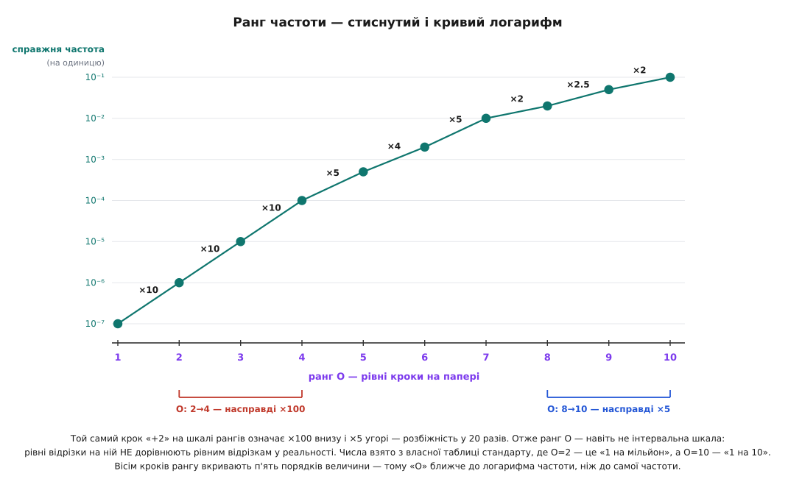
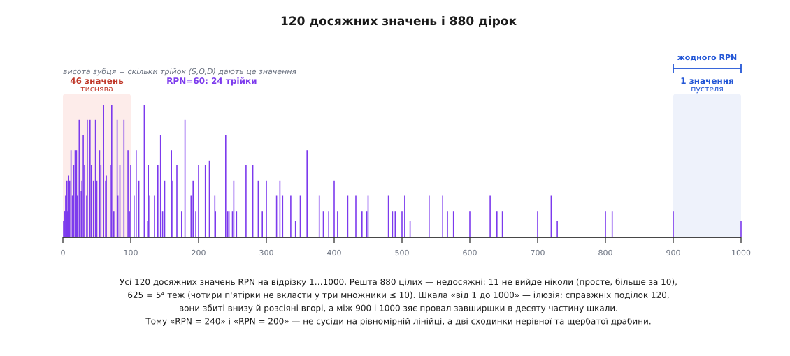
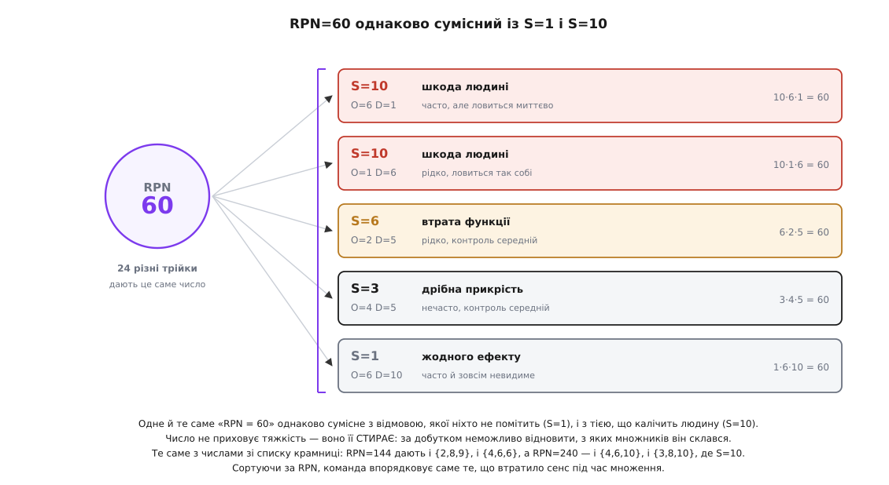

# 🧮 Ранг — це не величина: математика проти RPN

Формула RPN = S · O · D виглядає так безневинно, що ніхто не питає найпростішого: **а що, власне, означає цей добуток?** У фізиці добуток завжди щось означає — сила на плече дає момент, струм на опір дає напругу, і в кожному разі можна сказати, в яких одиницях виміряне те, що вийшло. Помножте тяжкість на частоту й на виявність — і назвіть одиниці. Кілограм-небезпеки? Секунда-невидимості? Одиниць немає, бо множників не існує: перемножено не величини, а **номери, якими підписані кошики**.

Це не причіпка педанта. З того, що добуток нічого не означає, випливають цілком практичні наслідки: число, яке однаково добре описує подряпину й каліцтво; шкала «від 1 до 1000», у якій насправді 120 поділок; і сортування, порядок якого залежить не від відмов, а від того, як хтось колись пронумерував рядки таблиці. Розберімо це від першопричини — від питання, що взагалі означає «виміряти».

## Що взагалі означає «виміряти»

1946 року психолог Стенлі Сміт Стівенс надрукував у *Science* статтю «On the Theory of Scales of Measurement», де запропонував означення, яке відтоді стало канонічним: **вимірювання — це присвоєння чисел об'єктам чи подіям за певним правилом**. Означення навмисно широке, і в цій широті — уся сила. Бо якщо присвоювати числа можна за будь-яким правилом, то виникає головне питання: **скільки правди в цих числах?**

Стівенс відповів так: правдивість числа визначається тим, **що з ним можна зробити, не зіпсувавши змісту**. Уявіть, що ви переписали всі свої вимірювання за якимось перетворенням φ. Якщо після цього всі емпіричні твердження лишились ті самі — перетворення **допустиме**, а те, що воно не зачепило, і є справжнім змістом чисел. Так народжуються чотири рівні шкал, і кожен визначений не тим, «що ми міряємо», а тим, **яке φ ми маємо право застосувати**.

```
шкала           що справді фіксує          допустиме φ            що на ній законно
─────────────────────────────────────────────────────────────────────────────────────
називна         тотожність: те саме/інше   будь-яка взаємно       рахувати штуки
                                           однозначна φ
порядкова       ЛИШЕ порядок: > < =        будь-яка ЗРОСТНА φ     медіана, ранги
інтервальна     рівність різниць           φ(x) = a·x + b         різниці, середнє
відношень       рівність відношень,        φ(x) = a·x,  a > 0     усе: + − × ÷
                є справжній нуль                                  «удвічі більше»
```

Ключ до всього — **критерій змістовності**: твердження про виміряне має сенс тоді й лише тоді, коли його істинність **не змінюється від допустимого перетворення**. Якщо я кажу «Петро вищий за Івана», то хоч міряй у метрах, хоч у дюймах, хоч у ярдах — твердження лишається правдивим, бо перехід між ними це φ(x) = a·x, допустиме на шкалі відношень. А от «сьогодні вдвічі тепліше, ніж учора» — твердження **беззмістовне**: у Цельсії воно може бути істинним, а в Фаренгейті хибним для тих самих двох днів, бо температура за Цельсієм — інтервальна шкала з умовним нулем, і перехід до Фаренгейта це φ(x) = a·x + b, яке відношення не зберігає.


*Драбина шкал і місце, де множення стає законним. Кожен щабель означений не природою величини, а тим, які перетворення лишають зміст незмінним. Множити можна лише там, де фіксовано **відношення** — тобто де питання «у скільки разів більше?» має відповідь. Ранги S, O, D сидять на порядковій шкалі, двома щаблями нижче: вони знають «більше чи менше», але не знають «у скільки разів». RPN мовчки перестрибує цей розрив.*

> 🔧 **Навіщо це.** Критерій змістовності — це детектор порожніх чисел, і він працює скрізь, не лише в FMEA. Щоразу, коли команда зводить якість у «бал від 1 до 5», складність задачі в «сторі-поінти», а кандидата на посаду в «середній бал за співбесіду», постає те саме питання: чи вціліє висновок, якщо ті самі кошики пронумерувати інакше? Якщо ні — рішення ухвалює не реальність, а нумерація. Навчившись бачити це на RPN, ви побачите те саме в половині управлінських дашбордів.

## Номер кошика — не вміст кошика

Тепер придивімось, що таке ранг у FMEA. Таблиця оцінок описує **кошики**: «наслідку не видно» — це кошик 1, «дуже неприємний вигляд чи звук» — кошик 4, «втрата другорядної функції» — кошик 6, «порушення норм і приписів» — кошик 9, «шкода здоров'ю або безпеці» — кошик 10. Кошики впорядковані: десятий гірший за дев'ятий, дев'ятий гірший за восьмий. І це **все**, що таблиця стверджує. Вона ніде не каже, що відстань від 9 до 10 така сама, як від 1 до 2, і ніде не каже, що 8 удвічі гірше за 4.

Аналогія — номерок у черзі до лікаря. Номер 7 стоїть після номера 3, і це справжня інформація. Але 7 не «утричі більше пацієнт», ніж 3, і різниця між 6 і 7 не така сама, як між 1 і 2, — хтось міг вийти. Помножити номерки двох пацієнтів технічно можна: калькулятор не образиться. Просто результат нічого не означатиме.

Аналогія майже точна, і варто сказати, **де вона ламається** — бо ранг FMEA все ж багатший за номерок. Номерки роздають довільно, а ранги прикріплені до описаних кошиків: «9» несе змістовне «порушення приписів», а не просто «дев'яте місце». Але цей опис фіксує **лише те, який кошик за яким**, — і ні слова про проміжки між ними. Тож ранг сильніший за номерок рівно на один крок і слабший за величину рівно на два: він знає, що кошики впорядковані й що саме в них лежить, але не знає, наскільки вони одне від одного далекі.

Звідси — точне формулювання того, що робить RPN: **він множить не величини, а номери кошиків, у які їх поклали.** Формула бере назви й поводиться з ними так, наче це вміст.

## Удар перший: порядок RPN залежить від того, як ми назвали кошики

Тепер критерій змістовності можна навести на RPN, як приціл. Порядкова шкала допускає **будь-яке зростне перетворення** φ. Отже, якщо твердження «відмова A небезпечніша за B, бо RPN(A) > RPN(B)» справді щось каже про відмови, воно мусить лишатися істинним для **кожного** зростного φ. Один контрприклад — і твердження порожнє.

**Умова.** Візьмімо два рядки зі списку інтернет-крамниці — подвійне списання (S=9, O=2, D=8) і застарілу ціну (S=4, O=6, D=10) — і перепишімо ранги зростним перетворенням φ, яке не порушує жодного порядкового факту.

```
φ:   1→1   2→2   3→3   4→4   5→5   6→6   7→7   8→100   9→101   10→102

φ зростна?  1 < 2 < 3 < 4 < 5 < 6 < 7 < 100 < 101 < 102   ✓ так
            жоден факт «більше/менше» не зіпсовано:
            10 і далі гірше за 9, 9 гірше за 8, 8 гірше за 7 — усе на місці

вихідна нумерація (тотожне φ):
  подвійне списання    9 · 2 · 8    = 144
  застаріла ціна       4 · 6 · 10   = 240      →  застаріла ціна ВИЩЕ

перенумеровані кошики (те саме φ, ті самі кошики, ті самі відмови):
  подвійне списання  101 · 2 · 100  = 20200
  застаріла ціна       4 · 6 · 102  =  2448    →  подвійне списання ВИЩЕ
```

Порядок перекинувся. Жодна відмова не змінилась, жоден кошик не змінився, жоден порядковий факт не порушено — змінилися **самі лише назви кошиків**. Висновок неминучий: «RPN(A) > RPN(B)» — це не факт про відмови. Це факт про давній довільний вибір підписати кошики числами 1…10, а не будь-якою іншою зростною послідовністю.

Тут напрошується заперечення: мовляв, φ надумане, ніхто так кошики не нумерує. Заперечення хибне двічі. По-перше, воно не по суті: якщо висновок залежить від вибору, якого дані не роблять, то висновку в даних немає — і байдуже, наскільки химерним здається альтернативний вибір. По-друге — і це найцікавіше — стрибок «7 → 100» не вигадка математика. Стандарт сам показує, що справжні проміжки між сусідніми рангами бувають різні на порядок.

```python
# контрприклад — не одиничний: переберімо ВСІ зростні перенумерації
# мітками із запасу 1…20 і порахуймо, як часто добуток перекидає пару
from itertools import combinations

A, B = (9, 2, 8), (4, 6, 10)          # подвійне списання vs застаріла ціна
prod = lambda t, f: f[t[0]] * f[t[1]] * f[t[2]]

ident = {k: k for k in range(1, 11)}
base = prod(A, ident) > prod(B, ident)
flip = total = 0
for pick in combinations(range(1, 21), 10):        # будь-які 10 зростних міток
    f = {k: pick[k - 1] for k in range(1, 11)}     # 1→pick[0] < 2→pick[1] < …
    total += 1
    if (prod(A, f) > prod(B, f)) != base:
        flip += 1

print(f"зростних перенумерацій: {total}")
print(f"перекидають порядок пари: {flip}  ({100 * flip / total:.1f}%)")
# зростних перенумерацій: 184756
# перекидають порядок пари: 6938  (3.8%)
```

Отже перекинути цю пару можуть майже сім тисяч перенумерацій — це не одинична патологія, яку пощастило вивудити. І 3.8 % тут — оцінка **знизу**, бо запас міток «до 20» я вибрав довільно: розширте його до 28 — частка росте до 6.5 %, дасте більше — росте далі, бо що довший розтяг дозволено, то легше перекинути добуток. А порядкова шкала не накладає на розтяг **жодного** обмеження. Саме та обставина, що відповідь залежить від довільно вибраного запасу міток, і є діагнозом: порядок за RPN — властивість нумерації, а не відмов.

## Удар другий: стандарт сам зізнається, що ранг — не частота

Найдотепніше в цій історії те, що спростування RPN надрукували в тому самому довіднику, що й RPN. Автомобільна таблиця оцінок не лишає ранг частоти голим — вона прив'язує кожен кошик до **справжньої частоти появи**, і числа там промовисті.

```
ранг O    словами            справжня частота
──────────────────────────────────────────────────────
  10      надзвичайно висока   ≥ 100 на тисячу   ≈ 1 на 10
   9      дуже висока            50 на тисячу    = 1 на 20
   8      дуже висока            20 на тисячу    = 1 на 50
   7      висока                 10 на тисячу    = 1 на 100
   6      висока                  2 на тисячу    = 1 на 500
   5      помірна               0.5 на тисячу    = 1 на 2 000
   4      помірна               0.1 на тисячу    = 1 на 10 000
   3      низька               0.01 на тисячу    = 1 на 100 000
   2      дуже низька        ≤ 0.001 на тисячу   = 1 на 1 000 000
   1      надзвичайно низька   усунено запобіжним контролем
```

Вісім кроків рангу вкривають **п'ять порядків величини**. Це значить, що O — не частота, а щось на кшталт її [логарифма](root:math-analysis/logarithms): щоб із логарифма дістатися величини, треба піднести десятку до степеня, а не помножити. Логарифм стискає мультиплікативну відстань в адитивну — саме тому «+1 до рангу» відповідає «×кілька разів» у реальності, а не «+кілька».

І тут виявляється друга, гірша річ. Якби O був чесним логарифмом, кожен крок рангу множив би частоту на однакове число, і шкала була б хоча б **інтервальною**. Порахуймо кроки.

```
O:  2 → 3   ×10        O:  6 → 7   ×5
    3 → 4   ×10            7 → 8   ×2
    4 → 5   ×5             8 → 9   ×2.5
    5 → 6   ×4             9 → 10  ×2

однаковий крок «+2» на шкалі рангів:
    O: 2 → 4    справжня частота  ×100
    O: 8 → 10   справжня частота  ×5
                                  ────
    розбіжність у 20 разів за той самий рух на два ранги
```


*Рівні кроки на папері, нерівні кроки в реальності. Ранги на горизонтальній осі стоять рівно, як солдати; справжні частоти на вертикальній розсипані на п'ять порядків, та ще й нерівномірно — унизу шкали крок рангу множить частоту на десять, угорі лише на два. Отже O — навіть не інтервальна шкала: рівні відрізки на ній не дорівнюють рівним відрізкам у світі. Це не докір таблиці — стискати широкий діапазон у десять кошиків цілком розумно. Докір формулі, яка потім поводиться з номером кошика як із самою частотою.*

Це остаточно ховає надію, що RPN — то якась прихована оцінка очікуваних збитків. Очікувані збитки містять **частоту**; RPN містить **номер кошика частоти**. Стандарт власною таблицею стверджує, що це різні речі, — і тут же множить друге, наче воно перше.

## Удар третій: шкала «від 1 до 1000» має 120 щербатих поділок

Досі ми били по змісту. Тепер ударимо по формі — і побачимо, що навіть як індекс, як просто спосіб розкидати рядки по шкалі, RPN зроблено кепсько. Тут уже не потрібна жодна теорія, самий перебір: маємо 10 × 10 × 10 = 1000 трійок, кожна дає добуток десь між 1 і 1000. Скільки **різних** значень із цього виходить?

```python
from collections import Counter

R = range(1, 11)
prod = Counter(s * o * d for s in R for o in R for d in R)

print("трійок:", 10 ** 3)                                    # 1000
print("різних значень RPN:", len(prod))                      # 120
print("недосяжних цілих у [1,1000]:", 1000 - len(prod))      # 880
print("перші недосяжні:", [n for n in range(1, 30) if n not in prod][:6])
# [11, 13, 17, 19, 22, 23]
```

**Сто двадцять.** Зі шкали, яку всі називають «від 1 до 1000», досяжні 120 значень — 12 %. Решта 880 цілих не вийдуть **ніколи**, і причина суто арифметична: добуток трьох чисел, кожне ≤ 10, розкладається лише на прості множники 2, 3, 5 і 7 — інших простих до десятки просто немає. Тому 11 недосяжне, як і 13, 17, 19 і кожне число, у розкладі якого сидить простий множник більший за 10. Але й цього замало: 7-гладких чисел до тисячі є 141, а досяжних усе одно 120. Різницю дає інше обмеження — множників **рівно три, і кожен ≤ 10**. Скажімо, 625 = 5⁴ вимагає чотирьох п'ятірок; у три множники їх не вкласти, бо 25 > 10. Таких «гладких, але однаково недосяжних» — рівно 21.

Мало того, що поділок 120, — вони ще й розкидані по шкалі так нерівно, що годі шукати сенс у відстанях між ними.

```
відрізок      скільки різних значень RPN
─────────────────────────────────────────
   1 … 100          46          ← тиснява
 101 … 200          21
 201 … 300          15
 301 … 400          11
 401 … 500          10
 501 … 600           7
 601 … 700           4
 701 … 800           3
 801 … 900           2
 901 … 1000          1          ← лише 1000 = 10·10·10

найбільші провали:  900 → 1000   (порожньо, ширина 100)
                    810 → 900    (порожньо, ширина 90)
                    729 → 800    (порожньо, ширина 71)
```

Між 900 і 1000 немає **жодного** значення: десята частина шкали — суцільна порожнеча. Внизу натомість тиснява: 46 значень збилися на першій десятині. Тобто «шкала» RPN — це щербата драбина з нерівними сходинками, на якій відстань нічого не означає: 240 і 200 не «сусіди на лінійці», а дві поділки, між якими могло не бути нічого, а могло бути десять.


*Усі досяжні значення RPN одним поглядом. Шкала «від 1 до 1000» насправді має 120 поділок, збитих унизу й розсіяних угорі, з проваллям завширшки в десяту частину шкали під самою вершиною. Висота зубця показує ще й другу біду: на популярні значення налізає до двох десятків різних трійок, тоді як на 1 і на 1000 — рівно по одній. Ці властивості вперше системно описав Джон Боулз 2003 року в праці «An assessment of RPN prioritization in a failure modes effects and criticality analysis», відзначивши й ті самі ~120 значень, і порожнечу між 900 та 1000.*

Практичний наслідок цієї щербатості видно на найпоширенішому звичаї — порозі «RPN > 100 — берімося до роботи».

```
поріг RPN > 100:
  трійок вище порога                         501
  трійок нижче або на порозі                 499

  з тих, що ВИЩЕ порога, мають S ≤ 3          56   ← косметика, а ми беремося
  з тих, що НИЖЧЕ порога, мають S ≥ 9         54   ← небезпека, а ми не беремося

  усього трійок із S ≥ 9                     200
  з них ховається під порогом                 54   = 27 %
```

Понад чверть найтяжчих відмов у принципі не здатні подолати поріг — не тому, що вони безпечні, а тому, що добуток замалий. Поріг проводять по шкалі, поділки якої не означають нічого, — і він чесно ділить те, що йому дали.

## Удар четвертий: множення стирає саме тяжкість

Ми дійшли до найглибшого. Добуток — відображення **багато-в-одне**: із 1000 трійок він робить 120 чисел, а отже неминуче склеює різне. Питання лиш у тому, **що саме** він склеює. Відповідь безжальна: рівно те, що важить найбільше.

```python
from collections import defaultdict

by = defaultdict(list)
for s in range(1, 11):
    for o in range(1, 11):
        for d in range(1, 11):
            by[s * o * d].append((s, o, d))

for v in (60, 144, 240):
    ss = [t[0] for t in by[v]]
    shapes = sorted({tuple(sorted(t)) for t in by[v]})
    print(f"RPN={v}: {len(by[v])} трійок, тяжкість S={min(ss)}…{max(ss)}, набори {shapes}")

# RPN=60:  24 трійки, тяжкість S=1…10, набори [(1,6,10),(2,3,10),(2,5,6),(3,4,5)]
# RPN=144: 18 трійок, тяжкість S=2…9,  набори [(2,8,9),(3,6,8),(4,4,9),(4,6,6)]
# RPN=240: 18 трійок, тяжкість S=3…10, набори [(3,8,10),(4,6,10),(5,6,8)]
```

Прочитайте перший рядок ще раз. **RPN = 60 однаково сумісний із S = 1 і з S = 10.** Число 60 може означати відмову, якої взагалі ніхто не помітить (1 · 6 · 10 — жодного ефекту, часто, невидимо), і відмову, що калічить людину (10 · 6 · 1 — шкода здоров'ю, часто, зате ловиться миттєво). Побачивши в таблиці «60», ви не знаєте про тяжкість **нічого** — діапазон повний. І 60 тут не виняток: те саме роблять 50, 70, 80, 90 і 100 — усі найлюдніші значення шкали.


*Що саме стирає множення. Двадцять чотири різні трійки дають те саме «RPN = 60», і тяжкість серед них пробігає весь діапазон від 1 до 10. Добуток не ховає тяжкість — він її **знищує**: за числом 60 неможливо відновити, з яких множників воно склалося. Те саме з рядками крамниці: 144 дають і {2,8,9}, і {4,6,6} — косметична дрібниця; 240 дають і {4,6,10}, і {3,8,10}, де S = 10, тобто пряма загроза людині. Сортуючи за RPN, команда впорядковує саме те, що втратило сенс під час множення.*

Числа зі списку крамниці б'ють у те саме місце. «Подвійне списання, RPN = 144» ділить своє число з набором {4, 6, 6} — нудною косметичною відмовою. «Застаріла ціна, RPN = 240» ділить своє з {3, 8, 10}: та сама двісті сорок може бути **загрозою здоров'ю**. Число, за яким сортують, не розрізняє втрати маржі й каліцтва.

Скільки ж усього коштує це стирання? Порахуймо **інверсії за тяжкістю** — пари рядків, де RPN вищий у того, чия тяжкість нижча.

```
усіх пар рядків                        499 500
інверсій за тяжкістю                   127 691    = 25.6 %

крайній випадок:
  S=10, O=1, D=1   (шкода людині, рідко, ловиться миттєво)   RPN =  10
  S=1,  O=10, D=10 (жодного ефекту, часто, невидимо)         RPN = 100

  найтяжча можлива відмова дістає вдесятеро МЕНШЕ число,
  ніж найлегша можлива
```

Кожна четверта пара впорядкована проти тяжкості. Це не крайні випадки й не аномалія — це середня поведінка формули.

## «То рахуймо чесно» — і тут найнеприємніше

Природна реакція інженера: гаразд, ранги нікчемні, тож підставмо справжні величини й помножмо їх. І реакція **слушна** — бо є цілком законний добуток, який усе це мав би замінити. Якщо взяти справжню частоту причини p, справжню ймовірність, що контроль її **пропустить**, e, і справжню вартість наслідку c, то

```
E = p · e · c
    │   │   │
    │   │   └─ гроші за одну подію          (шкала відношень)
    │   └───── ймовірність прориву контролю (шкала відношень, 0…1)
    └───────── подій на одиницю продукції   (шкала відношень)

E = очікувані збитки на одиницю продукції — у гривнях. Одиниці є!
```

Оце добуток із сенсом: усі три множники — на шкалі відношень, «удвічі більша частота» тут справді означає вдвічі більше, і результат має одиниці. Ось чим RPN **прикидається**: він мовчки припускає p = O, e = D, c = S — тобто що номер кошика дорівнює вмісту. Про p = O ми вже знаємо, що це неправда: таблиця стандарту каже, що p пробігає п'ять порядків, поки O повзе від 2 до 10.

Тож підставмо чесні числа й порахуймо. Частоту візьмімо з таблиці стандарту, ймовірність прориву — правдоподібну для рангів виявності, а от вартість наслідку… а от тут і починається найцікавіше. Скільки коштує «S = 9»? Ніхто не знає. Тому візьмімо **три різні здогадки** — усі зростні, усі правдоподібні — і подивімось, що буде.

**Умова.** Три рядки крамниці: таймаут шлюзу (6, 5, 3), подвійне списання (9, 2, 8), застаріла ціна (4, 6, 10). Частота p за таблицею стандарту, прорив e за рангом виявності, вартість c — за трьома різними здогадками про те, як тяжкість переводиться в гроші.

```
                     p (з таблиці)   e (прорив)     RPN
таймаут шлюзу          5·10⁻⁴          0.01          90
подвійне списання      1·10⁻⁶          0.60         144
застаріла ціна         2·10⁻³          1.00         240

здогадка 1:  c = S            (тяжкість лінійна в грошах)
   таймаут       6 · 5·10⁻⁴ · 0.01 = 3.0·10⁻⁵
   подвійне      9 · 1·10⁻⁶ · 0.60 = 5.4·10⁻⁶
   застаріла     4 · 2·10⁻³ · 1.00 = 8.0·10⁻³
   порядок:  застаріла  >  таймаут  >  ПОДВІЙНЕ (останнє!)

здогадка 2:  c = 10^(S/2)     (кожні два ранги — ×10)
   таймаут    1·10³ · 5·10⁻⁴ · 0.01 = 5.0·10⁻³
   подвійне  3.2·10⁴ · 1·10⁻⁶ · 0.60 = 1.9·10⁻²
   застаріла  1·10² · 2·10⁻³ · 1.00 = 2.0·10⁻¹
   порядок:  застаріла  >  подвійне  >  таймаут

здогадка 3:  c = 10^(S−1)     (кожен ранг — ×10)
   таймаут    1·10⁵ · 5·10⁻⁴ · 0.01 = 5.0·10⁻¹
   подвійне   1·10⁸ · 1·10⁻⁶ · 0.60 = 6.0·10¹
   застаріла  1·10³ · 2·10⁻³ · 1.00 = 2.0·10⁰
   порядок:  ПОДВІЙНЕ  >  застаріла  >  таймаут
```

Подвійне списання побувало **останнім, середнім і першим** — від самої лише здогадки про те, як тяжкість переводиться в гроші. Дані не змінились ані на йоту.

Висновок звідси значно суворіший, ніж «RPN поганий». По-перше, зверніть увагу: у двох здогадках із трьох чесний підрахунок ставить **застарілу ціну першою** — тобто погоджується з RPN. Це не реабілітація формули, а її остаточний вирок: там, де RPN «угадав», він угадав **випадково**. Він не є очікуваними збитками (бо множить номери кошиків) і не є змістовним порядком (бо не інваріантний). Він завис між двома стільцями й іноді падає в потрібний бік.

По-друге — і це головне, — чесна арифметика теж **не рятує**. Вона лише переносить сваволю з «перемножмо мітки» на «вгадаймо, скільки коштує дев'ятка». Ми не знаємо ані справжніх частот (бо оцінюємо систему, якої ще немає), ані ціни довіри клієнта. **Вирахуватися з браку інформації неможливо.** Скільки не додавай знаків після коми, з рангу не постане величина.

## Чому тоді тяжкість першою: некомпенсовність

Отже, якщо навіть очікувані збитки не ставлять подвійне списання вгору списку, то на якій підставі стандарт вимагає ставити тяжкість першою? Підстава є, тільки вона **не арифметична**.

Очікувані збитки — правильний інструмент рівно тоді, коли ви **байдужі до ризику** на всьому діапазоні наслідків. А байдужість до ризику означає **компенсовність**: що рідкісну катастрофу можна відшкодувати достатньою кількістю дрібних виграшів. Для грошей це часто справедливо — зекономлені сто гривень тут і справді покривають утрачені сто гривень там.

Для здоров'я, безпеки й законності це **хибно**, і хибно не «трошки», а в принципі. Немає такої кількості збереженої маржі, яка викупить скалічену людину. Порушення припису не стає нормою від того, що воно рідкісне, — регулятор не множить на ймовірність. А коли шкода непокривна, раціональна перевага перестає бути мультиплікативною і стає **лексикографічною**: спершу вирішуємо за найважливішою віссю, і лише за її рівності дивимось на наступну. Це не зневага до математики й не боягузтво — це чесне визнання, що вісь тяжкості на своєму кінці **не міняється** на інші осі за жодним курсом.

Ось чому «S = 10: шкода здоров'ю» не має курсу обміну на «O = 1: раз на мільйон». Помножити їх — значить мовчки оголосити такий курс і призначити його рівним одиниці.

## Лексикографічний порядок — єдиний, що вціліє

І тепер станеться найкрасивіше в усій цій історії. Ми прийшли до лексикографічного порядку з боку **етики** — через непокривність шкоди. Перевірмо його з боку **теорії шкал** — критерієм змістовності, тим самим, що знищив RPN.

Упорядкуймо рядки за (S, потім O, потім D): спершу порівнюємо тяжкість; якщо однакова — частоту; якщо й та однакова — виявність. Чи вціліє цей порядок під допустимим перетворенням? Причому візьмімо найважчий випадок: **свою** зростну функцію на кожну вісь, φ_S, φ_O, φ_D, — адже це три різні шкали, і ніщо не змушує нумерувати їх узгоджено.

```
Твердження. Для будь-яких ЗРОСТНИХ φ_S, φ_O, φ_D лексикографічний порядок
за (φ_S(S), φ_O(O), φ_D(D)) збігається з лексикографічним порядком за (S, O, D).

Доведення. Порівнюємо два рядки a і b.
  1. Зростна функція строго зберігає порядок:  S_a < S_b  ⟺  φ_S(S_a) < φ_S(S_b).
     Отже, якщо тяжкості різні, обидва порядки вирішують справу тут — і однаково.
  2. Зростна функція ін'єктивна:  S_a = S_b  ⟺  φ_S(S_a) = φ_S(S_b).
     Отже, якщо тяжкості рівні, обидва порядки переходять до O — разом, крок у крок.
  3. Ті самі два міркування для O, далі для D.
Порядок вирішується на тій самій осі й на однаковому боці. ∎

Порівняйте з добутком: φ_S(S)·φ_O(O)·φ_D(D) не має ЖОДНОГО такого захисту —
множення змішує осі, і зростність кожної окремо нічого не гарантує добутку.
```

Ось воно. **Лексикографічний порядок користується тільки порядковою інформацією — рівно тією, яку ранги справді несуть, — і тому лишається змістовним у сенсі Стівенса.** Він не питає «у скільки разів», бо йому це не потрібно: він питає лише «більше чи менше», а на це порядкова шкала відповідати вміє.

Два незалежні міркування — етичне про непокривність шкоди й вимірювальне про допустимі перетворення — вказали пальцем на **одне й те саме**. Такий збіг у математиці рідко буває випадковим: він зазвичай означає, що ви намацали справжню структуру задачі.

## AP: обережно огрублений лексикографічний порядок

Саме цим шляхом і пішла галузь. Спільний довідник AIAG та VDA 2019 року прибрав RPN і поставив на його місце **таблицю пріоритету дій** (англ. *Action Priority*, AP). Пристрій її показовий: це **не обчислення, а пошук** — усі 1000 сполучень S, O, D наперед розписані по трьох класах, High, Medium, Low. Тяжкість завжди перша: за S = 9–10 пріоритет виходить високим майже незалежно від того, які там частота й виявність. H зобов'язує вжити заходів; M — розглянути й задокументувати рішення; L — визнати ризик прийнятним, записавши обґрунтування.

Але чому **таблиця**, а не чистий лексикографічний порядок, який ми щойно виправдали доведенням? Бо чистий лексикографічний порядок надто суворий для наших даних. Він поставив би (9, 1, 1) вище за (8, 10, 10) **завжди** — а це означало б довіру до різниці між кошиками «8» і «9», якої ранги не витримають: між ними стоїть чиясь оцінка, а не вимір. Таблиця огрублює: тяжкість панує, але не нескінченно, і сусідні ранги збиті в смуги (9–10, 7–8, 4–6, 2–3, 1) саме тому, що розрізняти всередині смуги наші дані не дають права.

І звідси — найтихіший урок усієї цієї арифметики. **Вихід має бути такий самий точний, як вхід.** Три класи на виході — не спрощення й не лінощі укладачів; це чесна заява, що вхідні дані не витримують більшого. Тризначне число RPN обіцяло тисячу градацій там, де інформації ставало щонайбільше на три, — і в цій облудній точності була справжня шкода. Не в тому, що число іноді помилялося, а в тому, що воно **виглядало як вимір**. Побачивши «RPN = 240», команда бачила результат обчислення; побачивши «AP = High», вона бачить рішення — і питає, чиє воно й на чому стоїть. Друге чесніше.

Варто додати й тверезу ноту про саму теорію: типологію Стівенса статистики критикували від початку — Фредерік Лорд ще 1953 року, а Пол Веллмен і Ліланд Вілкінсон 1993-го в *The American Statistician* прямо назвали чотири рівні оманливими, бо шкала не є вродженою властивістю чисел і не диктує допустимого аналізу механічно. Критика слушна, та вона RPN не рятує: неінваріантність добутку під зростною перенумерацією — це арифметичний факт, який стоїть сам по собі, хоч називайте шкалу порядковою, хоч ніяк. Контрприклад із φ вище нікуди не подінеться.

---

Підсумок вартий того, щоб винести його за межі FMEA. RPN — не «трохи неточна» формула, яку можна підправити ваговими коефіцієнтами чи корінням із добутку. Він **безодиничний**: у ньому склеєно те, що не має спільної міри, і склеєно операцією, яка вимагає знати «у скільки разів» від даних, що знають лише «більше чи менше». Звідси все решта: 120 щербатих поділок замість тисячі, чверть пар, упорядкованих проти тяжкості, число 60, яке однаково означає подряпину й каліцтво.

Порятунок не в кращій формулі, а в тому, щоб **перестати обчислювати** й почати впорядковувати тим, що вціліє під перенумеруванням. Ранги — це впорядковані судження, а не вимірювання; з них можна законно дістати порядок і не можна законно дістати добуток. Загальніше вміння будувати таку чергу — окрема розмова про [пріоритети відмов](root:sys-dron/failure-priorities): як ставити рядки в чергу, коли осей кілька й вони незвідні одна до одної. А якщо колись у вас усе-таки будуть справжні частоти й справжні гроші — множте на здоров'я: [ймовірність як міра непевності](root:math-probability/probability-basics) для того й існує, щоб чесно множитись на вартість наслідку. Просто спершу переконайтесь, що у вас величини, а не номери кошиків.
