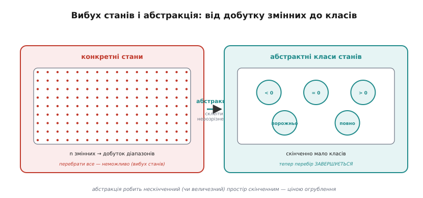
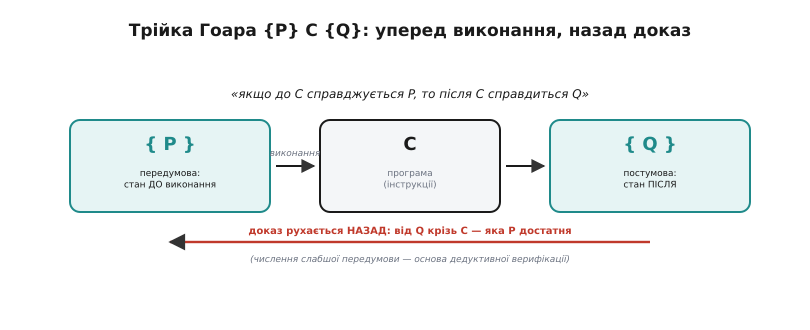
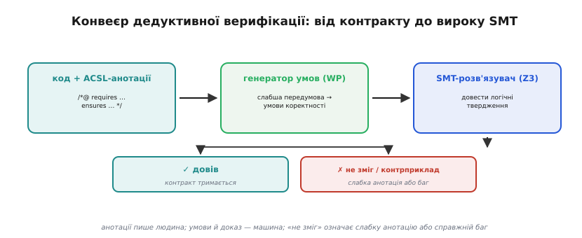
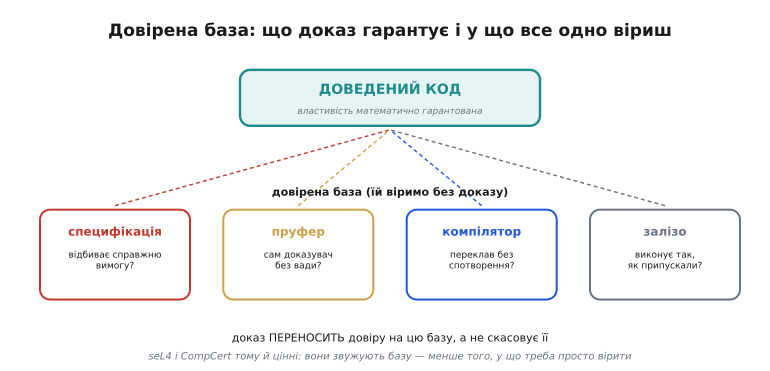

# Формальна верифікація — детально

Базова стаття показує головну думку: доказ стверджує властивість для **всіх** входів, тоді як тест перевіряє лише ті, на які натрапив. Тут — як це робиться насправді: на чому тримається перевірка моделей і чому її душить вибух простору станів; як абстракція повертає скінченність; як SMT-розв'язувач **кодує** властивість програми в логічну формулу; що формально означає трійка Гоара `{P} C {Q}` і як від неї перейти до автоматичного доказу; як контракт перетворюється на умови коректності й де він зустрічається з розв'язувачем; що саме доведено в seL4 і CompCert і на що ці докази спираються; і де лежить остаточна межа методу — крихкість специфікації.

Почнімо з питання, на яке базова стаття лише натякнула: як інструмент, що ніколи не виконує код, узагалі може стверджувати щось про **кожен** його запуск?

## Перевірка моделей: вичерпний обхід замість проб

Перевірка моделей (англ. *model checking*) стоїть на одній зухвалій ідеї. Тест бере окремі значення з простору входів — кілька проб із мільярдів. А що, як перебрати **всі** можливі стани системи й переконатися, що в жодному властивість не порушена? Тоді це вже не вибірка, а **вичерпний доказ**: ми не пропустили жодного стану, бо обійшли їх усі.

Працює це не з кодом, а з **моделлю** — формальним описом, у якому є: множина станів (значення всіх змінних, що нас цікавлять), множина переходів (як один стан переходить в інший), і властивість, що мусить триматися. Інструмент бере початковий стан, обчислює всі стани, досяжні з нього за один перехід, тоді всі, досяжні з тих, — і так доки не вичерпає **весь досяжний граф станів**. У кожному стані він звіряє властивість. Знайшов стан-порушник — друкує **контрприклад**: точну послідовність переходів від початку до біди. Не знайшов у жодному з усіх досяжних — властивість доведено для цілої моделі.

Саме тому перевірка моделей сильна там, де баг ховається в **порядку подій**. Розгляньмо два потоки, що нарощують спільний лічильник без захисту — класична [гонка даних](root:sf-tasks/atomicity-races). Тест відтворить лише ті чергування, які випадково склалися під час запуску; рідкісне фатальне чергування він може не зловити роками. Перевіряльник моделей перебирає **всі** чергування — і знаходить те, на якому два потоки прочитали лічильник одночасно, обидва додали одиницю й записали те саме значення, втративши одне нарощення. Він не «здогадується» — він обходить простір повністю.

Інструменти тут — **TLA⁺** Леслі Лампорта з перевіряльником TLC, і **SPIN** Джерарда Гольцмана. TLC свого часу знайшов помилку в протоколі узгодженості кешу багатопроцесорної машини Compaq — рівно той клас бага, що його людина не виловить, перебираючи чергування подумки. Стихія обох — протоколи, розподілені алгоритми, синхронізація: усе, де правильність залежить від порядку, а порядків — комбінаторно багато.

## Вибух простору станів і абстракція

У слові «всі стани» й ховається головна слабкість методу. Кількість станів системи зростає **вибухово** з кількістю змінних: якщо є десять булевих прапорців, станів уже 2¹⁰ = 1024; додали ще десять — мільйон; а одна 32-розрядна змінна сама дає чотири мільярди значень. Це **вибух простору станів** (англ. *state explosion*): реальна система має станів стільки, що обійти їх усі не вистачить ні пам'яті, ні часу всесвіту. Перевіряльник моделей працює лише доти, доки простір лишається досяжним для перебору.

Рятунок — **абстракція**: огрубити модель так, щоб станів стало скінченно мало, **не втративши** при цьому того, що нас цікавить. Замість тримати точне значення лічильника (чотири мільярди варіантів) ми ділимо його на кілька **класів**, важливих для властивості: «нуль», «у межах», «на межі», «за межею». Усі конкретні значення всередині класу для нашої властивості нерозрізненні, тож ми склеюємо їх в один абстрактний стан — і простір зі чотирьох мільярдів падає до чотирьох.


*Конкретний простір станів — добуток діапазонів усіх змінних — росте вибухово, і повний перебір у ньому неможливий. Абстракція склеює стани, нерозрізненні для властивості, в кілька класів («< 0», «= 0», «> 0», «порожньо», «повно»), і простір стає скінченно малим. Тепер перебір завершується — ціною огрублення: всередині класу деталі втрачено.*

Ціна абстракції — точність. Огрубивши модель, ми можемо втратити різницю, яка насправді важить, — і тоді або проґавимо справжній баг, або дістанемо **хибний контрприклад**: шлях, можливий в огрубленій моделі, але неможливий у реальній системі. Тому абстракцію будують обережно й уточнюють ітеративно: знайшов інструмент підозрілий шлях — перевіряють, чи він реальний; виявився хибним — абстракцію **уточнюють** (додають розрізнення, яке його виключає) і женуть знову. Цей цикл «огрубити — перевірити — уточнити» і є серцем сучасної перевірки моделей: він тримає простір скінченним, поступово повертаючи лише ту точність, якої бракує для висновку.

> 🔧 **Навіщо це.** Розуміння вибуху станів пояснює, **чому** перевіряльник моделей раптом «зависає» або вимагає гігабайтів пам'яті на нібито просту модель: ви ненароку лишили в ній змінну з великим діапазоном, і простір вибухнув. Лік — свідомо абстрагувати: тримати в моделі лише те, від чого залежить властивість, а решту огрублювати до кількох класів. Модель — не копія системи, а її найгрубше спрощення, у якому ще видно те, що доводимо.

## Як SMT-розв'язувач кодує властивість

Дедуктивна верифікація йде іншим шляхом: не перебирає стани, а **виводить** результат логічно. У її серці — **SMT-розв'язувач** (англ. *Satisfiability Modulo Theories* — задовільність за теоріями), і щоб довіряти інструментам на ньому збудованим, варто зрозуміти, що він насправді робить.

Почнемо з простішого поняття — **SAT** (англ. *satisfiability* — задовільність). Задача SAT: дано булеву формулу зі змінних `true`/`false`, знайти такі значення змінних, щоб формула стала істинною, — або довести, що таких немає. SMT розширює це: змінні тепер не лише булеві, а й **над теоріями** — цілі числа, дійсні, бітові вектори (англ. *bit-vector* — машинне слово фіксованої ширини, що поводиться точно як `uint32_t` з переповненням), масиви, покажчики. Розв'язувач уміє міркувати про арифметику, про доступ до масиву за індексом, про переповнення фіксованої розрядності — і відповідає на те саме питання: чи існують значення, за яких формула істинна?

Тепер ключовий прийом, на якому все тримається: **властивість програми кодують через її заперечення**. Щоб довести «переповнення **не** станеться», розв'язувачеві ставлять обернене питання: «чи існує вхід, на якому переповнення **таки** станеться?». Це питання — формула SMT. Можливі дві відповіді, і обидві корисні:

- Розв'язувач каже **«незадовільно»** (англ. *unsatisfiable*) — тобто шуканого входу **не існує**. А це і є доказ: якщо немає входу, що порушує властивість, то властивість тримається для **всіх** входів. Заперечення неможливе → твердження істинне.
- Розв'язувач каже **«задовільно»** і видає конкретні значення — це **контрприклад**: точний вхід, на якому властивість падає. Безцінно для налагодження: не «десь щось не так», а «ось рівно ці числа ламають усе».

Подивімося на кодування предметно. Повернімося до додавання з базової статті, але міркуючи так, як розв'язувач:

```c
uint16_t accumulate(uint16_t total, uint16_t step) {
    return total + step;
}
```

Властивість «не переповнює» розв'язувач кодує як питання про бітові вектори ширини 16:

```
існують total, step (16-бітні), такі що:
    total + step  >  65535 ?           ← заперечення властивості

відповідь: ЗАДОВІЛЬНО, напр. total = 60000, step = 6000  (сума 66000 > 65535)
           → контрприклад: переповнення МОЖЛИВЕ
```

Додамо передумову — і питання зміниться:

```
існують total, step (16-бітні), такі що:
    total + step <= 65535   (передумова виконана)   AND
    total + step  >  65535   (властивість порушена) ?

відповідь: НЕЗАДОВІЛЬНО — таких total, step не існує
           → за передумови переповнення НЕМОЖЛИВЕ (доведено)
```

Друге питання внутрішньо суперечливе (`x <= 65535 AND x > 65535` не виконується ніколи), тож розв'язувач негайно каже «незадовільно» — і це доказ. Зверніть увагу: він **не перебирав** чотири мільярди пар. Він міркував про формулу як математичний об'єкт і встановив суперечність символьно. У цьому й сила: SMT доводить твердження про величезні (чи нескінченні) простори, не обходячи їх поточково. Найвідоміший такий розв'язувач — **Z3** від Microsoft Research (Леонардо де Моура й Ніколай Бйорнер); поряд працюють Alt-Ergo, CVC4 та інші.

## Трійка Гоара: формальний сенс «правильності»

Щоб дедуктивна верифікація мала про що міркувати, потрібен формальний запис того, що означає «фрагмент коду правильний». Цей запис дав Тоні Гоар 1969 року в статті «An Axiomatic Basis for Computer Programming», спираючись на ідеї Роберта Флойда (1967, про блок-схеми). Це **трійка Гоара**:

```
{ P }  C  { Q }
```

Читається вона так: «**якщо** до виконання фрагмента `C` справджується умова `P`, **то** після виконання `C` справджуватиметься умова `Q`». Тут `P` — **передумова** (стан перед `C`), `C` — фрагмент коду, `Q` — **постумова** (стан після `C`). Обидві умови — це **предикати**, тобто твердження про стан програми, які або істинні, або хибні: `x > 0`, `total + step <= 65535`, `масив відсортовано`.


*Трійка `{P} C {Q}` читається «якщо до C справджується P, то після C справдиться Q». Виконання йде вперед: стан P, інструкції C, стан Q. А доказ рухається назад: від бажаної постумови Q крізь C обчислюють, яка передумова P її гарантує. Цей зворотний хід — числення слабшої передумови — і є основою автоматичного доказу.*

Сила трійки в тому, що вона **складається**. Якщо ми довели `{P} C₁ {R}` і `{R} C₂ {Q}`, то автоматично маємо `{P} C₁;C₂ {Q}` — правильність послідовності виводиться з правильності частин. Так доказ великого фрагмента розкладається на доказ дрібних, а для кожної конструкції мови (присвоєння, `if`, цикл) є своє правило, що каже, як через неї проходить трійка. Для циклу ключове поняття — **інваріант циклу** (умова, істинна на початку кожної ітерації): саме він дозволяє довести цикл, не розкручуючи його по кроках, бо описує, що зберігається на кожному оберті незалежно від їхньої кількості.

Тепер найважливіше для автоматизації — **напрямок доказу**. Інтуїтивно здається, що міркувати треба вперед: узяти `P`, прогнати крізь `C`, подивитися, що вийшло. Але автоматичні інструменти роблять навпаки — рухаються **назад**, від постумови до передумови, через **числення слабшої передумови** (англ. *weakest precondition* — найслабша передумова). Питання ставлять так: «яка **найслабша** (найменш вимоглива) умова `P` мусить триматися перед `C`, щоб після `C` гарантовано вийшло `Q`?». Для кожної конструкції є механічне правило обчислення цієї умови; пройшовши `C` назад від `Q`, інструмент **обчислює** потрібну `P` сам — а тоді лишається довести, що оголошена передумова функції цю обчислену `P` тягне за собою. Це останнє твердження і є умова коректності, яку віддають розв'язувачеві.

> 🔧 **Навіщо це.** Зворотний хід пояснює, **чому** інструменти дедуктивної верифікації так залежать від точних постумов і чому слабка анотація валить доказ. Числення стартує саме від `Q`: якщо постумова розпливчаста, обчислена передумова теж розпливеться, і розв'язувач не зведе кінці з кінцями. Пишучи контракт, починайте з чіткого `ensures` — від нього інструмент розмотує весь доказ назад. Нечітка постумова — це нечіткий старт усього міркування.

## Від контракту до доведеного коду

Тепер зберемо конвеєр цілком — як анотований код перетворюється на вирок «доведено». На вході — функція з контрактом мовою ACSL (англ. *ANSI/ISO C Specification Language*), записаним у спеціальних коментарях. Візьмемо приклад, складніший за додавання: безпечний доступ до елемента масиву, де треба довести **відсутність виходу за межі**.

```c
/*@ requires n > 0;
    requires \valid(a + (0 .. n-1));      // a адресує n живих елементів
    requires 0 <= i < n;                   // ПЕРЕДУМОВА: індекс у межах
    ensures \result == a[i];               // ПОСТУМОВА: повертаємо саме a[i]
*/
int32_t at(const int32_t *a, size_t n, size_t i) {
    return a[i];                           // доступ за межі НЕМОЖЛИВИЙ за передумови
}
```

Далі **генератор умов** (у Frama-C це втулок WP, від *weakest precondition*) бере цей код і застосовує числення слабшої передумови: рухаючись назад від постумови й вимог безпеки доступу до пам'яті, він обчислює, що мусить триматися перед `return a[i]`, щоб і `a[i]` був у межах живого масиву, і результат дорівнював `a[i]`. Виходить набір **умов коректності** — суто логічних тверджень виду «з передумов функції випливає, що `0 <= i < n`» і «з передумов випливає, що результат дорівнює `a[i]`».

Ці умови передають **SMT-розв'язувачеві** (Z3 чи іншому). Він над теоріями цілих, масивів і покажчиків перевіряє кожну — і повертає вирок.


*Конвеєр від контракту до вироку. Анотований код потрапляє в генератор умов (WP), що числить слабші передумови й видає умови коректності. SMT-розв'язувач (Z3) перевіряє кожну: «довів» означає, що контракт тримається; «не зміг / контрприклад» означає або заслабку анотацію (треба підсилити), або справжній баг (треба полагодити код). Анотації пише людина — решту робить машина.*

Вердикт «не зміг» вимагає тлумачення, і тут криється головна тонкість ремесла. Дві причини, чому розв'язувач не довів умову:

- **Анотація заслабка.** Дуже часто розв'язувачеві бракує проміжного факту, очевидного людині, але не виведеного формально. Класичний випадок — цикл без оголошеного **інваріанта**: інструмент не знає, що зберігається на кожній ітерації, тож не може довести нічого про стан після циклу. Лік — **підсилити** анотацію: дописати інваріант циклу, проміжне твердження (`assert` усередині тіла мовою ACSL), уточнити постумову допоміжної функції. Це не зміна коду — це підказка інструментові, як вести доказ.
- **Справжній баг.** Код таки порушує властивість, і контрприклад розв'язувача показує, на яких значеннях. Тоді лагодять код.

Розрізнити ці дві причини — головна навичка дедуктивної верифікації. Контрприклад на реальних, досяжних значеннях указує на баг; «не зміг» без виразного контрприкладу або на значеннях, які передумова насправді виключає, частіше означає прогалину в анотаціях. Уся практика зводиться до циклу: запустив → дістав недоведену умову → вирішив, баг це чи слабка анотація → підсилив анотацію або полагодив код → запустив знову. І так доки всі умови не доведено.

Видно й пряму спорідненість із [проєктуванням за контрактом](root:sf-release/design-by-contract): передумова й постумова — ті самі, що там реалізують через [assert](root:sf-apps/assert-panic). Різниця — у силі гарантії. Assert перевіряє контракт **під час виконання й лише на пройдених шляхах**; дедуктивна верифікація **доводить** його статично для **всіх** шляхів і всіх входів одразу. Контракт, який ви й так пишете для assert'ів, — це вже половина роботи; верифікація доводить те, що assert лише сторожить.

## Що саме доведено: seL4 і CompCert

Абстрактні методи найкраще перевіряти на тому, чого ними реально досягнуто. Два проєкти варті докладного погляду, бо вони окреслюють межу можливого й чесно показують, на що доказ спирається.

**seL4** — мікроядро ОС, близько 8700 рядків C і 600 рядків асемблера. 2009 року команда Герміна Кляйна (NICTA, Австралія) опублікувала машинно-перевірений доказ його **функційної коректності**: реалізація на C **точно відповідає** абстрактній специфікації поведінки ядра, доведено в теорема-пруфері Isabelle. Не «ми протестували ядро на багатьох сценаріях», а «ми довели, що для **будь-якої** послідовності викликів воно поводиться рівно так, як каже специфікація». Звідси випливають конкретні гарантії безпеки: ядро ніколи не аварійно завершиться, ніколи не виконає недозволеної операції, ніколи не звернеться за межі своєї пам'яті. Це був перший в історії повний доказ функційної коректності ядра ОС загального призначення.

Тепер чесна обмовка, яку команда seL4 завжди наводить сама, бо вона важлива для розуміння **меж** будь-якого доказу. Доказ seL4 **припускає** (не доводить!) три речі: коректність C-компілятора, коректність дрібного асемблерного коду, який не охоплено доказом, і коректність моделі заліза, на якій усе виконується. Це не вада — це **межа периметра** доказу, чесно окреслена. Усе, що **всередині** периметра, доведено; усе на його межі — взято на віру.

**CompCert** — оптимізаційний компілятор C, для якого Ксав'є Леруа з колегами довели (в Coq) **теорему збереження семантики**: машинний код, що його породжує компілятор, поводиться **точно так само**, як вихідна програма на C. Компіляція розкладена на 16 проходів через 10 проміжних мов, кожній з яких дано формальну семантику, і кожен прохід **доведено** таким, що зберігає семантику. CompCert генерує код для ARM, PowerPC, RISC-V та x86.

Зверніть увагу, як CompCert закриває рівно ту прогалину, яку seL4 лишав на віру. Звичайний компілятор може внести баг власною оптимізацією — і тоді властивість, доведена для **вихідного** коду, не перенесеться на **машинний**, той, що реально виконується в чипі. Доведений компілятор гарантує перенесення: якщо ви довели щось про код на C, а скомпілювали його CompCert'ом, доведена властивість тримається й для машинного коду. Тому два проєкти — природна пара: seL4 доводить, що код відповідає специфікації; CompCert доводить, що переклад коду в машинні інструкції нічого не спотворює.

## Довірена база: у що все одно віриш

Обмовка seL4 веде до загального й глибокого поняття — **довірена обчислювальна база** (англ. *trusted computing base* — довірена база): сукупність усього, на що доказ **спирається без доведення**. Навіть бездоганно доведений код стоїть на цій базі, і зрозуміти її склад — значить зрозуміти, що доказ насправді гарантує.


*Доведений код стоїть на довіреній базі — тому, чому віримо без доказу: специфікація (чи відбиває справжню вимогу?), сам пруфер (чи він без вади?), компілятор (чи переклав без спотворення?), залізо (чи виконує так, як припускали?). Доказ переносить довіру на цю базу, а не знищує її. seL4 і CompCert цінні тим, що звужують базу — зменшують те, у що доводиться просто вірити.*

Розберімо стовпи цієї бази по черзі.

**Специфікація.** Найкрихкіший стовп, і про нього окремо нижче. Доказ установлює відповідність коду специфікації — але саму специфікацію пише людина, і чи відбиває вона справжню вимогу, доказ не каже.

**Сам пруфер.** Доказ перевіряє програма — теорема-пруфер чи SMT-розв'язувач. А що, як у ній **самій** є вада, через яку вона приймає хибний доказ? Тому ядра серйозних пруферів роблять навмисно маленькими (щоб їх можна було вичитати очима або навіть верифікувати окремо), а до результатів великих розв'язувачів іноді вимагають **сертифікат** — незалежно перевірюваний слід доказу.

**Компілятор.** Доведено код на C, а виконується машинний — переклад робить компілятор. Якщо він внесе баг, доведена властивість не перенесеться. Це і є той стовп, який **прибирає** CompCert: довівши компілятор, ми викреслюємо його з переліку того, у що треба вірити.

**Залізо.** Найнижчий стовп. Доказ припускає, що процесор виконує інструкції за своєю специфікацією. Але залізо буває з вадами (горезвісний баг ділення в Pentium), а ще — зазнає фізичних збоїв: космічна частинка перевертає біт у пам'яті, і доведений код працює на спотворених даних. Проти цього доказ безсилий — це межа, нижча за нього.

Звідси правильний спосіб думати про формальну верифікацію: вона **переносить** довіру вниз по цих стовпах, а не скасовує її. Замість «вір усьому коду» — «вір специфікації, пруферу, компілятору й залізу». Це величезний виграш, бо кожен зі стовпів менший, простіший і стабільніший за повний код програми: специфікація коротша, пруфер вузький, компілятор один на всі програми, залізо стандартне. І саме тому seL4 та CompCert такі цінні — кожен **звужує** базу: CompCert викреслює компілятор, верифіковані пруфери — себе. Менше стовпів — менше того, у що доводиться просто вірити.

> 🔧 **Навіщо це.** Поняття довіреної бази рятує від двох протилежних помилок. Перша — наївна віра, що «доведено» означає «не може зламатися ніяк»: ні, доведений код упаде, якщо хибна специфікація або підвело залізо. Друга — цинічне «раз усе одно віримо залізу, то доказ марний»: теж ні, бо доказ викреслює з бази **весь код програми**, лишаючи кілька малих, стабільних стовпів. Питаючи «що гарантує цей доказ?», завжди питайте **парне** — «а на що він спирається?»: відповідь окреслює реальну, а не уявну надійність системи.

## Остання межа: крихкість специфікації

Найглибша межа всього методу — не масштаб і не вартість, а та обставина, що **специфікацію пише людина**. Доказ строго замикає ланку «код ↔ специфікація». Але ланка «реальна вимога → специфікація» лежить **поза** доказом — її будує інженер руками, перекладаючи думку у формальну мову, і саме тут проходить кордон, якого жоден доказ не перетне.

Механізм відмови такий. Інженер хоче властивість A (справжню потребу), але записує специфікацію S, що A не зовсім відбиває — щось проґавив, щось сформулював заширше чи завузько. Інструмент бездоганно доводить, що код відповідає S. Усі тішаться: «доведено!». А система поводиться не так, бо доведено відповідність **хибному** запису. Доказ був ідеальний — помилка сиділа на ланці перед ним.

Класичні джерела таких розбіжностей варто знати в обличчя. **Неповна специфікація**: вона мовчить про якусь ситуацію (що робити при порожньому вході, при одночасних запитах), код у тій ситуації робить будь-що, і це формально не порушення — бо специфікація нічого про неї не казала. **Завелике припущення**: специфікація припускає те, чого реальний світ не гарантує («давач завжди відповідає за 10 мс»), доказ на цьому припущенні бездоганний, а в полі припущення не справджується. **Хибне формулювання**: інженер записав `<=` замість `<`, переплутав напрямок нерівності, — і строго довів трохи не те.

Звідси не випливає, що формальна верифікація марна, — навпаки, вона лишається найсильнішим наявним інструментом певності. Випливає інше: вона **переносить** проблему довіри з коду на специфікацію, і це **великий крок**, бо специфікація має вирішальні переваги над кодом. Вона **значно коротша** — її реально вичитати людям повністю, чого з мільйонами рядків коду не зробиш. Вона **декларативна** — каже, *що* має бути, а не *як*, тож у ній немає реалізаційних багів (off-by-one, забутих гілок, гонок). Її легше зіставити з вимогою саме тому, що вона близька до вимоги мовою.

Тому зрілий процес не покладається на доказ наосліп. Специфікацію **рецензують** окремо й прискіпливо — бо тепер вона єдина незакрита ланка. Її перевіряють **тестами проти реальності**: пишуть приклади з очікуваннями людини й дивляться, чи специфікація їх задовольняє, — тест тут ловить саме розбіжність між S і A, якої доказ не бачить. І [статичний аналіз](root:sf-release/static-analysis) із тестуванням лишаються в строю поряд із доказом: аналіз дешево ловить класи багів без жодних анотацій, тести перевіряють поведінку на справжніх даних. Кожен інструмент ставлять на своє місце, а найдорожчу зброю — доказ — скеровують лише туди, де певність щодо **всіх** входів справді потрібна, і де хтось готовий узяти на себе останню, нікому не делеговану відповідальність: що формальний запис справді означає те, що треба.

---
